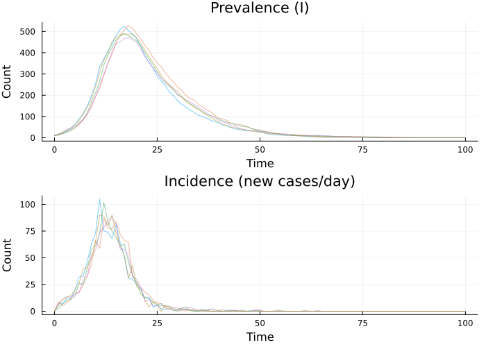

# Incidence Tracking with zero_every


## Introduction

In many epidemiological applications, we observe *incidence* (new cases
per time period) rather than prevalence. The `zero_every` feature allows
tracking cumulative counts that reset periodically.

## Model with Incidence Tracking

``` julia
using Odin
using Plots
using Statistics

sir_inc = @odin begin
    update(S) = S - n_SI
    update(I) = I + n_SI - n_IR
    update(R) = R + n_IR

    initial(S) = N - I0
    initial(I) = I0
    initial(R) = 0

    # Track new infections, reset every time step
    initial(incidence, zero_every = 1) = 0
    update(incidence) = incidence + n_SI

    p_SI = 1 - exp(-beta * I / N * dt)
    p_IR = 1 - exp(-gamma * dt)
    n_SI = Binomial(S, p_SI)
    n_IR = Binomial(I, p_IR)

    beta = parameter(0.5)
    gamma = parameter(0.1)
    I0 = parameter(10)
    N = parameter(1000)
end
```

    Odin.DustSystemGenerator{var"##OdinModel#277"}(var"##OdinModel#277"(4, [:S, :I, :R, :incidence], [:beta, :gamma, :I0, :N], false, false, false, false, false, Dict{Symbol, Array}()))

## Simulation

``` julia
pars = (beta=0.5, gamma=0.1, I0=10.0, N=1000.0)
times = collect(0.0:1.0:100.0)

result = simulate(sir_inc, pars;
    times=times, dt=1.0, seed=42, n_particles=5)
```

    4×5×101 Array{Float64, 3}:
    [:, :, 1] =
     990.0  990.0  990.0  990.0  990.0
      10.0   10.0   10.0   10.0   10.0
       0.0    0.0    0.0    0.0    0.0
       0.0    0.0    0.0    0.0    0.0

    [:, :, 2] =
     983.0  981.0  987.0  983.0  984.0
      17.0   17.0   12.0   17.0   16.0
       0.0    2.0    1.0    0.0    0.0
       7.0    9.0    3.0    7.0    6.0

    [:, :, 3] =
     976.0  976.0  980.0  972.0  973.0
      22.0   19.0   18.0   26.0   26.0
       2.0    5.0    2.0    2.0    1.0
       7.0    5.0    7.0   11.0   11.0

    ;;; … 

    [:, :, 99] =
       6.0    3.0    8.0    9.0    3.0
       1.0    0.0    0.0    0.0    0.0
     993.0  997.0  992.0  991.0  997.0
       0.0    0.0    0.0    0.0    0.0

    [:, :, 100] =
       6.0    3.0    8.0    9.0    3.0
       1.0    0.0    0.0    0.0    0.0
     993.0  997.0  992.0  991.0  997.0
       0.0    0.0    0.0    0.0    0.0

    [:, :, 101] =
       6.0    3.0    8.0    9.0    3.0
       1.0    0.0    0.0    0.0    0.0
     993.0  997.0  992.0  991.0  997.0
       0.0    0.0    0.0    0.0    0.0

## Visualising Incidence

``` julia
p1 = plot(title="Prevalence (I)", xlabel="Time", ylabel="Count")
p2 = plot(title="Incidence (new cases/day)", xlabel="Time", ylabel="Count")

for i in 1:5
    plot!(p1, times, result[2, i, :], alpha=0.5, label="")
    plot!(p2, times, result[4, i, :], alpha=0.5, label="")
end

plot(p1, p2, layout=(2, 1), size=(700, 500))
```



## Comparing Incidence to Data

In real applications, we would compare the simulated incidence to
observed data. This is the foundation for the particle filter (Vignette
05).

``` julia
# Mean incidence across particles
mean_inc = vec(mean(result[4, :, :], dims=1))
println("Peak incidence at day: ", times[argmax(mean_inc)])
println("Peak mean incidence: ", round(maximum(mean_inc), digits=1))
println("Cumulative incidence: ", round(sum(mean_inc), digits=1))
```

    Peak incidence at day: 12.0
    Peak mean incidence: 86.2
    Cumulative incidence: 984.2
