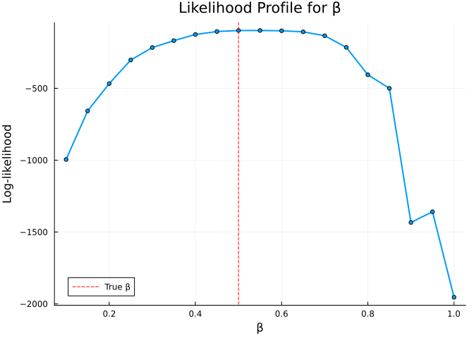

# Particle Filter and Likelihood


## Introduction

The bootstrap particle filter estimates the likelihood of observed data
given a stochastic model. This is the key ingredient for Bayesian
inference with mechanistic models.

## Model with Data Comparison

We extend the stochastic SIR to compare simulated incidence with
observed data:

``` julia
using Odin
using Plots
using Random

sir_compare = @odin begin
    update(S) = S - n_SI
    update(I) = I + n_SI - n_IR
    update(R) = R + n_IR

    initial(S) = N - I0
    initial(I) = I0
    initial(R) = 0

    initial(incidence, zero_every = 1) = 0
    update(incidence) = incidence + n_SI

    p_SI = 1 - exp(-beta * I / N * dt)
    p_IR = 1 - exp(-gamma * dt)
    n_SI = Binomial(S, p_SI)
    n_IR = Binomial(I, p_IR)

    cases = data()
    cases ~ Poisson(incidence + 1e-6)

    beta = parameter(0.5)
    gamma = parameter(0.1)
    I0 = parameter(10)
    N = parameter(1000)
end
```

    Odin.DustSystemGenerator{var"##OdinModel#277"}(var"##OdinModel#277"(4, [:S, :I, :R, :incidence], [:beta, :gamma, :I0, :N], false, false, true, false, false, Dict{Symbol, Array}()))

## Generate Synthetic Data

``` julia
# Simulate "true" epidemic
true_pars = (beta=0.5, gamma=0.1, I0=10.0, N=1000.0)
times = collect(0.0:1.0:50.0)
true_result = simulate(sir_compare, true_pars;
    times=times, dt=1.0, seed=1, n_particles=1)

# Extract incidence as "observed" data
observed_cases = Int.(round.(true_result[4, 1, 2:end]))
println("Observed cases (first 10): ", observed_cases[1:10])
```

    Observed cases (first 10): [6, 8, 5, 13, 19, 33, 39, 47, 57, 84]

## Running the Particle Filter

``` julia
# Prepare filter data
filter_data = ObservedData(
    [(time=Float64(t), cases=Float64(c)) for (t, c) in zip(times[2:end], observed_cases)]
)

# Create particle filter
filter = Likelihood(sir_compare, filter_data;
    n_particles=100, dt=1.0, seed=42)

# Run with true parameters
ll = loglik(filter, true_pars)
println("Log-likelihood at true parameters: ", round(ll, digits=2))
```

    Log-likelihood at true parameters: -98.65

## Likelihood Surface

``` julia
# Scan over beta values
betas = 0.1:0.05:1.0
lls = Float64[]
for b in betas
    pars = (beta=b, gamma=0.1, I0=10.0, N=1000.0)
    push!(lls, loglik(filter, pars))
end

plot(collect(betas), lls,
     xlabel="β", ylabel="Log-likelihood",
     title="Likelihood Profile for β",
     linewidth=2, label="",
     markershape=:circle, markersize=3)
vline!([0.5], linestyle=:dash, label="True β", color=:red)
```



The log-likelihood peaks near the true value of β = 0.5.
