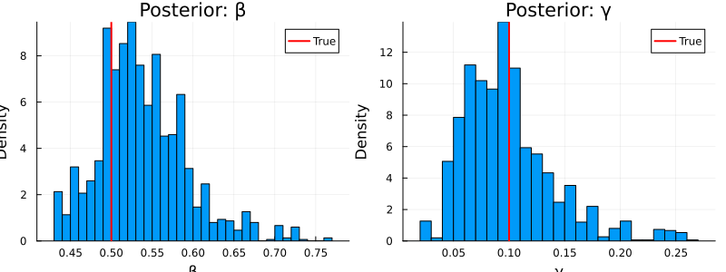
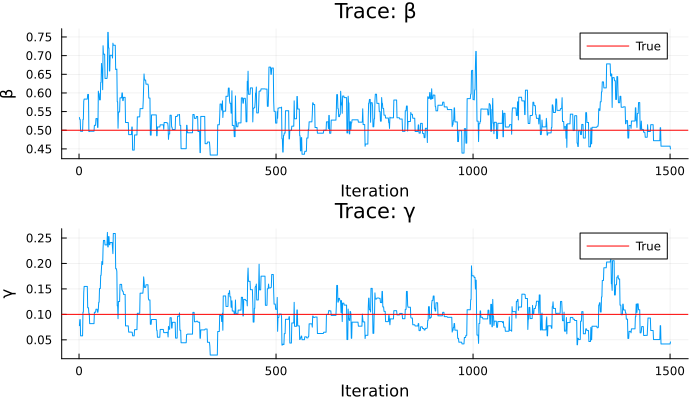

# Bayesian Inference with MCMC


## Introduction

This vignette demonstrates full Bayesian inference: fitting an SIR model
to data using a particle filter likelihood and MCMC sampling via the
Monty infrastructure.

## Model and Data

``` julia
using Odin
using Plots
using Statistics

sir = @odin begin
    update(S) = S - n_SI
    update(I) = I + n_SI - n_IR
    update(R) = R + n_IR
    initial(S) = N - I0
    initial(I) = I0
    initial(R) = 0
    initial(incidence, zero_every = 1) = 0
    update(incidence) = incidence + n_SI

    p_SI = 1 - exp(-beta * I / N * dt)
    p_IR = 1 - exp(-gamma * dt)
    n_SI = Binomial(S, p_SI)
    n_IR = Binomial(I, p_IR)

    cases = data()
    cases ~ Poisson(incidence + 1e-6)

    beta = parameter(0.5)
    gamma = parameter(0.1)
    I0 = parameter(10)
    N = parameter(1000)
end
```

    Odin.DustSystemGenerator{var"##OdinModel#277"}(var"##OdinModel#277"(4, [:S, :I, :R, :incidence], [:beta, :gamma, :I0, :N], false, false, true, false, false, Dict{Symbol, Array}()))

## Generate Synthetic Data

``` julia
true_pars = (beta=0.5, gamma=0.1, I0=10.0, N=1000.0)
times = collect(0.0:1.0:50.0)
obs_result = simulate(sir, true_pars; times=times, dt=1.0, seed=1)
observed = Int.(round.(obs_result[4, 1, 2:end]))

data = ObservedData(
    [(time=Float64(t), cases=Float64(c)) for (t, c) in zip(times[2:end], observed)]
)
```

    Odin.FilterData{@NamedTuple{cases::Float64}}([1.0, 2.0, 3.0, 4.0, 5.0, 6.0, 7.0, 8.0, 9.0, 10.0  …  41.0, 42.0, 43.0, 44.0, 45.0, 46.0, 47.0, 48.0, 49.0, 50.0], [(cases = 6.0,), (cases = 8.0,), (cases = 5.0,), (cases = 13.0,), (cases = 19.0,), (cases = 33.0,), (cases = 39.0,), (cases = 47.0,), (cases = 57.0,), (cases = 84.0,)  …  (cases = 1.0,), (cases = 0.0,), (cases = 0.0,), (cases = 0.0,), (cases = 0.0,), (cases = 0.0,), (cases = 0.0,), (cases = 0.0,), (cases = 0.0,), (cases = 0.0,)])

## Set Up Inference

``` julia
# Particle filter likelihood
filter = Likelihood(sir, data; n_particles=200, dt=1.0, seed=42)

# Parameter packer: map [beta, gamma] <-> named tuple
packer = Packer([:beta, :gamma];
    fixed=(I0=10.0, N=1000.0))

# Likelihood model
likelihood = as_model(filter, packer)

# Prior
prior = @prior begin
    beta ~ Gamma(2.0, 0.25)
    gamma ~ Gamma(2.0, 0.05)
end

# Posterior = likelihood + prior
posterior = likelihood + prior
```

    MontyModel{Odin.var"#monty_model_combine##0#monty_model_combine##1"{MontyModel{Odin.var"#dust_likelihood_monty##0#dust_likelihood_monty##1"{DustFilter{var"##OdinModel#277", Float64, @NamedTuple{cases::Float64}}, MontyPacker}, Nothing, Nothing, Nothing}, MontyModel{var"#7#8", var"#9#10"{var"#7#8"}, var"#11#12", Matrix{Float64}}}, Odin.var"#monty_model_combine##4#monty_model_combine##5"{Odin.var"#monty_model_combine##0#monty_model_combine##1"{MontyModel{Odin.var"#dust_likelihood_monty##0#dust_likelihood_monty##1"{DustFilter{var"##OdinModel#277", Float64, @NamedTuple{cases::Float64}}, MontyPacker}, Nothing, Nothing, Nothing}, MontyModel{var"#7#8", var"#9#10"{var"#7#8"}, var"#11#12", Matrix{Float64}}}}, Nothing, Matrix{Float64}}(["beta", "gamma"], Odin.var"#monty_model_combine##0#monty_model_combine##1"{MontyModel{Odin.var"#dust_likelihood_monty##0#dust_likelihood_monty##1"{DustFilter{var"##OdinModel#277", Float64, @NamedTuple{cases::Float64}}, MontyPacker}, Nothing, Nothing, Nothing}, MontyModel{var"#7#8", var"#9#10"{var"#7#8"}, var"#11#12", Matrix{Float64}}}(MontyModel{Odin.var"#dust_likelihood_monty##0#dust_likelihood_monty##1"{DustFilter{var"##OdinModel#277", Float64, @NamedTuple{cases::Float64}}, MontyPacker}, Nothing, Nothing, Nothing}(["beta", "gamma"], Odin.var"#dust_likelihood_monty##0#dust_likelihood_monty##1"{DustFilter{var"##OdinModel#277", Float64, @NamedTuple{cases::Float64}}, MontyPacker}(DustFilter{var"##OdinModel#277", Float64, @NamedTuple{cases::Float64}}(Odin.DustSystemGenerator{var"##OdinModel#277"}(var"##OdinModel#277"(4, [:S, :I, :R, :incidence], [:beta, :gamma, :I0, :N], false, false, true, false, false, Dict{Symbol, Array}())), Odin.FilterData{@NamedTuple{cases::Float64}}([1.0, 2.0, 3.0, 4.0, 5.0, 6.0, 7.0, 8.0, 9.0, 10.0  …  41.0, 42.0, 43.0, 44.0, 45.0, 46.0, 47.0, 48.0, 49.0, 50.0], [(cases = 6.0,), (cases = 8.0,), (cases = 5.0,), (cases = 13.0,), (cases = 19.0,), (cases = 33.0,), (cases = 39.0,), (cases = 47.0,), (cases = 57.0,), (cases = 84.0,)  …  (cases = 1.0,), (cases = 0.0,), (cases = 0.0,), (cases = 0.0,), (cases = 0.0,), (cases = 0.0,), (cases = 0.0,), (cases = 0.0,), (cases = 0.0,), (cases = 0.0,)]), 0.0, 200, 1.0, 42, false, nothing), MontyPacker([:beta, :gamma], [:beta, :gamma], Symbol[], Dict{Symbol, Tuple}(), Dict{Symbol, UnitRange{Int64}}(:beta => 1:1, :gamma => 2:2), 2, (I0 = 10.0, N = 1000.0), nothing)), nothing, nothing, nothing, Odin.MontyModelProperties(false, false, true, false)), MontyModel{var"#7#8", var"#9#10"{var"#7#8"}, var"#11#12", Matrix{Float64}}(["beta", "gamma"], var"#7#8"(), var"#9#10"{var"#7#8"}(var"#7#8"()), var"#11#12"(), [0.0 Inf; 0.0 Inf], Odin.MontyModelProperties(true, true, false, false))), Odin.var"#monty_model_combine##4#monty_model_combine##5"{Odin.var"#monty_model_combine##0#monty_model_combine##1"{MontyModel{Odin.var"#dust_likelihood_monty##0#dust_likelihood_monty##1"{DustFilter{var"##OdinModel#277", Float64, @NamedTuple{cases::Float64}}, MontyPacker}, Nothing, Nothing, Nothing}, MontyModel{var"#7#8", var"#9#10"{var"#7#8"}, var"#11#12", Matrix{Float64}}}}(Odin.var"#monty_model_combine##0#monty_model_combine##1"{MontyModel{Odin.var"#dust_likelihood_monty##0#dust_likelihood_monty##1"{DustFilter{var"##OdinModel#277", Float64, @NamedTuple{cases::Float64}}, MontyPacker}, Nothing, Nothing, Nothing}, MontyModel{var"#7#8", var"#9#10"{var"#7#8"}, var"#11#12", Matrix{Float64}}}(MontyModel{Odin.var"#dust_likelihood_monty##0#dust_likelihood_monty##1"{DustFilter{var"##OdinModel#277", Float64, @NamedTuple{cases::Float64}}, MontyPacker}, Nothing, Nothing, Nothing}(["beta", "gamma"], Odin.var"#dust_likelihood_monty##0#dust_likelihood_monty##1"{DustFilter{var"##OdinModel#277", Float64, @NamedTuple{cases::Float64}}, MontyPacker}(DustFilter{var"##OdinModel#277", Float64, @NamedTuple{cases::Float64}}(Odin.DustSystemGenerator{var"##OdinModel#277"}(var"##OdinModel#277"(4, [:S, :I, :R, :incidence], [:beta, :gamma, :I0, :N], false, false, true, false, false, Dict{Symbol, Array}())), Odin.FilterData{@NamedTuple{cases::Float64}}([1.0, 2.0, 3.0, 4.0, 5.0, 6.0, 7.0, 8.0, 9.0, 10.0  …  41.0, 42.0, 43.0, 44.0, 45.0, 46.0, 47.0, 48.0, 49.0, 50.0], [(cases = 6.0,), (cases = 8.0,), (cases = 5.0,), (cases = 13.0,), (cases = 19.0,), (cases = 33.0,), (cases = 39.0,), (cases = 47.0,), (cases = 57.0,), (cases = 84.0,)  …  (cases = 1.0,), (cases = 0.0,), (cases = 0.0,), (cases = 0.0,), (cases = 0.0,), (cases = 0.0,), (cases = 0.0,), (cases = 0.0,), (cases = 0.0,), (cases = 0.0,)]), 0.0, 200, 1.0, 42, false, nothing), MontyPacker([:beta, :gamma], [:beta, :gamma], Symbol[], Dict{Symbol, Tuple}(), Dict{Symbol, UnitRange{Int64}}(:beta => 1:1, :gamma => 2:2), 2, (I0 = 10.0, N = 1000.0), nothing)), nothing, nothing, nothing, Odin.MontyModelProperties(false, false, true, false)), MontyModel{var"#7#8", var"#9#10"{var"#7#8"}, var"#11#12", Matrix{Float64}}(["beta", "gamma"], var"#7#8"(), var"#9#10"{var"#7#8"}(var"#7#8"()), var"#11#12"(), [0.0 Inf; 0.0 Inf], Odin.MontyModelProperties(true, true, false, false)))), nothing, [0.0 Inf; 0.0 Inf], Odin.MontyModelProperties(true, false, true, false))

## Run MCMC

``` julia
vcv = [0.005 0.0; 0.0 0.001]
sampler = random_walk(vcv)

initial = reshape([0.4, 0.08], 2, 1)  # 2×1 matrix (n_pars × n_chains)
samples = sample(posterior, sampler, 2000;
    initial=initial, n_chains=1)
```

    Odin.MontySamples([0.4 0.4578166481085955 … 0.45735525485225986 0.44984954293669993; 0.08 0.10355724417797266 … 0.04189220765561571 0.0459598265320108;;;], [-112.17667526645329; -102.60946331459412; … ; -94.88509731586461; -95.06268952110523;;], [0.4; 0.08;;], ["beta", "gamma"], Dict{Symbol, Any}(:acceptance_rate => [0.2605]))

## Results

``` julia
beta_samples = samples.pars[1, 500:end, 1]
gamma_samples = samples.pars[2, 500:end, 1]

println("β: mean = ", round(mean(beta_samples), digits=3),
        ", 95% CI = [", round(quantile(beta_samples, 0.025), digits=3),
        ", ", round(quantile(beta_samples, 0.975), digits=3), "]")
println("γ: mean = ", round(mean(gamma_samples), digits=3),
        ", 95% CI = [", round(quantile(gamma_samples, 0.025), digits=3),
        ", ", round(quantile(gamma_samples, 0.975), digits=3), "]")
println("True: β = 0.5, γ = 0.1")
```

    β: mean = 0.538, 95% CI = [0.444, 0.669]
    γ: mean = 0.099, 95% CI = [0.042, 0.205]
    True: β = 0.5, γ = 0.1

``` julia
p1 = histogram(beta_samples, bins=30, xlabel="β", ylabel="Density",
               title="Posterior: β", normalize=true, label="")
vline!(p1, [0.5], label="True", color=:red, linewidth=2)

p2 = histogram(gamma_samples, bins=30, xlabel="γ", ylabel="Density",
               title="Posterior: γ", normalize=true, label="")
vline!(p2, [0.1], label="True", color=:red, linewidth=2)

plot(p1, p2, layout=(1, 2), size=(800, 300))
```



## Trace Plots

``` julia
p3 = plot(beta_samples, xlabel="Iteration", ylabel="β", title="Trace: β", label="")
hline!(p3, [0.5], label="True", color=:red)

p4 = plot(gamma_samples, xlabel="Iteration", ylabel="γ", title="Trace: γ", label="")
hline!(p4, [0.1], label="True", color=:red)

plot(p3, p4, layout=(2, 1), size=(700, 400))
```


