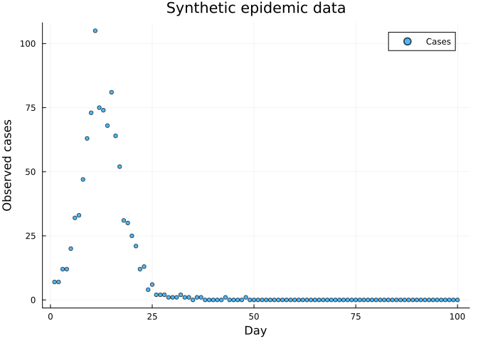
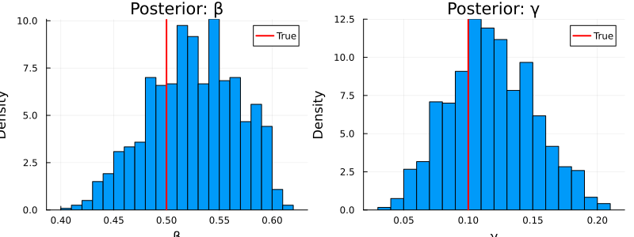
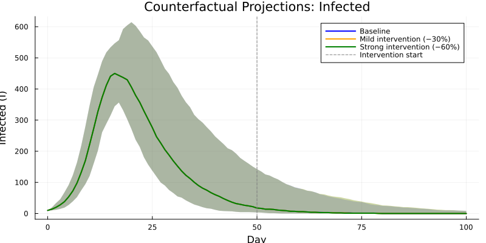
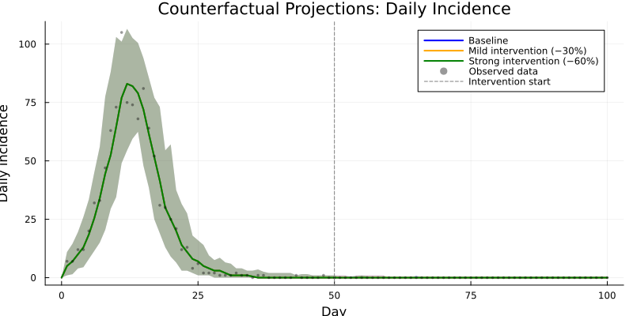
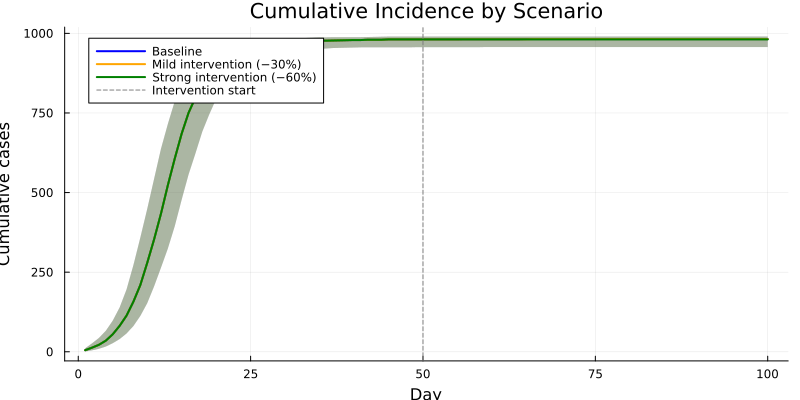

# Counterfactual Projections from Posterior


## Introduction

After fitting a model to data, a key use case is *counterfactual
analysis*: “what would have happened under a different intervention?”
This vignette shows how to:

1.  Fit a stochastic SIR model to observed case data using particle
    filter MCMC
2.  Draw parameter sets from the posterior distribution
3.  Simulate forward under different intervention scenarios
4.  Visualise projections with uncertainty (credible intervals)

This builds on the inference workflow from Vignettes 05–06 and the
time-varying parameter machinery from Vignette 08.

``` julia
using Odin
using Plots
using Statistics
using Random
```

## Model Definition

We use the same stochastic SIR with incidence tracking and Poisson
observation model as in Vignettes 05–06:

``` julia
sir = @odin begin
    update(S) = S - n_SI
    update(I) = I + n_SI - n_IR
    update(R) = R + n_IR
    initial(S) = N - I0
    initial(I) = I0
    initial(R) = 0
    initial(incidence, zero_every = 1) = 0
    update(incidence) = incidence + n_SI

    p_SI = 1 - exp(-beta * I / N * dt)
    p_IR = 1 - exp(-gamma * dt)
    n_SI = Binomial(S, p_SI)
    n_IR = Binomial(I, p_IR)

    cases = data()
    cases ~ Poisson(incidence + 1e-6)

    beta = parameter(0.5)
    gamma = parameter(0.1)
    I0 = parameter(10)
    N = parameter(1000)
end
```

    Odin.DustSystemGenerator{var"##OdinModel#277"}(var"##OdinModel#277"(4, [:S, :I, :R, :incidence], [:beta, :gamma, :I0, :N], false, false, true, false, false, Dict{Symbol, Array}()))

## Generate Synthetic Data

Simulate a 100-day epidemic to serve as our “observed” data:

``` julia
true_pars = (beta=0.5, gamma=0.1, I0=10.0, N=1000.0)
times = collect(0.0:1.0:100.0)
obs_result = simulate(sir, true_pars; times=times, dt=1.0, seed=42)
observed = Int.(round.(obs_result[4, 1, 2:end]))

scatter(1:100, observed, xlabel="Day", ylabel="Observed cases",
        title="Synthetic epidemic data", label="Cases", ms=3, alpha=0.7)
```



## Set Up Inference

``` julia
data = ObservedData(
    [(time=Float64(t), cases=Float64(c)) for (t, c) in zip(times[2:end], observed)]
)

filter = Likelihood(sir, data; n_particles=200, dt=1.0, seed=42)

packer = Packer([:beta, :gamma];
    fixed=(I0=10.0, N=1000.0))

likelihood = as_model(filter, packer)

prior = @prior begin
    beta ~ Gamma(2.0, 0.25)
    gamma ~ Gamma(2.0, 0.05)
end

posterior = likelihood + prior
```

    MontyModel{Odin.var"#monty_model_combine##0#monty_model_combine##1"{MontyModel{Odin.var"#dust_likelihood_monty##0#dust_likelihood_monty##1"{DustFilter{var"##OdinModel#277", Float64, @NamedTuple{cases::Float64}}, MontyPacker}, Nothing, Nothing, Nothing}, MontyModel{var"#7#8", var"#9#10"{var"#7#8"}, var"#11#12", Matrix{Float64}}}, Odin.var"#monty_model_combine##4#monty_model_combine##5"{Odin.var"#monty_model_combine##0#monty_model_combine##1"{MontyModel{Odin.var"#dust_likelihood_monty##0#dust_likelihood_monty##1"{DustFilter{var"##OdinModel#277", Float64, @NamedTuple{cases::Float64}}, MontyPacker}, Nothing, Nothing, Nothing}, MontyModel{var"#7#8", var"#9#10"{var"#7#8"}, var"#11#12", Matrix{Float64}}}}, Nothing, Matrix{Float64}}(["beta", "gamma"], Odin.var"#monty_model_combine##0#monty_model_combine##1"{MontyModel{Odin.var"#dust_likelihood_monty##0#dust_likelihood_monty##1"{DustFilter{var"##OdinModel#277", Float64, @NamedTuple{cases::Float64}}, MontyPacker}, Nothing, Nothing, Nothing}, MontyModel{var"#7#8", var"#9#10"{var"#7#8"}, var"#11#12", Matrix{Float64}}}(MontyModel{Odin.var"#dust_likelihood_monty##0#dust_likelihood_monty##1"{DustFilter{var"##OdinModel#277", Float64, @NamedTuple{cases::Float64}}, MontyPacker}, Nothing, Nothing, Nothing}(["beta", "gamma"], Odin.var"#dust_likelihood_monty##0#dust_likelihood_monty##1"{DustFilter{var"##OdinModel#277", Float64, @NamedTuple{cases::Float64}}, MontyPacker}(DustFilter{var"##OdinModel#277", Float64, @NamedTuple{cases::Float64}}(Odin.DustSystemGenerator{var"##OdinModel#277"}(var"##OdinModel#277"(4, [:S, :I, :R, :incidence], [:beta, :gamma, :I0, :N], false, false, true, false, false, Dict{Symbol, Array}())), Odin.FilterData{@NamedTuple{cases::Float64}}([1.0, 2.0, 3.0, 4.0, 5.0, 6.0, 7.0, 8.0, 9.0, 10.0  …  91.0, 92.0, 93.0, 94.0, 95.0, 96.0, 97.0, 98.0, 99.0, 100.0], [(cases = 7.0,), (cases = 7.0,), (cases = 12.0,), (cases = 12.0,), (cases = 20.0,), (cases = 32.0,), (cases = 33.0,), (cases = 47.0,), (cases = 63.0,), (cases = 73.0,)  …  (cases = 0.0,), (cases = 0.0,), (cases = 0.0,), (cases = 0.0,), (cases = 0.0,), (cases = 0.0,), (cases = 0.0,), (cases = 0.0,), (cases = 0.0,), (cases = 0.0,)]), 0.0, 200, 1.0, 42, false, nothing), MontyPacker([:beta, :gamma], [:beta, :gamma], Symbol[], Dict{Symbol, Tuple}(), Dict{Symbol, UnitRange{Int64}}(:beta => 1:1, :gamma => 2:2), 2, (I0 = 10.0, N = 1000.0), nothing)), nothing, nothing, nothing, Odin.MontyModelProperties(false, false, true, false)), MontyModel{var"#7#8", var"#9#10"{var"#7#8"}, var"#11#12", Matrix{Float64}}(["beta", "gamma"], var"#7#8"(), var"#9#10"{var"#7#8"}(var"#7#8"()), var"#11#12"(), [0.0 Inf; 0.0 Inf], Odin.MontyModelProperties(true, true, false, false))), Odin.var"#monty_model_combine##4#monty_model_combine##5"{Odin.var"#monty_model_combine##0#monty_model_combine##1"{MontyModel{Odin.var"#dust_likelihood_monty##0#dust_likelihood_monty##1"{DustFilter{var"##OdinModel#277", Float64, @NamedTuple{cases::Float64}}, MontyPacker}, Nothing, Nothing, Nothing}, MontyModel{var"#7#8", var"#9#10"{var"#7#8"}, var"#11#12", Matrix{Float64}}}}(Odin.var"#monty_model_combine##0#monty_model_combine##1"{MontyModel{Odin.var"#dust_likelihood_monty##0#dust_likelihood_monty##1"{DustFilter{var"##OdinModel#277", Float64, @NamedTuple{cases::Float64}}, MontyPacker}, Nothing, Nothing, Nothing}, MontyModel{var"#7#8", var"#9#10"{var"#7#8"}, var"#11#12", Matrix{Float64}}}(MontyModel{Odin.var"#dust_likelihood_monty##0#dust_likelihood_monty##1"{DustFilter{var"##OdinModel#277", Float64, @NamedTuple{cases::Float64}}, MontyPacker}, Nothing, Nothing, Nothing}(["beta", "gamma"], Odin.var"#dust_likelihood_monty##0#dust_likelihood_monty##1"{DustFilter{var"##OdinModel#277", Float64, @NamedTuple{cases::Float64}}, MontyPacker}(DustFilter{var"##OdinModel#277", Float64, @NamedTuple{cases::Float64}}(Odin.DustSystemGenerator{var"##OdinModel#277"}(var"##OdinModel#277"(4, [:S, :I, :R, :incidence], [:beta, :gamma, :I0, :N], false, false, true, false, false, Dict{Symbol, Array}())), Odin.FilterData{@NamedTuple{cases::Float64}}([1.0, 2.0, 3.0, 4.0, 5.0, 6.0, 7.0, 8.0, 9.0, 10.0  …  91.0, 92.0, 93.0, 94.0, 95.0, 96.0, 97.0, 98.0, 99.0, 100.0], [(cases = 7.0,), (cases = 7.0,), (cases = 12.0,), (cases = 12.0,), (cases = 20.0,), (cases = 32.0,), (cases = 33.0,), (cases = 47.0,), (cases = 63.0,), (cases = 73.0,)  …  (cases = 0.0,), (cases = 0.0,), (cases = 0.0,), (cases = 0.0,), (cases = 0.0,), (cases = 0.0,), (cases = 0.0,), (cases = 0.0,), (cases = 0.0,), (cases = 0.0,)]), 0.0, 200, 1.0, 42, false, nothing), MontyPacker([:beta, :gamma], [:beta, :gamma], Symbol[], Dict{Symbol, Tuple}(), Dict{Symbol, UnitRange{Int64}}(:beta => 1:1, :gamma => 2:2), 2, (I0 = 10.0, N = 1000.0), nothing)), nothing, nothing, nothing, Odin.MontyModelProperties(false, false, true, false)), MontyModel{var"#7#8", var"#9#10"{var"#7#8"}, var"#11#12", Matrix{Float64}}(["beta", "gamma"], var"#7#8"(), var"#9#10"{var"#7#8"}(var"#7#8"()), var"#11#12"(), [0.0 Inf; 0.0 Inf], Odin.MontyModelProperties(true, true, false, false)))), nothing, [0.0 Inf; 0.0 Inf], Odin.MontyModelProperties(true, false, true, false))

## Run MCMC

We run 500 iterations across 4 chains, discarding 200 as burn-in:

``` julia
vcv = [0.0004 0.0; 0.0 0.00025]
sampler = random_walk(vcv)

initial = repeat([0.5, 0.1], 1, 4)
samples = sample(posterior, sampler, 500;
    n_chains=4, initial=initial, n_burnin=200)
```

    Odin.MontySamples([0.49437823850732826 0.49437823850732826 … 0.4566291310556328 0.4563731363716816; 0.0919995187825554 0.0919995187825554 … 0.07409620491486334 0.07888417889227739;;; 0.4962022350248883 0.4962022350248883 … 0.550625010954722 0.5574132564077641; 0.0747845366225706 0.0747845366225706 … 0.17641645884129958 0.1733152749043613;;; 0.5984801605583616 0.5984801605583616 … 0.5167470684094274 0.49753620465483595; 0.18620227270881481 0.18620227270881481 … 0.08746173307235128 0.08264297727060793;;; 0.5803246915470877 0.5441785079651473 … 0.45790479627213376 0.45790479627213376; 0.16877760950164053 0.1723624073642432 … 0.0682837529525733 0.0682837529525733], [-105.93764646044522 -106.94088887900911 -107.49997246914747 -106.85816994111362; -105.93764646044522 -106.94088887900911 -107.49997246914747 -108.83687244362953; … ; -106.14921737330135 -107.90380816889471 -106.43411282825788 -105.61253299121859; -106.75477046668497 -108.20845020329413 -106.09940979794196 -105.61253299121859], [0.5 0.5 0.5 0.5; 0.1 0.1 0.1 0.1], ["beta", "gamma"], Dict{Symbol, Any}(:acceptance_rate => [0.538, 0.546, 0.588, 0.556]))

## Examine Posterior

``` julia
posterior_beta = vec(samples.pars[1, :, :])
posterior_gamma = vec(samples.pars[2, :, :])

println("β: mean = ", round(mean(posterior_beta), digits=3),
        ", 95% CI = [", round(quantile(posterior_beta, 0.025), digits=3),
        ", ", round(quantile(posterior_beta, 0.975), digits=3), "]")
println("γ: mean = ", round(mean(posterior_gamma), digits=3),
        ", 95% CI = [", round(quantile(posterior_gamma, 0.025), digits=3),
        ", ", round(quantile(posterior_gamma, 0.975), digits=3), "]")
println("True: β = 0.5, γ = 0.1")
```

    β: mean = 0.526, 95% CI = [0.441, 0.596]
    γ: mean = 0.118, 95% CI = [0.059, 0.184]
    True: β = 0.5, γ = 0.1

``` julia
p1 = histogram(posterior_beta, bins=30, xlabel="β", ylabel="Density",
               title="Posterior: β", normalize=true, label="")
vline!(p1, [0.5], label="True", color=:red, linewidth=2)

p2 = histogram(posterior_gamma, bins=30, xlabel="γ", ylabel="Density",
               title="Posterior: γ", normalize=true, label="")
vline!(p2, [0.1], label="True", color=:red, linewidth=2)

plot(p1, p2, layout=(1, 2), size=(800, 300))
```



## Define Projection Model

For forward projections we need a model with **time-varying β** so that
we can implement interventions at a specified day. We use
`interpolate()` with `:constant` mode (a step function) — see Vignette
08 for details:

``` julia
sir_proj = @odin begin
    update(S) = S - n_SI
    update(I) = I + n_SI - n_IR
    update(R) = R + n_IR
    initial(S) = N - I0
    initial(I) = I0
    initial(R) = 0
    initial(incidence, zero_every = 1) = 0
    update(incidence) = incidence + n_SI

    beta = interpolate(beta_time, beta_value, :constant)
    p_SI = 1 - exp(-beta * I / N * dt)
    p_IR = 1 - exp(-gamma * dt)
    n_SI = Binomial(S, p_SI)
    n_IR = Binomial(I, p_IR)

    beta_time = parameter(rank=1)
    beta_value = parameter(rank=1)
    gamma = parameter(0.1)
    I0 = parameter(10)
    N = parameter(1000)
end
```

    Odin.DustSystemGenerator{var"##OdinModel#281"}(var"##OdinModel#281"(4, [:S, :I, :R, :incidence], [:beta_time, :beta_value, :gamma, :I0, :N], false, false, false, false, true, Dict{Symbol, Array}()))

## Define Scenarios

Three intervention scenarios that diverge at day 50:

| Scenario            | β from day 0 | β from day 50        |
|---------------------|--------------|----------------------|
| Baseline            | fitted β     | fitted β (unchanged) |
| Mild intervention   | fitted β     | 70% of fitted β      |
| Strong intervention | fitted β     | 40% of fitted β      |

``` julia
scenarios = [
    (name="Baseline",
     beta_schedule = β -> ([0.0, 200.0], [β, β])),
    (name="Mild intervention (−30%)",
     beta_schedule = β -> ([0.0, 50.0], [β, β * 0.7])),
    (name="Strong intervention (−60%)",
     beta_schedule = β -> ([0.0, 50.0], [β, β * 0.4])),
]
```

    3-element Vector{NamedTuple{(:name, :beta_schedule)}}:
     (name = "Baseline", beta_schedule = var"#16#17"())
     (name = "Mild intervention (−30%)", beta_schedule = var"#18#19"())
     (name = "Strong intervention (−60%)", beta_schedule = var"#20#21"())

## Run Counterfactual Projections

For each scenario we sample 100 parameter sets from the posterior and
simulate the full epidemic trajectory. All scenarios use the same
posterior draws so that differences are driven purely by the
intervention:

``` julia
n_proj = 100
proj_times = collect(0.0:1.0:100.0)
n_times = length(proj_times)

Random.seed!(42)
idx = rand(1:length(posterior_beta), n_proj)

results = Dict{String, NamedTuple}()

for scenario in scenarios
    I_traj = zeros(n_proj, n_times)
    inc_traj = zeros(n_proj, n_times)

    for j in 1:n_proj
        β = posterior_beta[idx[j]]
        γ = posterior_gamma[idx[j]]
        bt, bv = scenario.beta_schedule(β)

        pars = (
            beta_time = bt,
            beta_value = bv,
            gamma = γ,
            I0 = 10.0,
            N = 1000.0,
        )

        sys = System(sir_proj, pars; dt=1.0, seed=j)
        reset!(sys)
        r = simulate(sys, proj_times)

        I_traj[j, :] = r[2, 1, :]
        inc_traj[j, :] = r[4, 1, :]
    end

    results[scenario.name] = (I=I_traj, inc=inc_traj)
end
```

## Plot Infection Trajectories

``` julia
colors = [:blue, :orange, :green]

p = plot(xlabel="Day", ylabel="Infected (I)",
         title="Counterfactual Projections: Infected",
         size=(800, 400), legend=:topright)

for (k, scenario) in enumerate(scenarios)
    I_traj = results[scenario.name].I
    med = [median(I_traj[:, t]) for t in 1:n_times]
    lo  = [quantile(I_traj[:, t], 0.025) for t in 1:n_times]
    hi  = [quantile(I_traj[:, t], 0.975) for t in 1:n_times]

    plot!(p, proj_times, med,
          ribbon=(med .- lo, hi .- med),
          fillalpha=0.2, lw=2, color=colors[k],
          label=scenario.name)
end

vline!(p, [50.0], ls=:dash, color=:gray, label="Intervention start")
p
```



The baseline (blue) reproduces the fitted epidemic. The mild (orange)
and strong (green) interventions increasingly suppress the peak, with
uncertainty bands reflecting posterior parameter uncertainty.

## Plot Daily Incidence

Overlay the observed data to see how the counterfactual scenarios
compare:

``` julia
p_inc = plot(xlabel="Day", ylabel="Daily incidence",
             title="Counterfactual Projections: Daily Incidence",
             size=(800, 400), legend=:topright)

for (k, scenario) in enumerate(scenarios)
    inc_traj = results[scenario.name].inc
    med = [median(inc_traj[:, t]) for t in 1:n_times]
    lo  = [quantile(inc_traj[:, t], 0.025) for t in 1:n_times]
    hi  = [quantile(inc_traj[:, t], 0.975) for t in 1:n_times]

    plot!(p_inc, proj_times, med,
          ribbon=(med .- lo, hi .- med),
          fillalpha=0.2, lw=2, color=colors[k],
          label=scenario.name)
end

scatter!(p_inc, 1.0:100.0, Float64.(observed), ms=2, alpha=0.4,
         color=:black, label="Observed data")
vline!(p_inc, [50.0], ls=:dash, color=:gray, label="Intervention start")
p_inc
```



## Compare Cumulative Cases

``` julia
p_cum = plot(xlabel="Day", ylabel="Cumulative cases",
             title="Cumulative Incidence by Scenario",
             size=(800, 400), legend=:topleft)

for (k, scenario) in enumerate(scenarios)
    inc_traj = results[scenario.name].inc
    cum_traj = cumsum(inc_traj[:, 2:end], dims=2)

    days = 1.0:100.0
    med = [median(cum_traj[:, t]) for t in 1:size(cum_traj, 2)]
    lo  = [quantile(cum_traj[:, t], 0.025) for t in 1:size(cum_traj, 2)]
    hi  = [quantile(cum_traj[:, t], 0.975) for t in 1:size(cum_traj, 2)]

    plot!(p_cum, days, med,
          ribbon=(med .- lo, hi .- med),
          fillalpha=0.2, lw=2, color=colors[k],
          label=scenario.name)
end

vline!(p_cum, [50.0], ls=:dash, color=:gray, label="Intervention start")
p_cum
```



``` julia
println("\nCumulative cases at day 100 (median [95% CI]):")
for scenario in scenarios
    inc_traj = results[scenario.name].inc
    total = vec(sum(inc_traj[:, 2:end], dims=2))
    println("  ", scenario.name, ": ",
            round(Int, median(total)),
            " [", round(Int, quantile(total, 0.025)),
            ", ", round(Int, quantile(total, 0.975)), "]")
end
```


    Cumulative cases at day 100 (median [95% CI]):
      Baseline: 982 [957, 990]
      Mild intervention (−30%): 982 [957, 990]
      Strong intervention (−60%): 981 [957, 990]

## Summary

| Step | API |
|----|----|
| Fit model | `sample(posterior, sampler, n_steps; n_chains, n_burnin)` |
| Extract posterior | `samples.pars[param, step, chain]` |
| Projection model | `@odin` with `interpolate()` for time-varying β |
| Simulate scenario | `System()` + `simulate()` per draw |
| Summarise | Median + quantiles across posterior draws |

Counterfactual projections leverage the full posterior uncertainty,
naturally propagating parameter uncertainty into scenario comparisons.
The same workflow extends to more complex models (SEIR, age-structured,
vaccination) and richer intervention scenarios.
