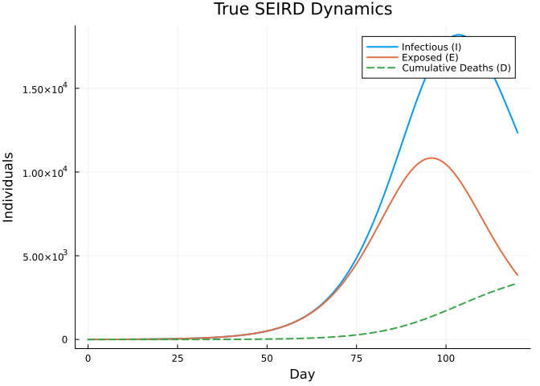
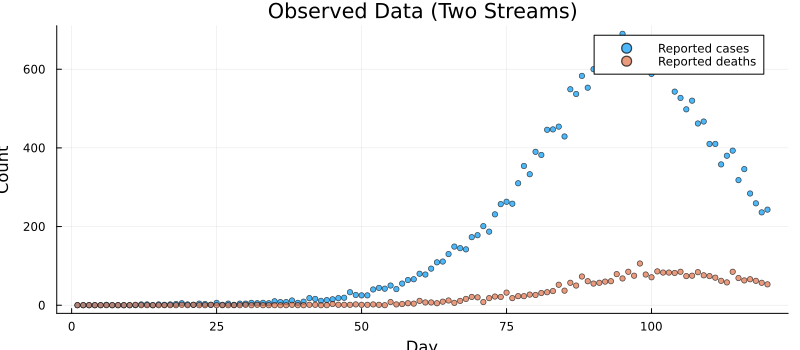
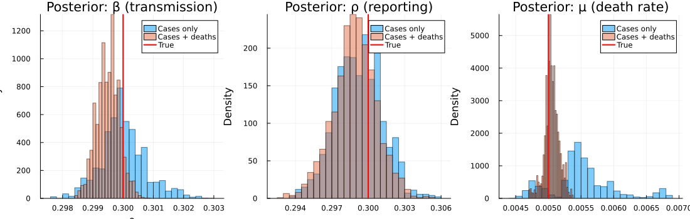
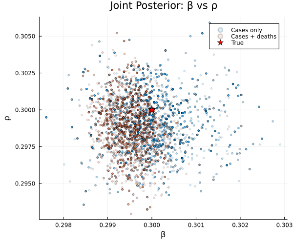
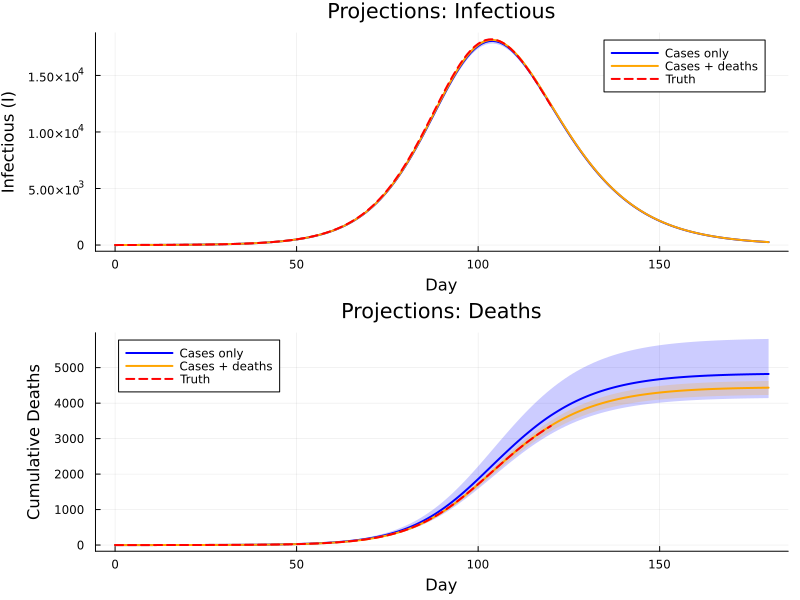

# Multi-Stream Outbreak Inference


## Introduction

Real-world outbreak surveillance rarely delivers a single, clean data
stream. Instead, public health agencies collect **multiple overlapping
signals** — case notifications, death reports, serological surveys,
wastewater concentrations — each with its own noise, bias and delay.
Fitting to a single stream can leave key parameters poorly identified:
for instance, the reporting rate ρ and the transmission rate β may be
confounded because only the product ρ × β is constrained by case data.

This vignette demonstrates how to:

1.  Build a deterministic **SEIRD** ODE model with **two comparison
    operators**
2.  Generate synthetic case and death data
3.  Fit the model using only case data (*single-stream*)
4.  Fit the model using cases **and** deaths (*multi-stream*)
5.  Compare posteriors to show how additional data streams tighten
    inference

The approach is inspired by the
[mpoxseir](https://github.com/mrc-ide/mpoxseir) package, which fits mpox
transmission models to multiple surveillance data streams
simultaneously.

``` julia
using Odin
using Distributions
using Plots
using Statistics
using LinearAlgebra: diagm
using Random
```

## Model Definition

### SEIRD dynamics

We define a deterministic SEIRD model:

- **S → E**: susceptible individuals become exposed at rate β S I / N
- **E → I**: exposed progress to infectious at rate σ (mean latent
  period 1/σ)
- **I → R**: infectious individuals recover at rate γ
- **I → D**: infectious individuals die at rate μ

Only a fraction ρ of new infections are **reported as cases**, and a
(typically higher) fraction ρ_d of deaths are **reported**.

At each data time point the unfilter evaluates the ODE state and
compares the instantaneous flow rates to observed counts via Poisson
log-likelihoods. Each `~` statement contributes additively to the total
log-likelihood:

$$\ell = \sum_t \bigl[\log p(\text{cases}_t \mid \lambda_c(t)) + \log p(\text{deaths}_t \mid \lambda_d(t))\bigr]$$

> **Note:** Comparing the instantaneous rate against a daily count is a
> standard approximation that works well when the dynamics are smooth
> relative to the observation interval.

### Multi-stream model (cases + deaths)

``` julia
seird_multi = @odin begin
    deriv(S) = -beta * S * I / N
    deriv(E) = beta * S * I / N - sigma * E
    deriv(I) = sigma * E - gamma * I - mu * I
    deriv(R) = gamma * I
    deriv(D) = mu * I

    initial(S) = N - E0
    initial(E) = E0
    initial(I) = 0
    initial(R) = 0
    initial(D) = 0

    # Parameters
    N = parameter(100000.0)
    E0 = parameter(10.0)
    beta = parameter(0.3)
    sigma = parameter(0.2)      # 5-day mean latent period
    gamma = parameter(0.1)      # 10-day mean infectious period
    mu = parameter(0.005)       # death rate from I
    rho = parameter(0.3)        # case reporting rate
    rho_d = parameter(0.9)      # death reporting rate

    # Two data streams
    reported_cases = data()
    reported_deaths = data()
    reported_cases ~ Poisson(rho * sigma * E + 1e-6)
    reported_deaths ~ Poisson(rho_d * mu * I + 1e-6)
end
```

    Odin.DustSystemGenerator{var"##OdinModel#277"}(var"##OdinModel#277"(5, [:S, :E, :I, :R, :D], [:N, :E0, :beta, :sigma, :gamma, :mu, :rho, :rho_d], true, false, true, false, false, Dict{Symbol, Array}()))

### Single-stream model (cases only)

For comparison we define a model with **identical dynamics** but only
one comparison statement. Because the death likelihood is absent, the
data cannot directly constrain μ.

``` julia
seird_cases = @odin begin
    deriv(S) = -beta * S * I / N
    deriv(E) = beta * S * I / N - sigma * E
    deriv(I) = sigma * E - gamma * I - mu * I
    deriv(R) = gamma * I
    deriv(D) = mu * I

    initial(S) = N - E0
    initial(E) = E0
    initial(I) = 0
    initial(R) = 0
    initial(D) = 0

    N = parameter(100000.0)
    E0 = parameter(10.0)
    beta = parameter(0.3)
    sigma = parameter(0.2)
    gamma = parameter(0.1)
    mu = parameter(0.005)
    rho = parameter(0.3)

    # Single data stream
    reported_cases = data()
    reported_cases ~ Poisson(rho * sigma * E + 1e-6)
end
```

    Odin.DustSystemGenerator{var"##OdinModel#278"}(var"##OdinModel#278"(5, [:S, :E, :I, :R, :D], [:N, :E0, :beta, :sigma, :gamma, :mu, :rho], true, false, true, false, false, Dict{Symbol, Array}()))

## Synthetic Data

### True parameters

``` julia
true_pars = (
    N = 100000.0,
    E0 = 10.0,
    beta = 0.3,
    sigma = 0.2,
    gamma = 0.1,
    mu = 0.005,
    rho = 0.3,
    rho_d = 0.9,
)

R0 = true_pars.beta / (true_pars.gamma + true_pars.mu)
cfr = true_pars.mu / (true_pars.gamma + true_pars.mu)
println("R₀ = ", round(R0, digits=2))
println("Case fatality ratio = ", round(100 * cfr, digits=1), "%")
```

    R₀ = 2.86
    Case fatality ratio = 4.8%

### Simulate the ODE

``` julia
times = collect(0.0:1.0:120.0)
result = simulate(seird_multi, true_pars; times=times, seed=1)

true_S = result[1, 1, :]
true_E = result[2, 1, :]
true_I = result[3, 1, :]
true_D = result[5, 1, :]
```

    121-element Vector{Float64}:
        0.0
        0.004542595262782869
        0.016691138820042205
        0.034855779617763094
        0.05806752934775733
        0.08578220776018268
        0.1177505089357978
        0.15393205445914826
        0.19443908144641295
        0.2395000956528348
        ⋮
     2778.6325452287674
     2859.000152466352
     2937.160665951919
     3012.99040866865
     3086.3874510692945
     3157.272225056838
     3225.585893951305
     3291.2886434059833
     3354.359368734131

``` julia
p_dyn = plot(times, true_I, label="Infectious (I)", lw=2,
             xlabel="Day", ylabel="Individuals",
             title="True SEIRD Dynamics", legend=:topright)
plot!(p_dyn, times, true_E, label="Exposed (E)", lw=2)
plot!(p_dyn, times, true_D, label="Cumulative Deaths (D)", lw=2, ls=:dash)
p_dyn
```



### Generate observations

At each day we draw reported cases and deaths from the instantaneous
flow rates, matching the comparison model.

``` julia
Random.seed!(42)
obs_times = times[2:end]
E_obs = true_E[2:end]
I_obs = true_I[2:end]

expected_cases  = true_pars.rho   .* true_pars.sigma .* E_obs
expected_deaths = true_pars.rho_d .* true_pars.mu    .* I_obs

obs_cases  = [rand(Poisson(max(λ, 1e-10))) for λ in expected_cases]
obs_deaths = [rand(Poisson(max(λ, 1e-10))) for λ in expected_deaths]
```

    120-element Vector{Int64}:
      0
      0
      0
      0
      0
      0
      0
      0
      0
      0
      ⋮
     62
     58
     85
     69
     63
     66
     62
     57
     53

``` julia
p_data = plot(xlabel="Day", ylabel="Count",
              title="Observed Data (Two Streams)",
              size=(800, 350), legend=:topright)
scatter!(p_data, obs_times, obs_cases,  ms=3, alpha=0.7, label="Reported cases")
scatter!(p_data, obs_times, obs_deaths, ms=3, alpha=0.7, label="Reported deaths")
p_data
```



### Prepare data objects

The multi-stream data includes both columns; the single-stream data only
cases.

``` julia
data_multi = ObservedData([
    (time=Float64(t), reported_cases=Float64(c), reported_deaths=Float64(d))
    for (t, c, d) in zip(obs_times, obs_cases, obs_deaths)
])

data_cases = ObservedData([
    (time=Float64(t), reported_cases=Float64(c))
    for (t, c) in zip(obs_times, obs_cases)
])
```

    Odin.FilterData{@NamedTuple{reported_cases::Float64}}([1.0, 2.0, 3.0, 4.0, 5.0, 6.0, 7.0, 8.0, 9.0, 10.0  …  111.0, 112.0, 113.0, 114.0, 115.0, 116.0, 117.0, 118.0, 119.0, 120.0], [(reported_cases = 0.0,), (reported_cases = 0.0,), (reported_cases = 0.0,), (reported_cases = 0.0,), (reported_cases = 0.0,), (reported_cases = 1.0,), (reported_cases = 0.0,), (reported_cases = 0.0,), (reported_cases = 0.0,), (reported_cases = 0.0,)  …  (reported_cases = 410.0,), (reported_cases = 358.0,), (reported_cases = 380.0,), (reported_cases = 393.0,), (reported_cases = 318.0,), (reported_cases = 346.0,), (reported_cases = 284.0,), (reported_cases = 259.0,), (reported_cases = 236.0,), (reported_cases = 243.0,)])

## Priors

We fit three parameters — β (transmission rate), ρ (case reporting
fraction), and μ (death rate) — keeping all others fixed at their true
values.

``` julia
prior = @prior begin
    beta ~ Gamma(3.0, 0.1)      # mean 0.3, moderate uncertainty
    rho  ~ Beta(3.0, 7.0)       # mean 0.3
    mu   ~ Gamma(2.0, 0.0025)   # mean 0.005
end
```

    MontyModel{var"#16#17", var"#18#19"{var"#16#17"}, var"#20#21", Matrix{Float64}}(["beta", "rho", "mu"], var"#16#17"(), var"#18#19"{var"#16#17"}(var"#16#17"()), var"#20#21"(), [0.0 Inf; 0.0 1.0; 0.0 Inf], Odin.MontyModelProperties(true, true, false, false))

We need separate packers because the two models have different parameter
sets:

``` julia
packer_cases = Packer([:beta, :rho, :mu];
    fixed=(N=100000.0, E0=10.0, sigma=0.2, gamma=0.1))

packer_multi = Packer([:beta, :rho, :mu];
    fixed=(N=100000.0, E0=10.0, sigma=0.2, gamma=0.1, rho_d=0.9))
```

    MontyPacker([:beta, :rho, :mu], [:beta, :rho, :mu], Symbol[], Dict{Symbol, Tuple}(), Dict{Symbol, UnitRange{Int64}}(:beta => 1:1, :mu => 3:3, :rho => 2:2), 3, (N = 100000.0, E0 = 10.0, sigma = 0.2, gamma = 0.1, rho_d = 0.9), nothing)

## Single-Stream Inference (Cases Only)

``` julia
uf_cases = Likelihood(seird_cases, data_cases; time_start=0.0)
ll_cases = as_model(uf_cases, packer_cases)
posterior_cases = ll_cases + prior

ll_at_truth = ll_cases([true_pars.beta, true_pars.rho, true_pars.mu])
println("Log-likelihood at true parameters (cases only): ",
        round(ll_at_truth, digits=2))
```

    Log-likelihood at true parameters (cases only): -393.42

``` julia
vcv = diagm([0.001, 0.005, 0.000001])
sampler = adaptive_mh(vcv)

initial = reshape([0.3, 0.3, 0.005], 3, 1)
samples_cases = sample(posterior_cases, sampler, 5000;
    initial=initial, n_chains=1, n_burnin=1000, seed=42)
```

    Odin.MontySamples([0.2996790312291133 0.2996790312291133 … 0.2984058226521222 0.2984058226521222; 0.296558786489021 0.296558786489021 … 0.29641483560069126 0.29641483560069126; 0.004980133788119273 0.004980133788119273 … 0.00452248357855978 0.00452248357855978;;;], [-386.0755954022559; -386.0755954022559; … ; -386.35980122993385; -386.35980122993385;;], [0.3; 0.3; 0.005;;], ["beta", "rho", "mu"], Dict{Symbol, Any}(:acceptance_rate => [0.2474]))

## Multi-Stream Inference (Cases + Deaths)

``` julia
uf_multi = Likelihood(seird_multi, data_multi; time_start=0.0)
ll_multi = as_model(uf_multi, packer_multi)
posterior_multi = ll_multi + prior

ll_at_truth_multi = ll_multi([true_pars.beta, true_pars.rho, true_pars.mu])
println("Log-likelihood at true parameters (multi-stream): ",
        round(ll_at_truth_multi, digits=2))
```

    Log-likelihood at true parameters (multi-stream): -646.99

``` julia
samples_multi = sample(posterior_multi, sampler, 5000;
    initial=initial, n_chains=1, n_burnin=1000, seed=42)
```

    Odin.MontySamples([0.29952928297174564 0.29952928297174564 … 0.29915539463959523 0.29915539463959523; 0.2975201003613681 0.2975201003613681 … 0.2967292685227886 0.2967292685227886; 0.00494212283526462 0.00494212283526462 … 0.0047483083270744054 0.0047483083270744054;;;], [-639.7277928699692; -639.7277928699692; … ; -644.4509770061409; -644.4509770061409;;], [0.3; 0.3; 0.005;;], ["beta", "rho", "mu"], Dict{Symbol, Any}(:acceptance_rate => [0.244]))

## Posterior Comparison

``` julia
beta_c = samples_cases.pars[1, :, 1]
rho_c  = samples_cases.pars[2, :, 1]
mu_c   = samples_cases.pars[3, :, 1]

beta_m = samples_multi.pars[1, :, 1]
rho_m  = samples_multi.pars[2, :, 1]
mu_m   = samples_multi.pars[3, :, 1]
```

    4000-element Vector{Float64}:
     0.00494212283526462
     0.00494212283526462
     0.004943446908437733
     0.004943446908437733
     0.004943446908437733
     0.004943446908437733
     0.004943446908437733
     0.004943446908437733
     0.004939753136447237
     0.004939753136447237
     ⋮
     0.004748995482436466
     0.004748995482436466
     0.004748995482436466
     0.004748995482436466
     0.004748995482436466
     0.004748995482436466
     0.0047483083270744054
     0.0047483083270744054
     0.0047483083270744054

``` julia
function summarise(name, vals, truth)
    m  = round(mean(vals), sigdigits=3)
    lo = round(quantile(vals, 0.025), sigdigits=3)
    hi = round(quantile(vals, 0.975), sigdigits=3)
    w  = round(hi - lo, sigdigits=3)
    println("  $name: $m [$lo, $hi]  (width=$w, true=$truth)")
end

println("Single-stream (cases only):")
summarise("β", beta_c, 0.3)
summarise("ρ", rho_c, 0.3)
summarise("μ", mu_c, 0.005)

println("\nMulti-stream (cases + deaths):")
summarise("β", beta_m, 0.3)
summarise("ρ", rho_m, 0.3)
summarise("μ", mu_m, 0.005)
```

    Single-stream (cases only):
      β: 0.3 [0.299, 0.302]  (width=0.003, true=0.3)
      ρ: 0.299 [0.295, 0.303]  (width=0.008, true=0.3)
      μ: 0.00552 [0.00469, 0.00673]  (width=0.00204, true=0.005)

    Multi-stream (cases + deaths):
      β: 0.299 [0.299, 0.3]  (width=0.001, true=0.3)
      ρ: 0.299 [0.295, 0.302]  (width=0.007, true=0.3)
      μ: 0.00505 [0.00481, 0.00527]  (width=0.00046, true=0.005)

### Marginal posterior densities

``` julia
p1 = histogram(beta_c, bins=40, alpha=0.5, normalize=true, label="Cases only",
               xlabel="β", ylabel="Density", title="Posterior: β (transmission)")
histogram!(p1, beta_m, bins=40, alpha=0.5, normalize=true, label="Cases + deaths")
vline!(p1, [0.3], color=:red, lw=2, label="True")

p2 = histogram(rho_c, bins=40, alpha=0.5, normalize=true, label="Cases only",
               xlabel="ρ", ylabel="Density", title="Posterior: ρ (reporting)")
histogram!(p2, rho_m, bins=40, alpha=0.5, normalize=true, label="Cases + deaths")
vline!(p2, [0.3], color=:red, lw=2, label="True")

p3 = histogram(mu_c, bins=40, alpha=0.5, normalize=true, label="Cases only",
               xlabel="μ", ylabel="Density", title="Posterior: μ (death rate)")
histogram!(p3, mu_m, bins=40, alpha=0.5, normalize=true, label="Cases + deaths")
vline!(p3, [0.005], color=:red, lw=2, label="True")

plot(p1, p2, p3, layout=(1, 3), size=(1100, 350))
```



The death data is particularly informative for μ and ρ:

- **μ (death rate)**: With cases only, μ is weakly identified because
  deaths are not directly observed. Adding the death stream pins μ down.
- **ρ (reporting rate)**: Case counts constrain the product ρ × β but
  not ρ individually. Deaths provide an independent signal about the
  absolute infection level, breaking this confounding.
- **β (transmission rate)**: Also tightens because ρ and β are less
  correlated once both streams contribute.

### Joint β–ρ posterior

``` julia
p_joint = scatter(beta_c, rho_c, alpha=0.15, ms=2, label="Cases only",
                  xlabel="β", ylabel="ρ",
                  title="Joint Posterior: β vs ρ",
                  size=(600, 500))
scatter!(p_joint, beta_m, rho_m, alpha=0.15, ms=2, label="Cases + deaths")
scatter!(p_joint, [0.3], [0.3], ms=8, color=:red, marker=:star5, label="True")
p_joint
```



The single-stream posterior shows a strong **negative correlation**
between β and ρ — higher transmission with lower reporting can produce
the same case count. The multi-stream posterior is tighter and better
centred because the death data breaks this degeneracy.

## Forecasting from the Posterior

We project the epidemic forward using posterior draws from each fit,
propagating parameter uncertainty into forecasts.

``` julia
proj_times = collect(0.0:1.0:180.0)
n_proj = 200
n_t = length(proj_times)

function project(samples, n_proj, seed)
    Random.seed!(seed)
    n_total = size(samples.pars, 2)
    idx = rand(1:n_total, n_proj)

    I_traj = zeros(n_proj, n_t)
    D_traj = zeros(n_proj, n_t)

    for j in 1:n_proj
        pars = (
            N = 100000.0, E0 = 10.0, sigma = 0.2,
            gamma = 0.1, rho_d = 0.9,
            beta = samples.pars[1, idx[j], 1],
            rho  = samples.pars[2, idx[j], 1],
            mu   = samples.pars[3, idx[j], 1],
        )
        r = simulate(seird_multi, pars; times=proj_times, seed=j)
        I_traj[j, :] = r[3, 1, :]
        D_traj[j, :] = r[5, 1, :]
    end

    return (I=I_traj, D=D_traj)
end

proj_single = project(samples_cases, n_proj, 10)
proj_multi  = project(samples_multi, n_proj, 10)
```

    (I = [0.0 1.7350240142908795 … 279.80994471351556 260.5197268830239; 0.0 1.7349751131398403 … 274.5667390597252 255.606900453154; … ; 0.0 1.7347474531815783 … 272.6288971529986 253.78608348977366; 0.0 1.7349038486963708 … 276.889742235222 257.78107941006414], D = [0.0 0.004470513258371335 … 4340.085998629188 4341.414804876905; 0.0 0.004554652474442917 … 4419.477490395545 4420.805886264411; … ; 0.0 0.004810915355031232 … 4654.414627073775 4655.807937944144; 0.0 0.004617064851487403 … 4475.594828505705 4476.952885963334])

``` julia
function ribbon_plot!(p, t, traj; color, label)
    med = [median(traj[:, k]) for k in 1:size(traj, 2)]
    lo  = [quantile(traj[:, k], 0.025) for k in 1:size(traj, 2)]
    hi  = [quantile(traj[:, k], 0.975) for k in 1:size(traj, 2)]
    plot!(p, t, med, ribbon=(med .- lo, hi .- med),
          fillalpha=0.2, lw=2, color=color, label=label)
end

p_fI = plot(xlabel="Day", ylabel="Infectious (I)",
            title="Projections: Infectious", legend=:topright)
ribbon_plot!(p_fI, proj_times, proj_single.I, color=:blue, label="Cases only")
ribbon_plot!(p_fI, proj_times, proj_multi.I, color=:orange, label="Cases + deaths")
plot!(p_fI, times, true_I, color=:red, lw=2, ls=:dash, label="Truth")

p_fD = plot(xlabel="Day", ylabel="Cumulative Deaths",
            title="Projections: Deaths", legend=:topleft)
ribbon_plot!(p_fD, proj_times, proj_single.D, color=:blue, label="Cases only")
ribbon_plot!(p_fD, proj_times, proj_multi.D, color=:orange, label="Cases + deaths")
plot!(p_fD, times, true_D, color=:red, lw=2, ls=:dash, label="Truth")

plot(p_fI, p_fD, layout=(2, 1), size=(800, 600))
```



Projections from the multi-stream fit (orange) have **narrower credible
intervals** and track the true trajectory more closely, especially for
cumulative deaths. The single-stream fit (blue) shows wider uncertainty
because the death rate μ is poorly constrained by case data alone.

## Summary

| Aspect                     | Single-stream       | Multi-stream         |
|----------------------------|---------------------|----------------------|
| **Data used**              | Cases only          | Cases + deaths       |
| **`~` operators**          | 1                   | 2                    |
| **μ identifiability**      | Weak — prior-driven | Strong — data-driven |
| **ρ–β confounding**        | Yes                 | Reduced              |
| **Projection uncertainty** | Wide                | Narrow               |

### Key takeaways

1.  **Each `~` statement adds a log-likelihood term.** Multiple
    comparison operators let the model learn from every available data
    stream.
2.  **Different streams constrain different parameters.** Case data pins
    down the product ρ × β; death data independently constrains μ.
3.  **Multi-stream fitting reduces posterior uncertainty** and gives
    more reliable forecasts — critical for real-time outbreak response.
4.  **The workflow is the same** regardless of the number of streams:
    declare `data()` variables, write `~` comparisons, and pass a data
    object containing all columns.

| Step         | API                                               |
|--------------|---------------------------------------------------|
| Define model | `@odin begin … end` with `~` for each data stream |
| Prepare data | `ObservedData([(time=…, col1=…, col2=…), …])`     |
| Likelihood   | `Likelihood()` → `as_model()`                     |
| Prior        | `@prior begin … end`                              |
| Posterior    | `likelihood + prior`                              |
| Sample       | `sample(posterior, sampler, n; …)`                |
