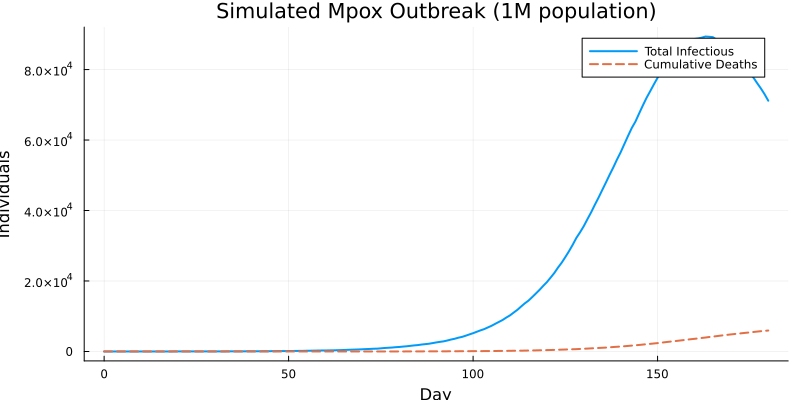
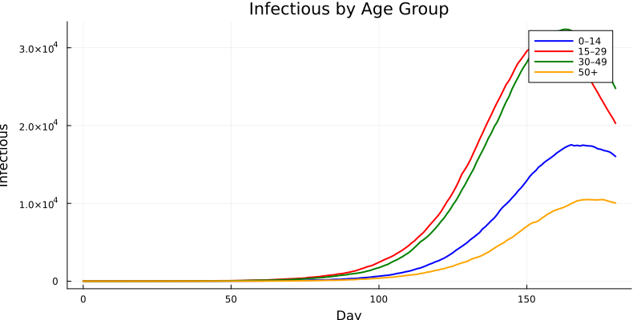
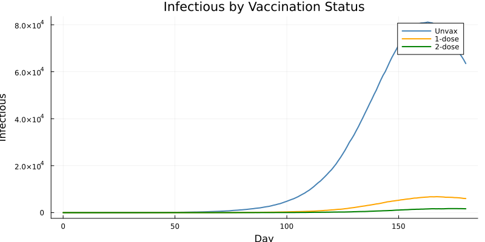
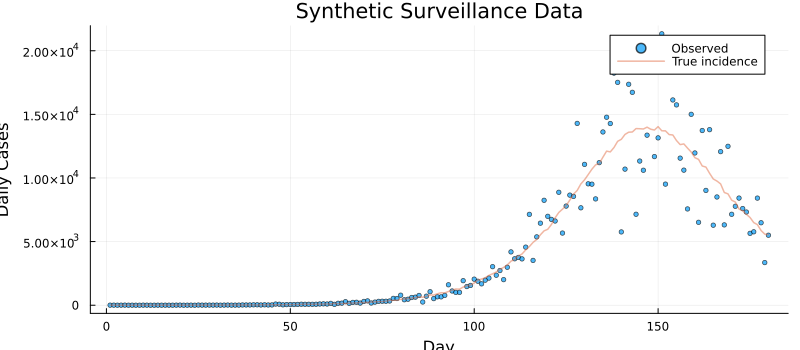
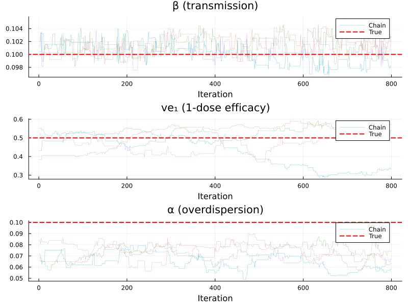
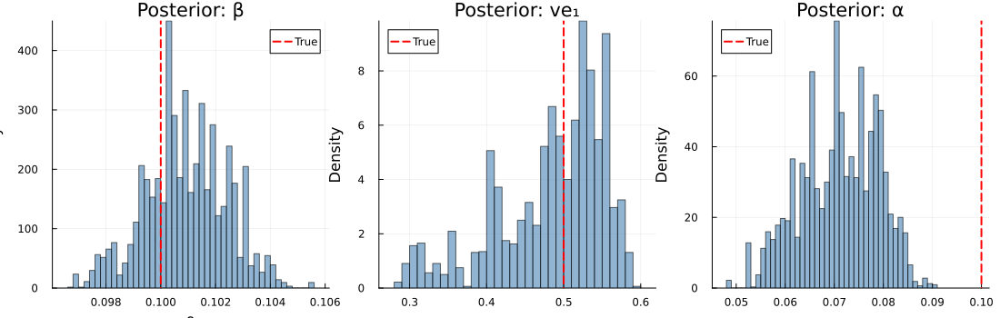
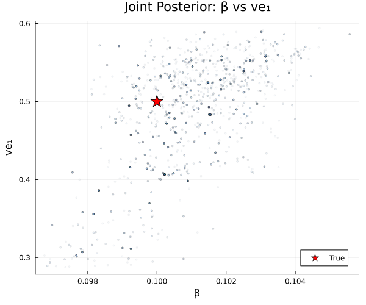
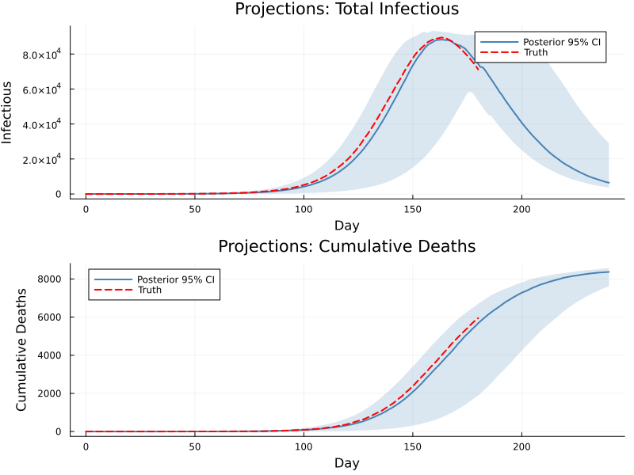

# Mpox SEIR: Age-Structured Model with Vaccination


## Introduction

Mpox (monkeypox) is a zoonotic orthopoxvirus that can spread through
close person-to-person contact. The 2022–2024 global outbreak (clade
IIb) and ongoing outbreaks of clade I in Central Africa highlighted the
need for age-structured transmission models that capture **heterogeneous
contact patterns** and **partial vaccine protection**.

This vignette builds a **discrete-time stochastic SEIR model**
stratified by age group and vaccination status, inspired by the full
[mpoxseir](https://github.com/mrc-ide/mpoxseir) package. The simplified
teaching version retains the key structural features — age-dependent
contact matrices, multi-dose vaccine efficacy, and negative-binomial
observation noise — while remaining compact enough to understand
end-to-end.

We demonstrate:

1.  Defining a 2D array model (age × vaccination) in the odin DSL
2.  Simulating an mpox outbreak with realistic demographics
3.  Generating synthetic surveillance data
4.  Fitting the model via particle filter + MCMC
5.  Recovering the transmission rate and vaccine efficacy from data

| Feature | Odin construct |
|----|----|
| Age structure (4 groups) | `dim(S) = c(n_age, n_vax)`, 2D arrays |
| Contact matrix | `dim(contact) = c(n_age, n_age)`, parameter array |
| Vaccination strata (3 levels) | `ifelse()` for stratum-specific efficacy |
| Competing-risks mortality | Sequential Binomial draws |
| NegBinomial observation model | `~ NegativeBinomial(size, prob)` |

``` julia
using Odin
using Distributions
using Plots
using Statistics
using LinearAlgebra: diagm
using Random
```

## Model Definition

### Compartments

For each of $a = 1, \ldots, 4$ age groups and $v = 1, 2, 3$ vaccination
strata (unvaccinated, 1-dose, 2-dose):

- $S_{a,v}$ — Susceptible
- $E_{a,v}$ — Exposed (latent, not yet infectious)
- $I_{a,v}$ — Infectious (with rash)
- $R_{a,v}$ — Recovered (immune)
- $D_{a,v}$ — Dead (cumulative)
- $\text{cases\_inc}_{a,v}$ — Incident cases (reset every day)

### Force of infection

$$\lambda_a = \beta \sum_{a'} \frac{C_{a,a'} \, I^{\text{tot}}_{a'}}{N_{a'}}$$

where $C$ is the **contact matrix**,
$I^{\text{tot}}_a = \sum_v I_{a,v}$, and $N_a$ is the total population
in age group $a$. Vaccination reduces susceptibility: the infection
probability for stratum $v$ is

$$p^{SE}_{a,v} = 1 - \exp\!\bigl(-\lambda_a \,(1 - \text{ve}_v)\, \Delta t\bigr)$$

with $\text{ve}_1 = 0$ (unvaccinated), $\text{ve}_2 = \text{ve1}$
(1-dose), $\text{ve}_3 = \text{ve2}$ (2-dose).

### Competing risks: recovery vs death

From the infectious compartment, individuals can **recover** or **die**.
We draw sequentially to handle the competing risk:

$$n^{IR}_{a,v} \sim \text{Bin}\bigl(I_{a,v},\; p^{IR}\bigr), \qquad
n^{ID}_{a,v} \sim \text{Bin}\!\left(I_{a,v} - n^{IR}_{a,v},\;
\frac{p^{ID}}{1 - p^{IR}}\right)$$

where $p^{IR} = 1 - e^{-\gamma(1-\mu)\Delta t}$ and
$p^{ID} = 1 - e^{-\gamma\mu\Delta t}$.

``` julia
mpox_seir = @odin begin
    # === Configuration ===
    n_age = parameter(4)
    n_vax = parameter(3)

    # === Dimensions ===
    dim(S) = c(n_age, n_vax)
    dim(E) = c(n_age, n_vax)
    dim(I) = c(n_age, n_vax)
    dim(R) = c(n_age, n_vax)
    dim(D) = c(n_age, n_vax)
    dim(cases_inc) = c(n_age, n_vax)

    dim(n_SE) = c(n_age, n_vax)
    dim(n_EI) = c(n_age, n_vax)
    dim(n_IR) = c(n_age, n_vax)
    dim(n_ID) = c(n_age, n_vax)
    dim(p_SE) = c(n_age, n_vax)

    dim(contact) = c(n_age, n_age)
    dim(N0) = n_age
    dim(S0) = c(n_age, n_vax)
    dim(I0) = c(n_age, n_vax)
    dim(lambda) = n_age
    dim(ve) = n_vax
    dim(I_age) = n_age
    dim(weighted_inf) = c(n_age, n_age)

    # === Vaccine efficacy by stratum ===
    ve[j] = ifelse(j == 1, 0.0, ifelse(j == 2, ve1, ve2))

    # === Force of infection ===
    I_age[i] = sum(j, I[i, j])
    weighted_inf[i, j] = contact[i, j] * I_age[j] / N0[j]
    lambda[i] = beta * sum(j, weighted_inf[i, j])

    # === Transition probabilities ===
    p_SE[i, j] = 1 - exp(-lambda[i] * (1 - ve[j]) * dt)
    p_EI = 1 - exp(-sigma * dt)
    p_IR = 1 - exp(-gamma * (1 - mu) * dt)
    p_ID = 1 - exp(-gamma * mu * dt)

    # === Stochastic transitions (Binomial draws) ===
    n_SE[i, j] = Binomial(S[i, j], p_SE[i, j])
    n_EI[i, j] = Binomial(E[i, j], p_EI)
    n_IR[i, j] = Binomial(I[i, j], p_IR)
    n_ID[i, j] = Binomial(I[i, j] - n_IR[i, j], p_ID / (1 - p_IR))

    # === State updates ===
    update(S[i, j]) = S[i, j] - n_SE[i, j]
    update(E[i, j]) = E[i, j] + n_SE[i, j] - n_EI[i, j]
    update(I[i, j]) = I[i, j] + n_EI[i, j] - n_IR[i, j] - n_ID[i, j]
    update(R[i, j]) = R[i, j] + n_IR[i, j]
    update(D[i, j]) = D[i, j] + n_ID[i, j]
    update(cases_inc[i, j]) = cases_inc[i, j] + n_SE[i, j]

    # === Initial conditions ===
    initial(S[i, j]) = S0[i, j]
    initial(E[i, j]) = 0
    initial(I[i, j]) = I0[i, j]
    initial(R[i, j]) = 0
    initial(D[i, j]) = 0
    initial(cases_inc[i, j], zero_every = 1) = 0

    # === Outputs (appended after state variables) ===
    output(total_I) = sum(I)
    output(total_cases_inc) = sum(cases_inc)
    output(total_D) = sum(D)

    # === Data comparison ===
    total_cases = sum(cases_inc)
    cases_data = data()
    nb_size = 1 / alpha_cases
    nb_prob = nb_size / (nb_size + max(total_cases, 1e-6))
    cases_data ~ NegativeBinomial(nb_size, nb_prob)

    # === Parameters ===
    contact = parameter()
    N0 = parameter()
    S0 = parameter()
    I0 = parameter()
    beta = parameter(0.1)
    sigma = parameter(0.1)
    gamma = parameter(0.14)
    mu = parameter(0.01)
    ve1 = parameter(0.5)
    ve2 = parameter(0.85)
    alpha_cases = parameter(0.1)
end
```

    Odin.DustSystemGenerator{var"##OdinModel#277"}(var"##OdinModel#277"(0, [:S, :E, :I, :R, :D, :cases_inc], [:n_age, :n_vax, :contact, :N0, :S0, :I0, :beta, :sigma, :gamma, :mu, :ve1, :ve2, :alpha_cases], false, false, true, true, false, Dict{Symbol, Array}()))

## Parameter Setup

### Demographics and contact matrix

We use four age groups — children (0–14), young adults (15–29), adults
(30–49), and older adults (50+) — with a symmetric contact matrix
reflecting higher within-group mixing for the working-age population:

``` julia
n_age = 4
n_vax = 3

N0 = [200_000.0, 300_000.0, 350_000.0, 150_000.0]  # total 1M

contact = [2.0 0.5 0.3 0.1;
           0.5 3.0 1.0 0.3;
           0.3 1.0 2.5 0.5;
           0.1 0.3 0.5 1.5]

age_labels = ["0–14", "15–29", "30–49", "50+"]
vax_labels = ["Unvax", "1-dose", "2-dose"]
```

    3-element Vector{String}:
     "Unvax"
     "1-dose"
     "2-dose"

### Vaccination coverage

We assume some pre-existing vaccination — primarily in the 15–49 age
groups who were targeted during prior outbreak response:

``` julia
vax1_frac = [0.00, 0.10, 0.15, 0.05]   # 1-dose coverage by age
vax2_frac = [0.00, 0.05, 0.10, 0.03]   # 2-dose coverage by age

S0 = zeros(n_age, n_vax)
I0 = zeros(n_age, n_vax)

for i in 1:n_age
    S0[i, 2] = round(N0[i] * vax1_frac[i])
    S0[i, 3] = round(N0[i] * vax2_frac[i])
    S0[i, 1] = N0[i] - S0[i, 2] - S0[i, 3]
end

# Seed 5 infections in age group 2 (15–29), unvaccinated
I0[2, 1] = 5.0
S0[2, 1] -= 5.0

println("Initial susceptibles by [age, vax]:")
display(S0)
println("\nTotal vaccinated (1-dose): ", sum(S0[:, 2]))
println("Total vaccinated (2-dose): ", sum(S0[:, 3]))
```

    Initial susceptibles by [age, vax]:

    Total vaccinated (1-dose): 90000.0
    Total vaccinated (2-dose): 54500.0

    4×3 Matrix{Float64}:
     200000.0      0.0      0.0
     254995.0  30000.0  15000.0
     262500.0  52500.0  35000.0
     138000.0   7500.0   4500.0

### True parameters

``` julia
true_pars = (
    n_age  = Float64(n_age),
    n_vax  = Float64(n_vax),
    contact = contact,
    N0     = N0,
    S0     = S0,
    I0     = I0,
    beta   = 0.1,
    sigma  = 0.1,       # 10-day mean latent period
    gamma  = 0.14,      # ~7-day mean infectious period
    mu     = 0.01,      # 1% infection fatality rate
    ve1    = 0.5,       # 1-dose vaccine efficacy
    ve2    = 0.85,      # 2-dose vaccine efficacy
    alpha_cases = 0.1,  # NegBin overdispersion
)
```

    (n_age = 4.0, n_vax = 3.0, contact = [2.0 0.5 0.3 0.1; 0.5 3.0 1.0 0.3; 0.3 1.0 2.5 0.5; 0.1 0.3 0.5 1.5], N0 = [200000.0, 300000.0, 350000.0, 150000.0], S0 = [200000.0 0.0 0.0; 254995.0 30000.0 15000.0; 262500.0 52500.0 35000.0; 138000.0 7500.0 4500.0], I0 = [0.0 0.0 0.0; 5.0 0.0 0.0; 0.0 0.0 0.0; 0.0 0.0 0.0], beta = 0.1, sigma = 0.1, gamma = 0.14, mu = 0.01, ve1 = 0.5, ve2 = 0.85, alpha_cases = 0.1)

## Simulate an Outbreak

``` julia
sim_times = collect(0.0:1.0:180.0)
sim_result = simulate(mpox_seir, true_pars;
    times=sim_times, dt=0.25, seed=42, n_particles=1)

println("Result shape: ", size(sim_result),
        "  (n_state+n_output × n_particles × n_times)")
```

    Result shape: (75, 1, 181)  (n_state+n_output × n_particles × n_times)

The state layout with `c(4, 3)` arrays in column-major order is: S (rows
1–12), E (13–24), I (25–36), R (37–48), D (49–60), cases_inc (61–72),
then 3 output rows (total_I, total_cases_inc, total_D).

``` julia
ns = n_age * n_vax  # 12 elements per compartment
out_offset = 6 * ns  # outputs start after 6 compartments × 12 elements

total_I     = sim_result[out_offset + 1, 1, :]
total_cases = sim_result[out_offset + 2, 1, :]
total_D     = sim_result[out_offset + 3, 1, :]
```

    181-element Vector{Float64}:
        0.0
        0.0
        0.0
        0.0
        0.0
        0.0
        0.0
        0.0
        0.0
        0.0
        ⋮
     5087.0
     5197.0
     5307.0
     5411.0
     5534.0
     5649.0
     5756.0
     5850.0
     5945.0

### Epidemic curves

``` julia
p_epi = plot(sim_times, total_I, lw=2, label="Total Infectious",
             xlabel="Day", ylabel="Individuals",
             title="Simulated Mpox Outbreak (1M population)",
             legend=:topright, size=(800, 400))
plot!(p_epi, sim_times, total_D, lw=2, ls=:dash, label="Cumulative Deaths")
p_epi
```



### Infectious by age group

``` julia
I_offset = 2 * ns  # I starts after S (12) and E (12)
colors = [:blue, :red, :green, :orange]

p_age = plot(title="Infectious by Age Group",
             xlabel="Day", ylabel="Infectious",
             legend=:topright, size=(800, 400))
for a in 1:n_age
    # Sum across vaccination strata: I[a,1] + I[a,2] + I[a,3]
    I_a = sim_result[I_offset + a, 1, :] .+
          sim_result[I_offset + n_age + a, 1, :] .+
          sim_result[I_offset + 2*n_age + a, 1, :]
    plot!(p_age, sim_times, I_a, lw=2, color=colors[a],
          label=age_labels[a])
end
p_age
```



### Infectious by vaccination status

``` julia
p_vax = plot(title="Infectious by Vaccination Status",
             xlabel="Day", ylabel="Infectious",
             legend=:topright, size=(800, 400))
vax_colors = [:steelblue, :orange, :green]
for v in 1:n_vax
    I_v = zeros(length(sim_times))
    for a in 1:n_age
        I_v .+= sim_result[I_offset + (v-1)*n_age + a, 1, :]
    end
    plot!(p_vax, sim_times, I_v, lw=2, color=vax_colors[v],
          label=vax_labels[v])
end
p_vax
```



## Generate Synthetic Data

We extract the daily incidence (aggregated over all age and vaccination
strata) and add negative-binomial observation noise to create realistic
surveillance data:

``` julia
Random.seed!(42)

obs_times = sim_times[2:end]             # days 1, 2, ..., 180
true_cases = total_cases[2:end]          # daily incidence from simulation

# Add NegBinomial observation noise
alpha_true = true_pars.alpha_cases
function rnegbin(mu, alpha)
    size_param = 1 / alpha
    p = size_param / (size_param + max(mu, 1e-10))
    rand(NegativeBinomial(size_param, p))
end

obs_cases = [rnegbin(c, alpha_true) for c in true_cases]

p_data = plot(xlabel="Day", ylabel="Daily Cases",
              title="Synthetic Surveillance Data",
              size=(800, 350), legend=:topright)
scatter!(p_data, obs_times, obs_cases, ms=2.5, alpha=0.7, label="Observed")
plot!(p_data, obs_times, true_cases, lw=1.5, alpha=0.5, label="True incidence")
p_data
```



### Prepare filter data

``` julia
filter_data = ObservedData([
    (time=Float64(t), cases_data=Float64(c))
    for (t, c) in zip(obs_times, obs_cases)
])
```

    Odin.FilterData{@NamedTuple{cases_data::Float64}}([1.0, 2.0, 3.0, 4.0, 5.0, 6.0, 7.0, 8.0, 9.0, 10.0  …  171.0, 172.0, 173.0, 174.0, 175.0, 176.0, 177.0, 178.0, 179.0, 180.0], [(cases_data = 4.0,), (cases_data = 5.0,), (cases_data = 2.0,), (cases_data = 4.0,), (cases_data = 7.0,), (cases_data = 1.0,), (cases_data = 2.0,), (cases_data = 0.0,), (cases_data = 0.0,), (cases_data = 6.0,)  …  (cases_data = 7776.0,), (cases_data = 8420.0,), (cases_data = 7596.0,), (cases_data = 7323.0,), (cases_data = 5647.0,), (cases_data = 5768.0,), (cases_data = 8418.0,), (cases_data = 6481.0,), (cases_data = 3351.0,), (cases_data = 5501.0,)])

## Inference Setup

### Particle filter

We use a bootstrap particle filter with 200 particles to estimate the
likelihood of the observed daily case counts given the stochastic model:

``` julia
filter = Likelihood(mpox_seir, filter_data;
    n_particles=100, dt=0.25, seed=42)
```

    Likelihood{DustFilter}(DustFilter{var"##OdinModel#277", Float64, @NamedTuple{cases_data::Float64}}(Odin.DustSystemGenerator{var"##OdinModel#277"}(var"##OdinModel#277"(0, [:S, :E, :I, :R, :D, :cases_inc], [:n_age, :n_vax, :contact, :N0, :S0, :I0, :beta, :sigma, :gamma, :mu, :ve1, :ve2, :alpha_cases], false, false, true, true, false, Dict{Symbol, Array}(:lambda => [0.022329033333333335, 0.03362130000000001, 0.030420166666666665, 0.0164902], :n_SE => [335.0 0.0 0.0; 235.0 42.0 12.0; 319.0 73.0 36.0; 266.0 10.0 7.0], :I_age => [16110.0, 20447.0, 24962.0, 10074.0], :n_IR => [536.0 0.0 0.0; 615.0 66.0 9.0; 720.0 110.0 29.0; 317.0 16.0 2.0], :weighted_inf => [0.1611 0.034078333333333335 0.021396 0.006716000000000001; 0.040275 0.20447 0.07132 0.020148; 0.024165 0.06815666666666667 0.1783 0.03358; 0.008055 0.020447 0.03566 0.10074], :p_SE => [0.005566706480892636 0.0027872375871298427 0.0008369882797364392; 0.008370099020183486 0.004193843672466335 0.0012600042771812037; 0.007576196506490884 0.0037953004058306483 0.0011401058349342907; 0.004114063956133895 0.0020591520316115552 0.000618191340946983], :n_ID => [5.0 0.0 0.0; 4.0 2.0 1.0; 6.0 6.0 0.0; 2.0 0.0 0.0], :ve => [0.0, 0.5, 0.85], :n_EI => [461.0 0.0 0.0; 468.0 56.0 14.0; 529.0 122.0 34.0; 310.0 10.0 1.0]))), Odin.FilterData{@NamedTuple{cases_data::Float64}}([1.0, 2.0, 3.0, 4.0, 5.0, 6.0, 7.0, 8.0, 9.0, 10.0  …  171.0, 172.0, 173.0, 174.0, 175.0, 176.0, 177.0, 178.0, 179.0, 180.0], [(cases_data = 4.0,), (cases_data = 5.0,), (cases_data = 2.0,), (cases_data = 4.0,), (cases_data = 7.0,), (cases_data = 1.0,), (cases_data = 2.0,), (cases_data = 0.0,), (cases_data = 0.0,), (cases_data = 6.0,)  …  (cases_data = 7776.0,), (cases_data = 8420.0,), (cases_data = 7596.0,), (cases_data = 7323.0,), (cases_data = 5647.0,), (cases_data = 5768.0,), (cases_data = 8418.0,), (cases_data = 6481.0,), (cases_data = 3351.0,), (cases_data = 5501.0,)]), 0.0, 100, 0.25, 42, false, nothing))

### Parameter packer

We fit three parameters — $\beta$ (transmission rate), ve1 (1-dose
vaccine efficacy), and $\alpha_{\text{cases}}$ (overdispersion) —
keeping all others fixed at their true values:

``` julia
packer = Packer([:beta, :ve1, :alpha_cases];
    fixed=(
        n_age   = Float64(n_age),
        n_vax   = Float64(n_vax),
        contact = contact,
        N0      = N0,
        S0      = S0,
        I0      = I0,
        sigma   = 0.1,
        gamma   = 0.14,
        mu      = 0.01,
        ve2     = 0.85,
    ))

likelihood = as_model(filter, packer)
```

    MontyModel{Odin.var"#dust_likelihood_monty##0#dust_likelihood_monty##1"{DustFilter{var"##OdinModel#277", Float64, @NamedTuple{cases_data::Float64}}, MontyPacker}, Nothing, Nothing, Nothing}(["beta", "ve1", "alpha_cases"], Odin.var"#dust_likelihood_monty##0#dust_likelihood_monty##1"{DustFilter{var"##OdinModel#277", Float64, @NamedTuple{cases_data::Float64}}, MontyPacker}(DustFilter{var"##OdinModel#277", Float64, @NamedTuple{cases_data::Float64}}(Odin.DustSystemGenerator{var"##OdinModel#277"}(var"##OdinModel#277"(0, [:S, :E, :I, :R, :D, :cases_inc], [:n_age, :n_vax, :contact, :N0, :S0, :I0, :beta, :sigma, :gamma, :mu, :ve1, :ve2, :alpha_cases], false, false, true, true, false, Dict{Symbol, Array}(:lambda => [0.022329033333333335, 0.03362130000000001, 0.030420166666666665, 0.0164902], :n_SE => [335.0 0.0 0.0; 235.0 42.0 12.0; 319.0 73.0 36.0; 266.0 10.0 7.0], :I_age => [16110.0, 20447.0, 24962.0, 10074.0], :n_IR => [536.0 0.0 0.0; 615.0 66.0 9.0; 720.0 110.0 29.0; 317.0 16.0 2.0], :weighted_inf => [0.1611 0.034078333333333335 0.021396 0.006716000000000001; 0.040275 0.20447 0.07132 0.020148; 0.024165 0.06815666666666667 0.1783 0.03358; 0.008055 0.020447 0.03566 0.10074], :p_SE => [0.005566706480892636 0.0027872375871298427 0.0008369882797364392; 0.008370099020183486 0.004193843672466335 0.0012600042771812037; 0.007576196506490884 0.0037953004058306483 0.0011401058349342907; 0.004114063956133895 0.0020591520316115552 0.000618191340946983], :n_ID => [5.0 0.0 0.0; 4.0 2.0 1.0; 6.0 6.0 0.0; 2.0 0.0 0.0], :ve => [0.0, 0.5, 0.85], :n_EI => [461.0 0.0 0.0; 468.0 56.0 14.0; 529.0 122.0 34.0; 310.0 10.0 1.0]))), Odin.FilterData{@NamedTuple{cases_data::Float64}}([1.0, 2.0, 3.0, 4.0, 5.0, 6.0, 7.0, 8.0, 9.0, 10.0  …  171.0, 172.0, 173.0, 174.0, 175.0, 176.0, 177.0, 178.0, 179.0, 180.0], [(cases_data = 4.0,), (cases_data = 5.0,), (cases_data = 2.0,), (cases_data = 4.0,), (cases_data = 7.0,), (cases_data = 1.0,), (cases_data = 2.0,), (cases_data = 0.0,), (cases_data = 0.0,), (cases_data = 6.0,)  …  (cases_data = 7776.0,), (cases_data = 8420.0,), (cases_data = 7596.0,), (cases_data = 7323.0,), (cases_data = 5647.0,), (cases_data = 5768.0,), (cases_data = 8418.0,), (cases_data = 6481.0,), (cases_data = 3351.0,), (cases_data = 5501.0,)]), 0.0, 100, 0.25, 42, false, nothing), MontyPacker([:beta, :ve1, :alpha_cases], [:beta, :ve1, :alpha_cases], Symbol[], Dict{Symbol, Tuple}(), Dict{Symbol, UnitRange{Int64}}(:beta => 1:1, :ve1 => 2:2, :alpha_cases => 3:3), 3, (n_age = 4.0, n_vax = 3.0, contact = [2.0 0.5 0.3 0.1; 0.5 3.0 1.0 0.3; 0.3 1.0 2.5 0.5; 0.1 0.3 0.5 1.5], N0 = [200000.0, 300000.0, 350000.0, 150000.0], S0 = [200000.0 0.0 0.0; 254995.0 30000.0 15000.0; 262500.0 52500.0 35000.0; 138000.0 7500.0 4500.0], I0 = [0.0 0.0 0.0; 5.0 0.0 0.0; 0.0 0.0 0.0; 0.0 0.0 0.0], sigma = 0.1, gamma = 0.14, mu = 0.01, ve2 = 0.85), nothing)), nothing, nothing, nothing, Odin.MontyModelProperties(false, false, true, false))

### Evaluate at truth

``` julia
ll_true = likelihood([true_pars.beta, true_pars.ve1, true_pars.alpha_cases])
println("Log-likelihood at true parameters: ", round(ll_true, digits=2))
```

    Log-likelihood at true parameters: -1171.44

### Priors

``` julia
prior = @prior begin
    beta        ~ Gamma(2.0, 0.05)      # mean 0.1, moderate uncertainty
    ve1         ~ Beta(5.0, 5.0)         # mean 0.5, concentrated on [0.2, 0.8]
    alpha_cases ~ Exponential(0.1)       # mean 0.1
end

posterior = likelihood + prior
```

    MontyModel{Odin.var"#monty_model_combine##0#monty_model_combine##1"{MontyModel{Odin.var"#dust_likelihood_monty##0#dust_likelihood_monty##1"{DustFilter{var"##OdinModel#277", Float64, @NamedTuple{cases_data::Float64}}, MontyPacker}, Nothing, Nothing, Nothing}, MontyModel{var"#10#11", var"#12#13"{var"#10#11"}, var"#14#15", Matrix{Float64}}}, Odin.var"#monty_model_combine##4#monty_model_combine##5"{Odin.var"#monty_model_combine##0#monty_model_combine##1"{MontyModel{Odin.var"#dust_likelihood_monty##0#dust_likelihood_monty##1"{DustFilter{var"##OdinModel#277", Float64, @NamedTuple{cases_data::Float64}}, MontyPacker}, Nothing, Nothing, Nothing}, MontyModel{var"#10#11", var"#12#13"{var"#10#11"}, var"#14#15", Matrix{Float64}}}}, Nothing, Matrix{Float64}}(["beta", "ve1", "alpha_cases"], Odin.var"#monty_model_combine##0#monty_model_combine##1"{MontyModel{Odin.var"#dust_likelihood_monty##0#dust_likelihood_monty##1"{DustFilter{var"##OdinModel#277", Float64, @NamedTuple{cases_data::Float64}}, MontyPacker}, Nothing, Nothing, Nothing}, MontyModel{var"#10#11", var"#12#13"{var"#10#11"}, var"#14#15", Matrix{Float64}}}(MontyModel{Odin.var"#dust_likelihood_monty##0#dust_likelihood_monty##1"{DustFilter{var"##OdinModel#277", Float64, @NamedTuple{cases_data::Float64}}, MontyPacker}, Nothing, Nothing, Nothing}(["beta", "ve1", "alpha_cases"], Odin.var"#dust_likelihood_monty##0#dust_likelihood_monty##1"{DustFilter{var"##OdinModel#277", Float64, @NamedTuple{cases_data::Float64}}, MontyPacker}(DustFilter{var"##OdinModel#277", Float64, @NamedTuple{cases_data::Float64}}(Odin.DustSystemGenerator{var"##OdinModel#277"}(var"##OdinModel#277"(0, [:S, :E, :I, :R, :D, :cases_inc], [:n_age, :n_vax, :contact, :N0, :S0, :I0, :beta, :sigma, :gamma, :mu, :ve1, :ve2, :alpha_cases], false, false, true, true, false, Dict{Symbol, Array}(:lambda => [0.02195899047619048, 0.03345550714285714, 0.030350759523809525, 0.01641807857142857], :n_SE => [354.0 0.0 0.0; 241.0 41.0 19.0; 304.0 64.0 21.0; 260.0 16.0 2.0], :I_age => [15753.0, 20370.0, 25000.0, 10022.0], :n_IR => [545.0 0.0 0.0; 584.0 80.0 22.0; 665.0 124.0 39.0; 306.0 17.0 4.0], :weighted_inf => [0.15753 0.03395 0.02142857142857143 0.006681333333333333; 0.0393825 0.2037 0.07142857142857142 0.020044; 0.023629499999999998 0.0679 0.17857142857142858 0.03340666666666667; 0.007876500000000002 0.02037 0.03571428571428571 0.10022], :p_SE => [0.005474706491172876 0.0027411100878432793 0.000823123190951236; 0.0083289968797563 0.004173206265143836 0.001253794859474744; 0.007558976031912357 0.0037866574031003575 0.0011375060311246132; 0.004096107615154332 0.0020501553761103075 0.00061548845565218], :n_ID => [6.0 0.0 0.0; 3.0 1.0 1.0; 9.0 1.0 1.0; 3.0 0.0 0.0], :ve => [0.0, 0.5, 0.85], :n_EI => [474.0 0.0 0.0; 443.0 66.0 11.0; 532.0 110.0 32.0; 319.0 13.0 3.0]))), Odin.FilterData{@NamedTuple{cases_data::Float64}}([1.0, 2.0, 3.0, 4.0, 5.0, 6.0, 7.0, 8.0, 9.0, 10.0  …  171.0, 172.0, 173.0, 174.0, 175.0, 176.0, 177.0, 178.0, 179.0, 180.0], [(cases_data = 4.0,), (cases_data = 5.0,), (cases_data = 2.0,), (cases_data = 4.0,), (cases_data = 7.0,), (cases_data = 1.0,), (cases_data = 2.0,), (cases_data = 0.0,), (cases_data = 0.0,), (cases_data = 6.0,)  …  (cases_data = 7776.0,), (cases_data = 8420.0,), (cases_data = 7596.0,), (cases_data = 7323.0,), (cases_data = 5647.0,), (cases_data = 5768.0,), (cases_data = 8418.0,), (cases_data = 6481.0,), (cases_data = 3351.0,), (cases_data = 5501.0,)]), 0.0, 100, 0.25, 42, false, DustSystem{var"##OdinModel#277", Float64, @NamedTuple{beta::Float64, ve1::Float64, alpha_cases::Float64, n_age::Float64, n_vax::Float64, contact::Matrix{Float64}, N0::Vector{Float64}, S0::Matrix{Float64}, I0::Matrix{Float64}, sigma::Float64, gamma::Float64, mu::Float64, ve2::Float64, dt::Float64}}(Odin.DustSystemGenerator{var"##OdinModel#277"}(var"##OdinModel#277"(0, [:S, :E, :I, :R, :D, :cases_inc], [:n_age, :n_vax, :contact, :N0, :S0, :I0, :beta, :sigma, :gamma, :mu, :ve1, :ve2, :alpha_cases], false, false, true, true, false, Dict{Symbol, Array}(:lambda => [0.02195899047619048, 0.03345550714285714, 0.030350759523809525, 0.01641807857142857], :n_SE => [354.0 0.0 0.0; 241.0 41.0 19.0; 304.0 64.0 21.0; 260.0 16.0 2.0], :I_age => [15753.0, 20370.0, 25000.0, 10022.0], :n_IR => [545.0 0.0 0.0; 584.0 80.0 22.0; 665.0 124.0 39.0; 306.0 17.0 4.0], :weighted_inf => [0.15753 0.03395 0.02142857142857143 0.006681333333333333; 0.0393825 0.2037 0.07142857142857142 0.020044; 0.023629499999999998 0.0679 0.17857142857142858 0.03340666666666667; 0.007876500000000002 0.02037 0.03571428571428571 0.10022], :p_SE => [0.005474706491172876 0.0027411100878432793 0.000823123190951236; 0.0083289968797563 0.004173206265143836 0.001253794859474744; 0.007558976031912357 0.0037866574031003575 0.0011375060311246132; 0.004096107615154332 0.0020501553761103075 0.00061548845565218], :n_ID => [6.0 0.0 0.0; 3.0 1.0 1.0; 9.0 1.0 1.0; 3.0 0.0 0.0], :ve => [0.0, 0.5, 0.85], :n_EI => [474.0 0.0 0.0; 443.0 66.0 11.0; 532.0 110.0 32.0; 319.0 13.0 3.0]))), [61878.0 61794.0 … 64713.0 63394.0; 25918.0 26426.0 … 28067.0 27677.0; … ; 109.0 119.0 … 110.0 128.0; 10.0 11.0 … 17.0 8.0], (beta = 0.1, ve1 = 0.5, alpha_cases = 0.1, n_age = 4.0, n_vax = 3.0, contact = [2.0 0.5 0.3 0.1; 0.5 3.0 1.0 0.3; 0.3 1.0 2.5 0.5; 0.1 0.3 0.5 1.5], N0 = [200000.0, 300000.0, 350000.0, 150000.0], S0 = [200000.0 0.0 0.0; 254995.0 30000.0 15000.0; 262500.0 52500.0 35000.0; 138000.0 7500.0 4500.0], I0 = [0.0 0.0 0.0; 5.0 0.0 0.0; 0.0 0.0 0.0; 0.0 0.0 0.0], sigma = 0.1, gamma = 0.14, mu = 0.01, ve2 = 0.85, dt = 0.25), 180.0, 0.25, 100, 72, 3, Xoshiro[Xoshiro(0x586d0290c2a3deae, 0xf3543dedc703bebe, 0x40afcddef0333158, 0x74a00b8723465ea2, 0x946aaf42c6e9390a), Xoshiro(0x8b3f839b100dcc86, 0xafa9f140ff616179, 0x2a26ad7d8eb1f6a4, 0x9a1b6820faff26ef, 0x13a14f6b238748d5), Xoshiro(0xda416669ede3590f, 0x915f4d0ebd536803, 0x5a96ad6fd73fc7fb, 0xb63e3371a8e7c210, 0x6c9c519d563cbac0), Xoshiro(0x36bd9595febd590c, 0x9451354f91375db9, 0xbbeb509e5effdd2b, 0xfa4818be50afd2dc, 0x23360656549078da), Xoshiro(0x653ec61ba5aa13c6, 0x5718b9dbbce830fb, 0x48336886c3613f27, 0xe94c0b95341c8015, 0x5e3265ceea9aee2e), Xoshiro(0xd3b28cce631e6528, 0x46b3eabdadd224df, 0x589dc5c8ea50a660, 0x51899b6774d9e909, 0x82ccf53a2241a5b6), Xoshiro(0x93d9bb605bca523d, 0xe207f9dff93efda6, 0xc82a92514a47fb49, 0x35dfe498f8549a51, 0xea9814cca13ef0b9), Xoshiro(0xca0628aeeccda437, 0x4736c07ec26820f3, 0xb4abe8af9c4cb623, 0x43c8f527c537e67d, 0x89edbefac11aca34), Xoshiro(0xe290aea3829b1f45, 0x7ab070980364bbd5, 0xc6edc1240b3de63a, 0x86717f59c753849c, 0x168a381663c823a4), Xoshiro(0x696c4b456c01bfd9, 0x337d227ee14d6d56, 0xd53bd372e7fcf8e1, 0x8617e8d63e386d00, 0x5ad151eb73579d81)  …  Xoshiro(0x4eb3cc75db70251b, 0x92a6ebb5ff537f58, 0x1f676f6bb60b7c8c, 0xad5bc8f0f36ca207, 0x693826d6f18cc447), Xoshiro(0x19dbcd25ce55e2a1, 0x38a8311e0a9af406, 0x14c3ff7cf7b40213, 0x817b1f411e10c2d6, 0x4038aceef4210d3a), Xoshiro(0xe045464cd2db3a97, 0x9e9b5f2f14369638, 0x2b01ed6ffdcd0a13, 0x1cba98fabf4db958, 0x91325288ac5768a1), Xoshiro(0x104736b92ba236d4, 0x3ee452cbdce5655f, 0xcb3b40e166ee77cf, 0x907fc5bbe7d941bf, 0x19656a952da8aac8), Xoshiro(0x967696a19c095108, 0xe1299b9e42ce35b2, 0xde2dade6aa61cbc0, 0x67b1232a7d41b3b8, 0x2a5280d03b72b5a1), Xoshiro(0x1d10ae79b0942f21, 0x9a682b8425c1eda6, 0x175594da8b7f5e7d, 0xa380a51906b77376, 0x7ed5747ae599b8c0), Xoshiro(0xbde5eceb81f68c17, 0xaf050ee7f26cb79b, 0xd94ad27b8bb3e54d, 0x157b194c3236c3bf, 0x094361155311f477), Xoshiro(0x10b2500db5ae877e, 0x733e055405198a13, 0x27664a33fb22337b, 0x1042246e4ce8dc8b, 0x50f28000cd27344c), Xoshiro(0xb5bbe0e9f22cbc0f, 0xac16a0f44e241b5f, 0x8c22f7c00e444049, 0xab3752e7d35b4ea6, 0x8b34b20186102f8c), Xoshiro(0x7d83f496aa5599c8, 0x320fb360e25a37c4, 0xfe04d50872d7ce9a, 0xd147953d492ec028, 0x622bf6eece42bed7)], [Symbol("S[1]"), Symbol("S[2]"), Symbol("S[3]"), Symbol("S[4]"), Symbol("S[5]"), Symbol("S[6]"), Symbol("S[7]"), Symbol("S[8]"), Symbol("S[9]"), Symbol("S[10]")  …  Symbol("cases_inc[3]"), Symbol("cases_inc[4]"), Symbol("cases_inc[5]"), Symbol("cases_inc[6]"), Symbol("cases_inc[7]"), Symbol("cases_inc[8]"), Symbol("cases_inc[9]"), Symbol("cases_inc[10]"), Symbol("cases_inc[11]"), Symbol("cases_inc[12]")], [:total_I, :total_cases_inc, :total_D], Odin.ZeroEveryEntry[Odin.ZeroEveryEntry(61:72, 1)], [63394.0, 27677.0, 41468.0, 60920.0, 0.0, 9986.0, 20756.0, 4972.0, 0.0, 10719.0  …  1261.0, 1078.0, 0.0, 167.0, 320.0, 48.0, 0.0, 56.0, 128.0, 8.0], [5.0e-324, 1.0e-323, 6.4549061853e-314, 6.454906201e-314, 1.5e-323, 1.5e-323, 6.454906217e-314, 6.454906233e-314, 2.0e-323, 2.5e-323  …  6.454906707e-314, 6.454906723e-314, 2.03e-322, 2.1e-322, 6.4549067387e-314, 6.4549067545e-314, 2.17e-322, 2.5e-322, 6.4549067703e-314, 6.454906786e-314], [-8.430587365015642, -8.423879717647367, -8.40282224285367, -8.412415087080353, -8.437970716026525, -8.411617445731489, -8.401460315906434, -8.40127216415911, -8.39048943675922, -8.402523770443  …  -8.39347228457857, -8.391933568012286, -8.391259915999886, -8.38960682571577, -8.397212732236857, -8.390298368910214, -8.389818358112905, -8.389583181210353, -8.393886501161692, -8.392099034772821], [1, 2, 3, 4, 5, 6, 7, 8, 9, 10  …  90, 91, 92, 93, 94, 96, 97, 98, 99, 100], [63241.0 63166.0 … 66214.0 64755.0; 26788.0 27313.0 … 29083.0 28629.0; … ; 115.0 120.0 … 146.0 123.0; 7.0 13.0 … 18.0 10.0], nothing, nothing, Union{Nothing, Odin.DP5Workspace{Float64}}[nothing, nothing], nothing, Union{Nothing, SDIRKWorkspace{Float64}}[nothing, nothing], nothing, Union{Nothing, SDEWorkspace{Float64}}[nothing, nothing], [[5.0e-324, 1.5e-323, 6.454860273e-314, 6.4548602886e-314, 2.0e-323, 2.0e-323, 6.4548603044e-314, 6.45486032e-314, 2.5e-323, 3.5e-323  …  6.454860747e-314, 6.454860763e-314, 2.17e-322, 2.27e-322, 6.4548607787e-314, 6.4548607945e-314, 2.3e-322, 2.67e-322, 6.4548608104e-314, 6.454860826e-314], [2.140557106e-314, 2.366095516e-314, 2.34269267e-314, 6.454244074e-314, 2.140557106e-314, 2.366095516e-314, 2.34269267e-314, 6.454244106e-314, 7.225264265e-314, 7.2252639173e-314  …  7.225264202e-314, 7.22526421e-314, 7.2252642177e-314, 7.2252642256e-314, 7.2252642335e-314, 7.2252642414e-314, 7.2252642493e-314, 7.225264257e-314, 0.0, 0.0]], [[4.4e-323, 2.65e-321, 2.140557106e-314], [5.4e-323, 2.446e-321, 1.5e-323]], Dict{Symbol, Array}[Dict(), Dict()], 2)), MontyPacker([:beta, :ve1, :alpha_cases], [:beta, :ve1, :alpha_cases], Symbol[], Dict{Symbol, Tuple}(), Dict{Symbol, UnitRange{Int64}}(:beta => 1:1, :ve1 => 2:2, :alpha_cases => 3:3), 3, (n_age = 4.0, n_vax = 3.0, contact = [2.0 0.5 0.3 0.1; 0.5 3.0 1.0 0.3; 0.3 1.0 2.5 0.5; 0.1 0.3 0.5 1.5], N0 = [200000.0, 300000.0, 350000.0, 150000.0], S0 = [200000.0 0.0 0.0; 254995.0 30000.0 15000.0; 262500.0 52500.0 35000.0; 138000.0 7500.0 4500.0], I0 = [0.0 0.0 0.0; 5.0 0.0 0.0; 0.0 0.0 0.0; 0.0 0.0 0.0], sigma = 0.1, gamma = 0.14, mu = 0.01, ve2 = 0.85), nothing)), nothing, nothing, nothing, Odin.MontyModelProperties(false, false, true, false)), MontyModel{var"#10#11", var"#12#13"{var"#10#11"}, var"#14#15", Matrix{Float64}}(["beta", "ve1", "alpha_cases"], var"#10#11"(), var"#12#13"{var"#10#11"}(var"#10#11"()), var"#14#15"(), [0.0 Inf; 0.0 1.0; 0.0 Inf], Odin.MontyModelProperties(true, true, false, false))), Odin.var"#monty_model_combine##4#monty_model_combine##5"{Odin.var"#monty_model_combine##0#monty_model_combine##1"{MontyModel{Odin.var"#dust_likelihood_monty##0#dust_likelihood_monty##1"{DustFilter{var"##OdinModel#277", Float64, @NamedTuple{cases_data::Float64}}, MontyPacker}, Nothing, Nothing, Nothing}, MontyModel{var"#10#11", var"#12#13"{var"#10#11"}, var"#14#15", Matrix{Float64}}}}(Odin.var"#monty_model_combine##0#monty_model_combine##1"{MontyModel{Odin.var"#dust_likelihood_monty##0#dust_likelihood_monty##1"{DustFilter{var"##OdinModel#277", Float64, @NamedTuple{cases_data::Float64}}, MontyPacker}, Nothing, Nothing, Nothing}, MontyModel{var"#10#11", var"#12#13"{var"#10#11"}, var"#14#15", Matrix{Float64}}}(MontyModel{Odin.var"#dust_likelihood_monty##0#dust_likelihood_monty##1"{DustFilter{var"##OdinModel#277", Float64, @NamedTuple{cases_data::Float64}}, MontyPacker}, Nothing, Nothing, Nothing}(["beta", "ve1", "alpha_cases"], Odin.var"#dust_likelihood_monty##0#dust_likelihood_monty##1"{DustFilter{var"##OdinModel#277", Float64, @NamedTuple{cases_data::Float64}}, MontyPacker}(DustFilter{var"##OdinModel#277", Float64, @NamedTuple{cases_data::Float64}}(Odin.DustSystemGenerator{var"##OdinModel#277"}(var"##OdinModel#277"(0, [:S, :E, :I, :R, :D, :cases_inc], [:n_age, :n_vax, :contact, :N0, :S0, :I0, :beta, :sigma, :gamma, :mu, :ve1, :ve2, :alpha_cases], false, false, true, true, false, Dict{Symbol, Array}(:lambda => [0.02195899047619048, 0.03345550714285714, 0.030350759523809525, 0.01641807857142857], :n_SE => [354.0 0.0 0.0; 241.0 41.0 19.0; 304.0 64.0 21.0; 260.0 16.0 2.0], :I_age => [15753.0, 20370.0, 25000.0, 10022.0], :n_IR => [545.0 0.0 0.0; 584.0 80.0 22.0; 665.0 124.0 39.0; 306.0 17.0 4.0], :weighted_inf => [0.15753 0.03395 0.02142857142857143 0.006681333333333333; 0.0393825 0.2037 0.07142857142857142 0.020044; 0.023629499999999998 0.0679 0.17857142857142858 0.03340666666666667; 0.007876500000000002 0.02037 0.03571428571428571 0.10022], :p_SE => [0.005474706491172876 0.0027411100878432793 0.000823123190951236; 0.0083289968797563 0.004173206265143836 0.001253794859474744; 0.007558976031912357 0.0037866574031003575 0.0011375060311246132; 0.004096107615154332 0.0020501553761103075 0.00061548845565218], :n_ID => [6.0 0.0 0.0; 3.0 1.0 1.0; 9.0 1.0 1.0; 3.0 0.0 0.0], :ve => [0.0, 0.5, 0.85], :n_EI => [474.0 0.0 0.0; 443.0 66.0 11.0; 532.0 110.0 32.0; 319.0 13.0 3.0]))), Odin.FilterData{@NamedTuple{cases_data::Float64}}([1.0, 2.0, 3.0, 4.0, 5.0, 6.0, 7.0, 8.0, 9.0, 10.0  …  171.0, 172.0, 173.0, 174.0, 175.0, 176.0, 177.0, 178.0, 179.0, 180.0], [(cases_data = 4.0,), (cases_data = 5.0,), (cases_data = 2.0,), (cases_data = 4.0,), (cases_data = 7.0,), (cases_data = 1.0,), (cases_data = 2.0,), (cases_data = 0.0,), (cases_data = 0.0,), (cases_data = 6.0,)  …  (cases_data = 7776.0,), (cases_data = 8420.0,), (cases_data = 7596.0,), (cases_data = 7323.0,), (cases_data = 5647.0,), (cases_data = 5768.0,), (cases_data = 8418.0,), (cases_data = 6481.0,), (cases_data = 3351.0,), (cases_data = 5501.0,)]), 0.0, 100, 0.25, 42, false, DustSystem{var"##OdinModel#277", Float64, @NamedTuple{beta::Float64, ve1::Float64, alpha_cases::Float64, n_age::Float64, n_vax::Float64, contact::Matrix{Float64}, N0::Vector{Float64}, S0::Matrix{Float64}, I0::Matrix{Float64}, sigma::Float64, gamma::Float64, mu::Float64, ve2::Float64, dt::Float64}}(Odin.DustSystemGenerator{var"##OdinModel#277"}(var"##OdinModel#277"(0, [:S, :E, :I, :R, :D, :cases_inc], [:n_age, :n_vax, :contact, :N0, :S0, :I0, :beta, :sigma, :gamma, :mu, :ve1, :ve2, :alpha_cases], false, false, true, true, false, Dict{Symbol, Array}(:lambda => [0.02195899047619048, 0.03345550714285714, 0.030350759523809525, 0.01641807857142857], :n_SE => [354.0 0.0 0.0; 241.0 41.0 19.0; 304.0 64.0 21.0; 260.0 16.0 2.0], :I_age => [15753.0, 20370.0, 25000.0, 10022.0], :n_IR => [545.0 0.0 0.0; 584.0 80.0 22.0; 665.0 124.0 39.0; 306.0 17.0 4.0], :weighted_inf => [0.15753 0.03395 0.02142857142857143 0.006681333333333333; 0.0393825 0.2037 0.07142857142857142 0.020044; 0.023629499999999998 0.0679 0.17857142857142858 0.03340666666666667; 0.007876500000000002 0.02037 0.03571428571428571 0.10022], :p_SE => [0.005474706491172876 0.0027411100878432793 0.000823123190951236; 0.0083289968797563 0.004173206265143836 0.001253794859474744; 0.007558976031912357 0.0037866574031003575 0.0011375060311246132; 0.004096107615154332 0.0020501553761103075 0.00061548845565218], :n_ID => [6.0 0.0 0.0; 3.0 1.0 1.0; 9.0 1.0 1.0; 3.0 0.0 0.0], :ve => [0.0, 0.5, 0.85], :n_EI => [474.0 0.0 0.0; 443.0 66.0 11.0; 532.0 110.0 32.0; 319.0 13.0 3.0]))), [61878.0 61794.0 … 64713.0 63394.0; 25918.0 26426.0 … 28067.0 27677.0; … ; 109.0 119.0 … 110.0 128.0; 10.0 11.0 … 17.0 8.0], (beta = 0.1, ve1 = 0.5, alpha_cases = 0.1, n_age = 4.0, n_vax = 3.0, contact = [2.0 0.5 0.3 0.1; 0.5 3.0 1.0 0.3; 0.3 1.0 2.5 0.5; 0.1 0.3 0.5 1.5], N0 = [200000.0, 300000.0, 350000.0, 150000.0], S0 = [200000.0 0.0 0.0; 254995.0 30000.0 15000.0; 262500.0 52500.0 35000.0; 138000.0 7500.0 4500.0], I0 = [0.0 0.0 0.0; 5.0 0.0 0.0; 0.0 0.0 0.0; 0.0 0.0 0.0], sigma = 0.1, gamma = 0.14, mu = 0.01, ve2 = 0.85, dt = 0.25), 180.0, 0.25, 100, 72, 3, Xoshiro[Xoshiro(0x586d0290c2a3deae, 0xf3543dedc703bebe, 0x40afcddef0333158, 0x74a00b8723465ea2, 0x946aaf42c6e9390a), Xoshiro(0x8b3f839b100dcc86, 0xafa9f140ff616179, 0x2a26ad7d8eb1f6a4, 0x9a1b6820faff26ef, 0x13a14f6b238748d5), Xoshiro(0xda416669ede3590f, 0x915f4d0ebd536803, 0x5a96ad6fd73fc7fb, 0xb63e3371a8e7c210, 0x6c9c519d563cbac0), Xoshiro(0x36bd9595febd590c, 0x9451354f91375db9, 0xbbeb509e5effdd2b, 0xfa4818be50afd2dc, 0x23360656549078da), Xoshiro(0x653ec61ba5aa13c6, 0x5718b9dbbce830fb, 0x48336886c3613f27, 0xe94c0b95341c8015, 0x5e3265ceea9aee2e), Xoshiro(0xd3b28cce631e6528, 0x46b3eabdadd224df, 0x589dc5c8ea50a660, 0x51899b6774d9e909, 0x82ccf53a2241a5b6), Xoshiro(0x93d9bb605bca523d, 0xe207f9dff93efda6, 0xc82a92514a47fb49, 0x35dfe498f8549a51, 0xea9814cca13ef0b9), Xoshiro(0xca0628aeeccda437, 0x4736c07ec26820f3, 0xb4abe8af9c4cb623, 0x43c8f527c537e67d, 0x89edbefac11aca34), Xoshiro(0xe290aea3829b1f45, 0x7ab070980364bbd5, 0xc6edc1240b3de63a, 0x86717f59c753849c, 0x168a381663c823a4), Xoshiro(0x696c4b456c01bfd9, 0x337d227ee14d6d56, 0xd53bd372e7fcf8e1, 0x8617e8d63e386d00, 0x5ad151eb73579d81)  …  Xoshiro(0x4eb3cc75db70251b, 0x92a6ebb5ff537f58, 0x1f676f6bb60b7c8c, 0xad5bc8f0f36ca207, 0x693826d6f18cc447), Xoshiro(0x19dbcd25ce55e2a1, 0x38a8311e0a9af406, 0x14c3ff7cf7b40213, 0x817b1f411e10c2d6, 0x4038aceef4210d3a), Xoshiro(0xe045464cd2db3a97, 0x9e9b5f2f14369638, 0x2b01ed6ffdcd0a13, 0x1cba98fabf4db958, 0x91325288ac5768a1), Xoshiro(0x104736b92ba236d4, 0x3ee452cbdce5655f, 0xcb3b40e166ee77cf, 0x907fc5bbe7d941bf, 0x19656a952da8aac8), Xoshiro(0x967696a19c095108, 0xe1299b9e42ce35b2, 0xde2dade6aa61cbc0, 0x67b1232a7d41b3b8, 0x2a5280d03b72b5a1), Xoshiro(0x1d10ae79b0942f21, 0x9a682b8425c1eda6, 0x175594da8b7f5e7d, 0xa380a51906b77376, 0x7ed5747ae599b8c0), Xoshiro(0xbde5eceb81f68c17, 0xaf050ee7f26cb79b, 0xd94ad27b8bb3e54d, 0x157b194c3236c3bf, 0x094361155311f477), Xoshiro(0x10b2500db5ae877e, 0x733e055405198a13, 0x27664a33fb22337b, 0x1042246e4ce8dc8b, 0x50f28000cd27344c), Xoshiro(0xb5bbe0e9f22cbc0f, 0xac16a0f44e241b5f, 0x8c22f7c00e444049, 0xab3752e7d35b4ea6, 0x8b34b20186102f8c), Xoshiro(0x7d83f496aa5599c8, 0x320fb360e25a37c4, 0xfe04d50872d7ce9a, 0xd147953d492ec028, 0x622bf6eece42bed7)], [Symbol("S[1]"), Symbol("S[2]"), Symbol("S[3]"), Symbol("S[4]"), Symbol("S[5]"), Symbol("S[6]"), Symbol("S[7]"), Symbol("S[8]"), Symbol("S[9]"), Symbol("S[10]")  …  Symbol("cases_inc[3]"), Symbol("cases_inc[4]"), Symbol("cases_inc[5]"), Symbol("cases_inc[6]"), Symbol("cases_inc[7]"), Symbol("cases_inc[8]"), Symbol("cases_inc[9]"), Symbol("cases_inc[10]"), Symbol("cases_inc[11]"), Symbol("cases_inc[12]")], [:total_I, :total_cases_inc, :total_D], Odin.ZeroEveryEntry[Odin.ZeroEveryEntry(61:72, 1)], [63394.0, 27677.0, 41468.0, 60920.0, 0.0, 9986.0, 20756.0, 4972.0, 0.0, 10719.0  …  1261.0, 1078.0, 0.0, 167.0, 320.0, 48.0, 0.0, 56.0, 128.0, 8.0], [5.0e-324, 1.0e-323, 6.4549061853e-314, 6.454906201e-314, 1.5e-323, 1.5e-323, 6.454906217e-314, 6.454906233e-314, 2.0e-323, 2.5e-323  …  6.454906707e-314, 6.454906723e-314, 2.03e-322, 2.1e-322, 6.4549067387e-314, 6.4549067545e-314, 2.17e-322, 2.5e-322, 6.4549067703e-314, 6.454906786e-314], [-8.430587365015642, -8.423879717647367, -8.40282224285367, -8.412415087080353, -8.437970716026525, -8.411617445731489, -8.401460315906434, -8.40127216415911, -8.39048943675922, -8.402523770443  …  -8.39347228457857, -8.391933568012286, -8.391259915999886, -8.38960682571577, -8.397212732236857, -8.390298368910214, -8.389818358112905, -8.389583181210353, -8.393886501161692, -8.392099034772821], [1, 2, 3, 4, 5, 6, 7, 8, 9, 10  …  90, 91, 92, 93, 94, 96, 97, 98, 99, 100], [63241.0 63166.0 … 66214.0 64755.0; 26788.0 27313.0 … 29083.0 28629.0; … ; 115.0 120.0 … 146.0 123.0; 7.0 13.0 … 18.0 10.0], nothing, nothing, Union{Nothing, Odin.DP5Workspace{Float64}}[nothing, nothing], nothing, Union{Nothing, SDIRKWorkspace{Float64}}[nothing, nothing], nothing, Union{Nothing, SDEWorkspace{Float64}}[nothing, nothing], [[5.0e-324, 1.5e-323, 6.454860273e-314, 6.4548602886e-314, 2.0e-323, 2.0e-323, 6.4548603044e-314, 6.45486032e-314, 2.5e-323, 3.5e-323  …  6.454860747e-314, 6.454860763e-314, 2.17e-322, 2.27e-322, 6.4548607787e-314, 6.4548607945e-314, 2.3e-322, 2.67e-322, 6.4548608104e-314, 6.454860826e-314], [2.140557106e-314, 2.366095516e-314, 2.34269267e-314, 6.454244074e-314, 2.140557106e-314, 2.366095516e-314, 2.34269267e-314, 6.454244106e-314, 7.225264265e-314, 7.2252639173e-314  …  7.225264202e-314, 7.22526421e-314, 7.2252642177e-314, 7.2252642256e-314, 7.2252642335e-314, 7.2252642414e-314, 7.2252642493e-314, 7.225264257e-314, 0.0, 0.0]], [[4.4e-323, 2.65e-321, 2.140557106e-314], [5.4e-323, 2.446e-321, 1.5e-323]], Dict{Symbol, Array}[Dict(), Dict()], 2)), MontyPacker([:beta, :ve1, :alpha_cases], [:beta, :ve1, :alpha_cases], Symbol[], Dict{Symbol, Tuple}(), Dict{Symbol, UnitRange{Int64}}(:beta => 1:1, :ve1 => 2:2, :alpha_cases => 3:3), 3, (n_age = 4.0, n_vax = 3.0, contact = [2.0 0.5 0.3 0.1; 0.5 3.0 1.0 0.3; 0.3 1.0 2.5 0.5; 0.1 0.3 0.5 1.5], N0 = [200000.0, 300000.0, 350000.0, 150000.0], S0 = [200000.0 0.0 0.0; 254995.0 30000.0 15000.0; 262500.0 52500.0 35000.0; 138000.0 7500.0 4500.0], I0 = [0.0 0.0 0.0; 5.0 0.0 0.0; 0.0 0.0 0.0; 0.0 0.0 0.0], sigma = 0.1, gamma = 0.14, mu = 0.01, ve2 = 0.85), nothing)), nothing, nothing, nothing, Odin.MontyModelProperties(false, false, true, false)), MontyModel{var"#10#11", var"#12#13"{var"#10#11"}, var"#14#15", Matrix{Float64}}(["beta", "ve1", "alpha_cases"], var"#10#11"(), var"#12#13"{var"#10#11"}(var"#10#11"()), var"#14#15"(), [0.0 Inf; 0.0 1.0; 0.0 Inf], Odin.MontyModelProperties(true, true, false, false)))), nothing, [0.0 Inf; 0.0 1.0; 0.0 Inf], Odin.MontyModelProperties(true, false, true, false))

## Run MCMC

We use an adaptive random-walk Metropolis sampler with 4 chains:

``` julia
vcv = diagm([0.0005, 0.005, 0.0005])
sampler = adaptive_mh(vcv)

initial = repeat([0.1, 0.5, 0.1], 1, 4)  # 3 × 4 matrix (n_pars × n_chains)
samples = sample(posterior, sampler, 1000;
    initial=initial, n_chains=4, n_burnin=200, seed=42)
```

    Odin.MontySamples([0.10041507566189953 0.10041507566189953 … 0.09823086011177316 0.09823086011177316; 0.43127917536196736 0.43127917536196736 … 0.33249433530809047 0.33249433530809047; 0.06842099600231744 0.06842099600231744 … 0.05835504666341614 0.05835504666341614;;; 0.09983936296173346 0.09983936296173346 … 0.1020470365371577 0.1020470365371577; 0.3836929807956908 0.3836929807956908 … 0.5725718085621015 0.5725718085621015; 0.06545388095890495 0.06545388095890495 … 0.0744229322164673 0.0744229322164673;;; 0.1013224003542075 0.1013224003542075 … 0.10279408080376291 0.10279408080376291; 0.5520521846688606 0.5520521846688606 … 0.5402135311183378 0.5402135311183378; 0.07165757273473544 0.07165757273473544 … 0.06330493166027237 0.06330493166027237;;; 0.101960801637268 0.101960801637268 … 0.1025215833133594 0.1025215833133594; 0.5256718096290707 0.5256718096290707 … 0.49841123854420366 0.49841123854420366; 0.08448789634575601 0.08448789634575601 … 0.06717136282982714 0.06717136282982714], [-1163.9170525983827 -1161.3370767879744 -1161.735397079706 -1162.1390374714026; -1163.9170525983827 -1161.3370767879744 -1161.735397079706 -1162.1390374714026; … ; -1163.8112149510355 -1161.5831416567337 -1163.691691652906 -1164.4314791304716; -1163.8112149510355 -1161.5831416567337 -1163.691691652906 -1164.4314791304716], [0.1 0.1 0.1 0.1; 0.5 0.5 0.5 0.5; 0.1 0.1 0.1 0.1], ["beta", "ve1", "alpha_cases"], Dict{Symbol, Any}(:acceptance_rate => [0.226, 0.269, 0.245, 0.207]))

## Posterior Analysis

### Trace plots

``` julia
par_names = ["β (transmission)", "ve₁ (1-dose efficacy)", "α (overdispersion)"]
true_vals = [0.1, 0.5, 0.1]

p_traces = []
for p in 1:3
    pt = plot(title=par_names[p], xlabel="Iteration", ylabel="",
              legend=:topright)
    for ch in 1:4
        plot!(pt, samples.pars[p, :, ch], alpha=0.5, label=(ch==1 ? "Chain" : ""),
              lw=0.5)
    end
    hline!(pt, [true_vals[p]], color=:red, lw=2, ls=:dash, label="True")
    push!(p_traces, pt)
end
plot(p_traces..., layout=(3, 1), size=(800, 600))
```



### Marginal posterior densities

``` julia
# Pool chains after burn-in
beta_post  = vec(samples.pars[1, :, :])
ve1_post   = vec(samples.pars[2, :, :])
alpha_post = vec(samples.pars[3, :, :])

p1 = histogram(beta_post, bins=50, normalize=true, alpha=0.6,
               xlabel="β", ylabel="Density", title="Posterior: β",
               label="", color=:steelblue)
vline!(p1, [0.1], color=:red, lw=2, ls=:dash, label="True")

p2 = histogram(ve1_post, bins=50, normalize=true, alpha=0.6,
               xlabel="ve₁", ylabel="Density", title="Posterior: ve₁",
               label="", color=:steelblue)
vline!(p2, [0.5], color=:red, lw=2, ls=:dash, label="True")

p3 = histogram(alpha_post, bins=50, normalize=true, alpha=0.6,
               xlabel="α", ylabel="Density", title="Posterior: α",
               label="", color=:steelblue)
vline!(p3, [0.1], color=:red, lw=2, ls=:dash, label="True")

plot(p1, p2, p3, layout=(1, 3), size=(1100, 350))
```



### Posterior summary

``` julia
function summarise(name, vals, truth)
    m  = round(mean(vals), sigdigits=3)
    lo = round(quantile(vals, 0.025), sigdigits=3)
    hi = round(quantile(vals, 0.975), sigdigits=3)
    println("  $name: $m [$lo, $hi]  (true = $truth)")
end

println("Posterior summary (pooled chains, after burn-in):")
summarise("β   ", beta_post, 0.1)
summarise("ve₁ ", ve1_post,  0.5)
summarise("α   ", alpha_post, 0.1)
```

    Posterior summary (pooled chains, after burn-in):
      β   : 0.101 [0.0978, 0.104]  (true = 0.1)
      ve₁ : 0.484 [0.307, 0.576]  (true = 0.5)
      α   : 0.071 [0.0552, 0.084]  (true = 0.1)

### Joint β–ve₁ posterior

The scatter plot reveals any correlation between transmission rate and
vaccine efficacy:

``` julia
p_joint = scatter(beta_post, ve1_post, alpha=0.05, ms=1.5,
                  xlabel="β", ylabel="ve₁",
                  title="Joint Posterior: β vs ve₁",
                  label="", color=:steelblue, size=(600, 500))
scatter!(p_joint, [0.1], [0.5], ms=10, color=:red, marker=:star5,
         label="True")
p_joint
```



## Projections from the Posterior

We draw parameter sets from the posterior and simulate forward to
quantify forecast uncertainty:

``` julia
proj_times = collect(0.0:1.0:240.0)
n_proj = 100

I_traj = zeros(n_proj, length(proj_times))
D_traj = zeros(n_proj, length(proj_times))

Random.seed!(10)
n_samples = length(beta_post)
idx = rand(1:n_samples, n_proj)

for k in 1:n_proj
    pars = (
        n_age=Float64(n_age), n_vax=Float64(n_vax),
        contact=contact, N0=N0, S0=S0, I0=I0,
        sigma=0.1, gamma=0.14, mu=0.01, ve2=0.85,
        beta=beta_post[idx[k]],
        ve1=ve1_post[idx[k]],
        alpha_cases=alpha_post[idx[k]],
    )
    r = simulate(mpox_seir, pars;
        times=proj_times, dt=0.25, seed=k)
    I_traj[k, :] = r[out_offset + 1, 1, :]
    D_traj[k, :] = r[out_offset + 3, 1, :]
end
```

``` julia
function ribbon!(p, t, traj; color, label)
    med = [median(traj[:, k]) for k in axes(traj, 2)]
    lo  = [quantile(traj[:, k], 0.025) for k in axes(traj, 2)]
    hi  = [quantile(traj[:, k], 0.975) for k in axes(traj, 2)]
    plot!(p, t, med, ribbon=(med .- lo, hi .- med),
          fillalpha=0.2, lw=2, color=color, label=label)
end

p_fI = plot(xlabel="Day", ylabel="Infectious",
            title="Projections: Total Infectious", legend=:topright)
ribbon!(p_fI, proj_times, I_traj, color=:steelblue, label="Posterior 95% CI")
plot!(p_fI, sim_times, total_I, color=:red, lw=2, ls=:dash, label="Truth")

p_fD = plot(xlabel="Day", ylabel="Cumulative Deaths",
            title="Projections: Cumulative Deaths", legend=:topleft)
ribbon!(p_fD, proj_times, D_traj, color=:steelblue, label="Posterior 95% CI")
plot!(p_fD, sim_times, total_D, color=:red, lw=2, ls=:dash, label="Truth")

plot(p_fI, p_fD, layout=(2, 1), size=(800, 600))
```



## Summary

| Component              | Value                             |
|------------------------|-----------------------------------|
| **Age groups**         | 4 (0–14, 15–29, 30–49, 50+)       |
| **Vaccination strata** | 3 (unvax, 1-dose, 2-dose)         |
| **State variables**    | 72 (6 compartments × 4 × 3)       |
| **Time step**          | 0.25 days                         |
| **Observation model**  | NegBinomial on daily case totals  |
| **Fitted parameters**  | β, ve₁, α_cases                   |
| **MCMC**               | Adaptive RW, 5000 steps, 4 chains |

### Key takeaways

1.  **2D arrays** (`dim(X) = c(n_age, n_vax)`) allow compact
    representation of age × vaccination structure. All transitions are
    written once with indices `[i, j]` and odin generates the
    appropriate nested loops.

2.  **Contact matrices** enter the force of infection via a weighted sum
    over age groups. The `sum(j, weighted_inf[i, j])` pattern — compute
    a 2D intermediate then sum one dimension — is the standard approach
    for matrix–vector products in odin.

3.  **Competing risks** (recovery vs death) are handled by sequential
    Binomial draws with conditional probabilities, preserving the
    correct marginal rates.

4.  **Vaccine efficacy** is recoverable from aggregate case data when
    vaccination coverage varies across age groups, creating differential
    attack rates that inform the efficacy parameter.

5.  **Negative-binomial observation noise** accommodates the
    overdispersion typical of surveillance data. The `size` / `prob`
    parameterisation matches Julia’s `Distributions.NegativeBinomial`.

| Step            | API                                         |
|-----------------|---------------------------------------------|
| Define model    | `@odin begin … end` with 2D arrays          |
| Simulate        | `simulate(gen, pars; times, dt, seed)`      |
| Prepare data    | `ObservedData([(time=…, cases_data=…), …])` |
| Particle filter | `Likelihood(gen, data; n_particles)`        |
| Likelihood      | `as_model(filter, packer)`                  |
| Prior           | `@prior begin … end`                        |
| Posterior       | `likelihood + prior`                        |
| Sample          | `sample(posterior, sampler, n_steps; …)`    |
