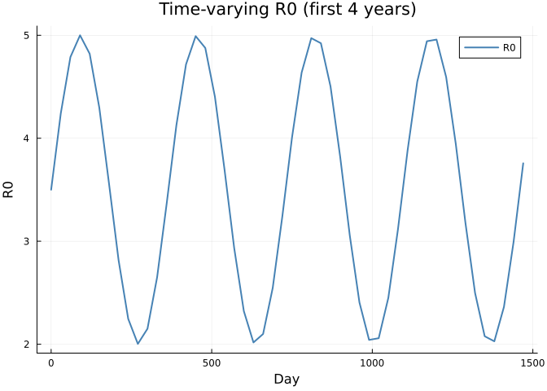
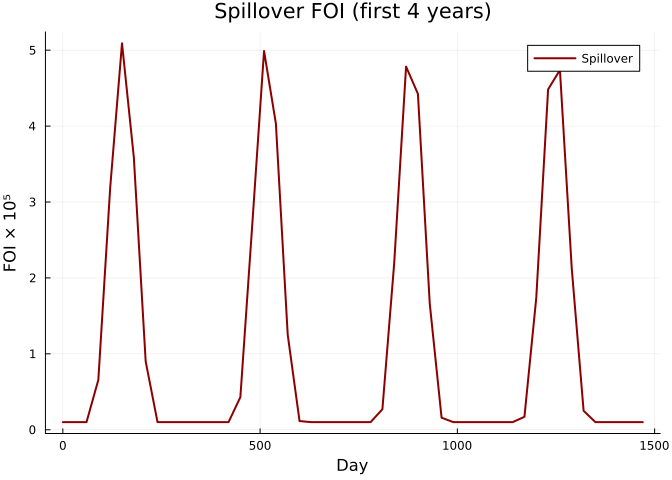
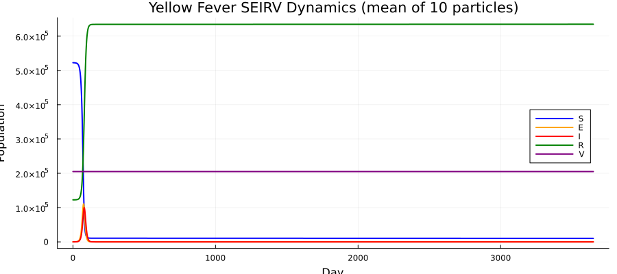
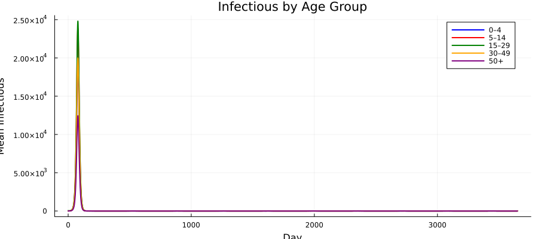
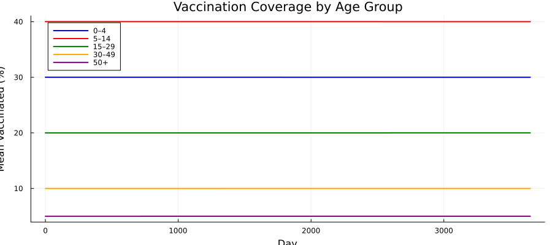
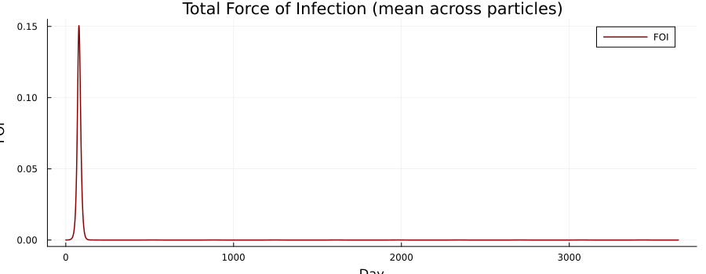
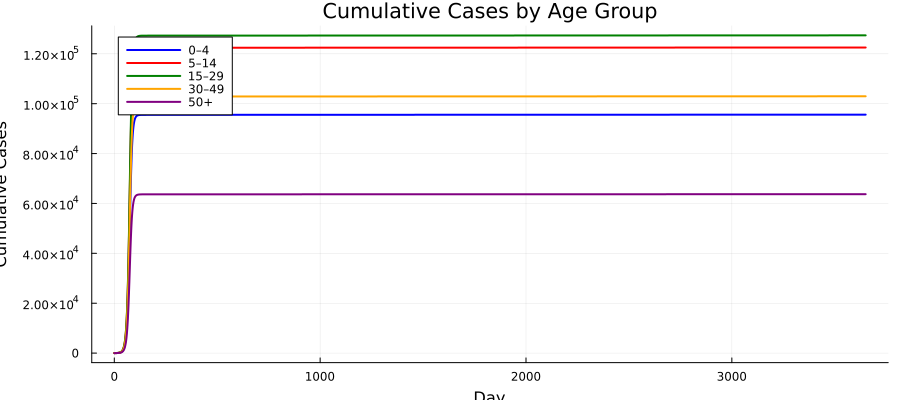
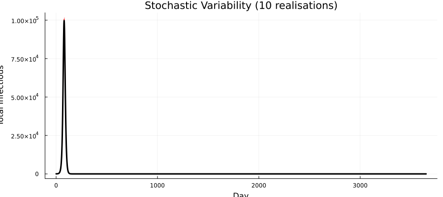
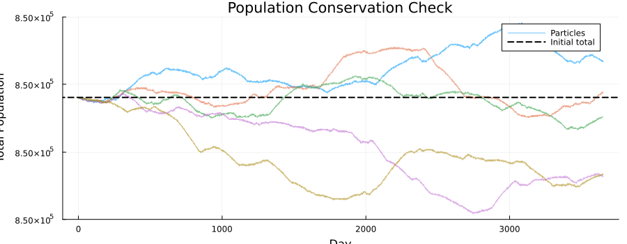
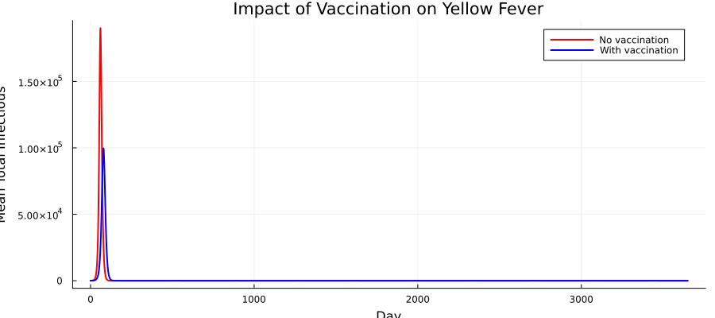

# Yellow Fever SEIRV: Age-Structured Model with Spillover


## Introduction

Yellow fever is a mosquito-borne flavivirus endemic in tropical Africa
and South America. In addition to human-to-human (urban) transmission,
**sylvatic spillover** from non-human primate reservoirs drives
outbreaks even in partially vaccinated populations. The YF-17D vaccine
provides long-lasting immunity but coverage varies by age group and
year.

This vignette builds an **age-structured discrete-time stochastic SEIRV
model** inspired by the [YEP](https://github.com/mrc-ide/YEP) package.
Key features:

| Feature | Odin construct |
|----|----|
| Age structure (5 groups) | `dim(S) = N_age`, 1D arrays |
| SEIRV compartments | Susceptible, Exposed, Infectious, Recovered, Vaccinated |
| Spillover FOI | `interpolate()` for time-varying zoonotic force |
| Time-varying R0 | `interpolate()` for seasonal transmission |
| Population dynamics | Aging in/out flows per age group per year |
| Vaccination | Efficacy-weighted rate from annual schedule |
| Cumulative cases | `C[i]` tracking new infections per step |

``` julia
using Odin
using Plots
using Statistics
using Random
```

## Model Description

### Compartments

For each of $a = 1, \ldots, N_\text{age}$ age groups:

- $S_a$ — Susceptible
- $E_a$ — Exposed (latent)
- $I_a$ — Infectious
- $R_a$ — Recovered (immune)
- $V_a$ — Vaccinated (effectively immune)
- $C_a$ — New cases this time step (reset each step)

### Force of infection

$$\lambda(t) = \min\!\Bigl(1,\;\beta(t) \frac{\sum_a I_a}{P_\text{tot}}
+ \text{FOI}_\text{spillover}(t)\Bigr)$$

where $\beta(t) = R_0(t) / t_\text{infectious}$ and
$\text{FOI}_\text{spillover}(t)$ is a time-varying zoonotic force.

### Population dynamics

Each time step, individuals flow between age groups via demographic
rates `dP1` (inflow) and `dP2` (outflow), distributed proportionally
across compartments. The youngest age group receives external inflow via
`dP1[1]` added to susceptibles.

## Model Definition

``` julia
yf_seirv = @odin begin
    # === Configuration ===
    N_age = parameter(5)

    # === Dimensions ===
    dim(S) = N_age
    dim(E) = N_age
    dim(I) = N_age
    dim(R) = N_age
    dim(V) = N_age
    dim(C) = N_age

    dim(S_0) = N_age
    dim(E_0) = N_age
    dim(I_0) = N_age
    dim(R_0) = N_age
    dim(V_0) = N_age

    dim(dP1) = N_age
    dim(dP2) = N_age
    dim(E_new) = N_age
    dim(I_new) = N_age
    dim(R_new) = N_age
    dim(P_nV) = N_age
    dim(inv_P_nV) = N_age
    dim(P) = N_age
    dim(inv_P) = N_age
    dim(vacc_eff) = N_age

    # === Epidemiological rates ===
    t_latent = parameter(5.0)
    t_infectious = parameter(5.0)
    rate1 = 1.0 / t_latent
    rate2 = 1.0 / t_infectious

    # === Time-varying R0 and spillover ===
    R0_t = interpolate(R0_time, R0_value, :linear)
    FOI_sp = interpolate(sp_time, sp_value, :linear)
    beta = R0_t / t_infectious

    # === Force of infection ===
    P_total = sum(P)
    I_total = sum(I)
    FOI_raw = beta * I_total / max(P_total, 1.0) + FOI_sp
    FOI_max = 1.0
    FOI_sum = min(FOI_max, FOI_raw)

    # === Population totals per age ===
    P_nV[i] = max(S[i] + R[i], 1e-99)
    inv_P_nV[i] = 1.0 / P_nV[i]
    P[i] = max(P_nV[i] + V[i], 1e-99)
    inv_P[i] = 1.0 / P[i]

    # === Transitions ===
    p_inf = 1 - exp(-FOI_sum * dt)
    p_lat = 1 - exp(-rate1 * dt)
    p_rec = 1 - exp(-rate2 * dt)

    E_new[i] = Binomial(S[i], p_inf)
    I_new[i] = Binomial(E[i], p_lat)
    R_new[i] = Binomial(I[i], p_rec)

    # === Vaccination ===
    vaccine_efficacy = parameter(0.95)
    vacc_eff[i] = vacc_rate[i] * vaccine_efficacy * dt

    # === Demographic flows ===
    dP1_rate = interpolate(dP1_time, dP1_value, :constant)
    dP2_rate = interpolate(dP2_time, dP2_value, :constant)
    dP1[i] = dP1_rate * 0.01
    dP2[i] = dP2_rate * 0.01

    # === State updates: age group 1 (youngest) ===
    update(S[1]) = max(0.0, S[1] - E_new[1]
                       - vacc_eff[1] * S[1] * inv_P_nV[1]
                       + dP1[1]
                       - dP2[1] * S[1] * inv_P[1])
    update(E[1]) = max(0.0, E[1] + E_new[1] - I_new[1])
    update(I[1]) = max(0.0, I[1] + I_new[1] - R_new[1])
    update(R[1]) = max(0.0, R[1] + R_new[1]
                       - vacc_eff[1] * R[1] * inv_P_nV[1]
                       - dP2[1] * R[1] * inv_P[1])
    update(V[1]) = max(0.0, V[1] + vacc_eff[1]
                       - dP2[1] * V[1] * inv_P[1])

    # === State updates: age groups 2..N_age (aging from i-1) ===
    update(S[2:N_age]) = max(0.0, S[i] - E_new[i]
                             - vacc_eff[i] * S[i] * inv_P_nV[i]
                             + dP1[i] * S[i - 1] * inv_P[i - 1]
                             - dP2[i] * S[i] * inv_P[i])
    update(E[2:N_age]) = max(0.0, E[i] + E_new[i] - I_new[i])
    update(I[2:N_age]) = max(0.0, I[i] + I_new[i] - R_new[i])
    update(R[2:N_age]) = max(0.0, R[i] + R_new[i]
                             - vacc_eff[i] * R[i] * inv_P_nV[i]
                             + dP1[i] * R[i - 1] * inv_P[i - 1]
                             - dP2[i] * R[i] * inv_P[i])
    update(V[2:N_age]) = max(0.0, V[i] + vacc_eff[i]
                             + dP1[i] * V[i - 1] * inv_P[i - 1]
                             - dP2[i] * V[i] * inv_P[i])

    # === Cumulative new cases per step (reset each step) ===
    initial(C[i], zero_every = 1) = 0
    update(C[i]) = C[i] + I_new[i]

    # === Outputs ===
    output(FOI_total) = FOI_sum
    output(total_I) = I_total
    output(total_pop) = P_total

    # === Initial conditions ===
    initial(S[i]) = S_0[i]
    initial(E[i]) = E_0[i]
    initial(I[i]) = I_0[i]
    initial(R[i]) = R_0[i]
    initial(V[i]) = V_0[i]

    # === Parameters ===
    S_0 = parameter()
    E_0 = parameter()
    I_0 = parameter()
    R_0 = parameter()
    V_0 = parameter()
    vacc_rate = parameter(rank = 1)

    R0_time = parameter(rank = 1)
    R0_value = parameter(rank = 1)
    sp_time = parameter(rank = 1)
    sp_value = parameter(rank = 1)
    dP1_time = parameter(rank = 1)
    dP1_value = parameter(rank = 1)
    dP2_time = parameter(rank = 1)
    dP2_value = parameter(rank = 1)
end
```

    Odin.DustSystemGenerator{var"##OdinModel#277"}(var"##OdinModel#277"(0, [:C, :S, :E, :I, :R, :V], [:N_age, :t_latent, :t_infectious, :vaccine_efficacy, :S_0, :E_0, :I_0, :R_0, :V_0, :vacc_rate, :R0_time, :R0_value, :sp_time, :sp_value, :dP1_time, :dP1_value, :dP2_time, :dP2_value], false, false, false, true, true, Dict{Symbol, Array}()))

## Parameter Setup

### Demographics

We use five age groups — 0–4 years, 5–14, 15–29, 30–49, and 50+ — with
population sizes reflecting a typical sub-Saharan African age
distribution:

``` julia
N_age = 5
age_labels = ["0–4", "5–14", "15–29", "30–49", "50+"]
age_colors = [:blue, :red, :green, :orange, :purple]

pop = [150_000.0, 250_000.0, 200_000.0, 150_000.0, 100_000.0]
N_total = sum(pop)
println("Total population: ", Int(N_total))
```

    Total population: 850000

### Initial conditions

We seed a small number of infections in the 15–29 age group, with some
pre-existing immunity and vaccination:

``` julia
S_0 = copy(pop)
E_0 = zeros(N_age)
I_0 = zeros(N_age)
R_0 = zeros(N_age)
V_0 = zeros(N_age)

# Pre-existing immunity (10–30% by age)
immun_frac = [0.05, 0.10, 0.15, 0.20, 0.30]
for i in 1:N_age
    R_0[i] = round(pop[i] * immun_frac[i])
    S_0[i] -= R_0[i]
end

# Pre-existing vaccination (varies by age)
vacc_frac = [0.30, 0.40, 0.20, 0.10, 0.05]
for i in 1:N_age
    V_0[i] = round(pop[i] * vacc_frac[i])
    S_0[i] -= V_0[i]
end

# Seed 50 infections in 15–29 age group
I_0[3] = 50.0
S_0[3] -= 50.0

println("S_0: ", S_0)
println("R_0: ", R_0)
println("V_0: ", V_0)
println("I_0: ", I_0)
```

    S_0: [97500.0, 125000.0, 129950.0, 105000.0, 65000.0]
    R_0: [7500.0, 25000.0, 30000.0, 30000.0, 30000.0]
    V_0: [45000.0, 100000.0, 40000.0, 15000.0, 5000.0]
    I_0: [0.0, 0.0, 50.0, 0.0, 0.0]

### Time-varying R0 and spillover FOI

R0 has a seasonal pattern peaking mid-year (wet season), while spillover
FOI has occasional pulses:

``` julia
n_years = 10
t_end = 365.0 * n_years

# R0: seasonal pattern (range 2–5)
R0_time = collect(0.0:30.0:(t_end + 30.0))
R0_value = [3.5 + 1.5 * sin(2π * t / 365) for t in R0_time]

# Spillover FOI: background + occasional pulses
sp_time = collect(0.0:30.0:(t_end + 30.0))
sp_value = [1e-6 + 5e-5 * max(0, sin(2π * t / 365 - π/3))^3 for t in sp_time]

plot(R0_time[1:50], R0_value[1:50], lw=2, color=:steelblue,
     xlabel="Day", ylabel="R0", title="Time-varying R0 (first 4 years)",
     label="R0", legend=:topright)
```



``` julia
plot(sp_time[1:50], sp_value[1:50] .* 1e5, lw=2, color=:darkred,
     xlabel="Day", ylabel="FOI × 10⁵", title="Spillover FOI (first 4 years)",
     label="Spillover", legend=:topright)
```



### Demographic rates and vaccination

``` julia
# Demographic flows (simple constant rates for aging)
dP1_time = [0.0, t_end + 1.0]
dP1_value = [1.0, 1.0]
dP2_time = [0.0, t_end + 1.0]
dP2_value = [1.0, 1.0]

# Daily vaccination rates by age group
vacc_rate = [0.001, 0.0005, 0.0003, 0.0002, 0.0001]
```

    5-element Vector{Float64}:
     0.001
     0.0005
     0.0003
     0.0002
     0.0001

### Assemble parameters

``` julia
pars = (
    N_age = Float64(N_age),
    t_latent = 5.0,
    t_infectious = 5.0,
    vaccine_efficacy = 0.95,
    S_0 = S_0,
    E_0 = E_0,
    I_0 = I_0,
    R_0 = R_0,
    V_0 = V_0,
    vacc_rate = vacc_rate,
    R0_time = R0_time,
    R0_value = R0_value,
    sp_time = sp_time,
    sp_value = sp_value,
    dP1_time = dP1_time,
    dP1_value = dP1_value,
    dP2_time = dP2_time,
    dP2_value = dP2_value,
)
```

    (N_age = 5.0, t_latent = 5.0, t_infectious = 5.0, vaccine_efficacy = 0.95, S_0 = [97500.0, 125000.0, 129950.0, 105000.0, 65000.0], E_0 = [0.0, 0.0, 0.0, 0.0, 0.0], I_0 = [0.0, 0.0, 50.0, 0.0, 0.0], R_0 = [7500.0, 25000.0, 30000.0, 30000.0, 30000.0], V_0 = [45000.0, 100000.0, 40000.0, 15000.0, 5000.0], vacc_rate = [0.001, 0.0005, 0.0003, 0.0002, 0.0001], R0_time = [0.0, 30.0, 60.0, 90.0, 120.0, 150.0, 180.0, 210.0, 240.0, 270.0  …  3390.0, 3420.0, 3450.0, 3480.0, 3510.0, 3540.0, 3570.0, 3600.0, 3630.0, 3660.0], R0_value = [3.5, 4.240663325239966, 4.788145937413704, 4.999652752969836, 4.8200183059603035, 4.2960950722429, 3.564533349506796, 2.8161399597373116, 2.246111780872045, 2.003124258701912  …  4.958177294943594, 4.594336331129731, 3.9450692289102482, 3.1797186268403115, 2.497904203679706, 2.077457629981743, 2.0280402945925875, 2.362541287282152, 2.9937156506088316, 3.7569397162722047], sp_time = [0.0, 30.0, 60.0, 90.0, 120.0, 150.0, 180.0, 210.0, 240.0, 270.0  …  3390.0, 3420.0, 3450.0, 3480.0, 3510.0, 3540.0, 3570.0, 3600.0, 3630.0, 3660.0], sp_value = [1.0e-6, 1.0e-6, 1.0e-6, 6.5729391399279415e-6, 3.185015736396266e-5, 5.0903611113164396e-5, 3.586190273481683e-5, 8.997773041104356e-6, 1.0094308797359557e-6, 1.0e-6  …  1.7363724843438468e-5, 4.483304264781666e-5, 4.739744365514602e-5, 2.1203190270689412e-5, 2.4950486203300477e-6, 1.0e-6, 1.0e-6, 1.0e-6, 1.0e-6, 1.0e-6], dP1_time = [0.0, 3651.0], dP1_value = [1.0, 1.0], dP2_time = [0.0, 3651.0], dP2_value = [1.0, 1.0])

## Simulation

We run 10 stochastic particles for 10 years:

``` julia
n_particles = 10
sim_times = collect(0.0:1.0:t_end)

result = simulate(yf_seirv, pars;
    times=sim_times, dt=1.0, seed=42, n_particles=n_particles)

println("Result shape: ", size(result),
        "  (n_state+n_output × n_particles × n_times)")
```

    Result shape: (33, 10, 3651)  (n_state+n_output × n_particles × n_times)

### State layout

``` julia
# State layout follows initial() declaration order:
# C[1:5] (zero_every declared first), S[6:10], E[11:15], I[16:20], R[21:25], V[26:30]
# Outputs: FOI_total, total_I, total_pop (indices 31, 32, 33)
idx_C = 1:N_age
idx_S = (N_age+1):(2*N_age)
idx_E = (2*N_age+1):(3*N_age)
idx_I = (3*N_age+1):(4*N_age)
idx_R = (4*N_age+1):(5*N_age)
idx_V = (5*N_age+1):(6*N_age)
out_offset = 6 * N_age

println("C indices: ", idx_C)
println("S indices: ", idx_S)
println("I indices: ", idx_I)
println("V indices: ", idx_V)
println("Output offset: ", out_offset)
```

    C indices: 1:5
    S indices: 6:10
    I indices: 16:20
    V indices: 26:30
    Output offset: 30

## Visualization

### SEIRV compartments (mean across particles)

``` julia
S_total = vec(mean(sum(result[idx_S, :, :], dims=1), dims=2))
E_total = vec(mean(sum(result[idx_E, :, :], dims=1), dims=2))
I_total = vec(mean(sum(result[idx_I, :, :], dims=1), dims=2))
R_total = vec(mean(sum(result[idx_R, :, :], dims=1), dims=2))
V_total = vec(mean(sum(result[idx_V, :, :], dims=1), dims=2))

p = plot(xlabel="Day", ylabel="Population",
         title="Yellow Fever SEIRV Dynamics (mean of $n_particles particles)",
         legend=:right, size=(900, 400))
plot!(p, sim_times, S_total, lw=2, label="S", color=:blue)
plot!(p, sim_times, E_total, lw=2, label="E", color=:orange)
plot!(p, sim_times, I_total, lw=2, label="I", color=:red)
plot!(p, sim_times, R_total, lw=2, label="R", color=:green)
plot!(p, sim_times, V_total, lw=2, label="V", color=:purple)
p
```



### Infectious by age group

``` julia
p = plot(xlabel="Day", ylabel="Mean Infectious",
         title="Infectious by Age Group", legend=:topright, size=(900, 400))
for a in 1:N_age
    I_a = vec(mean(result[idx_I[a], :, :], dims=1))
    plot!(p, sim_times, I_a, lw=2, color=age_colors[a], label=age_labels[a])
end
p
```



### Vaccination coverage over time

``` julia
p = plot(xlabel="Day", ylabel="Mean Vaccinated (%)",
         title="Vaccination Coverage by Age Group",
         legend=:topleft, size=(900, 400))
for a in 1:N_age
    V_a = vec(mean(result[idx_V[a], :, :], dims=1))
    coverage = V_a ./ pop[a] .* 100
    plot!(p, sim_times, coverage, lw=2, color=age_colors[a],
          label=age_labels[a])
end
p
```



### Force of infection

``` julia
FOI = vec(mean(result[out_offset + 1, :, :], dims=1))

plot(sim_times, FOI, lw=1.5, color=:darkred,
     xlabel="Day", ylabel="FOI",
     title="Total Force of Infection (mean across particles)",
     label="FOI", legend=:topright, size=(900, 350))
```



### Cumulative cases by age

``` julia
cum_cases = zeros(N_age, length(sim_times))
for a in 1:N_age
    daily = vec(mean(result[idx_C[a], :, :], dims=1))
    cum_cases[a, :] = cumsum(daily)
end

p = plot(xlabel="Day", ylabel="Cumulative Cases",
         title="Cumulative Cases by Age Group",
         legend=:topleft, size=(900, 400))
for a in 1:N_age
    plot!(p, sim_times, cum_cases[a, :], lw=2,
          color=age_colors[a], label=age_labels[a])
end
p
```



### Stochastic variability

``` julia
p = plot(xlabel="Day", ylabel="Total Infectious",
         title="Stochastic Variability ($n_particles realisations)",
         legend=false, size=(900, 400))
for i in 1:n_particles
    I_tot = sum(result[idx_I, i, :], dims=1)[:]
    plot!(p, sim_times, I_tot, color=:red, alpha=0.4, lw=0.8)
end
I_mean = vec(mean(sum(result[idx_I, :, :], dims=1), dims=2))
plot!(p, sim_times, I_mean, color=:black, lw=3)
p
```



## Population Conservation Check

The total population should remain approximately constant (small changes
due to demographic flows and the `max(0, ...)` floor):

``` julia
p = plot(xlabel="Day", ylabel="Total Population",
         title="Population Conservation Check", legend=:topright,
         size=(900, 350))
for i in 1:min(5, n_particles)
    pop_total = sum(result[idx_S, i, :], dims=1)[:] .+
                sum(result[idx_E, i, :], dims=1)[:] .+
                sum(result[idx_I, i, :], dims=1)[:] .+
                sum(result[idx_R, i, :], dims=1)[:] .+
                sum(result[idx_V, i, :], dims=1)[:] 
    plot!(p, sim_times, pop_total, lw=1, alpha=0.6, label=(i == 1 ? "Particles" : ""))
end
hline!(p, [N_total], color=:black, lw=2, ls=:dash, label="Initial total")
p
```



``` julia
# Quantify conservation error
pop_t = zeros(n_particles, length(sim_times))
for i in 1:n_particles
    pop_t[i, :] = sum(result[idx_S, i, :], dims=1)[:] .+
                  sum(result[idx_E, i, :], dims=1)[:] .+
                  sum(result[idx_I, i, :], dims=1)[:] .+
                  sum(result[idx_R, i, :], dims=1)[:] .+
                  sum(result[idx_V, i, :], dims=1)[:]
end
println("Population at t=0: ", mean(pop_t[:, 1]))
println("Population at t=end: ", mean(pop_t[:, end]))
rel_change = abs(mean(pop_t[:, end]) - N_total) / N_total * 100
println("Relative change: ", round(rel_change, digits=4), "%")
```

    Population at t=0: 850000.0
    Population at t=end: 849999.9999999919
    Relative change: 0.0%

## Scenario: No Vaccination

We compare the epidemic with and without vaccination:

``` julia
pars_novacc = merge(pars, (vacc_rate = zeros(N_age), V_0 = zeros(N_age),
                            S_0 = pop .- R_0 .- I_0))

result_novacc = simulate(yf_seirv, pars_novacc;
    times=sim_times, dt=1.0, seed=42, n_particles=n_particles)

I_vacc = vec(mean(sum(result[idx_I, :, :], dims=1), dims=2))
I_novacc = vec(mean(sum(result_novacc[idx_I, :, :], dims=1), dims=2))

plot(sim_times, I_novacc, lw=2, color=:red, label="No vaccination",
     xlabel="Day", ylabel="Mean Total Infectious",
     title="Impact of Vaccination on Yellow Fever",
     legend=:topright, size=(900, 400))
plot!(sim_times, I_vacc, lw=2, color=:blue, label="With vaccination")
```



## Benchmark

``` julia
using BenchmarkTools

@benchmark simulate($yf_seirv, $pars;
    times=$sim_times, dt=1.0, seed=42, n_particles=10)
```

    BenchmarkTools.Trial: 221 samples with 1 evaluation per sample.
     Range (min … max):  20.672 ms … 56.397 ms  ┊ GC (min … max): 0.00% … 30.88%
     Time  (median):     21.576 ms              ┊ GC (median):    0.00%
     Time  (mean ± σ):   22.665 ms ±  3.057 ms  ┊ GC (mean ± σ):  5.03% ±  7.93%

          █▆▆▇                                                     
      ▂▄▆█████▇▅▆▃▂▄▂▁▁▁▁▂▁▁▁▁▁▁▁▁▁▁▁▁▁▁▃▂▃▇▅▄▄▄▁▁▃▂▂▃▁▂▁▁▁▁▁▁▂▁▃ ▃
      20.7 ms         Histogram: frequency by time        28.2 ms <

     Memory estimate: 14.87 MiB, allocs estimate: 110079.

## Summary

| Component                | Value                                     |
|--------------------------|-------------------------------------------|
| **Age groups**           | 5 (0–4, 5–14, 15–29, 30–49, 50+)          |
| **Compartments**         | SEIRV + cumulative cases                  |
| **State variables**      | 30 (6 compartments × 5 age groups)        |
| **Time step**            | 1 day                                     |
| **Simulation**           | 10 years (3650 days), 10 particles        |
| **Stochastic draws**     | Binomial for infection, latency, recovery |
| **Time-varying forcing** | R0 and spillover FOI via `interpolate()`  |

### Key takeaways

1.  **Partial array updates** (`update(S[1])` vs `update(S[2:N_age])`)
    allow different aging rules for the youngest vs older age groups —
    inflow from births for group 1, vs aging from the previous group for
    groups 2+.

2.  **Interpolated time-varying parameters** (`R0_t`, `FOI_sp`) provide
    flexible seasonal and episodic forcing without requiring the model
    to track time indices explicitly.

3.  **`max(0, ...)`** floors prevent negative populations from
    stochastic overshooting, a common issue in discrete-time models with
    large time steps or small compartments.

4.  **Population dynamics** (demographic aging flows) can create small
    conservation errors when combined with the max-floor, but the
    relative change remains negligible over the simulation period.

| Step                | API                                                  |
|---------------------|------------------------------------------------------|
| Define model        | `@odin begin … end` with 1D arrays and interpolation |
| Simulate            | `simulate(gen, pars; times, dt, seed, n_particles)`  |
| Scenario comparison | Re-run with `vacc_rate = zeros(N_age)`               |
