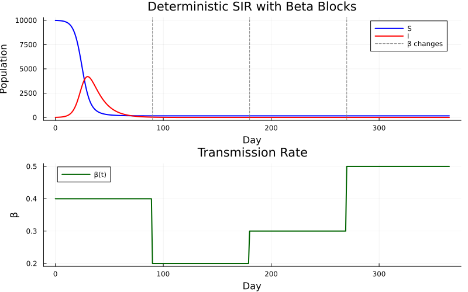
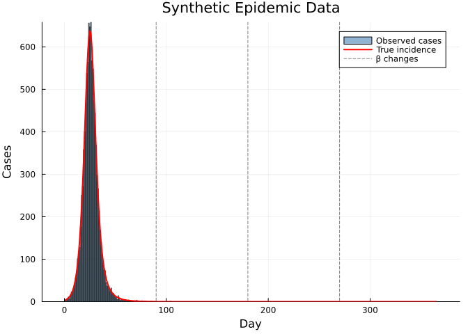
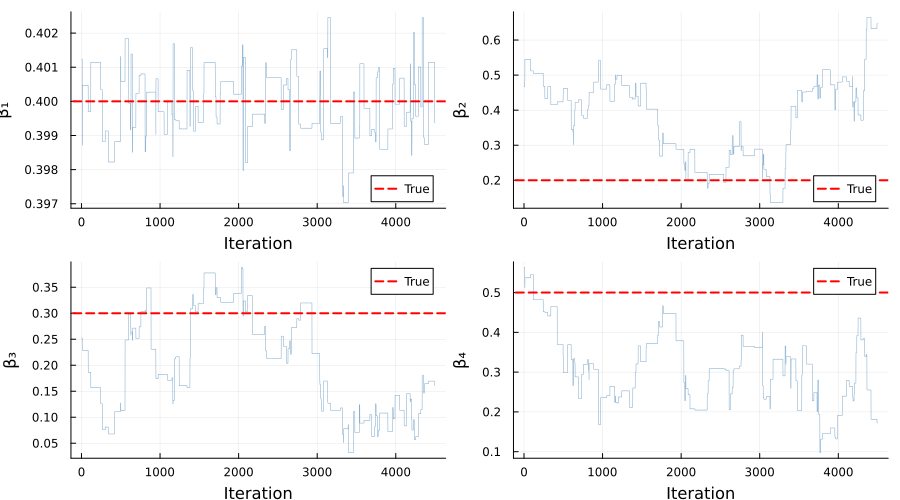
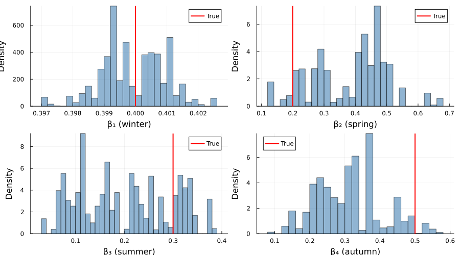
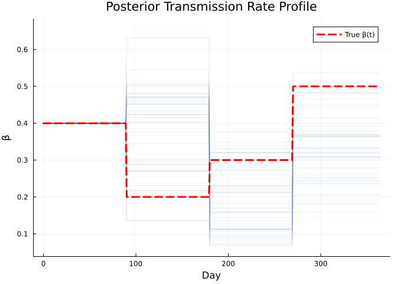
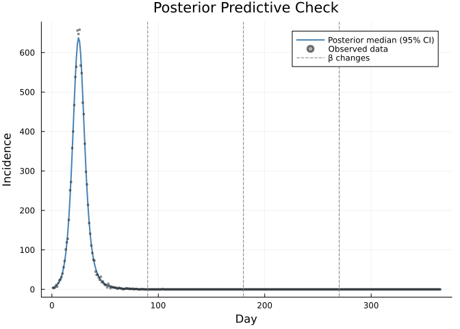

# Piecewise-Constant Transmission Rate (Beta Blocks)


## Introduction

Many infectious disease outbreaks exhibit time-varying transmission due
to seasonality, interventions, or behavioural changes. A common and
practical approach is to model the transmission rate β as a
**piecewise-constant** (step) function over predefined time intervals —
often called “beta blocks”.

This vignette demonstrates:

1.  Defining a **deterministic** discrete-time SIR model with
    piecewise-constant β via `interpolate()`
2.  Simulating an epidemic with seasonal β changes
3.  Generating synthetic Poisson-observed case data
4.  Fitting the model with **MCMC** (random-walk Metropolis) to recover
    the β values from data
5.  Visualising posterior distributions and model fit

The model is *deterministic* — new infections are computed as `S * p_SI`
(a continuous quantity) rather than drawn from `Binomial(S, p_SI)`. This
makes the state evolution reproducible and the likelihood exact with a
single particle, which is ideal for fast inference.

``` julia
using Odin
using Distributions
using Plots
using Statistics
using Random
using LinearAlgebra: diagm
```

## Model Definition

The model tracks susceptible (S), infectious (I), and daily incidence.
The transmission rate β is a step function defined by breakpoint times
and corresponding values.

``` julia
sir_beta_blocks = @odin begin
    # State updates (deterministic)
    update(S) = S - new_inf
    update(I) = I + new_inf - new_rec
    initial(S) = N - I0
    initial(I) = I0

    # Incidence resets each integer time step
    initial(incidence, zero_every = 1) = 0
    update(incidence) = new_inf

    # Deterministic transition probabilities
    p_SI = 1 - exp(-beta_t * I / N * dt)
    p_IR = 1 - exp(-gamma * dt)
    new_inf = S * p_SI
    new_rec = I * p_IR

    # Piecewise-constant transmission rate
    beta_times = parameter(rank = 1)
    beta_values = parameter(rank = 1)
    beta_t = interpolate(beta_times, beta_values, :constant)

    # Fixed parameters
    N = parameter()
    I0 = parameter()
    gamma = parameter()

    # Data comparison: observed cases ~ Poisson(incidence)
    cases = data()
    cases ~ Poisson(incidence + 1e-6)
end
```

    Odin.DustSystemGenerator{var"##OdinModel#277"}(var"##OdinModel#277"(3, [:S, :I, :incidence], [:beta_times, :beta_values, :N, :I0, :gamma], false, false, true, false, true, Dict{Symbol, Array}()))

## Simulation Scenario

We define four seasonal β blocks over one year (365 days):

| Period | Days    | β   | Interpretation        |
|--------|---------|-----|-----------------------|
| Winter | 0–89    | 0.4 | Moderate transmission |
| Spring | 90–179  | 0.2 | Low transmission      |
| Summer | 180–269 | 0.3 | Rising transmission   |
| Autumn | 270–364 | 0.5 | High transmission     |

``` julia
true_beta_times = [0.0, 90.0, 180.0, 270.0]
true_beta_values = [0.4, 0.2, 0.3, 0.5]

true_pars = (
    beta_times = true_beta_times,
    beta_values = true_beta_values,
    N = 10000.0,
    I0 = 10.0,
    gamma = 0.1,
)

times = collect(0.0:1.0:365.0)
result = simulate(sir_beta_blocks, true_pars;
    times = times, dt = 1.0, seed = 1, n_particles = 1)
```

    3×1×366 Array{Float64, 3}:
    [:, :, 1] =
     9990.0
       10.0
        0.0

    [:, :, 2] =
     9986.00479909345
       13.043575086908714
        3.99520090654912

    [:, :, 3] =
     9980.796029894445
       17.011084002602374
        5.208769199005726

    ;;; … 

    [:, :, 364] =
     160.72376932557108
       1.9804412473600367e-10
       1.7487044472359757e-12

    [:, :, 365] =
     160.7237693255695
       1.8078584362417422e-10
       1.5881091408571441e-12

    [:, :, 366] =
     160.72376932556804
       1.6502715371975984e-10
       1.4453577574092968e-12

## Visualising the Simulation

``` julia
p1 = plot(times, result[1, 1, :], label = "S", lw = 2, color = :blue)
plot!(p1, times, result[2, 1, :], label = "I", lw = 2, color = :red)
vline!(p1, [90, 180, 270], ls = :dash, color = :gray, label = "β changes")
xlabel!(p1, "Day")
ylabel!(p1, "Population")
title!(p1, "Deterministic SIR with Beta Blocks")

# Transmission rate profile
beta_plot_times = 0.0:1.0:365.0
beta_profile = [t < 90 ? 0.4 : t < 180 ? 0.2 : t < 270 ? 0.3 : 0.5
                for t in beta_plot_times]
p2 = plot(collect(beta_plot_times), beta_profile,
    lw = 2, color = :darkgreen, label = "β(t)",
    xlabel = "Day", ylabel = "β", title = "Transmission Rate")

plot(p1, p2, layout = (2, 1), size = (800, 500))
```



## Generate Synthetic Case Data

We add Poisson observation noise to the deterministic incidence to
create realistic case counts.

``` julia
Random.seed!(42)
true_incidence = result[3, 1, 2:end]  # incidence at times 1..365
observed_cases = [rand(Poisson(max(inc, 1e-6))) for inc in true_incidence]

p_cases = bar(1:365, observed_cases,
    alpha = 0.6, color = :steelblue, label = "Observed cases",
    xlabel = "Day", ylabel = "Cases", title = "Synthetic Epidemic Data")
plot!(p_cases, 1:365, true_incidence,
    lw = 2, color = :red, label = "True incidence")
vline!(p_cases, [90, 180, 270], ls = :dash, color = :gray, label = "β changes")
p_cases
```



## Inference Setup

We fit the four β values while holding all other parameters fixed at
their true values.

### Prepare filter data

``` julia
data = ObservedData(
    [(time = Float64(t), cases = Float64(c))
     for (t, c) in zip(times[2:end], observed_cases)]
)
```

    Odin.FilterData{@NamedTuple{cases::Float64}}([1.0, 2.0, 3.0, 4.0, 5.0, 6.0, 7.0, 8.0, 9.0, 10.0  …  356.0, 357.0, 358.0, 359.0, 360.0, 361.0, 362.0, 363.0, 364.0, 365.0], [(cases = 4.0,), (cases = 3.0,), (cases = 5.0,), (cases = 11.0,), (cases = 7.0,), (cases = 16.0,), (cases = 23.0,), (cases = 25.0,), (cases = 31.0,), (cases = 40.0,)  …  (cases = 0.0,), (cases = 0.0,), (cases = 0.0,), (cases = 0.0,), (cases = 0.0,), (cases = 0.0,), (cases = 0.0,), (cases = 0.0,), (cases = 0.0,), (cases = 0.0,)])

### Parameter packer

The packer maps a flat 4-element vector to named β values, and assembles
them into the `beta_values` array that the model expects.

``` julia
packer = Packer(
    [:beta1, :beta2, :beta3, :beta4];
    fixed = (
        N = 10000.0,
        I0 = 10.0,
        gamma = 0.1,
        beta_times = [0.0, 90.0, 180.0, 270.0],
    ),
    process = nt -> (beta_values = [nt.beta1, nt.beta2, nt.beta3, nt.beta4],),
)
```

    MontyPacker([:beta1, :beta2, :beta3, :beta4], [:beta1, :beta2, :beta3, :beta4], Symbol[], Dict{Symbol, Tuple}(), Dict{Symbol, UnitRange{Int64}}(:beta2 => 2:2, :beta4 => 4:4, :beta3 => 3:3, :beta1 => 1:1), 4, (N = 10000.0, I0 = 10.0, gamma = 0.1, beta_times = [0.0, 90.0, 180.0, 270.0]), var"#11#12"())

### Likelihood

Since the model is deterministic, a single particle gives the exact
likelihood — no particle filter variance.

``` julia
filter = Likelihood(sir_beta_blocks, data;
    n_particles = 1, dt = 1.0, seed = 1)
likelihood = as_model(filter, packer)
```

    MontyModel{Odin.var"#dust_likelihood_monty##0#dust_likelihood_monty##1"{DustFilter{var"##OdinModel#277", Float64, @NamedTuple{cases::Float64}}, MontyPacker}, Nothing, Nothing, Nothing}(["beta1", "beta2", "beta3", "beta4"], Odin.var"#dust_likelihood_monty##0#dust_likelihood_monty##1"{DustFilter{var"##OdinModel#277", Float64, @NamedTuple{cases::Float64}}, MontyPacker}(DustFilter{var"##OdinModel#277", Float64, @NamedTuple{cases::Float64}}(Odin.DustSystemGenerator{var"##OdinModel#277"}(var"##OdinModel#277"(3, [:S, :I, :incidence], [:beta_times, :beta_values, :N, :I0, :gamma], false, false, true, false, true, Dict{Symbol, Array}())), Odin.FilterData{@NamedTuple{cases::Float64}}([1.0, 2.0, 3.0, 4.0, 5.0, 6.0, 7.0, 8.0, 9.0, 10.0  …  356.0, 357.0, 358.0, 359.0, 360.0, 361.0, 362.0, 363.0, 364.0, 365.0], [(cases = 4.0,), (cases = 3.0,), (cases = 5.0,), (cases = 11.0,), (cases = 7.0,), (cases = 16.0,), (cases = 23.0,), (cases = 25.0,), (cases = 31.0,), (cases = 40.0,)  …  (cases = 0.0,), (cases = 0.0,), (cases = 0.0,), (cases = 0.0,), (cases = 0.0,), (cases = 0.0,), (cases = 0.0,), (cases = 0.0,), (cases = 0.0,), (cases = 0.0,)]), 0.0, 1, 1.0, 1, false, nothing), MontyPacker([:beta1, :beta2, :beta3, :beta4], [:beta1, :beta2, :beta3, :beta4], Symbol[], Dict{Symbol, Tuple}(), Dict{Symbol, UnitRange{Int64}}(:beta2 => 2:2, :beta4 => 4:4, :beta3 => 3:3, :beta1 => 1:1), 4, (N = 10000.0, I0 = 10.0, gamma = 0.1, beta_times = [0.0, 90.0, 180.0, 270.0]), var"#11#12"())), nothing, nothing, nothing, Odin.MontyModelProperties(false, false, true, false))

### Prior

We place weakly informative Gamma priors on each β value, centred around
plausible transmission rates.

``` julia
prior = @prior begin
    beta1 ~ Gamma(4.0, 0.1)
    beta2 ~ Gamma(4.0, 0.1)
    beta3 ~ Gamma(4.0, 0.1)
    beta4 ~ Gamma(4.0, 0.1)
end
```

    MontyModel{var"#16#17", var"#18#19"{var"#16#17"}, var"#20#21", Matrix{Float64}}(["beta1", "beta2", "beta3", "beta4"], var"#16#17"(), var"#18#19"{var"#16#17"}(var"#16#17"()), var"#20#21"(), [0.0 Inf; 0.0 Inf; 0.0 Inf; 0.0 Inf], Odin.MontyModelProperties(true, true, false, false))

### Posterior

``` julia
posterior = likelihood + prior
```

    MontyModel{Odin.var"#monty_model_combine##0#monty_model_combine##1"{MontyModel{Odin.var"#dust_likelihood_monty##0#dust_likelihood_monty##1"{DustFilter{var"##OdinModel#277", Float64, @NamedTuple{cases::Float64}}, MontyPacker}, Nothing, Nothing, Nothing}, MontyModel{var"#16#17", var"#18#19"{var"#16#17"}, var"#20#21", Matrix{Float64}}}, Odin.var"#monty_model_combine##4#monty_model_combine##5"{Odin.var"#monty_model_combine##0#monty_model_combine##1"{MontyModel{Odin.var"#dust_likelihood_monty##0#dust_likelihood_monty##1"{DustFilter{var"##OdinModel#277", Float64, @NamedTuple{cases::Float64}}, MontyPacker}, Nothing, Nothing, Nothing}, MontyModel{var"#16#17", var"#18#19"{var"#16#17"}, var"#20#21", Matrix{Float64}}}}, Nothing, Matrix{Float64}}(["beta1", "beta2", "beta3", "beta4"], Odin.var"#monty_model_combine##0#monty_model_combine##1"{MontyModel{Odin.var"#dust_likelihood_monty##0#dust_likelihood_monty##1"{DustFilter{var"##OdinModel#277", Float64, @NamedTuple{cases::Float64}}, MontyPacker}, Nothing, Nothing, Nothing}, MontyModel{var"#16#17", var"#18#19"{var"#16#17"}, var"#20#21", Matrix{Float64}}}(MontyModel{Odin.var"#dust_likelihood_monty##0#dust_likelihood_monty##1"{DustFilter{var"##OdinModel#277", Float64, @NamedTuple{cases::Float64}}, MontyPacker}, Nothing, Nothing, Nothing}(["beta1", "beta2", "beta3", "beta4"], Odin.var"#dust_likelihood_monty##0#dust_likelihood_monty##1"{DustFilter{var"##OdinModel#277", Float64, @NamedTuple{cases::Float64}}, MontyPacker}(DustFilter{var"##OdinModel#277", Float64, @NamedTuple{cases::Float64}}(Odin.DustSystemGenerator{var"##OdinModel#277"}(var"##OdinModel#277"(3, [:S, :I, :incidence], [:beta_times, :beta_values, :N, :I0, :gamma], false, false, true, false, true, Dict{Symbol, Array}())), Odin.FilterData{@NamedTuple{cases::Float64}}([1.0, 2.0, 3.0, 4.0, 5.0, 6.0, 7.0, 8.0, 9.0, 10.0  …  356.0, 357.0, 358.0, 359.0, 360.0, 361.0, 362.0, 363.0, 364.0, 365.0], [(cases = 4.0,), (cases = 3.0,), (cases = 5.0,), (cases = 11.0,), (cases = 7.0,), (cases = 16.0,), (cases = 23.0,), (cases = 25.0,), (cases = 31.0,), (cases = 40.0,)  …  (cases = 0.0,), (cases = 0.0,), (cases = 0.0,), (cases = 0.0,), (cases = 0.0,), (cases = 0.0,), (cases = 0.0,), (cases = 0.0,), (cases = 0.0,), (cases = 0.0,)]), 0.0, 1, 1.0, 1, false, nothing), MontyPacker([:beta1, :beta2, :beta3, :beta4], [:beta1, :beta2, :beta3, :beta4], Symbol[], Dict{Symbol, Tuple}(), Dict{Symbol, UnitRange{Int64}}(:beta2 => 2:2, :beta4 => 4:4, :beta3 => 3:3, :beta1 => 1:1), 4, (N = 10000.0, I0 = 10.0, gamma = 0.1, beta_times = [0.0, 90.0, 180.0, 270.0]), var"#11#12"())), nothing, nothing, nothing, Odin.MontyModelProperties(false, false, true, false)), MontyModel{var"#16#17", var"#18#19"{var"#16#17"}, var"#20#21", Matrix{Float64}}(["beta1", "beta2", "beta3", "beta4"], var"#16#17"(), var"#18#19"{var"#16#17"}(var"#16#17"()), var"#20#21"(), [0.0 Inf; 0.0 Inf; 0.0 Inf; 0.0 Inf], Odin.MontyModelProperties(true, true, false, false))), Odin.var"#monty_model_combine##4#monty_model_combine##5"{Odin.var"#monty_model_combine##0#monty_model_combine##1"{MontyModel{Odin.var"#dust_likelihood_monty##0#dust_likelihood_monty##1"{DustFilter{var"##OdinModel#277", Float64, @NamedTuple{cases::Float64}}, MontyPacker}, Nothing, Nothing, Nothing}, MontyModel{var"#16#17", var"#18#19"{var"#16#17"}, var"#20#21", Matrix{Float64}}}}(Odin.var"#monty_model_combine##0#monty_model_combine##1"{MontyModel{Odin.var"#dust_likelihood_monty##0#dust_likelihood_monty##1"{DustFilter{var"##OdinModel#277", Float64, @NamedTuple{cases::Float64}}, MontyPacker}, Nothing, Nothing, Nothing}, MontyModel{var"#16#17", var"#18#19"{var"#16#17"}, var"#20#21", Matrix{Float64}}}(MontyModel{Odin.var"#dust_likelihood_monty##0#dust_likelihood_monty##1"{DustFilter{var"##OdinModel#277", Float64, @NamedTuple{cases::Float64}}, MontyPacker}, Nothing, Nothing, Nothing}(["beta1", "beta2", "beta3", "beta4"], Odin.var"#dust_likelihood_monty##0#dust_likelihood_monty##1"{DustFilter{var"##OdinModel#277", Float64, @NamedTuple{cases::Float64}}, MontyPacker}(DustFilter{var"##OdinModel#277", Float64, @NamedTuple{cases::Float64}}(Odin.DustSystemGenerator{var"##OdinModel#277"}(var"##OdinModel#277"(3, [:S, :I, :incidence], [:beta_times, :beta_values, :N, :I0, :gamma], false, false, true, false, true, Dict{Symbol, Array}())), Odin.FilterData{@NamedTuple{cases::Float64}}([1.0, 2.0, 3.0, 4.0, 5.0, 6.0, 7.0, 8.0, 9.0, 10.0  …  356.0, 357.0, 358.0, 359.0, 360.0, 361.0, 362.0, 363.0, 364.0, 365.0], [(cases = 4.0,), (cases = 3.0,), (cases = 5.0,), (cases = 11.0,), (cases = 7.0,), (cases = 16.0,), (cases = 23.0,), (cases = 25.0,), (cases = 31.0,), (cases = 40.0,)  …  (cases = 0.0,), (cases = 0.0,), (cases = 0.0,), (cases = 0.0,), (cases = 0.0,), (cases = 0.0,), (cases = 0.0,), (cases = 0.0,), (cases = 0.0,), (cases = 0.0,)]), 0.0, 1, 1.0, 1, false, nothing), MontyPacker([:beta1, :beta2, :beta3, :beta4], [:beta1, :beta2, :beta3, :beta4], Symbol[], Dict{Symbol, Tuple}(), Dict{Symbol, UnitRange{Int64}}(:beta2 => 2:2, :beta4 => 4:4, :beta3 => 3:3, :beta1 => 1:1), 4, (N = 10000.0, I0 = 10.0, gamma = 0.1, beta_times = [0.0, 90.0, 180.0, 270.0]), var"#11#12"())), nothing, nothing, nothing, Odin.MontyModelProperties(false, false, true, false)), MontyModel{var"#16#17", var"#18#19"{var"#16#17"}, var"#20#21", Matrix{Float64}}(["beta1", "beta2", "beta3", "beta4"], var"#16#17"(), var"#18#19"{var"#16#17"}(var"#16#17"()), var"#20#21"(), [0.0 Inf; 0.0 Inf; 0.0 Inf; 0.0 Inf], Odin.MontyModelProperties(true, true, false, false)))), nothing, [0.0 Inf; 0.0 Inf; 0.0 Inf; 0.0 Inf], Odin.MontyModelProperties(true, false, true, false))

### Check likelihood at truth

``` julia
theta_true = [0.4, 0.2, 0.3, 0.5]
ll_true = likelihood(theta_true)
println("Log-likelihood at true parameters: ", round(ll_true, digits = 2))
```

    Log-likelihood at true parameters: -231.75

## Run MCMC

``` julia
vcv = diagm([0.002, 0.002, 0.002, 0.002])
sampler = random_walk(vcv)

initial = reshape(theta_true, 4, 1)
samples = sample(posterior, sampler, 5000;
    initial = initial, n_chains = 1, n_burnin = 500)
```

    Odin.MontySamples([0.4012387449028203 0.4012387449028203 … 0.3993797461617786 0.3993797461617786; 0.46683233200915375 0.46683233200915375 … 0.6473464841337686 0.6473464841337686; 0.25252037981634506 0.25252037981634506 … 0.1616272507242755 0.1616272507242755; 0.5633434318868803 0.5633434318868803 … 0.17252373015672118 0.17252373015672118;;;], [-231.09832489530922; -231.09832489530922; … ; -232.11384721629938; -232.11384721629938;;], [0.4; 0.2; 0.3; 0.5;;], ["beta1", "beta2", "beta3", "beta4"], Dict{Symbol, Any}(:acceptance_rate => [0.0282]))

## Results

### Parameter Recovery

``` julia
par_names = ["β₁ (winter)", "β₂ (spring)", "β₃ (summer)", "β₄ (autumn)"]

println("Posterior summaries (after burn-in):")
for i in 1:4
    vals = samples.pars[i, :, 1]
    m = round(mean(vals), digits = 3)
    lo = round(quantile(vals, 0.025), digits = 3)
    hi = round(quantile(vals, 0.975), digits = 3)
    println("  $(par_names[i]): $m [$lo, $hi]  (true = $(theta_true[i]))")
end
```

    Posterior summaries (after burn-in):
      β₁ (winter): 0.4 [0.398, 0.402]  (true = 0.4)
      β₂ (spring): 0.383 [0.136, 0.633]  (true = 0.2)
      β₃ (summer): 0.2 [0.063, 0.378]  (true = 0.3)
      β₄ (autumn): 0.311 [0.145, 0.537]  (true = 0.5)

### Trace Plots

``` julia
p_tr = plot(layout = (2, 2), size = (900, 500))
short_names = ["β₁", "β₂", "β₃", "β₄"]
for i in 1:4
    plot!(p_tr, samples.pars[i, :, 1], subplot = i,
        lw = 0.5, alpha = 0.7, label = nothing, color = :steelblue,
        xlabel = "Iteration", ylabel = short_names[i])
    hline!(p_tr, [theta_true[i]], subplot = i,
        lw = 2, color = :red, ls = :dash, label = "True")
end
p_tr
```



### Posterior Distributions

``` julia
p_hist = plot(layout = (2, 2), size = (900, 500))
for i in 1:4
    histogram!(p_hist, samples.pars[i, :, 1], bins = 40,
        alpha = 0.6, normalize = true, label = nothing,
        subplot = i, xlabel = par_names[i], ylabel = "Density",
        color = :steelblue)
    vline!(p_hist, [theta_true[i]], subplot = i,
        lw = 2, color = :red, label = "True")
end
p_hist
```



### Fitted Transmission Rate

``` julia
n_draw = 200
Random.seed!(123)
n_total = size(samples.pars, 2)
idx = rand(1:n_total, n_draw)

p_beta = plot(xlabel = "Day", ylabel = "β",
    title = "Posterior Transmission Rate Profile", legend = :topright)
for j in 1:n_draw
    b = samples.pars[:, idx[j], 1]
    profile = [t < 90 ? b[1] : t < 180 ? b[2] : t < 270 ? b[3] : b[4]
               for t in 0.0:1.0:364.0]
    plot!(p_beta, 0:364, profile, alpha = 0.03, color = :steelblue, label = nothing)
end
plot!(p_beta, collect(0.0:1.0:364.0), beta_profile[1:365],
    lw = 3, color = :red, ls = :dash, label = "True β(t)")
p_beta
```



### Posterior Predictive Epidemic Curve

``` julia
pred_inc = zeros(n_draw, 365)
for j in 1:n_draw
    b = samples.pars[:, idx[j], 1]
    pars_j = merge(true_pars, (
        beta_values = [b[1], b[2], b[3], b[4]],
    ))
    r = simulate(sir_beta_blocks, pars_j;
        times = times, dt = 1.0, seed = 1, n_particles = 1)
    pred_inc[j, :] = r[3, 1, 2:end]
end

med_inc = [median(pred_inc[:, k]) for k in 1:365]
lo_inc = [quantile(pred_inc[:, k], 0.025) for k in 1:365]
hi_inc = [quantile(pred_inc[:, k], 0.975) for k in 1:365]

p_fit = plot(1:365, med_inc,
    ribbon = (med_inc .- lo_inc, hi_inc .- med_inc),
    fillalpha = 0.3, lw = 2, color = :steelblue,
    label = "Posterior median (95% CI)",
    xlabel = "Day", ylabel = "Incidence",
    title = "Posterior Predictive Check")
scatter!(p_fit, 1:365, observed_cases,
    ms = 1.5, alpha = 0.5, color = :gray40, label = "Observed data")
vline!(p_fit, [90, 180, 270], ls = :dash, color = :gray, label = "β changes")
p_fit
```



## Benchmark

``` julia
# Benchmark a single likelihood evaluation
t_ll = @elapsed for _ in 1:1000
    likelihood(theta_true)
end
println("Likelihood evaluation: ", round(t_ll / 1000 * 1e6, digits = 1), " μs (mean of 1000 runs)")

# Benchmark MCMC (short run)
t_mcmc = @elapsed sample(posterior, sampler, 1000;
    initial = initial, n_chains = 1, n_burnin = 0)
println("MCMC (1000 steps): ", round(t_mcmc, digits = 3), " s")
println("  per step: ", round(t_mcmc / 1000 * 1e3, digits = 2), " ms")
```

    Likelihood evaluation: 62.9 μs (mean of 1000 runs)
    MCMC (1000 steps): 0.062 s
      per step: 0.06 ms

## Summary

| Feature              | Syntax                                            |
|----------------------|---------------------------------------------------|
| Deterministic update | `new_inf = S * p_SI` (not `Binomial`)             |
| Piecewise-constant β | `interpolate(beta_times, beta_values, :constant)` |
| Incidence tracking   | `initial(incidence, zero_every = 1)`              |
| Poisson observation  | `cases ~ Poisson(incidence + 1e-6)`               |
| Exact likelihood     | `Likelihood(..., n_particles = 1)`                |
| Array via packer     | `process = nt -> (beta_values = [...],)`          |
| Prior                | `@prior begin β ~ Gamma(...) end`                 |
| MCMC                 | `random_walk(vcv)`                                |

### Key takeaways

1.  **Piecewise-constant β** via `interpolate(..., :constant)` is a
    flexible way to represent time-varying transmission without
    specifying a parametric form.
2.  **Deterministic discrete-time models** with `n_particles = 1` give
    exact likelihoods — no particle filter noise.
3.  The **process function** in `monty_packer` bridges between scalar
    MCMC parameters and the array parameter expected by the model.
4.  With informative data, MCMC recovers the true β block values and
    captures the seasonal pattern.
