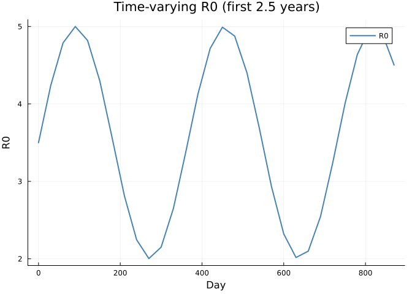
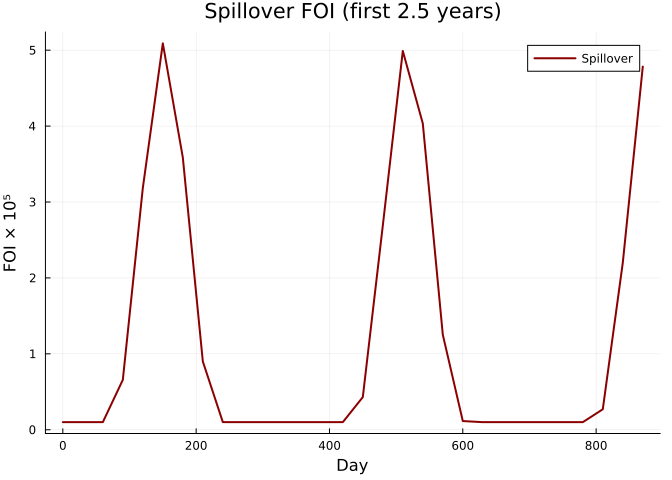
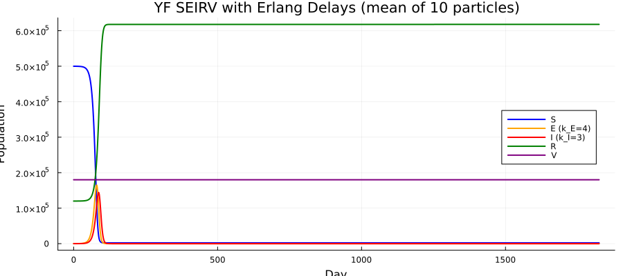
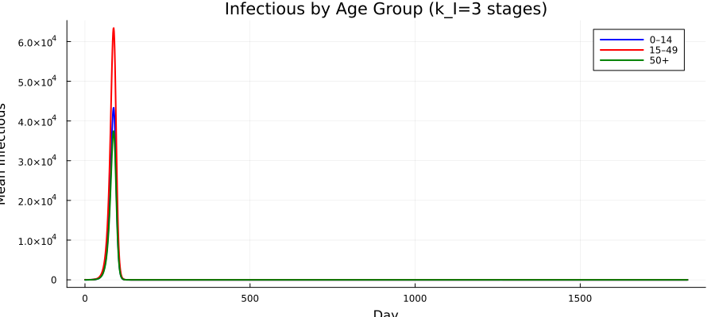
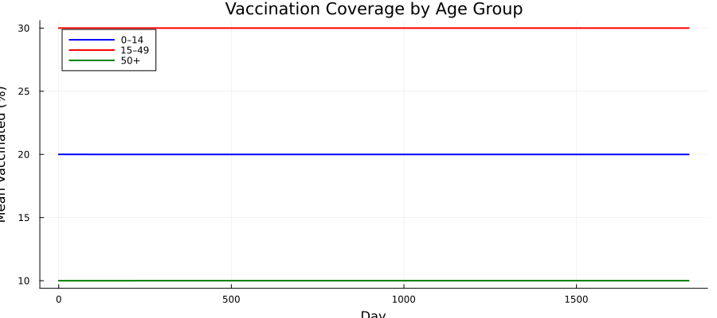
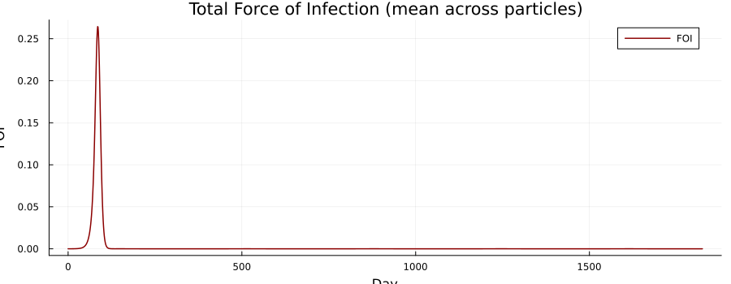
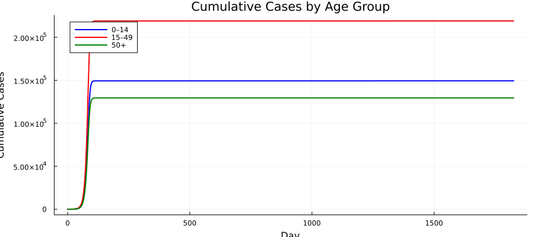
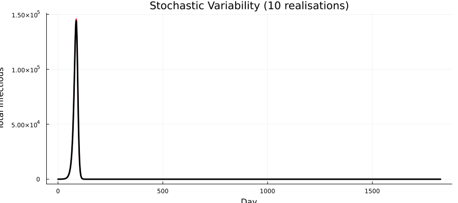
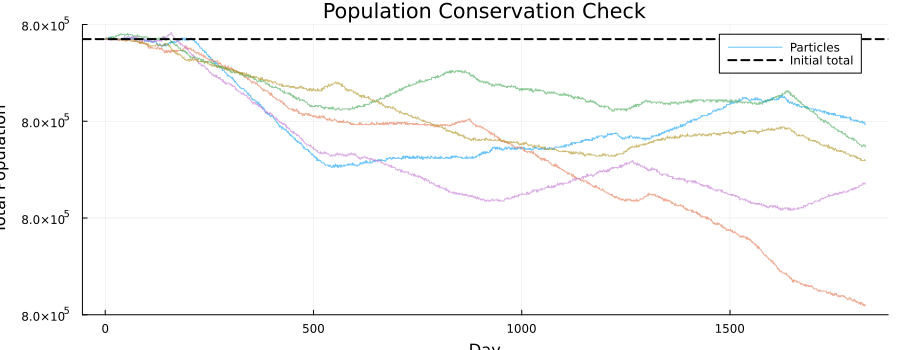

# Yellow Fever SEIRV with Erlang Delay Compartments


## Introduction

Standard compartmental models assume exponentially distributed sojourn
times, which are memoryless — an individual who has been exposed for 4
days is just as likely to become infectious as one exposed moments ago.
Real latent and infectious periods are concentrated around a mean
duration.

The **linear chain trick** (delay compartments) addresses this by
splitting a compartment into $k$ sequential sub-stages. An individual
must pass through all $k$ stages, producing an **Erlang-distributed**
total sojourn time:

| Property | $k = 1$ (Exponential) | $k$ stages (Erlang) |
|----------|-----------------------|---------------------|
| Mean     | $1/\sigma$            | $1/\sigma$          |
| Variance | $1/\sigma^2$          | $1/(k\sigma^2)$     |
| CV       | 1                     | $1/\sqrt{k}$        |
| Shape    | Memoryless            | Peaked around mean  |

Each sub-stage has rate $k\sigma$, so the **mean sojourn time is
preserved** regardless of $k$. Higher $k$ produces sharper, more
realistic epidemic peaks because individuals progress through
compartments more synchronously.

This vignette extends the age-structured Yellow Fever SEIRV model from
[Vignette 20](../20_yellowfever/20_yellowfever.qmd) by replacing single
E and I compartments with Erlang delay chains, following the approach
from [Vignette 11](../11_delay_model/11_delay_model.qmd).

### Key features

| Feature                  | Odin construct                                   |
|--------------------------|--------------------------------------------------|
| Age structure (3 groups) | 1D arrays indexed by `N_age`                     |
| Erlang latent period     | 2D array `E_chain[age, stage]` with `k_E` stages |
| Erlang infectious period | 2D array `I_chain[age, stage]` with `k_I` stages |
| Spillover FOI            | `interpolate()` for time-varying zoonotic force  |
| Vaccination              | Efficacy-weighted rate by age                    |
| Population dynamics      | Aging flows between age groups                   |

``` julia
using Odin
using Plots
using Statistics
using Random
```

## Model Definition

The delay chain works as follows for each age group $a$:

1.  New exposures $E_\text{new}[a]$ enter the first stage:
    `E_chain[a, 1]`
2.  At each step, individuals progress: `E_chain[a, j]` →
    `E_chain[a, j+1]`
3.  Exits from the last stage `E_chain[a, k_E]` become new infectious
    cases

The same pattern applies to the I chain. We use 2D arrays
`dim(E_chain) = c(N_age, k_E)` so the DSL handles the double indexing
naturally.

``` julia
yf_delay = @odin begin
    # === Configuration ===
    N_age = parameter(3)
    k_E = parameter(4)
    k_I = parameter(3)

    # === 1D compartment dimensions ===
    dim(S) = N_age
    dim(R) = N_age
    dim(V) = N_age
    dim(C_new) = N_age

    # === 2D delay chain dimensions ===
    dim(E_chain) = c(N_age, k_E)
    dim(I_chain) = c(N_age, k_I)
    dim(n_EE) = c(N_age, k_E)
    dim(n_II) = c(N_age, k_I)

    # === 1D helper dimensions ===
    dim(S_0) = N_age
    dim(R_0) = N_age
    dim(V_0) = N_age
    dim(E_new) = N_age
    dim(I_new) = N_age
    dim(R_new) = N_age
    dim(E_total) = N_age
    dim(I_total_age) = N_age
    dim(P_nV) = N_age
    dim(inv_P_nV) = N_age
    dim(P) = N_age
    dim(inv_P) = N_age
    dim(vacc_eff) = N_age
    dim(dP1) = N_age
    dim(dP2) = N_age

    # === Epidemiological rates ===
    t_latent = parameter(5.0)
    t_infectious = parameter(5.0)
    sigma = 1.0 / t_latent
    gamma = 1.0 / t_infectious

    # === Time-varying R0 and spillover ===
    R0_t = interpolate(R0_time, R0_value, :linear)
    FOI_sp = interpolate(sp_time, sp_value, :linear)
    beta = R0_t / t_infectious

    # === Force of infection ===
    I_total = sum(I_chain)
    P_total = sum(P)
    FOI_raw = beta * I_total / max(P_total, 1.0) + FOI_sp
    FOI_sum = min(1.0, FOI_raw)

    # === Totals per age group ===
    E_total[i] = sum(E_chain[i, ])
    I_total_age[i] = sum(I_chain[i, ])
    P_nV[i] = max(S[i] + R[i], 1e-99)
    inv_P_nV[i] = 1.0 / P_nV[i]
    P[i] = max(P_nV[i] + V[i], 1e-99)
    inv_P[i] = 1.0 / P[i]

    # === Transition probabilities (Erlang rates) ===
    p_inf = 1 - exp(-FOI_sum * dt)
    p_E = 1 - exp(-k_E * sigma * dt)
    p_I = 1 - exp(-k_I * gamma * dt)

    # === Stochastic transitions ===
    E_new[i] = Binomial(S[i], p_inf)
    n_EE[i, j] = Binomial(E_chain[i, j], p_E)
    n_II[i, j] = Binomial(I_chain[i, j], p_I)

    # Exits from last E stage become new infectious
    I_new[i] = n_EE[i, k_E]
    # Exits from last I stage become new recovered
    R_new[i] = n_II[i, k_I]

    # === Vaccination ===
    vaccine_efficacy = parameter(0.95)
    vacc_eff[i] = vacc_rate[i] * vaccine_efficacy * dt

    # === Demographic flows ===
    dP1_rate = interpolate(dP1_time, dP1_value, :constant)
    dP2_rate = interpolate(dP2_time, dP2_value, :constant)
    dP1[i] = dP1_rate * 0.01
    dP2[i] = dP2_rate * 0.01

    # =========================================
    # State updates: S (age group 1)
    # =========================================
    update(S[1]) = max(0.0, S[1] - E_new[1]
                       - vacc_eff[1] * S[1] * inv_P_nV[1]
                       + dP1[1]
                       - dP2[1] * S[1] * inv_P[1])

    # S (age groups 2..N_age)
    update(S[2:N_age]) = max(0.0, S[i] - E_new[i]
                             - vacc_eff[i] * S[i] * inv_P_nV[i]
                             + dP1[i] * S[i - 1] * inv_P[i - 1]
                             - dP2[i] * S[i] * inv_P[i])

    # =========================================
    # E delay chain: first stage receives new exposures
    # =========================================
    update(E_chain[1:N_age, 1]) = max(0.0, E_chain[i, 1] + E_new[i] - n_EE[i, 1])

    # E delay chain: intermediate stages (progression through chain)
    update(E_chain[1:N_age, 2:k_E]) = max(0.0, E_chain[i, j] + n_EE[i, j - 1] - n_EE[i, j])

    # =========================================
    # I delay chain: first stage receives exits from E chain
    # =========================================
    update(I_chain[1:N_age, 1]) = max(0.0, I_chain[i, 1] + I_new[i] - n_II[i, 1])

    # I delay chain: intermediate stages
    update(I_chain[1:N_age, 2:k_I]) = max(0.0, I_chain[i, j] + n_II[i, j - 1] - n_II[i, j])

    # =========================================
    # R (age group 1)
    # =========================================
    update(R[1]) = max(0.0, R[1] + R_new[1]
                       - vacc_eff[1] * R[1] * inv_P_nV[1]
                       - dP2[1] * R[1] * inv_P[1])

    # R (age groups 2..N_age)
    update(R[2:N_age]) = max(0.0, R[i] + R_new[i]
                             - vacc_eff[i] * R[i] * inv_P_nV[i]
                             + dP1[i] * R[i - 1] * inv_P[i - 1]
                             - dP2[i] * R[i] * inv_P[i])

    # =========================================
    # V (age group 1)
    # =========================================
    update(V[1]) = max(0.0, V[1] + vacc_eff[1]
                       - dP2[1] * V[1] * inv_P[1])

    # V (age groups 2..N_age)
    update(V[2:N_age]) = max(0.0, V[i] + vacc_eff[i]
                             + dP1[i] * V[i - 1] * inv_P[i - 1]
                             - dP2[i] * V[i] * inv_P[i])

    # =========================================
    # Cumulative new cases per step (reset each step)
    # =========================================
    initial(C_new[i], zero_every = 1) = 0
    update(C_new[i]) = C_new[i] + I_new[i]

    # === Outputs ===
    output(FOI_total) = FOI_sum
    output(total_I) = I_total
    output(total_pop) = P_total

    # === Initial conditions ===
    initial(S[i]) = S_0[i]
    initial(E_chain[i, j]) = 0
    initial(I_chain[i, 1]) = 0
    initial(I_chain[i, 2:k_I]) = 0
    initial(R[i]) = R_0[i]
    initial(V[i]) = V_0[i]

    # === Parameters ===
    S_0 = parameter()
    R_0 = parameter()
    V_0 = parameter()
    vacc_rate = parameter(rank = 1)

    R0_time = parameter(rank = 1)
    R0_value = parameter(rank = 1)
    sp_time = parameter(rank = 1)
    sp_value = parameter(rank = 1)
    dP1_time = parameter(rank = 1)
    dP1_value = parameter(rank = 1)
    dP2_time = parameter(rank = 1)
    dP2_value = parameter(rank = 1)
end
```

    Odin.DustSystemGenerator{var"##OdinModel#277"}(var"##OdinModel#277"(0, [:C_new, :S, :E_chain, :I_chain, :R, :V], [:N_age, :k_E, :k_I, :t_latent, :t_infectious, :vaccine_efficacy, :S_0, :R_0, :V_0, :vacc_rate, :R0_time, :R0_value, :sp_time, :sp_value, :dP1_time, :dP1_value, :dP2_time, :dP2_value], false, false, false, true, true, Dict{Symbol, Array}()))

Note the 2D partial updates: `update(E_chain[1:N_age, 1])` handles the
first stage across all age groups, while
`update(E_chain[1:N_age, 2:k_E])` handles progression through
intermediate stages. This is the odin equivalent of the linear chain
trick.

## Parameter Setup

### Demographics

We use three age groups for clarity — children (0–14), adults (15–49),
and older adults (50+):

``` julia
N_age = 3
k_E = 4
k_I = 3
age_labels = ["0–14", "15–49", "50+"]
age_colors = [:blue, :red, :green]

pop = [200_000.0, 400_000.0, 200_000.0]
N_total = sum(pop)
println("Total population: ", Int(N_total))
```

    Total population: 800000

### Initial conditions

We seed infections in the adult age group, with pre-existing immunity
and vaccination:

``` julia
S_0 = copy(pop)
R_0 = zeros(N_age)
V_0 = zeros(N_age)

# Pre-existing immunity
immun_frac = [0.05, 0.15, 0.25]
for i in 1:N_age
    R_0[i] = round(pop[i] * immun_frac[i])
    S_0[i] -= R_0[i]
end

# Pre-existing vaccination
vacc_frac = [0.20, 0.30, 0.10]
for i in 1:N_age
    V_0[i] = round(pop[i] * vacc_frac[i])
    S_0[i] -= V_0[i]
end

# Seed 30 infections in adult group (placed in first I_chain stage externally)
n_seed = 30.0
S_0[2] -= n_seed

println("S_0: ", S_0)
println("R_0: ", R_0)
println("V_0: ", V_0)
```

    S_0: [150000.0, 219970.0, 130000.0]
    R_0: [10000.0, 60000.0, 50000.0]
    V_0: [40000.0, 120000.0, 20000.0]

### Time-varying R0 and spillover FOI

``` julia
n_years = 5
t_end = 365.0 * n_years

# R0: seasonal pattern (range 2–5)
R0_time = collect(0.0:30.0:(t_end + 30.0))
R0_value = [3.5 + 1.5 * sin(2π * t / 365) for t in R0_time]

# Spillover FOI: background + seasonal pulses
sp_time = collect(0.0:30.0:(t_end + 30.0))
sp_value = [1e-6 + 5e-5 * max(0, sin(2π * t / 365 - π/3))^3 for t in sp_time]

plot(R0_time[1:30], R0_value[1:30], lw=2, color=:steelblue,
     xlabel="Day", ylabel="R0", title="Time-varying R0 (first 2.5 years)",
     label="R0", legend=:topright)
```



``` julia
plot(sp_time[1:30], sp_value[1:30] .* 1e5, lw=2, color=:darkred,
     xlabel="Day", ylabel="FOI × 10⁵", title="Spillover FOI (first 2.5 years)",
     label="Spillover", legend=:topright)
```



### Demographic rates and vaccination

``` julia
dP1_time = [0.0, t_end + 1.0]
dP1_value = [1.0, 1.0]
dP2_time = [0.0, t_end + 1.0]
dP2_value = [1.0, 1.0]

vacc_rate = [0.001, 0.0005, 0.0002]
```

    3-element Vector{Float64}:
     0.001
     0.0005
     0.0002

### Assemble parameters

We seed infections by setting initial state directly after system
creation, since `initial(I_chain)` is zero by default:

``` julia
pars = (
    N_age = Float64(N_age),
    k_E = Float64(k_E),
    k_I = Float64(k_I),
    t_latent = 5.0,
    t_infectious = 5.0,
    vaccine_efficacy = 0.95,
    S_0 = S_0,
    R_0 = R_0,
    V_0 = V_0,
    vacc_rate = vacc_rate,
    R0_time = R0_time,
    R0_value = R0_value,
    sp_time = sp_time,
    sp_value = sp_value,
    dP1_time = dP1_time,
    dP1_value = dP1_value,
    dP2_time = dP2_time,
    dP2_value = dP2_value,
)
```

    (N_age = 3.0, k_E = 4.0, k_I = 3.0, t_latent = 5.0, t_infectious = 5.0, vaccine_efficacy = 0.95, S_0 = [150000.0, 219970.0, 130000.0], R_0 = [10000.0, 60000.0, 50000.0], V_0 = [40000.0, 120000.0, 20000.0], vacc_rate = [0.001, 0.0005, 0.0002], R0_time = [0.0, 30.0, 60.0, 90.0, 120.0, 150.0, 180.0, 210.0, 240.0, 270.0  …  1560.0, 1590.0, 1620.0, 1650.0, 1680.0, 1710.0, 1740.0, 1770.0, 1800.0, 1830.0], R0_value = [3.5, 4.240663325239966, 4.788145937413704, 4.999652752969836, 4.8200183059603035, 4.2960950722429, 3.564533349506796, 2.8161399597373116, 2.246111780872045, 2.003124258701912  …  4.983016385348511, 4.678474782618075, 4.066561947805955, 3.3068777338211284, 2.5975639051626143, 2.1236245609109092, 2.008673139659072, 2.2826914114889583, 2.874209596081522, 3.628947198106164], sp_time = [0.0, 30.0, 60.0, 90.0, 120.0, 150.0, 180.0, 210.0, 240.0, 270.0  …  1560.0, 1590.0, 1620.0, 1650.0, 1680.0, 1710.0, 1740.0, 1770.0, 1800.0, 1830.0], sp_value = [1.0e-6, 1.0e-6, 1.0e-6, 6.5729391399279415e-6, 3.185015736396266e-5, 5.0903611113164396e-5, 3.586190273481683e-5, 8.997773041104356e-6, 1.0094308797359557e-6, 1.0e-6  …  1.3165510956508187e-5, 4.103779800864081e-5, 4.962210888744134e-5, 2.6070287784826442e-5, 3.98770453944338e-6, 1.0e-6, 1.0e-6, 1.0e-6, 1.0e-6, 1.0e-6], dP1_time = [0.0, 1826.0], dP1_value = [1.0, 1.0], dP2_time = [0.0, 1826.0], dP2_value = [1.0, 1.0])

## Simulation

We run 10 stochastic particles for 5 years (1825 days). After setting
initial state, we manually seed infections into the first I_chain stage
for age group 2:

``` julia
n_particles = 10
sim_times = collect(0.0:1.0:t_end)

# Create system and set initial state
sys = Odin.System(yf_delay, pars; dt=1.0, seed=42,
                               n_particles=n_particles)
Odin.reset!(sys)

# Seed infections: find I_chain[2, 1] index in state vector
# State layout: C_new[1:N_age], S[1:N_age], E_chain[N_age × k_E],
#               I_chain[N_age × k_I], R[1:N_age], V[1:N_age]
# C_new: indices 1:3
# S: indices 4:6
# E_chain: indices 7:(6 + 3*4) = 7:18   (column-major: [1,1],[2,1],[3,1],[1,2],...)
# I_chain: indices 19:(18 + 3*3) = 19:27
# R: indices 28:30
# V: indices 31:33
# I_chain[2, 1] is the 2nd element (age=2, stage=1) → index 20
state = Odin.state(sys)
i_chain_offset = N_age + N_age + N_age * k_E  # C_new + S + E_chain
i_chain_idx_2_1 = i_chain_offset + 2  # I_chain[2, 1] in column-major
for p in 1:n_particles
    state[i_chain_idx_2_1, p] = n_seed
end
Odin.dust_system_set_state!(sys, state)

# Simulate
result = Odin.simulate(sys, sim_times)

println("Result shape: ", size(result),
        "  (n_state+n_output × n_particles × n_times)")
```

    Result shape: (36, 10, 1826)  (n_state+n_output × n_particles × n_times)

### State layout

``` julia
# State layout (column-major 2D arrays are flattened):
# C_new[1:N_age]                    → 1:3
# S[1:N_age]                        → 4:6
# E_chain[N_age, k_E] (3×4=12)     → 7:18
# I_chain[N_age, k_I] (3×3=9)      → 19:27
# R[1:N_age]                        → 28:30
# V[1:N_age]                        → 31:33
# Outputs: FOI_total, total_I, total_pop → 34, 35, 36

idx_C = 1:N_age
idx_S = (N_age+1):(2*N_age)
idx_E = (2*N_age+1):(2*N_age + N_age*k_E)
idx_I = (2*N_age + N_age*k_E + 1):(2*N_age + N_age*k_E + N_age*k_I)
idx_R = (2*N_age + N_age*k_E + N_age*k_I + 1):(2*N_age + N_age*k_E + N_age*k_I + N_age)
idx_V = (idx_R[end]+1):(idx_R[end]+N_age)
out_offset = idx_V[end]

println("C_new indices: ", idx_C)
println("S indices:     ", idx_S)
println("E_chain indices: ", idx_E, " ($(N_age)×$(k_E))")
println("I_chain indices: ", idx_I, " ($(N_age)×$(k_I))")
println("R indices:     ", idx_R)
println("V indices:     ", idx_V)
println("Output offset: ", out_offset)
```

    C_new indices: 1:3
    S indices:     4:6
    E_chain indices: 7:18 (3×4)
    I_chain indices: 19:27 (3×3)
    R indices:     28:30
    V indices:     31:33
    Output offset: 33

Helper to extract per-age totals from 2D chain arrays (column-major
layout):

``` julia
function chain_age_total(result, idx_range, n_age, k, particle, time_idx)
    total = zeros(n_age)
    for stage in 1:k
        for a in 1:n_age
            flat_idx = idx_range[1] + (stage - 1) * n_age + (a - 1)
            total[a] += result[flat_idx, particle, time_idx]
        end
    end
    return total
end

function chain_age_timeseries(result, idx_range, n_age, k)
    n_p = size(result, 2)
    n_t = size(result, 3)
    # Mean across particles, sum across stages
    ts = zeros(n_age, n_t)
    for t in 1:n_t, p in 1:n_p
        for stage in 1:k, a in 1:n_age
            flat_idx = idx_range[1] + (stage - 1) * n_age + (a - 1)
            ts[a, t] += result[flat_idx, p, t]
        end
    end
    ts ./= n_p
    return ts
end
```

    chain_age_timeseries (generic function with 1 method)

## Visualization

### SEIRV compartments (mean across particles)

``` julia
S_ts = vec(mean(sum(result[idx_S, :, :], dims=1), dims=2))
E_ts = vec(mean(sum(result[idx_E, :, :], dims=1), dims=2))
I_ts = vec(mean(sum(result[idx_I, :, :], dims=1), dims=2))
R_ts = vec(mean(sum(result[idx_R, :, :], dims=1), dims=2))
V_ts = vec(mean(sum(result[idx_V, :, :], dims=1), dims=2))

p = plot(xlabel="Day", ylabel="Population",
         title="YF SEIRV with Erlang Delays (mean of $n_particles particles)",
         legend=:right, size=(900, 400))
plot!(p, sim_times, S_ts, lw=2, label="S", color=:blue)
plot!(p, sim_times, E_ts, lw=2, label="E (k_E=$k_E)", color=:orange)
plot!(p, sim_times, I_ts, lw=2, label="I (k_I=$k_I)", color=:red)
plot!(p, sim_times, R_ts, lw=2, label="R", color=:green)
plot!(p, sim_times, V_ts, lw=2, label="V", color=:purple)
p
```



### Infectious by age group

``` julia
I_age_ts = chain_age_timeseries(result, idx_I, N_age, k_I)

p = plot(xlabel="Day", ylabel="Mean Infectious",
         title="Infectious by Age Group (k_I=$k_I stages)",
         legend=:topright, size=(900, 400))
for a in 1:N_age
    plot!(p, sim_times, I_age_ts[a, :], lw=2,
          color=age_colors[a], label=age_labels[a])
end
p
```



### Vaccination coverage over time

``` julia
p = plot(xlabel="Day", ylabel="Mean Vaccinated (%)",
         title="Vaccination Coverage by Age Group",
         legend=:topleft, size=(900, 400))
for a in 1:N_age
    V_a = vec(mean(result[idx_V[a], :, :], dims=1))
    coverage = V_a ./ pop[a] .* 100
    plot!(p, sim_times, coverage, lw=2, color=age_colors[a],
          label=age_labels[a])
end
p
```



### Force of infection

``` julia
FOI = vec(mean(result[out_offset + 1, :, :], dims=1))

plot(sim_times, FOI, lw=1.5, color=:darkred,
     xlabel="Day", ylabel="FOI",
     title="Total Force of Infection (mean across particles)",
     label="FOI", legend=:topright, size=(900, 350))
```



### Cumulative cases by age

``` julia
cum_cases = zeros(N_age, length(sim_times))
for a in 1:N_age
    daily = vec(mean(result[idx_C[a], :, :], dims=1))
    cum_cases[a, :] = cumsum(daily)
end

p = plot(xlabel="Day", ylabel="Cumulative Cases",
         title="Cumulative Cases by Age Group",
         legend=:topleft, size=(900, 400))
for a in 1:N_age
    plot!(p, sim_times, cum_cases[a, :], lw=2,
          color=age_colors[a], label=age_labels[a])
end
p
```



### Stochastic variability

``` julia
p = plot(xlabel="Day", ylabel="Total Infectious",
         title="Stochastic Variability ($n_particles realisations)",
         legend=false, size=(900, 400))
for i in 1:n_particles
    I_tot = sum(result[idx_I, i, :], dims=1)[:]
    plot!(p, sim_times, I_tot, color=:red, alpha=0.4, lw=0.8)
end
I_mean = vec(mean(sum(result[idx_I, :, :], dims=1), dims=2))
plot!(p, sim_times, I_mean, color=:black, lw=3)
p
```



## Population Conservation Check

``` julia
p = plot(xlabel="Day", ylabel="Total Population",
         title="Population Conservation Check", legend=:topright,
         size=(900, 350))
for i in 1:min(5, n_particles)
    pop_total = sum(result[idx_S, i, :], dims=1)[:] .+
                sum(result[idx_E, i, :], dims=1)[:] .+
                sum(result[idx_I, i, :], dims=1)[:] .+
                sum(result[idx_R, i, :], dims=1)[:] .+
                sum(result[idx_V, i, :], dims=1)[:]
    plot!(p, sim_times, pop_total, lw=1, alpha=0.6,
          label=(i == 1 ? "Particles" : ""))
end
hline!(p, [N_total], color=:black, lw=2, ls=:dash, label="Initial total")
p
```



``` julia
pop_t = zeros(n_particles, length(sim_times))
for i in 1:n_particles
    pop_t[i, :] = sum(result[idx_S, i, :], dims=1)[:] .+
                  sum(result[idx_E, i, :], dims=1)[:] .+
                  sum(result[idx_I, i, :], dims=1)[:] .+
                  sum(result[idx_R, i, :], dims=1)[:] .+
                  sum(result[idx_V, i, :], dims=1)[:]
end
println("Population at t=0:   ", mean(pop_t[:, 1]))
println("Population at t=end: ", mean(pop_t[:, end]))
rel_change = abs(mean(pop_t[:, end]) - N_total) / N_total * 100
println("Relative change:     ", round(rel_change, digits=4), "%")
```

    Population at t=0:   800000.0
    Population at t=end: 799999.9999999898
    Relative change:     0.0%

## Effect of Delay Stages: Exponential vs Erlang

The key comparison — how does the number of delay stages affect epidemic
dynamics? With $k=1$ (standard exponential), sojourn times are highly
variable. With $k=4$, individuals progress more synchronously, producing
a sharper peak.

We compare using a simpler model (no vaccination, no demographics) to
isolate the delay effect. We use $k=1$ (exponential) vs $k_E=4, k_I=3$
(Erlang):

``` julia
GC.gc()
# Simplified model for comparison: fixed R0, no vaccination, no demographics
yf_delay_simple = @odin begin
    N_age = parameter(3)
    k_E = parameter(4)
    k_I = parameter(3)

    dim(S) = N_age
    dim(R) = N_age
    dim(C_new) = N_age
    dim(E_chain) = c(N_age, k_E)
    dim(I_chain) = c(N_age, k_I)
    dim(n_EE) = c(N_age, k_E)
    dim(n_II) = c(N_age, k_I)
    dim(S_0) = N_age
    dim(E_new) = N_age
    dim(I_new) = N_age
    dim(R_new) = N_age

    sigma = 1.0 / t_latent
    gamma = 1.0 / t_infectious
    t_latent = parameter(5.0)
    t_infectious = parameter(5.0)

    I_total = sum(I_chain)
    P_total = sum(S) + sum(E_chain) + sum(I_chain) + sum(R)
    beta = R0 / t_infectious
    R0 = parameter(3.0)
    FOI = min(1.0, beta * I_total / max(P_total, 1.0))

    p_inf = 1 - exp(-FOI * dt)
    p_E = 1 - exp(-k_E * sigma * dt)
    p_I = 1 - exp(-k_I * gamma * dt)

    E_new[i] = Binomial(S[i], p_inf)
    n_EE[i, j] = Binomial(E_chain[i, j], p_E)
    n_II[i, j] = Binomial(I_chain[i, j], p_I)
    I_new[i] = n_EE[i, k_E]
    R_new[i] = n_II[i, k_I]

    update(S[i]) = max(0.0, S[i] - E_new[i])
    update(E_chain[1:N_age, 1]) = max(0.0, E_chain[i, 1] + E_new[i] - n_EE[i, 1])
    update(E_chain[1:N_age, 2:k_E]) = max(0.0, E_chain[i, j] + n_EE[i, j - 1] - n_EE[i, j])
    update(I_chain[1:N_age, 1]) = max(0.0, I_chain[i, 1] + I_new[i] - n_II[i, 1])
    update(I_chain[1:N_age, 2:k_I]) = max(0.0, I_chain[i, j] + n_II[i, j - 1] - n_II[i, j])
    update(R[i]) = R[i] + R_new[i]

    initial(C_new[i], zero_every = 1) = 0
    update(C_new[i]) = C_new[i] + I_new[i]

    initial(S[i]) = S_0[i]
    initial(E_chain[i, j]) = 0
    initial(I_chain[i, 1]) = 0
    initial(I_chain[i, 2:k_I]) = 0
    initial(R[i]) = 0

    S_0 = parameter()
end
```

``` julia
GC.gc()
compare_times = collect(0.0:1.0:365.0)

# Config 1: k=1 (Exponential)
simple_pars_1 = (N_age=3.0, k_E=1.0, k_I=1.0,
                 t_latent=5.0, t_infectious=5.0, R0=3.0,
                 S_0=S_0 .+ R_0 .+ V_0)
sys_c1 = Odin.System(yf_delay_simple, simple_pars_1; dt=1.0, seed=1)
Odin.reset!(sys_c1)
st1 = Odin.state(sys_c1)
ic_off1 = N_age + N_age + N_age * 1
st1[ic_off1 + 2, 1] = n_seed
st1[N_age + 2, 1] -= n_seed
Odin.dust_system_set_state!(sys_c1, st1)
r1 = Odin.simulate(sys_c1, compare_times)
I_exp = [sum(r1[(ic_off1+1):(ic_off1+N_age*1), 1, t]) for t in 1:length(compare_times)]

GC.gc()

# Config 2: k_E=4, k_I=3 (Erlang)
simple_pars_2 = (N_age=3.0, k_E=4.0, k_I=3.0,
                 t_latent=5.0, t_infectious=5.0, R0=3.0,
                 S_0=S_0 .+ R_0 .+ V_0)
sys_c2 = Odin.System(yf_delay_simple, simple_pars_2; dt=1.0, seed=1)
Odin.reset!(sys_c2)
st2 = Odin.state(sys_c2)
ic_off2 = N_age + N_age + N_age * 4
st2[ic_off2 + 2, 1] = n_seed
st2[N_age + 2, 1] -= n_seed
Odin.dust_system_set_state!(sys_c2, st2)
r2 = Odin.simulate(sys_c2, compare_times)
I_erl = [sum(r2[(ic_off2+1):(ic_off2+N_age*3), 1, t]) for t in 1:length(compare_times)]

plot(compare_times, I_exp, lw=2.5, color=:blue, label="k=1 (Exponential)",
     xlabel="Day", ylabel="Total Infectious",
     title="Effect of Delay Stages on Epidemic Peak",
     legend=:topright, size=(900, 400))
plot!(compare_times, I_erl, lw=2.5, color=:red, label="k_E=4, k_I=3 (Erlang)")
```

As expected, higher $k$ produces sharper epidemic peaks that arrive
slightly earlier. The mean sojourn time is identical across all
configurations — only the variance changes.

## Scenario: Vaccination Impact

``` julia
GC.gc()
# No vaccination scenario
pars_novacc = merge(pars, (vacc_rate = zeros(N_age),
                            V_0 = zeros(N_age),
                            S_0 = pop .- R_0))
pars_novacc = merge(pars_novacc, (S_0 = pars_novacc.S_0 .- [0, n_seed, 0],))

sys_nv = Odin.System(yf_delay, pars_novacc; dt=1.0, seed=42,
                                  n_particles=n_particles)
Odin.reset!(sys_nv)
st_nv = Odin.state(sys_nv)
for p in 1:n_particles
    st_nv[i_chain_idx_2_1, p] = n_seed
end
Odin.dust_system_set_state!(sys_nv, st_nv)
result_nv = Odin.simulate(sys_nv, sim_times)

I_vacc = vec(mean(sum(result[idx_I, :, :], dims=1), dims=2))
I_novacc = vec(mean(sum(result_nv[idx_I, :, :], dims=1), dims=2))

plot(sim_times, I_novacc, lw=2, color=:red, label="No vaccination",
     xlabel="Day", ylabel="Mean Total Infectious",
     title="Vaccination Impact (Erlang delays: k_E=$k_E, k_I=$k_I)",
     legend=:topright, size=(900, 400))
plot!(sim_times, I_vacc, lw=2, color=:blue, label="With vaccination")
```

## Benchmark

``` julia
using BenchmarkTools

@benchmark begin
    sys_b = Odin.System($yf_delay, $pars; dt=1.0, seed=42,
                                     n_particles=10)
    Odin.reset!(sys_b)
    Odin.simulate(sys_b, $sim_times)
end
```

## Summary

| Component | Value |
|----|----|
| **Age groups** | 3 (0–14, 15–49, 50+) |
| **E delay stages** | k_E = 4 → Erlang(4, 4σ) latent period |
| **I delay stages** | k_I = 3 → Erlang(3, 3γ) infectious period |
| **State variables** | 3 + 3 + 12 + 9 + 3 + 3 = 33 (C_new, S, E_chain, I_chain, R, V) |
| **Time step** | 1 day |
| **Simulation** | 5 years (1825 days), 10 particles |
| **Stochastic draws** | Binomial for infection, chain progression |
| **Time-varying forcing** | R0 and spillover FOI via `interpolate()` |

### Key takeaways

1.  **2D partial array updates** (`update(E_chain[1:N_age, 1])` vs
    `update(E_chain[1:N_age, 2:k_E])`) handle the delay chain naturally
    — the first stage receives new exposures while intermediate stages
    receive flow from the previous stage.

2.  **Erlang delays sharpen epidemic peaks**: with $k_E = 4$ and
    $k_I = 3$, the variance of sojourn times is reduced by factors of 4
    and 3 respectively, producing more synchronised progression and
    taller, narrower outbreaks.

3.  **Mean sojourn times are preserved**: regardless of $k$, the mean
    latent period remains $1/\sigma$ and the mean infectious period
    remains $1/\gamma$. Only the shape of the distribution changes.

4.  The **linear chain trick** adds state variables
    ($N_\text{age} \times k$ per compartment) but no additional
    parameters — $k$ controls the distribution shape while $\sigma$ and
    $\gamma$ control the mean.

| Step             | API                                                 |
|------------------|-----------------------------------------------------|
| Define model     | `@odin begin … end` with 2D arrays for delay chains |
| Simulate         | `simulate()` with manual state seeding              |
| Delay comparison | Run with different $k$ values, same mean            |
