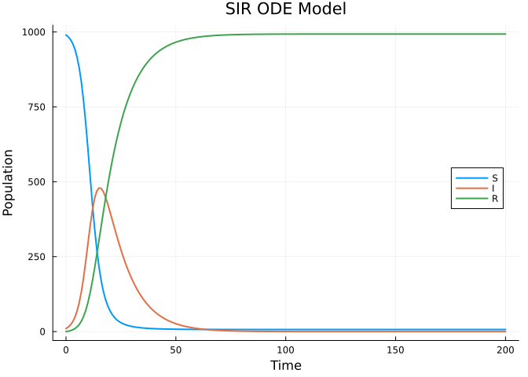
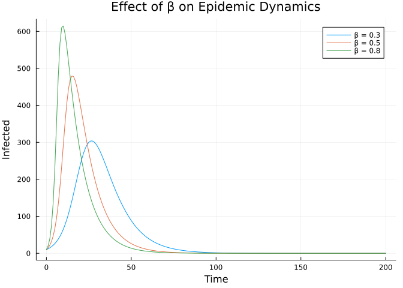

# Basic ODE Model: SIR


## Introduction

This vignette demonstrates how to define and simulate a basic SIR
(Susceptible-Infected-Recovered) ordinary differential equation model
using `Odin.jl`. This is the simplest type of epidemiological model and
serves as a foundation for more complex models.

## Model Definition

The SIR model is defined by three compartments:

- **S**: Susceptible individuals
- **I**: Infected individuals
- **R**: Recovered individuals

The dynamics are governed by:
$$\frac{dS}{dt} = -\beta \frac{SI}{N}, \quad \frac{dI}{dt} = \beta \frac{SI}{N} - \gamma I, \quad \frac{dR}{dt} = \gamma I$$

``` julia
using Odin
using Plots

sir = @odin begin
    deriv(S) = -beta * S * I / N
    deriv(I) = beta * S * I / N - gamma * I
    deriv(R) = gamma * I
    initial(S) = N - I0
    initial(I) = I0
    initial(R) = 0
    beta = parameter(0.5)
    gamma = parameter(0.1)
    I0 = parameter(10)
    N = parameter(1000)
end
```

    DustSystemGenerator{var"##OdinModel#277"}(var"##OdinModel#277"(3, [:S, :I, :R], [:beta, :gamma, :I0, :N], true, false, false, false))

## Simulation

We simulate the model over 200 time units:

``` julia
pars = (beta=0.5, gamma=0.1, I0=10.0, N=1000.0)
times = collect(0.0:1.0:200.0)
result = dust_system_simulate(sir, pars; times=times)
```

    3×1×201 Array{Float64, 3}:
    [:, :, 1] =
     990.0
      10.0
       0.0

    [:, :, 2] =
     983.9514608359559
      14.822862814438684
       1.225676349605413

    [:, :, 3] =
     975.0700347920705
      21.89084140207504
       3.0391238058545444

    ;;; … 

    [:, :, 199] =
       6.844581665714163
       1.667018069101641e-5
     993.1554016641052

    [:, :, 200] =
       6.84458161134319
       1.513582132150833e-5
     993.1554032528355

    [:, :, 201] =
       6.844581561972957
       1.3742583773732068e-5
     993.1554046954433

The result is a 3D array with dimensions
`(n_state, n_particles, n_times)`. Since we have 1 particle, we extract
the first (and only) particle:

``` julia
S = result[1, 1, :]
I = result[2, 1, :]
R = result[3, 1, :]

plot(times, [S I R],
     label=["S" "I" "R"],
     xlabel="Time", ylabel="Population",
     title="SIR ODE Model",
     linewidth=2,
     legend=:right)
```



## Parameter Exploration

We can explore the effect of different transmission rates:

``` julia
betas = [0.3, 0.5, 0.8]
p = plot(title="Effect of β on Epidemic Dynamics",
         xlabel="Time", ylabel="Infected",
         linewidth=2)

for b in betas
    pars_b = (beta=b, gamma=0.1, I0=10.0, N=1000.0)
    res = dust_system_simulate(sir, pars_b; times=times)
    plot!(p, times, res[2, 1, :], label="β = $b")
end
p
```



## Verification

The total population should be conserved:

``` julia
total = S .+ I .+ R
println("Population at t=0: ", total[1])
println("Population at t=200: ", total[end])
println("Max deviation: ", maximum(abs.(total .- 1000.0)))
```

    Population at t=0: 1000.0
    Population at t=200: 1000.0
    Max deviation: 2.2737367544323206e-13

## Final Size

We can compute the final epidemic size (total who were infected):

``` julia
final_R = R[end]
println("Final epidemic size: ", round(final_R, digits=1), " out of ", Int(pars.N))
println("Attack rate: ", round(100 * final_R / pars.N, digits=1), "%")
```

    Final epidemic size: 993.2 out of 1000
    Attack rate: 99.3%
