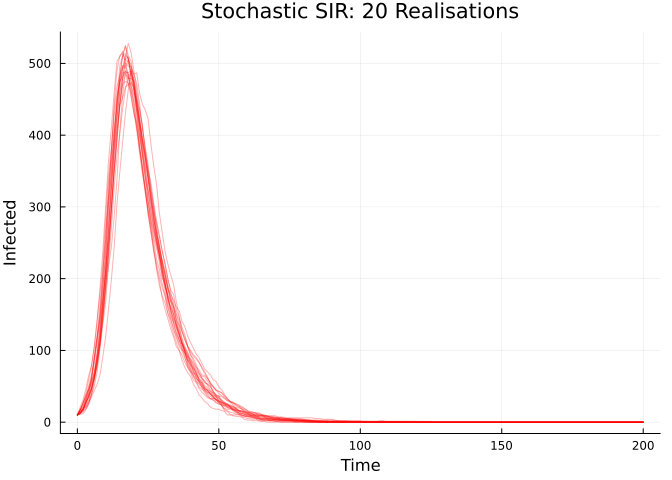
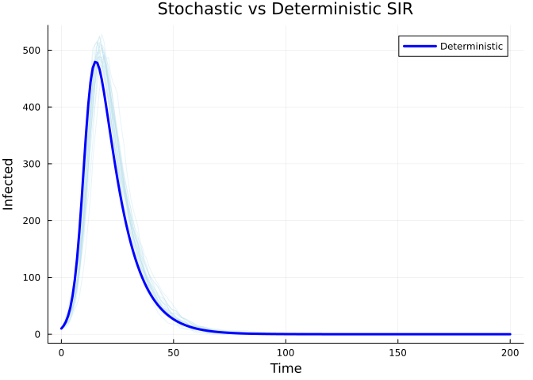

# Stochastic Discrete-Time SIR


## Introduction

This vignette demonstrates a stochastic discrete-time SIR model using
`update()` equations with binomial transitions.

## Model Definition

In a stochastic discrete-time model, transitions are random draws:

``` julia
using Odin
using Plots

sir_stoch = @odin begin
    update(S) = S - n_SI
    update(I) = I + n_SI - n_IR
    update(R) = R + n_IR
    initial(S) = N - I0
    initial(I) = I0
    initial(R) = 0

    p_SI = 1 - exp(-beta * I / N * dt)
    p_IR = 1 - exp(-gamma * dt)
    n_SI = Binomial(S, p_SI)
    n_IR = Binomial(I, p_IR)

    beta = parameter(0.5)
    gamma = parameter(0.1)
    I0 = parameter(10)
    N = parameter(1000)
end
```

    DustSystemGenerator{var"##OdinModel#277"}(var"##OdinModel#277"(3, [:S, :I, :R], [:beta, :gamma, :I0, :N], false, false, false, false))

## Multiple Realisations

We can run multiple stochastic realisations simultaneously:

``` julia
pars = (beta=0.5, gamma=0.1, I0=10.0, N=1000.0)
times = collect(0.0:1.0:200.0)
n_particles = 20

result = dust_system_simulate(sir_stoch, pars;
    times=times, dt=1.0, seed=42, n_particles=n_particles)
println("Result shape: ", size(result), " (state × particles × times)")
```

    Result shape: (3, 20, 201) (state × particles × times)

``` julia
p = plot(title="Stochastic SIR: 20 Realisations",
         xlabel="Time", ylabel="Infected",
         linewidth=1, alpha=0.5, legend=false)
for i in 1:n_particles
    plot!(p, times, result[2, i, :], color=:red, alpha=0.3)
end
p
```



## Comparing to Deterministic

``` julia
sir_det = @odin begin
    deriv(S) = -beta * S * I / N
    deriv(I) = beta * S * I / N - gamma * I
    deriv(R) = gamma * I
    initial(S) = N - I0
    initial(I) = I0
    initial(R) = 0
    beta = parameter(0.5)
    gamma = parameter(0.1)
    I0 = parameter(10)
    N = parameter(1000)
end

det_result = dust_system_simulate(sir_det, pars; times=times)

p = plot(title="Stochastic vs Deterministic SIR",
         xlabel="Time", ylabel="Infected")
for i in 1:n_particles
    plot!(p, times, result[2, i, :], color=:lightblue, alpha=0.3, label="")
end
plot!(p, times, det_result[2, 1, :], color=:blue, linewidth=3, label="Deterministic")
p
```



## Conservation Check

``` julia
for i in 1:n_particles
    total = result[1, i, :] + result[2, i, :] + result[3, i, :]
    @assert all(total .≈ 1000.0) "Particle $i: population not conserved"
end
println("✓ All particles conserve total population")
```

    ✓ All particles conserve total population
