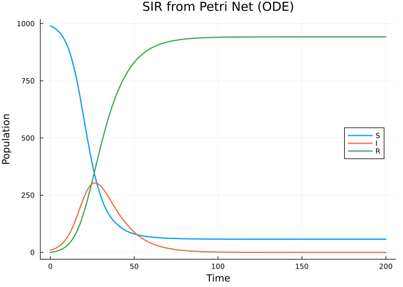
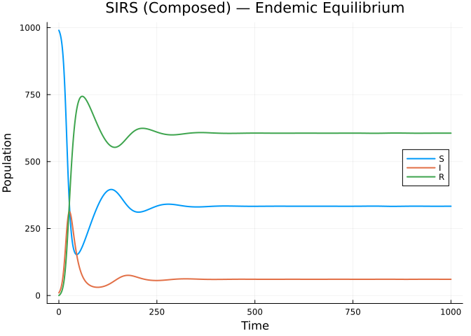
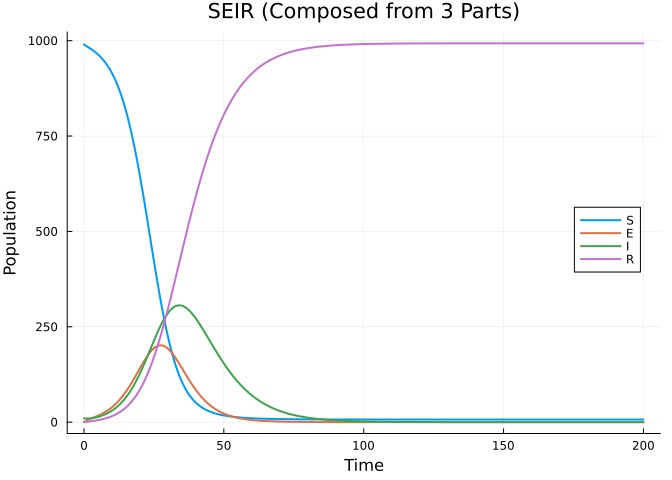
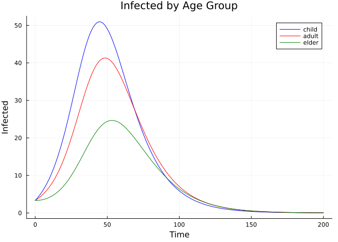
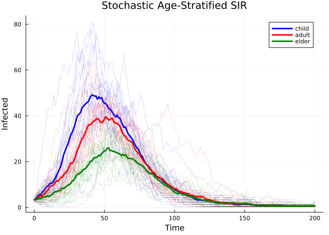
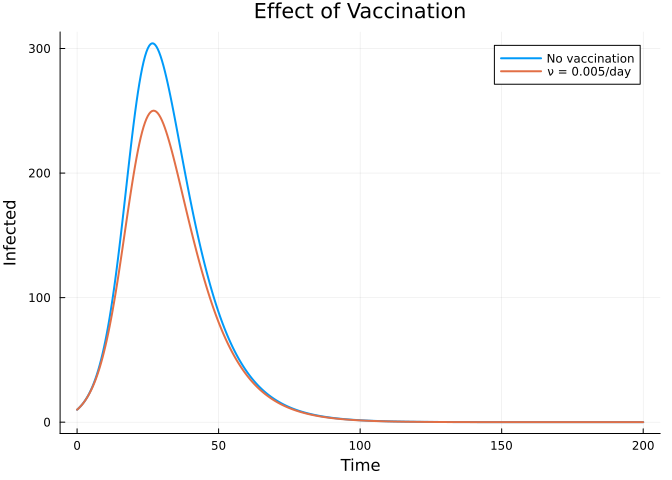

# Compositional Model Building


## Introduction

This vignette demonstrates Odin.jl’s **categorical extension** for
building epidemiological models compositionally. Instead of writing
model equations by hand, you define models as **Petri nets** —
specifying compartments and transitions — then **compose** sub-models,
**stratify** across groups, and **lower** the result to a simulatable
ODE or stochastic model.

This approach is inspired by
[AlgebraicPetri.jl](https://github.com/AlgebraicJulia/AlgebraicPetri.jl)
and the broader [AlgebraicJulia](https://www.algebraicjulia.org/)
ecosystem.

## Defining Models as Petri Nets

An `EpiNet` is a labelled Petri net where:

- **Species** are compartments (S, I, R, etc.)
- **Transitions** are epidemiological processes (infection, recovery,
  etc.)
- Each transition has **input arcs** (species consumed) and **output
  arcs** (species produced)
- Each transition has a **rate parameter**

``` julia
using Odin
using Plots

# Define an SIR model as a Petri net
sir = EpiNet(
    [:S => 990.0, :I => 10.0, :R => 0.0],
    [:inf => ([:S, :I] => [:I, :I], :beta),   # infection: S + I → 2I
     :rec => ([:I] => [:R], :gamma)]            # recovery: I → R
)

println("Species: ", species_names(sir))
println("Transitions: ", transition_names(sir))
println("Stoichiometry matrix:")
display(stoichiometry_matrix(sir))
```

    Species: [:S, :I, :R]
    Transitions: [:inf, :rec]
    Stoichiometry matrix:

    3×2 Matrix{Int64}:
     -1   0
      1  -1
      0   1

Pre-built models are available for common structures:

``` julia
# All of these return EpiNet objects
sir   = sir_net(; S0=990.0, I0=10.0)
seir  = seir_net(; S0=990.0, I0=10.0)
sirs  = sirs_net(; S0=990.0, I0=10.0)
seirs = seirs_net(; S0=990.0, I0=10.0)

for (name, net) in [("SIR", sir), ("SEIR", seir), ("SIRS", sirs), ("SEIRS", seirs)]
    println("$name: $(nspecies(net)) species, $(ntransitions(net)) transitions")
end
```

    SIR: 3 species, 2 transitions
    SEIR: 4 species, 3 transitions
    SIRS: 3 species, 3 transitions
    SEIRS: 4 species, 4 transitions

## Lowering to a Simulatable Model

The `lower()` function compiles a Petri net into an `@odin` model:

``` julia
# Lower SIR to ODE with frequency-dependent transmission
sir_gen = lower(sir; mode=:ode, frequency_dependent=true, N=:N,
                params=Dict(:beta => 0.3, :gamma => 0.1, :N => 1000.0))

# Simulate
sys = dust_system_create(sir_gen, (beta=0.3, gamma=0.1, N=1000.0))
dust_system_set_state_initial!(sys)
times = collect(0.0:0.5:200.0)
result = dust_system_simulate(sys, times)

plot(times, [result[1,1,:] result[2,1,:] result[3,1,:]],
     label=["S" "I" "R"],
     xlabel="Time", ylabel="Population",
     title="SIR from Petri Net (ODE)",
     linewidth=2, legend=:right)
```



## Composition: Building Models from Parts

The key advantage of the categorical approach is **composition**. Define
sub-models independently and merge them:

``` julia
# Sub-model 1: infection process
infection = EpiNet(
    [:S => 990.0, :I => 10.0],
    [:inf => ([:S, :I] => [:I, :I], :beta)]
)

# Sub-model 2: recovery process
recovery = EpiNet(
    [:I => 10.0, :R => 0.0],
    [:rec => ([:I] => [:R], :gamma)]
)

# Sub-model 3: waning immunity
waning = EpiNet(
    [:R => 0.0, :S => 990.0],
    [:wane => ([:R] => [:S], :delta)]
)

# Compose: shared species (I, S, R) are automatically merged
sirs_composed = compose(infection, recovery, waning)
println("SIRS species: ", species_names(sirs_composed))
println("SIRS transitions: ", transition_names(sirs_composed))
```

    SIRS species: [:S, :I, :R]
    SIRS transitions: [:inf, :rec, :wane]

``` julia
# Simulate the composed SIRS model — shows endemic equilibrium
sirs_gen = lower(sirs_composed; mode=:ode, frequency_dependent=true, N=:N,
                 params=Dict(:beta => 0.3, :gamma => 0.1, :delta => 0.01, :N => 1000.0))

sys = dust_system_create(sirs_gen, (beta=0.3, gamma=0.1, delta=0.01, N=1000.0))
dust_system_set_state_initial!(sys)
times = collect(0.0:1.0:1000.0)
result = dust_system_simulate(sys, times)

plot(times, [result[1,1,:] result[2,1,:] result[3,1,:]],
     label=["S" "I" "R"],
     xlabel="Time", ylabel="Population",
     title="SIRS (Composed) — Endemic Equilibrium",
     linewidth=2, legend=:right)
```



## Composing an SEIR from Three Parts

``` julia
# Infection: S exposed by I
exposure = EpiNet(
    [:S => 990.0, :E => 0.0, :I => 10.0],
    [:inf => ([:S, :I] => [:E, :I], :beta)]
)

# Progression: E becomes I
progression = EpiNet(
    [:E => 0.0, :I => 10.0],
    [:prog => ([:E] => [:I], :sigma)]
)

# Recovery: I recovers to R
recovery_seir = EpiNet(
    [:I => 10.0, :R => 0.0],
    [:rec => ([:I] => [:R], :gamma)]
)

seir_composed = compose(exposure, progression, recovery_seir)
println("SEIR: ", species_names(seir_composed), " — ", transition_names(seir_composed))

seir_gen = lower(seir_composed; mode=:ode, frequency_dependent=true, N=:N,
                 params=Dict(:beta => 0.5, :sigma => 0.2, :gamma => 0.1, :N => 1000.0))
sys = dust_system_create(seir_gen, (beta=0.5, sigma=0.2, gamma=0.1, N=1000.0))
dust_system_set_state_initial!(sys)
times = collect(0.0:0.5:200.0)
result = dust_system_simulate(sys, times)

plot(times, [result[1,1,:] result[2,1,:] result[3,1,:] result[4,1,:]],
     label=["S" "E" "I" "R"],
     xlabel="Time", ylabel="Population",
     title="SEIR (Composed from 3 Parts)",
     linewidth=2, legend=:right)
```

    SEIR: [:S, :E, :I, :R] — [:inf, :prog, :rec]



## Stratification: Adding Age Structure

Given a base model, `stratify()` replicates it across groups (e.g., age
classes) and adds inter-group mixing via a contact matrix:

``` julia
# Start with a simple SIR
sir_base = sir_net(; S0=990.0, I0=10.0)

# Define contact matrix (3 age groups)
# Higher within-group contact for children, lower for elderly
C = [3.0 1.0 0.5;
     1.0 2.0 0.5;
     0.5 0.5 1.0]

sir_age = stratify(sir_base, [:child, :adult, :elder]; contact=C)
println("Stratified species: ", species_names(sir_age))
println("Number of transitions: ", ntransitions(sir_age))
```

    Stratified species: [:S_child, :I_child, :R_child, :S_adult, :I_adult, :R_adult, :S_elder, :I_elder, :R_elder]
    Number of transitions: 12

``` julia
# Simulate the age-stratified model
sir_age_gen = lower(sir_age; mode=:ode, frequency_dependent=true, N=:N,
                    params=Dict(:beta => 0.15, :gamma => 0.1, :N => 1000.0))
sys = dust_system_create(sir_age_gen, (beta=0.15, gamma=0.1, N=1000.0))
dust_system_set_state_initial!(sys)
times = collect(0.0:0.5:200.0)
result = dust_system_simulate(sys, times)

sn = species_names(sir_age)
groups = [:child, :adult, :elder]
colors = [:blue, :red, :green]

# Plot infected by age group
p = plot(title="Infected by Age Group", xlabel="Time", ylabel="Infected", linewidth=2)
for (i, g) in enumerate(groups)
    idx = findfirst(==(Symbol(:I_, g)), sn)
    plot!(p, times, result[idx, 1, :], label=string(g), color=colors[i])
end
p
```



``` julia
# Compare attack rates
println("Final attack rates:")
for (i, g) in enumerate(groups)
    R_idx = findfirst(==(Symbol(:R_, g)), sn)
    S_idx = findfirst(==(Symbol(:S_, g)), sn)
    R_final = result[R_idx, 1, end]
    pop = result[S_idx, 1, 1] + result[findfirst(==(Symbol(:I_, g)), sn), 1, 1]
    ar = 100 * R_final / pop
    println("  $g: $(round(ar; digits=1))%")
end
```

    Final attack rates:
      child: 81.9%
      adult: 71.3%
      elder: 46.5%

## Stochastic Stratified Model

The same Petri net can be lowered to a stochastic discrete-time model:

``` julia
# Lower to stochastic
sir_age_stoch = lower(sir_age; mode=:discrete, frequency_dependent=true, N=:N,
                      params=Dict(:beta => 0.15, :gamma => 0.1, :N => 1000.0))

sys = dust_system_create(sir_age_stoch, (beta=0.15, gamma=0.1, N=1000.0);
                         n_particles=20, dt=0.25, seed=42)
dust_system_set_state_initial!(sys)
times = collect(0.0:1.0:200.0)
result = dust_system_simulate(sys, times)

# Plot with stochastic uncertainty
p = plot(title="Stochastic Age-Stratified SIR", xlabel="Time", ylabel="Infected")
for (i, g) in enumerate(groups)
    idx = findfirst(==(Symbol(:I_, g)), sn)
    for p_idx in 1:20
        plot!(p, times, result[idx, p_idx, :], alpha=0.15, color=colors[i], label="")
    end
    # Mean trajectory
    mean_traj = vec(sum(result[idx, :, :], dims=1) ./ 20)
    plot!(p, times, mean_traj, color=colors[i], linewidth=3, label=string(g))
end
p
```



## SIR + Vaccination via Composition

Composition naturally supports adding new interventions to existing
models:

``` julia
# Start with basic SIR
sir_base = sir_net(; S0=990.0, I0=10.0)

# Add vaccination: S → V (vaccinated immune class)
vaccination = EpiNet(
    [:S => 990.0, :V => 0.0],
    [:vax => ([:S] => [:V], :nu)]
)

# Compose: S is shared, V is new
sir_vax = compose(sir_base, vaccination)
println("SIR+Vax species: ", species_names(sir_vax))
println("SIR+Vax transitions: ", transition_names(sir_vax))

# Compare with and without vaccination
times = collect(0.0:0.5:200.0)
pars_novax = (beta=0.3, gamma=0.1, nu=0.0, N=1000.0)
pars_vax = (beta=0.3, gamma=0.1, nu=0.005, N=1000.0)

gen = lower(sir_vax; mode=:ode, frequency_dependent=true, N=:N,
            params=Dict(:beta => 0.3, :gamma => 0.1, :nu => 0.0, :N => 1000.0))

sys1 = dust_system_create(gen, pars_novax)
dust_system_set_state_initial!(sys1)
r1 = dust_system_simulate(sys1, times)

sys2 = dust_system_create(gen, pars_vax)
dust_system_set_state_initial!(sys2)
r2 = dust_system_simulate(sys2, times)

plot(times, [r1[2,1,:] r2[2,1,:]],
     label=["No vaccination" "ν = 0.005/day"],
     xlabel="Time", ylabel="Infected",
     title="Effect of Vaccination",
     linewidth=2, legend=:topright)
```

    SIR+Vax species: [:S, :I, :R, :V]
    SIR+Vax transitions: [:inf, :rec, :vax]



## Inspecting Generated Code

You can inspect the odin DSL expressions that `lower()` generates:

``` julia
sir_simple = sir_net()
exprs = lower_expr(sir_simple; mode=:ode, frequency_dependent=true, N=:N,
                   params=Dict(:beta => 0.3, :gamma => 0.1, :N => 1000.0))
println("Generated @odin expressions:")
for e in exprs
    println("  ", e)
end
```

    Generated @odin expressions:
      N = parameter(1000.0)
      beta = parameter(0.3)
      gamma = parameter(0.1)
      initial(S) = begin
            #= /Users/sdwfrost/Projects/odin/Odin.jl/src/categorical/lowering.jl:88 =#
            990.0
        end
      initial(I) = begin
            #= /Users/sdwfrost/Projects/odin/Odin.jl/src/categorical/lowering.jl:88 =#
            10.0
        end
      initial(R) = begin
            #= /Users/sdwfrost/Projects/odin/Odin.jl/src/categorical/lowering.jl:88 =#
            0.0
        end
      flow_inf = ((beta * S) * I) / N
      flow_rec = gamma * I
      deriv(S) = begin
            #= /Users/sdwfrost/Projects/odin/Odin.jl/src/categorical/lowering.jl:150 =#
            -flow_inf
        end
      deriv(I) = begin
            #= /Users/sdwfrost/Projects/odin/Odin.jl/src/categorical/lowering.jl:150 =#
            flow_inf - flow_rec
        end
      deriv(R) = begin
            #= /Users/sdwfrost/Projects/odin/Odin.jl/src/categorical/lowering.jl:150 =#
            flow_rec
        end

## Summary

The categorical extension provides:

| Operation | Function | Description |
|----|----|----|
| **Define** | `EpiNet(species, transitions)` | Create a Petri net model |
| **Compose** | `compose(net1, net2, ...)` | Merge models by shared species |
| **Stratify** | `stratify(net, groups; contact=C)` | Replicate across groups |
| **Lower** | `lower(net; mode=:ode)` | Compile to simulatable model |
| **Inspect** | `lower_expr(net)` | View generated DSL code |

Pre-built models: `sir_net`, `seir_net`, `sis_net`, `sirs_net`,
`seirs_net`, `sir_vax_net`.
