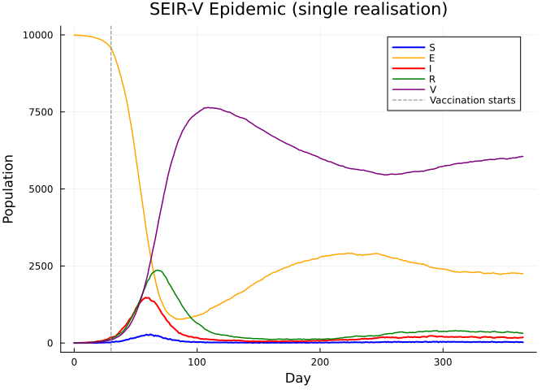
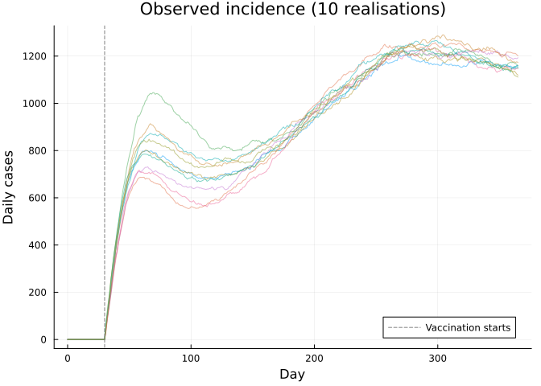
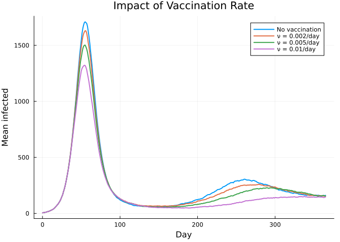

# Advanced Model: SEIR with Vaccination and Waning


## Introduction

This vignette demonstrates a more complex model: an SEIR epidemic with
vaccination, waning immunity, and time-varying vaccination rate —
combining arrays, interpolation, incidence tracking, and inference.

``` julia
using Odin
using Plots
using Statistics
using LinearAlgebra
```

## Model Definition

A stochastic SEIR model with:

- **Vaccination** of susceptibles at a time-varying rate
- **Waning immunity** from both natural infection and vaccination
- **Incidence tracking** via `zero_every`
- **Observation model** for case data

``` julia
seir_vax = @odin begin
    # Transitions
    n_SE = Binomial(S, 1 - exp(-beta * I / N * dt))
    n_EI = Binomial(E, 1 - exp(-sigma * dt))
    n_IR = Binomial(I, 1 - exp(-gamma * dt))
    n_RS = Binomial(R, 1 - exp(-omega * dt))
    n_SV = Binomial(S, 1 - exp(-nu * dt))
    n_VS = Binomial(V, 1 - exp(-omega_v * dt))

    # State updates
    update(S) = S - n_SE - n_SV + n_RS + n_VS
    update(E) = E + n_SE - n_EI
    update(I) = I + n_EI - n_IR
    update(R) = R + n_IR - n_RS
    update(V) = V + n_SV - n_VS

    # Incidence tracking
    initial(cases_inc, zero_every = 1) = 0
    update(cases_inc) = cases_inc + n_EI

    # Initial conditions
    initial(S) = N - E0 - I0
    initial(E) = E0
    initial(I) = I0
    initial(R) = 0
    initial(V) = 0

    # Observation model
    cases ~ Poisson(cases_inc + 1e-6)

    # Time-varying vaccination rate
    nu = interpolate(nu_time, nu_value, :constant)
    nu_time = parameter(rank=1)
    nu_value = parameter(rank=1)

    # Parameters
    beta = parameter(0.4)
    sigma = parameter(0.2)
    gamma = parameter(0.1)
    omega = parameter(0.005)
    omega_v = parameter(0.01)
    E0 = parameter(5)
    I0 = parameter(5)
    N = parameter(10000)
end
```

    DustSystemGenerator{var"##OdinModel#277"}(var"##OdinModel#277"(6, [:cases_inc, :S, :E, :I, :R, :V], [:nu_time, :nu_value, :beta, :sigma, :gamma, :omega, :omega_v, :E0, :I0, :N], false, true, false, true))

## Simulation

``` julia
pars = (
    beta = 0.4, sigma = 0.2, gamma = 0.1,
    omega = 0.005, omega_v = 0.01,
    E0 = 5.0, I0 = 5.0, N = 10000.0,
    nu_time = [0.0, 30.0],
    nu_value = [0.0, 0.005],
)

sys = dust_system_create(seir_vax, pars; dt=1.0, seed=42)
dust_system_set_state_initial!(sys)
times = collect(0.0:1.0:365.0)
result = dust_system_simulate(sys, times)

p1 = plot(times, result[1, 1, :], label="S", lw=2, color=:blue)
plot!(p1, times, result[2, 1, :], label="E", lw=1.5, color=:orange)
plot!(p1, times, result[3, 1, :], label="I", lw=2, color=:red)
plot!(p1, times, result[4, 1, :], label="R", lw=1.5, color=:green)
plot!(p1, times, result[5, 1, :], label="V", lw=1.5, color=:purple)
vline!(p1, [30.0], ls=:dash, color=:gray, label="Vaccination starts")
xlabel!(p1, "Day")
ylabel!(p1, "Population")
title!(p1, "SEIR-V Epidemic (single realisation)")
```



## Multiple Realisations

``` julia
p2 = plot(xlabel="Day", ylabel="Daily cases",
          title="Observed incidence (10 realisations)")

for seed in 1:10
    sys = dust_system_create(seir_vax, pars; dt=1.0, seed=seed)
    dust_system_set_state_initial!(sys)
    r = dust_system_simulate(sys, times)
    plot!(p2, times, r[6, 1, :], alpha=0.5, lw=1, label=nothing)
end
vline!(p2, [30.0], ls=:dash, color=:gray, label="Vaccination starts")
p2
```



## Comparing Vaccination Scenarios

``` julia
scenarios = [
    ("No vaccination", [0.0, 365.0], [0.0, 0.0]),
    ("ν = 0.002/day", [0.0, 30.0], [0.0, 0.002]),
    ("ν = 0.005/day", [0.0, 30.0], [0.0, 0.005]),
    ("ν = 0.01/day",  [0.0, 30.0], [0.0, 0.01]),
]

p3 = plot(xlabel="Day", ylabel="Mean infected",
          title="Impact of Vaccination Rate")

for (label, nu_t, nu_v) in scenarios
    # Run 20 realisations and average
    I_mean = zeros(length(times))
    for seed in 1:20
        p = merge(pars, (nu_time=nu_t, nu_value=nu_v))
        sys = dust_system_create(seir_vax, p; dt=1.0, seed=seed)
        dust_system_set_state_initial!(sys)
        r = dust_system_simulate(sys, times)
        I_mean .+= r[3, 1, :]
    end
    I_mean ./= 20
    plot!(p3, times, I_mean, label=label, lw=2)
end
p3
```



## Fitting to Data

Generate synthetic data from the model, then fit β and σ:

``` julia
# Generate "observed" data
true_pars = (
    beta=0.4, sigma=0.2, gamma=0.1,
    omega=0.005, omega_v=0.01,
    E0=5.0, I0=5.0, N=10000.0,
    nu_time=[0.0, 30.0], nu_value=[0.0, 0.005],
)

sys_true = dust_system_create(seir_vax, true_pars; dt=1.0, seed=1)
dust_system_set_state_initial!(sys_true)
obs_times = collect(0.0:1.0:180.0)
true_result = dust_system_simulate(sys_true, obs_times)
obs_cases = max.(1, round.(Int, true_result[6, 1, 2:end]))

data = dust_filter_data(
    [(time=Float64(t), cases=obs_cases[t]) for t in 1:180]
)

# Set up inference
packer = monty_packer([:beta, :sigma])

function make_pars(theta)
    merge(true_pars, (beta=theta[1], sigma=theta[2]))
end

filter = dust_filter_create(seir_vax, data; n_particles=100, dt=1.0, seed=42)

ll_model = monty_model(
    function(theta)
        p = make_pars(theta)
        return dust_likelihood_run!(filter, p)
    end;
    parameters = ["beta", "sigma"],
    domain = [0.0 2.0; 0.0 2.0],
)

prior = @monty_prior begin
    beta ~ Gamma(4.0, 0.1)
    sigma ~ Gamma(2.0, 0.1)
end

posterior = monty_model_combine(ll_model, prior)
sampler = monty_sampler_random_walk(diagm([0.001, 0.001]))
samples = monty_sample(posterior, sampler, 2000;
                       initial=repeat([0.3, 0.15], 1, 4), n_chains=4, n_burnin=500)

println("Parameter estimates (posterior mean ± std):")
for (i, name) in enumerate([:beta, :sigma])
    vals = vec(samples.pars[i, :, :])
    println("  $name: $(round(mean(vals), digits=3)) ± $(round(std(vals), digits=3))")
end
```

    Parameter estimates (posterior mean ± std):
      beta: 0.95 ± 0.153
      sigma: 0.027 ± 0.002

## Summary

This vignette demonstrated:

| Feature            | Usage                            |
|--------------------|----------------------------------|
| Interpolation      | Time-varying vaccination rate    |
| `zero_every`       | Daily incidence tracking         |
| Comparison (`~`)   | Poisson observation model        |
| Particle filter    | Likelihood estimation            |
| MCMC               | Posterior inference on β, σ      |
| Multiple scenarios | Comparing vaccination strategies |
