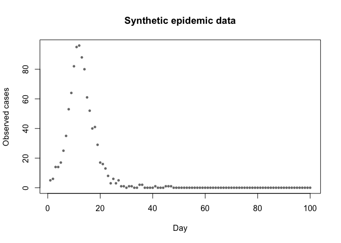
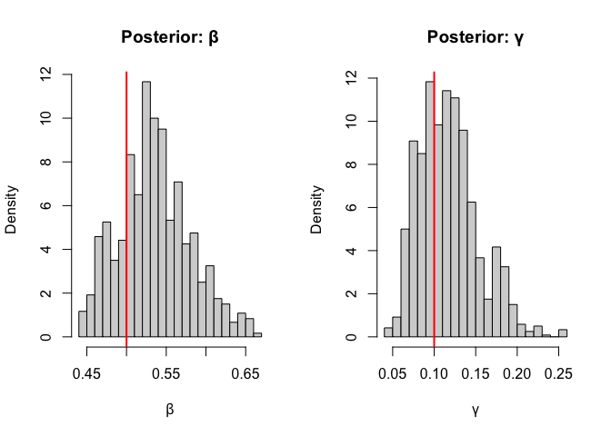
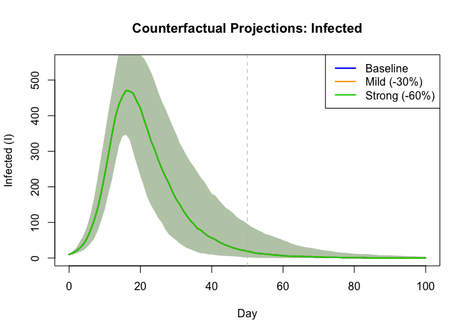
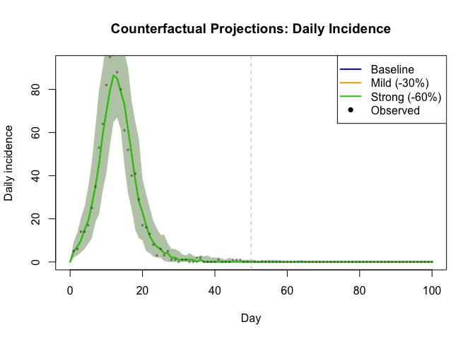
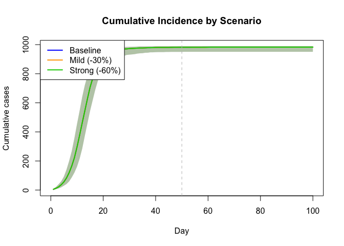

# Counterfactual Projections from Posterior


## Introduction

R companion to the Julia vignette: fitting a stochastic SIR model and
running counterfactual projections from the posterior distribution.

``` r
library(odin2)
library(dust2)
library(monty)
```

## Model Definition

``` r
sir <- odin({
  update(S) <- S - n_SI
  update(I) <- I + n_SI - n_IR
  update(R) <- R + n_IR
  initial(S) <- N - I0
  initial(I) <- I0
  initial(R) <- 0
  initial(incidence, zero_every = 1) <- 0
  update(incidence) <- incidence + n_SI

  p_SI <- 1 - exp(-beta * I / N * dt)
  p_IR <- 1 - exp(-gamma * dt)
  n_SI <- Binomial(S, p_SI)
  n_IR <- Binomial(I, p_IR)

  cases <- data()
  cases ~ Poisson(incidence + 1e-6)

  beta <- parameter(0.5)
  gamma <- parameter(0.1)
  I0 <- parameter(10)
  N <- parameter(1000)
})
```

    ✔ Wrote 'DESCRIPTION'

    ✔ Wrote 'NAMESPACE'

    ✔ Wrote 'R/dust.R'

    ✔ Wrote 'src/dust.cpp'

    ✔ Wrote 'src/Makevars'

    ℹ 27 functions decorated with [[cpp11::register]]

    ✔ generated file 'cpp11.R'

    ✔ generated file 'cpp11.cpp'

    ℹ Re-compiling odin.system8cef4206

    ── R CMD INSTALL ───────────────────────────────────────────────────────────────
    * installing *source* package ‘odin.system8cef4206’ ...
    ** this is package ‘odin.system8cef4206’ version ‘0.0.1’
    ** using staged installation
    ** libs
    using C++ compiler: ‘Homebrew clang version 21.1.5’
    using SDK: ‘MacOSX15.5.sdk’
    clang++ -arch arm64 -std=gnu++17 -I"/Library/Frameworks/R.framework/Resources/include" -DNDEBUG  -I'/Library/Frameworks/R.framework/Versions/4.5-arm64/Resources/library/cpp11/include' -I'/Library/Frameworks/R.framework/Versions/4.5-arm64/Resources/library/dust2/include' -I'/Library/Frameworks/R.framework/Versions/4.5-arm64/Resources/library/monty/include' -I/opt/R/arm64/include   -DHAVE_INLINE   -fPIC  -falign-functions=64 -Wall -g -O2  -Wall -pedantic  -c cpp11.cpp -o cpp11.o
    clang++ -arch arm64 -std=gnu++17 -I"/Library/Frameworks/R.framework/Resources/include" -DNDEBUG  -I'/Library/Frameworks/R.framework/Versions/4.5-arm64/Resources/library/cpp11/include' -I'/Library/Frameworks/R.framework/Versions/4.5-arm64/Resources/library/dust2/include' -I'/Library/Frameworks/R.framework/Versions/4.5-arm64/Resources/library/monty/include' -I/opt/R/arm64/include   -DHAVE_INLINE   -fPIC  -falign-functions=64 -Wall -g -O2  -Wall -pedantic  -c dust.cpp -o dust.o
    In file included from dust.cpp:99:
    In file included from /Library/Frameworks/R.framework/Versions/4.5-arm64/Resources/library/dust2/include/dust2/r/discrete/system.hpp:5:
    /Library/Frameworks/R.framework/Versions/4.5-arm64/Resources/library/monty/include/monty/r/random.hpp:60:43: warning: implicit conversion from 'type' (aka 'unsigned long') to 'double' changes value from 18446744073709551615 to 18446744073709551616 [-Wimplicit-const-int-float-conversion]
       60 |       std::ceil(std::abs(::unif_rand()) * std::numeric_limits<size_t>::max());
          |                                         ~ ^~~~~~~~~~~~~~~~~~~~~~~~~~~~~~~~~~
    /Library/Frameworks/R.framework/Versions/4.5-arm64/Resources/library/monty/include/monty/r/random.hpp:60:43: warning: implicit conversion from 'type' (aka 'unsigned long') to 'double' changes value from 18446744073709551615 to 18446744073709551616 [-Wimplicit-const-int-float-conversion]
       60 |       std::ceil(std::abs(::unif_rand()) * std::numeric_limits<size_t>::max());
          |                                         ~ ^~~~~~~~~~~~~~~~~~~~~~~~~~~~~~~~~~
    /Library/Frameworks/R.framework/Versions/4.5-arm64/Resources/library/dust2/include/dust2/r/discrete/system.hpp:41:33: note: in instantiation of function template specialization 'monty::random::r::as_rng_seed<monty::random::xoshiro_state<unsigned long long, 4, monty::random::scrambler::plus>>' requested here
       41 |   auto seed = monty::random::r::as_rng_seed<rng_state_type>(r_seed);
          |                                 ^
    dust.cpp:105:20: note: in instantiation of function template specialization 'dust2::r::dust2_discrete_alloc<odin_system>' requested here
      105 |   return dust2::r::dust2_discrete_alloc<odin_system>(r_pars, r_time, r_time_control, r_n_particles, r_n_groups, r_seed, r_deterministic, r_n_threads);
          |                    ^
    2 warnings generated.
    clang++ -arch arm64 -std=gnu++17 -dynamiclib -Wl,-headerpad_max_install_names -undefined dynamic_lookup -L/Library/Frameworks/R.framework/Resources/lib -L/opt/R/arm64/lib -o odin.system8cef4206.so cpp11.o dust.o -F/Library/Frameworks/R.framework/.. -framework R
    installing to /private/var/folders/yh/30rj513j6mn1n7x556c2v4w80000gn/T/RtmpU25ey9/devtools_install_161df60f6acd1/00LOCK-dust_161df20afb341/00new/odin.system8cef4206/libs
    ** checking absolute paths in shared objects and dynamic libraries
    * DONE (odin.system8cef4206)

    ℹ Loading odin.system8cef4206

## Generate Synthetic Data

``` r
true_pars <- list(beta = 0.5, gamma = 0.1, I0 = 10, N = 1000)
times <- seq(0, 100, by = 1)

sys <- System(sir, true_pars, dt = 1, seed = 42)
dust_system_set_state_initial(sys)
obs_result <- simulate(sys, times)
observed <- round(obs_result[4, -1])

plot(1:100, observed, pch = 16, cex = 0.7, col = rgb(0, 0, 0, 0.6),
     xlab = "Day", ylab = "Observed cases",
     main = "Synthetic epidemic data")
```



## Set Up Inference

``` r
data <- data.frame(time = times[-1], cases = observed)

filter <- Likelihood(sir, time_start = 0, data = data,
                             n_particles = 200, seed = 42)

packer <- Packer(c("beta", "gamma"),
                       fixed = list(I0 = 10, N = 1000))

likelihood <- as_model(filter, packer)

prior <- monty_dsl({
  beta ~ Gamma(shape = 2, rate = 4)
  gamma ~ Gamma(shape = 2, rate = 20)
})

posterior <- likelihood + prior
```

## Run MCMC

``` r
vcv <- matrix(c(0.0004, 0, 0, 0.00025), 2, 2)
sampler <- random_walk(vcv)

initial <- matrix(c(0.5, 0.1), nrow = 2, ncol = 4)
samples <- sample(posterior, sampler, 500, n_chains = 4,
                        initial = initial, burnin = 200)
```

    ⡀⠀ Sampling [▁▁▁▁] ■                                |   0% ETA: 16s

    ⠄⠀ Sampling [██▁▁] ■■■■■■■■■■■■■■■■                 |  51% ETA:  2s

    ✔ Sampled 2000 steps across 4 chains in 4.4s

## Examine Posterior

``` r
posterior_beta <- as.vector(samples$pars[1, , ])
posterior_gamma <- as.vector(samples$pars[2, , ])

cat("β: mean =", round(mean(posterior_beta), 3),
    ", 95% CI = [", round(quantile(posterior_beta, 0.025), 3),
    ",", round(quantile(posterior_beta, 0.975), 3), "]\n")
```

    β: mean = 0.536 , 95% CI = [ 0.46 , 0.636 ]

``` r
cat("γ: mean =", round(mean(posterior_gamma), 3),
    ", 95% CI = [", round(quantile(posterior_gamma, 0.025), 3),
    ",", round(quantile(posterior_gamma, 0.975), 3), "]\n")
```

    γ: mean = 0.117 , 95% CI = [ 0.064 , 0.191 ]

``` r
cat("True: β = 0.5, γ = 0.1\n")
```

    True: β = 0.5, γ = 0.1

``` r
par(mfrow = c(1, 2))
hist(posterior_beta, breaks = 30, main = "Posterior: β",
     xlab = "β", probability = TRUE)
abline(v = 0.5, col = "red", lwd = 2)
hist(posterior_gamma, breaks = 30, main = "Posterior: γ",
     xlab = "γ", probability = TRUE)
abline(v = 0.1, col = "red", lwd = 2)
```



## Define Projection Model

A separate model with time-varying β via `interpolate()` for
implementing interventions:

``` r
sir_proj <- odin({
  update(S) <- S - n_SI
  update(I) <- I + n_SI - n_IR
  update(R) <- R + n_IR
  initial(S) <- N - I0
  initial(I) <- I0
  initial(R) <- 0
  initial(incidence, zero_every = 1) <- 0
  update(incidence) <- incidence + n_SI

  beta <- interpolate(beta_time, beta_value, "constant")
  p_SI <- 1 - exp(-beta * I / N * dt)
  p_IR <- 1 - exp(-gamma * dt)
  n_SI <- Binomial(S, p_SI)
  n_IR <- Binomial(I, p_IR)

  beta_time[] <- parameter()
  beta_value[] <- parameter()
  dim(beta_time, beta_value) <- parameter(rank = 1)
  gamma <- parameter(0.1)
  I0 <- parameter(10)
  N <- parameter(1000)
})
```

    Warning in odin({: Found 2 compatibility issues
    Drop arrays from lhs of assignments from 'parameter()'
    ✖ beta_time[] <- parameter()
    ✔ beta_time <- parameter()
    ✖ beta_value[] <- parameter()
    ✔ beta_value <- parameter()

    ✔ Wrote 'DESCRIPTION'

    ✔ Wrote 'NAMESPACE'

    ✔ Wrote 'R/dust.R'

    ✔ Wrote 'src/dust.cpp'

    ✔ Wrote 'src/Makevars'

    ℹ 12 functions decorated with [[cpp11::register]]

    ✔ generated file 'cpp11.R'

    ✔ generated file 'cpp11.cpp'

    ℹ Re-compiling odin.system84ded45e

    ── R CMD INSTALL ───────────────────────────────────────────────────────────────
    * installing *source* package ‘odin.system84ded45e’ ...
    ** this is package ‘odin.system84ded45e’ version ‘0.0.1’
    ** using staged installation
    ** libs
    using C++ compiler: ‘Homebrew clang version 21.1.5’
    using SDK: ‘MacOSX15.5.sdk’
    clang++ -arch arm64 -std=gnu++17 -I"/Library/Frameworks/R.framework/Resources/include" -DNDEBUG  -I'/Library/Frameworks/R.framework/Versions/4.5-arm64/Resources/library/cpp11/include' -I'/Library/Frameworks/R.framework/Versions/4.5-arm64/Resources/library/dust2/include' -I'/Library/Frameworks/R.framework/Versions/4.5-arm64/Resources/library/monty/include' -I/opt/R/arm64/include   -DHAVE_INLINE   -fPIC  -falign-functions=64 -Wall -g -O2  -Wall -pedantic  -c cpp11.cpp -o cpp11.o
    clang++ -arch arm64 -std=gnu++17 -I"/Library/Frameworks/R.framework/Resources/include" -DNDEBUG  -I'/Library/Frameworks/R.framework/Versions/4.5-arm64/Resources/library/cpp11/include' -I'/Library/Frameworks/R.framework/Versions/4.5-arm64/Resources/library/dust2/include' -I'/Library/Frameworks/R.framework/Versions/4.5-arm64/Resources/library/monty/include' -I/opt/R/arm64/include   -DHAVE_INLINE   -fPIC  -falign-functions=64 -Wall -g -O2  -Wall -pedantic  -c dust.cpp -o dust.o
    In file included from dust.cpp:100:
    In file included from /Library/Frameworks/R.framework/Versions/4.5-arm64/Resources/library/dust2/include/dust2/r/discrete/system.hpp:5:
    /Library/Frameworks/R.framework/Versions/4.5-arm64/Resources/library/monty/include/monty/r/random.hpp:60:43: warning: implicit conversion from 'type' (aka 'unsigned long') to 'double' changes value from 18446744073709551615 to 18446744073709551616 [-Wimplicit-const-int-float-conversion]
       60 |       std::ceil(std::abs(::unif_rand()) * std::numeric_limits<size_t>::max());
          |                                         ~ ^~~~~~~~~~~~~~~~~~~~~~~~~~~~~~~~~~
    /Library/Frameworks/R.framework/Versions/4.5-arm64/Resources/library/monty/include/monty/r/random.hpp:60:43: warning: implicit conversion from 'type' (aka 'unsigned long') to 'double' changes value from 18446744073709551615 to 18446744073709551616 [-Wimplicit-const-int-float-conversion]
       60 |       std::ceil(std::abs(::unif_rand()) * std::numeric_limits<size_t>::max());
          |                                         ~ ^~~~~~~~~~~~~~~~~~~~~~~~~~~~~~~~~~
    /Library/Frameworks/R.framework/Versions/4.5-arm64/Resources/library/dust2/include/dust2/r/discrete/system.hpp:41:33: note: in instantiation of function template specialization 'monty::random::r::as_rng_seed<monty::random::xoshiro_state<unsigned long long, 4, monty::random::scrambler::plus>>' requested here
       41 |   auto seed = monty::random::r::as_rng_seed<rng_state_type>(r_seed);
          |                                 ^
    dust.cpp:104:20: note: in instantiation of function template specialization 'dust2::r::dust2_discrete_alloc<odin_system>' requested here
      104 |   return dust2::r::dust2_discrete_alloc<odin_system>(r_pars, r_time, r_time_control, r_n_particles, r_n_groups, r_seed, r_deterministic, r_n_threads);
          |                    ^
    2 warnings generated.
    clang++ -arch arm64 -std=gnu++17 -dynamiclib -Wl,-headerpad_max_install_names -undefined dynamic_lookup -L/Library/Frameworks/R.framework/Resources/lib -L/opt/R/arm64/lib -o odin.system84ded45e.so cpp11.o dust.o -F/Library/Frameworks/R.framework/.. -framework R
    installing to /private/var/folders/yh/30rj513j6mn1n7x556c2v4w80000gn/T/RtmpU25ey9/devtools_install_161df294266c1/00LOCK-dust_161df12a18195/00new/odin.system84ded45e/libs
    ** checking absolute paths in shared objects and dynamic libraries
    * DONE (odin.system84ded45e)

    ℹ Loading odin.system84ded45e

## Run Counterfactual Projections

Three scenarios that diverge at day 50:

``` r
n_proj <- 100
proj_times <- seq(0, 100, by = 1)
n_times <- length(proj_times)

set.seed(42)
idx <- sample(length(posterior_beta), n_proj, replace = TRUE)

scenarios <- list(
  list(name = "Baseline", col = "blue",
       schedule = function(b) list(t = c(0, 200), v = c(b, b))),
  list(name = "Mild (-30%)", col = "orange",
       schedule = function(b) list(t = c(0, 50), v = c(b, b * 0.7))),
  list(name = "Strong (-60%)", col = "green3",
       schedule = function(b) list(t = c(0, 50), v = c(b, b * 0.4)))
)

results <- list()

for (sc in scenarios) {
  I_traj <- matrix(0, n_proj, n_times)
  inc_traj <- matrix(0, n_proj, n_times)

  for (j in seq_len(n_proj)) {
    beta_sch <- sc$schedule(posterior_beta[idx[j]])
    pars <- list(
      beta_time = beta_sch$t,
      beta_value = beta_sch$v,
      gamma = posterior_gamma[idx[j]],
      I0 = 10, N = 1000
    )

    sys <- System(sir_proj, pars, dt = 1, seed = j)
    dust_system_set_state_initial(sys)
    r <- simulate(sys, proj_times)

    I_traj[j, ] <- r[2, ]
    inc_traj[j, ] <- r[4, ]
  }

  results[[sc$name]] <- list(I = I_traj, inc = inc_traj)
}
```

## Plot Infection Trajectories

``` r
par(mfrow = c(1, 1))
ymax <- max(sapply(results, function(x) quantile(x$I, 0.99)))
plot(NULL, xlim = c(0, 100), ylim = c(0, ymax),
     xlab = "Day", ylab = "Infected (I)",
     main = "Counterfactual Projections: Infected")

for (k in seq_along(scenarios)) {
  sc <- scenarios[[k]]
  I_traj <- results[[sc$name]]$I
  med <- apply(I_traj, 2, median)
  lo <- apply(I_traj, 2, quantile, 0.025)
  hi <- apply(I_traj, 2, quantile, 0.975)

  polygon(c(proj_times, rev(proj_times)), c(lo, rev(hi)),
          col = adjustcolor(sc$col, 0.2), border = NA)
  lines(proj_times, med, col = sc$col, lwd = 2)
}

abline(v = 50, lty = 2, col = "gray")
legend("topright", legend = sapply(scenarios, "[[", "name"),
       col = sapply(scenarios, "[[", "col"), lwd = 2)
```



## Plot Daily Incidence

``` r
ymax <- max(sapply(results, function(x) quantile(x$inc, 0.99)))
plot(NULL, xlim = c(0, 100), ylim = c(0, ymax),
     xlab = "Day", ylab = "Daily incidence",
     main = "Counterfactual Projections: Daily Incidence")

for (k in seq_along(scenarios)) {
  sc <- scenarios[[k]]
  inc_traj <- results[[sc$name]]$inc
  med <- apply(inc_traj, 2, median)
  lo <- apply(inc_traj, 2, quantile, 0.025)
  hi <- apply(inc_traj, 2, quantile, 0.975)

  polygon(c(proj_times, rev(proj_times)), c(lo, rev(hi)),
          col = adjustcolor(sc$col, 0.2), border = NA)
  lines(proj_times, med, col = sc$col, lwd = 2)
}

points(1:100, observed, pch = 16, cex = 0.5, col = rgb(0, 0, 0, 0.4))
abline(v = 50, lty = 2, col = "gray")
legend("topright",
       legend = c(sapply(scenarios, "[[", "name"), "Observed"),
       col = c(sapply(scenarios, "[[", "col"), "black"),
       lwd = c(2, 2, 2, NA), pch = c(NA, NA, NA, 16))
```



## Compare Cumulative Cases

``` r
cum_max <- 0
for (sc in scenarios) {
  inc <- results[[sc$name]]$inc[, -1]
  cum_max <- max(cum_max, max(t(apply(inc, 1, cumsum))))
}

plot(NULL, xlim = c(0, 100), ylim = c(0, cum_max),
     xlab = "Day", ylab = "Cumulative cases",
     main = "Cumulative Incidence by Scenario")

for (k in seq_along(scenarios)) {
  sc <- scenarios[[k]]
  inc_traj <- results[[sc$name]]$inc[, -1]
  cum_traj <- t(apply(inc_traj, 1, cumsum))

  days <- 1:100
  med <- apply(cum_traj, 2, median)
  lo <- apply(cum_traj, 2, quantile, 0.025)
  hi <- apply(cum_traj, 2, quantile, 0.975)

  polygon(c(days, rev(days)), c(lo, rev(hi)),
          col = adjustcolor(sc$col, 0.2), border = NA)
  lines(days, med, col = sc$col, lwd = 2)
}

abline(v = 50, lty = 2, col = "gray")
legend("topleft", legend = sapply(scenarios, "[[", "name"),
       col = sapply(scenarios, "[[", "col"), lwd = 2)
```



``` r
cat("\nCumulative cases at day 100 (median [95% CI]):\n")
```


    Cumulative cases at day 100 (median [95% CI]):

``` r
for (sc in scenarios) {
  inc_traj <- results[[sc$name]]$inc[, -1]
  total <- rowSums(inc_traj)
  cat(sprintf("  %s: %d [%d, %d]\n", sc$name,
              round(median(total)), round(quantile(total, 0.025)),
              round(quantile(total, 0.975))))
}
```

      Baseline: 983 [951, 990]
      Mild (-30%): 983 [951, 990]
      Strong (-60%): 983 [951, 990]

## Summary

Both Julia and R follow the same workflow for counterfactual
projections: fit with MCMC → sample posterior → simulate scenarios →
compare with credible intervals. The same pattern extends to more
complex models and richer intervention designs.
