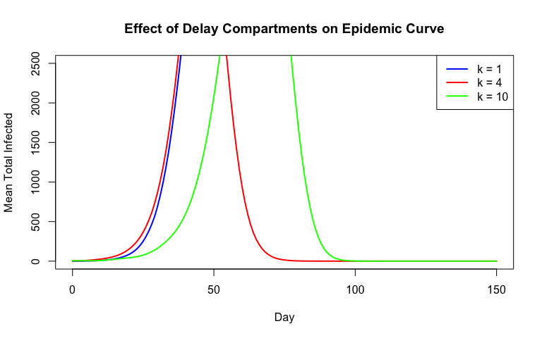
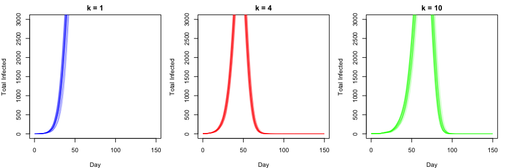
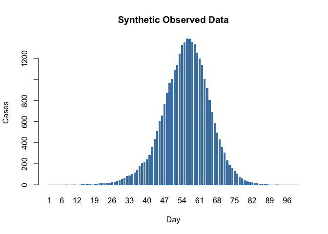
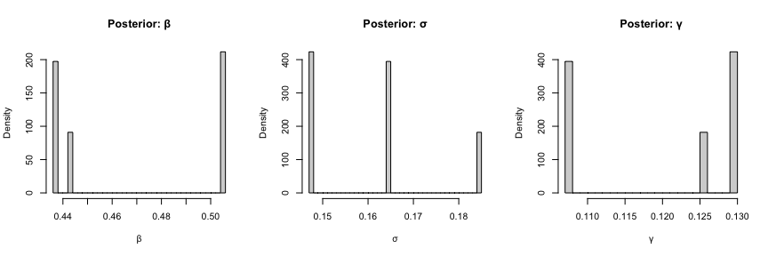
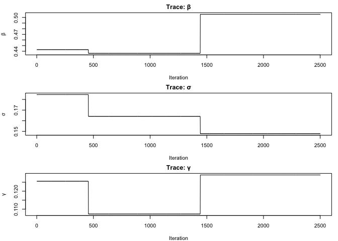

# Delay Compartments for Erlang-Distributed Durations


## Introduction

R companion to the Julia delay compartments vignette. We use the
**linear chain trick** to model Erlang-distributed latent and infectious
periods in a stochastic SEIR model.

Splitting a single compartment into $k$ sub-compartments, each with rate
$k \sigma$, yields an Erlang-distributed total sojourn time with mean
$1/\sigma$ and variance $1/(k\sigma^2)$. As $k$ increases the
distribution sharpens around the mean.

``` r
library(odin2)
library(dust2)
library(monty)
```

## Model Definition

``` r
seir_delay <- odin({
  # Dimensions for delay compartment chains
  dim(E) <- k_E
  dim(I) <- k_I
  dim(n_EE) <- k_E
  dim(n_II) <- k_I

  # Force of infection and stochastic transitions
  n_SE <- Binomial(S, 1 - exp(-beta * I_total / N * dt))
  n_EE[] <- Binomial(E[i], 1 - exp(-k_E * sigma * dt))
  n_II[] <- Binomial(I[i], 1 - exp(-k_I * gamma * dt))

  I_total <- sum(I)

  # State updates — chain progression
  update(S) <- S - n_SE
  update(E[1]) <- E[1] + n_SE - n_EE[1]
  update(E[2:k_E]) <- E[i] + n_EE[i - 1] - n_EE[i]
  update(I[1]) <- I[1] + n_EE[k_E] - n_II[1]
  update(I[2:k_I]) <- I[i] + n_II[i - 1] - n_II[i]
  update(R) <- R + n_II[k_I]

  # Incidence tracking (daily reset)
  initial(incidence, zero_every = 1) <- 0
  update(incidence) <- incidence + n_SE

  # Data comparison
  cases <- data()
  cases ~ Poisson(incidence + 1e-6)

  # Initial conditions
  initial(S) <- N - I0
  initial(E[]) <- 0
  initial(I[1]) <- I0
  initial(I[2:k_I]) <- 0
  initial(R) <- 0

  # Parameters
  beta <- parameter(0.8)
  sigma <- parameter(0.2)
  gamma <- parameter(0.1)
  k_E <- parameter(4)
  k_I <- parameter(4)
  I0 <- parameter(5)
  N <- parameter(10000)
})
```

    ✔ Wrote 'DESCRIPTION'

    ✔ Wrote 'NAMESPACE'

    ✔ Wrote 'R/dust.R'

    ✔ Wrote 'src/dust.cpp'

    ✔ Wrote 'src/Makevars'

    ℹ 27 functions decorated with [[cpp11::register]]

    ✔ generated file 'cpp11.R'

    ✔ generated file 'cpp11.cpp'

    ℹ Re-compiling odin.system385d53de

    ── R CMD INSTALL ───────────────────────────────────────────────────────────────
    * installing *source* package ‘odin.system385d53de’ ...
    ** this is package ‘odin.system385d53de’ version ‘0.0.1’
    ** using staged installation
    ** libs
    using C++ compiler: ‘Homebrew clang version 21.1.5’
    using SDK: ‘MacOSX15.5.sdk’
    clang++ -arch arm64 -std=gnu++17 -I"/Library/Frameworks/R.framework/Resources/include" -DNDEBUG  -I'/Library/Frameworks/R.framework/Versions/4.5-arm64/Resources/library/cpp11/include' -I'/Library/Frameworks/R.framework/Versions/4.5-arm64/Resources/library/dust2/include' -I'/Library/Frameworks/R.framework/Versions/4.5-arm64/Resources/library/monty/include' -I/opt/R/arm64/include   -DHAVE_INLINE   -fPIC  -falign-functions=64 -Wall -g -O2  -Wall -pedantic  -c cpp11.cpp -o cpp11.o
    clang++ -arch arm64 -std=gnu++17 -I"/Library/Frameworks/R.framework/Resources/include" -DNDEBUG  -I'/Library/Frameworks/R.framework/Versions/4.5-arm64/Resources/library/cpp11/include' -I'/Library/Frameworks/R.framework/Versions/4.5-arm64/Resources/library/dust2/include' -I'/Library/Frameworks/R.framework/Versions/4.5-arm64/Resources/library/monty/include' -I/opt/R/arm64/include   -DHAVE_INLINE   -fPIC  -falign-functions=64 -Wall -g -O2  -Wall -pedantic  -c dust.cpp -o dust.o
    In file included from dust.cpp:144:
    In file included from /Library/Frameworks/R.framework/Versions/4.5-arm64/Resources/library/dust2/include/dust2/r/discrete/system.hpp:5:
    /Library/Frameworks/R.framework/Versions/4.5-arm64/Resources/library/monty/include/monty/r/random.hpp:60:43: warning: implicit conversion from 'type' (aka 'unsigned long') to 'double' changes value from 18446744073709551615 to 18446744073709551616 [-Wimplicit-const-int-float-conversion]
       60 |       std::ceil(std::abs(::unif_rand()) * std::numeric_limits<size_t>::max());
          |                                         ~ ^~~~~~~~~~~~~~~~~~~~~~~~~~~~~~~~~~
    /Library/Frameworks/R.framework/Versions/4.5-arm64/Resources/library/monty/include/monty/r/random.hpp:60:43: warning: implicit conversion from 'type' (aka 'unsigned long') to 'double' changes value from 18446744073709551615 to 18446744073709551616 [-Wimplicit-const-int-float-conversion]
       60 |       std::ceil(std::abs(::unif_rand()) * std::numeric_limits<size_t>::max());
          |                                         ~ ^~~~~~~~~~~~~~~~~~~~~~~~~~~~~~~~~~
    /Library/Frameworks/R.framework/Versions/4.5-arm64/Resources/library/dust2/include/dust2/r/discrete/system.hpp:41:33: note: in instantiation of function template specialization 'monty::random::r::as_rng_seed<monty::random::xoshiro_state<unsigned long long, 4, monty::random::scrambler::plus>>' requested here
       41 |   auto seed = monty::random::r::as_rng_seed<rng_state_type>(r_seed);
          |                                 ^
    dust.cpp:150:20: note: in instantiation of function template specialization 'dust2::r::dust2_discrete_alloc<odin_system>' requested here
      150 |   return dust2::r::dust2_discrete_alloc<odin_system>(r_pars, r_time, r_time_control, r_n_particles, r_n_groups, r_seed, r_deterministic, r_n_threads);
          |                    ^
    2 warnings generated.
    clang++ -arch arm64 -std=gnu++17 -dynamiclib -Wl,-headerpad_max_install_names -undefined dynamic_lookup -L/Library/Frameworks/R.framework/Resources/lib -L/opt/R/arm64/lib -o odin.system385d53de.so cpp11.o dust.o -F/Library/Frameworks/R.framework/.. -framework R
    installing to /private/var/folders/yh/30rj513j6mn1n7x556c2v4w80000gn/T/RtmppGowux/devtools_install_16513106fb58c/00LOCK-dust_1651372763864/00new/odin.system385d53de/libs
    ** checking absolute paths in shared objects and dynamic libraries
    * DONE (odin.system385d53de)

    ℹ Loading odin.system385d53de

## Effect of Chain Length

Increasing $k$ sharpens the sojourn-time distribution. We compare
$k = 1$ (exponential), $k = 4$, and $k = 10$:

``` r
times <- seq(0, 150, by = 1)
k_values <- c(1, 4, 10)
cols <- c("blue", "red", "green")

plot(NULL, xlim = c(0, 150), ylim = c(0, 2500),
     xlab = "Day", ylab = "Mean Total Infected",
     main = "Effect of Delay Compartments on Epidemic Curve")

for (idx in seq_along(k_values)) {
  k <- k_values[idx]
  pars <- list(beta = 0.8, sigma = 0.2, gamma = 0.1,
               k_E = k, k_I = k, I0 = 5, N = 10000)

  I_mean <- rep(0, length(times))
  n_runs <- 50
  i_start <- 2 + k       # first I state index
  i_end <- 1 + k + k     # last I state index

  for (seed in 1:n_runs) {
    sys <- dust_system_create(seir_delay, pars, dt = 1, seed = seed)
    dust_system_set_state_initial(sys)
    r <- dust_system_simulate(sys, times)
    I_mean <- I_mean + colSums(r[i_start:i_end, , drop = FALSE])
  }
  I_mean <- I_mean / n_runs
  lines(times, I_mean, col = cols[idx], lwd = 2)
}
legend("topright", legend = paste("k =", k_values), col = cols, lwd = 2)
```



## Stochastic Variability

``` r
par(mfrow = c(1, 3), mar = c(4, 4, 2, 1))

for (idx in seq_along(k_values)) {
  k <- k_values[idx]
  pars <- list(beta = 0.8, sigma = 0.2, gamma = 0.1,
               k_E = k, k_I = k, I0 = 5, N = 10000)
  i_start <- 2 + k
  i_end <- 1 + k + k

  plot(NULL, xlim = c(0, 150), ylim = c(0, 3000),
       xlab = "Day", ylab = "Total Infected",
       main = paste("k =", k))

  for (seed in 1:20) {
    sys <- dust_system_create(seir_delay, pars, dt = 1, seed = seed)
    dust_system_set_state_initial(sys)
    r <- dust_system_simulate(sys, times)
    I_total <- colSums(r[i_start:i_end, , drop = FALSE])
    lines(times, I_total, col = adjustcolor(cols[idx], alpha.f = 0.3))
  }
}
```



## Fitting to Synthetic Data

### Generate synthetic observations

``` r
true_pars <- list(beta = 0.8, sigma = 0.2, gamma = 0.1,
                  k_E = 4, k_I = 4, I0 = 5, N = 10000)

obs_times <- seq(0, 100, by = 1)
sys_true <- dust_system_create(seir_delay, true_pars, dt = 1, seed = 1)
dust_system_set_state_initial(sys_true)
true_result <- dust_system_simulate(sys_true, obs_times)

# Incidence is the last state: 1 (S) + k_E + k_I + 1 (R) + 1 = 11
inc_idx <- 3 + 4 + 4
obs_cases <- pmax(1, round(true_result[inc_idx, -1]))

barplot(obs_cases, names.arg = 1:length(obs_cases),
        xlab = "Day", ylab = "Cases",
        main = "Synthetic Observed Data", col = "steelblue", border = NA)
```



### Set up inference

``` r
data <- data.frame(time = obs_times[-1], cases = obs_cases)

filter <- dust_filter_create(seir_delay, time_start = 0, data = data,
                             n_particles = 100, seed = 42)

packer <- monty_packer(c("beta", "sigma", "gamma"),
                       fixed = list(k_E = 4, k_I = 4, I0 = 5, N = 10000))

likelihood <- dust_likelihood_monty(filter, packer)

prior <- monty_dsl({
  beta ~ Gamma(shape = 4, rate = 5)
  sigma ~ Gamma(shape = 2, rate = 10)
  gamma ~ Gamma(shape = 2, rate = 20)
})

posterior <- likelihood + prior
```

### Run MCMC

``` r
vcv <- matrix(c(0.005, 0, 0, 0, 0.002, 0, 0, 0, 0.001), 3, 3)
sampler <- monty_sampler_random_walk(vcv)

samples <- monty_sample(posterior, sampler, 3000,
                        initial = c(0.6, 0.15, 0.08))
```

    ⡀⠀ Sampling  ■                                |   0% ETA: 39s

    ⠄⠀ Sampling  ■■■■■                            |  13% ETA: 14s

    ⢂⠀ Sampling  ■■■■■■■■■■■                      |  32% ETA: 11s

    ⡂⠀ Sampling  ■■■■■■■■■■■■■■■■                 |  51% ETA:  8s

    ⠅⠀ Sampling  ■■■■■■■■■■■■■■■■■■■■■■           |  70% ETA:  5s

    ⢃⠀ Sampling  ■■■■■■■■■■■■■■■■■■■■■■■■■■■■     |  89% ETA:  2s

    ✔ Sampled 3000 steps across 1 chain in 15.8s

### Posterior distributions

``` r
burnin <- 500
beta_post  <- samples$pars[1, burnin:3000, 1]
sigma_post <- samples$pars[2, burnin:3000, 1]
gamma_post <- samples$pars[3, burnin:3000, 1]

cat("Parameter estimates (posterior mean ± sd):\n")
```

    Parameter estimates (posterior mean ± sd):

``` r
for (i in seq_along(c("β", "σ", "γ"))) {
  name <- c("β", "σ", "γ")[i]
  vals <- list(beta_post, sigma_post, gamma_post)[[i]]
  truth <- c(0.8, 0.2, 0.1)[i]
  cat(sprintf("  %s: %.3f ± %.3f (true: %.1f)\n",
              name, mean(vals), sd(vals), truth))
}
```

      β: 0.467 ± 0.033 (true: 0.8)
      σ: 0.161 ± 0.013 (true: 0.2)
      γ: 0.120 ± 0.010 (true: 0.1)

``` r
par(mfrow = c(1, 3))

hist(beta_post, breaks = 30, main = "Posterior: β",
     xlab = "β", probability = TRUE)
abline(v = 0.8, col = "red", lwd = 2)

hist(sigma_post, breaks = 30, main = "Posterior: σ",
     xlab = "σ", probability = TRUE)
abline(v = 0.2, col = "red", lwd = 2)

hist(gamma_post, breaks = 30, main = "Posterior: γ",
     xlab = "γ", probability = TRUE)
abline(v = 0.1, col = "red", lwd = 2)
```



### Trace plots

``` r
par(mfrow = c(3, 1), mar = c(4, 4, 2, 1))

plot(beta_post, type = "l", xlab = "Iteration", ylab = "β", main = "Trace: β")
abline(h = 0.8, col = "red")

plot(sigma_post, type = "l", xlab = "Iteration", ylab = "σ", main = "Trace: σ")
abline(h = 0.2, col = "red")

plot(gamma_post, type = "l", xlab = "Iteration", ylab = "γ", main = "Trace: γ")
abline(h = 0.1, col = "red")
```



## Summary

The R implementation demonstrates the same delay compartment model as
the Julia vignette, showing how the linear chain trick controls the
shape of sojourn-time distributions while preserving the mean.
