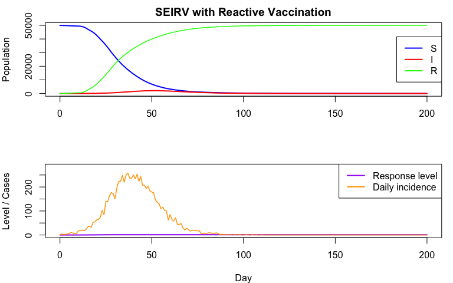
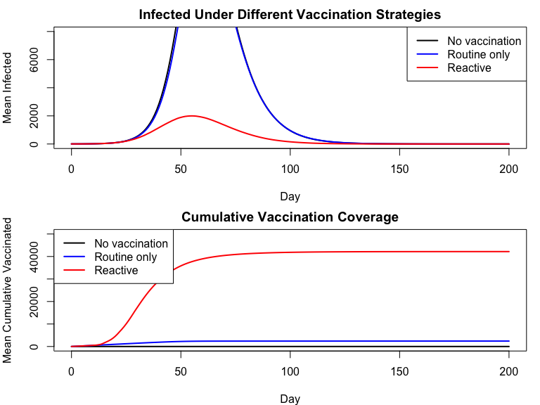
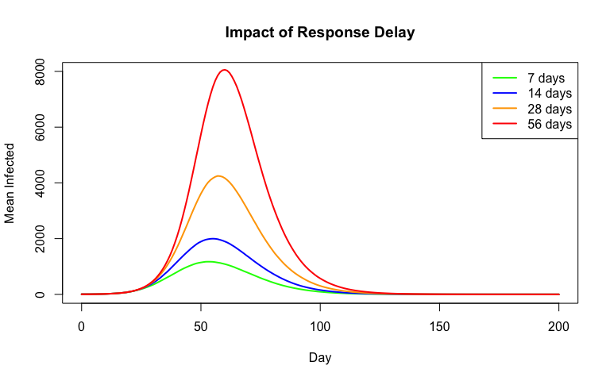
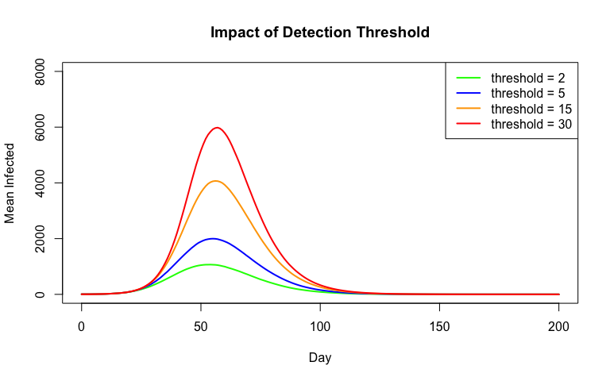
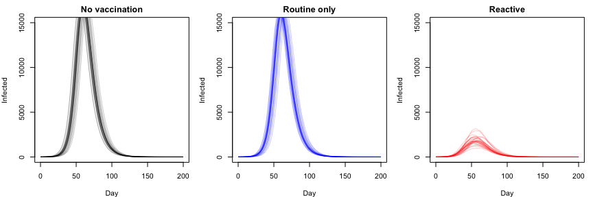
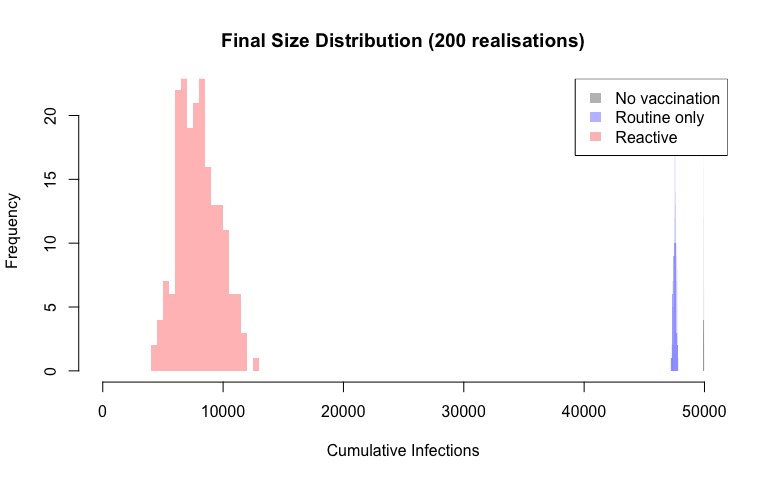

# Reactive Vaccination Policy with Outbreak Detection


## Introduction

R companion to the Julia reactive vaccination vignette. We model a SEIRV
system where emergency vaccination is triggered by a surveillance
signal: weekly detected cases exceeding a threshold.

``` r
library(odin2)
library(dust2)
```

## Model Definition

``` r
seirv_reactive <- odin({
  # Transmission dynamics
  update(S) <- S - n_SE - n_SV
  update(E) <- E + n_SE - n_EI
  update(I) <- I + n_EI - n_IR
  update(R) <- R + n_IR + n_SV

  initial(S) <- N - I0
  initial(E) <- 0
  initial(I) <- I0
  initial(R) <- 0

  # Transition probabilities
  foi <- beta * I / N
  n_SE <- Binomial(S, 1 - exp(-foi * dt))
  n_EI <- Binomial(E, 1 - exp(-sigma * dt))
  n_IR <- Binomial(I, 1 - exp(-gamma * dt))

  # Surveillance and detection (weekly accumulator)
  initial(cum_detected, zero_every = 7) <- 0
  update(cum_detected) <- cum_detected + Binomial(n_EI, p_detect)

  # Outbreak flag
  outbreak <- if (cum_detected >= case_threshold) 1 else 0

  # Response ramp-up
  initial(response_level) <- 0
  update(response_level) <- min(1.0, response_level + outbreak * dt / response_delay)

  # Vaccination: routine + emergency
  vacc_rate <- routine_vacc + response_level * emergency_vacc
  n_SV <- Binomial(S, 1 - exp(-vacc_rate * dt))

  # Tracking
  initial(incidence, zero_every = 1) <- 0
  update(incidence) <- incidence + n_SE
  initial(cum_vaccinated) <- 0
  update(cum_vaccinated) <- cum_vaccinated + n_SV

  # Parameters
  beta <- parameter(0.6)
  sigma <- parameter(0.2)
  gamma <- parameter(0.1)
  p_detect <- parameter(0.3)
  case_threshold <- parameter(5)
  response_delay <- parameter(14)
  routine_vacc <- parameter(0.001)
  emergency_vacc <- parameter(0.05)
  I0 <- parameter(5)
  N <- parameter(50000)
})
```

    ✔ Wrote 'DESCRIPTION'

    ✔ Wrote 'NAMESPACE'

    ✔ Wrote 'R/dust.R'

    ✔ Wrote 'src/dust.cpp'

    ✔ Wrote 'src/Makevars'

    ℹ 12 functions decorated with [[cpp11::register]]

    ✔ generated file 'cpp11.R'

    ✔ generated file 'cpp11.cpp'

    ℹ Re-compiling odin.systemb1d53ffc

    ── R CMD INSTALL ───────────────────────────────────────────────────────────────
    * installing *source* package ‘odin.systemb1d53ffc’ ...
    ** this is package ‘odin.systemb1d53ffc’ version ‘0.0.1’
    ** using staged installation
    ** libs
    using C++ compiler: ‘Homebrew clang version 21.1.5’
    using SDK: ‘MacOSX15.5.sdk’
    clang++ -arch arm64 -std=gnu++17 -I"/Library/Frameworks/R.framework/Resources/include" -DNDEBUG  -I'/Library/Frameworks/R.framework/Versions/4.5-arm64/Resources/library/cpp11/include' -I'/Library/Frameworks/R.framework/Versions/4.5-arm64/Resources/library/dust2/include' -I'/Library/Frameworks/R.framework/Versions/4.5-arm64/Resources/library/monty/include' -I/opt/R/arm64/include   -DHAVE_INLINE   -fPIC  -falign-functions=64 -Wall -g -O2  -Wall -pedantic  -c cpp11.cpp -o cpp11.o
    clang++ -arch arm64 -std=gnu++17 -I"/Library/Frameworks/R.framework/Resources/include" -DNDEBUG  -I'/Library/Frameworks/R.framework/Versions/4.5-arm64/Resources/library/cpp11/include' -I'/Library/Frameworks/R.framework/Versions/4.5-arm64/Resources/library/dust2/include' -I'/Library/Frameworks/R.framework/Versions/4.5-arm64/Resources/library/monty/include' -I/opt/R/arm64/include   -DHAVE_INLINE   -fPIC  -falign-functions=64 -Wall -g -O2  -Wall -pedantic  -c dust.cpp -o dust.o
    In file included from dust.cpp:128:
    In file included from /Library/Frameworks/R.framework/Versions/4.5-arm64/Resources/library/dust2/include/dust2/r/discrete/system.hpp:5:
    /Library/Frameworks/R.framework/Versions/4.5-arm64/Resources/library/monty/include/monty/r/random.hpp:60:43: warning: implicit conversion from 'type' (aka 'unsigned long') to 'double' changes value from 18446744073709551615 to 18446744073709551616 [-Wimplicit-const-int-float-conversion]
       60 |       std::ceil(std::abs(::unif_rand()) * std::numeric_limits<size_t>::max());
          |                                         ~ ^~~~~~~~~~~~~~~~~~~~~~~~~~~~~~~~~~
    /Library/Frameworks/R.framework/Versions/4.5-arm64/Resources/library/monty/include/monty/r/random.hpp:60:43: warning: implicit conversion from 'type' (aka 'unsigned long') to 'double' changes value from 18446744073709551615 to 18446744073709551616 [-Wimplicit-const-int-float-conversion]
       60 |       std::ceil(std::abs(::unif_rand()) * std::numeric_limits<size_t>::max());
          |                                         ~ ^~~~~~~~~~~~~~~~~~~~~~~~~~~~~~~~~~
    /Library/Frameworks/R.framework/Versions/4.5-arm64/Resources/library/dust2/include/dust2/r/discrete/system.hpp:41:33: note: in instantiation of function template specialization 'monty::random::r::as_rng_seed<monty::random::xoshiro_state<unsigned long long, 4, monty::random::scrambler::plus>>' requested here
       41 |   auto seed = monty::random::r::as_rng_seed<rng_state_type>(r_seed);
          |                                 ^
    dust.cpp:132:20: note: in instantiation of function template specialization 'dust2::r::dust2_discrete_alloc<odin_system>' requested here
      132 |   return dust2::r::dust2_discrete_alloc<odin_system>(r_pars, r_time, r_time_control, r_n_particles, r_n_groups, r_seed, r_deterministic, r_n_threads);
          |                    ^
    2 warnings generated.
    clang++ -arch arm64 -std=gnu++17 -dynamiclib -Wl,-headerpad_max_install_names -undefined dynamic_lookup -L/Library/Frameworks/R.framework/Resources/lib -L/opt/R/arm64/lib -o odin.systemb1d53ffc.so cpp11.o dust.o -F/Library/Frameworks/R.framework/.. -framework R
    installing to /private/var/folders/yh/30rj513j6mn1n7x556c2v4w80000gn/T/RtmpaEwgM5/devtools_install_167965074219c/00LOCK-dust_16796755d0177/00new/odin.systemb1d53ffc/libs
    ** checking absolute paths in shared objects and dynamic libraries
    * DONE (odin.systemb1d53ffc)

    ℹ Loading odin.systemb1d53ffc

State indices: 1=S, 2=E, 3=I, 4=R, 5=cum_detected, 6=response_level,
7=incidence, 8=cum_vaccinated.

## Baseline Simulation

``` r
base_pars <- list(
  beta = 0.6, sigma = 0.2, gamma = 0.1,
  p_detect = 0.3, case_threshold = 5,
  response_delay = 14,
  routine_vacc = 0.001, emergency_vacc = 0.05,
  I0 = 5, N = 50000
)

times <- seq(0, 200, by = 1)
sys <- dust_system_create(seirv_reactive, base_pars, dt = 1, seed = 42)
dust_system_set_state_initial(sys)
result <- dust_system_simulate(sys, times)

par(mfrow = c(2, 1), mar = c(4, 4, 2, 1))

# Top: compartments
plot(times, result[1, ], type = "l", col = "blue", lwd = 2,
     xlab = "", ylab = "Population",
     main = "SEIRV with Reactive Vaccination")
lines(times, result[3, ], col = "red", lwd = 2)
lines(times, result[4, ], col = "green", lwd = 1.5)
legend("right", legend = c("S", "I", "R"),
       col = c("blue", "red", "green"), lwd = 2)

# Bottom: response and incidence
plot(times, result[6, ], type = "l", col = "purple", lwd = 2,
     xlab = "Day", ylab = "Level / Cases",
     ylim = c(0, max(result[7, ]) * 1.1))
lines(times, result[7, ], col = "orange", lwd = 1.5)
legend("topright", legend = c("Response level", "Daily incidence"),
       col = c("purple", "orange"), lwd = 2)
```



## Scenario Comparison

Comparing no vaccination, routine only, and reactive vaccination:

``` r
scenarios <- list(
  list(label = "No vaccination",  rv = 0,     ev = 0),
  list(label = "Routine only",    rv = 0.001, ev = 0),
  list(label = "Reactive",        rv = 0.001, ev = 0.05)
)
cols <- c("black", "blue", "red")
n_runs <- 50

par(mfrow = c(2, 1), mar = c(4, 4, 2, 1))

# Infected
plot(NULL, xlim = c(0, 200), ylim = c(0, 8000),
     xlab = "Day", ylab = "Mean Infected",
     main = "Infected Under Different Vaccination Strategies")

for (k in seq_along(scenarios)) {
  sc <- scenarios[[k]]
  I_mean <- rep(0, length(times))
  for (seed in 1:n_runs) {
    p <- base_pars
    p$routine_vacc <- sc$rv
    p$emergency_vacc <- sc$ev
    sys <- dust_system_create(seirv_reactive, p, dt = 1, seed = seed)
    dust_system_set_state_initial(sys)
    r <- dust_system_simulate(sys, times)
    I_mean <- I_mean + r[3, ]
  }
  I_mean <- I_mean / n_runs
  lines(times, I_mean, col = cols[k], lwd = 2)
}
legend("topright", legend = sapply(scenarios, "[[", "label"),
       col = cols, lwd = 2)

# Cumulative vaccinated
plot(NULL, xlim = c(0, 200), ylim = c(0, 50000),
     xlab = "Day", ylab = "Mean Cumulative Vaccinated",
     main = "Cumulative Vaccination Coverage")

for (k in seq_along(scenarios)) {
  sc <- scenarios[[k]]
  V_mean <- rep(0, length(times))
  for (seed in 1:n_runs) {
    p <- base_pars
    p$routine_vacc <- sc$rv
    p$emergency_vacc <- sc$ev
    sys <- dust_system_create(seirv_reactive, p, dt = 1, seed = seed)
    dust_system_set_state_initial(sys)
    r <- dust_system_simulate(sys, times)
    V_mean <- V_mean + r[8, ]
  }
  V_mean <- V_mean / n_runs
  lines(times, V_mean, col = cols[k], lwd = 2)
}
legend("topleft", legend = sapply(scenarios, "[[", "label"),
       col = cols, lwd = 2)
```



## Sensitivity to Response Delay

``` r
delays <- c(7, 14, 28, 56)
delay_cols <- c("green", "blue", "orange", "red")

plot(NULL, xlim = c(0, 200), ylim = c(0, 8000),
     xlab = "Day", ylab = "Mean Infected",
     main = "Impact of Response Delay")

for (idx in seq_along(delays)) {
  I_mean <- rep(0, length(times))
  for (seed in 1:n_runs) {
    p <- base_pars
    p$response_delay <- delays[idx]
    sys <- dust_system_create(seirv_reactive, p, dt = 1, seed = seed)
    dust_system_set_state_initial(sys)
    r <- dust_system_simulate(sys, times)
    I_mean <- I_mean + r[3, ]
  }
  I_mean <- I_mean / n_runs
  lines(times, I_mean, col = delay_cols[idx], lwd = 2)
}
legend("topright", legend = paste(delays, "days"),
       col = delay_cols, lwd = 2)
```



## Sensitivity to Detection Threshold

``` r
thresholds <- c(2, 5, 15, 30)
thresh_cols <- c("green", "blue", "orange", "red")

plot(NULL, xlim = c(0, 200), ylim = c(0, 8000),
     xlab = "Day", ylab = "Mean Infected",
     main = "Impact of Detection Threshold")

for (idx in seq_along(thresholds)) {
  I_mean <- rep(0, length(times))
  for (seed in 1:n_runs) {
    p <- base_pars
    p$case_threshold <- thresholds[idx]
    sys <- dust_system_create(seirv_reactive, p, dt = 1, seed = seed)
    dust_system_set_state_initial(sys)
    r <- dust_system_simulate(sys, times)
    I_mean <- I_mean + r[3, ]
  }
  I_mean <- I_mean / n_runs
  lines(times, I_mean, col = thresh_cols[idx], lwd = 2)
}
legend("topright", legend = paste("threshold =", thresholds),
       col = thresh_cols, lwd = 2)
```



## Stochastic Variability

``` r
par(mfrow = c(1, 3), mar = c(4, 4, 2, 1))

scenario_pars_list <- list(
  modifyList(base_pars, list(routine_vacc = 0, emergency_vacc = 0)),
  modifyList(base_pars, list(emergency_vacc = 0)),
  base_pars
)
scenario_labels <- c("No vaccination", "Routine only", "Reactive")

for (idx in 1:3) {
  plot(NULL, xlim = c(0, 200), ylim = c(0, 15000),
       xlab = "Day", ylab = "Infected", main = scenario_labels[idx])
  for (seed in 1:30) {
    sys <- dust_system_create(seirv_reactive, scenario_pars_list[[idx]],
                              dt = 1, seed = seed)
    dust_system_set_state_initial(sys)
    r <- dust_system_simulate(sys, times)
    lines(times, r[3, ], col = adjustcolor(cols[idx], alpha.f = 0.2))
  }
}
```



## Final Size Distribution

``` r
n_sims <- 200
final_sizes <- list()

for (k in seq_along(scenarios)) {
  sc <- scenarios[[k]]
  sizes <- numeric(n_sims)
  for (seed in 1:n_sims) {
    p <- base_pars
    p$routine_vacc <- sc$rv
    p$emergency_vacc <- sc$ev
    sys <- dust_system_create(seirv_reactive, p, dt = 1, seed = seed)
    dust_system_set_state_initial(sys)
    r <- dust_system_simulate(sys, times)
    sizes[seed] <- r[4, length(times)] - r[8, length(times)]
  }
  final_sizes[[sc$label]] <- sizes
}

# Overlaid histograms
hist(final_sizes[["No vaccination"]], breaks = 30, col = adjustcolor("black", 0.3),
     border = NA, main = "Final Size Distribution (200 realisations)",
     xlab = "Cumulative Infections", xlim = c(0, max(unlist(final_sizes))))
hist(final_sizes[["Routine only"]], breaks = 30, col = adjustcolor("blue", 0.3),
     border = NA, add = TRUE)
hist(final_sizes[["Reactive"]], breaks = 30, col = adjustcolor("red", 0.3),
     border = NA, add = TRUE)
legend("topright", legend = sapply(scenarios, "[[", "label"),
       fill = adjustcolor(cols, 0.3), border = NA)
```



``` r
cat("Final size summary (mean ± sd):\n")
```

    Final size summary (mean ± sd):

``` r
for (k in seq_along(scenarios)) {
  label <- scenarios[[k]]$label
  vals <- final_sizes[[label]]
  cat(sprintf("  %s: %.0f ± %.0f\n", label, mean(vals), sd(vals)))
}
```

      No vaccination: 49908 ± 10
      Routine only: 47508 ± 123
      Reactive: 7948 ± 1683

## Summary

The R implementation demonstrates the same reactive vaccination model as
the Julia vignette: surveillance-triggered emergency vaccination with
imperfect detection, response delays, and scenario comparison across
policy parameters.
