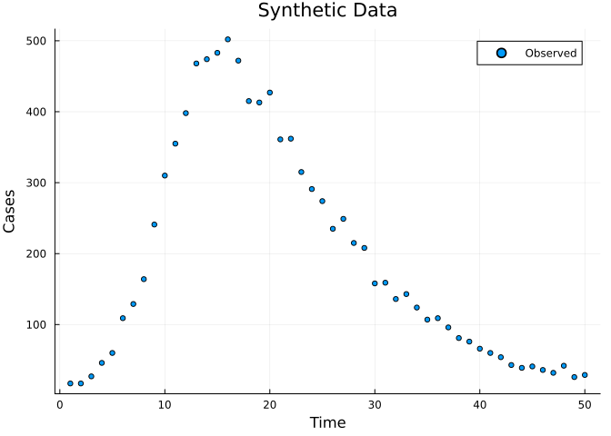
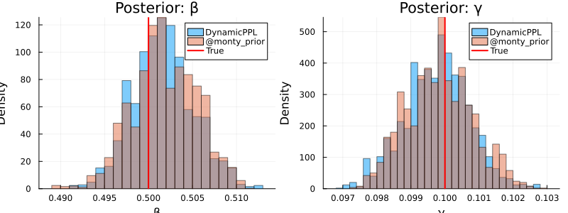

# DynamicPPL Integration


## Introduction

Odin.jl integrates with the
[DynamicPPL.jl](https://github.com/TuringLang/DynamicPPL.jl)
probabilistic programming framework, enabling richer prior
specifications and compatibility with the [Turing.jl](https://turing.ml)
ecosystem. This opens up:

- **Hierarchical priors** — parameter-to-parameter dependencies that go
  beyond independent priors.
- **MCMCChains diagnostics** — ESS, R̂, and trace plots via a single
  `to_chains()` call.
- **LogDensityProblems interface** — interoperability with
  AdvancedHMC.jl and other sampling packages.

We build on the inference workflow from [Vignette
06](../06_inference/06_inference.qmd), fitting an SIR model to synthetic
incidence data.

## Setup

``` julia
using Odin
using DynamicPPL
using Distributions
using MCMCChains
using Plots
using Statistics
using LinearAlgebra: diagm
using Random
```

### Define the Model

We use a deterministic ODE-based SIR, with the infected compartment
named `Inf2` to avoid shadowing Julia’s `I` (the `UniformScaling`
identity).

``` julia
sir = @odin begin
    deriv(S) = -beta * S * Inf2 / N
    deriv(Inf2) = beta * S * Inf2 / N - gamma * Inf2
    deriv(R) = gamma * Inf2
    initial(S) = N - I0
    initial(Inf2) = I0
    initial(R) = 0

    cases = data()
    cases ~ Poisson(Inf2 + 1e-6)

    beta = parameter(0.5)
    gamma = parameter(0.1)
    I0 = parameter(10)
    N = parameter(1000)
end
```

    DustSystemGenerator{var"##OdinModel#277"}(var"##OdinModel#277"(3, [:S, :Inf2, :R], [:beta, :gamma, :I0, :N], true, true, false, false))

### Generate Synthetic Data

We simulate the ODE to get true infected counts, then generate noisy
Poisson observations.

``` julia
true_pars = (beta=0.5, gamma=0.1, I0=10.0, N=1000.0)
times = collect(0.0:1.0:50.0)

result = dust_system_simulate(sir, true_pars; times=times, seed=1)
true_infected = result[2, 1, 2:end]  # Inf2 compartment

Random.seed!(42)
observed = [rand(Poisson(max(x, 1e-6))) for x in true_infected]

data = dust_filter_data(
    [(time=Float64(t), cases=Float64(c)) for (t, c) in zip(times[2:end], observed)]
)

plot(times[2:end], observed, seriestype=:scatter,
     xlabel="Time", ylabel="Cases", title="Synthetic Data",
     label="Observed", markersize=3)
```



### Deterministic Likelihood

``` julia
uf = dust_unfilter_create(sir, data; time_start=0.0)
pk = monty_packer([:beta, :gamma]; fixed=(I0=10.0, N=1000.0))
likelihood = dust_likelihood_monty(uf, pk)

ll_true = likelihood([0.5, 0.1])
println("Log-likelihood at true parameters: ", round(ll_true, digits=2))
```

    Log-likelihood at true parameters: -183.16

## Basic Priors with `dppl_prior`

The `dppl_prior` function converts a DynamicPPL `@model` into a
`MontyModel` that slots directly into Odin’s inference pipeline.

### DynamicPPL approach

``` julia
DynamicPPL.@model function sir_prior()
    beta ~ Gamma(2.0, 0.25)
    gamma ~ Gamma(2.0, 0.05)
end

prior_dppl = dppl_prior(sir_prior())
```

    MontyModel{Odin.var"#88#89"{Model{typeof(sir_prior), (), (), (), Tuple{}, Tuple{}, DefaultContext, false}, Odin.var"#_make_nt_builder##2#_make_nt_builder##3"{Vector{Symbol}}, Int64}, Odin.var"#90#91"{Odin.var"#88#89"{Model{typeof(sir_prior), (), (), (), Tuple{}, Tuple{}, DefaultContext, false}, Odin.var"#_make_nt_builder##2#_make_nt_builder##3"{Vector{Symbol}}, Int64}}, Odin.var"#92#93"{Model{typeof(sir_prior), (), (), (), Tuple{}, Tuple{}, DefaultContext, false}, Int64}, Matrix{Float64}}(["beta", "gamma"], Odin.var"#88#89"{Model{typeof(sir_prior), (), (), (), Tuple{}, Tuple{}, DefaultContext, false}, Odin.var"#_make_nt_builder##2#_make_nt_builder##3"{Vector{Symbol}}, Int64}(Model{typeof(sir_prior), (), (), (), Tuple{}, Tuple{}, DefaultContext, false}(sir_prior, NamedTuple(), NamedTuple(), DefaultContext()), Odin.var"#_make_nt_builder##2#_make_nt_builder##3"{Vector{Symbol}}([:beta, :gamma]), 2), Odin.var"#90#91"{Odin.var"#88#89"{Model{typeof(sir_prior), (), (), (), Tuple{}, Tuple{}, DefaultContext, false}, Odin.var"#_make_nt_builder##2#_make_nt_builder##3"{Vector{Symbol}}, Int64}}(Odin.var"#88#89"{Model{typeof(sir_prior), (), (), (), Tuple{}, Tuple{}, DefaultContext, false}, Odin.var"#_make_nt_builder##2#_make_nt_builder##3"{Vector{Symbol}}, Int64}(Model{typeof(sir_prior), (), (), (), Tuple{}, Tuple{}, DefaultContext, false}(sir_prior, NamedTuple(), NamedTuple(), DefaultContext()), Odin.var"#_make_nt_builder##2#_make_nt_builder##3"{Vector{Symbol}}([:beta, :gamma]), 2)), Odin.var"#92#93"{Model{typeof(sir_prior), (), (), (), Tuple{}, Tuple{}, DefaultContext, false}, Int64}(Model{typeof(sir_prior), (), (), (), Tuple{}, Tuple{}, DefaultContext, false}(sir_prior, NamedTuple(), NamedTuple(), DefaultContext()), 2), [0.0 Inf; 0.0 Inf], Odin.MontyModelProperties(true, true, false, false))

### Equivalent `@monty_prior` approach

``` julia
prior_monty = @monty_prior begin
    beta ~ Gamma(2.0, 0.25)
    gamma ~ Gamma(2.0, 0.05)
end
```

    MontyModel{var"#10#11", var"#12#13"{var"#10#11"}, var"#14#15", Matrix{Float64}}(["beta", "gamma"], var"#10#11"(), var"#12#13"{var"#10#11"}(var"#10#11"()), var"#14#15"(), [0.0 Inf; 0.0 Inf], Odin.MontyModelProperties(true, true, false, false))

Both produce a `MontyModel` with the same density. Let’s verify:

``` julia
θ_test = [0.4, 0.08]
println("DynamicPPL prior density: ", round(prior_dppl(θ_test), digits=4))
println("@monty_prior density:    ", round(prior_monty(θ_test), digits=4))
```

    DynamicPPL prior density: 2.122
    @monty_prior density:    2.122

## Hierarchical Priors

DynamicPPL’s real power is expressing parameter-to-parameter
dependencies. Here we define R₀ = β/γ as a latent quantity and derive β
from it:

``` julia
DynamicPPL.@model function hierarchical_prior()
    log_R0 ~ Normal(log(2.5), 0.5)
    gamma ~ Gamma(2.0, 0.05)
    beta ~ LogNormal(log_R0 + log(gamma), 0.1)
end

prior_hier = dppl_prior(hierarchical_prior())
println("Hierarchical prior parameters: ", prior_hier.parameters)
```

    Hierarchical prior parameters: ["log_R0", "gamma", "beta"]

Note that `log_R0` becomes a sampled parameter alongside `gamma` and
`beta`. The likelihood packer only maps `beta` and `gamma` to the model,
so we need to adjust the packer to include `log_R0`:

``` julia
pk_hier = monty_packer([:log_R0, :gamma, :beta]; fixed=(I0=10.0, N=1000.0))
likelihood_hier = dust_likelihood_monty(uf, pk_hier)
posterior_hier = likelihood_hier + prior_hier
```

    MontyModel{Odin.var"#monty_model_combine##0#monty_model_combine##1"{MontyModel{Odin.var"#dust_likelihood_monty##2#dust_likelihood_monty##3"{DustUnfilter{var"##OdinModel#277", @NamedTuple{cases::Float64}}, MontyPacker}, Odin.var"#dust_likelihood_monty##4#dust_likelihood_monty##5"{Odin.var"#dust_likelihood_monty##2#dust_likelihood_monty##3"{DustUnfilter{var"##OdinModel#277", @NamedTuple{cases::Float64}}, MontyPacker}}, Nothing, Nothing}, MontyModel{Odin.var"#88#89"{Model{typeof(hierarchical_prior), (), (), (), Tuple{}, Tuple{}, DefaultContext, false}, Odin.var"#_make_nt_builder##2#_make_nt_builder##3"{Vector{Symbol}}, Int64}, Odin.var"#90#91"{Odin.var"#88#89"{Model{typeof(hierarchical_prior), (), (), (), Tuple{}, Tuple{}, DefaultContext, false}, Odin.var"#_make_nt_builder##2#_make_nt_builder##3"{Vector{Symbol}}, Int64}}, Odin.var"#92#93"{Model{typeof(hierarchical_prior), (), (), (), Tuple{}, Tuple{}, DefaultContext, false}, Int64}, Matrix{Float64}}}, Odin.var"#monty_model_combine##2#monty_model_combine##3"{MontyModel{Odin.var"#dust_likelihood_monty##2#dust_likelihood_monty##3"{DustUnfilter{var"##OdinModel#277", @NamedTuple{cases::Float64}}, MontyPacker}, Odin.var"#dust_likelihood_monty##4#dust_likelihood_monty##5"{Odin.var"#dust_likelihood_monty##2#dust_likelihood_monty##3"{DustUnfilter{var"##OdinModel#277", @NamedTuple{cases::Float64}}, MontyPacker}}, Nothing, Nothing}, MontyModel{Odin.var"#88#89"{Model{typeof(hierarchical_prior), (), (), (), Tuple{}, Tuple{}, DefaultContext, false}, Odin.var"#_make_nt_builder##2#_make_nt_builder##3"{Vector{Symbol}}, Int64}, Odin.var"#90#91"{Odin.var"#88#89"{Model{typeof(hierarchical_prior), (), (), (), Tuple{}, Tuple{}, DefaultContext, false}, Odin.var"#_make_nt_builder##2#_make_nt_builder##3"{Vector{Symbol}}, Int64}}, Odin.var"#92#93"{Model{typeof(hierarchical_prior), (), (), (), Tuple{}, Tuple{}, DefaultContext, false}, Int64}, Matrix{Float64}}}, Nothing, Matrix{Float64}}(["log_R0", "gamma", "beta"], Odin.var"#monty_model_combine##0#monty_model_combine##1"{MontyModel{Odin.var"#dust_likelihood_monty##2#dust_likelihood_monty##3"{DustUnfilter{var"##OdinModel#277", @NamedTuple{cases::Float64}}, MontyPacker}, Odin.var"#dust_likelihood_monty##4#dust_likelihood_monty##5"{Odin.var"#dust_likelihood_monty##2#dust_likelihood_monty##3"{DustUnfilter{var"##OdinModel#277", @NamedTuple{cases::Float64}}, MontyPacker}}, Nothing, Nothing}, MontyModel{Odin.var"#88#89"{Model{typeof(hierarchical_prior), (), (), (), Tuple{}, Tuple{}, DefaultContext, false}, Odin.var"#_make_nt_builder##2#_make_nt_builder##3"{Vector{Symbol}}, Int64}, Odin.var"#90#91"{Odin.var"#88#89"{Model{typeof(hierarchical_prior), (), (), (), Tuple{}, Tuple{}, DefaultContext, false}, Odin.var"#_make_nt_builder##2#_make_nt_builder##3"{Vector{Symbol}}, Int64}}, Odin.var"#92#93"{Model{typeof(hierarchical_prior), (), (), (), Tuple{}, Tuple{}, DefaultContext, false}, Int64}, Matrix{Float64}}}(MontyModel{Odin.var"#dust_likelihood_monty##2#dust_likelihood_monty##3"{DustUnfilter{var"##OdinModel#277", @NamedTuple{cases::Float64}}, MontyPacker}, Odin.var"#dust_likelihood_monty##4#dust_likelihood_monty##5"{Odin.var"#dust_likelihood_monty##2#dust_likelihood_monty##3"{DustUnfilter{var"##OdinModel#277", @NamedTuple{cases::Float64}}, MontyPacker}}, Nothing, Nothing}(["log_R0", "gamma", "beta"], Odin.var"#dust_likelihood_monty##2#dust_likelihood_monty##3"{DustUnfilter{var"##OdinModel#277", @NamedTuple{cases::Float64}}, MontyPacker}(DustUnfilter{var"##OdinModel#277", @NamedTuple{cases::Float64}}(DustSystemGenerator{var"##OdinModel#277"}(var"##OdinModel#277"(3, [:S, :Inf2, :R], [:beta, :gamma, :I0, :N], true, true, false, false)), FilterData{@NamedTuple{cases::Float64}}([1.0, 2.0, 3.0, 4.0, 5.0, 6.0, 7.0, 8.0, 9.0, 10.0  …  41.0, 42.0, 43.0, 44.0, 45.0, 46.0, 47.0, 48.0, 49.0, 50.0], [(cases = 17.0,), (cases = 17.0,), (cases = 27.0,), (cases = 46.0,), (cases = 60.0,), (cases = 109.0,), (cases = 129.0,), (cases = 164.0,), (cases = 241.0,), (cases = 310.0,)  …  (cases = 60.0,), (cases = 54.0,), (cases = 43.0,), (cases = 39.0,), (cases = 41.0,), (cases = 36.0,), (cases = 32.0,), (cases = 42.0,), (cases = 26.0,), (cases = 29.0,)]), 0.0, DustODEControl(1.0e-6, 1.0e-6, 10000)), MontyPacker([:log_R0, :gamma, :beta], [:log_R0, :gamma, :beta], Symbol[], Dict{Symbol, Tuple}(), Dict{Symbol, UnitRange{Int64}}(:beta => 3:3, :gamma => 2:2, :log_R0 => 1:1), 3, (I0 = 10.0, N = 1000.0), nothing)), Odin.var"#dust_likelihood_monty##4#dust_likelihood_monty##5"{Odin.var"#dust_likelihood_monty##2#dust_likelihood_monty##3"{DustUnfilter{var"##OdinModel#277", @NamedTuple{cases::Float64}}, MontyPacker}}(Odin.var"#dust_likelihood_monty##2#dust_likelihood_monty##3"{DustUnfilter{var"##OdinModel#277", @NamedTuple{cases::Float64}}, MontyPacker}(DustUnfilter{var"##OdinModel#277", @NamedTuple{cases::Float64}}(DustSystemGenerator{var"##OdinModel#277"}(var"##OdinModel#277"(3, [:S, :Inf2, :R], [:beta, :gamma, :I0, :N], true, true, false, false)), FilterData{@NamedTuple{cases::Float64}}([1.0, 2.0, 3.0, 4.0, 5.0, 6.0, 7.0, 8.0, 9.0, 10.0  …  41.0, 42.0, 43.0, 44.0, 45.0, 46.0, 47.0, 48.0, 49.0, 50.0], [(cases = 17.0,), (cases = 17.0,), (cases = 27.0,), (cases = 46.0,), (cases = 60.0,), (cases = 109.0,), (cases = 129.0,), (cases = 164.0,), (cases = 241.0,), (cases = 310.0,)  …  (cases = 60.0,), (cases = 54.0,), (cases = 43.0,), (cases = 39.0,), (cases = 41.0,), (cases = 36.0,), (cases = 32.0,), (cases = 42.0,), (cases = 26.0,), (cases = 29.0,)]), 0.0, DustODEControl(1.0e-6, 1.0e-6, 10000)), MontyPacker([:log_R0, :gamma, :beta], [:log_R0, :gamma, :beta], Symbol[], Dict{Symbol, Tuple}(), Dict{Symbol, UnitRange{Int64}}(:beta => 3:3, :gamma => 2:2, :log_R0 => 1:1), 3, (I0 = 10.0, N = 1000.0), nothing))), nothing, nothing, Odin.MontyModelProperties(true, false, false, false)), MontyModel{Odin.var"#88#89"{Model{typeof(hierarchical_prior), (), (), (), Tuple{}, Tuple{}, DefaultContext, false}, Odin.var"#_make_nt_builder##2#_make_nt_builder##3"{Vector{Symbol}}, Int64}, Odin.var"#90#91"{Odin.var"#88#89"{Model{typeof(hierarchical_prior), (), (), (), Tuple{}, Tuple{}, DefaultContext, false}, Odin.var"#_make_nt_builder##2#_make_nt_builder##3"{Vector{Symbol}}, Int64}}, Odin.var"#92#93"{Model{typeof(hierarchical_prior), (), (), (), Tuple{}, Tuple{}, DefaultContext, false}, Int64}, Matrix{Float64}}(["log_R0", "gamma", "beta"], Odin.var"#88#89"{Model{typeof(hierarchical_prior), (), (), (), Tuple{}, Tuple{}, DefaultContext, false}, Odin.var"#_make_nt_builder##2#_make_nt_builder##3"{Vector{Symbol}}, Int64}(Model{typeof(hierarchical_prior), (), (), (), Tuple{}, Tuple{}, DefaultContext, false}(hierarchical_prior, NamedTuple(), NamedTuple(), DefaultContext()), Odin.var"#_make_nt_builder##2#_make_nt_builder##3"{Vector{Symbol}}([:log_R0, :gamma, :beta]), 3), Odin.var"#90#91"{Odin.var"#88#89"{Model{typeof(hierarchical_prior), (), (), (), Tuple{}, Tuple{}, DefaultContext, false}, Odin.var"#_make_nt_builder##2#_make_nt_builder##3"{Vector{Symbol}}, Int64}}(Odin.var"#88#89"{Model{typeof(hierarchical_prior), (), (), (), Tuple{}, Tuple{}, DefaultContext, false}, Odin.var"#_make_nt_builder##2#_make_nt_builder##3"{Vector{Symbol}}, Int64}(Model{typeof(hierarchical_prior), (), (), (), Tuple{}, Tuple{}, DefaultContext, false}(hierarchical_prior, NamedTuple(), NamedTuple(), DefaultContext()), Odin.var"#_make_nt_builder##2#_make_nt_builder##3"{Vector{Symbol}}([:log_R0, :gamma, :beta]), 3)), Odin.var"#92#93"{Model{typeof(hierarchical_prior), (), (), (), Tuple{}, Tuple{}, DefaultContext, false}, Int64}(Model{typeof(hierarchical_prior), (), (), (), Tuple{}, Tuple{}, DefaultContext, false}(hierarchical_prior, NamedTuple(), NamedTuple(), DefaultContext()), 3), [-Inf Inf; 0.0 Inf; 0.0 Inf], Odin.MontyModelProperties(true, true, false, false))), Odin.var"#monty_model_combine##2#monty_model_combine##3"{MontyModel{Odin.var"#dust_likelihood_monty##2#dust_likelihood_monty##3"{DustUnfilter{var"##OdinModel#277", @NamedTuple{cases::Float64}}, MontyPacker}, Odin.var"#dust_likelihood_monty##4#dust_likelihood_monty##5"{Odin.var"#dust_likelihood_monty##2#dust_likelihood_monty##3"{DustUnfilter{var"##OdinModel#277", @NamedTuple{cases::Float64}}, MontyPacker}}, Nothing, Nothing}, MontyModel{Odin.var"#88#89"{Model{typeof(hierarchical_prior), (), (), (), Tuple{}, Tuple{}, DefaultContext, false}, Odin.var"#_make_nt_builder##2#_make_nt_builder##3"{Vector{Symbol}}, Int64}, Odin.var"#90#91"{Odin.var"#88#89"{Model{typeof(hierarchical_prior), (), (), (), Tuple{}, Tuple{}, DefaultContext, false}, Odin.var"#_make_nt_builder##2#_make_nt_builder##3"{Vector{Symbol}}, Int64}}, Odin.var"#92#93"{Model{typeof(hierarchical_prior), (), (), (), Tuple{}, Tuple{}, DefaultContext, false}, Int64}, Matrix{Float64}}}(MontyModel{Odin.var"#dust_likelihood_monty##2#dust_likelihood_monty##3"{DustUnfilter{var"##OdinModel#277", @NamedTuple{cases::Float64}}, MontyPacker}, Odin.var"#dust_likelihood_monty##4#dust_likelihood_monty##5"{Odin.var"#dust_likelihood_monty##2#dust_likelihood_monty##3"{DustUnfilter{var"##OdinModel#277", @NamedTuple{cases::Float64}}, MontyPacker}}, Nothing, Nothing}(["log_R0", "gamma", "beta"], Odin.var"#dust_likelihood_monty##2#dust_likelihood_monty##3"{DustUnfilter{var"##OdinModel#277", @NamedTuple{cases::Float64}}, MontyPacker}(DustUnfilter{var"##OdinModel#277", @NamedTuple{cases::Float64}}(DustSystemGenerator{var"##OdinModel#277"}(var"##OdinModel#277"(3, [:S, :Inf2, :R], [:beta, :gamma, :I0, :N], true, true, false, false)), FilterData{@NamedTuple{cases::Float64}}([1.0, 2.0, 3.0, 4.0, 5.0, 6.0, 7.0, 8.0, 9.0, 10.0  …  41.0, 42.0, 43.0, 44.0, 45.0, 46.0, 47.0, 48.0, 49.0, 50.0], [(cases = 17.0,), (cases = 17.0,), (cases = 27.0,), (cases = 46.0,), (cases = 60.0,), (cases = 109.0,), (cases = 129.0,), (cases = 164.0,), (cases = 241.0,), (cases = 310.0,)  …  (cases = 60.0,), (cases = 54.0,), (cases = 43.0,), (cases = 39.0,), (cases = 41.0,), (cases = 36.0,), (cases = 32.0,), (cases = 42.0,), (cases = 26.0,), (cases = 29.0,)]), 0.0, DustODEControl(1.0e-6, 1.0e-6, 10000)), MontyPacker([:log_R0, :gamma, :beta], [:log_R0, :gamma, :beta], Symbol[], Dict{Symbol, Tuple}(), Dict{Symbol, UnitRange{Int64}}(:beta => 3:3, :gamma => 2:2, :log_R0 => 1:1), 3, (I0 = 10.0, N = 1000.0), nothing)), Odin.var"#dust_likelihood_monty##4#dust_likelihood_monty##5"{Odin.var"#dust_likelihood_monty##2#dust_likelihood_monty##3"{DustUnfilter{var"##OdinModel#277", @NamedTuple{cases::Float64}}, MontyPacker}}(Odin.var"#dust_likelihood_monty##2#dust_likelihood_monty##3"{DustUnfilter{var"##OdinModel#277", @NamedTuple{cases::Float64}}, MontyPacker}(DustUnfilter{var"##OdinModel#277", @NamedTuple{cases::Float64}}(DustSystemGenerator{var"##OdinModel#277"}(var"##OdinModel#277"(3, [:S, :Inf2, :R], [:beta, :gamma, :I0, :N], true, true, false, false)), FilterData{@NamedTuple{cases::Float64}}([1.0, 2.0, 3.0, 4.0, 5.0, 6.0, 7.0, 8.0, 9.0, 10.0  …  41.0, 42.0, 43.0, 44.0, 45.0, 46.0, 47.0, 48.0, 49.0, 50.0], [(cases = 17.0,), (cases = 17.0,), (cases = 27.0,), (cases = 46.0,), (cases = 60.0,), (cases = 109.0,), (cases = 129.0,), (cases = 164.0,), (cases = 241.0,), (cases = 310.0,)  …  (cases = 60.0,), (cases = 54.0,), (cases = 43.0,), (cases = 39.0,), (cases = 41.0,), (cases = 36.0,), (cases = 32.0,), (cases = 42.0,), (cases = 26.0,), (cases = 29.0,)]), 0.0, DustODEControl(1.0e-6, 1.0e-6, 10000)), MontyPacker([:log_R0, :gamma, :beta], [:log_R0, :gamma, :beta], Symbol[], Dict{Symbol, Tuple}(), Dict{Symbol, UnitRange{Int64}}(:beta => 3:3, :gamma => 2:2, :log_R0 => 1:1), 3, (I0 = 10.0, N = 1000.0), nothing))), nothing, nothing, Odin.MontyModelProperties(true, false, false, false)), MontyModel{Odin.var"#88#89"{Model{typeof(hierarchical_prior), (), (), (), Tuple{}, Tuple{}, DefaultContext, false}, Odin.var"#_make_nt_builder##2#_make_nt_builder##3"{Vector{Symbol}}, Int64}, Odin.var"#90#91"{Odin.var"#88#89"{Model{typeof(hierarchical_prior), (), (), (), Tuple{}, Tuple{}, DefaultContext, false}, Odin.var"#_make_nt_builder##2#_make_nt_builder##3"{Vector{Symbol}}, Int64}}, Odin.var"#92#93"{Model{typeof(hierarchical_prior), (), (), (), Tuple{}, Tuple{}, DefaultContext, false}, Int64}, Matrix{Float64}}(["log_R0", "gamma", "beta"], Odin.var"#88#89"{Model{typeof(hierarchical_prior), (), (), (), Tuple{}, Tuple{}, DefaultContext, false}, Odin.var"#_make_nt_builder##2#_make_nt_builder##3"{Vector{Symbol}}, Int64}(Model{typeof(hierarchical_prior), (), (), (), Tuple{}, Tuple{}, DefaultContext, false}(hierarchical_prior, NamedTuple(), NamedTuple(), DefaultContext()), Odin.var"#_make_nt_builder##2#_make_nt_builder##3"{Vector{Symbol}}([:log_R0, :gamma, :beta]), 3), Odin.var"#90#91"{Odin.var"#88#89"{Model{typeof(hierarchical_prior), (), (), (), Tuple{}, Tuple{}, DefaultContext, false}, Odin.var"#_make_nt_builder##2#_make_nt_builder##3"{Vector{Symbol}}, Int64}}(Odin.var"#88#89"{Model{typeof(hierarchical_prior), (), (), (), Tuple{}, Tuple{}, DefaultContext, false}, Odin.var"#_make_nt_builder##2#_make_nt_builder##3"{Vector{Symbol}}, Int64}(Model{typeof(hierarchical_prior), (), (), (), Tuple{}, Tuple{}, DefaultContext, false}(hierarchical_prior, NamedTuple(), NamedTuple(), DefaultContext()), Odin.var"#_make_nt_builder##2#_make_nt_builder##3"{Vector{Symbol}}([:log_R0, :gamma, :beta]), 3)), Odin.var"#92#93"{Model{typeof(hierarchical_prior), (), (), (), Tuple{}, Tuple{}, DefaultContext, false}, Int64}(Model{typeof(hierarchical_prior), (), (), (), Tuple{}, Tuple{}, DefaultContext, false}(hierarchical_prior, NamedTuple(), NamedTuple(), DefaultContext()), 3), [-Inf Inf; 0.0 Inf; 0.0 Inf], Odin.MontyModelProperties(true, true, false, false))), nothing, [-Inf Inf; 0.0 Inf; 0.0 Inf], Odin.MontyModelProperties(true, false, false, false))

This is a key advantage over `@monty_prior`, which only supports
independent priors. With DynamicPPL, the joint prior density correctly
accounts for the dependency structure.

## Full Model with `to_turing_model`

For simpler cases (independent priors), `to_turing_model` wraps the dust
likelihood and priors into a single DynamicPPL model in one step:

``` julia
dm = to_turing_model(uf, pk;
    beta = Gamma(2.0, 0.25),
    gamma = Gamma(2.0, 0.05),
)
```

    Model{Odin.var"#_odin_turing_model#_build_dppl_model##2", (:likelihood_obj, :packer, :param_names, :prior_dists), (), (), Tuple{DustUnfilter{var"##OdinModel#277", @NamedTuple{cases::Float64}}, MontyPacker, Vector{Symbol}, Vector{Gamma{Float64}}}, Tuple{}, DefaultContext, false}(Odin.var"#_odin_turing_model#_build_dppl_model##2"(Core.Box(Odin.var"#_odin_turing_model#_build_dppl_model##2"(#= circular reference @-2 =#))), (likelihood_obj = DustUnfilter{var"##OdinModel#277", @NamedTuple{cases::Float64}}(DustSystemGenerator{var"##OdinModel#277"}(var"##OdinModel#277"(3, [:S, :Inf2, :R], [:beta, :gamma, :I0, :N], true, true, false, false)), FilterData{@NamedTuple{cases::Float64}}([1.0, 2.0, 3.0, 4.0, 5.0, 6.0, 7.0, 8.0, 9.0, 10.0  …  41.0, 42.0, 43.0, 44.0, 45.0, 46.0, 47.0, 48.0, 49.0, 50.0], [(cases = 17.0,), (cases = 17.0,), (cases = 27.0,), (cases = 46.0,), (cases = 60.0,), (cases = 109.0,), (cases = 129.0,), (cases = 164.0,), (cases = 241.0,), (cases = 310.0,)  …  (cases = 60.0,), (cases = 54.0,), (cases = 43.0,), (cases = 39.0,), (cases = 41.0,), (cases = 36.0,), (cases = 32.0,), (cases = 42.0,), (cases = 26.0,), (cases = 29.0,)]), 0.0, DustODEControl(1.0e-6, 1.0e-6, 10000)), packer = MontyPacker([:beta, :gamma], [:beta, :gamma], Symbol[], Dict{Symbol, Tuple}(), Dict{Symbol, UnitRange{Int64}}(:beta => 1:1, :gamma => 2:2), 2, (I0 = 10.0, N = 1000.0), nothing), param_names = [:beta, :gamma], prior_dists = Gamma{Float64}[Distributions.Gamma{Float64}(α=2.0, θ=0.25), Distributions.Gamma{Float64}(α=2.0, θ=0.05)]), NamedTuple(), DefaultContext())

Then sample with Odin’s native samplers via `turing_sample`:

``` julia
vcv = diagm([0.005, 0.001])
sampler = monty_sampler_adaptive(vcv)

samples_dppl = turing_sample(dm, sampler, 3000;
    initial=reshape([0.4, 0.08], 2, 1), n_chains=1, n_burnin=500, seed=123)

println("Parameter names: ", samples_dppl.parameter_names)
println("Samples shape: ", size(samples_dppl.pars))
```

    Parameter names: ["θ[1]", "θ[2]"]
    Samples shape: (2, 2500, 1)

## LogDensityProblems Interface

Every `MontyModel` satisfies the
[LogDensityProblems.jl](https://github.com/tpapp/LogDensityProblems.jl)
interface, making it compatible with AdvancedHMC.jl and other packages
in the ecosystem.

``` julia
import LogDensityProblems

posterior_monty = likelihood + prior_dppl
ld = as_logdensity(posterior_monty)

println("Dimension:    ", LogDensityProblems.dimension(ld))
println("Capabilities: ", LogDensityProblems.capabilities(typeof(ld)))
println("Log-density:  ", round(LogDensityProblems.logdensity(ld, [0.5, 0.1]), digits=2))
```

    Dimension:    2
    Capabilities: LogDensityProblems.LogDensityOrder{1}()
    Log-density:  -181.39

Because the deterministic likelihood supports automatic differentiation,
the wrapper exposes gradients:

``` julia
ld_val, ld_grad = LogDensityProblems.logdensity_and_gradient(ld, [0.5, 0.1])
println("Log-density: ", round(ld_val, digits=2))
println("Gradient:    ", round.(ld_grad, digits=4))
```

    Log-density: -181.39
    Gradient:    [130.9867, -104.4564]

## MCMCChains Output

The `to_chains` function converts Odin’s `MontySamples` into an
`MCMCChains.Chains` object for rich diagnostics:

``` julia
chains = to_chains(samples_dppl)
display(chains)
```

    Chains MCMC chain (2500×2×1 Array{Float64, 3}):

    Iterations        = 1:1:2500
    Number of chains  = 1
    Samples per chain = 2500
    parameters        = θ[1], θ[2]

    Use `describe(chains)` for summary statistics and quantiles.

MCMCChains gives us ESS, R̂, and quantile summaries automatically. For
multi-chain runs these diagnostics are especially informative.

## Comparison

Let’s verify that the DynamicPPL prior and `@monty_prior` produce
identical posteriors.

### `@monty_prior` posterior

``` julia
posterior_monty_prior = likelihood + prior_monty

samples_monty = monty_sample(posterior_monty_prior, sampler, 3000;
    initial=reshape([0.4, 0.08], 2, 1), n_chains=1, n_burnin=500, seed=456)
```

    MontySamples([0.4971767004466487 0.4971767004466487 … 0.5050392075858925 0.5050392075858925; 0.09991669234748271 0.09991669234748271 … 0.09777281026105412 0.09777281026105412;;;], [-182.13469754823333; -182.13469754823333; … ; -183.6751598186646; -183.6751598186646;;], [0.4; 0.08;;], ["beta", "gamma"], Dict{Symbol, Any}(:acceptance_rate => [0.3273333333333333]))

### Compare posteriors

``` julia
beta_dppl = samples_dppl.pars[1, :, 1]
gamma_dppl = samples_dppl.pars[2, :, 1]

beta_monty = samples_monty.pars[1, :, 1]
gamma_monty = samples_monty.pars[2, :, 1]

println("DynamicPPL — β: ", round(mean(beta_dppl), digits=3),
        " ± ", round(std(beta_dppl), digits=3))
println("@monty     — β: ", round(mean(beta_monty), digits=3),
        " ± ", round(std(beta_monty), digits=3))
println()
println("DynamicPPL — γ: ", round(mean(gamma_dppl), digits=3),
        " ± ", round(std(gamma_dppl), digits=3))
println("@monty     — γ: ", round(mean(gamma_monty), digits=3),
        " ± ", round(std(gamma_monty), digits=3))
```

    DynamicPPL — β: 0.502 ± 0.003
    @monty     — β: 0.502 ± 0.004

    DynamicPPL — γ: 0.1 ± 0.001
    @monty     — γ: 0.1 ± 0.001

``` julia
p1 = histogram(beta_dppl, bins=30, alpha=0.5, label="DynamicPPL",
               xlabel="β", ylabel="Density", title="Posterior: β", normalize=true)
histogram!(p1, beta_monty, bins=30, alpha=0.5, label="@monty_prior", normalize=true)
vline!(p1, [0.5], label="True", color=:red, linewidth=2)

p2 = histogram(gamma_dppl, bins=30, alpha=0.5, label="DynamicPPL",
               xlabel="γ", ylabel="Density", title="Posterior: γ", normalize=true)
histogram!(p2, gamma_monty, bins=30, alpha=0.5, label="@monty_prior", normalize=true)
vline!(p2, [0.1], label="True", color=:red, linewidth=2)

plot(p1, p2, layout=(1, 2), size=(800, 300))
```



The posteriors overlap closely, confirming that both prior
specifications produce equivalent results. The DynamicPPL route becomes
essential when you need hierarchical or correlated prior structures that
`@monty_prior` cannot express.
