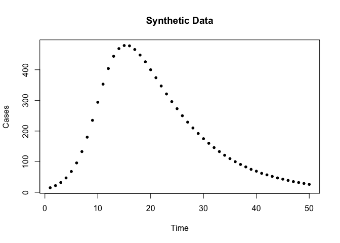
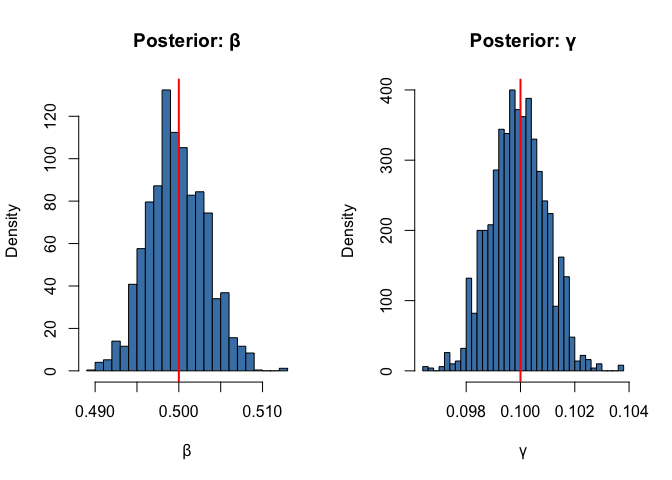
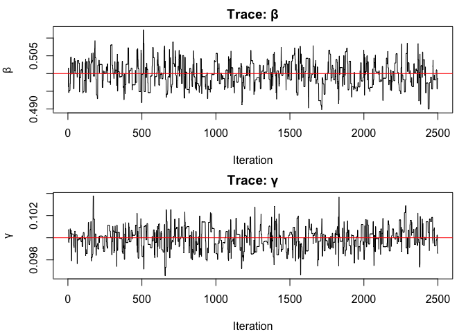

# DynamicPPL Integration (R Equivalent)


## Introduction

This vignette shows the R equivalent of the Julia DynamicPPL integration
workflow. In R, we use `monty_dsl()` for prior specification and
`monty_sample()` for inference, with `odin2`, `dust2`, and `monty`.

Note that R’s `monty_dsl()` supports independent priors only. The
hierarchical prior structures available via Julia’s DynamicPPL
integration (e.g. deriving β from R₀ and γ) are not directly expressible
in `monty_dsl()` — this is one advantage of the Julia ecosystem.

## Model and Data

``` r
library(odin2)
library(dust2)
library(monty)

sir <- odin({
  deriv(S) <- -beta * S * Inf2 / N
  deriv(Inf2) <- beta * S * Inf2 / N - gamma * Inf2
  deriv(R) <- gamma * Inf2
  initial(S) <- N - I0
  initial(Inf2) <- I0
  initial(R) <- 0

  cases <- data()
  cases ~ Poisson(Inf2 + 1e-6)

  beta <- parameter(0.5)
  gamma <- parameter(0.1)
  I0 <- parameter(10)
  N <- parameter(1000)
})
```

    ✔ Wrote 'DESCRIPTION'

    ✔ Wrote 'NAMESPACE'

    ✔ Wrote 'R/dust.R'

    ✔ Wrote 'src/dust.cpp'

    ✔ Wrote 'src/Makevars'

    ℹ 28 functions decorated with [[cpp11::register]]

    ✔ generated file 'cpp11.R'

    ✔ generated file 'cpp11.cpp'

    ℹ Re-compiling odin.system7808f0d3

    ── R CMD INSTALL ───────────────────────────────────────────────────────────────
    * installing *source* package ‘odin.system7808f0d3’ ...
    ** this is package ‘odin.system7808f0d3’ version ‘0.0.1’
    ** using staged installation
    ** libs
    using C++ compiler: ‘Homebrew clang version 21.1.5’
    using SDK: ‘MacOSX15.5.sdk’
    clang++ -arch arm64 -std=gnu++17 -I"/Library/Frameworks/R.framework/Resources/include" -DNDEBUG  -I'/Library/Frameworks/R.framework/Versions/4.5-arm64/Resources/library/cpp11/include' -I'/Library/Frameworks/R.framework/Versions/4.5-arm64/Resources/library/dust2/include' -I'/Library/Frameworks/R.framework/Versions/4.5-arm64/Resources/library/monty/include' -I/opt/R/arm64/include   -DHAVE_INLINE   -fPIC  -falign-functions=64 -Wall -g -O2  -Wall -pedantic  -c cpp11.cpp -o cpp11.o
    clang++ -arch arm64 -std=gnu++17 -I"/Library/Frameworks/R.framework/Resources/include" -DNDEBUG  -I'/Library/Frameworks/R.framework/Versions/4.5-arm64/Resources/library/cpp11/include' -I'/Library/Frameworks/R.framework/Versions/4.5-arm64/Resources/library/dust2/include' -I'/Library/Frameworks/R.framework/Versions/4.5-arm64/Resources/library/monty/include' -I/opt/R/arm64/include   -DHAVE_INLINE   -fPIC  -falign-functions=64 -Wall -g -O2  -Wall -pedantic  -c dust.cpp -o dust.o
    In file included from dust.cpp:87:
    In file included from /Library/Frameworks/R.framework/Versions/4.5-arm64/Resources/library/dust2/include/dust2/r/continuous/system.hpp:4:
    /Library/Frameworks/R.framework/Versions/4.5-arm64/Resources/library/monty/include/monty/r/random.hpp:60:43: warning: implicit conversion from 'type' (aka 'unsigned long') to 'double' changes value from 18446744073709551615 to 18446744073709551616 [-Wimplicit-const-int-float-conversion]
       60 |       std::ceil(std::abs(::unif_rand()) * std::numeric_limits<size_t>::max());
          |                                         ~ ^~~~~~~~~~~~~~~~~~~~~~~~~~~~~~~~~~
    /Library/Frameworks/R.framework/Versions/4.5-arm64/Resources/library/monty/include/monty/r/random.hpp:60:43: warning: implicit conversion from 'type' (aka 'unsigned long') to 'double' changes value from 18446744073709551615 to 18446744073709551616 [-Wimplicit-const-int-float-conversion]
       60 |       std::ceil(std::abs(::unif_rand()) * std::numeric_limits<size_t>::max());
          |                                         ~ ^~~~~~~~~~~~~~~~~~~~~~~~~~~~~~~~~~
    /Library/Frameworks/R.framework/Versions/4.5-arm64/Resources/library/dust2/include/dust2/r/continuous/system.hpp:34:33: note: in instantiation of function template specialization 'monty::random::r::as_rng_seed<monty::random::xoshiro_state<unsigned long long, 4, monty::random::scrambler::plus>>' requested here
       34 |   auto seed = monty::random::r::as_rng_seed<rng_state_type>(r_seed);
          |                                 ^
    dust.cpp:93:20: note: in instantiation of function template specialization 'dust2::r::dust2_continuous_alloc<odin_system>' requested here
       93 |   return dust2::r::dust2_continuous_alloc<odin_system>(r_pars, r_time, r_time_control, r_n_particles, r_n_groups, r_seed, r_deterministic, r_n_threads);
          |                    ^
    2 warnings generated.
    clang++ -arch arm64 -std=gnu++17 -dynamiclib -Wl,-headerpad_max_install_names -undefined dynamic_lookup -L/Library/Frameworks/R.framework/Resources/lib -L/opt/R/arm64/lib -o odin.system7808f0d3.so cpp11.o dust.o -F/Library/Frameworks/R.framework/.. -framework R
    installing to /private/var/folders/yh/30rj513j6mn1n7x556c2v4w80000gn/T/Rtmp2o8Q6T/devtools_install_169c6146b71e6/00LOCK-dust_169c638c750a8/00new/odin.system7808f0d3/libs
    ** checking absolute paths in shared objects and dynamic libraries
    * DONE (odin.system7808f0d3)

    ℹ Loading odin.system7808f0d3

## Generate Synthetic Data

``` r
true_pars <- list(beta = 0.5, gamma = 0.1, I0 = 10, N = 1000)
times <- seq(0, 50, by = 1)

sys <- dust_system_create(sir, true_pars, seed = 1)
dust_system_set_state_initial(sys)
result <- dust_system_simulate(sys, times)

true_infected <- result[2, -1]
observed <- round(pmax(true_infected, 0))

data <- data.frame(time = times[-1], cases = observed)

plot(data$time, data$cases, pch = 16, cex = 0.8,
     xlab = "Time", ylab = "Cases", main = "Synthetic Data")
```



## Set Up Inference

``` r
uf <- dust_unfilter_create(sir, time_start = 0, data = data)
pk <- monty_packer(c("beta", "gamma"), fixed = list(I0 = 10, N = 1000))
likelihood <- dust_likelihood_monty(uf, pk)

cat("Log-likelihood at true parameters:",
    monty_model_density(likelihood, c(0.5, 0.1)), "\n")
```

    Log-likelihood at true parameters: -167.5302 

## Define Priors with `monty_dsl`

In R, `monty_dsl()` is the standard way to define priors. It supports
independent distributions:

``` r
prior <- monty_dsl({
  beta ~ Gamma(shape = 2, rate = 4)
  gamma ~ Gamma(shape = 2, rate = 20)
})
```

This is equivalent to the Julia `@monty_prior` and `dppl_prior`
approaches shown in the Julia vignette.

``` r
posterior <- likelihood + prior
```

## Run MCMC

``` r
vcv <- matrix(c(0.005, 0, 0, 0.001), 2, 2)
sampler <- monty_sampler_adaptive(vcv)

samples <- monty_sample(posterior, sampler, 3000, initial = c(0.4, 0.08),
                        n_chains = 1, burnin = 500)
```

    ⡀⠀ Sampling  ■                                |   0% ETA:  8s

    ✔ Sampled 3000 steps across 1 chain in 412ms

## Results

``` r
beta_samples <- samples$pars[1, , 1]
gamma_samples <- samples$pars[2, , 1]

cat("β: mean =", round(mean(beta_samples), 3),
    ", 95% CI = [", round(quantile(beta_samples, 0.025), 3),
    ",", round(quantile(beta_samples, 0.975), 3), "]\n")
```

    β: mean = 0.5 , 95% CI = [ 0.493 , 0.507 ]

``` r
cat("γ: mean =", round(mean(gamma_samples), 3),
    ", 95% CI = [", round(quantile(gamma_samples, 0.025), 3),
    ",", round(quantile(gamma_samples, 0.975), 3), "]\n")
```

    γ: mean = 0.1 , 95% CI = [ 0.098 , 0.102 ]

``` r
cat("True: β = 0.5, γ = 0.1\n")
```

    True: β = 0.5, γ = 0.1

``` r
par(mfrow = c(1, 2))
hist(beta_samples, breaks = 30, main = "Posterior: β", xlab = "β",
     probability = TRUE, col = "steelblue")
abline(v = 0.5, col = "red", lwd = 2)

hist(gamma_samples, breaks = 30, main = "Posterior: γ", xlab = "γ",
     probability = TRUE, col = "steelblue")
abline(v = 0.1, col = "red", lwd = 2)
```



## Trace Plots

``` r
par(mfrow = c(2, 1), mar = c(4, 4, 2, 1))
plot(beta_samples, type = "l", xlab = "Iteration", ylab = "β", main = "Trace: β")
abline(h = 0.5, col = "red")
plot(gamma_samples, type = "l", xlab = "Iteration", ylab = "γ", main = "Trace: γ")
abline(h = 0.1, col = "red")
```



## Comparison with Julia

The R workflow produces equivalent posteriors to the Julia
`@monty_prior` and `dppl_prior` approaches. The key differences are:

| Feature | R (`monty_dsl`) | Julia (`@monty_prior`) | Julia (`dppl_prior`) |
|----|----|----|----|
| Independent priors | ✓ | ✓ | ✓ |
| Hierarchical priors | ✗ | ✗ | ✓ |
| Auto-differentiation | Via dust2 C++ | Via ForwardDiff.jl | Via ForwardDiff.jl |
| MCMCChains diagnostics | Manual | `to_chains()` | `to_chains()` |
| LogDensityProblems | N/A | `as_logdensity()` | `as_logdensity()` |

For models requiring hierarchical priors (e.g. R₀-based
parameterisation, random effects), the Julia DynamicPPL integration
provides capabilities not available in the R ecosystem.
