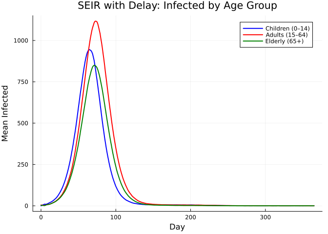
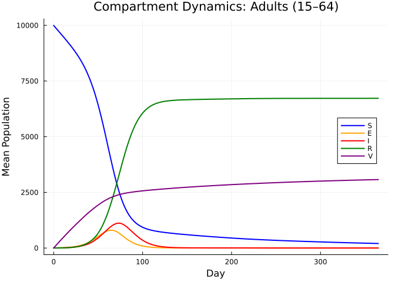
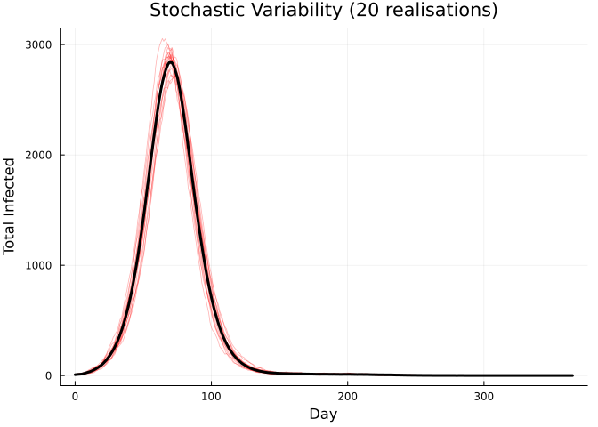
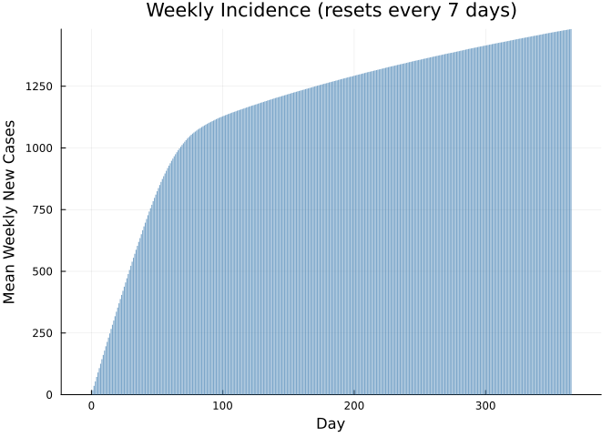
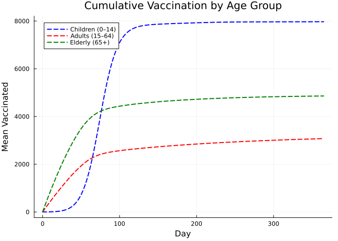
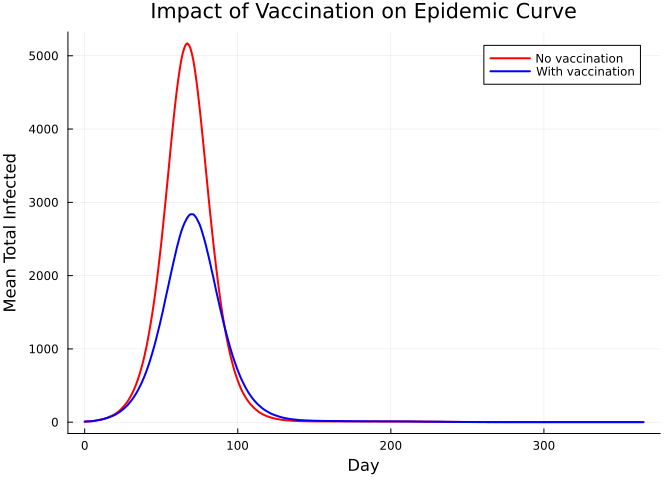

# SEIR with Delay and Vaccination


## Introduction

Many vector-borne and zoonotic diseases — yellow fever, Rift Valley
fever, Japanese encephalitis — feature a **fixed incubation period**
during which exposed individuals are not yet infectious, combined with
**vaccination campaigns** that reduce the susceptible pool over time.
Spillover from an animal reservoir introduces a **time-varying exogenous
force of infection** that can trigger outbreaks even in partially
vaccinated populations.

This vignette demonstrates how to combine several modelling techniques
in a single stochastic SEIR model:

| Feature | Odin construct |
|----|----|
| Age-structured compartments | `dim()`, array indexing `[i]` |
| Fixed incubation delay | Shift-register array with `update(E_delay[...])` |
| Time-varying spillover FOI | `interpolate()` with `:linear` mode |
| Vaccination | Binomial draw from remaining susceptibles |
| Weekly case counter | `zero_every = 7` |

The model is inspired by the
[YellowFeverDynamics](https://github.com/mrc-ide/YellowFeverDynamics)
package, which uses interleaved shift registers for age-structured delay
compartments.

## Model Description

### Compartments

For each of $a = 1, \ldots, N_\text{age}$ age groups:

- $S_a$ — Susceptible
- $E_a$ — Exposed (tracked via shift register)
- $I_a$ — Infectious
- $R_a$ — Recovered
- $V_a$ — Vaccinated (effectively immune)

### Shift-Register Delay

Rather than using an exponential or Erlang-distributed latent period, we
implement a **fixed delay** of `delay_days` time steps using a shift
register.

The register `E_delay` is a 1-D array of length
$N_\text{delay} = N_\text{age}
\times \text{delay\_days}$. Age groups are **interleaved**: positions
$1 \ldots
N_\text{age}$ hold the newest exposed cohort, positions
$N_\text{age}+1 \ldots
2 N_\text{age}$ hold the cohort from one step ago, and so on. Each step:

1.  New exposed individuals enter at positions $1:N_\text{age}$.
2.  All other entries shift forward by $N_\text{age}$:
    `E_delay[(N_age+1):N_delay] ← E_delay[i − N_age]`.
3.  The oldest cohort (positions $N_\text{delay} - N_\text{age} + 1$ to
    $N_\text{delay}$) exits and becomes infectious.

This produces an **exact** delay of `delay_days` time steps for every
individual, regardless of age group.

### Force of Infection

$$\lambda(t) = \beta \frac{\sum_a I_a}{N_\text{total}} + \text{FOI}_\text{spillover}(t)$$

where $\text{FOI}_\text{spillover}(t)$ is linearly interpolated from a
user-supplied schedule, representing zoonotic transmission that peaks
mid-simulation.

## Model Definition

``` julia
using Odin
using Plots
using Statistics
```

``` julia
seir_vacc = @odin begin
    # === Configuration ===
    N_age = parameter(3)
    N_delay = parameter(15)       # N_age × delay_days (3 × 5)
    di_exit = N_delay - N_age     # offset to oldest cohort in register

    # === Array dimensions ===
    dim(S) = N_age
    dim(E_delay) = N_delay
    dim(E_count) = N_age          # track total exposed per age group
    dim(I) = N_age
    dim(R) = N_age
    dim(V) = N_age
    dim(N_pop) = N_age
    dim(I0) = N_age
    dim(vacc_rate) = N_age
    dim(E_new) = N_age
    dim(I_new) = N_age
    dim(R_new) = N_age
    dim(n_vacc) = N_age

    # === Force of infection ===
    I_total = sum(I)
    N_total = sum(N_pop)
    FOI_sp = interpolate(sp_time, sp_value, :linear)
    foi = beta * I_total / N_total + FOI_sp
    p_inf = 1 - exp(-foi * dt)
    p_rec = 1 - exp(-gamma * dt)

    # === Stochastic transitions ===
    E_new[i] = Binomial(S[i], p_inf)
    I_new[i] = E_delay[i + di_exit]       # exit from oldest register slot
    R_new[i] = Binomial(I[i], p_rec)
    n_vacc[i] = Binomial(S[i] - E_new[i],
                          1 - exp(-vacc_rate[i] * vaccine_efficacy * dt))

    # === State updates ===
    update(S[i]) = S[i] - E_new[i] - n_vacc[i]

    # Shift register: new entries at front, shift by N_age each step
    update(E_delay[1:N_age]) = E_new[i]
    update(E_delay[(N_age + 1):N_delay]) = E_delay[i - N_age]

    update(E_count[i]) = E_count[i] + E_new[i] - I_new[i]
    update(I[i]) = I[i] + I_new[i] - R_new[i]
    update(R[i]) = R[i] + R_new[i]
    update(V[i]) = V[i] + n_vacc[i]

    # Weekly new infectious cases (resets every 7 days)
    initial(new_cases, zero_every = 7) = 0
    update(new_cases) = new_cases + sum(I_new)

    # === Initial conditions ===
    initial(S[i]) = N_pop[i] - I0[i]
    initial(E_delay[i]) = 0
    initial(E_count[i]) = 0
    initial(I[i]) = I0[i]
    initial(R[i]) = 0
    initial(V[i]) = 0

    # === Parameters ===
    beta = parameter(0.4286)          # R0 × gamma ≈ 3 × (1/7)
    gamma = parameter(0.1429)         # 1 / infectious period (7 days)
    vaccine_efficacy = parameter(0.9)
    N_pop = parameter()
    vacc_rate = parameter()
    I0 = parameter()
    sp_time = parameter(rank = 1)
    sp_value = parameter(rank = 1)
end
```

    DustSystemGenerator{var"##OdinModel#277"}(var"##OdinModel#277"(0, [:new_cases, :S, :E_delay, :E_count, :I, :R, :V], [:N_age, :N_delay, :beta, :gamma, :vaccine_efficacy, :N_pop, :vacc_rate, :I0, :sp_time, :sp_value], false, false, false, true))

**Key patterns in this model:**

- `dim(E_delay) = N_delay` allocates the shift register (15 positions
  for 3 age groups × 5 delay steps).
- `update(E_delay[1:N_age]) = E_new[i]` inserts newly exposed at the
  front.
- `update(E_delay[(N_age+1):N_delay]) = E_delay[i - N_age]` shifts
  everything forward by one age-block per time step.
- `I_new[i] = E_delay[i + di_exit]` reads the oldest cohort exiting the
  register.

## Parameter Setup

``` julia
pars = (
    N_age = 3.0,
    N_delay = 15.0,                        # 3 ages × 5 delay days
    beta = 3.0 / 7.0,                      # R0 = 3, infectious period = 7 days
    gamma = 1.0 / 7.0,
    vaccine_efficacy = 0.9,
    N_pop = [10000.0, 10000.0, 10000.0],   # children, adults, elderly
    vacc_rate = [0.005, 0.01, 0.002],      # age-dependent daily rates
    I0 = [5.0, 3.0, 2.0],                  # initial infections by age
    sp_time  = [0.0, 100.0, 150.0, 200.0, 250.0, 365.0],
    sp_value = [1e-4, 1e-4,  1e-3,  1e-3,  1e-4,  1e-4],
)
```

    (N_age = 3.0, N_delay = 15.0, beta = 0.42857142857142855, gamma = 0.14285714285714285, vaccine_efficacy = 0.9, N_pop = [10000.0, 10000.0, 10000.0], vacc_rate = [0.005, 0.01, 0.002], I0 = [5.0, 3.0, 2.0], sp_time = [0.0, 100.0, 150.0, 200.0, 250.0, 365.0], sp_value = [0.0001, 0.0001, 0.001, 0.001, 0.0001, 0.0001])

The spillover FOI ramps up between days 100–150, stays elevated until
day 200, then drops back — mimicking a seasonal peak in zoonotic
transmission.

## Simulation

We run 100 stochastic realisations over one year:

``` julia
n_particles = 100
times = collect(0.0:1.0:365.0)

result = dust_system_simulate(seir_vacc, pars;
    times = times, dt = 1.0, seed = 42, n_particles = n_particles)
println("Result shape: ", size(result), "  (states × particles × times)")
```

    Result shape: (31, 100, 366)  (states × particles × times)

    Expected 31 states

Define index helpers for readability:

``` julia
idx_S  = 1:3
idx_Ec = (3 + 15 + 1):(3 + 15 + 3)   # E_count
idx_I  = (3 + 15 + 3 + 1):(3 + 15 + 3 + 3)
idx_R  = (3 + 15 + 6 + 1):(3 + 15 + 6 + 3)
idx_V  = (3 + 15 + 9 + 1):(3 + 15 + 9 + 3)
idx_nc = 3 + 15 + 3 * 4 + 1           # new_cases

age_labels = ["Children (0–14)", "Adults (15–64)", "Elderly (65+)"]
age_colors = [:blue, :red, :green]
```

    3-element Vector{Symbol}:
     :blue
     :red
     :green

## Visualization

### Infected by Age Group

``` julia
p = plot(xlabel = "Day", ylabel = "Mean Infected",
         title = "SEIR with Delay: Infected by Age Group",
         legend = :topright)

for g in 1:3
    I_mean = vec(mean(result[idx_I[g], :, :], dims = 1))
    plot!(p, times, I_mean, label = age_labels[g],
          color = age_colors[g], lw = 2)
end
p
```



### All Compartments for Adults

``` julia
p = plot(xlabel = "Day", ylabel = "Mean Population",
         title = "Compartment Dynamics: Adults (15–64)",
         legend = :right)
plot!(p, times, vec(mean(result[idx_S[2], :, :], dims = 1)),
      label = "S", color = :blue, lw = 2)
plot!(p, times, vec(mean(result[idx_Ec[2], :, :], dims = 1)),
      label = "E", color = :orange, lw = 2)
plot!(p, times, vec(mean(result[idx_I[2], :, :], dims = 1)),
      label = "I", color = :red, lw = 2)
plot!(p, times, vec(mean(result[idx_R[2], :, :], dims = 1)),
      label = "R", color = :green, lw = 2)
plot!(p, times, vec(mean(result[idx_V[2], :, :], dims = 1)),
      label = "V", color = :purple, lw = 2)
p
```



### Stochastic Variability (20 realisations)

``` julia
p = plot(xlabel = "Day", ylabel = "Total Infected",
         title = "Stochastic Variability (20 realisations)", legend = false)
for i in 1:min(20, n_particles)
    I_tot = result[idx_I[1], i, :] + result[idx_I[2], i, :] + result[idx_I[3], i, :]
    plot!(p, times, I_tot, color = :red, alpha = 0.3, lw = 0.8)
end
I_tot_mean = vec(mean(sum(result[idx_I, :, :], dims = 1), dims = 2))
plot!(p, times, I_tot_mean, color = :black, lw = 3)
p
```



### Weekly New Cases

``` julia
nc_mean = vec(mean(result[idx_nc, :, :], dims = 1))
bar(times, nc_mean, xlabel = "Day", ylabel = "Mean Weekly New Cases",
    title = "Weekly Incidence (resets every 7 days)",
    label = "", color = :steelblue, alpha = 0.7, linewidth = 0)
```



### Vaccination Coverage Over Time

``` julia
p = plot(xlabel = "Day", ylabel = "Mean Vaccinated",
         title = "Cumulative Vaccination by Age Group",
         legend = :topleft)
for g in 1:3
    V_mean = vec(mean(result[idx_V[g], :, :], dims = 1))
    plot!(p, times, V_mean, label = age_labels[g],
          color = age_colors[g], lw = 2, ls = :dash)
end
p
```



## Comparison: With vs Without Vaccination

``` julia
pars_novacc = merge(pars, (vacc_rate = [0.0, 0.0, 0.0],))

result_novacc = dust_system_simulate(seir_vacc, pars_novacc;
    times = times, dt = 1.0, seed = 42, n_particles = n_particles)

I_vacc   = vec(mean(sum(result[idx_I, :, :], dims = 1), dims = 2))
I_novacc = vec(mean(sum(result_novacc[idx_I, :, :], dims = 1), dims = 2))

plot(times, I_novacc, label = "No vaccination", color = :red, lw = 2,
     xlabel = "Day", ylabel = "Mean Total Infected",
     title = "Impact of Vaccination on Epidemic Curve")
plot!(times, I_vacc, label = "With vaccination", color = :blue, lw = 2)
```



### Final Size Comparison

``` julia
println("Final attack rates (% of age-group population):")
println("=" ^ 55)
for g in 1:3
    R_vacc   = mean(result[idx_R[g], :, end])
    R_novacc = mean(result_novacc[idx_R[g], :, end])
    ar_vacc   = 100 * R_vacc / pars.N_pop[g]
    ar_novacc = 100 * R_novacc / pars.N_pop[g]
    reduction = ar_novacc > 0 ? 100 * (1 - ar_vacc / ar_novacc) : 0.0
    println("  $(age_labels[g]):")
    println("    No vaccination: $(round(ar_novacc, digits=1))%")
    println("    With vaccination: $(round(ar_vacc, digits=1))%")
    println("    Reduction: $(round(reduction, digits=1))%")
end
```

    Final attack rates (% of age-group population):
    =======================================================
      Children (0–14):
        No vaccination: 0.0%
        With vaccination: 0.0%
        Reduction: -122.2%
      Adults (15–64):
        No vaccination: 96.0%
        With vaccination: 67.2%
        Reduction: 29.9%
      Elderly (65+):
        No vaccination: 96.0%
        With vaccination: 51.0%
        Reduction: 46.8%

## Summary

This vignette demonstrated several key modelling patterns:

| Technique | Implementation |
|----|----|
| **Age structure** | `dim(X) = N_age` with `X[i]` indexing |
| **Fixed delay** | Shift register: `E_delay[1:N_age]` = new, `E_delay[(N_age+1):N_delay]` = shifted |
| **Spillover FOI** | `interpolate(sp_time, sp_value, :linear)` for time-varying zoonotic input |
| **Vaccination** | Sequential Binomial draws from remaining susceptibles |
| **Incidence tracking** | `initial(new_cases, zero_every = 7) = 0` for weekly resets |
| **Scenario comparison** | Re-run with `vacc_rate = [0, 0, 0]` to quantify vaccine impact |

The **shift-register delay** pattern is particularly useful when the
biological incubation period is well characterised (e.g. 3–6 days for
yellow fever) and you want individuals to progress through the latent
compartment in a fixed number of time steps rather than with exponential
or Erlang-distributed timing.
