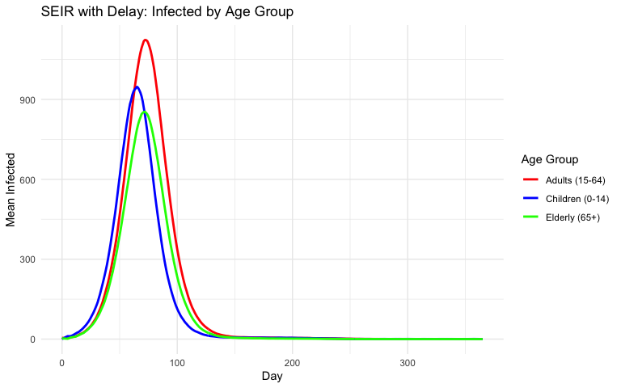
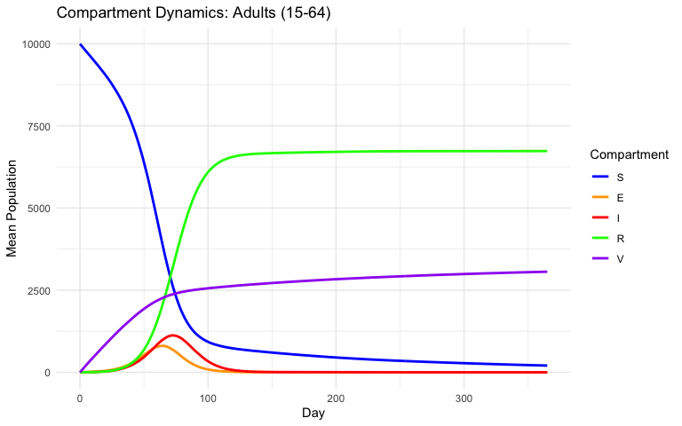
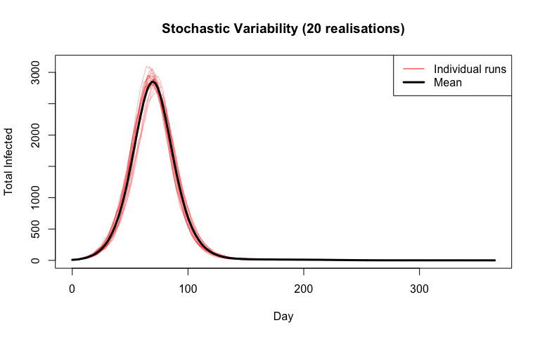
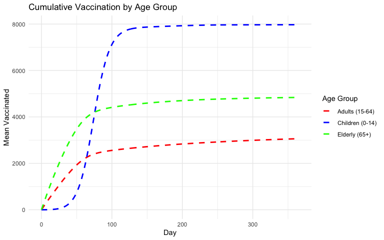
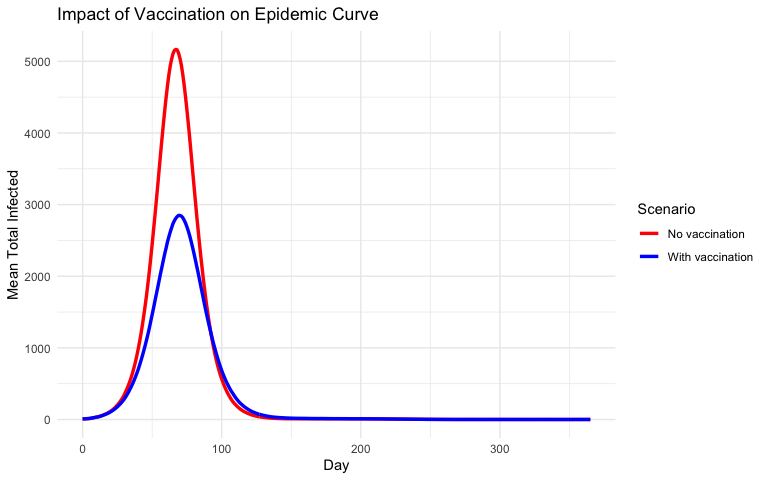

# SEIR with Delay and Vaccination


## Introduction

R companion to the Julia delay-and-vaccination vignette. We build an
age-structured stochastic SEIR model with a **shift-register delay** for
the latent period, **age-dependent vaccination**, and a **time-varying
spillover force of infection** — inspired by the
[YellowFeverDynamics](https://github.com/mrc-ide/YellowFeverDynamics)
package.

Key odin2 features demonstrated:

| Feature                | Construct                                  |
|------------------------|--------------------------------------------|
| Age-structured arrays  | `dim()`, `[]` / `[i]` indexing             |
| Fixed incubation delay | Shift register with `update(E_delay[...])` |
| Time-varying spillover | `interpolate(..., "linear")`               |
| Vaccination            | Binomial draws from remaining susceptibles |
| Weekly case counter    | `zero_every = 7`                           |

## Model Definition

``` r
library(odin2)
library(dust2)
library(ggplot2)
```

``` r
seir_vacc <- odin({
  # === Configuration ===
  N_age <- parameter(3)
  N_delay <- parameter(15)       # N_age * delay_days (3 * 5)
  di_exit <- N_delay - N_age     # offset to oldest cohort in register

  # === Array dimensions ===
  dim(S) <- N_age
  dim(E_delay) <- N_delay
  dim(E_count) <- N_age
  dim(I) <- N_age
  dim(R) <- N_age
  dim(V) <- N_age
  dim(N_pop) <- N_age
  dim(I0) <- N_age
  dim(vacc_rate) <- N_age
  dim(E_new) <- N_age
  dim(I_new) <- N_age
  dim(R_new) <- N_age
  dim(n_vacc) <- N_age

  # === Force of infection ===
  I_total <- sum(I)
  N_total <- sum(N_pop)
  FOI_sp <- interpolate(sp_time, sp_value, "linear")
  foi <- beta * I_total / N_total + FOI_sp
  p_inf <- 1 - exp(-foi * dt)
  p_rec <- 1 - exp(-gamma * dt)

  # === Stochastic transitions ===
  E_new[] <- Binomial(S[i], p_inf)
  I_new[] <- E_delay[as.integer(i + di_exit)]   # exit from oldest register slot
  R_new[] <- Binomial(I[i], p_rec)
  n_vacc[] <- Binomial(S[i] - E_new[i],
                        1 - exp(-vacc_rate[i] * vaccine_efficacy * dt))

  # === State updates ===
  update(S[]) <- S[i] - E_new[i] - n_vacc[i]

  # Shift register: new entries at front, shift by N_age each step
  update(E_delay[1:N_age]) <- E_new[i]
  update(E_delay[(N_age + 1):N_delay]) <- E_delay[i - N_age]

  update(E_count[]) <- E_count[i] + E_new[i] - I_new[i]
  update(I[]) <- I[i] + I_new[i] - R_new[i]
  update(R[]) <- R[i] + R_new[i]
  update(V[]) <- V[i] + n_vacc[i]

  # Weekly new infectious cases (resets every 7 days)
  initial(new_cases, zero_every = 7) <- 0
  update(new_cases) <- new_cases + sum(I_new)

  # === Initial conditions ===
  initial(S[]) <- N_pop[i] - I0[i]
  initial(E_delay[]) <- 0
  initial(E_count[]) <- 0
  initial(I[]) <- I0[i]
  initial(R[]) <- 0
  initial(V[]) <- 0

  # === Parameters ===
  beta <- parameter(0.4286)
  gamma <- parameter(0.1429)
  vaccine_efficacy <- parameter(0.9)
  N_pop[] <- parameter()
  vacc_rate[] <- parameter()
  I0[] <- parameter()
  sp_time[] <- parameter()
  sp_value[] <- parameter()
  dim(sp_time, sp_value) <- parameter(rank = 1)
})
```

    Warning in odin({: Found 5 compatibility issues
    Drop arrays from lhs of assignments from 'parameter()'
    ✖ N_pop[] <- parameter()
    ✔ N_pop <- parameter()
    ✖ vacc_rate[] <- parameter()
    ✔ vacc_rate <- parameter()
    ✖ I0[] <- parameter()
    ✔ I0 <- parameter()
    ✖ sp_time[] <- parameter()
    ✔ sp_time <- parameter()
    ✖ sp_value[] <- parameter()
    ✔ sp_value <- parameter()

    ✔ Wrote 'DESCRIPTION'

    ✔ Wrote 'NAMESPACE'

    ✔ Wrote 'R/dust.R'

    ✔ Wrote 'src/dust.cpp'

    ✔ Wrote 'src/Makevars'

    ℹ 12 functions decorated with [[cpp11::register]]

    ✔ generated file 'cpp11.R'

    ✔ generated file 'cpp11.cpp'

    ℹ Re-compiling odin.system180fc3af

    ── R CMD INSTALL ───────────────────────────────────────────────────────────────
    * installing *source* package ‘odin.system180fc3af’ ...
    ** this is package ‘odin.system180fc3af’ version ‘0.0.1’
    ** using staged installation
    ** libs
    using C++ compiler: ‘Homebrew clang version 21.1.5’
    using SDK: ‘MacOSX15.5.sdk’
    clang++ -arch arm64 -std=gnu++17 -I"/Library/Frameworks/R.framework/Resources/include" -DNDEBUG  -I'/Library/Frameworks/R.framework/Versions/4.5-arm64/Resources/library/cpp11/include' -I'/Library/Frameworks/R.framework/Versions/4.5-arm64/Resources/library/dust2/include' -I'/Library/Frameworks/R.framework/Versions/4.5-arm64/Resources/library/monty/include' -I/opt/R/arm64/include   -DHAVE_INLINE   -fPIC  -falign-functions=64 -Wall -g -O2  -Wall -pedantic  -c cpp11.cpp -o cpp11.o
    clang++ -arch arm64 -std=gnu++17 -I"/Library/Frameworks/R.framework/Resources/include" -DNDEBUG  -I'/Library/Frameworks/R.framework/Versions/4.5-arm64/Resources/library/cpp11/include' -I'/Library/Frameworks/R.framework/Versions/4.5-arm64/Resources/library/dust2/include' -I'/Library/Frameworks/R.framework/Versions/4.5-arm64/Resources/library/monty/include' -I/opt/R/arm64/include   -DHAVE_INLINE   -fPIC  -falign-functions=64 -Wall -g -O2  -Wall -pedantic  -c dust.cpp -o dust.o
    In file included from dust.cpp:212:
    In file included from /Library/Frameworks/R.framework/Versions/4.5-arm64/Resources/library/dust2/include/dust2/r/discrete/system.hpp:5:
    /Library/Frameworks/R.framework/Versions/4.5-arm64/Resources/library/monty/include/monty/r/random.hpp:60:43: warning: implicit conversion from 'type' (aka 'unsigned long') to 'double' changes value from 18446744073709551615 to 18446744073709551616 [-Wimplicit-const-int-float-conversion]
       60 |       std::ceil(std::abs(::unif_rand()) * std::numeric_limits<size_t>::max());
          |                                         ~ ^~~~~~~~~~~~~~~~~~~~~~~~~~~~~~~~~~
    /Library/Frameworks/R.framework/Versions/4.5-arm64/Resources/library/monty/include/monty/r/random.hpp:60:43: warning: implicit conversion from 'type' (aka 'unsigned long') to 'double' changes value from 18446744073709551615 to 18446744073709551616 [-Wimplicit-const-int-float-conversion]
       60 |       std::ceil(std::abs(::unif_rand()) * std::numeric_limits<size_t>::max());
          |                                         ~ ^~~~~~~~~~~~~~~~~~~~~~~~~~~~~~~~~~
    /Library/Frameworks/R.framework/Versions/4.5-arm64/Resources/library/dust2/include/dust2/r/discrete/system.hpp:41:33: note: in instantiation of function template specialization 'monty::random::r::as_rng_seed<monty::random::xoshiro_state<unsigned long long, 4, monty::random::scrambler::plus>>' requested here
       41 |   auto seed = monty::random::r::as_rng_seed<rng_state_type>(r_seed);
          |                                 ^
    dust.cpp:216:20: note: in instantiation of function template specialization 'dust2::r::dust2_discrete_alloc<odin_system>' requested here
      216 |   return dust2::r::dust2_discrete_alloc<odin_system>(r_pars, r_time, r_time_control, r_n_particles, r_n_groups, r_seed, r_deterministic, r_n_threads);
          |                    ^
    2 warnings generated.
    clang++ -arch arm64 -std=gnu++17 -dynamiclib -Wl,-headerpad_max_install_names -undefined dynamic_lookup -L/Library/Frameworks/R.framework/Resources/lib -L/opt/R/arm64/lib -o odin.system180fc3af.so cpp11.o dust.o -F/Library/Frameworks/R.framework/.. -framework R
    installing to /private/var/folders/yh/30rj513j6mn1n7x556c2v4w80000gn/T/Rtmp7zcApo/devtools_install_16c797b0b3486/00LOCK-dust_16c791eb2a541/00new/odin.system180fc3af/libs
    ** checking absolute paths in shared objects and dynamic libraries
    * DONE (odin.system180fc3af)

    ℹ Loading odin.system180fc3af

## Parameter Setup

``` r
pars <- list(
  N_age = 3,
  N_delay = 15,                        # 3 ages × 5 delay days
  beta = 3 / 7,                        # R0 = 3, infectious period = 7 days
  gamma = 1 / 7,
  vaccine_efficacy = 0.9,
  N_pop = c(10000, 10000, 10000),      # children, adults, elderly
  vacc_rate = c(0.005, 0.01, 0.002),   # age-dependent daily rates
  I0 = c(5, 3, 2),                     # initial infections by age
  sp_time  = c(0, 100, 150, 200, 250, 365),
  sp_value = c(1e-4, 1e-4, 1e-3, 1e-3, 1e-4, 1e-4)
)
```

## Simulation

Run 100 stochastic realisations over one year:

``` r
n_particles <- 100
times <- seq(0, 365, by = 1)

sys <- dust_system_create(seir_vacc, pars,
                          n_particles = n_particles, dt = 1, seed = 42)
dust_system_set_state_initial(sys)
result <- dust_system_simulate(sys, times)
cat("Result dimensions:", dim(result), "\n")
```

    Result dimensions: 31 100 366 

Define index helpers:

``` r
# State layout (follows update() order):
#   S[1:3]        → 1:3
#   E_delay[1:15] → 4:18
#   E_count[1:3]  → 19:21
#   I[1:3]        → 22:24
#   R[1:3]        → 25:27
#   V[1:3]        → 28:30
#   new_cases     → 31
idx_S  <- 1:3
idx_Ec <- 19:21
idx_I  <- 22:24
idx_R  <- 25:27
idx_V  <- 28:30
idx_nc <- 31

age_labels <- c("Children (0-14)", "Adults (15-64)", "Elderly (65+)")
age_colors <- c("blue", "red", "green")
```

## Visualization

### Infected by Age Group

``` r
df_I <- do.call(rbind, lapply(1:3, function(g) {
  data.frame(
    time = times,
    infected = colMeans(result[idx_I[g], , ]),
    age_group = age_labels[g]
  )
}))

ggplot(df_I, aes(x = time, y = infected, color = age_group)) +
  geom_line(linewidth = 1) +
  scale_color_manual(values = setNames(age_colors, age_labels)) +
  labs(x = "Day", y = "Mean Infected", color = "Age Group",
       title = "SEIR with Delay: Infected by Age Group") +
  theme_minimal()
```



### All Compartments for Adults

``` r
df_comp <- data.frame(
  time = rep(times, 5),
  count = c(
    colMeans(result[idx_S[2], , ]),
    colMeans(result[idx_Ec[2], , ]),
    colMeans(result[idx_I[2], , ]),
    colMeans(result[idx_R[2], , ]),
    colMeans(result[idx_V[2], , ])
  ),
  compartment = rep(c("S", "E", "I", "R", "V"), each = length(times))
)
df_comp$compartment <- factor(df_comp$compartment, levels = c("S", "E", "I", "R", "V"))

ggplot(df_comp, aes(x = time, y = count, color = compartment)) +
  geom_line(linewidth = 1) +
  scale_color_manual(values = c(S = "blue", E = "orange", I = "red",
                                R = "green", V = "purple")) +
  labs(x = "Day", y = "Mean Population", color = "Compartment",
       title = "Compartment Dynamics: Adults (15-64)") +
  theme_minimal()
```



### Stochastic Variability (20 realisations)

``` r
plot(NULL, xlim = c(0, 365), ylim = c(0, max(colSums(result[idx_I, , ]))),
     xlab = "Day", ylab = "Total Infected",
     main = "Stochastic Variability (20 realisations)")
for (i in 1:min(20, n_particles)) {
  I_tot <- result[idx_I[1], i, ] + result[idx_I[2], i, ] + result[idx_I[3], i, ]
  lines(times, I_tot, col = adjustcolor("red", alpha.f = 0.3))
}
I_tot_mean <- colMeans(result[idx_I[1], , ] + result[idx_I[2], , ] + result[idx_I[3], , ])
lines(times, I_tot_mean, col = "black", lwd = 3)
legend("topright", legend = c("Individual runs", "Mean"),
       col = c("red", "black"), lwd = c(1, 3))
```



### Vaccination Coverage Over Time

``` r
df_V <- do.call(rbind, lapply(1:3, function(g) {
  data.frame(
    time = times,
    vaccinated = colMeans(result[idx_V[g], , ]),
    age_group = age_labels[g]
  )
}))

ggplot(df_V, aes(x = time, y = vaccinated, color = age_group)) +
  geom_line(linewidth = 1, linetype = "dashed") +
  scale_color_manual(values = setNames(age_colors, age_labels)) +
  labs(x = "Day", y = "Mean Vaccinated", color = "Age Group",
       title = "Cumulative Vaccination by Age Group") +
  theme_minimal()
```



## Comparison: With vs Without Vaccination

``` r
pars_novacc <- pars
pars_novacc$vacc_rate <- c(0, 0, 0)

sys_nv <- dust_system_create(seir_vacc, pars_novacc,
                              n_particles = n_particles, dt = 1, seed = 42)
dust_system_set_state_initial(sys_nv)
result_nv <- dust_system_simulate(sys_nv, times)

I_vacc <- colMeans(result[idx_I[1], , ] + result[idx_I[2], , ] + result[idx_I[3], , ])
I_novacc <- colMeans(result_nv[idx_I[1], , ] + result_nv[idx_I[2], , ] + result_nv[idx_I[3], , ])

df_cmp <- data.frame(
  time = rep(times, 2),
  infected = c(I_novacc, I_vacc),
  scenario = rep(c("No vaccination", "With vaccination"), each = length(times))
)

ggplot(df_cmp, aes(x = time, y = infected, color = scenario)) +
  geom_line(linewidth = 1.2) +
  scale_color_manual(values = c("No vaccination" = "red",
                                "With vaccination" = "blue")) +
  labs(x = "Day", y = "Mean Total Infected", color = "Scenario",
       title = "Impact of Vaccination on Epidemic Curve") +
  theme_minimal()
```



### Final Size Comparison

``` r
cat("Final attack rates (% of age-group population):\n")
```

    Final attack rates (% of age-group population):

``` r
cat(strrep("=", 55), "\n")
```

    ======================================================= 

``` r
for (g in 1:3) {
  R_vacc   <- mean(result[idx_R[g], , length(times)])
  R_novacc <- mean(result_nv[idx_R[g], , length(times)])
  ar_vacc   <- 100 * R_vacc / pars$N_pop[g]
  ar_novacc <- 100 * R_novacc / pars$N_pop[g]
  reduction <- if (ar_novacc > 0) 100 * (1 - ar_vacc / ar_novacc) else 0
  cat(sprintf("  %s:\n    No vaccination: %.1f%%\n    With vaccination: %.1f%%\n    Reduction: %.1f%%\n",
              age_labels[g], ar_novacc, ar_vacc, reduction))
}
```

      Children (0-14):
        No vaccination: 0.0%
        With vaccination: 0.0%
        Reduction: 17.0%
      Adults (15-64):
        No vaccination: 96.0%
        With vaccination: 67.3%
        Reduction: 29.9%
      Elderly (65+):
        No vaccination: 96.0%
        With vaccination: 51.2%
        Reduction: 46.6%

## Summary

This vignette demonstrated the same SEIR model with delay and
vaccination as the Julia companion vignette, using odin2 and dust2. Key
R-specific syntax differences:

| Feature | R (odin2) | Julia (Odin.jl) |
|----|----|----|
| Assignment | `<-` | `=` |
| Array LHS | `E_new[]` | `E_new[i]` |
| Interpolation mode | `"linear"` (string) | `:linear` (symbol) |
| Computed index | `as.integer(i + di_exit)` | `i + di_exit` |
| Array parameter | `N_pop[] <- parameter()` | `N_pop = parameter()` |
| Interp. dim | `dim(sp_time, sp_value) <- parameter(rank = 1)` | `sp_time = parameter(rank = 1)` |

The **shift-register delay** pattern is widely used in odin models for
yellow fever, malaria (extrinsic incubation period), and other diseases
where the latent or incubation period is well-characterised and
approximately fixed.
