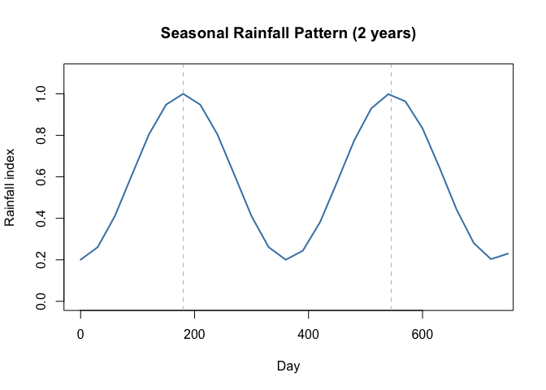
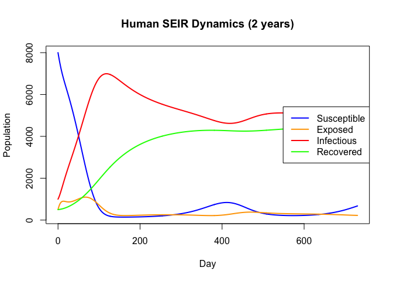
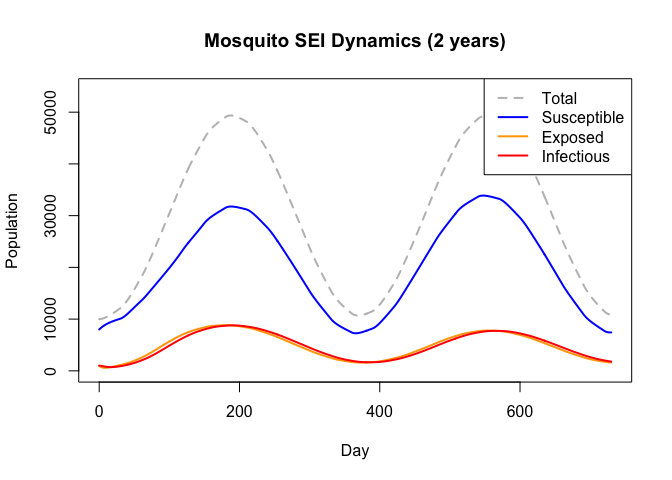
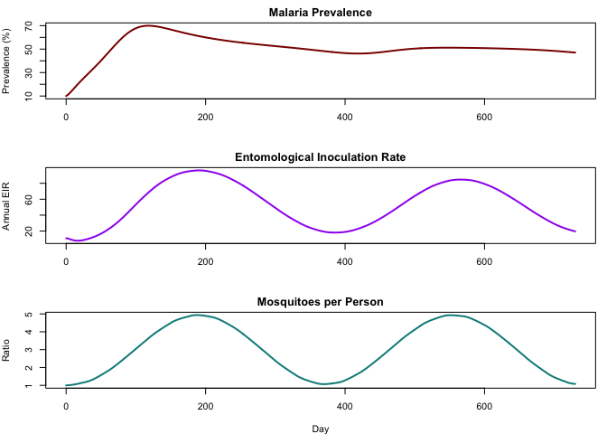
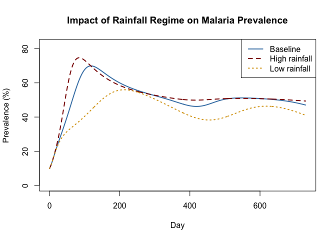
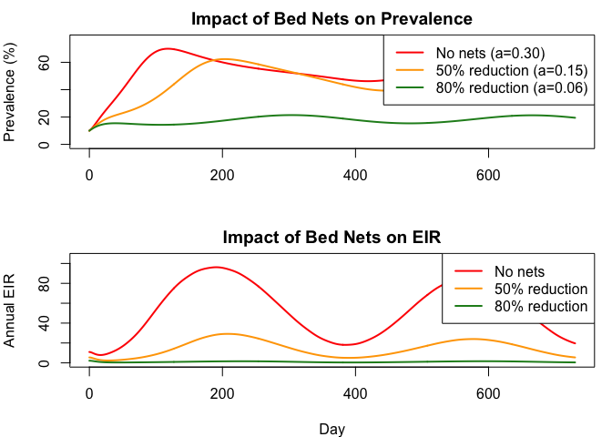

# Vector-Borne Disease Dynamics


## Introduction

Matching the Julia vignette: a simplified Ross-Macdonald malaria model
with coupled human (SEIR) and mosquito (SEI) dynamics, driven by
seasonal rainfall via interpolation.

``` r
library(odin2)
library(dust2)
```

## Model Definition

``` r
gen <- odin({
  # Human SEIR dynamics (with waning immunity)
  deriv(S_h) <- mu_h * N_h + omega_h * R_h - lambda_h * S_h - mu_h * S_h
  deriv(E_h) <- lambda_h * S_h - sigma_h * E_h - mu_h * E_h
  deriv(I_h) <- sigma_h * E_h - gamma_h * I_h - mu_h * I_h
  deriv(R_h) <- gamma_h * I_h - omega_h * R_h - mu_h * R_h

  # Mosquito SEI dynamics (no recovery)
  deriv(S_m) <- birth_m - lambda_m * S_m - mu_m * S_m
  deriv(E_m) <- lambda_m * S_m - sigma_m * E_m - mu_m * E_m
  deriv(I_m) <- sigma_m * E_m - mu_m * I_m

  # Bidirectional forces of infection
  lambda_h <- a * b * I_m / N_h
  lambda_m <- a * c * I_h / N_h

  # Mosquito population regulation via rainfall
  K_m <- K_m_base * rain
  birth_m <- mu_m * K_m
  rain <- interpolate(rain_t, rain_v, "linear")

  # Derived outputs
  output(prevalence) <- I_h / N_h
  output(EIR) <- a * I_m / N_h * 365
  output(mosquito_ratio) <- (S_m + E_m + I_m) / N_h

  # Initial conditions
  initial(S_h) <- N_h - E_h0 - I_h0 - R_h0
  initial(E_h) <- E_h0
  initial(I_h) <- I_h0
  initial(R_h) <- R_h0
  initial(S_m) <- S_m0
  initial(E_m) <- E_m0
  initial(I_m) <- I_m0

  # Human parameters
  N_h <- parameter(10000)
  mu_h <- parameter(3.91e-5)
  sigma_h <- parameter(0.0833)
  gamma_h <- parameter(0.005)
  omega_h <- parameter(0.00556)

  # Transmission parameters
  a <- parameter(0.3)
  b <- parameter(0.5)
  c <- parameter(0.3)

  # Mosquito parameters
  mu_m <- parameter(0.1)
  sigma_m <- parameter(0.1)
  K_m_base <- parameter(50000)

  # Initial condition parameters
  E_h0 <- parameter(500)
  I_h0 <- parameter(1000)
  R_h0 <- parameter(500)
  S_m0 <- parameter(8000)
  E_m0 <- parameter(1000)
  I_m0 <- parameter(1000)

  # Rainfall interpolation arrays
  rain_t[] <- parameter()
  rain_v[] <- parameter()
  dim(rain_t, rain_v) <- parameter(rank = 1)
})
```

    Warning in odin({: Found 2 compatibility issues
    Drop arrays from lhs of assignments from 'parameter()'
    ✖ rain_t[] <- parameter()
    ✔ rain_t <- parameter()
    ✖ rain_v[] <- parameter()
    ✔ rain_v <- parameter()

    ✔ Wrote 'DESCRIPTION'

    ✔ Wrote 'NAMESPACE'

    ✔ Wrote 'R/dust.R'

    ✔ Wrote 'src/dust.cpp'

    ✔ Wrote 'src/Makevars'

    ℹ 13 functions decorated with [[cpp11::register]]

    ✔ generated file 'cpp11.R'

    ✔ generated file 'cpp11.cpp'

    ℹ Re-compiling odin.systeme025517e

    ── R CMD INSTALL ───────────────────────────────────────────────────────────────
    * installing *source* package ‘odin.systeme025517e’ ...
    ** this is package ‘odin.systeme025517e’ version ‘0.0.1’
    ** using staged installation
    ** libs
    using C++ compiler: ‘Homebrew clang version 21.1.5’
    using SDK: ‘MacOSX15.5.sdk’
    clang++ -arch arm64 -std=gnu++17 -I"/Library/Frameworks/R.framework/Resources/include" -DNDEBUG  -I'/Library/Frameworks/R.framework/Versions/4.5-arm64/Resources/library/cpp11/include' -I'/Library/Frameworks/R.framework/Versions/4.5-arm64/Resources/library/dust2/include' -I'/Library/Frameworks/R.framework/Versions/4.5-arm64/Resources/library/monty/include' -I/opt/R/arm64/include   -DHAVE_INLINE   -fPIC  -falign-functions=64 -Wall -g -O2  -Wall -pedantic  -c cpp11.cpp -o cpp11.o
    clang++ -arch arm64 -std=gnu++17 -I"/Library/Frameworks/R.framework/Resources/include" -DNDEBUG  -I'/Library/Frameworks/R.framework/Versions/4.5-arm64/Resources/library/cpp11/include' -I'/Library/Frameworks/R.framework/Versions/4.5-arm64/Resources/library/dust2/include' -I'/Library/Frameworks/R.framework/Versions/4.5-arm64/Resources/library/monty/include' -I/opt/R/arm64/include   -DHAVE_INLINE   -fPIC  -falign-functions=64 -Wall -g -O2  -Wall -pedantic  -c dust.cpp -o dust.o
    In file included from dust.cpp:183:
    In file included from /Library/Frameworks/R.framework/Versions/4.5-arm64/Resources/library/dust2/include/dust2/r/continuous/system.hpp:4:
    /Library/Frameworks/R.framework/Versions/4.5-arm64/Resources/library/monty/include/monty/r/random.hpp:60:43: warning: implicit conversion from 'type' (aka 'unsigned long') to 'double' changes value from 18446744073709551615 to 18446744073709551616 [-Wimplicit-const-int-float-conversion]
       60 |       std::ceil(std::abs(::unif_rand()) * std::numeric_limits<size_t>::max());
          |                                         ~ ^~~~~~~~~~~~~~~~~~~~~~~~~~~~~~~~~~
    /Library/Frameworks/R.framework/Versions/4.5-arm64/Resources/library/monty/include/monty/r/random.hpp:60:43: warning: implicit conversion from 'type' (aka 'unsigned long') to 'double' changes value from 18446744073709551615 to 18446744073709551616 [-Wimplicit-const-int-float-conversion]
       60 |       std::ceil(std::abs(::unif_rand()) * std::numeric_limits<size_t>::max());
          |                                         ~ ^~~~~~~~~~~~~~~~~~~~~~~~~~~~~~~~~~
    /Library/Frameworks/R.framework/Versions/4.5-arm64/Resources/library/dust2/include/dust2/r/continuous/system.hpp:34:33: note: in instantiation of function template specialization 'monty::random::r::as_rng_seed<monty::random::xoshiro_state<unsigned long long, 4, monty::random::scrambler::plus>>' requested here
       34 |   auto seed = monty::random::r::as_rng_seed<rng_state_type>(r_seed);
          |                                 ^
    dust.cpp:187:20: note: in instantiation of function template specialization 'dust2::r::dust2_continuous_alloc<odin_system>' requested here
      187 |   return dust2::r::dust2_continuous_alloc<odin_system>(r_pars, r_time, r_time_control, r_n_particles, r_n_groups, r_seed, r_deterministic, r_n_threads);
          |                    ^
    2 warnings generated.
    clang++ -arch arm64 -std=gnu++17 -dynamiclib -Wl,-headerpad_max_install_names -undefined dynamic_lookup -L/Library/Frameworks/R.framework/Resources/lib -L/opt/R/arm64/lib -o odin.systeme025517e.so cpp11.o dust.o -F/Library/Frameworks/R.framework/.. -framework R
    installing to /private/var/folders/yh/30rj513j6mn1n7x556c2v4w80000gn/T/Rtmp5d9kf9/devtools_install_16e2124239452/00LOCK-dust_16e213c8379b1/00new/odin.systeme025517e/libs
    ** checking absolute paths in shared objects and dynamic libraries
    * DONE (odin.systeme025517e)

    ℹ Loading odin.systeme025517e

## Seasonal Rainfall

``` r
rain_t <- seq(0, 750, by = 30)
rain_v <- 0.6 + 0.4 * cos(2 * pi * (rain_t - 180) / 365)

plot(rain_t, rain_v, type = "l", lwd = 2, col = "steelblue",
     xlab = "Day", ylab = "Rainfall index",
     main = "Seasonal Rainfall Pattern (2 years)",
     xlim = c(0, 730), ylim = c(0, 1.1))
abline(v = c(180, 545), lty = 2, col = "gray")
```



## Simulation

``` r
pars <- list(
  N_h = 10000,
  mu_h = 1 / (70 * 365),
  sigma_h = 1 / 12,
  gamma_h = 1 / 200,
  omega_h = 1 / 180,
  a = 0.3,
  b = 0.5,
  c = 0.3,
  mu_m = 0.1,
  sigma_m = 0.1,
  K_m_base = 50000,
  E_h0 = 500,
  I_h0 = 1000,
  R_h0 = 500,
  S_m0 = 8000,
  E_m0 = 1000,
  I_m0 = 1000,
  rain_t = rain_t,
  rain_v = rain_v
)

sys <- System(gen, pars, ode_control = dust_ode_control())
dust_system_set_state_initial(sys)
times <- seq(0, 730, by = 1)
result <- simulate(sys, times)
```

### Human Dynamics

``` r
cols <- c("blue", "orange", "red", "green")
labels <- c("Susceptible", "Exposed", "Infectious", "Recovered")

plot(times, result[1, ], type = "l", lwd = 2, col = cols[1],
     xlab = "Day", ylab = "Population",
     main = "Human SEIR Dynamics (2 years)",
     ylim = range(result[1:4, ]))
for (i in 2:4) lines(times, result[i, ], lwd = 2, col = cols[i])
legend("right", legend = labels, col = cols, lwd = 2)
```



### Mosquito Dynamics

``` r
total_m <- result[5, ] + result[6, ] + result[7, ]

plot(times, total_m, type = "l", lwd = 2, col = "gray", lty = 2,
     xlab = "Day", ylab = "Population",
     main = "Mosquito SEI Dynamics (2 years)",
     ylim = c(0, max(total_m) * 1.1))
lines(times, result[5, ], lwd = 2, col = "blue")
lines(times, result[6, ], lwd = 2, col = "orange")
lines(times, result[7, ], lwd = 2, col = "red")
legend("topright",
       legend = c("Total", "Susceptible", "Exposed", "Infectious"),
       col = c("gray", "blue", "orange", "red"),
       lwd = 2, lty = c(2, 1, 1, 1))
```



## Derived Outputs

Output variables (rows 8–10) track prevalence, EIR, and
mosquito-to-human ratio:

``` r
par(mfrow = c(3, 1), mar = c(4, 4, 2, 1))

plot(times, result[8, ] * 100, type = "l", lwd = 2, col = "darkred",
     xlab = "", ylab = "Prevalence (%)", main = "Malaria Prevalence")

plot(times, result[9, ], type = "l", lwd = 2, col = "purple",
     xlab = "", ylab = "Annual EIR",
     main = "Entomological Inoculation Rate")

plot(times, result[10, ], type = "l", lwd = 2, col = "darkcyan",
     xlab = "Day", ylab = "Ratio",
     main = "Mosquitoes per Person")
```



``` r
par(mfrow = c(1, 1))
```

## Scenario Comparison: Rainfall Intensity

``` r
rain_high <- 0.7 + 0.3 * cos(2 * pi * (rain_t - 180) / 365)
rain_low  <- 0.3 + 0.15 * cos(2 * pi * (rain_t - 180) / 365)

pars_high <- modifyList(pars, list(K_m_base = 80000, rain_v = rain_high))
sys_h <- System(gen, pars_high, ode_control = dust_ode_control())
dust_system_set_state_initial(sys_h)
res_high <- simulate(sys_h, times)

pars_low <- modifyList(pars, list(K_m_base = 20000, rain_v = rain_low))
sys_l <- System(gen, pars_low, ode_control = dust_ode_control())
dust_system_set_state_initial(sys_l)
res_low <- simulate(sys_l, times)

ymax <- max(result[8, ], res_high[8, ], res_low[8, ]) * 100
plot(times, result[8, ] * 100, type = "l", lwd = 2, col = "steelblue",
     xlab = "Day", ylab = "Prevalence (%)",
     main = "Impact of Rainfall Regime on Malaria Prevalence",
     ylim = c(0, ymax * 1.1))
lines(times, res_high[8, ] * 100, lwd = 2, col = "darkred", lty = 2)
lines(times, res_low[8, ] * 100, lwd = 2, col = "goldenrod", lty = 3)
legend("topright", legend = c("Baseline", "High rainfall", "Low rainfall"),
       col = c("steelblue", "darkred", "goldenrod"), lwd = 2, lty = 1:3)
```



## Intervention: Bed Nets

Bed nets reduce the effective biting rate $a$. Since $a$ appears in both
directions of transmission, reductions have a large (quadratic) impact.

``` r
pars_net50 <- modifyList(pars, list(a = 0.15))
sys_n50 <- System(gen, pars_net50, ode_control = dust_ode_control())
dust_system_set_state_initial(sys_n50)
res_net50 <- simulate(sys_n50, times)

pars_net80 <- modifyList(pars, list(a = 0.06))
sys_n80 <- System(gen, pars_net80, ode_control = dust_ode_control())
dust_system_set_state_initial(sys_n80)
res_net80 <- simulate(sys_n80, times)

par(mfrow = c(2, 1), mar = c(4, 4, 2, 1))

ymax <- max(result[8, ], res_net50[8, ], res_net80[8, ]) * 100
plot(times, result[8, ] * 100, type = "l", lwd = 2, col = "red",
     xlab = "", ylab = "Prevalence (%)",
     main = "Impact of Bed Nets on Prevalence",
     ylim = c(0, ymax * 1.1))
lines(times, res_net50[8, ] * 100, lwd = 2, col = "orange")
lines(times, res_net80[8, ] * 100, lwd = 2, col = "forestgreen")
legend("topright",
       legend = c("No nets (a=0.30)", "50% reduction (a=0.15)",
                  "80% reduction (a=0.06)"),
       col = c("red", "orange", "forestgreen"), lwd = 2)

ymax <- max(result[9, ], res_net50[9, ], res_net80[9, ])
plot(times, result[9, ], type = "l", lwd = 2, col = "red",
     xlab = "Day", ylab = "Annual EIR",
     main = "Impact of Bed Nets on EIR",
     ylim = c(0, ymax * 1.1))
lines(times, res_net50[9, ], lwd = 2, col = "orange")
lines(times, res_net80[9, ], lwd = 2, col = "forestgreen")
legend("topright", legend = c("No nets", "50% reduction", "80% reduction"),
       col = c("red", "orange", "forestgreen"), lwd = 2)
```



``` r
par(mfrow = c(1, 1))
```

## Summary

| Feature | R Syntax | Julia Syntax |
|----|----|----|
| Coupled ODE | `deriv(S_h) <- ...` | `deriv(S_h) = ...` |
| Interpolation | `interpolate(t, v, "linear")` | `interpolate(t, v, :linear)` |
| Outputs | `output(prevalence) <- I_h / N_h` | `output(prevalence) = I_h / N_h` |
| Array params | `rain_t[] <- parameter()` | `rain_t = parameter(rank = 1)` |
| Dimensions | `dim(rain_t) <- parameter(rank = 1)` | *(implicit)* |

Both Julia and R produce equivalent results from the same Ross-Macdonald
model structure. The framework extends naturally to other vector-borne
diseases by adjusting compartments and transmission parameters.
