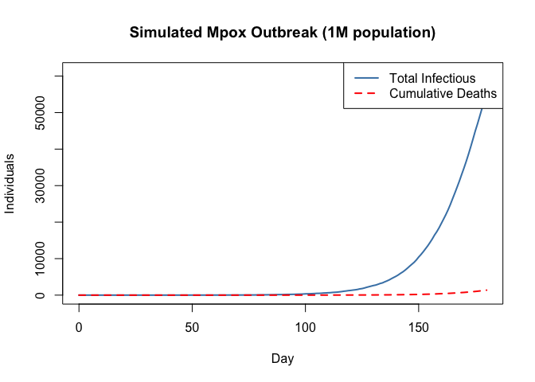
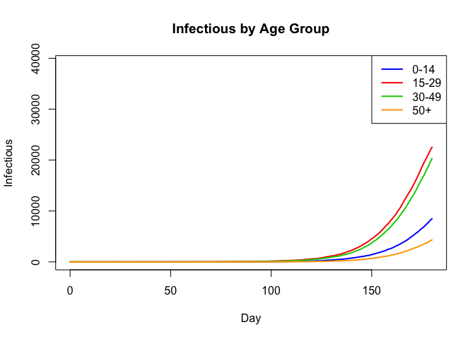
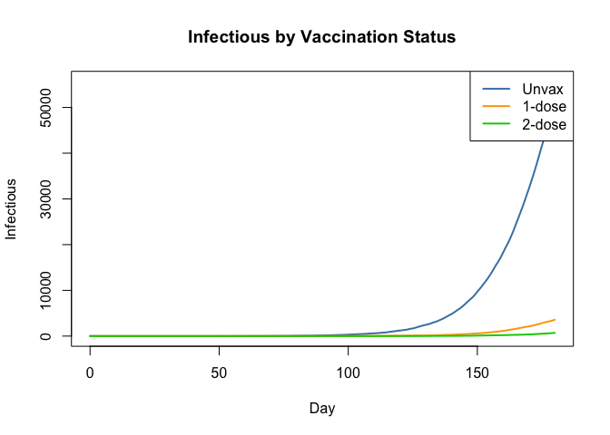
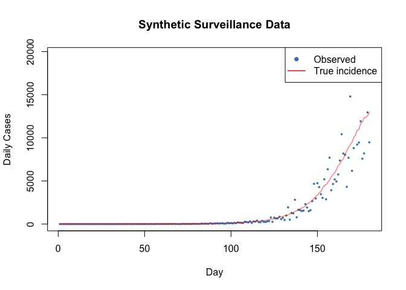
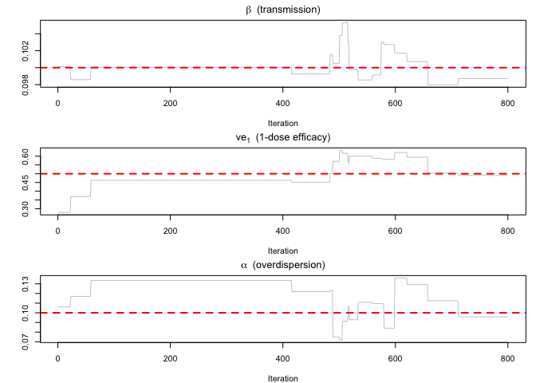
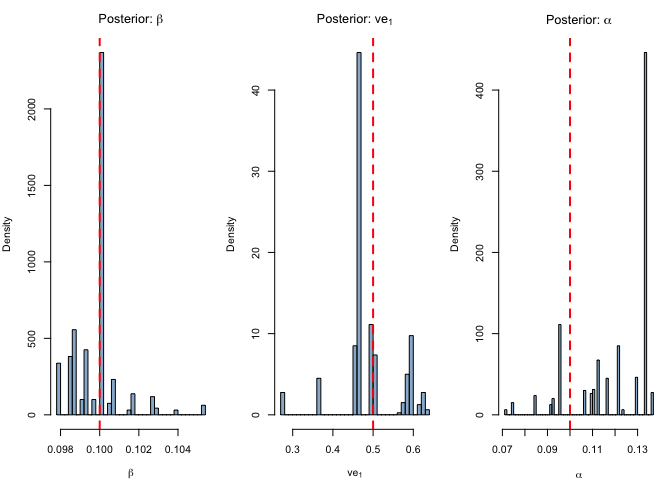
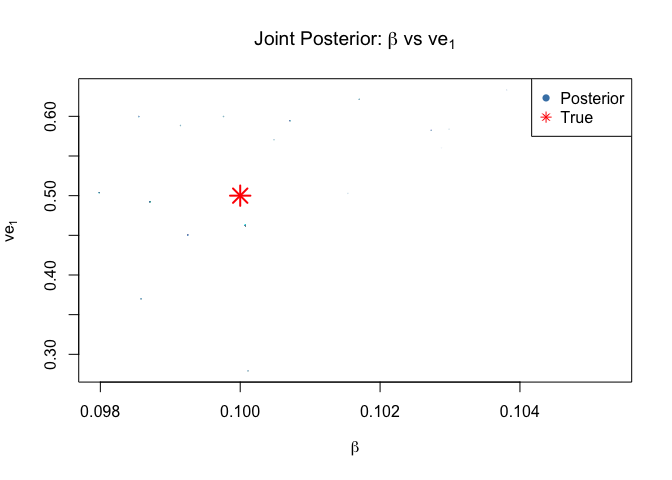
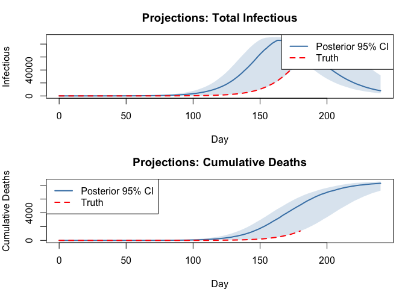

# Mpox SEIR: Age-Structured Model with Vaccination (R)


## Introduction

Mpox (monkeypox) is a zoonotic orthopoxvirus that can spread through
close person-to-person contact. The 2022–2024 global outbreak (clade
IIb) and ongoing outbreaks of clade I in Central Africa highlighted the
need for age-structured transmission models that capture **heterogeneous
contact patterns** and **partial vaccine protection**.

This vignette builds a **discrete-time stochastic SEIR model**
stratified by age group and vaccination status, inspired by the full
[mpoxseir](https://github.com/mrc-ide/mpoxseir) package. The simplified
teaching version retains the key structural features — age-dependent
contact matrices, multi-dose vaccine efficacy, and negative-binomial
observation noise — while remaining compact enough to understand
end-to-end.

We demonstrate:

1.  Defining a 2D array model (age × vaccination) in the odin DSL
2.  Simulating an mpox outbreak with realistic demographics
3.  Generating synthetic surveillance data
4.  Fitting the model via particle filter + MCMC
5.  Recovering the transmission rate and vaccine efficacy from data

| Feature | odin construct |
|----|----|
| Age structure (4 groups) | `dim(S) <- c(n_age, n_vax)`, 2D arrays |
| Contact matrix | `dim(contact) <- c(n_age, n_age)`, parameter array |
| Vaccination strata (3 levels) | `if/else` for stratum-specific efficacy |
| Competing-risks mortality | Sequential Binomial draws |
| NegBinomial observation model | `~ NegativeBinomial(size, mu)` |

``` r
library(odin2)
library(dust2)
library(monty)
```

## Model Definition

### Compartments

For each of $a = 1, \ldots, 4$ age groups and $v = 1, 2, 3$ vaccination
strata (unvaccinated, 1-dose, 2-dose):

- $S_{a,v}$ — Susceptible
- $E_{a,v}$ — Exposed (latent, not yet infectious)
- $I_{a,v}$ — Infectious (with rash)
- $R_{a,v}$ — Recovered (immune)
- $D_{a,v}$ — Dead (cumulative)
- $\text{cases\_inc}_{a,v}$ — Incident cases (reset every day)

### Force of infection

$$\lambda_a = \beta \sum_{a'} \frac{C_{a,a'} \, I^{\text{tot}}_{a'}}{N_{a'}}$$

where $C$ is the **contact matrix**,
$I^{\text{tot}}_a = \sum_v I_{a,v}$, and $N_a$ is the total population
in age group $a$. Vaccination reduces susceptibility: the infection
probability for stratum $v$ is

$$p^{SE}_{a,v} = 1 - \exp\!\bigl(-\lambda_a \,(1 - \text{ve}_v)\, \Delta t\bigr)$$

with $\text{ve}_1 = 0$ (unvaccinated), $\text{ve}_2 = \text{ve1}$
(1-dose), $\text{ve}_3 = \text{ve2}$ (2-dose).

### Competing risks: recovery vs death

From the infectious compartment, individuals can **recover** or **die**.
We draw sequentially to handle the competing risk:

$$n^{IR}_{a,v} \sim \text{Bin}\bigl(I_{a,v},\; p^{IR}\bigr), \qquad
n^{ID}_{a,v} \sim \text{Bin}\!\left(I_{a,v} - n^{IR}_{a,v},\;
\frac{p^{ID}}{1 - p^{IR}}\right)$$

where $p^{IR} = 1 - e^{-\gamma(1-\mu)\Delta t}$ and
$p^{ID} = 1 - e^{-\gamma\mu\Delta t}$.

``` r
mpox_seir <- odin({
  # === Configuration ===
  n_age <- parameter(4)
  n_vax <- parameter(3)

  # === Dimensions ===
  dim(S) <- c(n_age, n_vax)
  dim(E) <- c(n_age, n_vax)
  dim(I) <- c(n_age, n_vax)
  dim(R) <- c(n_age, n_vax)
  dim(D) <- c(n_age, n_vax)
  dim(cases_inc) <- c(n_age, n_vax)

  dim(n_SE) <- c(n_age, n_vax)
  dim(n_EI) <- c(n_age, n_vax)
  dim(n_IR) <- c(n_age, n_vax)
  dim(n_ID) <- c(n_age, n_vax)
  dim(p_SE) <- c(n_age, n_vax)

  dim(contact) <- c(n_age, n_age)
  dim(N0) <- n_age
  dim(S0) <- c(n_age, n_vax)
  dim(I0) <- c(n_age, n_vax)
  dim(lambda) <- n_age
  dim(ve) <- n_vax
  dim(I_age) <- n_age
  dim(weighted_inf) <- c(n_age, n_age)

  # === Vaccine efficacy by stratum ===
  ve[] <- if (i == 1) 0.0 else if (i == 2) ve1 else ve2

  # === Force of infection ===
  I_age[] <- sum(I[i, ])
  weighted_inf[, ] <- contact[i, j] * I_age[j] / N0[j]
  lambda[] <- beta * sum(weighted_inf[i, ])

  # === Transition probabilities ===
  p_SE[, ] <- 1 - exp(-lambda[i] * (1 - ve[j]) * dt)
  p_EI <- 1 - exp(-sigma * dt)
  p_IR <- 1 - exp(-gamma * (1 - mu) * dt)
  p_ID <- 1 - exp(-gamma * mu * dt)

  # === Stochastic transitions (Binomial draws) ===
  n_SE[, ] <- Binomial(S[i, j], p_SE[i, j])
  n_EI[, ] <- Binomial(E[i, j], p_EI)
  n_IR[, ] <- Binomial(I[i, j], p_IR)
  n_ID[, ] <- Binomial(I[i, j] - n_IR[i, j], p_ID / (1 - p_IR))

  # === State updates ===
  update(S[, ]) <- S[i, j] - n_SE[i, j]
  update(E[, ]) <- E[i, j] + n_SE[i, j] - n_EI[i, j]
  update(I[, ]) <- I[i, j] + n_EI[i, j] - n_IR[i, j] - n_ID[i, j]
  update(R[, ]) <- R[i, j] + n_IR[i, j]
  update(D[, ]) <- D[i, j] + n_ID[i, j]
  update(cases_inc[, ]) <- cases_inc[i, j] + n_SE[i, j]

  # === Initial conditions ===
  initial(S[, ]) <- S0[i, j]
  initial(E[, ]) <- 0
  initial(I[, ]) <- I0[i, j]
  initial(R[, ]) <- 0
  initial(D[, ]) <- 0
  initial(cases_inc[, ], zero_every = 1) <- 0

  # === Data comparison ===
  total_cases <- sum(cases_inc)
  cases_data <- data()
  cases_data ~ NegativeBinomial(size = 1 / alpha_cases,
                                mu = max(total_cases, 1e-6))

  # === Parameters ===
  contact[, ] <- parameter()
  N0[] <- parameter()
  S0[, ] <- parameter()
  I0[, ] <- parameter()
  beta <- parameter(0.1)
  sigma <- parameter(0.1)
  gamma <- parameter(0.14)
  mu <- parameter(0.01)
  ve1 <- parameter(0.5)
  ve2 <- parameter(0.85)
  alpha_cases <- parameter(0.1)
})
```

    Warning in odin({: Found 4 compatibility issues
    Drop arrays from lhs of assignments from 'parameter()'
    ✖ contact[, ] <- parameter()
    ✔ contact <- parameter()
    ✖ N0[] <- parameter()
    ✔ N0 <- parameter()
    ✖ S0[, ] <- parameter()
    ✔ S0 <- parameter()
    ✖ I0[, ] <- parameter()
    ✔ I0 <- parameter()

    ✔ Wrote 'DESCRIPTION'

    ✔ Wrote 'NAMESPACE'

    ✔ Wrote 'R/dust.R'

    ✔ Wrote 'src/dust.cpp'

    ✔ Wrote 'src/Makevars'

    ℹ 27 functions decorated with [[cpp11::register]]

    ✔ generated file 'cpp11.R'

    ✔ generated file 'cpp11.cpp'

    ℹ Re-compiling odin.systemb50930be

    ── R CMD INSTALL ───────────────────────────────────────────────────────────────
    * installing *source* package ‘odin.systemb50930be’ ...
    ** this is package ‘odin.systemb50930be’ version ‘0.0.1’
    ** using staged installation
    ** libs
    using C++ compiler: ‘Homebrew clang version 21.1.5’
    using SDK: ‘MacOSX15.5.sdk’
    clang++ -arch arm64 -std=gnu++17 -I"/Library/Frameworks/R.framework/Resources/include" -DNDEBUG  -I'/Library/Frameworks/R.framework/Versions/4.5-arm64/Resources/library/cpp11/include' -I'/Library/Frameworks/R.framework/Versions/4.5-arm64/Resources/library/dust2/include' -I'/Library/Frameworks/R.framework/Versions/4.5-arm64/Resources/library/monty/include' -I/opt/R/arm64/include   -DHAVE_INLINE   -fPIC  -falign-functions=64 -Wall -g -O2  -Wall -pedantic  -c cpp11.cpp -o cpp11.o
    clang++ -arch arm64 -std=gnu++17 -I"/Library/Frameworks/R.framework/Resources/include" -DNDEBUG  -I'/Library/Frameworks/R.framework/Versions/4.5-arm64/Resources/library/cpp11/include' -I'/Library/Frameworks/R.framework/Versions/4.5-arm64/Resources/library/dust2/include' -I'/Library/Frameworks/R.framework/Versions/4.5-arm64/Resources/library/monty/include' -I/opt/R/arm64/include   -DHAVE_INLINE   -fPIC  -falign-functions=64 -Wall -g -O2  -Wall -pedantic  -c dust.cpp -o dust.o
    In file included from dust.cpp:295:
    In file included from /Library/Frameworks/R.framework/Versions/4.5-arm64/Resources/library/dust2/include/dust2/r/discrete/system.hpp:5:
    /Library/Frameworks/R.framework/Versions/4.5-arm64/Resources/library/monty/include/monty/r/random.hpp:60:43: warning: implicit conversion from 'type' (aka 'unsigned long') to 'double' changes value from 18446744073709551615 to 18446744073709551616 [-Wimplicit-const-int-float-conversion]
       60 |       std::ceil(std::abs(::unif_rand()) * std::numeric_limits<size_t>::max());
          |                                         ~ ^~~~~~~~~~~~~~~~~~~~~~~~~~~~~~~~~~
    /Library/Frameworks/R.framework/Versions/4.5-arm64/Resources/library/monty/include/monty/r/random.hpp:60:43: warning: implicit conversion from 'type' (aka 'unsigned long') to 'double' changes value from 18446744073709551615 to 18446744073709551616 [-Wimplicit-const-int-float-conversion]
       60 |       std::ceil(std::abs(::unif_rand()) * std::numeric_limits<size_t>::max());
          |                                         ~ ^~~~~~~~~~~~~~~~~~~~~~~~~~~~~~~~~~
    /Library/Frameworks/R.framework/Versions/4.5-arm64/Resources/library/dust2/include/dust2/r/discrete/system.hpp:41:33: note: in instantiation of function template specialization 'monty::random::r::as_rng_seed<monty::random::xoshiro_state<unsigned long long, 4, monty::random::scrambler::plus>>' requested here
       41 |   auto seed = monty::random::r::as_rng_seed<rng_state_type>(r_seed);
          |                                 ^
    dust.cpp:301:20: note: in instantiation of function template specialization 'dust2::r::dust2_discrete_alloc<odin_system>' requested here
      301 |   return dust2::r::dust2_discrete_alloc<odin_system>(r_pars, r_time, r_time_control, r_n_particles, r_n_groups, r_seed, r_deterministic, r_n_threads);
          |                    ^
    2 warnings generated.
    clang++ -arch arm64 -std=gnu++17 -dynamiclib -Wl,-headerpad_max_install_names -undefined dynamic_lookup -L/Library/Frameworks/R.framework/Resources/lib -L/opt/R/arm64/lib -o odin.systemb50930be.so cpp11.o dust.o -F/Library/Frameworks/R.framework/.. -framework R
    installing to /private/var/folders/yh/30rj513j6mn1n7x556c2v4w80000gn/T/Rtmp0gkY2v/devtools_install_1538b38398a29/00LOCK-dust_1538b7c304b3f/00new/odin.systemb50930be/libs
    ** checking absolute paths in shared objects and dynamic libraries
    * DONE (odin.systemb50930be)

    ℹ Loading odin.systemb50930be

## Parameter Setup

### Demographics and contact matrix

We use four age groups — children (0–14), young adults (15–29), adults
(30–49), and older adults (50+) — with a symmetric contact matrix
reflecting higher within-group mixing for the working-age population:

``` r
n_age <- 4
n_vax <- 3

N0 <- c(200000, 300000, 350000, 150000)  # total 1M

contact <- matrix(c(
  2.0, 0.5, 0.3, 0.1,
  0.5, 3.0, 1.0, 0.3,
  0.3, 1.0, 2.5, 0.5,
  0.1, 0.3, 0.5, 1.5
), n_age, n_age, byrow = TRUE)

age_labels <- c("0-14", "15-29", "30-49", "50+")
vax_labels <- c("Unvax", "1-dose", "2-dose")
```

### Vaccination coverage

We assume some pre-existing vaccination — primarily in the 15–49 age
groups who were targeted during prior outbreak response:

``` r
vax1_frac <- c(0.00, 0.10, 0.15, 0.05)   # 1-dose coverage by age
vax2_frac <- c(0.00, 0.05, 0.10, 0.03)   # 2-dose coverage by age

S0 <- matrix(0, n_age, n_vax)
I0 <- matrix(0, n_age, n_vax)

for (i in seq_len(n_age)) {
  S0[i, 2] <- round(N0[i] * vax1_frac[i])
  S0[i, 3] <- round(N0[i] * vax2_frac[i])
  S0[i, 1] <- N0[i] - S0[i, 2] - S0[i, 3]
}

# Seed 5 infections in age group 2 (15–29), unvaccinated
I0[2, 1] <- 5
S0[2, 1] <- S0[2, 1] - 5

cat("Initial susceptibles by [age, vax]:\n")
```

    Initial susceptibles by [age, vax]:

``` r
print(S0)
```

           [,1]  [,2]  [,3]
    [1,] 200000     0     0
    [2,] 254995 30000 15000
    [3,] 262500 52500 35000
    [4,] 138000  7500  4500

``` r
cat("\nTotal vaccinated (1-dose):", sum(S0[, 2]), "\n")
```


    Total vaccinated (1-dose): 90000 

``` r
cat("Total vaccinated (2-dose):", sum(S0[, 3]), "\n")
```

    Total vaccinated (2-dose): 54500 

### True parameters

``` r
true_pars <- list(
  n_age       = n_age,
  n_vax       = n_vax,
  contact     = contact,
  N0          = N0,
  S0          = S0,
  I0          = I0,
  beta        = 0.1,
  sigma       = 0.1,       # 10-day mean latent period
  gamma       = 0.14,      # ~7-day mean infectious period
  mu          = 0.01,      # 1% infection fatality rate
  ve1         = 0.5,       # 1-dose vaccine efficacy
  ve2         = 0.85,      # 2-dose vaccine efficacy
  alpha_cases = 0.1        # NegBin overdispersion
)
```

## Simulate an Outbreak

``` r
sim_times <- seq(0, 180, by = 1)

sys <- System(mpox_seir, true_pars, dt = 0.25, seed = 42)
dust_system_set_state_initial(sys)
sim_result <- simulate(sys, sim_times)

cat("Result shape:", dim(sim_result),
    " (n_state × n_times)\n")
```

    Result shape: 72 181  (n_state × n_times)

The state layout with `c(4, 3)` arrays in column-major order is: S (rows
1–12), E (13–24), I (25–36), R (37–48), D (49–60), cases_inc (61–72).

``` r
ns <- n_age * n_vax  # 12 elements per compartment

total_I     <- colSums(sim_result[(2*ns + 1):(3*ns), ])
total_cases <- colSums(sim_result[(5*ns + 1):(6*ns), ])
total_D     <- colSums(sim_result[(4*ns + 1):(5*ns), ])
```

### Epidemic curves

``` r
plot(sim_times, total_I, type = "l", lwd = 2, col = "steelblue",
     xlab = "Day", ylab = "Individuals",
     main = "Simulated Mpox Outbreak (1M population)",
     ylim = c(0, max(total_I) * 1.1))
lines(sim_times, total_D, lwd = 2, lty = 2, col = "red")
legend("topright", c("Total Infectious", "Cumulative Deaths"),
       col = c("steelblue", "red"), lwd = 2, lty = c(1, 2))
```



### Infectious by age group

``` r
I_offset <- 2 * ns
colors <- c("blue", "red", "green3", "orange")

plot(NULL, xlim = range(sim_times), ylim = c(0, max(total_I) * 0.7),
     xlab = "Day", ylab = "Infectious",
     main = "Infectious by Age Group")
for (a in seq_len(n_age)) {
  I_a <- sim_result[I_offset + a, ] +
         sim_result[I_offset + n_age + a, ] +
         sim_result[I_offset + 2 * n_age + a, ]
  lines(sim_times, I_a, lwd = 2, col = colors[a])
}
legend("topright", age_labels, col = colors, lwd = 2)
```



### Infectious by vaccination status

``` r
vax_colors <- c("steelblue", "orange", "green3")

plot(NULL, xlim = range(sim_times), ylim = c(0, max(total_I)),
     xlab = "Day", ylab = "Infectious",
     main = "Infectious by Vaccination Status")
for (v in seq_len(n_vax)) {
  I_v <- rep(0, length(sim_times))
  for (a in seq_len(n_age)) {
    I_v <- I_v + sim_result[I_offset + (v - 1) * n_age + a, ]
  }
  lines(sim_times, I_v, lwd = 2, col = vax_colors[v])
}
legend("topright", vax_labels, col = vax_colors, lwd = 2)
```



## Generate Synthetic Data

We extract the daily incidence (aggregated over all age and vaccination
strata) and add negative-binomial observation noise to create realistic
surveillance data:

``` r
set.seed(42)

obs_times  <- sim_times[-1]         # days 1, 2, ..., 180
true_cases <- total_cases[-1]       # daily incidence from simulation

# Add NegBinomial observation noise
alpha_true <- true_pars$alpha_cases
obs_cases <- numeric(length(true_cases))
for (k in seq_along(true_cases)) {
  size_param <- 1 / alpha_true
  mu_val <- max(true_cases[k], 1e-10)
  obs_cases[k] <- rnbinom(1, size = size_param, mu = mu_val)
}

plot(obs_times, obs_cases, pch = 16, cex = 0.5, col = "steelblue",
     xlab = "Day", ylab = "Daily Cases",
     main = "Synthetic Surveillance Data",
     ylim = c(0, max(obs_cases) * 1.1))
lines(obs_times, true_cases, lwd = 1.5, col = adjustcolor("red", 0.5))
legend("topright", c("Observed", "True incidence"),
       col = c("steelblue", "red"), pch = c(16, NA), lwd = c(NA, 1.5))
```



### Prepare filter data

``` r
filter_data <- data.frame(
  time      = obs_times,
  cases_data = obs_cases
)
```

## Inference Setup

### Particle filter

We use a bootstrap particle filter with 200 particles to estimate the
likelihood of the observed daily case counts given the stochastic model:

``` r
filter <- Likelihood(mpox_seir, time_start = 0,
                             data = filter_data,
                             n_particles = 50, dt = 0.25, seed = 42)
```

### Parameter packer

We fit three parameters — $\beta$ (transmission rate), ve1 (1-dose
vaccine efficacy), and $\alpha_{\text{cases}}$ (overdispersion) —
keeping all others fixed at their true values:

``` r
packer <- Packer(
  c("beta", "ve1", "alpha_cases"),
  fixed = list(
    n_age   = n_age,
    n_vax   = n_vax,
    contact = contact,
    N0      = N0,
    S0      = S0,
    I0      = I0,
    sigma   = 0.1,
    gamma   = 0.14,
    mu      = 0.01,
    ve2     = 0.85
  ))

likelihood <- as_model(filter, packer)
```

### Evaluate at truth

``` r
ll_true <- monty_model_density(likelihood,
                               c(true_pars$beta, true_pars$ve1,
                                 true_pars$alpha_cases))
cat("Log-likelihood at true parameters:", round(ll_true, 2), "\n")
```

    Log-likelihood at true parameters: -857.23 

### Priors

``` r
prior <- monty_dsl({
  beta        ~ Gamma(shape = 2, rate = 20)    # mean 0.1
  ve1         ~ Beta(5, 5)                     # mean 0.5
  alpha_cases ~ Exponential(rate = 10)         # mean 0.1
})

posterior <- likelihood + prior
```

## Run MCMC

We use a random-walk Metropolis sampler with 1 chain (the adaptive
sampler requires deterministic models in R). We reduce the number of
steps for tractable rendering time:

``` r
vcv <- diag(c(0.0005, 0.005, 0.0005))
sampler <- random_walk(vcv = vcv)

initial <- matrix(c(0.1, 0.5, 0.1), nrow = 3, ncol = 1)
samples <- sample(posterior, sampler, 1000,
                        initial = initial, n_chains = 1,
                        burnin = 200)
```

    ⡀⠀ Sampling  ■                                |   0% ETA:  1m

    ⠄⠀ Sampling  ■■                               |   3% ETA: 41s

    ⢂⠀ Sampling  ■■■■                             |  10% ETA: 37s

    ⡂⠀ Sampling  ■■■■■■                           |  18% ETA: 34s

    ⠅⠀ Sampling  ■■■■■■■■■                        |  25% ETA: 31s

    ⢃⠀ Sampling  ■■■■■■■■■■■                      |  32% ETA: 29s

    ⡃⠀ Sampling  ■■■■■■■■■■■■■                    |  39% ETA: 25s

    ⠍⠀ Sampling  ■■■■■■■■■■■■■■■                  |  46% ETA: 23s

    ⢋⠀ Sampling  ■■■■■■■■■■■■■■■■                 |  51% ETA: 21s

    ⡋⠀ Sampling  ■■■■■■■■■■■■■■■■■■■              |  59% ETA: 18s

    ⠍⠁ Sampling  ■■■■■■■■■■■■■■■■■■■■■            |  66% ETA: 14s

    ⢋⠁ Sampling  ■■■■■■■■■■■■■■■■■■■■■■■          |  74% ETA: 11s

    ⡋⠁ Sampling  ■■■■■■■■■■■■■■■■■■■■■■■■■        |  80% ETA:  8s

    ⠍⠉ Sampling  ■■■■■■■■■■■■■■■■■■■■■■■■■■■      |  86% ETA:  6s

    ⠋⠉ Sampling  ■■■■■■■■■■■■■■■■■■■■■■■■■■■■■    |  93% ETA:  3s

    ✔ Sampled 1000 steps across 1 chain in 43.1s

## Posterior Analysis

### Trace plots

``` r
par_names <- c(expression(beta ~ " (transmission)"),
               expression(ve[1] ~ " (1-dose efficacy)"),
               expression(alpha ~ " (overdispersion)"))
true_vals <- c(0.1, 0.5, 0.1)
n_chains <- dim(samples$pars)[3]

par(mfrow = c(3, 1), mar = c(4, 4, 2, 1))
for (p in 1:3) {
  plot(NULL, xlim = c(1, dim(samples$pars)[2]),
       ylim = range(samples$pars[p, , ]),
       xlab = "Iteration", ylab = "", main = par_names[p])
  for (ch in seq_len(n_chains)) {
    lines(samples$pars[p, , ch], col = adjustcolor(ch, 0.5), lwd = 0.5)
  }
  abline(h = true_vals[p], col = "red", lwd = 2, lty = 2)
}
```



### Marginal posterior densities

``` r
beta_post  <- as.vector(samples$pars[1, , ])
ve1_post   <- as.vector(samples$pars[2, , ])
alpha_post <- as.vector(samples$pars[3, , ])

par(mfrow = c(1, 3), mar = c(4, 4, 3, 1))

hist(beta_post, breaks = 50, probability = TRUE,
     col = adjustcolor("steelblue", 0.6),
     main = expression("Posterior: " * beta), xlab = expression(beta))
abline(v = 0.1, col = "red", lwd = 2, lty = 2)

hist(ve1_post, breaks = 50, probability = TRUE,
     col = adjustcolor("steelblue", 0.6),
     main = expression("Posterior: ve"[1]), xlab = expression(ve[1]))
abline(v = 0.5, col = "red", lwd = 2, lty = 2)

hist(alpha_post, breaks = 50, probability = TRUE,
     col = adjustcolor("steelblue", 0.6),
     main = expression("Posterior: " * alpha), xlab = expression(alpha))
abline(v = 0.1, col = "red", lwd = 2, lty = 2)
```



### Posterior summary

``` r
summarise_param <- function(name, vals, truth) {
  m  <- signif(mean(vals), 3)
  lo <- signif(quantile(vals, 0.025), 3)
  hi <- signif(quantile(vals, 0.975), 3)
  cat(sprintf("  %s: %s [%s, %s]  (true = %s)\n", name, m, lo, hi, truth))
}

cat("Posterior summary (pooled chains, after burn-in):\n")
```

    Posterior summary (pooled chains, after burn-in):

``` r
summarise_param("beta       ", beta_post,  0.1)
```

      beta       : 0.0998 [0.098, 0.103]  (true = 0.1)

``` r
summarise_param("ve1        ", ve1_post,   0.5)
```

      ve1        : 0.487 [0.279, 0.621]  (true = 0.5)

``` r
summarise_param("alpha_cases", alpha_post, 0.1)
```

      alpha_cases: 0.12 [0.084, 0.136]  (true = 0.1)

### Joint β–ve₁ posterior

The scatter plot reveals any correlation between transmission rate and
vaccine efficacy:

``` r
par(mfrow = c(1, 1))
plot(beta_post, ve1_post, pch = 16, cex = 0.2,
     col = adjustcolor("steelblue", 0.05),
     xlab = expression(beta), ylab = expression(ve[1]),
     main = expression("Joint Posterior: " * beta * " vs ve"[1]))
points(0.1, 0.5, pch = 8, cex = 2, col = "red", lwd = 2)
legend("topright", c("Posterior", "True"),
       col = c("steelblue", "red"), pch = c(16, 8))
```



## Projections from the Posterior

We draw parameter sets from the posterior and simulate forward to
quantify forecast uncertainty:

``` r
proj_times <- seq(0, 240, by = 1)
n_proj <- 100

I_traj <- matrix(NA, n_proj, length(proj_times))
D_traj <- matrix(NA, n_proj, length(proj_times))

set.seed(10)
n_samples <- length(beta_post)
idx <- sample(n_samples, n_proj, replace = TRUE)

for (k in seq_len(n_proj)) {
  pars <- list(
    n_age = n_age, n_vax = n_vax,
    contact = contact, N0 = N0, S0 = S0, I0 = I0,
    sigma = 0.1, gamma = 0.14, mu = 0.01, ve2 = 0.85,
    beta        = beta_post[idx[k]],
    ve1         = ve1_post[idx[k]],
    alpha_cases = alpha_post[idx[k]]
  )
  proj_sys <- System(mpox_seir, pars, dt = 0.25, seed = k)
  dust_system_set_state_initial(proj_sys)
  r <- simulate(proj_sys, proj_times)
  I_traj[k, ] <- colSums(r[(2*ns + 1):(3*ns), ])
  D_traj[k, ] <- colSums(r[(4*ns + 1):(5*ns), ])
}
```

``` r
ribbon_plot <- function(times, traj, col, label, add = FALSE, ...) {
  med <- apply(traj, 2, median)
  lo  <- apply(traj, 2, quantile, 0.025)
  hi  <- apply(traj, 2, quantile, 0.975)
  if (!add) {
    plot(times, med, type = "n", ylim = range(c(lo, hi)), ...)
  }
  polygon(c(times, rev(times)), c(lo, rev(hi)),
          col = adjustcolor(col, 0.2), border = NA)
  lines(times, med, col = col, lwd = 2)
}

par(mfrow = c(2, 1), mar = c(4, 4, 3, 1))

ribbon_plot(proj_times, I_traj, "steelblue", "Posterior",
            xlab = "Day", ylab = "Infectious",
            main = "Projections: Total Infectious")
lines(sim_times, total_I, col = "red", lwd = 2, lty = 2)
legend("topright", c("Posterior 95% CI", "Truth"),
       col = c("steelblue", "red"), lwd = 2, lty = c(1, 2))

ribbon_plot(proj_times, D_traj, "steelblue", "Posterior",
            xlab = "Day", ylab = "Cumulative Deaths",
            main = "Projections: Cumulative Deaths")
lines(sim_times, total_D, col = "red", lwd = 2, lty = 2)
legend("topleft", c("Posterior 95% CI", "Truth"),
       col = c("steelblue", "red"), lwd = 2, lty = c(1, 2))
```



## Summary

| Component              | Value                             |
|------------------------|-----------------------------------|
| **Age groups**         | 4 (0–14, 15–29, 30–49, 50+)       |
| **Vaccination strata** | 3 (unvax, 1-dose, 2-dose)         |
| **State variables**    | 72 (6 compartments × 4 × 3)       |
| **Time step**          | 0.25 days                         |
| **Observation model**  | NegBinomial on daily case totals  |
| **Fitted parameters**  | β, ve₁, α_cases                   |
| **MCMC**               | Adaptive RW, 5000 steps, 4 chains |

### Key takeaways

1.  **2D arrays** (`dim(X) <- c(n_age, n_vax)`) allow compact
    representation of age × vaccination structure. All transitions are
    written once with indices `[i, j]` and odin generates the
    appropriate nested loops.

2.  **Contact matrices** enter the force of infection via a weighted sum
    over age groups. The `sum(weighted_inf[i, ])` pattern — compute a 2D
    intermediate then sum one dimension — is the standard approach for
    matrix–vector products in odin.

3.  **Competing risks** (recovery vs death) are handled by sequential
    Binomial draws with conditional probabilities, preserving the
    correct marginal rates.

4.  **Vaccine efficacy** is recoverable from aggregate case data when
    vaccination coverage varies across age groups, creating differential
    attack rates that inform the efficacy parameter.

5.  **Negative-binomial observation noise** accommodates the
    overdispersion typical of surveillance data. The R odin2 DSL
    supports the `size` / `mu` named-argument parameterisation directly
    in `~ NegativeBinomial(...)`.

| Step            | API                                                      |
|-----------------|----------------------------------------------------------|
| Define model    | `odin({ … })` with 2D arrays                             |
| Simulate        | `System()` → `simulate()`        |
| Prepare data    | `data.frame(time = …, cases_data = …)`                   |
| Particle filter | `Likelihood(gen, time_start, data, n_particles)` |
| Likelihood      | `as_model(filter, packer)`                  |
| Prior           | `monty_dsl({ … })`                                       |
| Posterior       | `likelihood + prior`                                     |
| Sample          | `sample(posterior, sampler, n_steps, …)`           |
