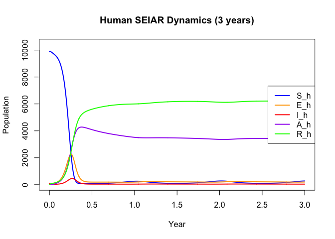
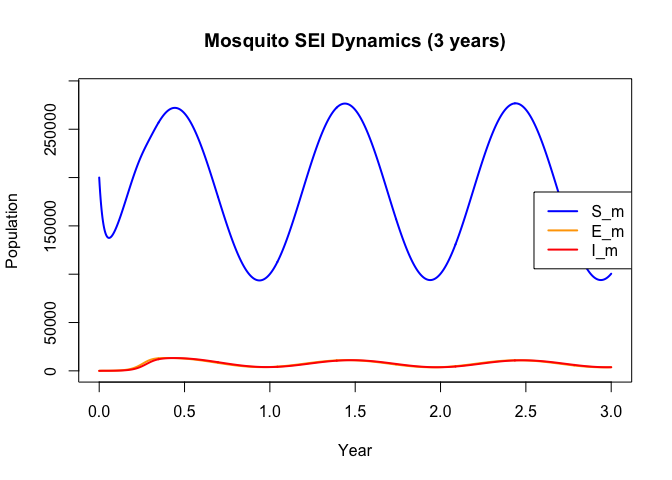
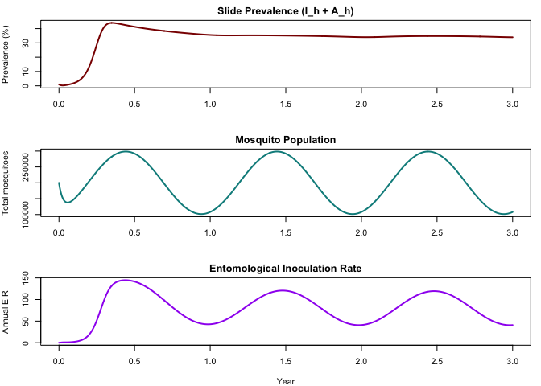
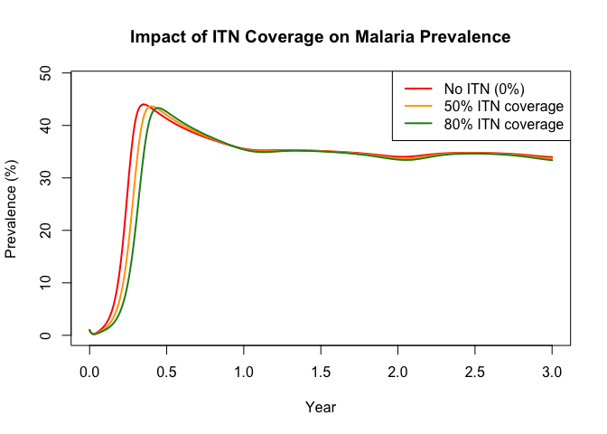
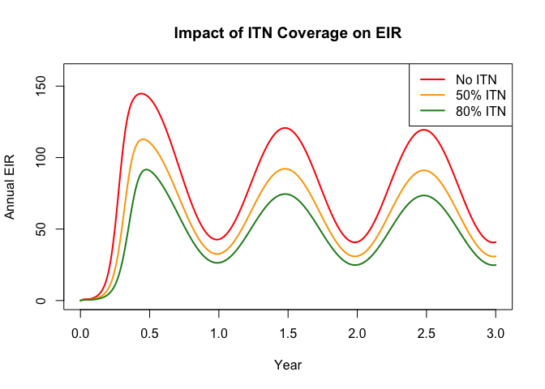
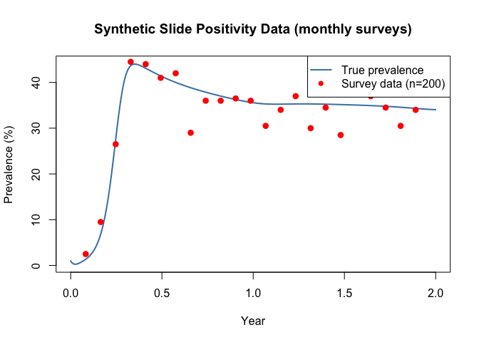
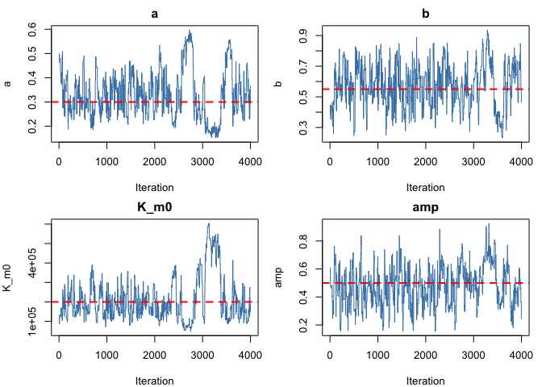
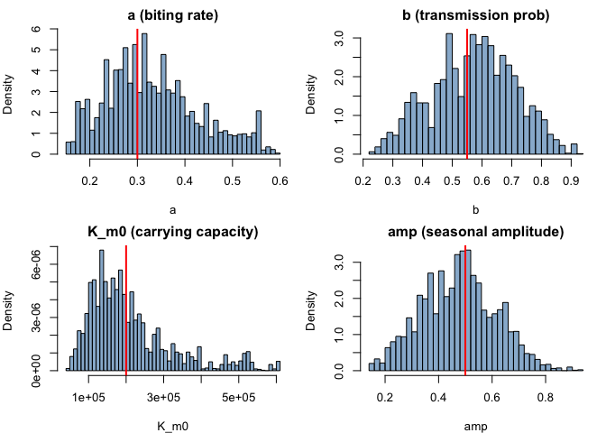
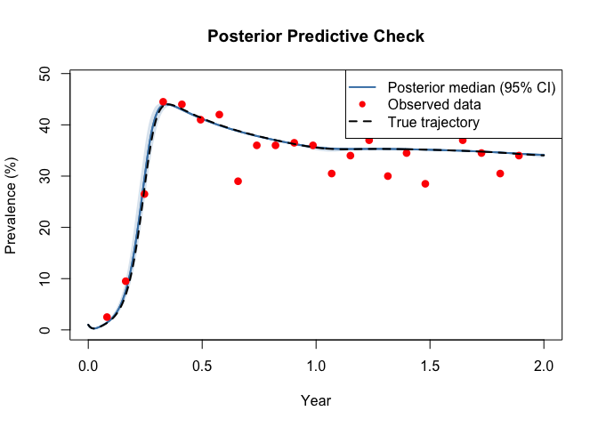
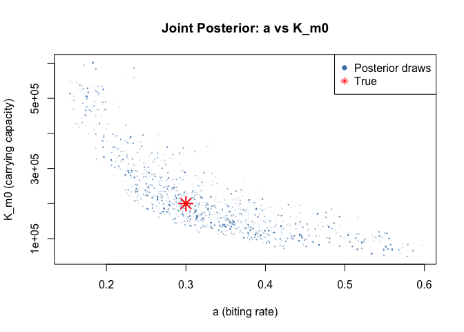

# Malaria Simple: Ross-Macdonald Model with Seasonal Forcing (R)


## Introduction

Malaria remains one of the world’s most important vector-borne diseases,
with roughly 250 million cases and 600,000 deaths annually. Transmission
depends on the interaction between human hosts and *Anopheles* mosquito
vectors, modulated by climate, immunity, and interventions.

The **Ross-Macdonald** framework captures these dynamics by coupling
human and mosquito compartmental models through bidirectional forces of
infection. This vignette builds a simplified teaching version — inspired
by the [malariasimple](https://github.com/mrc-ide/malariasimple) R
package — that demonstrates:

1.  A five-compartment human model (SEIAR) with asymptomatic carriage
    and waning immunity
2.  Mosquito SEI dynamics with **seasonal forcing** of carrying capacity
3.  Insecticide-treated net (ITN) intervention scenarios
4.  Synthetic slide-positivity data generation
5.  Bayesian inference using an ODE-based **unfilter** with adaptive
    MCMC

``` r
library(odin2)
library(dust2)
library(monty)
```

## Model Description

### Human compartments (SEIAR)

The human population passes through five states:

- **S_h** — Susceptible
- **E_h** — Exposed (liver-stage parasites, ~12 day latent period)
- **I_h** — Infectious / clinical malaria (blood-stage, symptomatic)
- **A_h** — Asymptomatic carriers (infectious at reduced level)
- **R_h** — Recovered with temporary immunity

$$\begin{aligned}
\frac{dS_h}{dt} &= \mu_h N_h + \omega R_h - \lambda_h S_h - \mu_h S_h \\
\frac{dE_h}{dt} &= \lambda_h S_h - \delta_h E_h - \mu_h E_h \\
\frac{dI_h}{dt} &= (1 - p_\text{asymp})\,\delta_h E_h - \gamma_h I_h - \mu_h I_h \\
\frac{dA_h}{dt} &= p_\text{asymp}\,\delta_h E_h + \rho R_h - \gamma_a A_h - \mu_h A_h \\
\frac{dR_h}{dt} &= \gamma_h I_h + \gamma_a A_h - \omega R_h - \rho R_h - \mu_h R_h
\end{aligned}$$

A fraction $p_\text{asymp}$ of infections are asymptomatic from the
outset. Recovered individuals lose immunity at rate $\omega$ (returning
to $S_h$) or relapse to asymptomatic carriage at rate $\rho$.

### Mosquito compartments (SEI)

Mosquitoes follow an SEI structure — they do not recover from infection:

$$\begin{aligned}
\frac{dS_m}{dt} &= \mu_m K_m(t) - \lambda_m S_m \cdot \text{itn} - \mu_m S_m \\
\frac{dE_m}{dt} &= \lambda_m S_m \cdot \text{itn} - \delta_m E_m - \mu_m E_m \\
\frac{dI_m}{dt} &= \delta_m E_m - \mu_m I_m
\end{aligned}$$

The carrying capacity $K_m(t)$ oscillates seasonally:

$$K_m(t) = K_{m,0}\bigl(1 + A \sin\bigl(2\pi(t - \phi)/365\bigr)\bigr)$$

ITN coverage reduces the effective biting rate:
$\text{itn\_effect} = 1 - \text{itn\_cov} \times \text{itn\_eff}$.

### Forces of infection

$$\lambda_h = a \cdot b \cdot I_m / N_h, \qquad
\lambda_m = a \cdot c \cdot (I_h + \varphi A_h) / N_h$$

where $a$ is the biting rate, $b$ and $c$ are transmission
probabilities, and $\varphi$ is the relative infectiousness of
asymptomatics.

## Model Definition

``` r
malaria <- odin({
  # Forces of infection
  lambda_h <- a * b * I_m / N_h
  lambda_m <- a * c * (I_h + phi * A_h) / N_h

  # Human dynamics
  deriv(S_h) <- -lambda_h * S_h + omega * R_h + mu_h * N_h - mu_h * S_h
  deriv(E_h) <- lambda_h * S_h - delta_h * E_h - mu_h * E_h
  deriv(I_h) <- delta_h * E_h * (1 - p_asymp) - gamma_h * I_h - mu_h * I_h
  deriv(A_h) <- delta_h * E_h * p_asymp + rho * R_h - gamma_a * A_h - mu_h * A_h
  deriv(R_h) <- gamma_h * I_h + gamma_a * A_h - omega * R_h - rho * R_h - mu_h * R_h

  # Seasonal mosquito dynamics
  K_m <- K_m0 * (1 + amp * sin(2 * pi * (time - phase) / 365))
  emergence <- mu_m * K_m
  itn_effect <- 1 - itn_cov * itn_eff

  deriv(S_m) <- emergence - lambda_m * S_m * itn_effect - mu_m * S_m
  deriv(E_m) <- lambda_m * S_m * itn_effect - delta_m * E_m - mu_m * E_m
  deriv(I_m) <- delta_m * E_m - mu_m * I_m

  # Derived outputs
  output(prevalence) <- (I_h + A_h) / N_h
  output(N_m) <- S_m + E_m + I_m
  output(EIR) <- a * I_m / N_h * 365

  # Initial conditions
  initial(S_h) <- N_h - I_h0
  initial(E_h) <- 0
  initial(I_h) <- I_h0
  initial(A_h) <- 0
  initial(R_h) <- 0
  initial(S_m) <- K_m0
  initial(E_m) <- 0
  initial(I_m) <- 0

  # Transmission parameters
  a <- parameter(0.3)           # biting rate (bites/mosquito/day)
  b <- parameter(0.55)          # prob transmission: mosquito -> human
  c <- parameter(0.15)          # prob transmission: human -> mosquito
  phi <- parameter(0.5)         # relative infectiousness of asymptomatics

  # Human rates
  delta_h <- parameter(0.0833)  # 1/12: liver-stage latent rate
  gamma_h <- parameter(0.2)     # 1/5: clinical recovery rate
  gamma_a <- parameter(0.005)   # 1/200: asymptomatic clearance rate
  omega <- parameter(0.00274)   # 1/365: immunity waning rate
  rho <- parameter(0.00137)     # 1/730: relapse rate (R -> A)
  p_asymp <- parameter(0.5)     # proportion asymptomatic
  mu_h <- parameter(5.48e-5)    # 1/(50*365): human birth/death rate

  # Mosquito parameters
  delta_m <- parameter(0.1)     # 1/10: sporogonic cycle rate
  mu_m <- parameter(0.1)        # 1/10: mosquito death rate
  K_m0 <- parameter(200000)     # baseline carrying capacity

  # Seasonal forcing
  amp <- parameter(0.5)         # seasonal amplitude
  phase <- parameter(60)        # phase shift (days)

  # ITN intervention
  itn_cov <- parameter(0.0)     # ITN coverage (0-1)
  itn_eff <- parameter(0.5)     # ITN efficacy (0-1)

  # Population and initial conditions
  N_h <- parameter(10000)
  I_h0 <- parameter(100)
})
```

    ✔ Wrote 'DESCRIPTION'

    ✔ Wrote 'NAMESPACE'

    ✔ Wrote 'R/dust.R'

    ✔ Wrote 'src/dust.cpp'

    ✔ Wrote 'src/Makevars'

    ℹ 13 functions decorated with [[cpp11::register]]

    ✔ generated file 'cpp11.R'

    ✔ generated file 'cpp11.cpp'

    ℹ Re-compiling odin.systemacdb6209

    ── R CMD INSTALL ───────────────────────────────────────────────────────────────
    * installing *source* package ‘odin.systemacdb6209’ ...
    ** this is package ‘odin.systemacdb6209’ version ‘0.0.1’
    ** using staged installation
    ** libs
    using C++ compiler: ‘Homebrew clang version 21.1.5’
    using SDK: ‘MacOSX15.5.sdk’
    clang++ -arch arm64 -std=gnu++17 -I"/Library/Frameworks/R.framework/Resources/include" -DNDEBUG  -I'/Library/Frameworks/R.framework/Versions/4.5-arm64/Resources/library/cpp11/include' -I'/Library/Frameworks/R.framework/Versions/4.5-arm64/Resources/library/dust2/include' -I'/Library/Frameworks/R.framework/Versions/4.5-arm64/Resources/library/monty/include' -I/opt/R/arm64/include   -DHAVE_INLINE   -fPIC  -falign-functions=64 -Wall -g -O2  -Wall -pedantic  -c cpp11.cpp -o cpp11.o
    clang++ -arch arm64 -std=gnu++17 -I"/Library/Frameworks/R.framework/Resources/include" -DNDEBUG  -I'/Library/Frameworks/R.framework/Versions/4.5-arm64/Resources/library/cpp11/include' -I'/Library/Frameworks/R.framework/Versions/4.5-arm64/Resources/library/dust2/include' -I'/Library/Frameworks/R.framework/Versions/4.5-arm64/Resources/library/monty/include' -I/opt/R/arm64/include   -DHAVE_INLINE   -fPIC  -falign-functions=64 -Wall -g -O2  -Wall -pedantic  -c dust.cpp -o dust.o
    In file included from dust.cpp:184:
    In file included from /Library/Frameworks/R.framework/Versions/4.5-arm64/Resources/library/dust2/include/dust2/r/continuous/system.hpp:4:
    /Library/Frameworks/R.framework/Versions/4.5-arm64/Resources/library/monty/include/monty/r/random.hpp:60:43: warning: implicit conversion from 'type' (aka 'unsigned long') to 'double' changes value from 18446744073709551615 to 18446744073709551616 [-Wimplicit-const-int-float-conversion]
       60 |       std::ceil(std::abs(::unif_rand()) * std::numeric_limits<size_t>::max());
          |                                         ~ ^~~~~~~~~~~~~~~~~~~~~~~~~~~~~~~~~~
    /Library/Frameworks/R.framework/Versions/4.5-arm64/Resources/library/monty/include/monty/r/random.hpp:60:43: warning: implicit conversion from 'type' (aka 'unsigned long') to 'double' changes value from 18446744073709551615 to 18446744073709551616 [-Wimplicit-const-int-float-conversion]
       60 |       std::ceil(std::abs(::unif_rand()) * std::numeric_limits<size_t>::max());
          |                                         ~ ^~~~~~~~~~~~~~~~~~~~~~~~~~~~~~~~~~
    /Library/Frameworks/R.framework/Versions/4.5-arm64/Resources/library/dust2/include/dust2/r/continuous/system.hpp:34:33: note: in instantiation of function template specialization 'monty::random::r::as_rng_seed<monty::random::xoshiro_state<unsigned long long, 4, monty::random::scrambler::plus>>' requested here
       34 |   auto seed = monty::random::r::as_rng_seed<rng_state_type>(r_seed);
          |                                 ^
    dust.cpp:188:20: note: in instantiation of function template specialization 'dust2::r::dust2_continuous_alloc<odin_system>' requested here
      188 |   return dust2::r::dust2_continuous_alloc<odin_system>(r_pars, r_time, r_time_control, r_n_particles, r_n_groups, r_seed, r_deterministic, r_n_threads);
          |                    ^
    2 warnings generated.
    clang++ -arch arm64 -std=gnu++17 -dynamiclib -Wl,-headerpad_max_install_names -undefined dynamic_lookup -L/Library/Frameworks/R.framework/Resources/lib -L/opt/R/arm64/lib -o odin.systemacdb6209.so cpp11.o dust.o -F/Library/Frameworks/R.framework/.. -framework R
    installing to /private/var/folders/yh/30rj513j6mn1n7x556c2v4w80000gn/T/Rtmpho7VGS/devtools_install_159e6b162b2b/00LOCK-dust_159e625da9bc7/00new/odin.systemacdb6209/libs
    ** checking absolute paths in shared objects and dynamic libraries
    * DONE (odin.systemacdb6209)

    ℹ Loading odin.systemacdb6209

## Simulation

### True parameters

We use a human population of 10,000 with a mosquito carrying capacity
20× larger ($K_{m,0} = 200{,}000$), reflecting a high-transmission
African setting.

``` r
true_pars <- list(
  a = 0.3,
  b = 0.55,
  c = 0.15,
  phi = 0.5,
  delta_h = 1 / 12,
  gamma_h = 1 / 5,
  gamma_a = 1 / 200,
  omega = 1 / 365,
  rho = 1 / 730,
  p_asymp = 0.5,
  mu_h = 1 / (50 * 365),
  delta_m = 1 / 10,
  mu_m = 1 / 10,
  K_m0 = 200000,
  amp = 0.5,
  phase = 60,
  itn_cov = 0.0,
  itn_eff = 0.5,
  N_h = 10000,
  I_h0 = 100
)
```

### Three-year baseline simulation

``` r
times <- seq(0, 1095, by = 1)  # 3 years
sys <- dust_system_create(malaria, true_pars, ode_control = dust_ode_control())
dust_system_set_state_initial(sys)
result <- dust_system_simulate(sys, times)
```

### Human dynamics

``` r
cols <- c("blue", "orange", "red", "purple", "green")
labels <- c("S_h", "E_h", "I_h", "A_h", "R_h")
ymax <- max(result[1:5, ])

plot(times / 365, result[1, ], type = "l", lwd = 2, col = cols[1],
     xlab = "Year", ylab = "Population",
     main = "Human SEIAR Dynamics (3 years)",
     ylim = c(0, ymax * 1.05))
for (i in 2:5) lines(times / 365, result[i, ], lwd = 2, col = cols[i])
legend("right", legend = labels, col = cols, lwd = 2)
```



### Mosquito dynamics and seasonality

``` r
plot(times / 365, result[6, ], type = "l", lwd = 2, col = "blue",
     xlab = "Year", ylab = "Population",
     main = "Mosquito SEI Dynamics (3 years)",
     ylim = c(0, max(result[6:8, ]) * 1.05))
lines(times / 365, result[7, ], lwd = 2, col = "orange")
lines(times / 365, result[8, ], lwd = 2, col = "red")
legend("right", legend = c("S_m", "E_m", "I_m"),
       col = c("blue", "orange", "red"), lwd = 2)
```



### Epidemiological indicators

``` r
par(mfrow = c(3, 1), mar = c(4, 4, 2, 1))

plot(times / 365, result[9, ] * 100, type = "l", lwd = 2, col = "darkred",
     xlab = "", ylab = "Prevalence (%)",
     main = "Slide Prevalence (I_h + A_h)")

plot(times / 365, result[10, ], type = "l", lwd = 2, col = "darkcyan",
     xlab = "", ylab = "Total mosquitoes",
     main = "Mosquito Population")

plot(times / 365, result[11, ], type = "l", lwd = 2, col = "purple",
     xlab = "Year", ylab = "Annual EIR",
     main = "Entomological Inoculation Rate")
```



``` r
par(mfrow = c(1, 1))
```

The seasonal forcing creates annual peaks in mosquito density, followed
by lagged peaks in prevalence and EIR. The system reaches a quasi-steady
seasonal cycle by year 2.

## ITN Intervention Scenarios

Insecticide-treated nets reduce the effective mosquito biting rate.
Because the biting rate $a$ appears in *both* forces of infection, ITN
interventions have a powerful, roughly quadratic effect on transmission.

``` r
pars_itn50 <- modifyList(true_pars, list(itn_cov = 0.5))
sys_itn50 <- dust_system_create(malaria, pars_itn50,
                                 ode_control = dust_ode_control())
dust_system_set_state_initial(sys_itn50)
res_itn50 <- dust_system_simulate(sys_itn50, times)

pars_itn80 <- modifyList(true_pars, list(itn_cov = 0.8))
sys_itn80 <- dust_system_create(malaria, pars_itn80,
                                 ode_control = dust_ode_control())
dust_system_set_state_initial(sys_itn80)
res_itn80 <- dust_system_simulate(sys_itn80, times)
```

``` r
ymax <- max(result[9, ], res_itn50[9, ], res_itn80[9, ]) * 100
plot(times / 365, result[9, ] * 100, type = "l", lwd = 2, col = "red",
     xlab = "Year", ylab = "Prevalence (%)",
     main = "Impact of ITN Coverage on Malaria Prevalence",
     ylim = c(0, ymax * 1.1))
lines(times / 365, res_itn50[9, ] * 100, lwd = 2, col = "orange")
lines(times / 365, res_itn80[9, ] * 100, lwd = 2, col = "forestgreen")
legend("topright",
       legend = c("No ITN (0%)", "50% ITN coverage", "80% ITN coverage"),
       col = c("red", "orange", "forestgreen"), lwd = 2)
```



``` r
ymax <- max(result[11, ], res_itn50[11, ], res_itn80[11, ])
plot(times / 365, result[11, ], type = "l", lwd = 2, col = "red",
     xlab = "Year", ylab = "Annual EIR",
     main = "Impact of ITN Coverage on EIR",
     ylim = c(0, ymax * 1.1))
lines(times / 365, res_itn50[11, ], lwd = 2, col = "orange")
lines(times / 365, res_itn80[11, ], lwd = 2, col = "forestgreen")
legend("topright",
       legend = c("No ITN", "50% ITN", "80% ITN"),
       col = c("red", "orange", "forestgreen"), lwd = 2)
```



Even 50% ITN coverage substantially reduces prevalence and EIR, while
80% coverage nearly interrupts transmission.

## Synthetic Data: Slide Positivity Surveys

We generate monthly cross-sectional survey data — a common malaria
surveillance method where a fixed number of individuals are tested by
microscopy (blood slide) and the number positive is recorded.

### Model with data comparison

We define a version of the model with a Binomial comparison for slide
positivity. The prevalence is clamped to (0, 1) to ensure numerical
stability.

``` r
malaria_fit <- odin({
  # Forces of infection
  lambda_h <- a * b * I_m / N_h
  lambda_m <- a * c * (I_h + phi * A_h) / N_h

  # Human dynamics
  deriv(S_h) <- -lambda_h * S_h + omega * R_h + mu_h * N_h - mu_h * S_h
  deriv(E_h) <- lambda_h * S_h - delta_h * E_h - mu_h * E_h
  deriv(I_h) <- delta_h * E_h * (1 - p_asymp) - gamma_h * I_h - mu_h * I_h
  deriv(A_h) <- delta_h * E_h * p_asymp + rho * R_h - gamma_a * A_h - mu_h * A_h
  deriv(R_h) <- gamma_h * I_h + gamma_a * A_h - omega * R_h - rho * R_h - mu_h * R_h

  # Seasonal mosquito dynamics
  K_m <- K_m0 * (1 + amp * sin(2 * pi * (time - phase) / 365))
  emergence <- mu_m * K_m
  itn_effect <- 1 - itn_cov * itn_eff

  deriv(S_m) <- emergence - lambda_m * S_m * itn_effect - mu_m * S_m
  deriv(E_m) <- lambda_m * S_m * itn_effect - delta_m * E_m - mu_m * E_m
  deriv(I_m) <- delta_m * E_m - mu_m * I_m

  # Prevalence clamped to (0, 1) for Binomial likelihood
  prev_model <- min(max((I_h + A_h) / N_h, 1e-10), 1 - 1e-10)

  # Data comparison: slide positivity from monthly surveys
  slide_positive <- data()
  n_tested <- data()
  slide_positive ~ Binomial(n_tested, prev_model)

  # Initial conditions
  initial(S_h) <- N_h - I_h0
  initial(E_h) <- 0
  initial(I_h) <- I_h0
  initial(A_h) <- 0
  initial(R_h) <- 0
  initial(S_m) <- K_m0
  initial(E_m) <- 0
  initial(I_m) <- 0

  # Parameters (same as simulation model)
  a <- parameter(0.3)
  b <- parameter(0.55)
  c <- parameter(0.15)
  phi <- parameter(0.5)
  delta_h <- parameter(0.0833)
  gamma_h <- parameter(0.2)
  gamma_a <- parameter(0.005)
  omega <- parameter(0.00274)
  rho <- parameter(0.00137)
  p_asymp <- parameter(0.5)
  mu_h <- parameter(5.48e-5)
  delta_m <- parameter(0.1)
  mu_m <- parameter(0.1)
  K_m0 <- parameter(200000)
  amp <- parameter(0.5)
  phase <- parameter(60)
  itn_cov <- parameter(0.0)
  itn_eff <- parameter(0.5)
  N_h <- parameter(10000)
  I_h0 <- parameter(100)
})
```

    ✔ Wrote 'DESCRIPTION'

    ✔ Wrote 'NAMESPACE'

    ✔ Wrote 'R/dust.R'

    ✔ Wrote 'src/dust.cpp'

    ✔ Wrote 'src/Makevars'

    ℹ 28 functions decorated with [[cpp11::register]]

    ✔ generated file 'cpp11.R'

    ✔ generated file 'cpp11.cpp'

    ℹ Re-compiling odin.system058b6980

    ── R CMD INSTALL ───────────────────────────────────────────────────────────────
    * installing *source* package ‘odin.system058b6980’ ...
    ** this is package ‘odin.system058b6980’ version ‘0.0.1’
    ** using staged installation
    ** libs
    using C++ compiler: ‘Homebrew clang version 21.1.5’
    using SDK: ‘MacOSX15.5.sdk’
    clang++ -arch arm64 -std=gnu++17 -I"/Library/Frameworks/R.framework/Resources/include" -DNDEBUG  -I'/Library/Frameworks/R.framework/Versions/4.5-arm64/Resources/library/cpp11/include' -I'/Library/Frameworks/R.framework/Versions/4.5-arm64/Resources/library/dust2/include' -I'/Library/Frameworks/R.framework/Versions/4.5-arm64/Resources/library/monty/include' -I/opt/R/arm64/include   -DHAVE_INLINE   -fPIC  -falign-functions=64 -Wall -g -O2  -Wall -pedantic  -c cpp11.cpp -o cpp11.o
    clang++ -arch arm64 -std=gnu++17 -I"/Library/Frameworks/R.framework/Resources/include" -DNDEBUG  -I'/Library/Frameworks/R.framework/Versions/4.5-arm64/Resources/library/cpp11/include' -I'/Library/Frameworks/R.framework/Versions/4.5-arm64/Resources/library/dust2/include' -I'/Library/Frameworks/R.framework/Versions/4.5-arm64/Resources/library/monty/include' -I/opt/R/arm64/include   -DHAVE_INLINE   -fPIC  -falign-functions=64 -Wall -g -O2  -Wall -pedantic  -c dust.cpp -o dust.o
    In file included from dust.cpp:183:
    In file included from /Library/Frameworks/R.framework/Versions/4.5-arm64/Resources/library/dust2/include/dust2/r/continuous/system.hpp:4:
    /Library/Frameworks/R.framework/Versions/4.5-arm64/Resources/library/monty/include/monty/r/random.hpp:60:43: warning: implicit conversion from 'type' (aka 'unsigned long') to 'double' changes value from 18446744073709551615 to 18446744073709551616 [-Wimplicit-const-int-float-conversion]
       60 |       std::ceil(std::abs(::unif_rand()) * std::numeric_limits<size_t>::max());
          |                                         ~ ^~~~~~~~~~~~~~~~~~~~~~~~~~~~~~~~~~
    /Library/Frameworks/R.framework/Versions/4.5-arm64/Resources/library/monty/include/monty/r/random.hpp:60:43: warning: implicit conversion from 'type' (aka 'unsigned long') to 'double' changes value from 18446744073709551615 to 18446744073709551616 [-Wimplicit-const-int-float-conversion]
       60 |       std::ceil(std::abs(::unif_rand()) * std::numeric_limits<size_t>::max());
          |                                         ~ ^~~~~~~~~~~~~~~~~~~~~~~~~~~~~~~~~~
    /Library/Frameworks/R.framework/Versions/4.5-arm64/Resources/library/dust2/include/dust2/r/continuous/system.hpp:34:33: note: in instantiation of function template specialization 'monty::random::r::as_rng_seed<monty::random::xoshiro_state<unsigned long long, 4, monty::random::scrambler::plus>>' requested here
       34 |   auto seed = monty::random::r::as_rng_seed<rng_state_type>(r_seed);
          |                                 ^
    dust.cpp:189:20: note: in instantiation of function template specialization 'dust2::r::dust2_continuous_alloc<odin_system>' requested here
      189 |   return dust2::r::dust2_continuous_alloc<odin_system>(r_pars, r_time, r_time_control, r_n_particles, r_n_groups, r_seed, r_deterministic, r_n_threads);
          |                    ^
    2 warnings generated.
    clang++ -arch arm64 -std=gnu++17 -dynamiclib -Wl,-headerpad_max_install_names -undefined dynamic_lookup -L/Library/Frameworks/R.framework/Resources/lib -L/opt/R/arm64/lib -o odin.system058b6980.so cpp11.o dust.o -F/Library/Frameworks/R.framework/.. -framework R
    installing to /private/var/folders/yh/30rj513j6mn1n7x556c2v4w80000gn/T/Rtmpho7VGS/devtools_install_159e63d0998fb/00LOCK-dust_159e6452639c/00new/odin.system058b6980/libs
    ** checking absolute paths in shared objects and dynamic libraries
    * DONE (odin.system058b6980)

    ℹ Loading odin.system058b6980

### Generate observations

We simulate 2 years of monthly surveys (every 30 days), each testing 200
individuals.

``` r
set.seed(42)
n_tested_val <- 200
survey_times <- seq(30, 730, by = 30)  # monthly for 2 years
n_surveys <- length(survey_times)

# Extract prevalence at survey times from the full simulation
survey_idx <- match(survey_times, times)
true_prev <- result[9, survey_idx]

# Draw Binomial observations
obs_positive <- rbinom(n_surveys, n_tested_val,
                       pmin(pmax(true_prev, 1e-10), 1 - 1e-10))
obs_prev <- obs_positive / n_tested_val
```

``` r
plot(times[1:731] / 365, result[9, 1:731] * 100,
     type = "l", lwd = 2, col = "steelblue",
     xlab = "Year", ylab = "Prevalence (%)",
     main = "Synthetic Slide Positivity Data (monthly surveys)")
points(survey_times / 365, obs_prev * 100,
       pch = 16, cex = 1.2, col = "red")
legend("topright", c("True prevalence", "Survey data (n=200)"),
       col = c("steelblue", "red"), lwd = c(2, NA), pch = c(NA, 16))
```



### Prepare data for the unfilter

``` r
survey_data <- data.frame(
  time = survey_times,
  slide_positive = obs_positive,
  n_tested = n_tested_val
)
```

## Inference

We fit four key parameters that are typically uncertain in practice:

- **a** — mosquito biting rate (drives transmission intensity)
- **b** — mosquito-to-human transmission probability
- **K_m0** — baseline mosquito carrying capacity (determines vector
  density)
- **amp** — seasonal amplitude (shapes annual pattern)

All other parameters are held fixed at their true values.

### Priors

``` r
prior <- monty_dsl({
  a    ~ Gamma(shape = 3, rate = 10)      # mean 0.3
  b    ~ Beta(5.5, 4.5)                   # mean 0.55
  K_m0 ~ Gamma(shape = 4, rate = 1 / 50000)  # mean 200000
  amp  ~ Beta(5, 5)                       # mean 0.5
})
```

### Packer and likelihood

``` r
packer <- monty_packer(
  c("a", "b", "K_m0", "amp"),
  fixed = list(
    c = 0.15,
    phi = 0.5,
    delta_h = 1 / 12,
    gamma_h = 1 / 5,
    gamma_a = 1 / 200,
    omega = 1 / 365,
    rho = 1 / 730,
    p_asymp = 0.5,
    mu_h = 1 / (50 * 365),
    delta_m = 1 / 10,
    mu_m = 1 / 10,
    phase = 60,
    itn_cov = 0.0,
    itn_eff = 0.5,
    N_h = 10000,
    I_h0 = 100
  ))

uf <- dust_unfilter_create(malaria_fit, time_start = 0, data = survey_data)
ll <- dust_likelihood_monty(uf, packer)
posterior <- ll + prior
```

### Check likelihood at truth

``` r
theta_true <- c(0.3, 0.55, 200000, 0.5)
cat("Log-likelihood at true parameters:",
    monty_model_density(ll, theta_true), "\n")
```

    Log-likelihood at true parameters: -81.06499 

### Adaptive MCMC sampling

``` r
vcv <- diag(c(0.0005, 0.001, 1e8, 0.001))
sampler <- monty_sampler_adaptive(vcv)

samples <- monty_sample(posterior, sampler, 5000,
                        initial = theta_true,
                        n_chains = 1, burnin = 1000)
```

    ⡀⠀ Sampling  ■                                |   0% ETA: 28s

    ✔ Sampled 5000 steps across 1 chain in 1.5s

## Posterior Analysis

### Parameter recovery

``` r
par_names <- c("a", "b", "K_m0", "amp")

summarise_param <- function(name, vals, truth) {
  m  <- signif(mean(vals), 3)
  lo <- signif(quantile(vals, 0.025), 3)
  hi <- signif(quantile(vals, 0.975), 3)
  cat(sprintf("  %s: %s [%s, %s]  (true=%s)\n", name, m, lo, hi, truth))
}

cat("Posterior summaries:\n")
```

    Posterior summaries:

``` r
for (i in seq_along(par_names)) {
  summarise_param(par_names[i], samples$pars[i, , 1], theta_true[i])
}
```

      a: 0.332 [0.175, 0.551]  (true=0.3)
      b: 0.572 [0.3, 0.826]  (true=0.55)
      K_m0: 211000 [70400, 522000]  (true=2e+05)
      amp: 0.476 [0.22, 0.745]  (true=0.5)

### Trace plots

``` r
par(mfrow = c(2, 2), mar = c(4, 4, 2, 1))
for (i in 1:4) {
  plot(samples$pars[i, , 1], type = "l", col = "steelblue",
       main = par_names[i], xlab = "Iteration", ylab = par_names[i])
  abline(h = theta_true[i], col = "red", lwd = 2, lty = 2)
}
```



``` r
par(mfrow = c(1, 1))
```

### Marginal posterior densities

``` r
labels <- c("a (biting rate)", "b (transmission prob)",
            "K_m0 (carrying capacity)", "amp (seasonal amplitude)")

par(mfrow = c(2, 2), mar = c(4, 4, 2, 1))
for (i in 1:4) {
  hist(samples$pars[i, , 1], breaks = 40,
       col = adjustcolor("steelblue", 0.6),
       probability = TRUE, main = labels[i],
       xlab = par_names[i], ylab = "Density")
  abline(v = theta_true[i], col = "red", lwd = 2)
}
```



``` r
par(mfrow = c(1, 1))
```

### Posterior predictive check

We simulate the model at posterior draws and overlay on the observed
data to verify the fit captures the seasonal pattern.

``` r
n_pred <- 200
pred_times <- seq(0, 730, by = 1)
n_t_pred <- length(pred_times)
prev_traj <- matrix(NA, n_pred, n_t_pred)

set.seed(123)
n_total <- dim(samples$pars)[2]
idx <- sample(n_total, n_pred, replace = TRUE)

for (j in seq_len(n_pred)) {
  pars_j <- modifyList(true_pars, list(
    a    = samples$pars[1, idx[j], 1],
    b    = samples$pars[2, idx[j], 1],
    K_m0 = samples$pars[3, idx[j], 1],
    amp  = samples$pars[4, idx[j], 1]
  ))
  sys_j <- dust_system_create(malaria, pars_j,
                               ode_control = dust_ode_control())
  dust_system_set_state_initial(sys_j)
  r <- dust_system_simulate(sys_j, pred_times)
  prev_traj[j, ] <- r[9, ]
}

med_prev <- apply(prev_traj, 2, median)
lo_prev  <- apply(prev_traj, 2, quantile, 0.025)
hi_prev  <- apply(prev_traj, 2, quantile, 0.975)

plot(pred_times / 365, med_prev * 100, type = "l", lwd = 2,
     col = "steelblue",
     xlab = "Year", ylab = "Prevalence (%)",
     main = "Posterior Predictive Check",
     ylim = c(0, max(hi_prev) * 110))
polygon(c(pred_times / 365, rev(pred_times / 365)),
        c(lo_prev, rev(hi_prev)) * 100,
        col = adjustcolor("steelblue", 0.2), border = NA)
lines(pred_times / 365, med_prev * 100, lwd = 2, col = "steelblue")
points(survey_times / 365, obs_prev * 100, pch = 16, col = "red", cex = 1.2)
lines(pred_times / 365, result[9, 1:n_t_pred] * 100,
      lwd = 2, lty = 2, col = "black")
legend("topright",
       c("Posterior median (95% CI)", "Observed data", "True trajectory"),
       col = c("steelblue", "red", "black"),
       lwd = c(2, NA, 2), pch = c(NA, 16, NA), lty = c(1, NA, 2))
```



The posterior predictive envelope captures the observed data well,
reproducing the seasonal oscillation in slide positivity.

### Joint posterior: a vs K_m0

``` r
plot(samples$pars[1, , 1], samples$pars[3, , 1],
     pch = 16, cex = 0.3,
     col = adjustcolor("steelblue", 0.15),
     xlab = "a (biting rate)", ylab = "K_m0 (carrying capacity)",
     main = "Joint Posterior: a vs K_m0")
points(0.3, 200000, pch = 8, cex = 2, col = "red", lwd = 2)
legend("topright", c("Posterior draws", "True"),
       col = c("steelblue", "red"), pch = c(16, 8))
```



There is a negative correlation between biting rate and carrying
capacity — higher biting rates compensate for fewer mosquitoes. This is
expected since both parameters contribute to the overall transmission
intensity.

## Summary

| Feature | R Syntax | Julia Syntax |
|----|----|----|
| Coupled ODE system | `deriv(S_h) <- ...` | `deriv(S_h) = ...` |
| Seasonal forcing | `K_m <- K_m0 * (1 + amp * sin(...))` | `K_m = K_m0 * (1 + amp * sin(...))` |
| ITN intervention | `itn_effect <- 1 - itn_cov * itn_eff` | `itn_effect = 1 - itn_cov * itn_eff` |
| Prevalence clamping | `prev_model <- min(max(..., 1e-10), 1 - 1e-10)` | `prev_model = min(max(..., 1e-10), 1 - 1e-10)` |
| Binomial comparison | `slide_positive ~ Binomial(n_tested, prev_model)` | same |
| Derived outputs | `output(prevalence) <- (I_h + A_h) / N_h` | `output(prevalence) = (I_h + A_h) / N_h` |

### Key takeaways

1.  **Coupled human–vector dynamics** require careful initialisation;
    the mosquito population takes time to reach its seasonal
    quasi-equilibrium.
2.  **Seasonal forcing** via sinusoidal carrying capacity creates annual
    transmission peaks that lag behind the mosquito density peak.
3.  **ITN interventions** reduce the effective biting rate, with
    powerful (roughly quadratic) effects on transmission because biting
    appears in both forces of infection.
4.  **Binomial slide-positivity data** is a natural observation model
    for prevalence surveys; clamping the modelled prevalence avoids
    numerical issues.
5.  **Bayesian inference** with an ODE-based unfilter recovers the true
    parameters and correctly captures the seasonal transmission pattern.

| Step         | R API                                                    |
|--------------|----------------------------------------------------------|
| Define model | `odin({ … })` with `~` for data comparison               |
| Prepare data | `data.frame(time = …, slide_positive = …, n_tested = …)` |
| Likelihood   | `dust_unfilter_create()` → `dust_likelihood_monty()`     |
| Prior        | `monty_dsl({ … })`                                       |
| Posterior    | `likelihood + prior`                                     |
| Sample       | `monty_sample(posterior, sampler, n, …)`                 |
