# SARS-CoV-2 Multi-Region: Coupled Epidemics with Shared Parameters


- [Introduction](#introduction)
- [Regional Setup](#regional-setup)
  - [Rt trajectories](#rt-trajectories)
  - [Inter-region coupling](#inter-region-coupling)
- [Model Definition](#model-definition)
- [Simulation](#simulation)
  - [Parameter setup](#parameter-setup)
  - [Run simulation](#run-simulation)
  - [Epidemic dynamics](#epidemic-dynamics)
- [Synthetic Data](#synthetic-data)
  - [Prepare data for the unfilter](#prepare-data-for-the-unfilter)
- [Inference](#inference)
  - [Parameters to fit](#parameters-to-fit)
  - [Packer and fixed parameters](#packer-and-fixed-parameters)
  - [Prior distributions](#prior-distributions)
  - [Likelihood via unfilter](#likelihood-via-unfilter)
  - [Run MCMC](#run-mcmc)
- [Posterior Analysis](#posterior-analysis)
  - [Recovered Rt trajectories](#recovered-rt-trajectories)
  - [Shared parameter posteriors](#shared-parameter-posteriors)
  - [Posterior predictive check](#posterior-predictive-check)
  - [Trace plots](#trace-plots)
- [The Role of Coupling](#the-role-of-coupling)
- [Summary](#summary)
  - [Key takeaways](#key-takeaways)

## Introduction

In real epidemics, disease does not respect administrative boundaries.
SARS-CoV-2 swept through cities before reaching surrounding suburbs and
rural areas, with each region experiencing waves of different size and
timing. Understanding these spatial dynamics requires models that
capture **region- specific transmission** (driven by population density,
behaviour, and policy) alongside **inter-region coupling** (commuter
flows, travel).

This vignette demonstrates how to:

1.  Build a **multi-region SEIRD** ODE model with per-region state
    variables
2.  Use **per-region time-varying Rt** via separate interpolated
    trajectories
3.  Include weak **inter-region coupling** through pairwise coupling
    parameters
4.  Simulate heterogeneous epidemic waves across three regions
5.  Generate synthetic weekly case data and fit the model using an
    **unfilter**
6.  Recover region-specific Rt trajectories and shared reporting
    parameters via adaptive MCMC

The approach is inspired by the
[sarscov2-multiregion](https://github.com/mrc-ide/sarscov2-multiregion)
package, which fits SARS-CoV-2 transmission models to multiple English
regions simultaneously. Here we build a simplified but instructive
version with three regions.

``` julia
using Odin
using Distributions
using Plots
using Statistics
using LinearAlgebra: diagm
using Random
```

## Regional Setup

We model three regions with different population sizes and epidemic
trajectories:

| Region | Type | Population | Epidemic character |
|----|----|----|----|
| 1 | Urban | 5,000,000 | Early, large wave — Rt peaks at 2.5 then drops sharply with lockdown |
| 2 | Suburban | 3,000,000 | Delayed wave — Rt rises more slowly, peaks at 2.0 |
| 3 | Rural | 1,000,000 | Small wave — Rt stays low, peaks at 1.5 |

### Rt trajectories

Each region has a piecewise-linear reproduction number that reflects
different intervention timelines:

``` julia
n_regions = 3
Rt_times = [0.0, 30.0, 60.0, 90.0, 120.0, 180.0, 250.0, 365.0]
n_Rt = length(Rt_times)

# Rt values per region at each time point
Rt_region1 = [2.5, 2.5, 1.2, 0.8, 1.1, 1.3, 1.5, 1.2]  # Urban: early lockdown
Rt_region2 = [1.0, 1.8, 2.0, 1.0, 0.9, 1.2, 1.4, 1.1]  # Suburban: delayed
Rt_region3 = [1.0, 1.2, 1.5, 1.3, 0.9, 1.0, 1.1, 1.0]  # Rural: mild

p_rt = plot(Rt_times, Rt_region1, label="Region 1 (Urban)", lw=2,
            marker=:circle, xlabel="Day", ylabel="Rt",
            title="Prescribed Rt Trajectories", legend=:topright)
plot!(p_rt, Rt_times, Rt_region2, label="Region 2 (Suburban)", lw=2, marker=:square)
plot!(p_rt, Rt_times, Rt_region3, label="Region 3 (Rural)", lw=2, marker=:diamond)
hline!(p_rt, [1.0], ls=:dash, color=:gray, label="Rt = 1")
p_rt
```

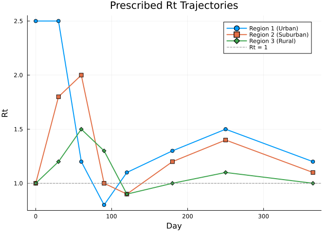

### Inter-region coupling

Coupling between regions is captured by pairwise parameters. The
coupling strengths are small, representing commuter or travel-based
importation:

- Urban ↔ Suburban: `c12 = 0.1` (strongest, commuter flows)
- Urban ↔ Rural: `c13 = 0.05` (weaker)
- Suburban ↔ Rural: `c23 = 0.1`

A global scaling parameter `epsilon = 0.05` controls the overall
importation pressure.

## Model Definition

Since we have three regions with distinct Rt trajectories, we define a
separate interpolation for each region’s Rt. With only three regions, we
expand the SEIRD dynamics explicitly per region rather than using
arrays.

The **force of infection** in region *i* combines local transmission
with a small contribution from infectious individuals in connected
regions:

$$\lambda_i = \beta_i \left( \frac{I_i}{N_i} + \varepsilon \sum_j C_{ij} \frac{I_j}{N_j} \right)$$

where $\beta_i = \text{Rt}_i \times \gamma$, $\varepsilon$ is the
coupling strength, and $C_{ij}$ are the pairwise coupling coefficients.

``` julia
seird_regions = @odin begin
    # Per-region Rt via interpolation
    n_Rt_times = parameter()
    dim(Rt_t) = n_Rt_times
    dim(Rt_v1) = n_Rt_times
    dim(Rt_v2) = n_Rt_times
    dim(Rt_v3) = n_Rt_times
    Rt_t = parameter()
    Rt_v1 = parameter()
    Rt_v2 = parameter()
    Rt_v3 = parameter()
    Rt_1 = interpolate(Rt_t, Rt_v1, :linear)
    Rt_2 = interpolate(Rt_t, Rt_v2, :linear)
    Rt_3 = interpolate(Rt_t, Rt_v3, :linear)

    # Epidemiological parameters
    gamma = parameter(0.2)
    sigma = parameter(0.333)
    ifr = parameter(0.005)
    rho = parameter(0.3)
    epsilon = parameter(0.05)

    # Population and initial conditions
    N1 = parameter(5e6)
    N2 = parameter(3e6)
    N3 = parameter(1e6)
    I0_1 = parameter(100.0)
    I0_2 = parameter(10.0)
    I0_3 = parameter(1.0)

    # Coupling (symmetric pairwise)
    c12 = parameter(0.1)
    c13 = parameter(0.05)
    c23 = parameter(0.1)

    # Force of infection per region
    foi_1 = Rt_1 * gamma * (I1 / N1 + epsilon * (c12 * I2 / N2 + c13 * I3 / N3))
    foi_2 = Rt_2 * gamma * (I2 / N2 + epsilon * (c12 * I1 / N1 + c23 * I3 / N3))
    foi_3 = Rt_3 * gamma * (I3 / N3 + epsilon * (c13 * I1 / N1 + c23 * I2 / N2))

    # Region 1 (Urban)
    deriv(S1) = -foi_1 * S1
    deriv(E1) = foi_1 * S1 - sigma * E1
    deriv(I1) = sigma * E1 - gamma * I1
    deriv(R1) = (1 - ifr) * gamma * I1
    deriv(D1) = ifr * gamma * I1
    deriv(cum1) = foi_1 * S1

    # Region 2 (Suburban)
    deriv(S2) = -foi_2 * S2
    deriv(E2) = foi_2 * S2 - sigma * E2
    deriv(I2) = sigma * E2 - gamma * I2
    deriv(R2) = (1 - ifr) * gamma * I2
    deriv(D2) = ifr * gamma * I2
    deriv(cum2) = foi_2 * S2

    # Region 3 (Rural)
    deriv(S3) = -foi_3 * S3
    deriv(E3) = foi_3 * S3 - sigma * E3
    deriv(I3) = sigma * E3 - gamma * I3
    deriv(R3) = (1 - ifr) * gamma * I3
    deriv(D3) = ifr * gamma * I3
    deriv(cum3) = foi_3 * S3

    # Initial conditions
    initial(S1) = N1 - I0_1
    initial(E1) = 0
    initial(I1) = I0_1
    initial(R1) = 0
    initial(D1) = 0
    initial(cum1) = 0

    initial(S2) = N2 - I0_2
    initial(E2) = 0
    initial(I2) = I0_2
    initial(R2) = 0
    initial(D2) = 0
    initial(cum2) = 0

    initial(S3) = N3 - I0_3
    initial(E3) = 0
    initial(I3) = I0_3
    initial(R3) = 0
    initial(D3) = 0
    initial(cum3) = 0

    # Outputs
    output(daily_cases_1) = rho * sigma * E1
    output(daily_cases_2) = rho * sigma * E2
    output(daily_cases_3) = rho * sigma * E3
    output(sero_1) = cum1 / N1
    output(sero_2) = cum2 / N2
    output(sero_3) = cum3 / N3

    # Data comparison
    cases1 = data()
    cases2 = data()
    cases3 = data()
    cases1 ~ Poisson(rho * sigma * E1 * 7 + 1e-6)
    cases2 ~ Poisson(rho * sigma * E2 * 7 + 1e-6)
    cases3 ~ Poisson(rho * sigma * E3 * 7 + 1e-6)
end
```

    DustSystemGenerator{var"##OdinModel#278"}(var"##OdinModel#278"(18, [:S1, :E1, :I1, :R1, :D1, :cum1, :S2, :E2, :I2, :R2, :D2, :cum2, :S3, :E3, :I3, :R3, :D3, :cum3], [:n_Rt_times, :Rt_t, :Rt_v1, :Rt_v2, :Rt_v3, :gamma, :sigma, :ifr, :rho, :epsilon, :N1, :N2, :N3, :I0_1, :I0_2, :I0_3, :c12, :c13, :c23], true, true, true, true))

**Key features of this model:**

- **Explicit per-region states**: `S1`, `E1`, `I1`, etc. are written out
  for each of the three regions, avoiding DSL array edge cases while
  keeping the dynamics identical
- **Separate Rt interpolation**: Each region has its own
  piecewise-linear Rt trajectory, reflecting different intervention
  timings
- **Pairwise coupling**: The `c12`, `c13`, `c23` parameters and
  `epsilon` control importation pressure between regions
- **Two outputs per region**: `daily_cases_*` (reported case rate) and
  `sero_*` (cumulative attack rate) for monitoring

## Simulation

### Parameter setup

``` julia
true_pars = (
    n_Rt_times = Float64(n_Rt),
    Rt_t = Rt_times,
    Rt_v1 = Rt_region1,
    Rt_v2 = Rt_region2,
    Rt_v3 = Rt_region3,
    epsilon = 0.05,
    N1 = 5.0e6,
    N2 = 3.0e6,
    N3 = 1.0e6,
    I0_1 = 100.0,
    I0_2 = 10.0,
    I0_3 = 1.0,
    c12 = 0.1,
    c13 = 0.05,
    c23 = 0.1,
    gamma = 0.2,
    sigma = 1.0 / 3.0,
    ifr = 0.005,
    rho = 0.3,
)

println("Infectious period: ", 1 / true_pars.gamma, " days")
println("Latent period: ", round(1 / true_pars.sigma, digits=1), " days")
println("IFR: ", 100 * true_pars.ifr, "%")
println("Reporting rate: ", 100 * true_pars.rho, "%")
```

    Infectious period: 5.0 days
    Latent period: 3.0 days
    IFR: 0.5%
    Reporting rate: 30.0%

### Run simulation

``` julia
sim_times = collect(0.0:1.0:365.0)
result = dust_system_simulate(seird_regions, true_pars; times=sim_times, seed=1)
println("Output shape: ", size(result))
```

    Output shape: (24, 1, 366)

The state vector is ordered as:
`S1, E1, I1, R1, D1, cum1, S2, E2, I2, R2, D2, cum2, S3, E3, I3, R3, D3, cum3`
(18 states), followed by the outputs
`daily_cases_1, daily_cases_2, daily_cases_3, sero_1, sero_2, sero_3` (6
outputs).

### Epidemic dynamics

``` julia
region_names = ["Urban (5M)", "Suburban (3M)", "Rural (1M)"]
region_colors = [:steelblue :orange :green]

# State indices for I (infectious): I1=3, I2=9, I3=15
I_idx = [3, 9, 15]

# Infectious individuals by region
p_I = plot(xlabel="Day", ylabel="Infectious (I)",
           title="Infectious Individuals by Region",
           legend=:topright, size=(700, 350))
for i in 1:n_regions
    plot!(p_I, sim_times, result[I_idx[i], 1, :],
          label=region_names[i], lw=2, color=region_colors[i])
end
p_I
```

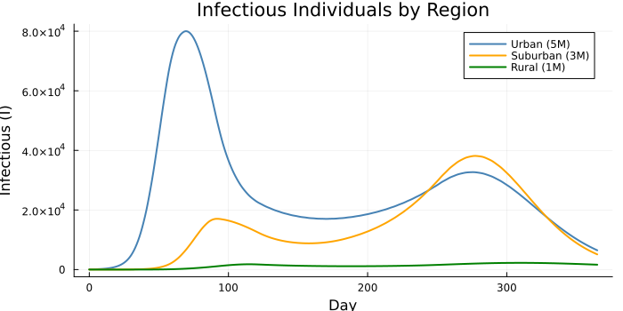

``` julia
# State indices for D (deaths): D1=5, D2=11, D3=17
D_idx = [5, 11, 17]

# Cumulative deaths by region
p_D = plot(xlabel="Day", ylabel="Cumulative Deaths",
           title="Cumulative Deaths by Region",
           legend=:topleft, size=(700, 350))
for i in 1:n_regions
    plot!(p_D, sim_times, result[D_idx[i], 1, :],
          label=region_names[i], lw=2, color=region_colors[i])
end
p_D
```

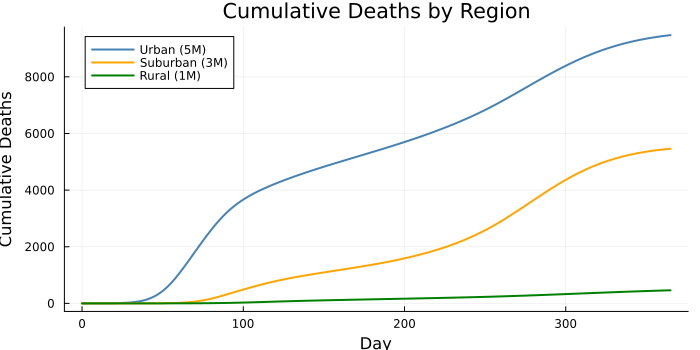

``` julia
# Output indices: daily_cases_1=19, daily_cases_2=20, daily_cases_3=21
cases_idx = [19, 20, 21]

# Daily reported cases (output)
p_cases = plot(xlabel="Day", ylabel="Daily Reported Cases",
               title="Expected Daily Cases by Region",
               legend=:topright, size=(700, 350))
for i in 1:n_regions
    plot!(p_cases, sim_times, result[cases_idx[i], 1, :],
          label=region_names[i], lw=2, color=region_colors[i])
end
p_cases
```

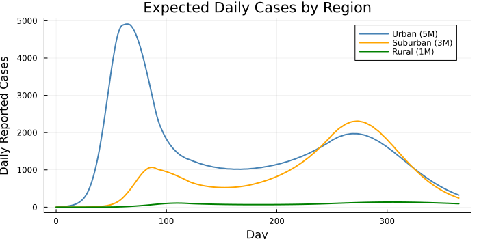

``` julia
# Output indices: sero_1=22, sero_2=23, sero_3=24
sero_idx = [22, 23, 24]

# Seroprevalence over time
p_sero = plot(xlabel="Day", ylabel="Seroprevalence",
              title="Cumulative Seroprevalence by Region",
              legend=:topleft, size=(700, 350))
for i in 1:n_regions
    plot!(p_sero, sim_times, result[sero_idx[i], 1, :],
          label=region_names[i], lw=2, color=region_colors[i])
end
p_sero
```

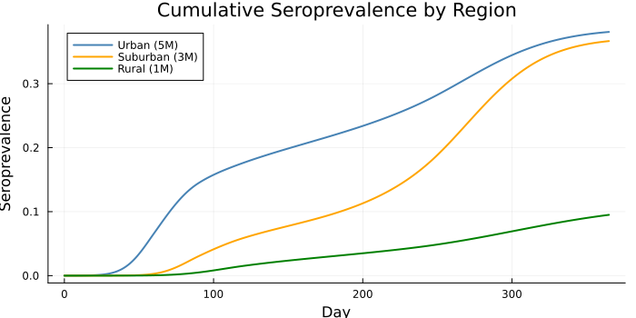

The urban region (blue) experiences the earliest and largest wave due to
its high initial Rt of 2.5. The suburban region (orange) follows with a
delayed peak. The rural region (green) has a much smaller epidemic,
partly because its Rt stays closer to 1, but inter-region coupling
ensures it still experiences some transmission even when local Rt is
below 1.

## Synthetic Data

We generate weekly reported case counts for each region, matching the
Poisson comparison in the model.

``` julia
Random.seed!(42)

# Weekly observation times
obs_weeks = collect(7.0:7.0:364.0)
n_weeks = length(obs_weeks)

# Simulate to get state at weekly intervals
result_weekly = dust_system_simulate(seird_regions, true_pars; times=obs_weeks, seed=1)

# State indices for E (exposed): E1=2, E2=8, E3=14
E_idx = [2, 8, 14]

# Generate Poisson-distributed weekly case counts
obs_cases = zeros(Int, n_weeks, n_regions)
for w in 1:n_weeks
    for i in 1:n_regions
        E_i = result_weekly[E_idx[i], 1, w]
        expected = true_pars.rho * true_pars.sigma * E_i * 7
        obs_cases[w, i] = rand(Poisson(max(expected, 1e-10)))
    end
end

println("Total observed cases: ", sum(obs_cases))
println("Cases per region: ", [sum(obs_cases[:, i]) for i in 1:n_regions])
```

    Total observed cases: 929435
    Cases per region: [571533, 329657, 28245]

``` julia
p_data = plot(xlabel="Day", ylabel="Weekly Reported Cases",
              title="Synthetic Weekly Case Data",
              legend=:topright, size=(700, 400))
for i in 1:n_regions
    scatter!(p_data, obs_weeks, obs_cases[:, i],
             ms=3, alpha=0.7, color=region_colors[i],
             label=region_names[i])
    plot!(p_data, obs_weeks, obs_cases[:, i],
          alpha=0.3, color=region_colors[i], label=nothing)
end
p_data
```

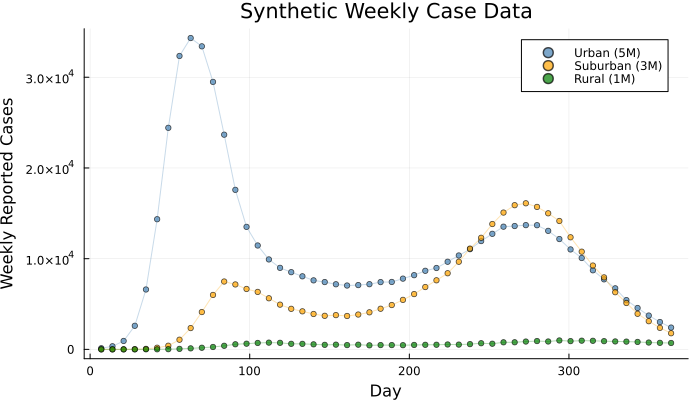

### Prepare data for the unfilter

``` julia
data = dust_filter_data([
    (time = obs_weeks[w],
     cases1 = Float64(obs_cases[w, 1]),
     cases2 = Float64(obs_cases[w, 2]),
     cases3 = Float64(obs_cases[w, 3]))
    for w in 1:n_weeks
])
```

    FilterData{@NamedTuple{cases1::Float64, cases2::Float64, cases3::Float64}}([7.0, 14.0, 21.0, 28.0, 35.0, 42.0, 49.0, 56.0, 63.0, 70.0  …  301.0, 308.0, 315.0, 322.0, 329.0, 336.0, 343.0, 350.0, 357.0, 364.0], [(cases1 = 126.0, cases2 = 3.0, cases3 = 1.0), (cases1 = 343.0, cases2 = 3.0, cases3 = 2.0), (cases1 = 931.0, cases2 = 8.0, cases3 = 1.0), (cases1 = 2601.0, cases2 = 23.0, cases3 = 1.0), (cases1 = 6603.0, cases2 = 57.0, cases3 = 9.0), (cases1 = 14350.0, cases2 = 184.0, cases3 = 11.0), (cases1 = 24424.0, cases2 = 404.0, cases3 = 24.0), (cases1 = 32346.0, cases2 = 1067.0, cases3 = 58.0), (cases1 = 34321.0, cases2 = 2350.0, cases3 = 114.0), (cases1 = 33408.0, cases2 = 4117.0, cases3 = 181.0)  …  (cases1 = 11019.0, cases2 = 12357.0, cases3 = 912.0), (cases1 = 10075.0, cases2 = 10772.0, cases3 = 961.0), (cases1 = 8720.0, cases2 = 9243.0, cases3 = 948.0), (cases1 = 7721.0, cases2 = 7938.0, cases3 = 908.0), (cases1 = 6731.0, cases2 = 6302.0, cases3 = 877.0), (cases1 = 5432.0, cases2 = 5114.0, cases3 = 858.0), (cases1 = 4563.0, cases2 = 3926.0, cases3 = 822.0), (cases1 = 3731.0, cases2 = 3108.0, cases3 = 756.0), (cases1 = 3016.0, cases2 = 2373.0, cases3 = 723.0), (cases1 = 2406.0, cases2 = 1781.0, cases3 = 706.0)])

## Inference

### Parameters to fit

We fit the **Rt trajectory values** for each region plus the shared
**reporting rate** and **IFR**, while fixing the epidemiological time
scales and coupling structure.

| Parameter | Fitted? | Notes |
|----|----|----|
| `Rt_v1[1:8]` | ✓ | Region 1 Rt at 8 time points |
| `Rt_v2[1:8]` | ✓ | Region 2 Rt at 8 time points |
| `Rt_v3[1:8]` | ✓ | Region 3 Rt at 8 time points |
| `rho` | ✓ | Shared reporting rate |
| `ifr` | ✓ | Shared infection fatality rate |
| `gamma`, `sigma` | ✗ | Fixed at known values |
| `epsilon`, `c12`, `c13`, `c23` | ✗ | Fixed — coupling structure assumed known |
| `N1`, `N2`, `N3`, `I0_*` | ✗ | Fixed population sizes and seeds |

This gives **26 parameters** total: 8 × 3 = 24 Rt values + `rho` +
`ifr`.

### Packer and fixed parameters

We use scalar parameter names with a `process` function that reassembles
the Rt knot values into the vectors the model expects:

``` julia
Rt_names = Symbol[]
for region in 1:3
    for k in 1:n_Rt
        push!(Rt_names, Symbol("Rt_v$(region)_$(k)"))
    end
end
all_scalars = vcat([:rho, :ifr], Rt_names)

packer = monty_packer(
    all_scalars;
    fixed = (
        n_Rt_times = Float64(n_Rt),
        Rt_t = Rt_times,
        epsilon = 0.05,
        N1 = 5.0e6,
        N2 = 3.0e6,
        N3 = 1.0e6,
        I0_1 = 100.0,
        I0_2 = 10.0,
        I0_3 = 1.0,
        c12 = 0.1,
        c13 = 0.05,
        c23 = 0.1,
        gamma = 0.2,
        sigma = 1.0 / 3.0,
    ),
    process = function(nt)
        Rt_v1 = Float64[getfield(nt, Symbol("Rt_v1_$k")) for k in 1:Int(nt.n_Rt_times)]
        Rt_v2 = Float64[getfield(nt, Symbol("Rt_v2_$k")) for k in 1:Int(nt.n_Rt_times)]
        Rt_v3 = Float64[getfield(nt, Symbol("Rt_v3_$k")) for k in 1:Int(nt.n_Rt_times)]
        merge(nt, (Rt_v1=Rt_v1, Rt_v2=Rt_v2, Rt_v3=Rt_v3))
    end,
)

println("Number of fitted parameters: ", packer.len)
```

    Number of fitted parameters: 26

### Prior distributions

We place weakly informative priors on each parameter:

``` julia
prior = @monty_prior begin
    rho ~ Beta(3.0, 7.0)             # mean 0.3
    ifr ~ Beta(2.0, 398.0)           # mean ~0.005
    Rt_v1_1 ~ Normal(1.5, 0.7)
    Rt_v1_2 ~ Normal(1.5, 0.7)
    Rt_v1_3 ~ Normal(1.5, 0.7)
    Rt_v1_4 ~ Normal(1.5, 0.7)
    Rt_v1_5 ~ Normal(1.5, 0.7)
    Rt_v1_6 ~ Normal(1.5, 0.7)
    Rt_v1_7 ~ Normal(1.5, 0.7)
    Rt_v1_8 ~ Normal(1.5, 0.7)
    Rt_v2_1 ~ Normal(1.5, 0.7)
    Rt_v2_2 ~ Normal(1.5, 0.7)
    Rt_v2_3 ~ Normal(1.5, 0.7)
    Rt_v2_4 ~ Normal(1.5, 0.7)
    Rt_v2_5 ~ Normal(1.5, 0.7)
    Rt_v2_6 ~ Normal(1.5, 0.7)
    Rt_v2_7 ~ Normal(1.5, 0.7)
    Rt_v2_8 ~ Normal(1.5, 0.7)
    Rt_v3_1 ~ Normal(1.5, 0.7)
    Rt_v3_2 ~ Normal(1.5, 0.7)
    Rt_v3_3 ~ Normal(1.5, 0.7)
    Rt_v3_4 ~ Normal(1.5, 0.7)
    Rt_v3_5 ~ Normal(1.5, 0.7)
    Rt_v3_6 ~ Normal(1.5, 0.7)
    Rt_v3_7 ~ Normal(1.5, 0.7)
    Rt_v3_8 ~ Normal(1.5, 0.7)
end
```

    MontyModel{var"#13#14", var"#15#16"{var"#13#14"}, var"#17#18", Matrix{Float64}}(["rho", "ifr", "Rt_v1_1", "Rt_v1_2", "Rt_v1_3", "Rt_v1_4", "Rt_v1_5", "Rt_v1_6", "Rt_v1_7", "Rt_v1_8"  …  "Rt_v2_7", "Rt_v2_8", "Rt_v3_1", "Rt_v3_2", "Rt_v3_3", "Rt_v3_4", "Rt_v3_5", "Rt_v3_6", "Rt_v3_7", "Rt_v3_8"], var"#13#14"(), var"#15#16"{var"#13#14"}(var"#13#14"()), var"#17#18"(), [0.0 1.0; 0.0 1.0; … ; -Inf Inf; -Inf Inf], Odin.MontyModelProperties(true, true, false, false))

### Likelihood via unfilter

The unfilter evaluates the ODE at each data time point and computes the
Poisson log-likelihood of the weekly case counts:

``` julia
uf = dust_unfilter_create(seird_regions, data; time_start=0.0)
ll = dust_likelihood_monty(uf, packer)
posterior = ll + prior

# Check log-likelihood at true values
true_theta = vcat(
    [true_pars.rho, true_pars.ifr],
    Rt_region1, Rt_region2, Rt_region3
)
ll_true = ll(true_theta)
println("Log-likelihood at true parameters: ", round(ll_true, digits=2))
```

    Log-likelihood at true parameters: -807.85

### Run MCMC

We use an adaptive random walk sampler with a diagonal initial proposal.
The adaptation phase adjusts the proposal covariance to achieve
efficient mixing across all 26 parameters.

``` julia
n_pars = packer.len
vcv_init = diagm(vcat(
    [0.01, 0.000001],                 # rho, ifr
    fill(0.01, n_Rt),                 # Rt_v1
    fill(0.01, n_Rt),                 # Rt_v2
    fill(0.01, n_Rt),                 # Rt_v3
))

sampler = monty_sampler_adaptive(vcv_init)

initial = reshape(true_theta, n_pars, 1)
samples = monty_sample(posterior, sampler, 3000;
    initial=initial, n_chains=1, n_burnin=500, seed=42)
```

    MontySamples([0.300441814796015 0.300441814796015 … 0.30075412315003747 0.30075412315003747; 0.004974804836990435 0.004974804836990435 … 0.0050964557780144295 0.0050964557780144295; … ; 1.0968929533722422 1.0968929533722422 … 1.0927726600936498 1.0927726600936498; 1.0074791958985176 1.0074791958985176 … 1.0140720091622695 1.0140720091622695;;;], [-826.2368483936074; -826.2368483936074; … ; -833.3946181970293; -833.3946181970293;;], [0.3; 0.005; … ; 1.1; 1.0;;], ["rho", "ifr", "Rt_v1_1", "Rt_v1_2", "Rt_v1_3", "Rt_v1_4", "Rt_v1_5", "Rt_v1_6", "Rt_v1_7", "Rt_v1_8"  …  "Rt_v2_7", "Rt_v2_8", "Rt_v3_1", "Rt_v3_2", "Rt_v3_3", "Rt_v3_4", "Rt_v3_5", "Rt_v3_6", "Rt_v3_7", "Rt_v3_8"], Dict{Symbol, Any}(:acceptance_rate => [0.25933333333333336]))

## Posterior Analysis

### Recovered Rt trajectories

The main output of interest is the posterior distribution of Rt over
time for each region. We extract the Rt values at each time point and
visualise the posterior uncertainty:

``` julia
# Extract Rt posterior samples (after packer ordering: rho, ifr, Rt_v1[1:8], Rt_v2[1:8], Rt_v3[1:8])
rho_post = samples.pars[1, :, 1]
ifr_post = samples.pars[2, :, 1]
Rt1_post = samples.pars[3:10, :, 1]   # 8 × n_samples
Rt2_post = samples.pars[11:18, :, 1]
Rt3_post = samples.pars[19:26, :, 1]
```

    8×2500 Matrix{Float64}:
     0.992167  0.992167  0.992167  0.992556  …  0.99781   0.99781   0.99781
     1.19464   1.19464   1.19464   1.19551      1.2012    1.2012    1.2012
     1.50626   1.50626   1.50626   1.50604      1.50736   1.50736   1.50736
     1.2966    1.2966    1.2966    1.29619      1.30117   1.30117   1.30117
     0.893019  0.893019  0.893019  0.893002     0.888715  0.888715  0.888715
     1.0016    1.0016    1.0016    1.00185   …  1.00874   1.00874   1.00874
     1.09689   1.09689   1.09689   1.09627      1.09277   1.09277   1.09277
     1.00748   1.00748   1.00748   1.00784      1.01407   1.01407   1.01407

``` julia
function rt_ribbon!(p, times, Rt_post, true_vals; color, label)
    med = [median(Rt_post[k, :]) for k in 1:size(Rt_post, 1)]
    lo  = [quantile(Rt_post[k, :], 0.025) for k in 1:size(Rt_post, 1)]
    hi  = [quantile(Rt_post[k, :], 0.975) for k in 1:size(Rt_post, 1)]
    plot!(p, times, med, ribbon=(med .- lo, hi .- med),
          fillalpha=0.2, lw=2, color=color, label=label)
    scatter!(p, times, true_vals, ms=5, color=color,
             markerstrokecolor=:white, label=nothing)
end

p_rt_post = plot(xlabel="Day", ylabel="Rt",
                 title="Posterior Rt Trajectories (median + 95% CrI)",
                 legend=:topright, size=(800, 400))
rt_ribbon!(p_rt_post, Rt_times, Rt1_post, Rt_region1,
           color=:steelblue, label="Region 1 (Urban)")
rt_ribbon!(p_rt_post, Rt_times, Rt2_post, Rt_region2,
           color=:orange, label="Region 2 (Suburban)")
rt_ribbon!(p_rt_post, Rt_times, Rt3_post, Rt_region3,
           color=:green, label="Region 3 (Rural)")
hline!(p_rt_post, [1.0], ls=:dash, color=:gray, label="Rt = 1")
p_rt_post
```

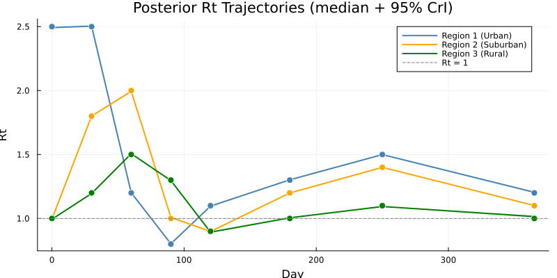

The dots show the true Rt values used to generate the data. The credible
intervals should encompass the truth at most time points, demonstrating
that the MCMC has successfully recovered the heterogeneous regional
dynamics.

### Shared parameter posteriors

``` julia
function summarise(name, vals, truth)
    m  = round(mean(vals), sigdigits=3)
    lo = round(quantile(vals, 0.025), sigdigits=3)
    hi = round(quantile(vals, 0.975), sigdigits=3)
    println("  $name: $m [$lo, $hi]  (true=$truth)")
end

println("Shared parameters:")
summarise("ρ (reporting)", rho_post, 0.3)
summarise("IFR", ifr_post, 0.005)
```

    Shared parameters:
      ρ (reporting): 0.3 [0.298, 0.301]  (true=0.3)
      IFR: 0.00505 [0.00495, 0.00513]  (true=0.005)

``` julia
p1 = histogram(rho_post, bins=40, normalize=true, alpha=0.6,
               xlabel="ρ", ylabel="Density",
               title="Posterior: Reporting Rate", label="")
vline!(p1, [0.3], color=:red, lw=2, label="True")

p2 = histogram(ifr_post, bins=40, normalize=true, alpha=0.6,
               xlabel="IFR", ylabel="Density",
               title="Posterior: Infection Fatality Rate", label="")
vline!(p2, [0.005], color=:red, lw=2, label="True")

plot(p1, p2, layout=(1, 2), size=(800, 300))
```

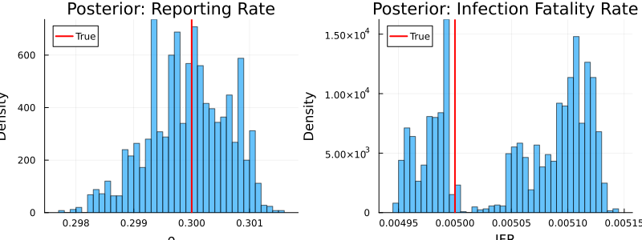

### Posterior predictive check

We draw parameter sets from the posterior and simulate forward to
compare the model predictions against observed data:

``` julia
n_proj = 100
proj_times = collect(0.0:1.0:365.0)
n_t = length(proj_times)
I_traj = zeros(n_proj, n_t, n_regions)

Random.seed!(10)
n_total = size(samples.pars, 2)
idx = rand(1:n_total, n_proj)

for j in 1:n_proj
    pars_j = packer(samples.pars[:, idx[j], 1])
    r = dust_system_simulate(seird_regions, pars_j; times=proj_times, seed=j)
    for i in 1:n_regions
        I_traj[j, :, i] = r[I_idx[i], 1, :]
    end
end
```

``` julia
p_ppc = plot(xlabel="Day", ylabel="Infectious (I)",
             title="Posterior Predictive: Infectious by Region",
             legend=:topright, size=(800, 400))

for i in 1:n_regions
    med = [median(I_traj[:, k, i]) for k in 1:n_t]
    lo  = [quantile(I_traj[:, k, i], 0.025) for k in 1:n_t]
    hi  = [quantile(I_traj[:, k, i], 0.975) for k in 1:n_t]
    plot!(p_ppc, proj_times, med, ribbon=(med .- lo, hi .- med),
          fillalpha=0.15, lw=2, color=region_colors[i],
          label=region_names[i])
end

# Overlay true trajectories
for i in 1:n_regions
    plot!(p_ppc, sim_times, result[I_idx[i], 1, :],
          ls=:dash, lw=1.5, color=region_colors[i], label=nothing)
end
p_ppc
```

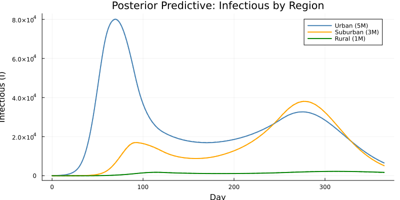

### Trace plots

``` julia
p_tr1 = plot(rho_post, ylabel="ρ", xlabel="Iteration",
             title="Trace: Reporting Rate", label="", alpha=0.5)
hline!(p_tr1, [0.3], color=:red, lw=2, label="True")

p_tr2 = plot(Rt1_post[1, :], ylabel="Rt₁(t=0)", xlabel="Iteration",
             title="Trace: Region 1 Rt at t=0", label="", alpha=0.5)
hline!(p_tr2, [2.5], color=:red, lw=2, label="True")

p_tr3 = plot(Rt2_post[3, :], ylabel="Rt₂(t=60)", xlabel="Iteration",
             title="Trace: Region 2 Rt at t=60", label="", alpha=0.5)
hline!(p_tr3, [2.0], color=:red, lw=2, label="True")

plot(p_tr1, p_tr2, p_tr3, layout=(3, 1), size=(700, 600))
```

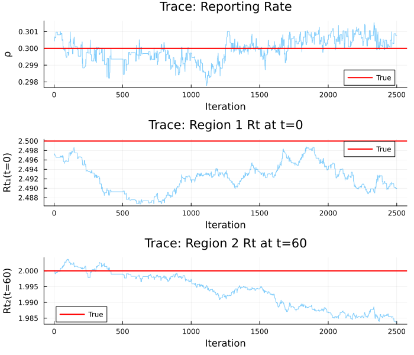

## The Role of Coupling

To see the effect of inter-region coupling, we can compare the fit with
and without the coupling term. When coupling is present, infections
“leak” between regions, which means:

- The rural region sees cases even when its local Rt is below 1
- The timing of peaks is shifted by importation pressure
- Parameter estimates are subtly different because the coupling
  redistributes infection across regions

``` julia
# Simulate without coupling (epsilon = 0)
pars_nocoupling = merge(true_pars, (epsilon=0.0,))
result_nc = dust_system_simulate(seird_regions, pars_nocoupling;
                                 times=sim_times, seed=1)

p_coupling = plot(xlabel="Day", ylabel="Infectious (I)",
                  title="Effect of Inter-Region Coupling",
                  legend=:topright, size=(800, 400))

for i in 1:n_regions
    plot!(p_coupling, sim_times, result[I_idx[i], 1, :],
          lw=2, color=region_colors[i], label="$(region_names[i]) — coupled")
    plot!(p_coupling, sim_times, result_nc[I_idx[i], 1, :],
          lw=1.5, ls=:dash, color=region_colors[i],
          label="$(region_names[i]) — isolated")
end
p_coupling
```

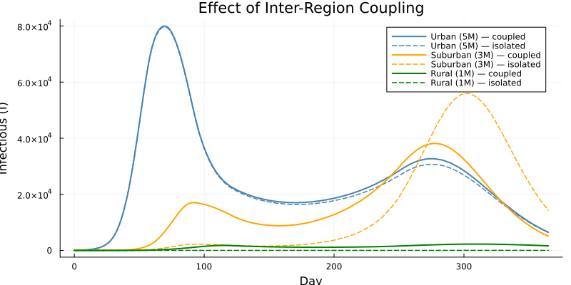

## Summary

| Aspect | Detail |
|----|----|
| **Model** | Multi-region SEIRD with time-varying Rt and inter-region coupling |
| **Regions** | 3 (Urban, Suburban, Rural) with different populations and Rt |
| **Time-varying Rt** | Piecewise linear via `interpolate()`, one per region |
| **Coupling** | Pairwise parameters × coupling strength ε |
| **Data** | Weekly reported cases per region (Poisson) |
| **Inference** | Deterministic ODE unfilter + adaptive MCMC |
| **Fitted parameters** | 24 Rt values + ρ + IFR = 26 total |

### Key takeaways

1.  **Expanded per-region states avoid DSL array edge cases.** With a
    small fixed number of regions, writing `S1`, `E1`, `I1`, etc.
    explicitly keeps the model straightforward and avoids complex array
    indexing features.

2.  **Separate interpolation per region** allows each area to have its
    own intervention timeline while sharing the same epidemiological
    parameters (γ, σ, IFR).

3.  **Inter-region coupling** captures importation effects that pure
    region-specific models miss — especially important for regions with
    Rt \< 1 that still experience cases from neighbouring areas.

4.  **Joint fitting across regions** enables information sharing: the
    reporting rate ρ is constrained by data from all three regions
    simultaneously, giving tighter posterior estimates than fitting each
    region independently.

5.  **The workflow scales naturally**: the same pattern works for
    additional data streams (deaths, serology) and more complex coupling
    structures.

| Step | API |
|----|----|
| Define model | `@odin begin … end` with per-region states and `interpolate()` |
| Prepare data | `dust_filter_data([(time=…, cases1=…, …), …])` |
| Pack parameters | `monty_packer([:rho, :ifr]; array=Dict(:Rt_v1 => 8, …), fixed=…)` |
| Likelihood | `dust_unfilter_create()` → `dust_likelihood_monty()` |
| Prior | `@monty_prior begin … end` |
| Posterior | `likelihood + prior` |
| Sample | `monty_sample(posterior, sampler, n; …)` |
