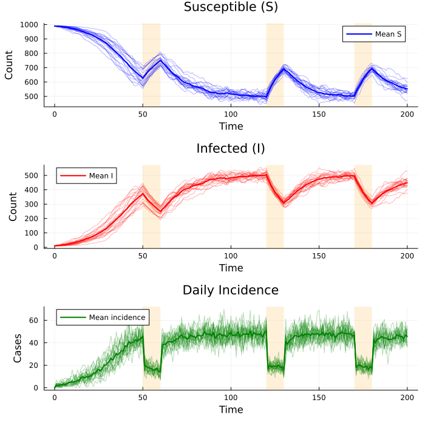
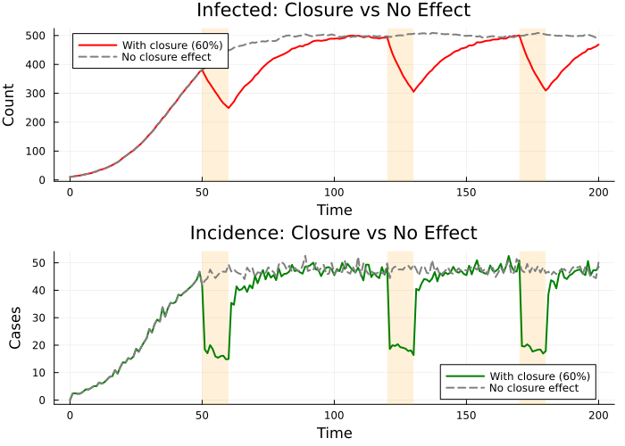
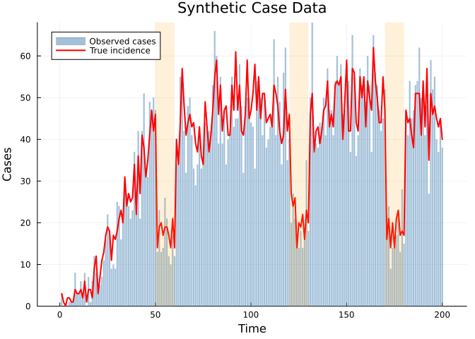
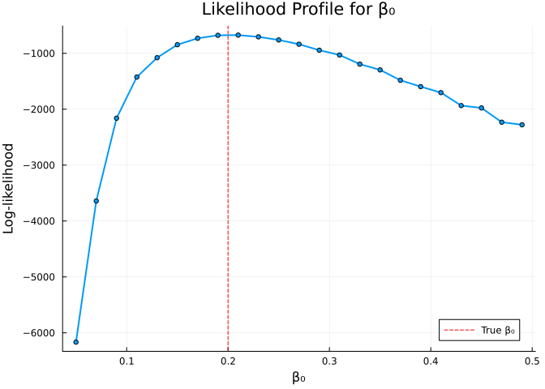
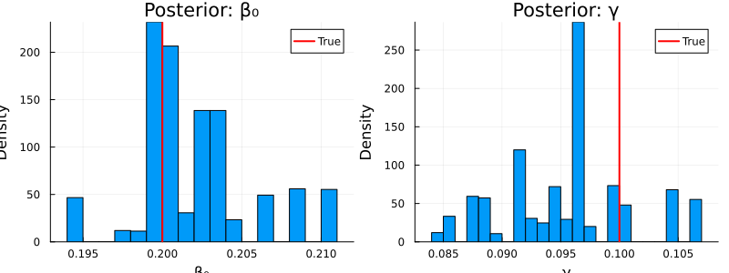
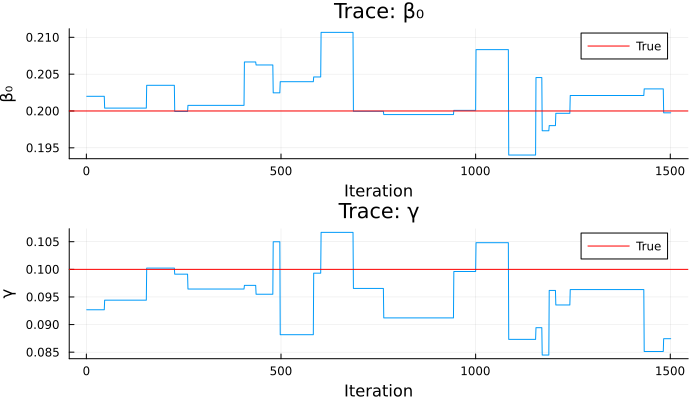

# SIS Model with School Closure


## Introduction

School closures are a common non-pharmaceutical intervention during
epidemics. When schools close, contact rates among children drop,
reducing the effective transmission rate. This vignette demonstrates how
to model **time-varying school status** using `interpolate()` in an SIS
(Susceptible–Infected–Susceptible) framework with:

| Feature                | Odin construct                |
|------------------------|-------------------------------|
| Stochastic transitions | `Binomial()` draws            |
| Incidence accumulator  | `zero_every = 1`              |
| Time-varying forcing   | `interpolate(..., :constant)` |
| Observation model      | `cases ~ Poisson(incidence)`  |

## Model Definition

``` julia
using Odin
using Distributions
using Plots
using Statistics
using Random
```

``` julia
sis = @odin begin
    update(S) = S - n_SI + n_IS
    update(I) = I + n_SI - n_IS

    initial(S) = N - I0
    initial(I) = I0

    # Incidence resets every time step
    initial(incidence, zero_every = 1) = 0
    update(incidence) = incidence + n_SI

    # School status: 1 = open, 0 = closed
    schools = interpolate(schools_time, schools_open, :constant)
    schools_time = parameter(rank = 1)
    schools_open = parameter(rank = 1)

    # Effective transmission rate
    beta = ((1 - schools) * (1 - schools_modifier) + schools) * beta0

    # Transition probabilities
    p_SI = 1 - exp(-beta * I / N * dt)
    p_IS = 1 - exp(-gamma * dt)

    # Stochastic transitions
    n_SI = Binomial(S, p_SI)
    n_IS = Binomial(I, p_IS)

    # Parameters
    N = parameter(1000)
    I0 = parameter(10)
    beta0 = parameter(0.2)
    gamma = parameter(0.1)
    schools_modifier = parameter(0.6)

    # Data comparison
    cases = data()
    cases ~ Poisson(incidence + 1e-6)
end
```

    DustSystemGenerator{var"##OdinModel#351"}(var"##OdinModel#351"(3, [:S, :I, :incidence], [:schools_time, :schools_open, :N, :I0, :beta0, :gamma, :schools_modifier], false, true, false, true, Dict{Symbol, Array}()))

When schools are **open** (`schools = 1`), `beta = beta0`. When schools
are **closed** (`schools = 0`), `beta = (1 - schools_modifier) * beta0`,
reducing transmission by `schools_modifier` (60% by default).

## School Schedule

We define a schedule where schools alternate between open and closed:

``` julia
schools_time = [0.0, 50.0, 60.0, 120.0, 130.0, 170.0, 180.0]
schools_open = [1.0,  0.0,  1.0,   0.0,   1.0,   0.0,   1.0]

pars = (
    beta0 = 0.2,
    gamma = 0.1,
    N = 1000.0,
    I0 = 10.0,
    schools_time = schools_time,
    schools_open = schools_open,
    schools_modifier = 0.6,
)
```

    (beta0 = 0.2, gamma = 0.1, N = 1000.0, I0 = 10.0, schools_time = [0.0, 50.0, 60.0, 120.0, 130.0, 170.0, 180.0], schools_open = [1.0, 0.0, 1.0, 0.0, 1.0, 0.0, 1.0], schools_modifier = 0.6)

School closure periods: days 50–60, 120–130, and 170–180.

## Simulation with Multiple Particles

``` julia
times = collect(0.0:1.0:200.0)

result = dust_system_simulate(sis, pars;
    times = times, dt = 1.0, n_particles = 20, seed = 42)

size(result)  # (n_states, n_particles, n_times)
```

    (3, 20, 201)

## Visualisation

``` julia
# Closure periods for shading
closure_periods = [(50, 60), (120, 130), (170, 180)]

p1 = plot(title = "Susceptible (S)", xlabel = "Time", ylabel = "Count")
p2 = plot(title = "Infected (I)", xlabel = "Time", ylabel = "Count")
p3 = plot(title = "Daily Incidence", xlabel = "Time", ylabel = "Cases")

for (lo, hi) in closure_periods
    vspan!(p1, [lo, hi], alpha = 0.15, color = :orange, label = nothing)
    vspan!(p2, [lo, hi], alpha = 0.15, color = :orange, label = nothing)
    vspan!(p3, [lo, hi], alpha = 0.15, color = :orange, label = nothing)
end

for i in 1:20
    plot!(p1, times, result[1, i, :], alpha = 0.3, color = :blue, label = nothing)
    plot!(p2, times, result[2, i, :], alpha = 0.3, color = :red, label = nothing)
    plot!(p3, times, result[3, i, :], alpha = 0.3, color = :green, label = nothing)
end

# Add mean trajectories
mean_S = vec(mean(result[1, :, :], dims = 1))
mean_I = vec(mean(result[2, :, :], dims = 1))
mean_inc = vec(mean(result[3, :, :], dims = 1))

plot!(p1, times, mean_S, lw = 2, color = :blue, label = "Mean S")
plot!(p2, times, mean_I, lw = 2, color = :red, label = "Mean I")
plot!(p3, times, mean_inc, lw = 2, color = :green, label = "Mean incidence")

plot(p1, p2, p3, layout = (3, 1), size = (700, 700))
```



Orange shaded regions mark school closure periods. Transmission drops
visibly during closures, with infected counts recovering once schools
reopen.

## Comparison: With vs Without School Closure

``` julia
# No school effect (modifier = 0.0 means closures don't reduce beta)
pars_no_closure = merge(pars, (schools_modifier = 0.0,))

result_closure = dust_system_simulate(sis, pars;
    times = times, dt = 1.0, n_particles = 20, seed = 1)
result_no_closure = dust_system_simulate(sis, pars_no_closure;
    times = times, dt = 1.0, n_particles = 20, seed = 1)

mean_I_closure = vec(mean(result_closure[2, :, :], dims = 1))
mean_I_none = vec(mean(result_no_closure[2, :, :], dims = 1))
mean_inc_closure = vec(mean(result_closure[3, :, :], dims = 1))
mean_inc_none = vec(mean(result_no_closure[3, :, :], dims = 1))

p4 = plot(title = "Infected: Closure vs No Effect", xlabel = "Time", ylabel = "Count")
for (lo, hi) in closure_periods
    vspan!(p4, [lo, hi], alpha = 0.15, color = :orange, label = nothing)
end
plot!(p4, times, mean_I_closure, lw = 2, color = :red, label = "With closure (60%)")
plot!(p4, times, mean_I_none, lw = 2, color = :gray, ls = :dash, label = "No closure effect")

p5 = plot(title = "Incidence: Closure vs No Effect", xlabel = "Time", ylabel = "Cases")
for (lo, hi) in closure_periods
    vspan!(p5, [lo, hi], alpha = 0.15, color = :orange, label = nothing)
end
plot!(p5, times, mean_inc_closure, lw = 2, color = :green, label = "With closure (60%)")
plot!(p5, times, mean_inc_none, lw = 2, color = :gray, ls = :dash, label = "No closure effect")

plot(p4, p5, layout = (2, 1), size = (700, 500))
```



## Generate Synthetic Data

We use a single simulation run to generate observed case data:

``` julia
truth = dust_system_simulate(sis, pars;
    times = times, dt = 1.0, n_particles = 1, seed = 101)

# Incidence from the single run, starting from time 1
true_incidence = truth[3, 1, 2:end]

# Poisson-distributed observed cases
Random.seed!(42)
observed_cases = [rand(Distributions.Poisson(max(c, 1e-6))) for c in true_incidence]

plot(times[2:end], observed_cases, seriestype = :bar, alpha = 0.5,
     label = "Observed cases", xlabel = "Time", ylabel = "Cases",
     title = "Synthetic Case Data", color = :steelblue, lw = 0)
plot!(times[2:end], true_incidence, lw = 2, color = :red, label = "True incidence")
for (lo, hi) in closure_periods
    vspan!([lo, hi], alpha = 0.15, color = :orange, label = nothing)
end
plot!()
```



## Particle Filter

``` julia
filter_data = dust_filter_data(
    [(time = Float64(t), cases = Float64(c))
     for (t, c) in zip(times[2:end], observed_cases)]
)

filter = dust_filter_create(sis, filter_data;
    n_particles = 100, dt = 1.0, seed = 42)

ll = dust_likelihood_run!(filter, pars)
println("Log-likelihood at true parameters: ", round(ll, digits = 2))
```

    Log-likelihood at true parameters: -674.48

### Likelihood Profile for β₀

``` julia
beta0s = 0.05:0.02:0.5
lls = Float64[]
for b in beta0s
    test_pars = merge(pars, (beta0 = b,))
    push!(lls, dust_likelihood_run!(filter, test_pars))
end

plot(collect(beta0s), lls,
     xlabel = "β₀", ylabel = "Log-likelihood",
     title = "Likelihood Profile for β₀",
     lw = 2, label = "", markershape = :circle, markersize = 3)
vline!([0.2], ls = :dash, color = :red, label = "True β₀")
```



## Bayesian Inference

We estimate `beta0` and `gamma` using random-walk MCMC:

``` julia
packer = monty_packer([:beta0, :gamma];
    fixed = (
        N = 1000.0,
        I0 = 10.0,
        schools_time = schools_time,
        schools_open = schools_open,
        schools_modifier = 0.6,
    ))

likelihood = dust_likelihood_monty(filter, packer)

prior = @monty_prior begin
    beta0 ~ Gamma(2.0, 0.1)
    gamma ~ Gamma(2.0, 0.05)
end

posterior = likelihood + prior
```

    MontyModel{Odin.var"#monty_model_combine##0#monty_model_combine##1"{MontyModel{Odin.var"#dust_likelihood_monty##0#dust_likelihood_monty##1"{DustFilter{var"##OdinModel#351", Float64, @NamedTuple{cases::Float64}}, MontyPacker}, Nothing, Nothing, Nothing}, MontyModel{var"#10#11", var"#12#13"{var"#10#11"}, var"#14#15", Matrix{Float64}}}, Odin.var"#monty_model_combine##4#monty_model_combine##5"{Odin.var"#monty_model_combine##0#monty_model_combine##1"{MontyModel{Odin.var"#dust_likelihood_monty##0#dust_likelihood_monty##1"{DustFilter{var"##OdinModel#351", Float64, @NamedTuple{cases::Float64}}, MontyPacker}, Nothing, Nothing, Nothing}, MontyModel{var"#10#11", var"#12#13"{var"#10#11"}, var"#14#15", Matrix{Float64}}}}, Nothing, Matrix{Float64}}(["beta0", "gamma"], Odin.var"#monty_model_combine##0#monty_model_combine##1"{MontyModel{Odin.var"#dust_likelihood_monty##0#dust_likelihood_monty##1"{DustFilter{var"##OdinModel#351", Float64, @NamedTuple{cases::Float64}}, MontyPacker}, Nothing, Nothing, Nothing}, MontyModel{var"#10#11", var"#12#13"{var"#10#11"}, var"#14#15", Matrix{Float64}}}(MontyModel{Odin.var"#dust_likelihood_monty##0#dust_likelihood_monty##1"{DustFilter{var"##OdinModel#351", Float64, @NamedTuple{cases::Float64}}, MontyPacker}, Nothing, Nothing, Nothing}(["beta0", "gamma"], Odin.var"#dust_likelihood_monty##0#dust_likelihood_monty##1"{DustFilter{var"##OdinModel#351", Float64, @NamedTuple{cases::Float64}}, MontyPacker}(DustFilter{var"##OdinModel#351", Float64, @NamedTuple{cases::Float64}}(DustSystemGenerator{var"##OdinModel#351"}(var"##OdinModel#351"(3, [:S, :I, :incidence], [:schools_time, :schools_open, :N, :I0, :beta0, :gamma, :schools_modifier], false, true, false, true, Dict{Symbol, Array}())), FilterData{@NamedTuple{cases::Float64}}([1.0, 2.0, 3.0, 4.0, 5.0, 6.0, 7.0, 8.0, 9.0, 10.0  …  191.0, 192.0, 193.0, 194.0, 195.0, 196.0, 197.0, 198.0, 199.0, 200.0], [(cases = 3.0,), (cases = 0.0,), (cases = 0.0,), (cases = 0.0,), (cases = 1.0,), (cases = 1.0,), (cases = 1.0,), (cases = 8.0,), (cases = 3.0,), (cases = 3.0,)  …  (cases = 41.0,), (cases = 48.0,), (cases = 27.0,), (cases = 59.0,), (cases = 52.0,), (cases = 55.0,), (cases = 40.0,), (cases = 37.0,), (cases = 44.0,), (cases = 38.0,)]), 0.0, 100, 1.0, 42, false, DustSystem{var"##OdinModel#351", Float64, @NamedTuple{beta0::Float64, gamma::Float64, N::Float64, I0::Float64, schools_time::Vector{Float64}, schools_open::Vector{Float64}, schools_modifier::Float64, dt::Float64, _interp_schools::Odin.var"#interp#_constant_interpolator##0"{Vector{Float64}, Vector{Float64}}}}(DustSystemGenerator{var"##OdinModel#351"}(var"##OdinModel#351"(3, [:S, :I, :incidence], [:schools_time, :schools_open, :N, :I0, :beta0, :gamma, :schools_modifier], false, true, false, true, Dict{Symbol, Array}())), [270.0 279.0 … 269.0 242.0; 730.0 721.0 … 731.0 758.0; 87.0 77.0 … 68.0 86.0], (beta0 = 0.49, gamma = 0.1, N = 1000.0, I0 = 10.0, schools_time = [0.0, 50.0, 60.0, 120.0, 130.0, 170.0, 180.0], schools_open = [1.0, 0.0, 1.0, 0.0, 1.0, 0.0, 1.0], schools_modifier = 0.6, dt = 1.0, _interp_schools = Odin.var"#interp#_constant_interpolator##0"{Vector{Float64}, Vector{Float64}}([0.0, 50.0, 60.0, 120.0, 130.0, 170.0, 180.0], [1.0, 0.0, 1.0, 0.0, 1.0, 0.0, 1.0])), 200.0, 1.0, 100, 3, 0, Xoshiro[Xoshiro(0x66443a39fd1b5a88, 0xd831fad9613cb72d, 0xb221913ec1a86d4f, 0x4d3e80cfec518d02, 0x946aaf42c6e9390a), Xoshiro(0x4c61abac79c5c71c, 0x3b252d914935f201, 0x47a9f895cffc8d53, 0x3685ab6f56220ae6, 0x13a14f6b238748d5), Xoshiro(0xfa5a475fc2361dbf, 0x143862f278103948, 0xde156bfcbf7baa9d, 0xe19f078a7fdd1a34, 0x6c9c519d563cbac0), Xoshiro(0xd94c8e3b5264498d, 0x59b36296339c2cc1, 0xbad4c36b845c4704, 0x2cdc013053c70651, 0x23360656549078da), Xoshiro(0xc5a458ce33c7c4ae, 0x9858ca161a8a5487, 0xefe5a4a3e4cca5d7, 0xcac29f88fc03e056, 0x5e3265ceea9aee2e), Xoshiro(0x860cc70b54aad3d2, 0x9e8d6f32018963c7, 0xfeb364def893f55e, 0x98152272c520774f, 0x82ccf53a2241a5b6), Xoshiro(0xc27ba0e6b3c0a960, 0xc2a94e51fc680b69, 0x6d362aef56942292, 0xd37de61d74396d66, 0xea9814cca13ef0b9), Xoshiro(0xcf814ad626b91849, 0x7142f3972e491628, 0x885a1288d7552243, 0xd417131d9783af3e, 0x89edbefac11aca34), Xoshiro(0xaf3ff7276dc65f08, 0x72ff7f78e0eb9c66, 0x0ca73ea394579fdf, 0x455973a511c42de1, 0x168a381663c823a4), Xoshiro(0x203de563bee4ea0d, 0xa74356a100104fc7, 0xaaf7b97813d681fe, 0xcd5da67c1ff86335, 0x5ad151eb73579d81)  …  Xoshiro(0xde4cf30a69f7d9f5, 0xb12d7273eaaaf9c9, 0x18710514c1ad6b1d, 0xf77f184bb9ec9319, 0x693826d6f18cc447), Xoshiro(0x2f38ec26cbbb6c14, 0x2db9ee2cd7641de5, 0xcf4f3beba50d5d97, 0x9ba6f75025447415, 0x4038aceef4210d3a), Xoshiro(0xa68efe6da4ebc61c, 0xce23713db4ab8587, 0x6d241e21a0af64e9, 0xacf963bb99badbcc, 0x91325288ac5768a1), Xoshiro(0x47f1b4654ad9272a, 0x43fdede4b1128f95, 0x88a4d719257da7ca, 0x00a3495935507583, 0x19656a952da8aac8), Xoshiro(0x6849f31de416291e, 0x19321f8d8425b490, 0x16af1a55b25f18a4, 0x1c8af2c4e798377f, 0x2a5280d03b72b5a1), Xoshiro(0x288494c2df03919c, 0xe53c3fa792633261, 0xc3fafb4cd7022fc9, 0x8b90611903332c2a, 0x7ed5747ae599b8c0), Xoshiro(0x3d808f92ee9da20d, 0x8f26126fd4f4c226, 0x4673e9e9b896f736, 0xee34f86368abc577, 0x094361155311f477), Xoshiro(0x71292f62678f302a, 0x9f6fd9a213f6fb22, 0x6d610c9e30a23a20, 0x2e26269e9a63344f, 0x50f28000cd27344c), Xoshiro(0x71a3242fed1028b9, 0xfbed42a6e11fb3d1, 0x6cb70238be3418a0, 0xed2d67fccdc2ec48, 0x8b34b20186102f8c), Xoshiro(0x0d240f427d7acf03, 0x670834b37634a75d, 0x3cb250675a523a86, 0x99d4d27218fe1f36, 0x622bf6eece42bed7)], [:S, :I, :incidence], Symbol[], Odin.ZeroEveryEntry[Odin.ZeroEveryEntry(3:3, 1)], [242.0, 758.0, 86.0], [7.2071840553e-314, 7.16811883e-314, 7.207184063e-314], [-20.26369066885802, -14.903593090567355, -17.51286775505757, -16.451187021906307, -20.26369066885802, -11.986363751732554, -22.555537949291093, -20.26369066885802, -15.929180739754358, -19.70300191502004  …  -24.32299748399832, -19.147451420822946, -15.929180739754358, -17.51286775505757, -14.400332183633239, -21.975431719741508, -18.05225606041175, -13.90365079346735, -10.626906258998233, -19.70300191502004], [1, 1, 12, 12, 12, 12, 12, 12, 12, 12  …  60, 60, 60, 77, 84, 86, 90, 90, 90, 90], [289.0 272.0 … 245.0 234.0; 711.0 728.0 … 755.0 766.0; 68.0 74.0 … 82.0 94.0], Xoshiro[Xoshiro(0xbbef41b8af2d3c1e, 0x4e116679190ecc82, 0xe10c58a674d2a164, 0x44170e5cd0485cd9, 0x946aaf42c6e9390a), Xoshiro(0x821142d109d23e8e, 0xd4828ec91bc54f63, 0x1d2025e4dbe3de5a, 0xdd382332c0f55de8, 0x13a14f6b238748d5), Xoshiro(0xc4e254be440aecd8, 0xa178ed9ac822fab8, 0x711897d1ee8ee587, 0x9e8acc296d7abcd3, 0x6c9c519d563cbac0), Xoshiro(0x434d6b62cbdda887, 0x03ad7d3050755aef, 0x2512703988b12d55, 0x752584343be61881, 0x23360656549078da), Xoshiro(0xa604d0fc72e805f0, 0xdc762f9ea3e12369, 0xafa776f5880cca42, 0xbb57e7cc97871003, 0x5e3265ceea9aee2e), Xoshiro(0xf34952f1357c1b87, 0x684b1da8d7c322f5, 0x66b06ce0ba05bab8, 0xf214123f2eca193e, 0x82ccf53a2241a5b6), Xoshiro(0xe4ad062077144fac, 0xaf5a350655602a95, 0x219bbfb6b424e0ac, 0x04db6b668fb14462, 0xea9814cca13ef0b9), Xoshiro(0x9226c46afee466e5, 0x3dbd9a02a425e8a8, 0x7449c88e8f128e1d, 0x52353a8aca1dcd9c, 0x89edbefac11aca34), Xoshiro(0xa28f7d48e6149c9d, 0x44390d418856640c, 0xcdb1a62362474c2d, 0xd43a5391f330351c, 0x168a381663c823a4), Xoshiro(0xce14cb0c4d7819e9, 0xb1ca55b3e45827e3, 0x1fc8182cd88ce1c0, 0x35cc7da7c50c82ed, 0x5ad151eb73579d81)  …  Xoshiro(0xa3f4542fd75a3299, 0xc91feb66a522897e, 0x82f50e7913fe4fc0, 0x378b1d84a02c26bc, 0x693826d6f18cc447), Xoshiro(0x5752b97cf71e749f, 0xaa2731ab03e0ac18, 0x8f4f4ec0f791f182, 0xd39fec69e3ce5734, 0x4038aceef4210d3a), Xoshiro(0x8b08723674bdeb00, 0xea72aa93120ae850, 0xdc9a09e0a0d854d1, 0x15ef169d8b1ffe1c, 0x91325288ac5768a1), Xoshiro(0xa7018eec3eb1356e, 0xe57183ae5cc08216, 0x33a9c39d7e2ad021, 0x6aa3c5f213f85b9a, 0x19656a952da8aac8), Xoshiro(0xbdef558146a32cf6, 0x5e9adf04093272ea, 0x9489270ae39568be, 0x9296f3410c8cdc18, 0x2a5280d03b72b5a1), Xoshiro(0x73aedc370a775006, 0xdda981bed2eee659, 0x876463d642a101eb, 0x341581f25c3c4cc7, 0x7ed5747ae599b8c0), Xoshiro(0xe0600b1bff0e1799, 0x4248ae288a7aad05, 0x36f09d7d97b0ca6f, 0xb4f0058bffab91ba, 0x094361155311f477), Xoshiro(0xe431400b01d3fe80, 0xf1f42ed49654930f, 0xee4a4cb01a4f349f, 0x596becdd0936f6ad, 0x50f28000cd27344c), Xoshiro(0x833258067d713ec8, 0x1bff3243590e4d0d, 0xaf54507452fcb293, 0x838399570863bc3f, 0x8b34b20186102f8c), Xoshiro(0xbc9ff4ec01a5d562, 0xe0ed54a54f70310c, 0x45e019f6cf5024f6, 0xb34b1013aa53cce7, 0x622bf6eece42bed7)], nothing, [[2.3289629097e-314, 5.0e-324, 2.130133487e-314], [1.088592129811e-311, 5.0e-324, 2.1300177135e-314]], [Float64[], Float64[]], Dict{Symbol, Array}[Dict(), Dict()], 2)), MontyPacker([:beta0, :gamma], [:beta0, :gamma], Symbol[], Dict{Symbol, Tuple}(), Dict{Symbol, UnitRange{Int64}}(:gamma => 2:2, :beta0 => 1:1), 2, (N = 1000.0, I0 = 10.0, schools_time = [0.0, 50.0, 60.0, 120.0, 130.0, 170.0, 180.0], schools_open = [1.0, 0.0, 1.0, 0.0, 1.0, 0.0, 1.0], schools_modifier = 0.6), nothing)), nothing, nothing, nothing, Odin.MontyModelProperties(false, false, true, false)), MontyModel{var"#10#11", var"#12#13"{var"#10#11"}, var"#14#15", Matrix{Float64}}(["beta0", "gamma"], var"#10#11"(), var"#12#13"{var"#10#11"}(var"#10#11"()), var"#14#15"(), [0.0 Inf; 0.0 Inf], Odin.MontyModelProperties(true, true, false, false))), Odin.var"#monty_model_combine##4#monty_model_combine##5"{Odin.var"#monty_model_combine##0#monty_model_combine##1"{MontyModel{Odin.var"#dust_likelihood_monty##0#dust_likelihood_monty##1"{DustFilter{var"##OdinModel#351", Float64, @NamedTuple{cases::Float64}}, MontyPacker}, Nothing, Nothing, Nothing}, MontyModel{var"#10#11", var"#12#13"{var"#10#11"}, var"#14#15", Matrix{Float64}}}}(Odin.var"#monty_model_combine##0#monty_model_combine##1"{MontyModel{Odin.var"#dust_likelihood_monty##0#dust_likelihood_monty##1"{DustFilter{var"##OdinModel#351", Float64, @NamedTuple{cases::Float64}}, MontyPacker}, Nothing, Nothing, Nothing}, MontyModel{var"#10#11", var"#12#13"{var"#10#11"}, var"#14#15", Matrix{Float64}}}(MontyModel{Odin.var"#dust_likelihood_monty##0#dust_likelihood_monty##1"{DustFilter{var"##OdinModel#351", Float64, @NamedTuple{cases::Float64}}, MontyPacker}, Nothing, Nothing, Nothing}(["beta0", "gamma"], Odin.var"#dust_likelihood_monty##0#dust_likelihood_monty##1"{DustFilter{var"##OdinModel#351", Float64, @NamedTuple{cases::Float64}}, MontyPacker}(DustFilter{var"##OdinModel#351", Float64, @NamedTuple{cases::Float64}}(DustSystemGenerator{var"##OdinModel#351"}(var"##OdinModel#351"(3, [:S, :I, :incidence], [:schools_time, :schools_open, :N, :I0, :beta0, :gamma, :schools_modifier], false, true, false, true, Dict{Symbol, Array}())), FilterData{@NamedTuple{cases::Float64}}([1.0, 2.0, 3.0, 4.0, 5.0, 6.0, 7.0, 8.0, 9.0, 10.0  …  191.0, 192.0, 193.0, 194.0, 195.0, 196.0, 197.0, 198.0, 199.0, 200.0], [(cases = 3.0,), (cases = 0.0,), (cases = 0.0,), (cases = 0.0,), (cases = 1.0,), (cases = 1.0,), (cases = 1.0,), (cases = 8.0,), (cases = 3.0,), (cases = 3.0,)  …  (cases = 41.0,), (cases = 48.0,), (cases = 27.0,), (cases = 59.0,), (cases = 52.0,), (cases = 55.0,), (cases = 40.0,), (cases = 37.0,), (cases = 44.0,), (cases = 38.0,)]), 0.0, 100, 1.0, 42, false, DustSystem{var"##OdinModel#351", Float64, @NamedTuple{beta0::Float64, gamma::Float64, N::Float64, I0::Float64, schools_time::Vector{Float64}, schools_open::Vector{Float64}, schools_modifier::Float64, dt::Float64, _interp_schools::Odin.var"#interp#_constant_interpolator##0"{Vector{Float64}, Vector{Float64}}}}(DustSystemGenerator{var"##OdinModel#351"}(var"##OdinModel#351"(3, [:S, :I, :incidence], [:schools_time, :schools_open, :N, :I0, :beta0, :gamma, :schools_modifier], false, true, false, true, Dict{Symbol, Array}())), [270.0 279.0 … 269.0 242.0; 730.0 721.0 … 731.0 758.0; 87.0 77.0 … 68.0 86.0], (beta0 = 0.49, gamma = 0.1, N = 1000.0, I0 = 10.0, schools_time = [0.0, 50.0, 60.0, 120.0, 130.0, 170.0, 180.0], schools_open = [1.0, 0.0, 1.0, 0.0, 1.0, 0.0, 1.0], schools_modifier = 0.6, dt = 1.0, _interp_schools = Odin.var"#interp#_constant_interpolator##0"{Vector{Float64}, Vector{Float64}}([0.0, 50.0, 60.0, 120.0, 130.0, 170.0, 180.0], [1.0, 0.0, 1.0, 0.0, 1.0, 0.0, 1.0])), 200.0, 1.0, 100, 3, 0, Xoshiro[Xoshiro(0x66443a39fd1b5a88, 0xd831fad9613cb72d, 0xb221913ec1a86d4f, 0x4d3e80cfec518d02, 0x946aaf42c6e9390a), Xoshiro(0x4c61abac79c5c71c, 0x3b252d914935f201, 0x47a9f895cffc8d53, 0x3685ab6f56220ae6, 0x13a14f6b238748d5), Xoshiro(0xfa5a475fc2361dbf, 0x143862f278103948, 0xde156bfcbf7baa9d, 0xe19f078a7fdd1a34, 0x6c9c519d563cbac0), Xoshiro(0xd94c8e3b5264498d, 0x59b36296339c2cc1, 0xbad4c36b845c4704, 0x2cdc013053c70651, 0x23360656549078da), Xoshiro(0xc5a458ce33c7c4ae, 0x9858ca161a8a5487, 0xefe5a4a3e4cca5d7, 0xcac29f88fc03e056, 0x5e3265ceea9aee2e), Xoshiro(0x860cc70b54aad3d2, 0x9e8d6f32018963c7, 0xfeb364def893f55e, 0x98152272c520774f, 0x82ccf53a2241a5b6), Xoshiro(0xc27ba0e6b3c0a960, 0xc2a94e51fc680b69, 0x6d362aef56942292, 0xd37de61d74396d66, 0xea9814cca13ef0b9), Xoshiro(0xcf814ad626b91849, 0x7142f3972e491628, 0x885a1288d7552243, 0xd417131d9783af3e, 0x89edbefac11aca34), Xoshiro(0xaf3ff7276dc65f08, 0x72ff7f78e0eb9c66, 0x0ca73ea394579fdf, 0x455973a511c42de1, 0x168a381663c823a4), Xoshiro(0x203de563bee4ea0d, 0xa74356a100104fc7, 0xaaf7b97813d681fe, 0xcd5da67c1ff86335, 0x5ad151eb73579d81)  …  Xoshiro(0xde4cf30a69f7d9f5, 0xb12d7273eaaaf9c9, 0x18710514c1ad6b1d, 0xf77f184bb9ec9319, 0x693826d6f18cc447), Xoshiro(0x2f38ec26cbbb6c14, 0x2db9ee2cd7641de5, 0xcf4f3beba50d5d97, 0x9ba6f75025447415, 0x4038aceef4210d3a), Xoshiro(0xa68efe6da4ebc61c, 0xce23713db4ab8587, 0x6d241e21a0af64e9, 0xacf963bb99badbcc, 0x91325288ac5768a1), Xoshiro(0x47f1b4654ad9272a, 0x43fdede4b1128f95, 0x88a4d719257da7ca, 0x00a3495935507583, 0x19656a952da8aac8), Xoshiro(0x6849f31de416291e, 0x19321f8d8425b490, 0x16af1a55b25f18a4, 0x1c8af2c4e798377f, 0x2a5280d03b72b5a1), Xoshiro(0x288494c2df03919c, 0xe53c3fa792633261, 0xc3fafb4cd7022fc9, 0x8b90611903332c2a, 0x7ed5747ae599b8c0), Xoshiro(0x3d808f92ee9da20d, 0x8f26126fd4f4c226, 0x4673e9e9b896f736, 0xee34f86368abc577, 0x094361155311f477), Xoshiro(0x71292f62678f302a, 0x9f6fd9a213f6fb22, 0x6d610c9e30a23a20, 0x2e26269e9a63344f, 0x50f28000cd27344c), Xoshiro(0x71a3242fed1028b9, 0xfbed42a6e11fb3d1, 0x6cb70238be3418a0, 0xed2d67fccdc2ec48, 0x8b34b20186102f8c), Xoshiro(0x0d240f427d7acf03, 0x670834b37634a75d, 0x3cb250675a523a86, 0x99d4d27218fe1f36, 0x622bf6eece42bed7)], [:S, :I, :incidence], Symbol[], Odin.ZeroEveryEntry[Odin.ZeroEveryEntry(3:3, 1)], [242.0, 758.0, 86.0], [7.2071840553e-314, 7.16811883e-314, 7.207184063e-314], [-20.26369066885802, -14.903593090567355, -17.51286775505757, -16.451187021906307, -20.26369066885802, -11.986363751732554, -22.555537949291093, -20.26369066885802, -15.929180739754358, -19.70300191502004  …  -24.32299748399832, -19.147451420822946, -15.929180739754358, -17.51286775505757, -14.400332183633239, -21.975431719741508, -18.05225606041175, -13.90365079346735, -10.626906258998233, -19.70300191502004], [1, 1, 12, 12, 12, 12, 12, 12, 12, 12  …  60, 60, 60, 77, 84, 86, 90, 90, 90, 90], [289.0 272.0 … 245.0 234.0; 711.0 728.0 … 755.0 766.0; 68.0 74.0 … 82.0 94.0], Xoshiro[Xoshiro(0xbbef41b8af2d3c1e, 0x4e116679190ecc82, 0xe10c58a674d2a164, 0x44170e5cd0485cd9, 0x946aaf42c6e9390a), Xoshiro(0x821142d109d23e8e, 0xd4828ec91bc54f63, 0x1d2025e4dbe3de5a, 0xdd382332c0f55de8, 0x13a14f6b238748d5), Xoshiro(0xc4e254be440aecd8, 0xa178ed9ac822fab8, 0x711897d1ee8ee587, 0x9e8acc296d7abcd3, 0x6c9c519d563cbac0), Xoshiro(0x434d6b62cbdda887, 0x03ad7d3050755aef, 0x2512703988b12d55, 0x752584343be61881, 0x23360656549078da), Xoshiro(0xa604d0fc72e805f0, 0xdc762f9ea3e12369, 0xafa776f5880cca42, 0xbb57e7cc97871003, 0x5e3265ceea9aee2e), Xoshiro(0xf34952f1357c1b87, 0x684b1da8d7c322f5, 0x66b06ce0ba05bab8, 0xf214123f2eca193e, 0x82ccf53a2241a5b6), Xoshiro(0xe4ad062077144fac, 0xaf5a350655602a95, 0x219bbfb6b424e0ac, 0x04db6b668fb14462, 0xea9814cca13ef0b9), Xoshiro(0x9226c46afee466e5, 0x3dbd9a02a425e8a8, 0x7449c88e8f128e1d, 0x52353a8aca1dcd9c, 0x89edbefac11aca34), Xoshiro(0xa28f7d48e6149c9d, 0x44390d418856640c, 0xcdb1a62362474c2d, 0xd43a5391f330351c, 0x168a381663c823a4), Xoshiro(0xce14cb0c4d7819e9, 0xb1ca55b3e45827e3, 0x1fc8182cd88ce1c0, 0x35cc7da7c50c82ed, 0x5ad151eb73579d81)  …  Xoshiro(0xa3f4542fd75a3299, 0xc91feb66a522897e, 0x82f50e7913fe4fc0, 0x378b1d84a02c26bc, 0x693826d6f18cc447), Xoshiro(0x5752b97cf71e749f, 0xaa2731ab03e0ac18, 0x8f4f4ec0f791f182, 0xd39fec69e3ce5734, 0x4038aceef4210d3a), Xoshiro(0x8b08723674bdeb00, 0xea72aa93120ae850, 0xdc9a09e0a0d854d1, 0x15ef169d8b1ffe1c, 0x91325288ac5768a1), Xoshiro(0xa7018eec3eb1356e, 0xe57183ae5cc08216, 0x33a9c39d7e2ad021, 0x6aa3c5f213f85b9a, 0x19656a952da8aac8), Xoshiro(0xbdef558146a32cf6, 0x5e9adf04093272ea, 0x9489270ae39568be, 0x9296f3410c8cdc18, 0x2a5280d03b72b5a1), Xoshiro(0x73aedc370a775006, 0xdda981bed2eee659, 0x876463d642a101eb, 0x341581f25c3c4cc7, 0x7ed5747ae599b8c0), Xoshiro(0xe0600b1bff0e1799, 0x4248ae288a7aad05, 0x36f09d7d97b0ca6f, 0xb4f0058bffab91ba, 0x094361155311f477), Xoshiro(0xe431400b01d3fe80, 0xf1f42ed49654930f, 0xee4a4cb01a4f349f, 0x596becdd0936f6ad, 0x50f28000cd27344c), Xoshiro(0x833258067d713ec8, 0x1bff3243590e4d0d, 0xaf54507452fcb293, 0x838399570863bc3f, 0x8b34b20186102f8c), Xoshiro(0xbc9ff4ec01a5d562, 0xe0ed54a54f70310c, 0x45e019f6cf5024f6, 0xb34b1013aa53cce7, 0x622bf6eece42bed7)], nothing, [[2.3289629097e-314, 5.0e-324, 2.130133487e-314], [1.088592129811e-311, 5.0e-324, 2.1300177135e-314]], [Float64[], Float64[]], Dict{Symbol, Array}[Dict(), Dict()], 2)), MontyPacker([:beta0, :gamma], [:beta0, :gamma], Symbol[], Dict{Symbol, Tuple}(), Dict{Symbol, UnitRange{Int64}}(:gamma => 2:2, :beta0 => 1:1), 2, (N = 1000.0, I0 = 10.0, schools_time = [0.0, 50.0, 60.0, 120.0, 130.0, 170.0, 180.0], schools_open = [1.0, 0.0, 1.0, 0.0, 1.0, 0.0, 1.0], schools_modifier = 0.6), nothing)), nothing, nothing, nothing, Odin.MontyModelProperties(false, false, true, false)), MontyModel{var"#10#11", var"#12#13"{var"#10#11"}, var"#14#15", Matrix{Float64}}(["beta0", "gamma"], var"#10#11"(), var"#12#13"{var"#10#11"}(var"#10#11"()), var"#14#15"(), [0.0 Inf; 0.0 Inf], Odin.MontyModelProperties(true, true, false, false)))), nothing, [0.0 Inf; 0.0 Inf], Odin.MontyModelProperties(true, false, true, false))

``` julia
vcv = [0.002 0.0; 0.0 0.001]
sampler = monty_sampler_random_walk(vcv)

initial_pars = reshape([0.15, 0.08], 2, 1)
samples = monty_sample(posterior, sampler, 2000;
    initial = initial_pars, n_chains = 1)
```

    MontySamples([0.2047781328151172 0.2047781328151172 … 0.19975252309347408 0.19975252309347408; 0.06865826031700573 0.06865826031700573 … 0.08743457770583209 0.08743457770583209;;;], [-685.3471707566965; -685.3471707566965; … ; -667.9453175996694; -667.9453175996694;;], [0.15; 0.08;;], ["beta0", "gamma"], Dict{Symbol, Any}(:acceptance_rate => [0.015]))

### Posterior Summaries

``` julia
burnin = 500
beta0_samples = samples.pars[1, burnin:end, 1]
gamma_samples = samples.pars[2, burnin:end, 1]

println("β₀: mean = ", round(mean(beta0_samples), digits = 4),
        ", 95% CI = [", round(quantile(beta0_samples, 0.025), digits = 4),
        ", ", round(quantile(beta0_samples, 0.975), digits = 4), "]")
println("γ:  mean = ", round(mean(gamma_samples), digits = 4),
        ", 95% CI = [", round(quantile(gamma_samples, 0.025), digits = 4),
        ", ", round(quantile(gamma_samples, 0.975), digits = 4), "]")
println("True: β₀ = 0.2, γ = 0.1")
```

    β₀: mean = 0.202, 95% CI = [0.194, 0.2107]
    γ:  mean = 0.0954, 95% CI = [0.0851, 0.1067]
    True: β₀ = 0.2, γ = 0.1

``` julia
p6 = histogram(beta0_samples, bins = 30, normalize = true,
               xlabel = "β₀", ylabel = "Density", title = "Posterior: β₀", label = "")
vline!(p6, [0.2], lw = 2, color = :red, label = "True")

p7 = histogram(gamma_samples, bins = 30, normalize = true,
               xlabel = "γ", ylabel = "Density", title = "Posterior: γ", label = "")
vline!(p7, [0.1], lw = 2, color = :red, label = "True")

plot(p6, p7, layout = (1, 2), size = (800, 300))
```



### Trace Plots

``` julia
p8 = plot(beta0_samples, xlabel = "Iteration", ylabel = "β₀",
          title = "Trace: β₀", label = "")
hline!(p8, [0.2], color = :red, label = "True")

p9 = plot(gamma_samples, xlabel = "Iteration", ylabel = "γ",
          title = "Trace: γ", label = "")
hline!(p9, [0.1], color = :red, label = "True")

plot(p8, p9, layout = (2, 1), size = (700, 400))
```



## Benchmark

``` julia
using BenchmarkTools

# Simulation benchmark
b_sim = @benchmark dust_system_simulate($sis, $pars;
    times = $times, dt = 1.0, n_particles = 20, seed = 1)
println("Simulation (20 particles, 200 days):")
display(b_sim)

# Particle filter benchmark
b_filter = @benchmark dust_likelihood_run!($filter, $pars)
println("\nParticle filter (100 particles, 200 days):")
display(b_filter)
```

    Simulation (20 particles, 200 days):

    Particle filter (100 particles, 200 days):

    BenchmarkTools.Trial: 6540 samples with 1 evaluation per sample.
     Range (min … max):  675.083 μs …  16.838 ms  ┊ GC (min … max): 0.00% … 94.98%
     Time  (median):     740.542 μs               ┊ GC (median):    0.00%
     Time  (mean ± σ):   761.120 μs ± 312.750 μs  ┊ GC (mean ± σ):  1.05% ±  2.54%

                ▃▅█▇▅▇▆▄▄▁                                           
      ▁▁▂▂▃▄▅▅▆█████████████▇▇▆▇▆▅▅▅▅▅▆▆▅▅▅▄▃▃▃▃▂▂▂▂▂▂▂▁▁▁▁▁▁▁▁▁▁▁▁ ▃
      675 μs           Histogram: frequency by time          900 μs <

     Memory estimate: 110.03 KiB, allocs estimate: 250.

    BenchmarkTools.Trial: 1072 samples with 1 evaluation per sample.
     Range (min … max):  4.387 ms …   7.532 ms  ┊ GC (min … max): 0.00% … 0.00%
     Time  (median):     4.641 ms               ┊ GC (median):    0.00%
     Time  (mean ± σ):   4.658 ms ± 195.699 μs  ┊ GC (mean ± σ):  0.00% ± 0.00%

                   ▄▄▆██▅▃▁                                        
      ▂▂▂▃▃▃▃▄▆▆██▇█████████▆▆▄▃▃▃▃▃▂▁▂▂▃▂▂▂▂▁▁▁▁▁▁▁▁▁▂▁▂▂▁▂▁▁▁▁▂ ▃
      4.39 ms         Histogram: frequency by time        5.29 ms <

     Memory estimate: 2.11 KiB, allocs estimate: 42.

## Summary

This vignette demonstrated an SIS model with school closure as a
time-varying intervention. Key points:

- **`interpolate(..., :constant)`** implements a step-function schedule
  for school open/closed status
- **`zero_every = 1`** tracks daily incidence that resets each time step
- School closure reduces the effective β by a configurable
  `schools_modifier`
- The particle filter and MCMC machinery work seamlessly with
  time-varying parameters
