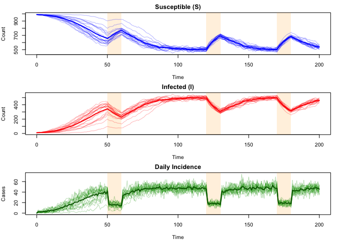
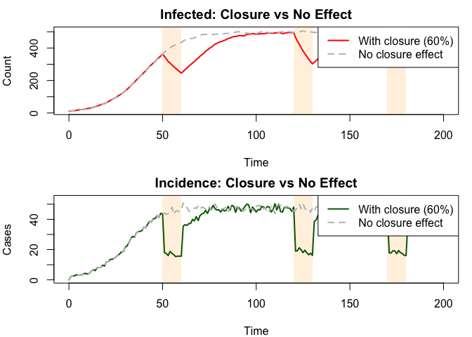
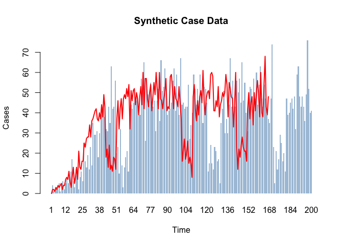
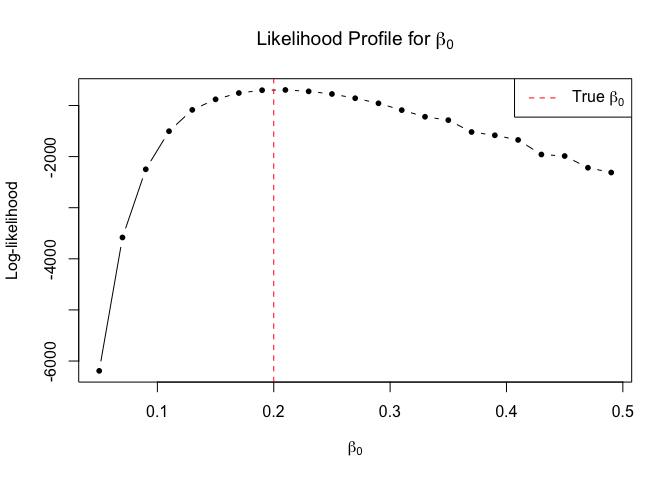
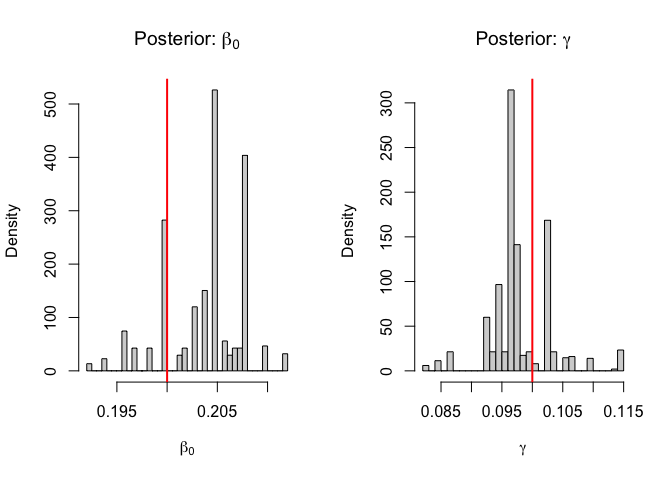
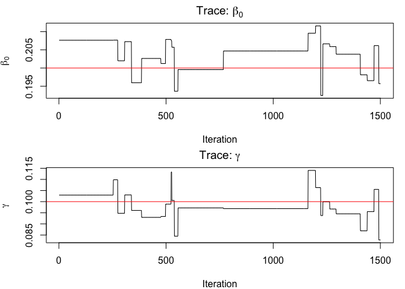

# SIS Model with School Closure


## Introduction

R companion to the Julia school closure vignette. We model an SIS
epidemic where school closures reduce the effective transmission rate
via a step-function schedule.

``` r
library(odin2)
library(dust2)
library(monty)
```

## Model Definition

``` r
sis <- odin({
  update(S) <- S - n_SI + n_IS
  update(I) <- I + n_SI - n_IS

  initial(S) <- N - I0
  initial(I) <- I0

  initial(incidence, zero_every = 1) <- 0
  update(incidence) <- incidence + n_SI

  schools <- interpolate(schools_time, schools_open, "constant")
  schools_time[] <- parameter()
  schools_open[] <- parameter()
  dim(schools_time, schools_open) <- parameter(rank = 1)

  beta <- ((1 - schools) * (1 - schools_modifier) + schools) * beta0
  p_SI <- 1 - exp(-beta * I / N * dt)
  p_IS <- 1 - exp(-gamma * dt)
  n_SI <- Binomial(S, p_SI)
  n_IS <- Binomial(I, p_IS)

  N <- parameter(1000)
  I0 <- parameter(10)
  beta0 <- parameter(0.2)
  gamma <- parameter(0.1)
  schools_modifier <- parameter(0.6)

  cases <- data()
  cases ~ Poisson(incidence + 1e-6)
})
```

    Warning in odin({: Found 2 compatibility issues
    Drop arrays from lhs of assignments from 'parameter()'
    ✖ schools_time[] <- parameter()
    ✔ schools_time <- parameter()
    ✖ schools_open[] <- parameter()
    ✔ schools_open <- parameter()

    ✔ Wrote 'DESCRIPTION'

    ✔ Wrote 'NAMESPACE'

    ✔ Wrote 'R/dust.R'

    ✔ Wrote 'src/dust.cpp'

    ✔ Wrote 'src/Makevars'

    ℹ 27 functions decorated with [[cpp11::register]]

    ✔ generated file 'cpp11.R'

    ✔ generated file 'cpp11.cpp'

    ℹ Re-compiling odin.system57fa449a

    ── R CMD INSTALL ───────────────────────────────────────────────────────────────
    * installing *source* package ‘odin.system57fa449a’ ...
    ** this is package ‘odin.system57fa449a’ version ‘0.0.1’
    ** using staged installation
    ** libs
    using C++ compiler: ‘Homebrew clang version 21.1.5’
    using SDK: ‘MacOSX15.5.sdk’
    clang++ -arch arm64 -std=gnu++17 -I"/Library/Frameworks/R.framework/Resources/include" -DNDEBUG  -I'/Library/Frameworks/R.framework/Versions/4.5-arm64/Resources/library/cpp11/include' -I'/Library/Frameworks/R.framework/Versions/4.5-arm64/Resources/library/dust2/include' -I'/Library/Frameworks/R.framework/Versions/4.5-arm64/Resources/library/monty/include' -I/opt/R/arm64/include   -DHAVE_INLINE   -fPIC  -falign-functions=64 -Wall -g -O2  -Wall -pedantic  -c cpp11.cpp -o cpp11.o
    clang++ -arch arm64 -std=gnu++17 -I"/Library/Frameworks/R.framework/Resources/include" -DNDEBUG  -I'/Library/Frameworks/R.framework/Versions/4.5-arm64/Resources/library/cpp11/include' -I'/Library/Frameworks/R.framework/Versions/4.5-arm64/Resources/library/dust2/include' -I'/Library/Frameworks/R.framework/Versions/4.5-arm64/Resources/library/monty/include' -I/opt/R/arm64/include   -DHAVE_INLINE   -fPIC  -falign-functions=64 -Wall -g -O2  -Wall -pedantic  -c dust.cpp -o dust.o
    In file included from dust.cpp:119:
    In file included from /Library/Frameworks/R.framework/Versions/4.5-arm64/Resources/library/dust2/include/dust2/r/discrete/system.hpp:5:
    /Library/Frameworks/R.framework/Versions/4.5-arm64/Resources/library/monty/include/monty/r/random.hpp:60:43: warning: implicit conversion from 'type' (aka 'unsigned long') to 'double' changes value from 18446744073709551615 to 18446744073709551616 [-Wimplicit-const-int-float-conversion]
       60 |       std::ceil(std::abs(::unif_rand()) * std::numeric_limits<size_t>::max());
          |                                         ~ ^~~~~~~~~~~~~~~~~~~~~~~~~~~~~~~~~~
    /Library/Frameworks/R.framework/Versions/4.5-arm64/Resources/library/monty/include/monty/r/random.hpp:60:43: warning: implicit conversion from 'type' (aka 'unsigned long') to 'double' changes value from 18446744073709551615 to 18446744073709551616 [-Wimplicit-const-int-float-conversion]
       60 |       std::ceil(std::abs(::unif_rand()) * std::numeric_limits<size_t>::max());
          |                                         ~ ^~~~~~~~~~~~~~~~~~~~~~~~~~~~~~~~~~
    /Library/Frameworks/R.framework/Versions/4.5-arm64/Resources/library/dust2/include/dust2/r/discrete/system.hpp:41:33: note: in instantiation of function template specialization 'monty::random::r::as_rng_seed<monty::random::xoshiro_state<unsigned long long, 4, monty::random::scrambler::plus>>' requested here
       41 |   auto seed = monty::random::r::as_rng_seed<rng_state_type>(r_seed);
          |                                 ^
    dust.cpp:125:20: note: in instantiation of function template specialization 'dust2::r::dust2_discrete_alloc<odin_system>' requested here
      125 |   return dust2::r::dust2_discrete_alloc<odin_system>(r_pars, r_time, r_time_control, r_n_particles, r_n_groups, r_seed, r_deterministic, r_n_threads);
          |                    ^
    2 warnings generated.
    clang++ -arch arm64 -std=gnu++17 -dynamiclib -Wl,-headerpad_max_install_names -undefined dynamic_lookup -L/Library/Frameworks/R.framework/Resources/lib -L/opt/R/arm64/lib -o odin.system57fa449a.so cpp11.o dust.o -F/Library/Frameworks/R.framework/.. -framework R
    installing to /private/var/folders/yh/30rj513j6mn1n7x556c2v4w80000gn/T/RtmpelHHnc/devtools_install_129c92db7d673/00LOCK-dust_129c94cdf5831/00new/odin.system57fa449a/libs
    ** checking absolute paths in shared objects and dynamic libraries
    * DONE (odin.system57fa449a)

    ℹ Loading odin.system57fa449a

## School Schedule and Parameters

``` r
schools_time <- c(0, 50, 60, 120, 130, 170, 180)
schools_open <- c(1,  0,  1,   0,   1,   0,   1)

pars <- list(
  schools_time = schools_time,
  schools_open = schools_open,
  schools_modifier = 0.6,
  beta0 = 0.2,
  gamma = 0.1,
  N = 1000,
  I0 = 10
)
```

## Simulation

``` r
times <- seq(0, 200, by = 1)

sys <- dust_system_create(sis, pars, n_particles = 20, dt = 1, seed = 42)
dust_system_set_state_initial(sys)
result <- dust_system_simulate(sys, times)

dim(result)  # n_state × n_particles × n_times
```

    [1]   3  20 201

## Visualisation

``` r
closure_lo <- c(50, 120, 170)
closure_hi <- c(60, 130, 180)

add_closures <- function() {
  for (i in seq_along(closure_lo)) {
    rect(closure_lo[i], par("usr")[3], closure_hi[i], par("usr")[4],
         col = rgb(1, 0.65, 0, 0.15), border = NA)
  }
}

par(mfrow = c(3, 1), mar = c(4, 4, 2, 1))

# S
plot(NULL, xlim = c(0, 200), ylim = range(result[1, , ]),
     xlab = "Time", ylab = "Count", main = "Susceptible (S)")
add_closures()
for (i in 1:20) lines(times, result[1, i, ], col = rgb(0, 0, 1, 0.3))
mean_S <- colMeans(result[1, , ])
lines(times, mean_S, col = "blue", lwd = 2)

# I
plot(NULL, xlim = c(0, 200), ylim = range(result[2, , ]),
     xlab = "Time", ylab = "Count", main = "Infected (I)")
add_closures()
for (i in 1:20) lines(times, result[2, i, ], col = rgb(1, 0, 0, 0.3))
mean_I <- colMeans(result[2, , ])
lines(times, mean_I, col = "red", lwd = 2)

# Incidence
plot(NULL, xlim = c(0, 200), ylim = range(result[3, , ]),
     xlab = "Time", ylab = "Cases", main = "Daily Incidence")
add_closures()
for (i in 1:20) lines(times, result[3, i, ], col = rgb(0, 0.6, 0, 0.3))
mean_inc <- colMeans(result[3, , ])
lines(times, mean_inc, col = "darkgreen", lwd = 2)
```



## Comparison: With vs Without School Closure

``` r
pars_no_closure <- modifyList(pars, list(schools_modifier = 0.0))

sys1 <- dust_system_create(sis, pars, n_particles = 20, dt = 1, seed = 1)
dust_system_set_state_initial(sys1)
r_closure <- dust_system_simulate(sys1, times)

sys2 <- dust_system_create(sis, pars_no_closure, n_particles = 20, dt = 1, seed = 1)
dust_system_set_state_initial(sys2)
r_no_closure <- dust_system_simulate(sys2, times)

par(mfrow = c(2, 1), mar = c(4, 4, 2, 1))

plot(NULL, xlim = c(0, 200), ylim = range(c(colMeans(r_closure[2, , ]),
     colMeans(r_no_closure[2, , ]))),
     xlab = "Time", ylab = "Count", main = "Infected: Closure vs No Effect")
add_closures()
lines(times, colMeans(r_closure[2, , ]), col = "red", lwd = 2)
lines(times, colMeans(r_no_closure[2, , ]), col = "gray", lwd = 2, lty = 2)
legend("topright", c("With closure (60%)", "No closure effect"),
       col = c("red", "gray"), lwd = 2, lty = 1:2)

plot(NULL, xlim = c(0, 200), ylim = range(c(colMeans(r_closure[3, , ]),
     colMeans(r_no_closure[3, , ]))),
     xlab = "Time", ylab = "Cases", main = "Incidence: Closure vs No Effect")
add_closures()
lines(times, colMeans(r_closure[3, , ]), col = "darkgreen", lwd = 2)
lines(times, colMeans(r_no_closure[3, , ]), col = "gray", lwd = 2, lty = 2)
legend("topright", c("With closure (60%)", "No closure effect"),
       col = c("darkgreen", "gray"), lwd = 2, lty = 1:2)
```



## Generate Synthetic Data

``` r
set.seed(42)
sys_truth <- dust_system_create(sis, pars, n_particles = 1, dt = 1, seed = 101)
dust_system_set_state_initial(sys_truth)
truth <- dust_system_simulate(sys_truth, times)

true_incidence <- truth[3, -1]
observed_cases <- rpois(length(true_incidence), pmax(true_incidence, 1e-6))

par(mfrow = c(1, 1))
barplot(observed_cases, names.arg = times[-1], col = rgb(0.27, 0.51, 0.71, 0.5),
        border = NA, xlab = "Time", ylab = "Cases", main = "Synthetic Case Data")
lines(seq_along(observed_cases), true_incidence, col = "red", lwd = 2)
```



## Particle Filter

``` r
data <- data.frame(time = times[-1], cases = observed_cases)

filter <- dust_filter_create(sis, time_start = 0, data = data,
                             n_particles = 100, seed = 42)

ll <- dust_likelihood_run(filter, pars)
cat("Log-likelihood at true parameters:", round(ll, 2), "\n")
```

    Log-likelihood at true parameters: -692.54 

### Likelihood Profile for β₀

``` r
beta0s <- seq(0.05, 0.5, by = 0.02)
lls <- numeric(length(beta0s))
for (i in seq_along(beta0s)) {
  test_pars <- modifyList(pars, list(beta0 = beta0s[i]))
  lls[i] <- dust_likelihood_run(filter, test_pars)
}

plot(beta0s, lls, type = "b", pch = 16, cex = 0.8,
     xlab = expression(beta[0]), ylab = "Log-likelihood",
     main = expression("Likelihood Profile for " * beta[0]))
abline(v = 0.2, lty = 2, col = "red")
legend("topright", expression("True " * beta[0]), lty = 2, col = "red")
```



## Bayesian Inference

``` r
packer <- monty_packer(c("beta0", "gamma"),
                       fixed = list(N = 1000, I0 = 10,
                                    schools_time = schools_time,
                                    schools_open = schools_open,
                                    schools_modifier = 0.6))

likelihood <- dust_likelihood_monty(filter, packer)

prior <- monty_dsl({
  beta0 ~ Gamma(shape = 2, rate = 10)
  gamma ~ Gamma(shape = 2, rate = 20)
})

posterior <- likelihood + prior
```

``` r
vcv <- matrix(c(0.002, 0, 0, 0.001), 2, 2)
sampler <- monty_sampler_random_walk(vcv)

samples <- monty_sample(posterior, sampler, 2000, initial = c(0.15, 0.08))
```

    ⡀⠀ Sampling  ■                                |   0% ETA: 31s

    ⠄⠀ Sampling  ■■■                              |   7% ETA:  8s

    ⢂⠀ Sampling  ■■■■■■■■■■■■■■                   |  42% ETA:  5s

    ⡂⠀ Sampling  ■■■■■■■■■■■■■■■■■■■■■■■■         |  76% ETA:  2s

    ✔ Sampled 2000 steps across 1 chain in 8.8s

### Posterior Summaries

``` r
beta0_samples <- samples$pars[1, 500:2000, 1]
gamma_samples <- samples$pars[2, 500:2000, 1]

cat("β₀: mean =", round(mean(beta0_samples), 4),
    ", 95% CI = [", round(quantile(beta0_samples, 0.025), 4),
    ",", round(quantile(beta0_samples, 0.975), 4), "]\n")
```

    β₀: mean = 0.2038 , 95% CI = [ 0.196 , 0.2096 ]

``` r
cat("γ:  mean =", round(mean(gamma_samples), 4),
    ", 95% CI = [", round(quantile(gamma_samples, 0.025), 4),
    ",", round(quantile(gamma_samples, 0.975), 4), "]\n")
```

    γ:  mean = 0.0981 , 95% CI = [ 0.0869 , 0.1116 ]

``` r
cat("True: β₀ = 0.2, γ = 0.1\n")
```

    True: β₀ = 0.2, γ = 0.1

``` r
par(mfrow = c(1, 2))
hist(beta0_samples, breaks = 30, main = expression("Posterior: " * beta[0]),
     xlab = expression(beta[0]), probability = TRUE)
abline(v = 0.2, col = "red", lwd = 2)

hist(gamma_samples, breaks = 30, main = expression("Posterior: " * gamma),
     xlab = expression(gamma), probability = TRUE)
abline(v = 0.1, col = "red", lwd = 2)
```



### Trace Plots

``` r
par(mfrow = c(2, 1), mar = c(4, 4, 2, 1))
plot(beta0_samples, type = "l", xlab = "Iteration",
     ylab = expression(beta[0]), main = expression("Trace: " * beta[0]))
abline(h = 0.2, col = "red")

plot(gamma_samples, type = "l", xlab = "Iteration",
     ylab = expression(gamma), main = expression("Trace: " * gamma))
abline(h = 0.1, col = "red")
```



## Benchmark

``` r
bench::mark(
  simulation = {
    s <- dust_system_create(sis, pars, n_particles = 20, dt = 1, seed = 1)
    dust_system_set_state_initial(s)
    dust_system_simulate(s, times)
  },
  filter = dust_likelihood_run(filter, pars),
  check = FALSE, min_iterations = 10
)
```

    # A tibble: 2 × 6
      expression      min   median `itr/sec` mem_alloc `gc/sec`
      <bch:expr> <bch:tm> <bch:tm>     <dbl> <bch:byt>    <dbl>
    1 simulation    901µs 987.57µs      965.     107KB     12.5
    2 filter        3.8ms   4.05ms      247.        0B      0  
