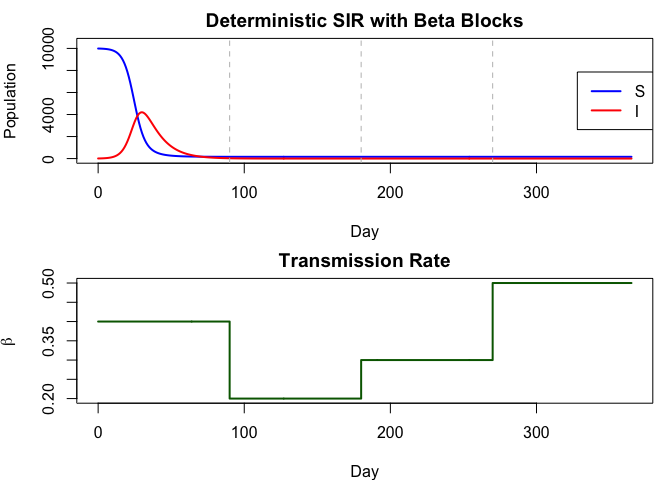
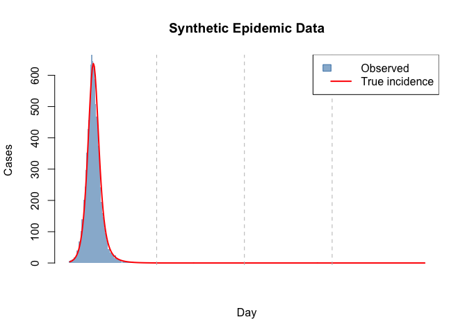
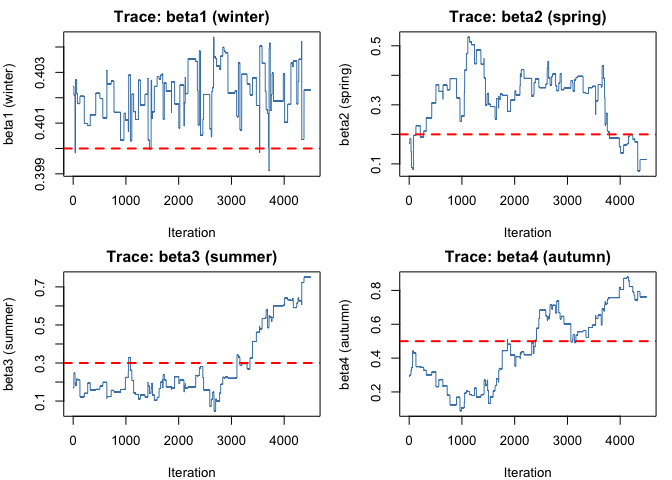
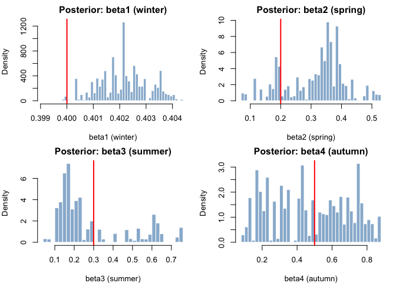
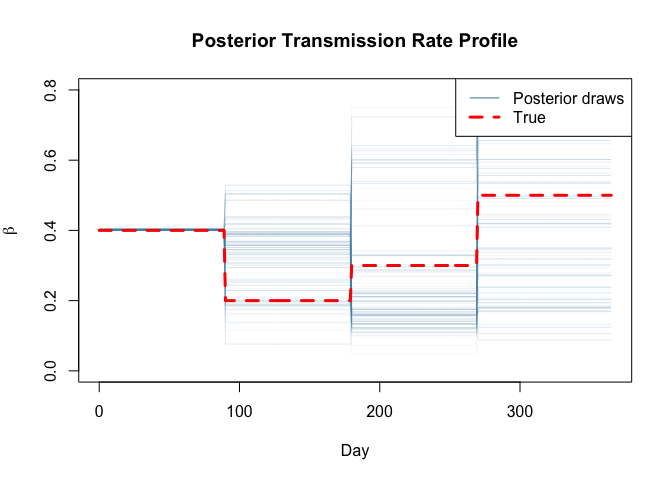

# Piecewise-Constant Transmission Rate (Beta Blocks)


## Introduction

Many infectious disease outbreaks exhibit time-varying transmission due
to seasonality, interventions, or behavioural changes. A common approach
is to model the transmission rate β as a **piecewise-constant** (step)
function over predefined time intervals — “beta blocks”.

This vignette demonstrates fitting a deterministic discrete-time SIR
model with piecewise-constant β to synthetic Poisson-observed case data
using odin2/dust2/monty.

``` r
library(odin2)
library(dust2)
library(monty)
set.seed(42)
```

## Model Definition

The model is **deterministic** — `new_inf = S * p_SI` (continuous, not
Binomial). This makes the likelihood exact with a single particle.

``` r
sir_beta_blocks <- odin({
  # State updates (deterministic)
  update(S) <- S - new_inf
  update(I) <- I + new_inf - new_rec
  initial(S) <- N - I0
  initial(I) <- I0

  # Incidence resets each integer time step
  initial(incidence, zero_every = 1) <- 0
  update(incidence) <- new_inf

  # Deterministic transition probabilities
  p_SI <- 1 - exp(-beta_t * I / N * dt)
  p_IR <- 1 - exp(-gamma * dt)
  new_inf <- S * p_SI
  new_rec <- I * p_IR

  # Piecewise-constant transmission rate
  beta_times[] <- parameter()
  beta_values[] <- parameter()
  dim(beta_times, beta_values) <- parameter(rank = 1)
  beta_t <- interpolate(beta_times, beta_values, "constant")

  # Fixed parameters
  N <- parameter()
  I0 <- parameter()
  gamma <- parameter()

  # Data comparison
  cases <- data()
  cases ~ Poisson(incidence + 1e-6)
})
```

    Warning in odin({: Found 2 compatibility issues
    Drop arrays from lhs of assignments from 'parameter()'
    ✖ beta_times[] <- parameter()
    ✔ beta_times <- parameter()
    ✖ beta_values[] <- parameter()
    ✔ beta_values <- parameter()

    ✔ Wrote 'DESCRIPTION'

    ✔ Wrote 'NAMESPACE'

    ✔ Wrote 'R/dust.R'

    ✔ Wrote 'src/dust.cpp'

    ✔ Wrote 'src/Makevars'

    ℹ 27 functions decorated with [[cpp11::register]]

    ✔ generated file 'cpp11.R'

    ✔ generated file 'cpp11.cpp'

    ℹ Re-compiling odin.systemeb479400

    ── R CMD INSTALL ───────────────────────────────────────────────────────────────
    * installing *source* package ‘odin.systemeb479400’ ...
    ** this is package ‘odin.systemeb479400’ version ‘0.0.1’
    ** using staged installation
    ** libs
    using C++ compiler: ‘Homebrew clang version 21.1.5’
    using SDK: ‘MacOSX15.5.sdk’
    clang++ -arch arm64 -std=gnu++17 -I"/Library/Frameworks/R.framework/Resources/include" -DNDEBUG  -I'/Library/Frameworks/R.framework/Versions/4.5-arm64/Resources/library/cpp11/include' -I'/Library/Frameworks/R.framework/Versions/4.5-arm64/Resources/library/dust2/include' -I'/Library/Frameworks/R.framework/Versions/4.5-arm64/Resources/library/monty/include' -I/opt/R/arm64/include   -DHAVE_INLINE   -fPIC  -falign-functions=64 -Wall -g -O2  -Wall -pedantic  -c cpp11.cpp -o cpp11.o
    clang++ -arch arm64 -std=gnu++17 -I"/Library/Frameworks/R.framework/Resources/include" -DNDEBUG  -I'/Library/Frameworks/R.framework/Versions/4.5-arm64/Resources/library/cpp11/include' -I'/Library/Frameworks/R.framework/Versions/4.5-arm64/Resources/library/dust2/include' -I'/Library/Frameworks/R.framework/Versions/4.5-arm64/Resources/library/monty/include' -I/opt/R/arm64/include   -DHAVE_INLINE   -fPIC  -falign-functions=64 -Wall -g -O2  -Wall -pedantic  -c dust.cpp -o dust.o
    In file included from dust.cpp:109:
    In file included from /Library/Frameworks/R.framework/Versions/4.5-arm64/Resources/library/dust2/include/dust2/r/discrete/system.hpp:5:
    /Library/Frameworks/R.framework/Versions/4.5-arm64/Resources/library/monty/include/monty/r/random.hpp:60:43: warning: implicit conversion from 'type' (aka 'unsigned long') to 'double' changes value from 18446744073709551615 to 18446744073709551616 [-Wimplicit-const-int-float-conversion]
       60 |       std::ceil(std::abs(::unif_rand()) * std::numeric_limits<size_t>::max());
          |                                         ~ ^~~~~~~~~~~~~~~~~~~~~~~~~~~~~~~~~~
    /Library/Frameworks/R.framework/Versions/4.5-arm64/Resources/library/monty/include/monty/r/random.hpp:60:43: warning: implicit conversion from 'type' (aka 'unsigned long') to 'double' changes value from 18446744073709551615 to 18446744073709551616 [-Wimplicit-const-int-float-conversion]
       60 |       std::ceil(std::abs(::unif_rand()) * std::numeric_limits<size_t>::max());
          |                                         ~ ^~~~~~~~~~~~~~~~~~~~~~~~~~~~~~~~~~
    /Library/Frameworks/R.framework/Versions/4.5-arm64/Resources/library/dust2/include/dust2/r/discrete/system.hpp:41:33: note: in instantiation of function template specialization 'monty::random::r::as_rng_seed<monty::random::xoshiro_state<unsigned long long, 4, monty::random::scrambler::plus>>' requested here
       41 |   auto seed = monty::random::r::as_rng_seed<rng_state_type>(r_seed);
          |                                 ^
    dust.cpp:115:20: note: in instantiation of function template specialization 'dust2::r::dust2_discrete_alloc<odin_system>' requested here
      115 |   return dust2::r::dust2_discrete_alloc<odin_system>(r_pars, r_time, r_time_control, r_n_particles, r_n_groups, r_seed, r_deterministic, r_n_threads);
          |                    ^
    2 warnings generated.
    clang++ -arch arm64 -std=gnu++17 -dynamiclib -Wl,-headerpad_max_install_names -undefined dynamic_lookup -L/Library/Frameworks/R.framework/Resources/lib -L/opt/R/arm64/lib -o odin.systemeb479400.so cpp11.o dust.o -F/Library/Frameworks/R.framework/.. -framework R
    installing to /private/var/folders/yh/30rj513j6mn1n7x556c2v4w80000gn/T/Rtmpmxo8ou/devtools_install_1394474b7ad71/00LOCK-dust_1394445b76e0e/00new/odin.systemeb479400/libs
    ** checking absolute paths in shared objects and dynamic libraries
    * DONE (odin.systemeb479400)

    ℹ Loading odin.systemeb479400

## Simulation Scenario

Four seasonal β blocks over one year (365 days):

| Period | Days    | β   | Interpretation        |
|--------|---------|-----|-----------------------|
| Winter | 0–89    | 0.4 | Moderate transmission |
| Spring | 90–179  | 0.2 | Low transmission      |
| Summer | 180–269 | 0.3 | Rising transmission   |
| Autumn | 270–364 | 0.5 | High transmission     |

``` r
true_pars <- list(
  beta_times = c(0, 90, 180, 270),
  beta_values = c(0.4, 0.2, 0.3, 0.5),
  N = 10000,
  I0 = 10,
  gamma = 0.1
)

times <- seq(0, 365, by = 1)

sys <- dust_system_create(sir_beta_blocks, true_pars, dt = 1, seed = 1)
dust_system_set_state_initial(sys)
result <- dust_system_simulate(sys, times)
```

## Visualising the Simulation

``` r
par(mfrow = c(2, 1), mar = c(4, 4, 2, 1))

plot(times, result[1, ], type = "l", col = "blue", lwd = 2,
     xlab = "Day", ylab = "Population",
     main = "Deterministic SIR with Beta Blocks",
     ylim = c(0, max(result[1, ]) * 1.05))
lines(times, result[2, ], col = "red", lwd = 2)
abline(v = c(90, 180, 270), lty = 2, col = "gray")
legend("right", legend = c("S", "I"), col = c("blue", "red"), lwd = 2)

# Transmission rate profile
beta_profile <- ifelse(times < 90, 0.4,
                ifelse(times < 180, 0.2,
                ifelse(times < 270, 0.3, 0.5)))
plot(times, beta_profile, type = "s", col = "darkgreen", lwd = 2,
     xlab = "Day", ylab = expression(beta),
     main = "Transmission Rate")
```



## Generate Synthetic Case Data

``` r
true_incidence <- result[3, -1]  # incidence at times 1..365
observed_cases <- rpois(length(true_incidence),
                        pmax(true_incidence, 1e-6))

par(mfrow = c(1, 1))
barplot(observed_cases, col = adjustcolor("steelblue", 0.6),
        border = NA, space = 0,
        xlab = "Day", ylab = "Cases",
        main = "Synthetic Epidemic Data")
lines(seq_along(true_incidence), true_incidence, col = "red", lwd = 2)
abline(v = c(90, 180, 270), lty = 2, col = "gray")
legend("topright", legend = c("Observed", "True incidence"),
       fill = c(adjustcolor("steelblue", 0.6), NA),
       border = c("steelblue", NA),
       lwd = c(NA, 2), col = c(NA, "red"))
```



## Inference Setup

### Prepare filter data

``` r
data <- data.frame(time = times[-1], cases = observed_cases)
```

### Parameter packer

The packer maps four scalar β parameters to the `beta_values` array
expected by the model.

``` r
packer <- monty_packer(
  c("beta1", "beta2", "beta3", "beta4"),
  fixed = list(
    N = 10000,
    I0 = 10,
    gamma = 0.1,
    beta_times = c(0, 90, 180, 270)
  ),
  process = function(x) {
    list(beta_values = c(x$beta1, x$beta2, x$beta3, x$beta4))
  }
)
```

### Likelihood

``` r
filter <- dust_filter_create(sir_beta_blocks, time_start = 0, data = data,
                             n_particles = 1, seed = 1)
likelihood <- dust_likelihood_monty(filter, packer)
```

### Prior

``` r
prior <- monty_dsl({
  beta1 ~ Gamma(shape = 4, rate = 10)
  beta2 ~ Gamma(shape = 4, rate = 10)
  beta3 ~ Gamma(shape = 4, rate = 10)
  beta4 ~ Gamma(shape = 4, rate = 10)
})
```

### Posterior

``` r
posterior <- likelihood + prior
```

### Check likelihood at truth

``` r
theta_true <- c(0.4, 0.2, 0.3, 0.5)
cat("Log-likelihood at true parameters:",
    monty_model_density(likelihood, theta_true), "\n")
```

    Log-likelihood at true parameters: -243.4114 

## Run MCMC

``` r
vcv <- diag(rep(0.002, 4))
sampler <- monty_sampler_random_walk(vcv)

samples <- monty_sample(posterior, sampler, 5000,
                        initial = theta_true, n_chains = 1,
                        burnin = 500)
```

    ⡀⠀ Sampling  ■                                |   0% ETA: 31s

    ⠄⠀ Sampling  ■■■■■■■■■■■■■■■■■■■■■■■■■        |  82% ETA:  0s

    ✔ Sampled 5000 steps across 1 chain in 735ms

## Results

### Parameter Recovery

``` r
par_names <- c("beta1 (winter)", "beta2 (spring)",
               "beta3 (summer)", "beta4 (autumn)")
for (i in 1:4) {
  vals <- samples$pars[i, , 1]
  cat(sprintf("  %s: %.3f [%.3f, %.3f]  (true = %.1f)\n",
              par_names[i], mean(vals),
              quantile(vals, 0.025), quantile(vals, 0.975),
              theta_true[i]))
}
```

      beta1 (winter): 0.402 [0.400, 0.404]  (true = 0.4)
      beta2 (spring): 0.316 [0.115, 0.504]  (true = 0.2)
      beta3 (summer): 0.285 [0.100, 0.751]  (true = 0.3)
      beta4 (autumn): 0.472 [0.124, 0.823]  (true = 0.5)

### Trace Plots

``` r
par(mfrow = c(2, 2), mar = c(4, 4, 2, 1))
for (i in 1:4) {
  plot(samples$pars[i, , 1], type = "l", col = "steelblue",
       xlab = "Iteration", ylab = par_names[i],
       main = paste("Trace:", par_names[i]))
  abline(h = theta_true[i], col = "red", lwd = 2, lty = 2)
}
```



### Posterior Distributions

``` r
par(mfrow = c(2, 2), mar = c(4, 4, 2, 1))
for (i in 1:4) {
  hist(samples$pars[i, , 1], breaks = 40, probability = TRUE,
       col = adjustcolor("steelblue", 0.6), border = "white",
       main = paste("Posterior:", par_names[i]),
       xlab = par_names[i])
  abline(v = theta_true[i], col = "red", lwd = 2)
}
```



### Fitted Transmission Rate

``` r
par(mfrow = c(1, 1))
n_draw <- 200
idx <- sample(dim(samples$pars)[2], n_draw, replace = TRUE)
plot(NULL, xlim = c(0, 365), ylim = c(0, 0.8),
     xlab = "Day", ylab = expression(beta),
     main = "Posterior Transmission Rate Profile")
for (j in 1:n_draw) {
  b <- samples$pars[, idx[j], 1]
  profile <- ifelse(times < 90, b[1],
             ifelse(times < 180, b[2],
             ifelse(times < 270, b[3], b[4])))
  lines(times, profile, col = adjustcolor("steelblue", 0.05))
}
lines(times, beta_profile, col = "red", lwd = 3, lty = 2)
legend("topright", legend = c("Posterior draws", "True"),
       col = c("steelblue", "red"), lwd = c(1, 3), lty = c(1, 2))
```



## Summary

| Feature | R syntax |
|----|----|
| Deterministic update | `new_inf <- S * p_SI` |
| Piecewise-constant β | `interpolate(beta_times, beta_values, "constant")` |
| Array dimensions | `dim(beta_times, beta_values) <- parameter(rank = 1)` |
| Poisson observation | `cases ~ Poisson(incidence + 1e-6)` |
| Exact likelihood | `dust_filter_create(..., n_particles = 1)` |
| Process function | `process = function(x) list(beta_values = c(...))` |
| Prior (monty DSL) | `beta1 ~ Gamma(shape = 4, rate = 10)` |
| MCMC | `monty_sampler_random_walk(vcv)` |

Both the Julia and R versions produce equivalent results using the same
model structure and inference approach.
