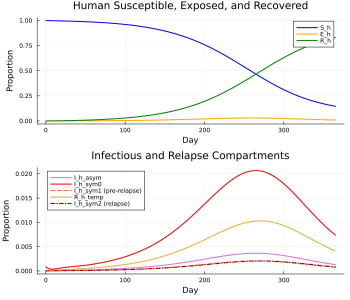
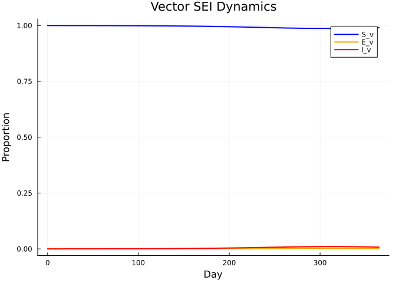
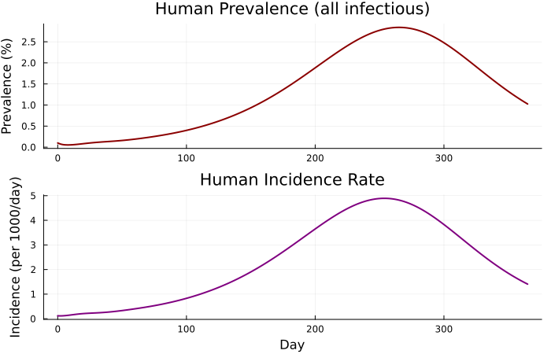
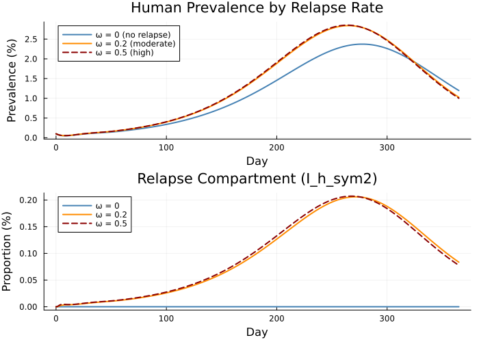

# Oropouche (OROV) Vector-Borne Model with Relapse


## Introduction

Oropouche virus (OROV) is an arbovirus transmitted by biting midges
(*Culicoides paraensis*) and is the second most common arboviral disease
in Brazil after dengue. A distinctive clinical feature is **relapse**: a
fraction of symptomatic patients experience a recurrence of symptoms
after an initial period of apparent recovery.

This vignette builds an ODE model coupling human and vector compartments
with a relapse pathway. It demonstrates:

- Coupled human and vector ODE dynamics
- An **Erlang-chain delay** to approximate the extrinsic incubation
  period (since `delay()` is not available in Odin.jl)
- Asymptotic vs symptomatic infection
- Relapse dynamics: recovered individuals can experience a second
  symptomatic episode
- Scenario comparison across relapse probabilities

``` julia
using Odin
using Plots
using BenchmarkTools
```

## Model Description

### Human compartments

The human population is split into 8 compartments, all expressed as
proportions of the total human population ($N_h = 1$):

$$\begin{aligned}
\frac{dS_h}{dt} &= -\lambda_h S_h \\
\frac{dE_h}{dt} &= \lambda_h S_h - \gamma E_h \\
\frac{dI_h^{\text{asym}}}{dt} &= (1 - \theta)\,\gamma E_h - \sigma I_h^{\text{asym}} \\
\frac{dI_h^{\text{sym0}}}{dt} &= \theta\,\gamma E_h - \sigma I_h^{\text{sym0}} \\
\frac{dI_h^{\text{sym1}}}{dt} &= \pi_r\,\sigma I_h^{\text{sym0}} - \psi I_h^{\text{sym1}} \\
\frac{dR_h^{\text{temp}}}{dt} &= \psi I_h^{\text{sym1}} - \omega R_h^{\text{temp}} \\
\frac{dI_h^{\text{sym2}}}{dt} &= \omega R_h^{\text{temp}} - \epsilon I_h^{\text{sym2}} \\
\frac{dR_h}{dt} &= \sigma I_h^{\text{asym}} + (1 - \pi_r)\,\sigma I_h^{\text{sym0}} + \epsilon I_h^{\text{sym2}}
\end{aligned}$$

where $\lambda_h = m \cdot a \cdot b_h \cdot I_v$ is the force of
infection from vectors to humans.

### Vector compartments

Vectors follow an SEI model (no recovery), with an **Erlang-chain
delay** approximating the extrinsic incubation period (EIP). Instead of
`delay(I_h_total, τ)` we use $k = 12$ stages, each with rate $k / \tau$:

$$\begin{aligned}
\frac{dS_v}{dt} &= \mu (1 - S_v) - \lambda_v S_v \\
\frac{dE_v}{dt} &= \lambda_v \cdot D_{S_v}[12] - (\mu + \kappa) E_v \\
\frac{dI_v}{dt} &= \kappa E_v - \mu I_v
\end{aligned}$$

where $\lambda_v = a \cdot b_v \cdot D_{I_h}[12]$ uses the delayed total
human infectiousness via the Erlang chain, and $D_{S_v}[12]$ tracks the
delayed susceptible vector proportion.

### Erlang chain delay

Each delay chain has $k = 12$ stages with rate $k / \tau$ per stage
(mean delay = $\tau$ days):

$$\frac{dD[1]}{dt} = (X - D[1]) \cdot \frac{k}{\tau}, \quad
\frac{dD[i]}{dt} = (D[i-1] - D[i]) \cdot \frac{k}{\tau} \text{ for } i = 2, \ldots, 12$$

## Model Definition

``` julia
gen = @odin begin
    # Erlang chain parameters
    k_delay = parameter(12)
    delay_rate = k_delay / delay_tau
    delay_tau = parameter(12.0)

    # === Erlang chain: delayed total human infectiousness ===
    dim(D_Ih) = k_delay
    I_h_total = I_h_asym + I_h_sym0 + I_h_sym1 + I_h_sym2
    deriv(D_Ih[1]) = (I_h_total - D_Ih[1]) * delay_rate
    deriv(D_Ih[2:k_delay]) = (D_Ih[i - 1] - D_Ih[i]) * delay_rate
    initial(D_Ih[1:k_delay]) = I_init_h

    # === Erlang chain: delayed susceptible vectors ===
    dim(D_Sv) = k_delay
    deriv(D_Sv[1]) = (S_v - D_Sv[1]) * delay_rate
    deriv(D_Sv[2:k_delay]) = (D_Sv[i - 1] - D_Sv[i]) * delay_rate
    initial(D_Sv[1:k_delay]) = 1.0 - I_init_v

    # === Forces of infection ===
    lambda_h = m * a * b_h * I_v
    lambda_v = a * b_v * D_Ih[k_delay]

    # === Human dynamics (proportions) ===
    deriv(S_h) = -lambda_h * S_h
    deriv(E_h) = lambda_h * S_h - gamma * E_h
    deriv(I_h_asym) = (1.0 - theta) * gamma * E_h - sigma * I_h_asym
    deriv(I_h_sym0) = theta * gamma * E_h - sigma * I_h_sym0
    deriv(I_h_sym1) = pi_relapse * sigma * I_h_sym0 - psi * I_h_sym1
    deriv(R_h_temp) = psi * I_h_sym1 - omega * R_h_temp
    deriv(I_h_sym2) = omega * R_h_temp - epsilon * I_h_sym2
    deriv(R_h) = sigma * I_h_asym + (1.0 - pi_relapse) * sigma * I_h_sym0 + epsilon * I_h_sym2

    # === Vector dynamics (proportions) ===
    deriv(S_v) = mu * (1.0 - S_v) - lambda_v * S_v
    deriv(E_v) = lambda_v * D_Sv[k_delay] - (mu + kappa) * E_v
    deriv(I_v) = kappa * E_v - mu * I_v

    # === Outputs ===
    output(prevalence_h) = I_h_total
    output(incidence_h) = lambda_h * S_h
    output(prevalence_v) = I_v
    output(human_pop) = S_h + E_h + I_h_asym + I_h_sym0 + I_h_sym1 + R_h_temp + I_h_sym2 + R_h

    # === Initial conditions ===
    initial(S_h) = 1.0 - I_init_h
    initial(E_h) = 0.0
    initial(I_h_asym) = (1.0 - theta) * I_init_h
    initial(I_h_sym0) = theta * I_init_h
    initial(I_h_sym1) = 0.0
    initial(R_h_temp) = 0.0
    initial(I_h_sym2) = 0.0
    initial(R_h) = 0.0
    initial(S_v) = 1.0 - I_init_v
    initial(E_v) = 0.0
    initial(I_v) = I_init_v

    # === Parameters ===
    gamma = parameter(0.167)
    theta = parameter(0.85)
    pi_relapse = parameter(0.5)
    sigma = parameter(0.2)
    psi = parameter(1.0)
    epsilon = parameter(1.0)
    kappa = parameter(0.125)
    omega = parameter(0.2)
    mu = parameter(0.03)
    m = parameter(20.0)
    a = parameter(0.3)
    b_h = parameter(0.2)
    b_v = parameter(0.05)
    I_init_h = parameter(0.001)
    I_init_v = parameter(0.0001)
end
```

    DustSystemGenerator{var"##OdinModel#294"}(var"##OdinModel#294"(0, [:D_Ih, :D_Sv, :S_h, :E_h, :I_h_asym, :I_h_sym0, :I_h_sym1, :R_h_temp, :I_h_sym2, :R_h, :S_v, :E_v, :I_v], [:k_delay, :delay_tau, :gamma, :theta, :pi_relapse, :sigma, :psi, :epsilon, :kappa, :omega, :mu, :m, :a, :b_h, :b_v, :I_init_h, :I_init_v], true, false, true, false, Dict{Symbol, Array}()))

## Simulation

``` julia
pars = (
    k_delay = 12.0,
    gamma = 0.167,
    theta = 0.85,
    pi_relapse = 0.5,
    sigma = 0.2,
    psi = 1.0,
    epsilon = 1.0,
    kappa = 0.125,
    omega = 0.2,
    mu = 0.03,
    m = 20.0,
    a = 0.3,
    b_h = 0.2,
    b_v = 0.05,
    I_init_h = 0.001,
    I_init_v = 0.0001,
    delay_tau = 12.0,
)

sys = dust_system_create(gen, pars; n_particles = 1)
dust_system_set_state_initial!(sys)
times = collect(0.0:0.5:365.0)
result = dust_system_simulate(sys, times)
```

    39×1×731 Array{Float64, 3}:
    [:, :, 1] =
     0.001
     0.001
     0.001
     0.001
     0.001
     0.001
     0.001
     0.001
     0.001
     0.001
     ⋮
     0.0
     0.0
     0.9999
     0.0
     0.0001
     0.001
     0.00011988000000000002
     0.0001
     1.0

    [:, :, 2] =
     0.0009870975776440098
     0.000998026559001296
     0.0009999147744383838
     0.0009998798712333335
     0.0010000172625546358
     0.001000001030752342
     0.0009999997631437922
     0.0009999999624713265
     0.00099999999718668
     0.0009999999998426448
     ⋮
     2.94013425254667e-7
     5.4778909177471213e-5
     0.9998940455425156
     7.2160199298514365e-6
     9.873845982797075e-5
     0.0009392415160730842
     0.00011836061136865198
     9.873845982797075e-5
     1.0000000000000002

    [:, :, 3] =
     0.0009551010762017311
     0.0009873883874057386
     0.0009971047999367828
     0.0009995732785131929
     0.000999881487389212
     0.0009999893588576926
     0.0009999997402627117
     0.0010000000252925842
     0.0010000000030057734
     0.0010000000001937957
     ⋮
     1.5651766935802406e-6
     0.00010503562475833162
     0.9998881797793513
     1.38939158395385e-5
     9.792639301783065e-5
     0.0008771736434520672
     0.00011738024064203143
     9.792639301783065e-5
     0.9999999999999999

    ;;; … 

    [:, :, 729] =
     0.010625513849373908
     0.010814671739717611
     0.011006208497978872
     0.011200094532644604
     0.011396329474407274
     0.011594845356522812
     0.011795699556835942
     0.011998700090965524
     0.012204112934761752
     0.012411391133516992
     ⋮
     0.0008496473205421635
     0.8280568603707404
     0.9905412022003669
     0.0013656311389518736
     0.008089745407773975
     0.010438744951508042
     0.0014337851039764222
     0.008089745407773975
     0.9999999999999998

    [:, :, 730] =
     0.010532430762817124
     0.01072039143858126
     0.010910738193896787
     0.011103444734501661
     0.011298507642439462
     0.011495870133404482
     0.011695570845559344
     0.011897458007472743
     0.012101729503575485
     0.012307945942979176
     ⋮
     0.0008424314658002644
     0.8289850988912658
     0.9905877888519856
     0.0013550480634565197
     0.008053690303982014
     0.010346866555172928
     0.0014204986684814684
     0.008053690303982014
     0.9999999999999996

    [:, :, 731] =
     0.010439951128950659
     0.010626710061971205
     0.010815864587664356
     0.011007384267897179
     0.011201276062926072
     0.011397467655778494
     0.01159603081160791
     0.011796754456513348
     0.011999957520269512
     0.012204958576712133
     ⋮
     0.0008352572003581657
     0.8299052727709576
     0.9906344518275052
     0.0013445087341137341
     0.008017516522047968
     0.010255593784032069
     0.0014073168113784673
     0.008017516522047968
     0.9999999999999996

### Human Compartment Dynamics

The state indices follow the order of `initial()` declarations. The
first 12 states are the Erlang chain for $D_{I_h}$, then 12 for
$D_{S_v}$, then 8 human states, then 3 vector states, then 4 outputs.

``` julia
# State layout: D_Ih[1:12], D_Sv[1:12], S_h, E_h, I_h_asym, I_h_sym0,
#   I_h_sym1, R_h_temp, I_h_sym2, R_h, S_v, E_v, I_v, outputs...
idx_Sh = 25
idx_Eh = 26
idx_Iha = 27
idx_Ihs0 = 28
idx_Ihs1 = 29
idx_Rht = 30
idx_Ihs2 = 31
idx_Rh = 32

p1 = plot(times, result[idx_Sh, 1, :], label="S_h", lw=2, color=:blue)
plot!(p1, times, result[idx_Eh, 1, :], label="E_h", lw=2, color=:orange)
plot!(p1, times, result[idx_Rh, 1, :], label="R_h", lw=2, color=:green)
xlabel!(p1, "Day")
ylabel!(p1, "Proportion")
title!(p1, "Human Susceptible, Exposed, and Recovered")

p2 = plot(times, result[idx_Iha, 1, :], label="I_h_asym", lw=2, color=:orchid)
plot!(p2, times, result[idx_Ihs0, 1, :], label="I_h_sym0", lw=2, color=:red)
plot!(p2, times, result[idx_Ihs1, 1, :], label="I_h_sym1 (pre-relapse)", lw=2, color=:tomato, ls=:dash)
plot!(p2, times, result[idx_Rht, 1, :], label="R_h_temp", lw=2, color=:goldenrod, ls=:dot)
plot!(p2, times, result[idx_Ihs2, 1, :], label="I_h_sym2 (relapse)", lw=2, color=:darkred, ls=:dashdot)
xlabel!(p2, "Day")
ylabel!(p2, "Proportion")
title!(p2, "Infectious and Relapse Compartments")

plot(p1, p2, layout=(2, 1), size=(700, 600))
```



### Vector Dynamics

``` julia
idx_Sv = 33
idx_Ev = 34
idx_Iv = 35

plot(times, result[idx_Sv, 1, :], label="S_v", lw=2, color=:blue)
plot!(times, result[idx_Ev, 1, :], label="E_v", lw=2, color=:orange)
plot!(times, result[idx_Iv, 1, :], label="I_v", lw=2, color=:red)
xlabel!("Day")
ylabel!("Proportion")
title!("Vector SEI Dynamics")
```



### Derived Outputs

``` julia
idx_prev_h = 36
idx_inc_h = 37
idx_prev_v = 38
idx_pop_h = 39

l = @layout [a; b]

p1 = plot(times, result[idx_prev_h, 1, :] .* 100, lw=2, color=:darkred,
          ylabel="Prevalence (%)", label=nothing,
          title="Human Prevalence (all infectious)")

p2 = plot(times, result[idx_inc_h, 1, :] .* 1000, lw=2, color=:purple,
          xlabel="Day", ylabel="Incidence (per 1000/day)", label=nothing,
          title="Human Incidence Rate")

plot(p1, p2, layout=l, size=(700, 450))
```



## Scenario Comparison: Relapse Probability

We compare three relapse scenarios to illustrate the impact of the
relapse pathway on epidemic dynamics:

- **No relapse** ($\omega = 0$): relapse pathway is blocked
- **Moderate relapse** ($\omega = 0.2$): baseline, ~50% of symptomatic
  cases relapse
- **High relapse** ($\omega = 0.5$): faster return to illness

``` julia
pars_no_relapse = merge(pars, (omega = 0.0,))
sys_nr = dust_system_create(gen, pars_no_relapse; n_particles = 1)
dust_system_set_state_initial!(sys_nr)
res_nr = dust_system_simulate(sys_nr, times)

pars_high_relapse = merge(pars, (omega = 0.5,))
sys_hr = dust_system_create(gen, pars_high_relapse; n_particles = 1)
dust_system_set_state_initial!(sys_hr)
res_hr = dust_system_simulate(sys_hr, times)

p1 = plot(times, res_nr[idx_prev_h, 1, :] .* 100,
          label="ω = 0 (no relapse)", lw=2, color=:steelblue)
plot!(p1, times, result[idx_prev_h, 1, :] .* 100,
      label="ω = 0.2 (moderate)", lw=2, color=:darkorange)
plot!(p1, times, res_hr[idx_prev_h, 1, :] .* 100,
      label="ω = 0.5 (high)", lw=2, color=:darkred, ls=:dash)
xlabel!(p1, "Day")
ylabel!(p1, "Prevalence (%)")
title!(p1, "Human Prevalence by Relapse Rate")

p2 = plot(times, res_nr[idx_Ihs2, 1, :] .* 100,
          label="ω = 0", lw=2, color=:steelblue)
plot!(p2, times, result[idx_Ihs2, 1, :] .* 100,
      label="ω = 0.2", lw=2, color=:darkorange)
plot!(p2, times, res_hr[idx_Ihs2, 1, :] .* 100,
      label="ω = 0.5", lw=2, color=:darkred, ls=:dash)
xlabel!(p2, "Day")
ylabel!(p2, "Proportion (%)")
title!(p2, "Relapse Compartment (I_h_sym2)")

plot(p1, p2, layout=(2, 1), size=(700, 500))
```



When $\omega = 0$ the relapse pathway is blocked: $R_h^{\text{temp}}$
accumulates individuals but never releases them into
$I_h^{\text{sym2}}$. Higher $\omega$ produces a visible second wave of
symptomatic infection.

## Benchmark

``` julia
function run_orov(gen, pars, times)
    sys = dust_system_create(gen, pars; n_particles = 1)
    dust_system_set_state_initial!(sys)
    dust_system_simulate(sys, times)
end

# Warm-up
run_orov(gen, pars, times)

@benchmark run_orov($gen, $pars, $times)
```

    BenchmarkTools.Trial: 2683 samples with 1 evaluation per sample.
     Range (min … max):  1.352 ms …  14.958 ms  ┊ GC (min … max): 0.00% … 87.60%
     Time  (median):     1.774 ms               ┊ GC (median):    0.00%
     Time  (mean ± σ):   1.858 ms ± 573.445 μs  ┊ GC (mean ± σ):  2.65% ±  7.30%

            ▃▅█▇█▅▄▃▂▁                                             
      ▃▄▆▆▇▇██████████▇▆▅▄▄▃▃▃▃▂▂▂▃▂▂▂▂▂▂▂▂▂▂▂▂▂▂▂▂▂▂▂▂▂▂▂▂▁▂▂▂▂▂ ▃
      1.35 ms         Histogram: frequency by time        3.71 ms <

     Memory estimate: 475.91 KiB, allocs estimate: 357.

## Summary

| Feature             | Syntax                                                |
|---------------------|-------------------------------------------------------|
| Coupled ODE system  | `deriv(S_h) = ...`, `deriv(S_v) = ...`                |
| Erlang chain delay  | `deriv(D_Ih[1]) = (I_h_total - D_Ih[1]) * delay_rate` |
| Array indexing      | `D_Ih[k_delay]` to read last stage                    |
| Derived outputs     | `output(prevalence_h) = I_h_total`                    |
| Scenario comparison | `merge(pars, (omega = 0.0,))`                         |

This vignette demonstrated how Odin.jl handles a multi-species ODE
system with an Erlang-chain delay approximation and relapse dynamics.
The model can be extended with seasonal forcing, age structure, or
spatial coupling.
