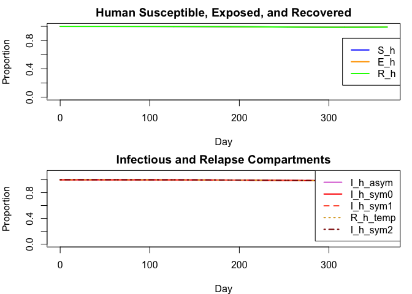
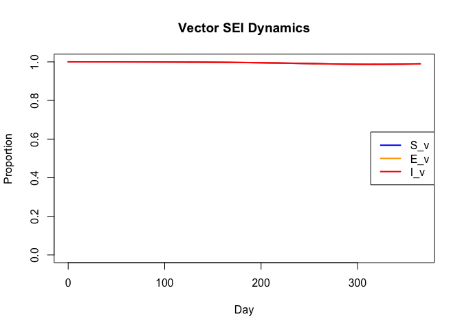
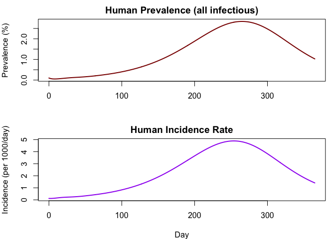
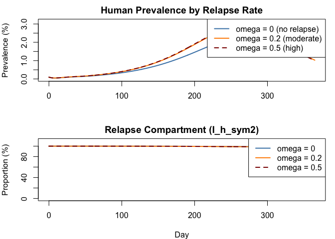

# Oropouche (OROV) Vector-Borne Model with Relapse


## Introduction

Matching the Julia vignette: an Oropouche virus (OROV) model coupling
human SEIR dynamics with a vector SEI model, featuring relapse and an
Erlang-chain approximation for the extrinsic incubation period.

``` r
library(odin2)
library(dust2)
```

## Model Definition

``` r
gen <- odin({
  # Erlang chain parameters
  k_delay <- parameter(12)
  chain_rate <- k_delay / chain_tau
  chain_tau <- parameter(12.0)

  # === Erlang chain: delayed total human infectiousness ===
  I_h_total <- I_h_asym + I_h_sym0 + I_h_sym1 + I_h_sym2
  deriv(D_Ih[1]) <- (I_h_total - D_Ih[1]) * chain_rate
  deriv(D_Ih[2:k_delay]) <- (D_Ih[i - 1] - D_Ih[i]) * chain_rate
  initial(D_Ih[1:k_delay]) <- I_init_h
  dim(D_Ih) <- k_delay

  # === Erlang chain: delayed susceptible vectors ===
  deriv(D_Sv[1]) <- (S_v - D_Sv[1]) * chain_rate
  deriv(D_Sv[2:k_delay]) <- (D_Sv[i - 1] - D_Sv[i]) * chain_rate
  initial(D_Sv[1:k_delay]) <- 1.0 - I_init_v
  dim(D_Sv) <- k_delay

  # === Forces of infection ===
  lambda_h <- m * a * b_h * I_v
  lambda_v <- a * b_v * D_Ih[k_delay]

  # === Human dynamics (proportions) ===
  deriv(S_h) <- -lambda_h * S_h
  deriv(E_h) <- lambda_h * S_h - gamma * E_h
  deriv(I_h_asym) <- (1.0 - theta) * gamma * E_h - sigma * I_h_asym
  deriv(I_h_sym0) <- theta * gamma * E_h - sigma * I_h_sym0
  deriv(I_h_sym1) <- pi_relapse * sigma * I_h_sym0 - psi * I_h_sym1
  deriv(R_h_temp) <- psi * I_h_sym1 - omega * R_h_temp
  deriv(I_h_sym2) <- omega * R_h_temp - epsilon * I_h_sym2
  deriv(R_h) <- sigma * I_h_asym + (1.0 - pi_relapse) * sigma * I_h_sym0 + epsilon * I_h_sym2

  # === Vector dynamics (proportions) ===
  deriv(S_v) <- mu * (1.0 - S_v) - lambda_v * S_v
  deriv(E_v) <- lambda_v * D_Sv[k_delay] - (mu + kappa) * E_v
  deriv(I_v) <- kappa * E_v - mu * I_v

  # === Outputs ===
  output(prevalence_h) <- I_h_total
  output(incidence_h) <- lambda_h * S_h
  output(prevalence_v) <- I_v
  output(human_pop) <- S_h + E_h + I_h_asym + I_h_sym0 + I_h_sym1 + R_h_temp + I_h_sym2 + R_h

  # === Initial conditions ===
  initial(S_h) <- 1.0 - I_init_h
  initial(E_h) <- 0.0
  initial(I_h_asym) <- (1.0 - theta) * I_init_h
  initial(I_h_sym0) <- theta * I_init_h
  initial(I_h_sym1) <- 0.0
  initial(R_h_temp) <- 0.0
  initial(I_h_sym2) <- 0.0
  initial(R_h) <- 0.0
  initial(S_v) <- 1.0 - I_init_v
  initial(E_v) <- 0.0
  initial(I_v) <- I_init_v

  # === Parameters ===
  gamma <- parameter(0.167)
  theta <- parameter(0.85)
  pi_relapse <- parameter(0.5)
  sigma <- parameter(0.2)
  psi <- parameter(1.0)
  epsilon <- parameter(1.0)
  kappa <- parameter(0.125)
  omega <- parameter(0.2)
  mu <- parameter(0.03)
  m <- parameter(20)
  a <- parameter(0.3)
  b_h <- parameter(0.2)
  b_v <- parameter(0.05)
  I_init_h <- parameter(0.001)
  I_init_v <- parameter(0.0001)
})
```

    ✔ Wrote 'DESCRIPTION'

    ✔ Wrote 'NAMESPACE'

    ✔ Wrote 'R/dust.R'

    ✔ Wrote 'src/dust.cpp'

    ✔ Wrote 'src/Makevars'

    ℹ 13 functions decorated with [[cpp11::register]]

    ✔ generated file 'cpp11.R'

    ✔ generated file 'cpp11.cpp'

    ℹ Re-compiling odin.systemcebb125b

    ── R CMD INSTALL ───────────────────────────────────────────────────────────────
    * installing *source* package ‘odin.systemcebb125b’ ...
    ** this is package ‘odin.systemcebb125b’ version ‘0.0.1’
    ** using staged installation
    ** libs
    using C++ compiler: ‘Homebrew clang version 21.1.5’
    using SDK: ‘MacOSX15.5.sdk’
    clang++ -arch arm64 -std=gnu++17 -I"/Library/Frameworks/R.framework/Resources/include" -DNDEBUG  -I'/Library/Frameworks/R.framework/Versions/4.5-arm64/Resources/library/cpp11/include' -I'/Library/Frameworks/R.framework/Versions/4.5-arm64/Resources/library/dust2/include' -I'/Library/Frameworks/R.framework/Versions/4.5-arm64/Resources/library/monty/include' -I/opt/R/arm64/include   -DHAVE_INLINE   -fPIC  -falign-functions=64 -Wall -g -O2  -Wall -pedantic  -c cpp11.cpp -o cpp11.o
    clang++ -arch arm64 -std=gnu++17 -I"/Library/Frameworks/R.framework/Resources/include" -DNDEBUG  -I'/Library/Frameworks/R.framework/Versions/4.5-arm64/Resources/library/cpp11/include' -I'/Library/Frameworks/R.framework/Versions/4.5-arm64/Resources/library/dust2/include' -I'/Library/Frameworks/R.framework/Versions/4.5-arm64/Resources/library/monty/include' -I/opt/R/arm64/include   -DHAVE_INLINE   -fPIC  -falign-functions=64 -Wall -g -O2  -Wall -pedantic  -c dust.cpp -o dust.o
    In file included from dust.cpp:215:
    In file included from /Library/Frameworks/R.framework/Versions/4.5-arm64/Resources/library/dust2/include/dust2/r/continuous/system.hpp:4:
    /Library/Frameworks/R.framework/Versions/4.5-arm64/Resources/library/monty/include/monty/r/random.hpp:60:43: warning: implicit conversion from 'type' (aka 'unsigned long') to 'double' changes value from 18446744073709551615 to 18446744073709551616 [-Wimplicit-const-int-float-conversion]
       60 |       std::ceil(std::abs(::unif_rand()) * std::numeric_limits<size_t>::max());
          |                                         ~ ^~~~~~~~~~~~~~~~~~~~~~~~~~~~~~~~~~
    /Library/Frameworks/R.framework/Versions/4.5-arm64/Resources/library/monty/include/monty/r/random.hpp:60:43: warning: implicit conversion from 'type' (aka 'unsigned long') to 'double' changes value from 18446744073709551615 to 18446744073709551616 [-Wimplicit-const-int-float-conversion]
       60 |       std::ceil(std::abs(::unif_rand()) * std::numeric_limits<size_t>::max());
          |                                         ~ ^~~~~~~~~~~~~~~~~~~~~~~~~~~~~~~~~~
    /Library/Frameworks/R.framework/Versions/4.5-arm64/Resources/library/dust2/include/dust2/r/continuous/system.hpp:34:33: note: in instantiation of function template specialization 'monty::random::r::as_rng_seed<monty::random::xoshiro_state<unsigned long long, 4, monty::random::scrambler::plus>>' requested here
       34 |   auto seed = monty::random::r::as_rng_seed<rng_state_type>(r_seed);
          |                                 ^
    dust.cpp:219:20: note: in instantiation of function template specialization 'dust2::r::dust2_continuous_alloc<odin_system>' requested here
      219 |   return dust2::r::dust2_continuous_alloc<odin_system>(r_pars, r_time, r_time_control, r_n_particles, r_n_groups, r_seed, r_deterministic, r_n_threads);
          |                    ^
    2 warnings generated.
    clang++ -arch arm64 -std=gnu++17 -dynamiclib -Wl,-headerpad_max_install_names -undefined dynamic_lookup -L/Library/Frameworks/R.framework/Resources/lib -L/opt/R/arm64/lib -o odin.systemcebb125b.so cpp11.o dust.o -F/Library/Frameworks/R.framework/.. -framework R
    installing to /private/var/folders/yh/30rj513j6mn1n7x556c2v4w80000gn/T/Rtmp3gQppJ/devtools_install_27953e9da5e8/00LOCK-dust_279532252907/00new/odin.systemcebb125b/libs
    ** checking absolute paths in shared objects and dynamic libraries
    * DONE (odin.systemcebb125b)

    ℹ Loading odin.systemcebb125b

## Simulation

``` r
pars <- list(
  k_delay = 12,
  gamma = 0.167,
  theta = 0.85,
  pi_relapse = 0.5,
  sigma = 0.2,
  psi = 1.0,
  epsilon = 1.0,
  kappa = 0.125,
  omega = 0.2,
  mu = 0.03,
  m = 20,
  a = 0.3,
  b_h = 0.2,
  b_v = 0.05,
  I_init_h = 0.001,
  I_init_v = 0.0001,
  chain_tau = 12.0
)

sys <- System(gen, pars, ode_control = dust_ode_control())
dust_system_set_state_initial(sys)
times <- seq(0, 365, by = 0.5)
result <- simulate(sys, times)
```

### Human Dynamics

State layout follows the order of `initial()` declarations:
D_Ih\[1:12\], D_Sv\[1:12\], S_h, E_h, …, R_h, S_v, E_v, I_v, then
outputs.

``` r
idx_Sh <- 25
idx_Eh <- 26
idx_Iha <- 27
idx_Ihs0 <- 28
idx_Ihs1 <- 29
idx_Rht <- 30
idx_Ihs2 <- 31
idx_Rh <- 32

par(mfrow = c(2, 1), mar = c(4, 4, 2, 1))

plot(times, result[idx_Sh, ], type = "l", lwd = 2, col = "blue",
     xlab = "Day", ylab = "Proportion",
     main = "Human Susceptible, Exposed, and Recovered",
     ylim = c(0, 1))
lines(times, result[idx_Eh, ], lwd = 2, col = "orange")
lines(times, result[idx_Rh, ], lwd = 2, col = "green")
legend("right", legend = c("S_h", "E_h", "R_h"),
       col = c("blue", "orange", "green"), lwd = 2)

ymax <- max(result[idx_Iha, ], result[idx_Ihs0, ], result[idx_Ihs1, ],
            result[idx_Rht, ], result[idx_Ihs2, ])
plot(times, result[idx_Iha, ], type = "l", lwd = 2, col = "orchid",
     xlab = "Day", ylab = "Proportion",
     main = "Infectious and Relapse Compartments",
     ylim = c(0, ymax * 1.1))
lines(times, result[idx_Ihs0, ], lwd = 2, col = "red")
lines(times, result[idx_Ihs1, ], lwd = 2, col = "tomato", lty = 2)
lines(times, result[idx_Rht, ], lwd = 2, col = "goldenrod", lty = 3)
lines(times, result[idx_Ihs2, ], lwd = 2, col = "darkred", lty = 4)
legend("topright",
       legend = c("I_h_asym", "I_h_sym0", "I_h_sym1", "R_h_temp", "I_h_sym2"),
       col = c("orchid", "red", "tomato", "goldenrod", "darkred"),
       lwd = 2, lty = c(1, 1, 2, 3, 4))
```



``` r
par(mfrow = c(1, 1))
```

### Vector Dynamics

``` r
idx_Sv <- 33
idx_Ev <- 34
idx_Iv <- 35

plot(times, result[idx_Sv, ], type = "l", lwd = 2, col = "blue",
     xlab = "Day", ylab = "Proportion",
     main = "Vector SEI Dynamics",
     ylim = c(0, 1))
lines(times, result[idx_Ev, ], lwd = 2, col = "orange")
lines(times, result[idx_Iv, ], lwd = 2, col = "red")
legend("right", legend = c("S_v", "E_v", "I_v"),
       col = c("blue", "orange", "red"), lwd = 2)
```



### Derived Outputs

``` r
idx_prev_h <- 36
idx_inc_h <- 37

par(mfrow = c(2, 1), mar = c(4, 4, 2, 1))

plot(times, result[idx_prev_h, ] * 100, type = "l", lwd = 2, col = "darkred",
     xlab = "", ylab = "Prevalence (%)",
     main = "Human Prevalence (all infectious)")

plot(times, result[idx_inc_h, ] * 1000, type = "l", lwd = 2, col = "purple",
     xlab = "Day", ylab = "Incidence (per 1000/day)",
     main = "Human Incidence Rate")
```



``` r
par(mfrow = c(1, 1))
```

## Scenario Comparison: Relapse Probability

``` r
pars_no_relapse <- modifyList(pars, list(omega = 0.0))
sys_nr <- System(gen, pars_no_relapse, ode_control = dust_ode_control())
dust_system_set_state_initial(sys_nr)
res_nr <- simulate(sys_nr, times)

pars_high_relapse <- modifyList(pars, list(omega = 0.5))
sys_hr <- System(gen, pars_high_relapse, ode_control = dust_ode_control())
dust_system_set_state_initial(sys_hr)
res_hr <- simulate(sys_hr, times)

par(mfrow = c(2, 1), mar = c(4, 4, 2, 1))

ymax <- max(res_nr[idx_prev_h, ], result[idx_prev_h, ], res_hr[idx_prev_h, ]) * 100
plot(times, res_nr[idx_prev_h, ] * 100, type = "l", lwd = 2, col = "steelblue",
     xlab = "", ylab = "Prevalence (%)",
     main = "Human Prevalence by Relapse Rate",
     ylim = c(0, ymax * 1.1))
lines(times, result[idx_prev_h, ] * 100, lwd = 2, col = "darkorange")
lines(times, res_hr[idx_prev_h, ] * 100, lwd = 2, col = "darkred", lty = 2)
legend("topright",
       legend = c("omega = 0 (no relapse)", "omega = 0.2 (moderate)", "omega = 0.5 (high)"),
       col = c("steelblue", "darkorange", "darkred"), lwd = 2, lty = c(1, 1, 2))

ymax2 <- max(res_nr[idx_Ihs2, ], result[idx_Ihs2, ], res_hr[idx_Ihs2, ]) * 100
plot(times, res_nr[idx_Ihs2, ] * 100, type = "l", lwd = 2, col = "steelblue",
     xlab = "Day", ylab = "Proportion (%)",
     main = "Relapse Compartment (I_h_sym2)",
     ylim = c(0, max(ymax2 * 1.1, 0.01)))
lines(times, result[idx_Ihs2, ] * 100, lwd = 2, col = "darkorange")
lines(times, res_hr[idx_Ihs2, ] * 100, lwd = 2, col = "darkred", lty = 2)
legend("topright",
       legend = c("omega = 0", "omega = 0.2", "omega = 0.5"),
       col = c("steelblue", "darkorange", "darkred"), lwd = 2, lty = c(1, 1, 2))
```



``` r
par(mfrow = c(1, 1))
```

## Summary

| Feature | R Syntax | Julia Syntax |
|----|----|----|
| Coupled ODE | `deriv(S_h) <- ...` | `deriv(S_h) = ...` |
| Erlang chain | `deriv(D_Ih[1]) <- (I_h_total - D_Ih[1]) * chain_rate` | `deriv(D_Ih[1]) = ...` |
| Array dims | `dim(D_Ih) <- k_delay` | `dim(D_Ih) = k_delay` |
| Range indexing | `deriv(D_Ih[2:k_delay]) <- ...` | `deriv(D_Ih[2:k_delay]) = ...` |
| Outputs | `output(prevalence_h) <- I_h_total` | `output(prevalence_h) = I_h_total` |

Both Julia and R produce equivalent results from the same OROV model
structure. The Erlang-chain delay approximation provides a practical
alternative to `delay()` that is supported across both backends.
