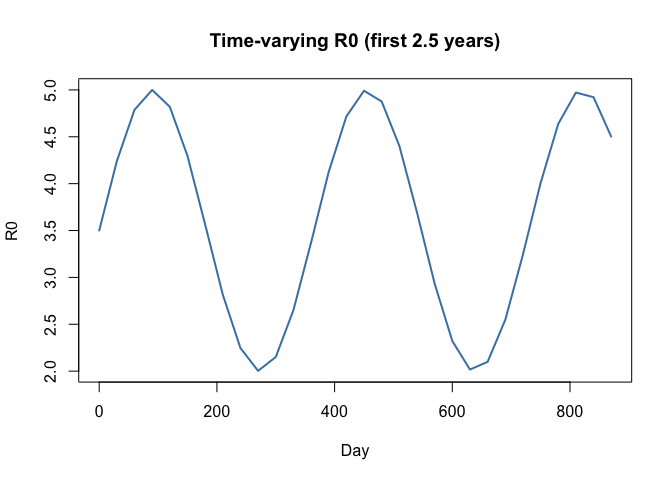
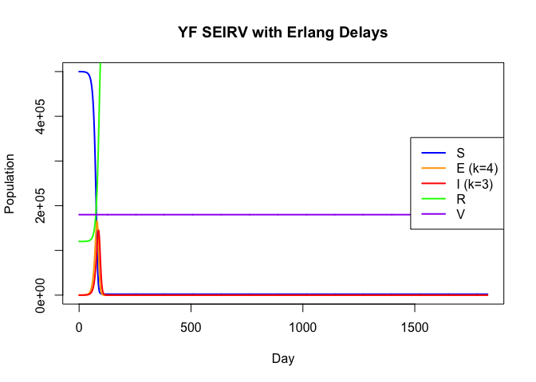
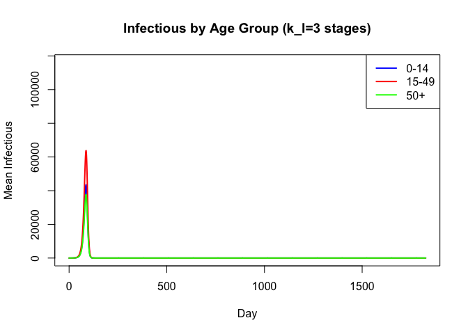
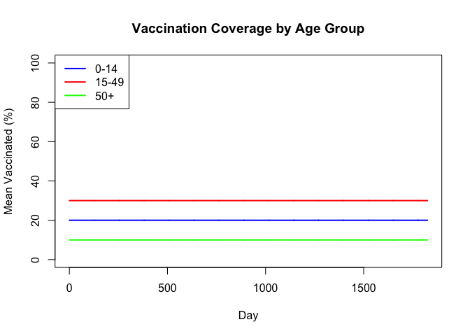
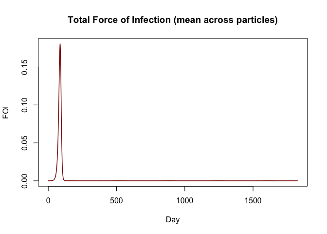
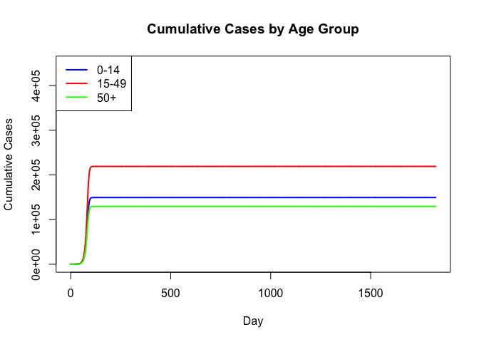
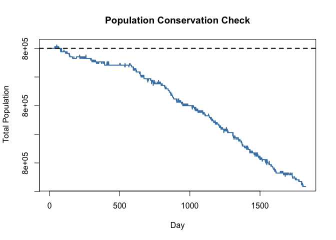
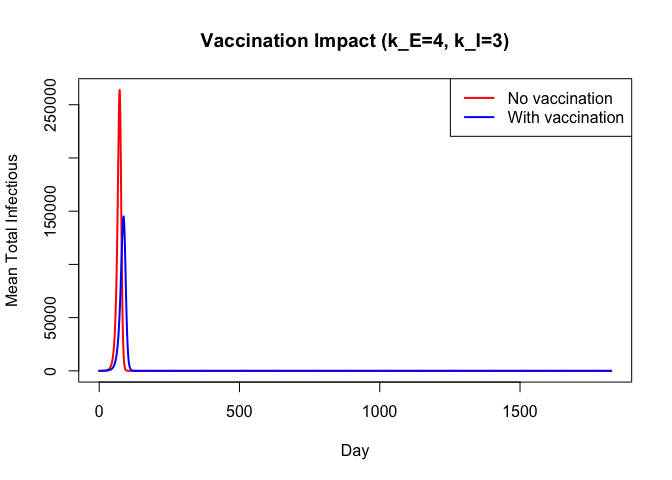

# Yellow Fever SEIRV with Erlang Delay Compartments (R)


## Introduction

This is the R companion to the Julia Yellow Fever delay compartments
vignette. It uses odin2/dust2 to define an age-structured stochastic
SEIRV model where the latent (E) and infectious (I) compartments are
replaced by Erlang delay chains of $k_E$ and $k_I$ sub-stages
respectively.

The **linear chain trick** preserves the mean sojourn time ($1/\sigma$
for latent, $1/\gamma$ for infectious) while reducing variance by a
factor of $k$. This produces more realistic, sharper epidemic peaks.

``` r
library(odin2)
library(dust2)
```

## Model Definition

The model uses 2D arrays `dim(E_chain) <- c(N_age, k_E)` for the delay
chains. Partial array updates handle the chain progression: the first
stage receives new exposures, intermediate stages receive flow from the
previous stage.

``` r
yf_delay <- odin({
  # === Configuration ===
  N_age <- parameter(3)
  k_E <- parameter(4)
  k_I <- parameter(3)

  # === 1D compartment dimensions ===
  dim(S) <- N_age
  dim(R) <- N_age
  dim(V) <- N_age
  dim(C_new) <- N_age

  # === 2D delay chain dimensions ===
  dim(E_chain) <- c(N_age, k_E)
  dim(I_chain) <- c(N_age, k_I)
  dim(n_EE) <- c(N_age, k_E)
  dim(n_II) <- c(N_age, k_I)

  # === 1D helper dimensions ===
  dim(S_0) <- N_age
  dim(R_0) <- N_age
  dim(V_0) <- N_age
  dim(E_new) <- N_age
  dim(I_new) <- N_age
  dim(R_new) <- N_age
  dim(P_nV) <- N_age
  dim(inv_P_nV) <- N_age
  dim(P) <- N_age
  dim(inv_P) <- N_age
  dim(vacc_eff) <- N_age
  dim(dP1) <- N_age
  dim(dP2) <- N_age
  dim(vacc_rate) <- N_age

  # === Epidemiological rates ===
  t_latent <- parameter(5.0)
  t_infectious <- parameter(5.0)
  sigma <- 1.0 / t_latent
  gamma <- 1.0 / t_infectious

  # === Time-varying R0 and spillover ===
  R0_t <- interpolate(R0_time, R0_value, "linear")
  FOI_sp <- interpolate(sp_time, sp_value, "linear")
  beta <- R0_t / t_infectious

  # === Force of infection ===
  I_total <- sum(I_chain)
  P_total <- sum(P)
  FOI_raw <- beta * I_total / max(P_total, 1.0) + FOI_sp
  FOI_sum <- min(1.0, FOI_raw)

  # === Totals per age group ===
  P_nV[1:N_age] <- max(S[i] + R[i], 1e-99)
  inv_P_nV[1:N_age] <- 1.0 / P_nV[i]
  P[1:N_age] <- max(P_nV[i] + V[i], 1e-99)
  inv_P[1:N_age] <- 1.0 / P[i]

  # === Transition probabilities (Erlang rates) ===
  p_inf <- 1 - exp(-FOI_sum * dt)
  p_E <- 1 - exp(-k_E * sigma * dt)
  p_I <- 1 - exp(-k_I * gamma * dt)

  # === Stochastic transitions ===
  E_new[1:N_age] <- Binomial(S[i], p_inf)
  n_EE[, ] <- Binomial(E_chain[i, j], p_E)
  n_II[, ] <- Binomial(I_chain[i, j], p_I)

  # Exits from last E stage become new infectious
  I_new[1:N_age] <- n_EE[i, k_E]
  # Exits from last I stage become new recovered
  R_new[1:N_age] <- n_II[i, k_I]

  # === Vaccination ===
  vaccine_efficacy <- parameter(0.95)
  vacc_eff[1:N_age] <- vacc_rate[i] * vaccine_efficacy * dt

  # === Demographic flows ===
  dP1_rate <- interpolate(dP1_time, dP1_value, "constant")
  dP2_rate <- interpolate(dP2_time, dP2_value, "constant")
  dP1[1:N_age] <- dP1_rate * 0.01
  dP2[1:N_age] <- dP2_rate * 0.01

  # === State updates: S (age group 1) ===
  update(S[1]) <- max(0.0, S[1] - E_new[1]
                      - vacc_eff[1] * S[1] * inv_P_nV[1]
                      + dP1[1]
                      - dP2[1] * S[1] * inv_P[1])

  # S (age groups 2..N_age)
  update(S[2:N_age]) <- max(0.0, S[i] - E_new[i]
                            - vacc_eff[i] * S[i] * inv_P_nV[i]
                            + dP1[i] * S[i - 1] * inv_P[i - 1]
                            - dP2[i] * S[i] * inv_P[i])

  # === E delay chain: first stage receives new exposures ===
  update(E_chain[1:N_age, 1]) <- max(0.0, E_chain[i, 1] + E_new[i] - n_EE[i, 1])

  # E delay chain: intermediate stages
  update(E_chain[1:N_age, 2:k_E]) <- max(0.0, E_chain[i, j] + n_EE[i, j - 1] - n_EE[i, j])

  # === I delay chain: first stage receives exits from E chain ===
  update(I_chain[1:N_age, 1]) <- max(0.0, I_chain[i, 1] + I_new[i] - n_II[i, 1])

  # I delay chain: intermediate stages
  update(I_chain[1:N_age, 2:k_I]) <- max(0.0, I_chain[i, j] + n_II[i, j - 1] - n_II[i, j])

  # === R (age group 1) ===
  update(R[1]) <- max(0.0, R[1] + R_new[1]
                      - vacc_eff[1] * R[1] * inv_P_nV[1]
                      - dP2[1] * R[1] * inv_P[1])

  # R (age groups 2..N_age)
  update(R[2:N_age]) <- max(0.0, R[i] + R_new[i]
                            - vacc_eff[i] * R[i] * inv_P_nV[i]
                            + dP1[i] * R[i - 1] * inv_P[i - 1]
                            - dP2[i] * R[i] * inv_P[i])

  # === V (age group 1) ===
  update(V[1]) <- max(0.0, V[1] + vacc_eff[1]
                      - dP2[1] * V[1] * inv_P[1])

  # V (age groups 2..N_age)
  update(V[2:N_age]) <- max(0.0, V[i] + vacc_eff[i]
                            + dP1[i] * V[i - 1] * inv_P[i - 1]
                            - dP2[i] * V[i] * inv_P[i])

  # === Cumulative new cases per step (reset each step) ===
  initial(C_new[1:N_age], zero_every = 1) <- 0
  update(C_new[1:N_age]) <- C_new[i] + I_new[i]

  # === Initial conditions ===
  initial(S[1:N_age]) <- S_0[i]
  initial(E_chain[, ]) <- 0
  initial(I_chain[, 1]) <- 0
  initial(I_chain[, 2:k_I]) <- 0
  initial(R[1:N_age]) <- R_0[i]
  initial(V[1:N_age]) <- V_0[i]

  # === Parameters ===
  S_0 <- parameter()
  R_0 <- parameter()
  V_0 <- parameter()
  vacc_rate <- parameter()

  dim(R0_time) <- parameter(rank = 1)
  dim(R0_value) <- parameter(rank = 1)
  dim(sp_time) <- parameter(rank = 1)
  dim(sp_value) <- parameter(rank = 1)
  dim(dP1_time) <- parameter(rank = 1)
  dim(dP1_value) <- parameter(rank = 1)
  dim(dP2_time) <- parameter(rank = 1)
  dim(dP2_value) <- parameter(rank = 1)
  R0_time <- parameter()
  R0_value <- parameter()
  sp_time <- parameter()
  sp_value <- parameter()
  dP1_time <- parameter()
  dP1_value <- parameter()
  dP2_time <- parameter()
  dP2_value <- parameter()
})
```

    ✔ Wrote 'DESCRIPTION'

    ✔ Wrote 'NAMESPACE'

    ✔ Wrote 'R/dust.R'

    ✔ Wrote 'src/dust.cpp'

    ✔ Wrote 'src/Makevars'

    ℹ 12 functions decorated with [[cpp11::register]]

    ✔ generated file 'cpp11.R'

    ✔ generated file 'cpp11.cpp'

    ℹ Re-compiling odin.systemaa44e324

    ── R CMD INSTALL ───────────────────────────────────────────────────────────────
    * installing *source* package ‘odin.systemaa44e324’ ...
    ** this is package ‘odin.systemaa44e324’ version ‘0.0.1’
    ** using staged installation
    ** libs
    using C++ compiler: ‘Homebrew clang version 21.1.5’
    using SDK: ‘MacOSX15.5.sdk’
    clang++ -arch arm64 -std=gnu++17 -I"/Library/Frameworks/R.framework/Resources/include" -DNDEBUG  -I'/Library/Frameworks/R.framework/Versions/4.5-arm64/Resources/library/cpp11/include' -I'/Library/Frameworks/R.framework/Versions/4.5-arm64/Resources/library/dust2/include' -I'/Library/Frameworks/R.framework/Versions/4.5-arm64/Resources/library/monty/include' -I/opt/R/arm64/include   -DHAVE_INLINE   -fPIC  -falign-functions=64 -Wall -g -O2  -Wall -pedantic  -c cpp11.cpp -o cpp11.o
    clang++ -arch arm64 -std=gnu++17 -I"/Library/Frameworks/R.framework/Resources/include" -DNDEBUG  -I'/Library/Frameworks/R.framework/Versions/4.5-arm64/Resources/library/cpp11/include' -I'/Library/Frameworks/R.framework/Versions/4.5-arm64/Resources/library/dust2/include' -I'/Library/Frameworks/R.framework/Versions/4.5-arm64/Resources/library/monty/include' -I/opt/R/arm64/include   -DHAVE_INLINE   -fPIC  -falign-functions=64 -Wall -g -O2  -Wall -pedantic  -c dust.cpp -o dust.o
    In file included from dust.cpp:356:
    In file included from /Library/Frameworks/R.framework/Versions/4.5-arm64/Resources/library/dust2/include/dust2/r/discrete/system.hpp:5:
    /Library/Frameworks/R.framework/Versions/4.5-arm64/Resources/library/monty/include/monty/r/random.hpp:60:43: warning: implicit conversion from 'type' (aka 'unsigned long') to 'double' changes value from 18446744073709551615 to 18446744073709551616 [-Wimplicit-const-int-float-conversion]
       60 |       std::ceil(std::abs(::unif_rand()) * std::numeric_limits<size_t>::max());
          |                                         ~ ^~~~~~~~~~~~~~~~~~~~~~~~~~~~~~~~~~
    /Library/Frameworks/R.framework/Versions/4.5-arm64/Resources/library/monty/include/monty/r/random.hpp:60:43: warning: implicit conversion from 'type' (aka 'unsigned long') to 'double' changes value from 18446744073709551615 to 18446744073709551616 [-Wimplicit-const-int-float-conversion]
       60 |       std::ceil(std::abs(::unif_rand()) * std::numeric_limits<size_t>::max());
          |                                         ~ ^~~~~~~~~~~~~~~~~~~~~~~~~~~~~~~~~~
    /Library/Frameworks/R.framework/Versions/4.5-arm64/Resources/library/dust2/include/dust2/r/discrete/system.hpp:41:33: note: in instantiation of function template specialization 'monty::random::r::as_rng_seed<monty::random::xoshiro_state<unsigned long long, 4, monty::random::scrambler::plus>>' requested here
       41 |   auto seed = monty::random::r::as_rng_seed<rng_state_type>(r_seed);
          |                                 ^
    dust.cpp:360:20: note: in instantiation of function template specialization 'dust2::r::dust2_discrete_alloc<odin_system>' requested here
      360 |   return dust2::r::dust2_discrete_alloc<odin_system>(r_pars, r_time, r_time_control, r_n_particles, r_n_groups, r_seed, r_deterministic, r_n_threads);
          |                    ^
    2 warnings generated.
    clang++ -arch arm64 -std=gnu++17 -dynamiclib -Wl,-headerpad_max_install_names -undefined dynamic_lookup -L/Library/Frameworks/R.framework/Resources/lib -L/opt/R/arm64/lib -o odin.systemaa44e324.so cpp11.o dust.o -F/Library/Frameworks/R.framework/.. -framework R
    installing to /private/var/folders/yh/30rj513j6mn1n7x556c2v4w80000gn/T/Rtmp8Vw2O9/devtools_install_1366f5264aa25/00LOCK-dust_1366f2bb372ae/00new/odin.systemaa44e324/libs
    ** checking absolute paths in shared objects and dynamic libraries
    * DONE (odin.systemaa44e324)

    ℹ Loading odin.systemaa44e324

## Parameter Setup

``` r
N_age <- 3
k_E <- 4
k_I <- 3
age_labels <- c("0-14", "15-49", "50+")

pop <- c(200000, 400000, 200000)
N_total <- sum(pop)

# Initial conditions
S_0 <- pop
R_0 <- rep(0, N_age)
V_0 <- rep(0, N_age)

# Pre-existing immunity
immun_frac <- c(0.05, 0.15, 0.25)
for (i in seq_len(N_age)) {
  R_0[i] <- round(pop[i] * immun_frac[i])
  S_0[i] <- S_0[i] - R_0[i]
}

# Pre-existing vaccination
vacc_frac <- c(0.20, 0.30, 0.10)
for (i in seq_len(N_age)) {
  V_0[i] <- round(pop[i] * vacc_frac[i])
  S_0[i] <- S_0[i] - V_0[i]
}

# Seed infections
n_seed <- 30
S_0[2] <- S_0[2] - n_seed

cat("S_0:", S_0, "\n")
```

    S_0: 150000 219970 130000 

``` r
cat("R_0:", R_0, "\n")
```

    R_0: 10000 60000 50000 

``` r
cat("V_0:", V_0, "\n")
```

    V_0: 40000 120000 20000 

### Time-varying parameters

``` r
n_years <- 5
t_end <- 365 * n_years

# R0: seasonal pattern
R0_time <- seq(0, t_end + 30, by = 30)
R0_value <- 3.5 + 1.5 * sin(2 * pi * R0_time / 365)

# Spillover FOI
sp_time <- seq(0, t_end + 30, by = 30)
sp_value <- 1e-6 + 5e-5 * pmax(0, sin(2 * pi * sp_time / 365 - pi / 3))^3

# Demographic rates
dP1_time <- c(0, t_end + 1)
dP1_value <- c(1, 1)
dP2_time <- c(0, t_end + 1)
dP2_value <- c(1, 1)

# Vaccination rates
vacc_rate <- c(0.001, 0.0005, 0.0002)

plot(R0_time[1:30], R0_value[1:30], type = "l", col = "steelblue", lwd = 2,
     xlab = "Day", ylab = "R0", main = "Time-varying R0 (first 2.5 years)")
```



### Assemble parameters

``` r
pars <- list(
  N_age = N_age,
  k_E = k_E,
  k_I = k_I,
  t_latent = 5,
  t_infectious = 5,
  vaccine_efficacy = 0.95,
  S_0 = S_0,
  R_0 = R_0,
  V_0 = V_0,
  vacc_rate = vacc_rate,
  R0_time = R0_time,
  R0_value = R0_value,
  sp_time = sp_time,
  sp_value = sp_value,
  dP1_time = dP1_time,
  dP1_value = dP1_value,
  dP2_time = dP2_time,
  dP2_value = dP2_value
)
```

## Simulation

``` r
n_particles <- 10
sim_times <- seq(0, t_end, by = 1)

sys <- System(yf_delay, pars, n_particles = n_particles,
                          dt = 1, seed = 42)
dust_system_set_state_initial(sys)

# Seed infections in I_chain[2, 1]
state <- state(sys)
# State layout: C_new[3], S[3], E_chain[3×4=12], I_chain[3×3=9], R[3], V[3]
# I_chain starts at index 3+3+12+1 = 19
# I_chain[2, 1] (column-major) → index 20
i_chain_idx <- 3 + 3 + 3 * k_E + 2  # = 20
for (p in seq_len(n_particles)) {
  state[i_chain_idx, p] <- n_seed
}
dust_system_set_state(sys, state)

result <- simulate(sys, sim_times)
cat("Result dimensions:", dim(result), "\n")
```

    Result dimensions: 33 10 1826 

### State layout

``` r
idx_C <- 1:N_age
idx_S <- (N_age + 1):(2 * N_age)
idx_E <- (2 * N_age + 1):(2 * N_age + N_age * k_E)
idx_I <- (2 * N_age + N_age * k_E + 1):(2 * N_age + N_age * k_E + N_age * k_I)
idx_R <- (max(idx_I) + 1):(max(idx_I) + N_age)
idx_V <- (max(idx_R) + 1):(max(idx_R) + N_age)

cat("E_chain indices:", idx_E, "(", N_age, "x", k_E, ")\n")
```

    E_chain indices: 7 8 9 10 11 12 13 14 15 16 17 18 ( 3 x 4 )

``` r
cat("I_chain indices:", idx_I, "(", N_age, "x", k_I, ")\n")
```

    I_chain indices: 19 20 21 22 23 24 25 26 27 ( 3 x 3 )

## Visualization

### SEIRV compartments (mean across particles)

``` r
S_total <- apply(apply(result[idx_S, , , drop = FALSE], c(2, 3), sum), 2, mean)
E_total <- apply(apply(result[idx_E, , , drop = FALSE], c(2, 3), sum), 2, mean)
I_total <- apply(apply(result[idx_I, , , drop = FALSE], c(2, 3), sum), 2, mean)
R_total <- apply(apply(result[idx_R, , , drop = FALSE], c(2, 3), sum), 2, mean)
V_total <- apply(apply(result[idx_V, , , drop = FALSE], c(2, 3), sum), 2, mean)

plot(sim_times, S_total, type = "l", col = "blue", lwd = 2,
     xlab = "Day", ylab = "Population",
     main = "YF SEIRV with Erlang Delays",
     ylim = c(0, max(S_total, V_total)))
lines(sim_times, E_total, col = "orange", lwd = 2)
lines(sim_times, I_total, col = "red", lwd = 2)
lines(sim_times, R_total, col = "green", lwd = 2)
lines(sim_times, V_total, col = "purple", lwd = 2)
legend("right", legend = c("S", paste0("E (k=", k_E, ")"),
       paste0("I (k=", k_I, ")"), "R", "V"),
       col = c("blue", "orange", "red", "green", "purple"), lwd = 2)
```



### Infectious by age group

``` r
age_cols <- c("blue", "red", "green")

# Extract per-age I totals (sum across stages, mean across particles)
plot(NULL, xlim = range(sim_times),
     ylim = c(0, max(I_total) * 0.8),
     xlab = "Day", ylab = "Mean Infectious",
     main = paste0("Infectious by Age Group (k_I=", k_I, " stages)"))
for (a in seq_len(N_age)) {
  # Sum across k_I stages for this age group (column-major)
  stage_indices <- sapply(0:(k_I - 1), function(s) idx_I[1] + s * N_age + (a - 1))
  I_a <- apply(apply(result[stage_indices, , , drop = FALSE], c(2, 3), sum), 2, mean)
  lines(sim_times, I_a, col = age_cols[a], lwd = 2)
}
legend("topright", legend = age_labels, col = age_cols, lwd = 2)
```



### Vaccination coverage

``` r
plot(NULL, xlim = range(sim_times), ylim = c(0, 100),
     xlab = "Day", ylab = "Mean Vaccinated (%)",
     main = "Vaccination Coverage by Age Group")
for (a in seq_len(N_age)) {
  V_a <- apply(result[idx_V[a], , , drop = FALSE], 3, mean)
  coverage <- V_a / pop[a] * 100
  lines(sim_times, coverage, col = age_cols[a], lwd = 2)
}
legend("topleft", legend = age_labels, col = age_cols, lwd = 2)
```



### Force of infection

``` r
# Compute FOI from state arrays and time-varying parameters
R0_at_t <- approx(R0_time, R0_value, xout = sim_times, rule = 2)$y
sp_at_t <- approx(sp_time, sp_value, xout = sim_times, rule = 2)$y
beta_at_t <- R0_at_t / pars$t_infectious

P_mean <- S_total + E_total + I_total + R_total + V_total
FOI_raw <- beta_at_t * I_total / pmax(P_mean, 1) + sp_at_t
FOI <- pmin(1.0, FOI_raw)

plot(sim_times, FOI, type = "l", col = "darkred", lwd = 1.5,
     xlab = "Day", ylab = "FOI",
     main = "Total Force of Infection (mean across particles)")
```



### Cumulative cases

``` r
for (a in seq_len(N_age)) {
  daily <- apply(result[idx_C[a], , , drop = FALSE], 3, mean)
  cum <- cumsum(daily)
  if (a == 1) {
    plot(sim_times, cum, type = "l", col = age_cols[a], lwd = 2,
         xlab = "Day", ylab = "Cumulative Cases",
         main = "Cumulative Cases by Age Group",
         ylim = c(0, max(cum) * N_age))
  } else {
    lines(sim_times, cum, col = age_cols[a], lwd = 2)
  }
}
legend("topleft", legend = age_labels, col = age_cols, lwd = 2)
```



## Population Conservation Check

``` r
pop_check <- rep(0, length(sim_times))
for (i in seq_len(n_particles)) {
  pop_i <- colSums(result[idx_S, i, ]) + colSums(result[idx_E, i, ]) +
           colSums(result[idx_I, i, ]) + colSums(result[idx_R, i, ]) +
           colSums(result[idx_V, i, ])
  pop_check <- pop_check + pop_i
}
pop_check <- pop_check / n_particles

plot(sim_times, pop_check, type = "l", col = "steelblue", lwd = 2,
     xlab = "Day", ylab = "Total Population",
     main = "Population Conservation Check")
abline(h = N_total, col = "black", lwd = 2, lty = 2)
```



``` r
cat("Population at t=0:", pop_check[1], "\n")
```

    Population at t=0: 8e+05 

``` r
cat("Population at t=end:", pop_check[length(pop_check)], "\n")
```

    Population at t=end: 8e+05 

``` r
cat("Relative change:", round(abs(pop_check[length(pop_check)] - N_total) /
    N_total * 100, 4), "%\n")
```

    Relative change: 0 %

## Scenario: No Vaccination

``` r
pars_novacc <- pars
pars_novacc$vacc_rate <- rep(0, N_age)
pars_novacc$V_0 <- rep(0, N_age)
pars_novacc$S_0 <- pop - R_0
pars_novacc$S_0[2] <- pars_novacc$S_0[2] - n_seed

sys_nv <- System(yf_delay, pars_novacc, n_particles = n_particles,
                             dt = 1, seed = 42)
dust_system_set_state_initial(sys_nv)
state_nv <- state(sys_nv)
for (p in seq_len(n_particles)) {
  state_nv[i_chain_idx, p] <- n_seed
}
dust_system_set_state(sys_nv, state_nv)
result_nv <- simulate(sys_nv, sim_times)

I_vacc <- apply(apply(result[idx_I, , , drop = FALSE], c(2, 3), sum), 2, mean)
I_novacc <- apply(apply(result_nv[idx_I, , , drop = FALSE], c(2, 3), sum), 2, mean)

plot(sim_times, I_novacc, type = "l", col = "red", lwd = 2,
     xlab = "Day", ylab = "Mean Total Infectious",
     main = paste0("Vaccination Impact (k_E=", k_E, ", k_I=", k_I, ")"))
lines(sim_times, I_vacc, col = "blue", lwd = 2)
legend("topright", legend = c("No vaccination", "With vaccination"),
       col = c("red", "blue"), lwd = 2)
```


