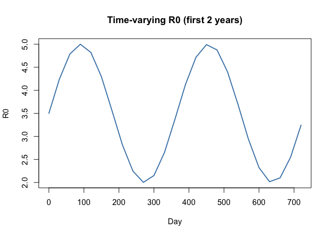
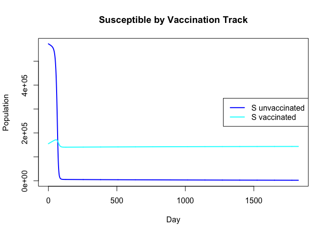
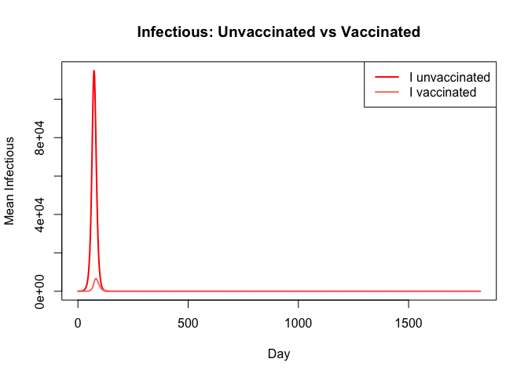
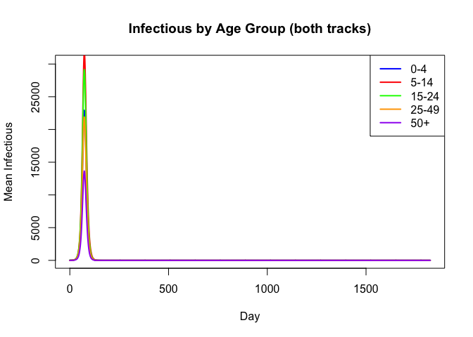
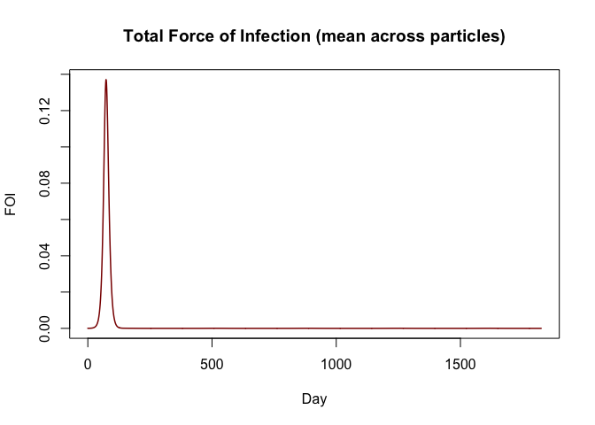
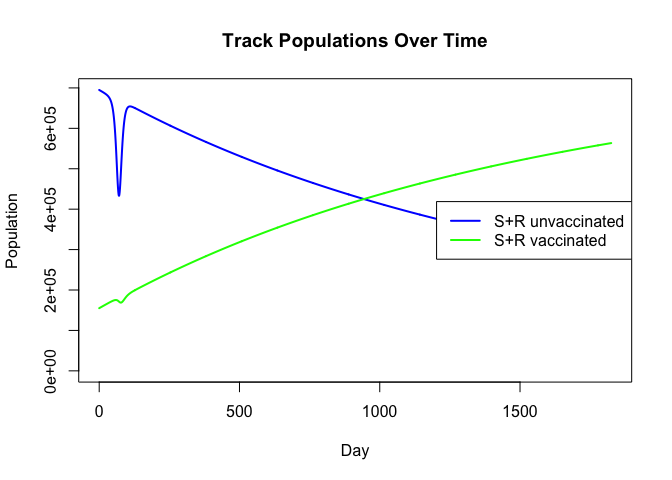
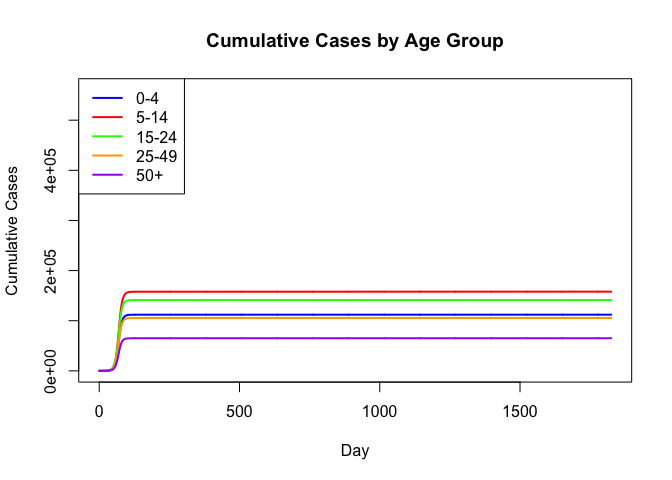
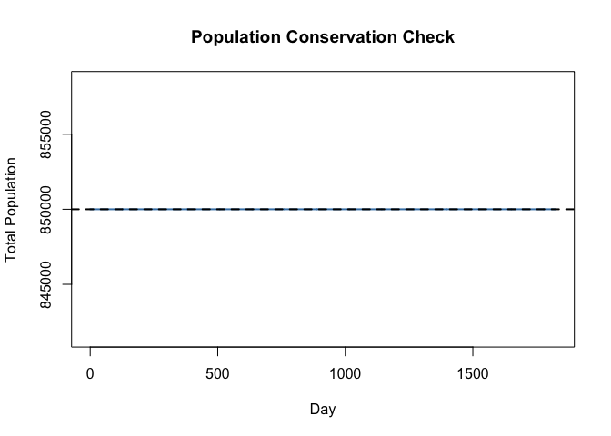
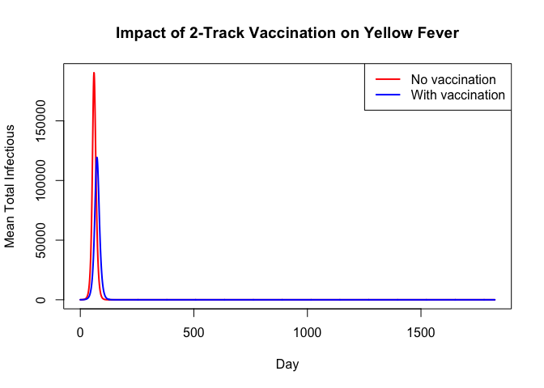

# Yellow Fever SEIR with 2-Track Vaccination (R)


## Introduction

This is the R companion to the Julia Yellow Fever 2-track vaccination
vignette. It uses odin2/dust2 to define and simulate the same
age-structured stochastic SEIR model with two vaccination tracks:

| Track   | Population   | Susceptibility              |
|---------|--------------|-----------------------------|
| Track 1 | Unvaccinated | Full (FOI)                  |
| Track 2 | Vaccinated   | Reduced by vaccine efficacy |

``` r
library(odin2)
library(dust2)
```

## Model Definition

The model uses 2D arrays `(N_age, 2)` for each SEIR compartment, with
partial array updates for different vaccination-track rules.

``` r
yf_vtrack <- odin({
  # === Configuration ===
  N_age <- parameter(5)

  # === Dimensions: 2D arrays (age x vaccination track) ===
  dim(S) <- c(N_age, 2)
  dim(E) <- c(N_age, 2)
  dim(I) <- c(N_age, 2)
  dim(R) <- c(N_age, 2)
  dim(C) <- N_age

  dim(S_0) <- c(N_age, 2)
  dim(E_0) <- c(N_age, 2)
  dim(I_0) <- c(N_age, 2)
  dim(R_0) <- c(N_age, 2)

  dim(E_new) <- c(N_age, 2)
  dim(I_new) <- c(N_age, 2)
  dim(R_new) <- c(N_age, 2)
  dim(S_new_V) <- N_age
  dim(R_new_V) <- N_age

  dim(P) <- N_age
  dim(inv_P) <- N_age
  dim(dP1) <- N_age
  dim(dP2) <- N_age

  # === Epidemiological parameters ===
  t_latent <- parameter(5.0)
  t_infectious <- parameter(5.0)
  vaccine_efficacy <- parameter(0.95)
  rate1 <- 1.0 / t_latent
  rate2 <- 1.0 / t_infectious

  # === Time-varying R0 and spillover ===
  R0_t <- interpolate(R0_time, R0_value, "linear")
  FOI_sp <- interpolate(sp_time, sp_value, "linear")
  beta <- R0_t / t_infectious

  # === Population totals (S + R only) ===
  P[1:N_age] <- max(S[i, 1] + R[i, 1] + S[i, 2] + R[i, 2], 1e-99)
  inv_P[1:N_age] <- 1.0 / P[i]
  P_tot <- sum(P)
  I_tot <- sum(I)

  # === Force of infection ===
  FOI_raw <- beta * I_tot / max(P_tot, 1.0) + FOI_sp
  FOI_sum <- min(1.0, FOI_raw)

  # === Transition probabilities ===
  p_inf <- 1 - exp(-FOI_sum * dt)
  p_inf_vacc <- 1 - exp(-FOI_sum * (1.0 - vaccine_efficacy) * dt)
  p_lat <- 1 - exp(-rate1 * dt)
  p_rec <- 1 - exp(-rate2 * dt)

  # === Stochastic transitions ===
  E_new[1:N_age, 1] <- Binomial(S[i, 1], p_inf)
  E_new[1:N_age, 2] <- Binomial(S[i, 2], p_inf_vacc)
  I_new[1:N_age, 1:2] <- Binomial(E[i, j], p_lat)
  R_new[1:N_age, 1:2] <- Binomial(I[i, j], p_rec)

  # === Vaccination flows (track 1 -> track 2) ===
  dim(vacc_rate) <- N_age
  S_new_V[1:N_age] <- vacc_rate[i] * S[i, 1] * dt
  R_new_V[1:N_age] <- vacc_rate[i] * R[i, 1] * dt

  # === Demographic flows ===
  dP1_rate <- interpolate(dP1_time, dP1_value, "constant")
  dP2_rate <- interpolate(dP2_time, dP2_value, "constant")
  dP1[1:N_age] <- dP1_rate * 0.01
  dP2[1:N_age] <- dP2_rate * 0.01

  # === S track 1 (unvaccinated) ===
  update(S[1, 1]) <- max(0.0, S[1, 1] - E_new[1, 1] - S_new_V[1]
                         + dP1[1] - dP2[1] * S[1, 1] * inv_P[1])
  update(S[2:N_age, 1]) <- max(0.0, S[i, 1] - E_new[i, 1] - S_new_V[i]
                               + dP1[i] * S[i - 1, 1] * inv_P[i - 1]
                               - dP2[i] * S[i, 1] * inv_P[i])

  # === S track 2 (vaccinated) ===
  update(S[1, 2]) <- max(0.0, S[1, 2] - E_new[1, 2] + S_new_V[1]
                         - dP2[1] * S[1, 2] * inv_P[1])
  update(S[2:N_age, 2]) <- max(0.0, S[i, 2] - E_new[i, 2] + S_new_V[i]
                               + dP1[i] * S[i - 1, 2] * inv_P[i - 1]
                               - dP2[i] * S[i, 2] * inv_P[i])

  # === E and I: same rule for both tracks ===
  update(E[1:N_age, 1:2]) <- max(0.0, E[i, j] + E_new[i, j] - I_new[i, j])
  update(I[1:N_age, 1:2]) <- max(0.0, I[i, j] + I_new[i, j] - R_new[i, j])

  # === R track 1 (unvaccinated) ===
  update(R[1, 1]) <- max(0.0, R[1, 1] + R_new[1, 1] - R_new_V[1]
                         - dP2[1] * R[1, 1] * inv_P[1])
  update(R[2:N_age, 1]) <- max(0.0, R[i, 1] + R_new[i, 1] - R_new_V[i]
                               + dP1[i] * R[i - 1, 1] * inv_P[i - 1]
                               - dP2[i] * R[i, 1] * inv_P[i])

  # === R track 2 (vaccinated) ===
  update(R[1, 2]) <- max(0.0, R[1, 2] + R_new[1, 2] + R_new_V[1]
                         - dP2[1] * R[1, 2] * inv_P[1])
  update(R[2:N_age, 2]) <- max(0.0, R[i, 2] + R_new[i, 2] + R_new_V[i]
                               + dP1[i] * R[i - 1, 2] * inv_P[i - 1]
                               - dP2[i] * R[i, 2] * inv_P[i])

  # === New cases per step (both tracks) ===
  initial(C[1:N_age], zero_every = 1) <- 0
  update(C[1:N_age]) <- I_new[i, 1] + I_new[i, 2]

  # === Initial conditions ===
  initial(S[1:N_age, 1:2]) <- S_0[i, j]
  initial(E[1:N_age, 1:2]) <- E_0[i, j]
  initial(I[1:N_age, 1:2]) <- I_0[i, j]
  initial(R[1:N_age, 1:2]) <- R_0[i, j]

  # === Parameters ===
  S_0 <- parameter()
  E_0 <- parameter()
  I_0 <- parameter()
  R_0 <- parameter()
  vacc_rate <- parameter()

  dim(R0_time) <- parameter(rank = 1)
  dim(R0_value) <- parameter(rank = 1)
  dim(sp_time) <- parameter(rank = 1)
  dim(sp_value) <- parameter(rank = 1)
  dim(dP1_time) <- parameter(rank = 1)
  dim(dP1_value) <- parameter(rank = 1)
  dim(dP2_time) <- parameter(rank = 1)
  dim(dP2_value) <- parameter(rank = 1)
  R0_time <- parameter()
  R0_value <- parameter()
  sp_time <- parameter()
  sp_value <- parameter()
  dP1_time <- parameter()
  dP1_value <- parameter()
  dP2_time <- parameter()
  dP2_value <- parameter()
})
```

    ✔ Wrote 'DESCRIPTION'

    ✔ Wrote 'NAMESPACE'

    ✔ Wrote 'R/dust.R'

    ✔ Wrote 'src/dust.cpp'

    ✔ Wrote 'src/Makevars'

    ℹ 12 functions decorated with [[cpp11::register]]

    ✔ generated file 'cpp11.R'

    ✔ generated file 'cpp11.cpp'

    ℹ Re-compiling odin.systemed4fc40f

    ── R CMD INSTALL ───────────────────────────────────────────────────────────────
    * installing *source* package ‘odin.systemed4fc40f’ ...
    ** this is package ‘odin.systemed4fc40f’ version ‘0.0.1’
    ** using staged installation
    ** libs
    using C++ compiler: ‘Homebrew clang version 21.1.5’
    using SDK: ‘MacOSX15.5.sdk’
    clang++ -arch arm64 -std=gnu++17 -I"/Library/Frameworks/R.framework/Resources/include" -DNDEBUG  -I'/Library/Frameworks/R.framework/Versions/4.5-arm64/Resources/library/cpp11/include' -I'/Library/Frameworks/R.framework/Versions/4.5-arm64/Resources/library/dust2/include' -I'/Library/Frameworks/R.framework/Versions/4.5-arm64/Resources/library/monty/include' -I/opt/R/arm64/include   -DHAVE_INLINE   -fPIC  -falign-functions=64 -Wall -g -O2  -Wall -pedantic  -c cpp11.cpp -o cpp11.o
    clang++ -arch arm64 -std=gnu++17 -I"/Library/Frameworks/R.framework/Resources/include" -DNDEBUG  -I'/Library/Frameworks/R.framework/Versions/4.5-arm64/Resources/library/cpp11/include' -I'/Library/Frameworks/R.framework/Versions/4.5-arm64/Resources/library/dust2/include' -I'/Library/Frameworks/R.framework/Versions/4.5-arm64/Resources/library/monty/include' -I/opt/R/arm64/include   -DHAVE_INLINE   -fPIC  -falign-functions=64 -Wall -g -O2  -Wall -pedantic  -c dust.cpp -o dust.o
    In file included from dust.cpp:331:
    In file included from /Library/Frameworks/R.framework/Versions/4.5-arm64/Resources/library/dust2/include/dust2/r/discrete/system.hpp:5:
    /Library/Frameworks/R.framework/Versions/4.5-arm64/Resources/library/monty/include/monty/r/random.hpp:60:43: warning: implicit conversion from 'type' (aka 'unsigned long') to 'double' changes value from 18446744073709551615 to 18446744073709551616 [-Wimplicit-const-int-float-conversion]
       60 |       std::ceil(std::abs(::unif_rand()) * std::numeric_limits<size_t>::max());
          |                                         ~ ^~~~~~~~~~~~~~~~~~~~~~~~~~~~~~~~~~
    /Library/Frameworks/R.framework/Versions/4.5-arm64/Resources/library/monty/include/monty/r/random.hpp:60:43: warning: implicit conversion from 'type' (aka 'unsigned long') to 'double' changes value from 18446744073709551615 to 18446744073709551616 [-Wimplicit-const-int-float-conversion]
       60 |       std::ceil(std::abs(::unif_rand()) * std::numeric_limits<size_t>::max());
          |                                         ~ ^~~~~~~~~~~~~~~~~~~~~~~~~~~~~~~~~~
    /Library/Frameworks/R.framework/Versions/4.5-arm64/Resources/library/dust2/include/dust2/r/discrete/system.hpp:41:33: note: in instantiation of function template specialization 'monty::random::r::as_rng_seed<monty::random::xoshiro_state<unsigned long long, 4, monty::random::scrambler::plus>>' requested here
       41 |   auto seed = monty::random::r::as_rng_seed<rng_state_type>(r_seed);
          |                                 ^
    dust.cpp:335:20: note: in instantiation of function template specialization 'dust2::r::dust2_discrete_alloc<odin_system>' requested here
      335 |   return dust2::r::dust2_discrete_alloc<odin_system>(r_pars, r_time, r_time_control, r_n_particles, r_n_groups, r_seed, r_deterministic, r_n_threads);
          |                    ^
    2 warnings generated.
    clang++ -arch arm64 -std=gnu++17 -dynamiclib -Wl,-headerpad_max_install_names -undefined dynamic_lookup -L/Library/Frameworks/R.framework/Resources/lib -L/opt/R/arm64/lib -o odin.systemed4fc40f.so cpp11.o dust.o -F/Library/Frameworks/R.framework/.. -framework R
    installing to /private/var/folders/yh/30rj513j6mn1n7x556c2v4w80000gn/T/RtmpbtavCs/devtools_install_14042764908c0/00LOCK-dust_1404261baac4f/00new/odin.systemed4fc40f/libs
    ** checking absolute paths in shared objects and dynamic libraries
    * DONE (odin.systemed4fc40f)

    ℹ Loading odin.systemed4fc40f

## Parameter Setup

``` r
N_age <- 5
age_labels <- c("0-4", "5-14", "15-24", "25-49", "50+")
age_cols <- c("blue", "red", "green", "orange", "purple")

pop <- c(150000, 250000, 200000, 150000, 100000)
N_total <- sum(pop)

# Initial conditions — 2D matrices (N_age x 2)
S_0 <- matrix(0, N_age, 2)
E_0 <- matrix(0, N_age, 2)
I_0 <- matrix(0, N_age, 2)
R_0 <- matrix(0, N_age, 2)

# Pre-existing immunity (unvaccinated recovered)
immun_frac <- c(0.05, 0.10, 0.15, 0.20, 0.30)
for (i in seq_len(N_age)) {
  R_0[i, 1] <- round(pop[i] * immun_frac[i])
}

# Pre-existing vaccination
vacc_frac <- c(0.20, 0.30, 0.15, 0.10, 0.05)
for (i in seq_len(N_age)) {
  S_0[i, 2] <- round(pop[i] * vacc_frac[i])
}

# Remaining: unvaccinated susceptible
for (i in seq_len(N_age)) {
  S_0[i, 1] <- pop[i] - R_0[i, 1] - S_0[i, 2]
}

# Seed infections
I_0[3, 1] <- 50
S_0[3, 1] <- S_0[3, 1] - 50

cat("S_0 (unvacc):", S_0[, 1], "\n")
```

    S_0 (unvacc): 112500 150000 139950 105000 65000 

``` r
cat("S_0 (vacc):  ", S_0[, 2], "\n")
```

    S_0 (vacc):   30000 75000 30000 15000 5000 

``` r
cat("R_0 (unvacc):", R_0[, 1], "\n")
```

    R_0 (unvacc): 7500 25000 30000 30000 30000 

``` r
cat("I_0 (unvacc):", I_0[, 1], "\n")
```

    I_0 (unvacc): 0 0 50 0 0 

### Time-varying parameters

``` r
n_years <- 5
t_end <- 365 * n_years

R0_time <- seq(0, t_end + 30, by = 30)
R0_value <- 3.5 + 1.5 * sin(2 * pi * R0_time / 365)

sp_time <- seq(0, t_end + 30, by = 30)
sp_value <- 1e-6 + 5e-5 * pmax(0, sin(2 * pi * sp_time / 365 - pi / 3))^3

dP1_time <- c(0, t_end + 1)
dP1_value <- c(1, 1)
dP2_time <- c(0, t_end + 1)
dP2_value <- c(1, 1)

vacc_rate <- c(0.001, 0.0008, 0.0005, 0.0003, 0.0001)

plot(R0_time[1:25], R0_value[1:25], type = "l", col = "steelblue", lwd = 2,
     xlab = "Day", ylab = "R0", main = "Time-varying R0 (first 2 years)")
```



### Assemble parameters

``` r
pars <- list(
  N_age = N_age,
  t_latent = 5,
  t_infectious = 5,
  vaccine_efficacy = 0.95,
  S_0 = S_0,
  E_0 = E_0,
  I_0 = I_0,
  R_0 = R_0,
  vacc_rate = vacc_rate,
  R0_time = R0_time,
  R0_value = R0_value,
  sp_time = sp_time,
  sp_value = sp_value,
  dP1_time = dP1_time,
  dP1_value = dP1_value,
  dP2_time = dP2_time,
  dP2_value = dP2_value
)
```

## Simulation

``` r
n_particles <- 10
sim_times <- seq(0, t_end, by = 1)

sys <- dust_system_create(yf_vtrack, pars, n_particles = n_particles,
                          dt = 1, seed = 42)
dust_system_set_state_initial(sys)
result <- dust_system_simulate(sys, sim_times)
cat("Result dimensions:", dim(result), "\n")
```

    Result dimensions: 45 10 1826 

### State layout

``` r
# C[1:5], S[6:15] (5 unvacc + 5 vacc), E[16:25], I[26:35], R[36:45]
idx_C <- 1:N_age
idx_S <- (N_age + 1):(3 * N_age)
idx_E <- (3 * N_age + 1):(5 * N_age)
idx_I <- (5 * N_age + 1):(7 * N_age)
idx_R <- (7 * N_age + 1):(9 * N_age)

# Track-specific indices
idx_S1 <- (N_age + 1):(2 * N_age)
idx_S2 <- (2 * N_age + 1):(3 * N_age)
idx_I1 <- (5 * N_age + 1):(6 * N_age)
idx_I2 <- (6 * N_age + 1):(7 * N_age)
idx_R1 <- (7 * N_age + 1):(8 * N_age)
idx_R2 <- (8 * N_age + 1):(9 * N_age)
```

## Visualization

### Susceptible by track

``` r
S1_total <- apply(apply(result[idx_S1, , , drop = FALSE], c(2, 3), sum), 2, mean)
S2_total <- apply(apply(result[idx_S2, , , drop = FALSE], c(2, 3), sum), 2, mean)

plot(sim_times, S1_total, type = "l", col = "blue", lwd = 2,
     xlab = "Day", ylab = "Population",
     main = "Susceptible by Vaccination Track",
     ylim = c(0, max(S1_total)))
lines(sim_times, S2_total, col = "cyan", lwd = 2)
legend("right", legend = c("S unvaccinated", "S vaccinated"),
       col = c("blue", "cyan"), lwd = 2)
```



### Infectious by track

``` r
I1_total <- apply(apply(result[idx_I1, , , drop = FALSE], c(2, 3), sum), 2, mean)
I2_total <- apply(apply(result[idx_I2, , , drop = FALSE], c(2, 3), sum), 2, mean)

plot(sim_times, I1_total, type = "l", col = "red", lwd = 2,
     xlab = "Day", ylab = "Mean Infectious",
     main = "Infectious: Unvaccinated vs Vaccinated",
     ylim = c(0, max(I1_total, I2_total)))
lines(sim_times, I2_total, col = "salmon", lwd = 2)
legend("topright", legend = c("I unvaccinated", "I vaccinated"),
       col = c("red", "salmon"), lwd = 2)
```



### Infectious by age group

``` r
plot(NULL, xlim = range(sim_times),
     ylim = c(0, max(result[c(idx_I1, idx_I2), , ])),
     xlab = "Day", ylab = "Mean Infectious",
     main = "Infectious by Age Group (both tracks)")
for (a in seq_len(N_age)) {
  I_a <- apply(result[idx_I1[a], , , drop = FALSE] +
               result[idx_I2[a], , , drop = FALSE], 3, mean)
  lines(sim_times, I_a, col = age_cols[a], lwd = 2)
}
legend("topright", legend = age_labels, col = age_cols, lwd = 2)
```



### Force of infection

``` r
# Compute FOI from state arrays and time-varying parameters
I_total_ts <- apply(apply(result[idx_I, , , drop = FALSE], c(2, 3), sum), 2, mean)
P_total_ts <- apply(apply(result[idx_S, , , drop = FALSE], c(2, 3), sum) +
                    apply(result[idx_E, , , drop = FALSE], c(2, 3), sum) +
                    apply(result[idx_I, , , drop = FALSE], c(2, 3), sum) +
                    apply(result[idx_R, , , drop = FALSE], c(2, 3), sum), 2, mean)
R0_at_t <- approx(R0_time, R0_value, xout = sim_times, rule = 2)$y
sp_at_t <- approx(sp_time, sp_value, xout = sim_times, rule = 2)$y
beta_at_t <- R0_at_t / pars$t_infectious
FOI_raw <- beta_at_t * I_total_ts / pmax(P_total_ts, 1) + sp_at_t
FOI <- pmin(1.0, FOI_raw)

plot(sim_times, FOI, type = "l", col = "darkred", lwd = 1.5,
     xlab = "Day", ylab = "FOI",
     main = "Total Force of Infection (mean across particles)")
```



### Track population dynamics

``` r
SR1 <- apply(apply(result[idx_S1, , , drop = FALSE], c(2, 3), sum) +
             apply(result[idx_R1, , , drop = FALSE], c(2, 3), sum), 2, mean)
SR2 <- apply(apply(result[idx_S2, , , drop = FALSE], c(2, 3), sum) +
             apply(result[idx_R2, , , drop = FALSE], c(2, 3), sum), 2, mean)

plot(sim_times, SR1, type = "l", col = "blue", lwd = 2,
     xlab = "Day", ylab = "Population",
     main = "Track Populations Over Time",
     ylim = c(0, max(SR1)))
lines(sim_times, SR2, col = "green", lwd = 2)
legend("right", legend = c("S+R unvaccinated", "S+R vaccinated"),
       col = c("blue", "green"), lwd = 2)
```



### Cumulative cases

``` r
for (a in seq_len(N_age)) {
  daily <- apply(result[idx_C[a], , , drop = FALSE], 3, mean)
  cum <- cumsum(daily)
  if (a == 1) {
    plot(sim_times, cum, type = "l", col = age_cols[a], lwd = 2,
         xlab = "Day", ylab = "Cumulative Cases",
         main = "Cumulative Cases by Age Group",
         ylim = c(0, max(cum) * N_age))
  } else {
    lines(sim_times, cum, col = age_cols[a], lwd = 2)
  }
}
legend("topleft", legend = age_labels, col = age_cols, lwd = 2)
```



## Population Conservation Check

``` r
pop_check <- rep(0, length(sim_times))
for (i in seq_len(n_particles)) {
  pop_i <- colSums(result[idx_S, i, ]) + colSums(result[idx_E, i, ]) +
           colSums(result[idx_I, i, ]) + colSums(result[idx_R, i, ])
  pop_check <- pop_check + pop_i
}
pop_check <- pop_check / n_particles

plot(sim_times, pop_check, type = "l", col = "steelblue", lwd = 2,
     xlab = "Day", ylab = "Total Population",
     main = "Population Conservation Check")
abline(h = N_total, col = "black", lwd = 2, lty = 2)
```



``` r
cat("Population at t=0:", pop_check[1], "\n")
```

    Population at t=0: 850000 

``` r
cat("Population at t=end:", pop_check[length(pop_check)], "\n")
```

    Population at t=end: 850000 

``` r
cat("Relative change:",
    round(abs(pop_check[length(pop_check)] - N_total) / N_total * 100, 4), "%\n")
```

    Relative change: 0 %

## Scenario: No Vaccination

``` r
S_0_nv <- matrix(0, N_age, 2)
E_0_nv <- matrix(0, N_age, 2)
I_0_nv <- I_0
R_0_nv <- matrix(0, N_age, 2)

for (i in seq_len(N_age)) {
  R_0_nv[i, 1] <- round(pop[i] * immun_frac[i])
  S_0_nv[i, 1] <- pop[i] - R_0_nv[i, 1] - I_0_nv[i, 1]
}

pars_novacc <- pars
pars_novacc$vacc_rate <- rep(0, N_age)
pars_novacc$S_0 <- S_0_nv
pars_novacc$E_0 <- E_0_nv
pars_novacc$R_0 <- R_0_nv

sys_nv <- dust_system_create(yf_vtrack, pars_novacc, n_particles = n_particles,
                             dt = 1, seed = 42)
dust_system_set_state_initial(sys_nv)
result_nv <- dust_system_simulate(sys_nv, sim_times)

I_vacc <- apply(apply(result[idx_I, , , drop = FALSE], c(2, 3), sum), 2, mean)
I_novacc <- apply(apply(result_nv[idx_I, , , drop = FALSE], c(2, 3), sum), 2, mean)

plot(sim_times, I_novacc, type = "l", col = "red", lwd = 2,
     xlab = "Day", ylab = "Mean Total Infectious",
     main = "Impact of 2-Track Vaccination on Yellow Fever")
lines(sim_times, I_vacc, col = "blue", lwd = 2)
legend("topright", legend = c("No vaccination", "With vaccination"),
       col = c("red", "blue"), lwd = 2)
```



## Summary

| Component           | Value                              |
|---------------------|------------------------------------|
| **Age groups**      | 5 (0–4, 5–14, 15–24, 25–49, 50+)   |
| **Tracks**          | 2 (unvaccinated, vaccinated)       |
| **Compartments**    | SEIR × 2 tracks + cumulative cases |
| **State variables** | 45 (4 × 5 × 2 + 5)                 |

| Step | API |
|----|----|
| Define model | `odin({ ... })` with 2D arrays `c(N_age, 2)` |
| Create system | `dust_system_create(gen, pars, n_particles, dt, seed)` |
| Simulate | `dust_system_simulate(sys, times)` |
| Scenario comparison | Re-run with modified `vacc_rate` |
