# Complete Fitting Workflow


## Introduction

This vignette demonstrates the full Bayesian fitting workflow with
Odin.jl, covering three scenarios of increasing complexity:

1.  **Part 1 — Deterministic SIR fitting**: ODE model with Poisson
    observation model, deterministic likelihood via
    `dust_unfilter_create`, and random-walk
    2000. 
2.  **Part 2 — Stochastic SIS fitting**: Discrete-time SIS model with
    time-varying school closure, stochastic likelihood via
    `dust_filter_create`, and random-walk MCMC.
3.  **Part 3 — Counterfactual projections**: Using the fitted posterior
    to simulate forward under alternative intervention scenarios.

This follows the analysis pipeline from the
[odin-monty-workshop-2025](https://github.com/mrc-ide/odin-monty-workshop-2025)
fitting tutorial, ported to Julia.

``` julia
using Odin
using Distributions
using Plots
using Statistics
using Random
using LinearAlgebra
```

## Part 1: SIR ODE Fitting with Unfilter

### Data

We use a 20-day SIR incidence dataset:

``` julia
incidence_data = [
    (time=1.0,  cases=12.0), (time=2.0,  cases=23.0),
    (time=3.0,  cases=25.0), (time=4.0,  cases=36.0),
    (time=5.0,  cases=30.0), (time=6.0,  cases=57.0),
    (time=7.0,  cases=59.0), (time=8.0,  cases=62.0),
    (time=9.0,  cases=47.0), (time=10.0, cases=52.0),
    (time=11.0, cases=56.0), (time=12.0, cases=33.0),
    (time=13.0, cases=34.0), (time=14.0, cases=19.0),
    (time=15.0, cases=27.0), (time=16.0, cases=25.0),
    (time=17.0, cases=15.0), (time=18.0, cases=20.0),
    (time=19.0, cases=11.0), (time=20.0, cases=7.0),
]

scatter([d.time for d in incidence_data],
        [d.cases for d in incidence_data],
        xlabel="Time", ylabel="Cases",
        title="SIR Incidence Data", label="Observed",
        color=:red, ms=5)
```

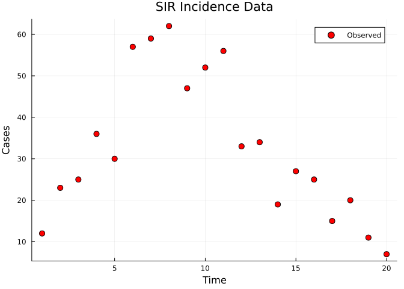

### Model Definition

An ODE SIR model with Poisson observation model on infected counts. The
unfilter requires continuous-time dynamics (`deriv()`), which are solved
deterministically by an ODE integrator.

``` julia
sir_ode = @odin begin
    deriv(S) = -beta * S * I / N
    deriv(I) = beta * S * I / N - gamma * I
    deriv(R) = gamma * I

    initial(S) = N - I0
    initial(I) = I0
    initial(R) = 0

    N = parameter(1000)
    I0 = parameter(10)
    beta = parameter(0.4)
    gamma = parameter(0.2)

    cases = data()
    cases ~ Poisson(max(I, 1e-6))
end
```

    DustSystemGenerator{var"##OdinModel#313"}(var"##OdinModel#313"(3, [:S, :I, :R], [:N, :I0, :beta, :gamma], true, true, false, false, Dict{Symbol, Array}()))

### Deterministic Likelihood (Unfilter)

The unfilter solves the ODE forward and evaluates the Poisson
log-likelihood of the observed cases against the predicted infected
count at each time point:

``` julia
sir_data = dust_filter_data(incidence_data)
unfilter = dust_unfilter_create(sir_ode, sir_data)

ll = dust_unfilter_run!(unfilter, (beta=0.4, gamma=0.2, I0=10.0, N=1000.0))
println("Log-likelihood (unfilter): ", round(ll, digits=2))
```

    Log-likelihood (unfilter): -687.03

### Set Up MCMC

``` julia
packer = monty_packer([:beta, :gamma]; fixed=(I0=10.0, N=1000.0))

likelihood = dust_likelihood_monty(unfilter, packer)

prior = @monty_prior begin
    beta ~ Exponential(0.5)
    gamma ~ Exponential(0.3)
end

posterior = likelihood + prior
```

    MontyModel{Odin.var"#monty_model_combine##0#monty_model_combine##1"{MontyModel{Odin.var"#dust_likelihood_monty##2#dust_likelihood_monty##3"{DustUnfilter{var"##OdinModel#313", @NamedTuple{cases::Float64}}, MontyPacker}, Odin.var"#dust_likelihood_monty##4#dust_likelihood_monty##5"{Odin.var"#dust_likelihood_monty##2#dust_likelihood_monty##3"{DustUnfilter{var"##OdinModel#313", @NamedTuple{cases::Float64}}, MontyPacker}}, Nothing, Nothing}, MontyModel{var"#10#11", var"#12#13"{var"#10#11"}, var"#14#15", Matrix{Float64}}}, Odin.var"#monty_model_combine##2#monty_model_combine##3"{MontyModel{Odin.var"#dust_likelihood_monty##2#dust_likelihood_monty##3"{DustUnfilter{var"##OdinModel#313", @NamedTuple{cases::Float64}}, MontyPacker}, Odin.var"#dust_likelihood_monty##4#dust_likelihood_monty##5"{Odin.var"#dust_likelihood_monty##2#dust_likelihood_monty##3"{DustUnfilter{var"##OdinModel#313", @NamedTuple{cases::Float64}}, MontyPacker}}, Nothing, Nothing}, MontyModel{var"#10#11", var"#12#13"{var"#10#11"}, var"#14#15", Matrix{Float64}}}, Nothing, Matrix{Float64}}(["beta", "gamma"], Odin.var"#monty_model_combine##0#monty_model_combine##1"{MontyModel{Odin.var"#dust_likelihood_monty##2#dust_likelihood_monty##3"{DustUnfilter{var"##OdinModel#313", @NamedTuple{cases::Float64}}, MontyPacker}, Odin.var"#dust_likelihood_monty##4#dust_likelihood_monty##5"{Odin.var"#dust_likelihood_monty##2#dust_likelihood_monty##3"{DustUnfilter{var"##OdinModel#313", @NamedTuple{cases::Float64}}, MontyPacker}}, Nothing, Nothing}, MontyModel{var"#10#11", var"#12#13"{var"#10#11"}, var"#14#15", Matrix{Float64}}}(MontyModel{Odin.var"#dust_likelihood_monty##2#dust_likelihood_monty##3"{DustUnfilter{var"##OdinModel#313", @NamedTuple{cases::Float64}}, MontyPacker}, Odin.var"#dust_likelihood_monty##4#dust_likelihood_monty##5"{Odin.var"#dust_likelihood_monty##2#dust_likelihood_monty##3"{DustUnfilter{var"##OdinModel#313", @NamedTuple{cases::Float64}}, MontyPacker}}, Nothing, Nothing}(["beta", "gamma"], Odin.var"#dust_likelihood_monty##2#dust_likelihood_monty##3"{DustUnfilter{var"##OdinModel#313", @NamedTuple{cases::Float64}}, MontyPacker}(DustUnfilter{var"##OdinModel#313", @NamedTuple{cases::Float64}}(DustSystemGenerator{var"##OdinModel#313"}(var"##OdinModel#313"(3, [:S, :I, :R], [:N, :I0, :beta, :gamma], true, true, false, false, Dict{Symbol, Array}())), FilterData{@NamedTuple{cases::Float64}}([1.0, 2.0, 3.0, 4.0, 5.0, 6.0, 7.0, 8.0, 9.0, 10.0, 11.0, 12.0, 13.0, 14.0, 15.0, 16.0, 17.0, 18.0, 19.0, 20.0], [(cases = 12.0,), (cases = 23.0,), (cases = 25.0,), (cases = 36.0,), (cases = 30.0,), (cases = 57.0,), (cases = 59.0,), (cases = 62.0,), (cases = 47.0,), (cases = 52.0,), (cases = 56.0,), (cases = 33.0,), (cases = 34.0,), (cases = 19.0,), (cases = 27.0,), (cases = 25.0,), (cases = 15.0,), (cases = 20.0,), (cases = 11.0,), (cases = 7.0,)]), 0.0, DustODEControl(1.0e-6, 1.0e-6, 10000), [990.0, 10.0, 0.0], Xoshiro(0xcc4bd39ab6b052a6, 0x0ddd91622abff3f2, 0x207231ea89b14a30, 0x0a0484690f6cd324, 0xde3f203553606768), nothing, Odin.DP5Workspace{Float64}([563.2433944295477, 154.76012659934057, 281.99647897111174], [563.2433944295477, 154.76012659934057, 281.99647897111174], [636.818007237284, 142.57152703299099, 220.6104657297251], [-34.867047611263644, 3.9150222913955304, 30.952025319868113], [-36.2633372379186, 7.107563246684368, 29.15577399123423], [-36.14468593217217, 6.732455698673487, 29.412230233498686], [-35.35065478670859, 4.7679298405904476, 30.58272494611814], [-35.149210000537636, 4.429312425481463, 30.719897575056173], [-34.86801838414842, 3.958852717771638, 30.909165666376783], [-36.31684629357036, 7.80254088697216, 28.514305406598197], [-7.74518885013076e-121, 9.23492568517135e-310, 6.701314873e-314], 3, [985.636190355786 980.3629356294188 … 598.6620865632128 563.2433944295477; 12.154993519058456 14.746015348416485 … 149.83415902847628 154.76012659934057; 2.2088161251555465 4.891049022164682 … 251.50375440831095 281.99647897111174], [989.9733614185013, 10.01318475245892, 0.013453829039715414], [-3.965114467158497, 1.9624775166667128, 2.0026369504917843], [1.0, 2.0, 3.0, 4.0, 5.0, 6.0, 7.0, 8.0, 9.0, 10.0, 11.0, 12.0, 13.0, 14.0, 15.0, 16.0, 17.0, 18.0, 19.0, 20.0]), [1.0, 2.0, 3.0, 4.0, 5.0, 6.0, 7.0, 8.0, 9.0, 10.0, 11.0, 12.0, 13.0, 14.0, 15.0, 16.0, 17.0, 18.0, 19.0, 20.0]), MontyPacker([:beta, :gamma], [:beta, :gamma], Symbol[], Dict{Symbol, Tuple}(), Dict{Symbol, UnitRange{Int64}}(:beta => 1:1, :gamma => 2:2), 2, (I0 = 10.0, N = 1000.0), nothing)), Odin.var"#dust_likelihood_monty##4#dust_likelihood_monty##5"{Odin.var"#dust_likelihood_monty##2#dust_likelihood_monty##3"{DustUnfilter{var"##OdinModel#313", @NamedTuple{cases::Float64}}, MontyPacker}}(Odin.var"#dust_likelihood_monty##2#dust_likelihood_monty##3"{DustUnfilter{var"##OdinModel#313", @NamedTuple{cases::Float64}}, MontyPacker}(DustUnfilter{var"##OdinModel#313", @NamedTuple{cases::Float64}}(DustSystemGenerator{var"##OdinModel#313"}(var"##OdinModel#313"(3, [:S, :I, :R], [:N, :I0, :beta, :gamma], true, true, false, false, Dict{Symbol, Array}())), FilterData{@NamedTuple{cases::Float64}}([1.0, 2.0, 3.0, 4.0, 5.0, 6.0, 7.0, 8.0, 9.0, 10.0, 11.0, 12.0, 13.0, 14.0, 15.0, 16.0, 17.0, 18.0, 19.0, 20.0], [(cases = 12.0,), (cases = 23.0,), (cases = 25.0,), (cases = 36.0,), (cases = 30.0,), (cases = 57.0,), (cases = 59.0,), (cases = 62.0,), (cases = 47.0,), (cases = 52.0,), (cases = 56.0,), (cases = 33.0,), (cases = 34.0,), (cases = 19.0,), (cases = 27.0,), (cases = 25.0,), (cases = 15.0,), (cases = 20.0,), (cases = 11.0,), (cases = 7.0,)]), 0.0, DustODEControl(1.0e-6, 1.0e-6, 10000), [990.0, 10.0, 0.0], Xoshiro(0xcc4bd39ab6b052a6, 0x0ddd91622abff3f2, 0x207231ea89b14a30, 0x0a0484690f6cd324, 0xde3f203553606768), nothing, Odin.DP5Workspace{Float64}([563.2433944295477, 154.76012659934057, 281.99647897111174], [563.2433944295477, 154.76012659934057, 281.99647897111174], [636.818007237284, 142.57152703299099, 220.6104657297251], [-34.867047611263644, 3.9150222913955304, 30.952025319868113], [-36.2633372379186, 7.107563246684368, 29.15577399123423], [-36.14468593217217, 6.732455698673487, 29.412230233498686], [-35.35065478670859, 4.7679298405904476, 30.58272494611814], [-35.149210000537636, 4.429312425481463, 30.719897575056173], [-34.86801838414842, 3.958852717771638, 30.909165666376783], [-36.31684629357036, 7.80254088697216, 28.514305406598197], [-7.74518885013076e-121, 9.23492568517135e-310, 6.701314873e-314], 3, [985.636190355786 980.3629356294188 … 598.6620865632128 563.2433944295477; 12.154993519058456 14.746015348416485 … 149.83415902847628 154.76012659934057; 2.2088161251555465 4.891049022164682 … 251.50375440831095 281.99647897111174], [989.9733614185013, 10.01318475245892, 0.013453829039715414], [-3.965114467158497, 1.9624775166667128, 2.0026369504917843], [1.0, 2.0, 3.0, 4.0, 5.0, 6.0, 7.0, 8.0, 9.0, 10.0, 11.0, 12.0, 13.0, 14.0, 15.0, 16.0, 17.0, 18.0, 19.0, 20.0]), [1.0, 2.0, 3.0, 4.0, 5.0, 6.0, 7.0, 8.0, 9.0, 10.0, 11.0, 12.0, 13.0, 14.0, 15.0, 16.0, 17.0, 18.0, 19.0, 20.0]), MontyPacker([:beta, :gamma], [:beta, :gamma], Symbol[], Dict{Symbol, Tuple}(), Dict{Symbol, UnitRange{Int64}}(:beta => 1:1, :gamma => 2:2), 2, (I0 = 10.0, N = 1000.0), nothing))), nothing, nothing, Odin.MontyModelProperties(true, false, false, false)), MontyModel{var"#10#11", var"#12#13"{var"#10#11"}, var"#14#15", Matrix{Float64}}(["beta", "gamma"], var"#10#11"(), var"#12#13"{var"#10#11"}(var"#10#11"()), var"#14#15"(), [0.0 Inf; 0.0 Inf], Odin.MontyModelProperties(true, true, false, false))), Odin.var"#monty_model_combine##2#monty_model_combine##3"{MontyModel{Odin.var"#dust_likelihood_monty##2#dust_likelihood_monty##3"{DustUnfilter{var"##OdinModel#313", @NamedTuple{cases::Float64}}, MontyPacker}, Odin.var"#dust_likelihood_monty##4#dust_likelihood_monty##5"{Odin.var"#dust_likelihood_monty##2#dust_likelihood_monty##3"{DustUnfilter{var"##OdinModel#313", @NamedTuple{cases::Float64}}, MontyPacker}}, Nothing, Nothing}, MontyModel{var"#10#11", var"#12#13"{var"#10#11"}, var"#14#15", Matrix{Float64}}}(MontyModel{Odin.var"#dust_likelihood_monty##2#dust_likelihood_monty##3"{DustUnfilter{var"##OdinModel#313", @NamedTuple{cases::Float64}}, MontyPacker}, Odin.var"#dust_likelihood_monty##4#dust_likelihood_monty##5"{Odin.var"#dust_likelihood_monty##2#dust_likelihood_monty##3"{DustUnfilter{var"##OdinModel#313", @NamedTuple{cases::Float64}}, MontyPacker}}, Nothing, Nothing}(["beta", "gamma"], Odin.var"#dust_likelihood_monty##2#dust_likelihood_monty##3"{DustUnfilter{var"##OdinModel#313", @NamedTuple{cases::Float64}}, MontyPacker}(DustUnfilter{var"##OdinModel#313", @NamedTuple{cases::Float64}}(DustSystemGenerator{var"##OdinModel#313"}(var"##OdinModel#313"(3, [:S, :I, :R], [:N, :I0, :beta, :gamma], true, true, false, false, Dict{Symbol, Array}())), FilterData{@NamedTuple{cases::Float64}}([1.0, 2.0, 3.0, 4.0, 5.0, 6.0, 7.0, 8.0, 9.0, 10.0, 11.0, 12.0, 13.0, 14.0, 15.0, 16.0, 17.0, 18.0, 19.0, 20.0], [(cases = 12.0,), (cases = 23.0,), (cases = 25.0,), (cases = 36.0,), (cases = 30.0,), (cases = 57.0,), (cases = 59.0,), (cases = 62.0,), (cases = 47.0,), (cases = 52.0,), (cases = 56.0,), (cases = 33.0,), (cases = 34.0,), (cases = 19.0,), (cases = 27.0,), (cases = 25.0,), (cases = 15.0,), (cases = 20.0,), (cases = 11.0,), (cases = 7.0,)]), 0.0, DustODEControl(1.0e-6, 1.0e-6, 10000), [990.0, 10.0, 0.0], Xoshiro(0xcc4bd39ab6b052a6, 0x0ddd91622abff3f2, 0x207231ea89b14a30, 0x0a0484690f6cd324, 0xde3f203553606768), nothing, Odin.DP5Workspace{Float64}([563.2433944295477, 154.76012659934057, 281.99647897111174], [563.2433944295477, 154.76012659934057, 281.99647897111174], [636.818007237284, 142.57152703299099, 220.6104657297251], [-34.867047611263644, 3.9150222913955304, 30.952025319868113], [-36.2633372379186, 7.107563246684368, 29.15577399123423], [-36.14468593217217, 6.732455698673487, 29.412230233498686], [-35.35065478670859, 4.7679298405904476, 30.58272494611814], [-35.149210000537636, 4.429312425481463, 30.719897575056173], [-34.86801838414842, 3.958852717771638, 30.909165666376783], [-36.31684629357036, 7.80254088697216, 28.514305406598197], [-7.74518885013076e-121, 9.23492568517135e-310, 6.701314873e-314], 3, [985.636190355786 980.3629356294188 … 598.6620865632128 563.2433944295477; 12.154993519058456 14.746015348416485 … 149.83415902847628 154.76012659934057; 2.2088161251555465 4.891049022164682 … 251.50375440831095 281.99647897111174], [989.9733614185013, 10.01318475245892, 0.013453829039715414], [-3.965114467158497, 1.9624775166667128, 2.0026369504917843], [1.0, 2.0, 3.0, 4.0, 5.0, 6.0, 7.0, 8.0, 9.0, 10.0, 11.0, 12.0, 13.0, 14.0, 15.0, 16.0, 17.0, 18.0, 19.0, 20.0]), [1.0, 2.0, 3.0, 4.0, 5.0, 6.0, 7.0, 8.0, 9.0, 10.0, 11.0, 12.0, 13.0, 14.0, 15.0, 16.0, 17.0, 18.0, 19.0, 20.0]), MontyPacker([:beta, :gamma], [:beta, :gamma], Symbol[], Dict{Symbol, Tuple}(), Dict{Symbol, UnitRange{Int64}}(:beta => 1:1, :gamma => 2:2), 2, (I0 = 10.0, N = 1000.0), nothing)), Odin.var"#dust_likelihood_monty##4#dust_likelihood_monty##5"{Odin.var"#dust_likelihood_monty##2#dust_likelihood_monty##3"{DustUnfilter{var"##OdinModel#313", @NamedTuple{cases::Float64}}, MontyPacker}}(Odin.var"#dust_likelihood_monty##2#dust_likelihood_monty##3"{DustUnfilter{var"##OdinModel#313", @NamedTuple{cases::Float64}}, MontyPacker}(DustUnfilter{var"##OdinModel#313", @NamedTuple{cases::Float64}}(DustSystemGenerator{var"##OdinModel#313"}(var"##OdinModel#313"(3, [:S, :I, :R], [:N, :I0, :beta, :gamma], true, true, false, false, Dict{Symbol, Array}())), FilterData{@NamedTuple{cases::Float64}}([1.0, 2.0, 3.0, 4.0, 5.0, 6.0, 7.0, 8.0, 9.0, 10.0, 11.0, 12.0, 13.0, 14.0, 15.0, 16.0, 17.0, 18.0, 19.0, 20.0], [(cases = 12.0,), (cases = 23.0,), (cases = 25.0,), (cases = 36.0,), (cases = 30.0,), (cases = 57.0,), (cases = 59.0,), (cases = 62.0,), (cases = 47.0,), (cases = 52.0,), (cases = 56.0,), (cases = 33.0,), (cases = 34.0,), (cases = 19.0,), (cases = 27.0,), (cases = 25.0,), (cases = 15.0,), (cases = 20.0,), (cases = 11.0,), (cases = 7.0,)]), 0.0, DustODEControl(1.0e-6, 1.0e-6, 10000), [990.0, 10.0, 0.0], Xoshiro(0xcc4bd39ab6b052a6, 0x0ddd91622abff3f2, 0x207231ea89b14a30, 0x0a0484690f6cd324, 0xde3f203553606768), nothing, Odin.DP5Workspace{Float64}([563.2433944295477, 154.76012659934057, 281.99647897111174], [563.2433944295477, 154.76012659934057, 281.99647897111174], [636.818007237284, 142.57152703299099, 220.6104657297251], [-34.867047611263644, 3.9150222913955304, 30.952025319868113], [-36.2633372379186, 7.107563246684368, 29.15577399123423], [-36.14468593217217, 6.732455698673487, 29.412230233498686], [-35.35065478670859, 4.7679298405904476, 30.58272494611814], [-35.149210000537636, 4.429312425481463, 30.719897575056173], [-34.86801838414842, 3.958852717771638, 30.909165666376783], [-36.31684629357036, 7.80254088697216, 28.514305406598197], [-7.74518885013076e-121, 9.23492568517135e-310, 6.701314873e-314], 3, [985.636190355786 980.3629356294188 … 598.6620865632128 563.2433944295477; 12.154993519058456 14.746015348416485 … 149.83415902847628 154.76012659934057; 2.2088161251555465 4.891049022164682 … 251.50375440831095 281.99647897111174], [989.9733614185013, 10.01318475245892, 0.013453829039715414], [-3.965114467158497, 1.9624775166667128, 2.0026369504917843], [1.0, 2.0, 3.0, 4.0, 5.0, 6.0, 7.0, 8.0, 9.0, 10.0, 11.0, 12.0, 13.0, 14.0, 15.0, 16.0, 17.0, 18.0, 19.0, 20.0]), [1.0, 2.0, 3.0, 4.0, 5.0, 6.0, 7.0, 8.0, 9.0, 10.0, 11.0, 12.0, 13.0, 14.0, 15.0, 16.0, 17.0, 18.0, 19.0, 20.0]), MontyPacker([:beta, :gamma], [:beta, :gamma], Symbol[], Dict{Symbol, Tuple}(), Dict{Symbol, UnitRange{Int64}}(:beta => 1:1, :gamma => 2:2), 2, (I0 = 10.0, N = 1000.0), nothing))), nothing, nothing, Odin.MontyModelProperties(true, false, false, false)), MontyModel{var"#10#11", var"#12#13"{var"#10#11"}, var"#14#15", Matrix{Float64}}(["beta", "gamma"], var"#10#11"(), var"#12#13"{var"#10#11"}(var"#10#11"()), var"#14#15"(), [0.0 Inf; 0.0 Inf], Odin.MontyModelProperties(true, true, false, false))), nothing, [0.0 Inf; 0.0 Inf], Odin.MontyModelProperties(true, false, false, false))

### Run MCMC

We use a random-walk sampler with 3 chains:

``` julia
vcv = [0.01 0.005; 0.005 0.005]
sampler = monty_sampler_random_walk(vcv)

initial = repeat([0.3, 0.15], 1, 3)
samples_det = monty_sample(posterior, sampler, 2000;
    n_chains=3, initial=initial, n_burnin=500, seed=42)
```

    MontySamples([1.1569437685281758 1.1569437685281758 … 1.2080819128984297 1.2080819128984297; 0.8283040801815309 0.8283040801815309 … 0.8350474647061895 0.8350474647061895;;; 1.1119871706513664 1.1119871706513664 … 1.180532619130078 1.180532619130078; 0.7737943719153414 0.7737943719153414 … 0.807370758633047 0.807370758633047;;; 1.1395876772182385 1.1395876772182385 … 1.159259574367605 1.159259574367605; 0.8155047712868728 0.8155047712868728 … 0.8073625311829383 0.8073625311829383], [-68.46195628408532 -68.46574228892261 -68.15963657112442; -68.46195628408532 -68.46574228892261 -68.15963657112442; … ; -70.67799274032235 -69.90823207882525 -67.26418610753582; -70.67799274032235 -69.90823207882525 -67.26418610753582], [0.3 0.3 0.3; 0.15 0.15 0.15], ["beta", "gamma"], Dict{Symbol, Any}(:acceptance_rate => [0.089, 0.099, 0.086]))

### Posterior Summary

``` julia
beta_post = vec(samples_det.pars[1, :, :])
gamma_post = vec(samples_det.pars[2, :, :])

println("β: mean = ", round(mean(beta_post), digits=3),
        ", 95% CI = [", round(quantile(beta_post, 0.025), digits=3),
        ", ", round(quantile(beta_post, 0.975), digits=3), "]")
println("γ: mean = ", round(mean(gamma_post), digits=3),
        ", 95% CI = [", round(quantile(gamma_post, 0.025), digits=3),
        ", ", round(quantile(gamma_post, 0.975), digits=3), "]")
```

    β: mean = 1.15, 95% CI = [1.094, 1.207]
    γ: mean = 0.807, 95% CI = [0.766, 0.851]

### Trace Plots

``` julia
p1 = plot(title="β trace", xlabel="Iteration", ylabel="β")
p2 = plot(title="γ trace", xlabel="Iteration", ylabel="γ")
for c in 1:3
    plot!(p1, samples_det.pars[1, :, c], label="Chain $c", alpha=0.7)
    plot!(p2, samples_det.pars[2, :, c], label="Chain $c", alpha=0.7)
end
plot(p1, p2, layout=(2, 1), size=(700, 400))
```

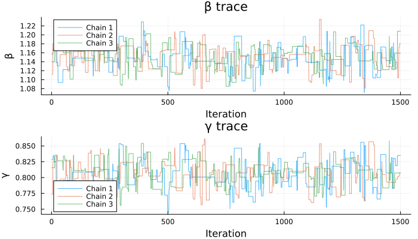

### Posterior Density

``` julia
p3 = histogram(beta_post, bins=30, normalize=true,
               xlabel="β", ylabel="Density", title="Posterior: β", label="")
p4 = histogram(gamma_post, bins=30, normalize=true,
               xlabel="γ", ylabel="Density", title="Posterior: γ", label="")
plot(p3, p4, layout=(1, 2), size=(800, 300))
```

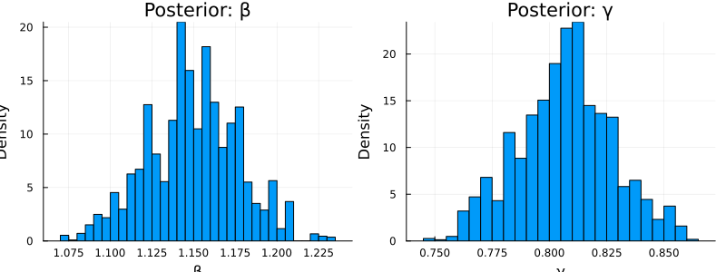

### Log-Density Trace

``` julia
p5 = plot(title="Log-posterior density", xlabel="Iteration", ylabel="Density")
for c in 1:3
    plot!(p5, samples_det.density[:, c], label="Chain $c", alpha=0.7)
end
p5
```

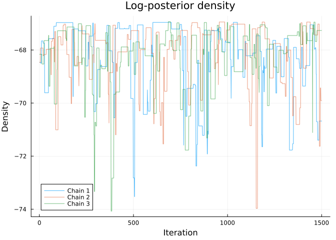

### Posterior Predictive Check

We simulate from the posterior to compare model predictions with data:

``` julia
n_draws = min(200, length(beta_post))
idx = rand(1:length(beta_post), n_draws)

p_pred = plot(xlabel="Time", ylabel="Infected (I)",
              title="Posterior Predictive (Deterministic)", legend=false)

for j in 1:n_draws
    pars = (beta=beta_post[idx[j]], gamma=gamma_post[idx[j]],
            I0=10.0, N=1000.0)
    times = collect(0.0:0.5:20.0)
    r = dust_system_simulate(sir_ode, pars; times=times)
    plot!(p_pred, times, r[2, 1, :], color=:gray, alpha=0.1)
end

scatter!(p_pred, [d.time for d in incidence_data],
         [d.cases for d in incidence_data],
         color=:red, ms=5, label="Observed")
p_pred
```

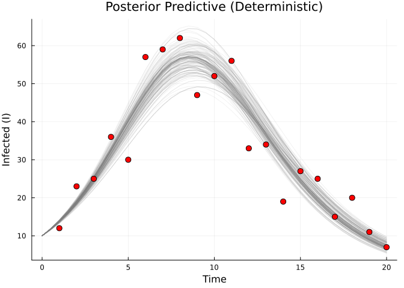

### Stochastic Comparison

We can also define a discrete-time (stochastic) version and fit it with
a particle filter for comparison:

``` julia
sir_discrete = @odin begin
    update(S) = S - n_SI
    update(I) = I + n_SI - n_IR
    update(R) = R + n_IR
    update(incidence) = incidence + n_SI

    initial(S) = N - I0
    initial(I) = I0
    initial(R) = 0
    initial(incidence, zero_every = 1) = 0

    p_SI = 1 - exp(-beta * I / N * dt)
    p_IR = 1 - exp(-gamma * dt)
    n_SI = Binomial(S, p_SI)
    n_IR = Binomial(I, p_IR)

    N = parameter(1000)
    I0 = parameter(10)
    beta = parameter(0.2)
    gamma = parameter(0.1)

    cases = data()
    cases ~ Poisson(incidence + 1e-6)
end

filter = dust_filter_create(sir_discrete, sir_data;
    n_particles=200, dt=0.25, seed=42)

ll_stoch = dust_likelihood_run!(filter, (beta=0.4, gamma=0.2, I0=10.0, N=1000.0))
println("Log-likelihood (filter, stochastic): ", round(ll_stoch, digits=2))

likelihood_stoch = dust_likelihood_monty(filter, packer)
posterior_stoch = likelihood_stoch + prior

samples_stoch = monty_sample(posterior_stoch, sampler, 2000;
    n_chains=3, initial=initial, n_burnin=500, seed=42)
```

    Log-likelihood (filter, stochastic): -94.56

    MontySamples([0.7301529589294927 0.792836447555974 … 1.0182236287379132 1.0182236287379132; 0.48040193000548215 0.48014788334197345 … 0.6768433312961764 0.6768433312961764;;; 0.881152249104835 0.881152249104835 … 0.844816902440399 1.032574491596333; 0.5827626022029953 0.5827626022029953 … 0.5448895868286512 0.6416603768477144;;; 0.921481478896744 1.1093332989444213 … 0.8101921077748822 0.8323534625112573; 0.6521946859989587 0.7530279219876058 … 0.4956192843967889 0.5091209581567532], [-70.84881503855483 -70.06868174365394 -71.40742867952922; -69.90419361283384 -70.06868174365394 -71.73926416197534; … ; -70.98914475109092 -69.63831136063894 -69.67889362212209; -70.98914475109092 -71.24612144522271 -69.79629346893155], [0.3 0.3 0.3; 0.15 0.15 0.15], ["beta", "gamma"], Dict{Symbol, Any}(:acceptance_rate => [0.4795, 0.491, 0.4895]))

``` julia
beta_stoch = vec(samples_stoch.pars[1, :, :])
gamma_stoch = vec(samples_stoch.pars[2, :, :])

p_comp = scatter(beta_post, gamma_post, alpha=0.3, ms=2,
                 color=:red, label="Deterministic (ODE)",
                 xlabel="β", ylabel="γ",
                 title="Stochastic vs Deterministic Posterior")
scatter!(p_comp, beta_stoch, gamma_stoch, alpha=0.3, ms=2,
         color=:blue, label="Stochastic (filter)")
p_comp
```

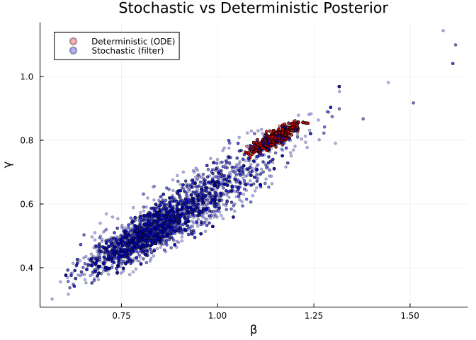

## Part 2: SIS Stochastic Fitting with Particle Filter

### Data

A 150-day SIS case dataset with school closures:

``` julia
schools_cases = [
    2,3,2,2,4,7,2,2,0,3,1,5,4,5,4,5,14,6,12,6,
    6,9,4,7,11,19,18,25,15,16,27,15,19,27,35,23,20,32,23,32,
    30,21,58,31,40,46,38,32,42,46,7,10,19,18,18,20,10,7,11,13,
    36,25,33,24,28,30,38,31,48,40,61,32,30,44,52,39,45,47,40,44,
    43,42,44,34,52,45,40,58,55,41,52,40,62,49,36,40,48,58,41,42,
    37,41,59,42,50,52,35,52,44,38,53,65,48,47,57,53,43,52,32,49,
    19,18,17,17,15,18,12,18,12,8,53,57,42,47,42,41,49,51,45,44,
    49,47,53,33,36,37,44,40,70,57,
]

schools_data = dust_filter_data(
    [(time=Float64(t), cases=Float64(c)) for (t, c) in enumerate(schools_cases)]
)

scatter(1:150, schools_cases, xlabel="Time", ylabel="Cases",
        title="SIS School Closure Data", label="Observed",
        color=:red, ms=3, alpha=0.7)
```

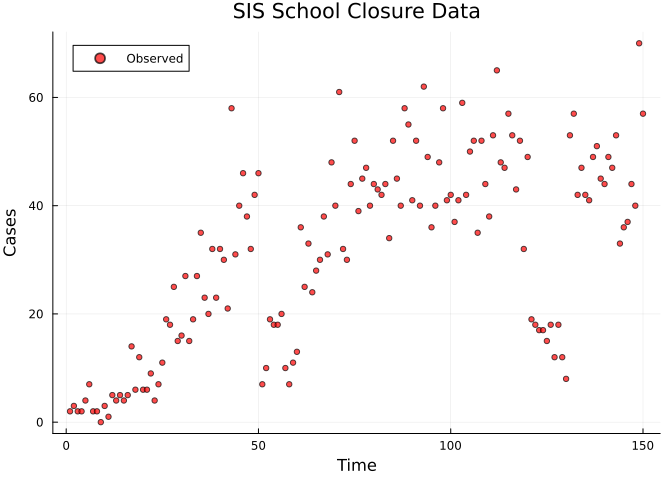

### Model Definition

SIS model with time-varying school closure schedule:

``` julia
sis = @odin begin
    update(S) = S - n_SI + n_IS
    update(I) = I + n_SI - n_IS
    update(incidence) = incidence + n_SI

    initial(S) = N - I0
    initial(I) = I0
    initial(incidence, zero_every = 1) = 0

    schools = interpolate(schools_time, schools_open, :constant)
    schools_time = parameter(rank = 1)
    schools_open = parameter(rank = 1)

    beta = ((1 - schools) * (1 - schools_modifier) + schools) * beta0

    p_SI = 1 - exp(-beta * I / N * dt)
    p_IS = 1 - exp(-gamma * dt)
    n_SI = Binomial(S, p_SI)
    n_IS = Binomial(I, p_IS)

    N = parameter(1000)
    I0 = parameter(10)
    beta0 = parameter(0.2)
    gamma = parameter(0.1)
    schools_modifier = parameter(0.6)

    cases = data()
    cases ~ Poisson(incidence + 1e-6)
end
```

    DustSystemGenerator{var"##OdinModel#323"}(var"##OdinModel#323"(3, [:S, :I, :incidence], [:schools_time, :schools_open, :N, :I0, :beta0, :gamma, :schools_modifier], false, true, false, true, Dict{Symbol, Array}()))

### School Schedule

``` julia
schools_time = [0.0, 50.0, 60.0, 120.0, 130.0, 170.0, 180.0]
schools_open = [1.0,  0.0,  1.0,   0.0,   1.0,   0.0,   1.0]
```

    7-element Vector{Float64}:
     1.0
     0.0
     1.0
     0.0
     1.0
     0.0
     1.0

### Particle Filter Likelihood

``` julia
sis_filter = dust_filter_create(sis, schools_data;
    n_particles=200, dt=1.0, seed=42)

test_pars = (
    beta0=0.3, gamma=0.1, schools_modifier=0.5,
    schools_time=schools_time, schools_open=schools_open,
    N=1000.0, I0=10.0,
)
ll = dust_likelihood_run!(sis_filter, test_pars)
println("Log-likelihood at test parameters: ", round(ll, digits=2))
```

    Log-likelihood at test parameters: -819.89

### MCMC Setup

``` julia
sis_packer = monty_packer(
    [:beta0, :gamma, :schools_modifier];
    fixed=(
        schools_time=schools_time,
        schools_open=schools_open,
        N=1000.0,
        I0=10.0,
    ))

sis_likelihood = dust_likelihood_monty(sis_filter, sis_packer)

sis_prior = @monty_prior begin
    beta0 ~ Exponential(0.3)
    gamma ~ Exponential(0.1)
    schools_modifier ~ Uniform(0.0, 1.0)
end

sis_posterior = sis_likelihood + sis_prior
```

    MontyModel{Odin.var"#monty_model_combine##0#monty_model_combine##1"{MontyModel{Odin.var"#dust_likelihood_monty##0#dust_likelihood_monty##1"{DustFilter{var"##OdinModel#323", Float64, @NamedTuple{cases::Float64}}, MontyPacker}, Nothing, Nothing, Nothing}, MontyModel{var"#28#29", var"#30#31"{var"#28#29"}, var"#32#33", Matrix{Float64}}}, Odin.var"#monty_model_combine##4#monty_model_combine##5"{Odin.var"#monty_model_combine##0#monty_model_combine##1"{MontyModel{Odin.var"#dust_likelihood_monty##0#dust_likelihood_monty##1"{DustFilter{var"##OdinModel#323", Float64, @NamedTuple{cases::Float64}}, MontyPacker}, Nothing, Nothing, Nothing}, MontyModel{var"#28#29", var"#30#31"{var"#28#29"}, var"#32#33", Matrix{Float64}}}}, Nothing, Matrix{Float64}}(["beta0", "gamma", "schools_modifier"], Odin.var"#monty_model_combine##0#monty_model_combine##1"{MontyModel{Odin.var"#dust_likelihood_monty##0#dust_likelihood_monty##1"{DustFilter{var"##OdinModel#323", Float64, @NamedTuple{cases::Float64}}, MontyPacker}, Nothing, Nothing, Nothing}, MontyModel{var"#28#29", var"#30#31"{var"#28#29"}, var"#32#33", Matrix{Float64}}}(MontyModel{Odin.var"#dust_likelihood_monty##0#dust_likelihood_monty##1"{DustFilter{var"##OdinModel#323", Float64, @NamedTuple{cases::Float64}}, MontyPacker}, Nothing, Nothing, Nothing}(["beta0", "gamma", "schools_modifier"], Odin.var"#dust_likelihood_monty##0#dust_likelihood_monty##1"{DustFilter{var"##OdinModel#323", Float64, @NamedTuple{cases::Float64}}, MontyPacker}(DustFilter{var"##OdinModel#323", Float64, @NamedTuple{cases::Float64}}(DustSystemGenerator{var"##OdinModel#323"}(var"##OdinModel#323"(3, [:S, :I, :incidence], [:schools_time, :schools_open, :N, :I0, :beta0, :gamma, :schools_modifier], false, true, false, true, Dict{Symbol, Array}())), FilterData{@NamedTuple{cases::Float64}}([1.0, 2.0, 3.0, 4.0, 5.0, 6.0, 7.0, 8.0, 9.0, 10.0  …  141.0, 142.0, 143.0, 144.0, 145.0, 146.0, 147.0, 148.0, 149.0, 150.0], [(cases = 2.0,), (cases = 3.0,), (cases = 2.0,), (cases = 2.0,), (cases = 4.0,), (cases = 7.0,), (cases = 2.0,), (cases = 2.0,), (cases = 0.0,), (cases = 3.0,)  …  (cases = 49.0,), (cases = 47.0,), (cases = 53.0,), (cases = 33.0,), (cases = 36.0,), (cases = 37.0,), (cases = 44.0,), (cases = 40.0,), (cases = 70.0,), (cases = 57.0,)]), 0.0, 200, 1.0, 42, false, DustSystem{var"##OdinModel#323", Float64, @NamedTuple{beta0::Float64, gamma::Float64, schools_modifier::Float64, schools_time::Vector{Float64}, schools_open::Vector{Float64}, N::Float64, I0::Float64, dt::Float64, _interp_schools::Odin.var"#interp#_constant_interpolator##0"{Vector{Float64}, Vector{Float64}}}}(DustSystemGenerator{var"##OdinModel#323"}(var"##OdinModel#323"(3, [:S, :I, :incidence], [:schools_time, :schools_open, :N, :I0, :beta0, :gamma, :schools_modifier], false, true, false, true, Dict{Symbol, Array}())), [399.0 407.0 … 418.0 408.0; 601.0 593.0 … 582.0 592.0; 63.0 79.0 … 60.0 61.0], (beta0 = 0.3, gamma = 0.1, schools_modifier = 0.5, schools_time = [0.0, 50.0, 60.0, 120.0, 130.0, 170.0, 180.0], schools_open = [1.0, 0.0, 1.0, 0.0, 1.0, 0.0, 1.0], N = 1000.0, I0 = 10.0, dt = 1.0, _interp_schools = Odin.var"#interp#_constant_interpolator##0"{Vector{Float64}, Vector{Float64}}([0.0, 50.0, 60.0, 120.0, 130.0, 170.0, 180.0], [1.0, 0.0, 1.0, 0.0, 1.0, 0.0, 1.0])), 150.0, 1.0, 200, 3, 0, Xoshiro[Xoshiro(0x4821e2be4a155c78, 0x367abe8c8eaa9881, 0x2eb3df4365c4c194, 0x4636b62248b80d94, 0x946aaf42c6e9390a), Xoshiro(0xbd58b97fdc83b477, 0xbf6b45263c237e19, 0x72fc19177f6b6b66, 0x535bbec3e3c9dc8a, 0x13a14f6b238748d5), Xoshiro(0x5080a9e2ce2c3751, 0xb17b85e8204fd596, 0x42195b4f8402046d, 0x067bf22c3fc1ad79, 0x6c9c519d563cbac0), Xoshiro(0x18bb569f32edc7f0, 0xd5e117239aa536a8, 0x08cfb8020470e5ec, 0xf8c1cdf895bd3ee5, 0x23360656549078da), Xoshiro(0xe850c9002ea651e2, 0x9835a43f2a92a463, 0xccd80ad72518890a, 0xb3a2d31557b066ad, 0x5e3265ceea9aee2e), Xoshiro(0xfb5fb3463de30e36, 0x57a13b81bda8b364, 0xbc5b4f2d5e4817e2, 0xae5a0c9c48f7b448, 0x82ccf53a2241a5b6), Xoshiro(0x1b1699099915e731, 0xe763025304007f20, 0xb7d4e565b0ef5419, 0x0453b6f084cd4440, 0xea9814cca13ef0b9), Xoshiro(0x3a15182493a91f4a, 0x3c7cc2c31d579b8a, 0x5d45a42b54ad8596, 0x8e39ba8a73b4c537, 0x89edbefac11aca34), Xoshiro(0xde287825b4073d38, 0xabfba969f17ff0a1, 0xd87622ab905a77ca, 0x36b8dbc9fa670d6e, 0x168a381663c823a4), Xoshiro(0x501e19e78a8f3a4d, 0x7edac5a796071a24, 0xee2f82440b8c4e43, 0xec8bc4ef2f4a81cd, 0x5ad151eb73579d81)  …  Xoshiro(0x462da395bb5eeceb, 0xc41d08ecad5c216b, 0xb6721982788a297f, 0x9fd28fb9272da33e, 0xa5c9fbe07e6aa8f1), Xoshiro(0x44dd896e0115e4bd, 0xeb5f986144b02881, 0xc2a09f7189de8f90, 0x63ca8f9cfb27e64d, 0xf3e7fce68a694d33), Xoshiro(0xfdf7021fcaab0489, 0x4ec59f2766d9d1ac, 0x254a3dc6d791fc28, 0xd5df9386badbaf18, 0x2da4ff6f2ff9e31c), Xoshiro(0x6513c79f90370b50, 0x9b1b14b26771a9a0, 0xf47ca46cbda97c34, 0x2bd706ada6d340bb, 0xdd6f1f2ecb22b5c3), Xoshiro(0x7e07f8ec124aabf6, 0x60c8321c686871d0, 0x11d08568a8977345, 0x8ab271b78712a0ef, 0x6ee24a43fe5f7390), Xoshiro(0x45b1cbf3cfe9abfa, 0x773d14599de45eb0, 0x520fff796b1046a1, 0x12dc224de1710044, 0xca9b7fa01dee0b04), Xoshiro(0xf70862bb06433b13, 0x14ffe01b71927055, 0x74b7761bfc6a2673, 0xbcf6fb527eee7a78, 0x38751e7e1c4fbcca), Xoshiro(0x32461a40c1403240, 0x54e24dfd9486b9c7, 0x28e6691c956b2f21, 0xa4fe47376c8ab4f8, 0x1e6587ea000715d2), Xoshiro(0xc8a1652bd269eb00, 0xb1992ee293ab9755, 0x770cef5c2fa6040e, 0xd33d5f2db959ea40, 0xdccf5ec3ac8b7ac8), Xoshiro(0x57f6529e11ecea9d, 0xa8c1a403c1f4e2de, 0x58f5325bb25b7268, 0x916ff7730faeee33, 0x96222b8b0ce5335c)], [:S, :I, :incidence], Symbol[], Odin.ZeroEveryEntry[Odin.ZeroEveryEntry(3:3, 1)], [408.0, 592.0, 61.0], [3.82e-321, 3.824e-321, 0.0], [-3.2371690979180983, -6.337321094858169, -4.05177781886664, -2.9419261404279666, -3.8839093737239807, -3.076038214692403, -3.455774146022975, -3.455774146022975, -4.839660480717157, -3.7283692509660398  …  -4.4230956128254775, -3.455774146022975, -5.5440482606765045, -3.018208410337593, -3.2371690979180983, -6.063445554921401, -4.4230956128254775, -7.212851617812987, -3.018208410337593, -3.076038214692403], [1, 2, 3, 4, 5, 6, 7, 8, 9, 9  …  191, 192, 193, 194, 194, 196, 196, 197, 199, 200], [406.0 422.0 … 407.0 420.0; 594.0 578.0 … 593.0 580.0; 61.0 62.0 … 74.0 74.0], nothing, nothing, Union{Nothing, Odin.DP5Workspace{Float64}}[nothing, nothing], [[3.7e-321, 3.854e-321, 2.141301576e-314], [3.09e-321, 3.093e-321, 7.0605062654e-314]], [Float64[], Float64[]], Dict{Symbol, Array}[Dict(), Dict()], 2)), MontyPacker([:beta0, :gamma, :schools_modifier], [:beta0, :gamma, :schools_modifier], Symbol[], Dict{Symbol, Tuple}(), Dict{Symbol, UnitRange{Int64}}(:gamma => 2:2, :beta0 => 1:1, :schools_modifier => 3:3), 3, (schools_time = [0.0, 50.0, 60.0, 120.0, 130.0, 170.0, 180.0], schools_open = [1.0, 0.0, 1.0, 0.0, 1.0, 0.0, 1.0], N = 1000.0, I0 = 10.0), nothing)), nothing, nothing, nothing, Odin.MontyModelProperties(false, false, true, false)), MontyModel{var"#28#29", var"#30#31"{var"#28#29"}, var"#32#33", Matrix{Float64}}(["beta0", "gamma", "schools_modifier"], var"#28#29"(), var"#30#31"{var"#28#29"}(var"#28#29"()), var"#32#33"(), [0.0 Inf; 0.0 Inf; 0.0 1.0], Odin.MontyModelProperties(true, true, false, false))), Odin.var"#monty_model_combine##4#monty_model_combine##5"{Odin.var"#monty_model_combine##0#monty_model_combine##1"{MontyModel{Odin.var"#dust_likelihood_monty##0#dust_likelihood_monty##1"{DustFilter{var"##OdinModel#323", Float64, @NamedTuple{cases::Float64}}, MontyPacker}, Nothing, Nothing, Nothing}, MontyModel{var"#28#29", var"#30#31"{var"#28#29"}, var"#32#33", Matrix{Float64}}}}(Odin.var"#monty_model_combine##0#monty_model_combine##1"{MontyModel{Odin.var"#dust_likelihood_monty##0#dust_likelihood_monty##1"{DustFilter{var"##OdinModel#323", Float64, @NamedTuple{cases::Float64}}, MontyPacker}, Nothing, Nothing, Nothing}, MontyModel{var"#28#29", var"#30#31"{var"#28#29"}, var"#32#33", Matrix{Float64}}}(MontyModel{Odin.var"#dust_likelihood_monty##0#dust_likelihood_monty##1"{DustFilter{var"##OdinModel#323", Float64, @NamedTuple{cases::Float64}}, MontyPacker}, Nothing, Nothing, Nothing}(["beta0", "gamma", "schools_modifier"], Odin.var"#dust_likelihood_monty##0#dust_likelihood_monty##1"{DustFilter{var"##OdinModel#323", Float64, @NamedTuple{cases::Float64}}, MontyPacker}(DustFilter{var"##OdinModel#323", Float64, @NamedTuple{cases::Float64}}(DustSystemGenerator{var"##OdinModel#323"}(var"##OdinModel#323"(3, [:S, :I, :incidence], [:schools_time, :schools_open, :N, :I0, :beta0, :gamma, :schools_modifier], false, true, false, true, Dict{Symbol, Array}())), FilterData{@NamedTuple{cases::Float64}}([1.0, 2.0, 3.0, 4.0, 5.0, 6.0, 7.0, 8.0, 9.0, 10.0  …  141.0, 142.0, 143.0, 144.0, 145.0, 146.0, 147.0, 148.0, 149.0, 150.0], [(cases = 2.0,), (cases = 3.0,), (cases = 2.0,), (cases = 2.0,), (cases = 4.0,), (cases = 7.0,), (cases = 2.0,), (cases = 2.0,), (cases = 0.0,), (cases = 3.0,)  …  (cases = 49.0,), (cases = 47.0,), (cases = 53.0,), (cases = 33.0,), (cases = 36.0,), (cases = 37.0,), (cases = 44.0,), (cases = 40.0,), (cases = 70.0,), (cases = 57.0,)]), 0.0, 200, 1.0, 42, false, DustSystem{var"##OdinModel#323", Float64, @NamedTuple{beta0::Float64, gamma::Float64, schools_modifier::Float64, schools_time::Vector{Float64}, schools_open::Vector{Float64}, N::Float64, I0::Float64, dt::Float64, _interp_schools::Odin.var"#interp#_constant_interpolator##0"{Vector{Float64}, Vector{Float64}}}}(DustSystemGenerator{var"##OdinModel#323"}(var"##OdinModel#323"(3, [:S, :I, :incidence], [:schools_time, :schools_open, :N, :I0, :beta0, :gamma, :schools_modifier], false, true, false, true, Dict{Symbol, Array}())), [399.0 407.0 … 418.0 408.0; 601.0 593.0 … 582.0 592.0; 63.0 79.0 … 60.0 61.0], (beta0 = 0.3, gamma = 0.1, schools_modifier = 0.5, schools_time = [0.0, 50.0, 60.0, 120.0, 130.0, 170.0, 180.0], schools_open = [1.0, 0.0, 1.0, 0.0, 1.0, 0.0, 1.0], N = 1000.0, I0 = 10.0, dt = 1.0, _interp_schools = Odin.var"#interp#_constant_interpolator##0"{Vector{Float64}, Vector{Float64}}([0.0, 50.0, 60.0, 120.0, 130.0, 170.0, 180.0], [1.0, 0.0, 1.0, 0.0, 1.0, 0.0, 1.0])), 150.0, 1.0, 200, 3, 0, Xoshiro[Xoshiro(0x4821e2be4a155c78, 0x367abe8c8eaa9881, 0x2eb3df4365c4c194, 0x4636b62248b80d94, 0x946aaf42c6e9390a), Xoshiro(0xbd58b97fdc83b477, 0xbf6b45263c237e19, 0x72fc19177f6b6b66, 0x535bbec3e3c9dc8a, 0x13a14f6b238748d5), Xoshiro(0x5080a9e2ce2c3751, 0xb17b85e8204fd596, 0x42195b4f8402046d, 0x067bf22c3fc1ad79, 0x6c9c519d563cbac0), Xoshiro(0x18bb569f32edc7f0, 0xd5e117239aa536a8, 0x08cfb8020470e5ec, 0xf8c1cdf895bd3ee5, 0x23360656549078da), Xoshiro(0xe850c9002ea651e2, 0x9835a43f2a92a463, 0xccd80ad72518890a, 0xb3a2d31557b066ad, 0x5e3265ceea9aee2e), Xoshiro(0xfb5fb3463de30e36, 0x57a13b81bda8b364, 0xbc5b4f2d5e4817e2, 0xae5a0c9c48f7b448, 0x82ccf53a2241a5b6), Xoshiro(0x1b1699099915e731, 0xe763025304007f20, 0xb7d4e565b0ef5419, 0x0453b6f084cd4440, 0xea9814cca13ef0b9), Xoshiro(0x3a15182493a91f4a, 0x3c7cc2c31d579b8a, 0x5d45a42b54ad8596, 0x8e39ba8a73b4c537, 0x89edbefac11aca34), Xoshiro(0xde287825b4073d38, 0xabfba969f17ff0a1, 0xd87622ab905a77ca, 0x36b8dbc9fa670d6e, 0x168a381663c823a4), Xoshiro(0x501e19e78a8f3a4d, 0x7edac5a796071a24, 0xee2f82440b8c4e43, 0xec8bc4ef2f4a81cd, 0x5ad151eb73579d81)  …  Xoshiro(0x462da395bb5eeceb, 0xc41d08ecad5c216b, 0xb6721982788a297f, 0x9fd28fb9272da33e, 0xa5c9fbe07e6aa8f1), Xoshiro(0x44dd896e0115e4bd, 0xeb5f986144b02881, 0xc2a09f7189de8f90, 0x63ca8f9cfb27e64d, 0xf3e7fce68a694d33), Xoshiro(0xfdf7021fcaab0489, 0x4ec59f2766d9d1ac, 0x254a3dc6d791fc28, 0xd5df9386badbaf18, 0x2da4ff6f2ff9e31c), Xoshiro(0x6513c79f90370b50, 0x9b1b14b26771a9a0, 0xf47ca46cbda97c34, 0x2bd706ada6d340bb, 0xdd6f1f2ecb22b5c3), Xoshiro(0x7e07f8ec124aabf6, 0x60c8321c686871d0, 0x11d08568a8977345, 0x8ab271b78712a0ef, 0x6ee24a43fe5f7390), Xoshiro(0x45b1cbf3cfe9abfa, 0x773d14599de45eb0, 0x520fff796b1046a1, 0x12dc224de1710044, 0xca9b7fa01dee0b04), Xoshiro(0xf70862bb06433b13, 0x14ffe01b71927055, 0x74b7761bfc6a2673, 0xbcf6fb527eee7a78, 0x38751e7e1c4fbcca), Xoshiro(0x32461a40c1403240, 0x54e24dfd9486b9c7, 0x28e6691c956b2f21, 0xa4fe47376c8ab4f8, 0x1e6587ea000715d2), Xoshiro(0xc8a1652bd269eb00, 0xb1992ee293ab9755, 0x770cef5c2fa6040e, 0xd33d5f2db959ea40, 0xdccf5ec3ac8b7ac8), Xoshiro(0x57f6529e11ecea9d, 0xa8c1a403c1f4e2de, 0x58f5325bb25b7268, 0x916ff7730faeee33, 0x96222b8b0ce5335c)], [:S, :I, :incidence], Symbol[], Odin.ZeroEveryEntry[Odin.ZeroEveryEntry(3:3, 1)], [408.0, 592.0, 61.0], [3.82e-321, 3.824e-321, 0.0], [-3.2371690979180983, -6.337321094858169, -4.05177781886664, -2.9419261404279666, -3.8839093737239807, -3.076038214692403, -3.455774146022975, -3.455774146022975, -4.839660480717157, -3.7283692509660398  …  -4.4230956128254775, -3.455774146022975, -5.5440482606765045, -3.018208410337593, -3.2371690979180983, -6.063445554921401, -4.4230956128254775, -7.212851617812987, -3.018208410337593, -3.076038214692403], [1, 2, 3, 4, 5, 6, 7, 8, 9, 9  …  191, 192, 193, 194, 194, 196, 196, 197, 199, 200], [406.0 422.0 … 407.0 420.0; 594.0 578.0 … 593.0 580.0; 61.0 62.0 … 74.0 74.0], nothing, nothing, Union{Nothing, Odin.DP5Workspace{Float64}}[nothing, nothing], [[3.7e-321, 3.854e-321, 2.141301576e-314], [3.09e-321, 3.093e-321, 7.0605062654e-314]], [Float64[], Float64[]], Dict{Symbol, Array}[Dict(), Dict()], 2)), MontyPacker([:beta0, :gamma, :schools_modifier], [:beta0, :gamma, :schools_modifier], Symbol[], Dict{Symbol, Tuple}(), Dict{Symbol, UnitRange{Int64}}(:gamma => 2:2, :beta0 => 1:1, :schools_modifier => 3:3), 3, (schools_time = [0.0, 50.0, 60.0, 120.0, 130.0, 170.0, 180.0], schools_open = [1.0, 0.0, 1.0, 0.0, 1.0, 0.0, 1.0], N = 1000.0, I0 = 10.0), nothing)), nothing, nothing, nothing, Odin.MontyModelProperties(false, false, true, false)), MontyModel{var"#28#29", var"#30#31"{var"#28#29"}, var"#32#33", Matrix{Float64}}(["beta0", "gamma", "schools_modifier"], var"#28#29"(), var"#30#31"{var"#28#29"}(var"#28#29"()), var"#32#33"(), [0.0 Inf; 0.0 Inf; 0.0 1.0], Odin.MontyModelProperties(true, true, false, false)))), nothing, [0.0 Inf; 0.0 Inf; 0.0 1.0], Odin.MontyModelProperties(true, false, true, false))

### Run MCMC

``` julia
sis_vcv = diagm([2e-4, 2e-4, 4e-4])
sis_sampler = monty_sampler_random_walk(sis_vcv)

sis_initial = repeat([0.3, 0.1, 0.5], 1, 4)
sis_samples = monty_sample(sis_posterior, sis_sampler, 500;
    n_chains=4, initial=sis_initial, n_burnin=100, seed=42)
```

    MontySamples([0.19641456946357483 0.19641456946357483 … 0.19786669562185288 0.19786669562185288; 0.10248346593995364 0.10248346593995364 … 0.10272851631595545 0.10272851631595545; 0.6349611728510065 0.6349611728510065 … 0.6455072229681397 0.6455072229681397;;; 0.2064273047493751 0.2064273047493751 … 0.19225433064565353 0.19225433064565353; 0.12181665455669381 0.12181665455669381 … 0.09202398055774864 0.09202398055774864; 0.6238546840814383 0.6238546840814383 … 0.7245404099221484 0.7245404099221484;;; 0.19366235004410265 0.20112141251956983 … 0.209484523557019 0.209484523557019; 0.09561516750201249 0.09298541825665377 … 0.11908669331155156 0.11908669331155156; 0.6552259687747467 0.6484039574645404 … 0.6866586688178874 0.6866586688178874;;; 0.1975185381734387 0.19817557338540756 … 0.20021683552394193 0.20021683552394193; 0.09247421483876729 0.10232894636624186 … 0.1008456326830429 0.1008456326830429; 0.6663709041392546 0.6319607390472488 … 0.6682155019080844 0.6682155019080844], [-483.3851927537519 -485.8019541749743 -484.67141692217734 -483.8240457451682; -483.3851927537519 -485.8019541749743 -485.10363180638103 -484.3438728203184; … ; -483.13792165584897 -487.6529669726851 -485.9363318876441 -482.46168703187953; -483.13792165584897 -487.6529669726851 -485.9363318876441 -482.46168703187953], [0.3 0.3 0.3 0.3; 0.1 0.1 0.1 0.1; 0.5 0.5 0.5 0.5], ["beta0", "gamma", "schools_modifier"], Dict{Symbol, Any}(:acceptance_rate => [0.174, 0.148, 0.18, 0.194]))

### Posterior Summary

``` julia
beta0_post = vec(sis_samples.pars[1, :, :])
gamma_sis_post = vec(sis_samples.pars[2, :, :])
modifier_post = vec(sis_samples.pars[3, :, :])

println("β₀: mean = ", round(mean(beta0_post), digits=4),
        ", 95% CI = [", round(quantile(beta0_post, 0.025), digits=4),
        ", ", round(quantile(beta0_post, 0.975), digits=4), "]")
println("γ:  mean = ", round(mean(gamma_sis_post), digits=4),
        ", 95% CI = [", round(quantile(gamma_sis_post, 0.025), digits=4),
        ", ", round(quantile(gamma_sis_post, 0.975), digits=4), "]")
println("modifier: mean = ", round(mean(modifier_post), digits=4),
        ", 95% CI = [", round(quantile(modifier_post, 0.025), digits=4),
        ", ", round(quantile(modifier_post, 0.975), digits=4), "]")
```

    β₀: mean = 0.1992, 95% CI = [0.1879, 0.214]
    γ:  mean = 0.1023, 95% CI = [0.0858, 0.1228]
    modifier: mean = 0.6518, 95% CI = [0.5727, 0.6996]

### Trace Plots

``` julia
p_t1 = plot(title="β₀ trace", xlabel="Iteration", ylabel="β₀")
p_t2 = plot(title="γ trace", xlabel="Iteration", ylabel="γ")
p_t3 = plot(title="schools_modifier trace", xlabel="Iteration", ylabel="modifier")
for c in 1:4
    plot!(p_t1, sis_samples.pars[1, :, c], label="Chain $c", alpha=0.6)
    plot!(p_t2, sis_samples.pars[2, :, c], label="Chain $c", alpha=0.6)
    plot!(p_t3, sis_samples.pars[3, :, c], label="Chain $c", alpha=0.6)
end
plot(p_t1, p_t2, p_t3, layout=(3, 1), size=(700, 600))
```

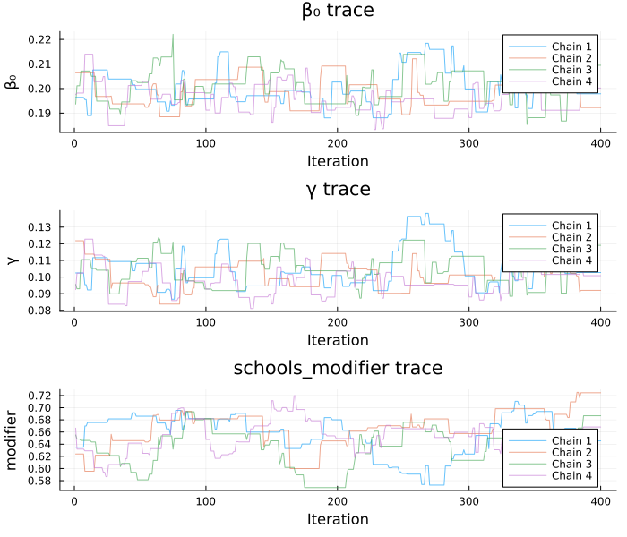

### Posterior Predictive

``` julia
n_draws = min(200, length(beta0_post))
idx = rand(1:length(beta0_post), n_draws)

p_sis_pred = plot(xlabel="Time", ylabel="Incidence",
                  title="SIS Posterior Predictive", legend=false)

for j in 1:n_draws
    pars_j = (
        beta0=beta0_post[idx[j]],
        gamma=gamma_sis_post[idx[j]],
        schools_modifier=modifier_post[idx[j]],
        schools_time=schools_time,
        schools_open=schools_open,
        N=1000.0, I0=10.0,
    )
    sys = dust_system_create(sis, pars_j; dt=1.0, n_particles=1, seed=j)
    dust_system_set_state_initial!(sys)
    times = collect(0.0:1.0:150.0)
    r = dust_system_simulate(sys, times)
    plot!(p_sis_pred, times, r[3, 1, :], color=:gray, alpha=0.1)
end

scatter!(p_sis_pred, 1:150, schools_cases, color=:red, ms=2, alpha=0.7)
p_sis_pred
```

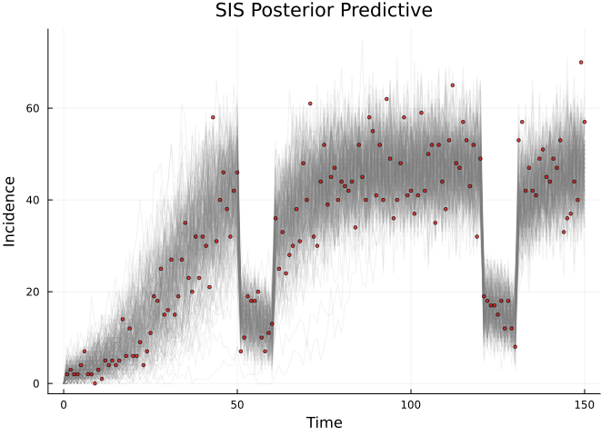

## Part 3: Counterfactual Projections

### Forward Projection from Fitted Posterior

We simulate forward from day 150 to day 200 using posterior parameter
draws, continuing the epidemic with the original school schedule:

``` julia
n_proj = min(200, length(beta0_post))
proj_times = collect(150.0:1.0:200.0)

p_proj = plot(xlabel="Time", ylabel="Incidence",
              title="Forward Projection (Days 150–200)", legend=:topright)

# First show the fitted trajectories to 150
for j in 1:min(100, n_proj)
    pars_j = (
        beta0=beta0_post[j], gamma=gamma_sis_post[j],
        schools_modifier=modifier_post[j],
        schools_time=schools_time, schools_open=schools_open,
        N=1000.0, I0=10.0,
    )
    sys = dust_system_create(sis, pars_j; dt=1.0, n_particles=1, seed=j)
    dust_system_set_state_initial!(sys)
    full_times = collect(0.0:1.0:200.0)
    r = dust_system_simulate(sys, full_times)
    plot!(p_proj, full_times, r[3, 1, :], color=:gray, alpha=0.08, label=nothing)
end

scatter!(p_proj, 1:150, schools_cases, color=:red, ms=2, alpha=0.7, label="Observed")
vline!(p_proj, [150.0], ls=:dash, color=:black, label="Projection start")
p_proj
```

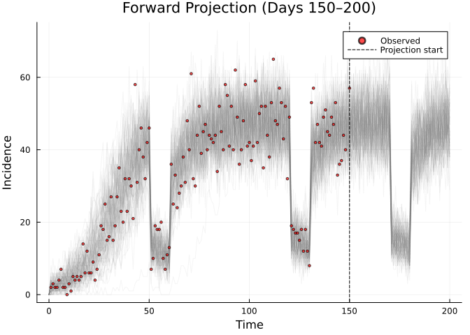

### Counterfactual: No Second and Third School Closure

What if only the first school closure (days 50–60) happened, but the
later closures (120–130, 170–180) did not?

``` julia
# Original schedule has closures at 50-60, 120-130, 170-180
# Counterfactual: only first closure
cf_schools_time = [0.0, 50.0, 60.0]
cf_schools_open = [1.0,  0.0,  1.0]

n_proj = min(200, length(beta0_post))

p_cf = plot(xlabel="Time", ylabel="Incidence",
            title="Counterfactual: Only First School Closure",
            legend=:topright)

for j in 1:n_proj
    # Baseline (original schedule)
    pars_base = (
        beta0=beta0_post[j], gamma=gamma_sis_post[j],
        schools_modifier=modifier_post[j],
        schools_time=schools_time, schools_open=schools_open,
        N=1000.0, I0=10.0,
    )
    sys_base = dust_system_create(sis, pars_base; dt=1.0, n_particles=1, seed=j)
    dust_system_set_state_initial!(sys_base)
    full_times = collect(0.0:1.0:200.0)
    r_base = dust_system_simulate(sys_base, full_times)

    # Counterfactual (only first closure)
    pars_cf = (
        beta0=beta0_post[j], gamma=gamma_sis_post[j],
        schools_modifier=modifier_post[j],
        schools_time=cf_schools_time, schools_open=cf_schools_open,
        N=1000.0, I0=10.0,
    )
    sys_cf = dust_system_create(sis, pars_cf; dt=1.0, n_particles=1, seed=j)
    dust_system_set_state_initial!(sys_cf)
    r_cf = dust_system_simulate(sys_cf, full_times)

    plot!(p_cf, full_times, r_base[3, 1, :], color=:gray, alpha=0.05, label=nothing)
    plot!(p_cf, full_times, r_cf[3, 1, :], color=:blue, alpha=0.05, label=nothing)
end

scatter!(p_cf, 1:150, schools_cases, color=:red, ms=2, alpha=0.7, label="Observed")
# Manual legend entries
plot!(p_cf, [], [], color=:gray, lw=2, label="Fitted (3 closures)")
plot!(p_cf, [], [], color=:blue, lw=2, label="Counterfactual (1 closure)")
p_cf
```

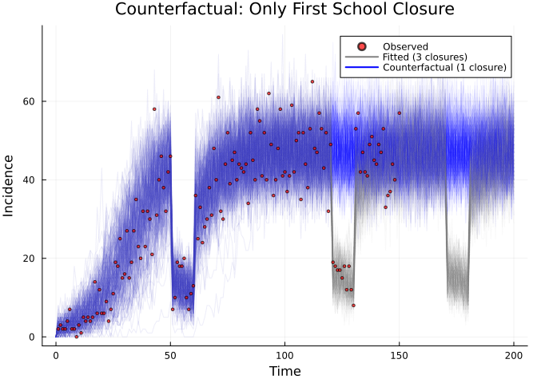

### Counterfactual: No School Closures at All

``` julia
no_closure_time = [0.0]
no_closure_open = [1.0]

p_cf2 = plot(xlabel="Time", ylabel="Incidence",
             title="Counterfactual: No School Closures vs Observed",
             legend=:topright)

for j in 1:n_proj
    pars_base = (
        beta0=beta0_post[j], gamma=gamma_sis_post[j],
        schools_modifier=modifier_post[j],
        schools_time=schools_time, schools_open=schools_open,
        N=1000.0, I0=10.0,
    )
    sys_base = dust_system_create(sis, pars_base; dt=1.0, n_particles=1, seed=j)
    dust_system_set_state_initial!(sys_base)
    full_times = collect(0.0:1.0:200.0)
    r_base = dust_system_simulate(sys_base, full_times)

    pars_no = (
        beta0=beta0_post[j], gamma=gamma_sis_post[j],
        schools_modifier=modifier_post[j],
        schools_time=no_closure_time, schools_open=no_closure_open,
        N=1000.0, I0=10.0,
    )
    sys_no = dust_system_create(sis, pars_no; dt=1.0, n_particles=1, seed=j)
    dust_system_set_state_initial!(sys_no)
    r_no = dust_system_simulate(sys_no, full_times)

    plot!(p_cf2, full_times, r_base[3, 1, :], color=:gray, alpha=0.05, label=nothing)
    plot!(p_cf2, full_times, r_no[3, 1, :], color=:orange, alpha=0.05, label=nothing)
end

scatter!(p_cf2, 1:150, schools_cases, color=:red, ms=2, alpha=0.7, label="Observed")
plot!(p_cf2, [], [], color=:gray, lw=2, label="Fitted (3 closures)")
plot!(p_cf2, [], [], color=:orange, lw=2, label="No closures")
p_cf2
```

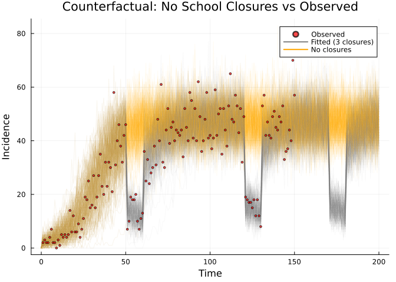

## Summary

| Step | API | Description |
|----|----|----|
| Define model | `@odin` | DSL for ODE/stochastic models |
| Prepare data | `dust_filter_data()` | Time-series observations |
| Deterministic likelihood | `dust_unfilter_create()` | ODE-based |
| Stochastic likelihood | `dust_filter_create()` | Particle filter |
| Bridge to MCMC | `dust_likelihood_monty()` | Wraps filter/unfilter as MontyModel |
| Define prior | `@monty_prior` | Composable prior distributions |
| Combine | `posterior = likelihood + prior` | Adds log-densities |
| Sample | `monty_sample()` | Random-walk MCMC |
| Counterfactuals | `dust_system_create()` + `dust_system_simulate()` | Scenario projections |

Key takeaways:

- **Deterministic fitting** (unfilter) is fast and supports automatic
  gradients — ideal for ODE models
- **Stochastic fitting** (particle filter) handles discrete-time models
  with demographic stochasticity
- **Counterfactual projections** leverage the full posterior
  uncertainty, naturally propagating parameter uncertainty into scenario
  comparisons
