# Complete Fitting Workflow


## Introduction

R companion to the Julia fitting workflow vignette. This demonstrates
the full Bayesian fitting pipeline using odin2, dust2, and monty:

1.  **Part 1** — Deterministic SIR fitting with unfilter + MCMC
2.  **Part 2** — Stochastic SIS fitting with particle filter + MCMC
3.  **Part 3** — Counterfactual projections from the posterior

``` r
library(odin2)
library(dust2)
library(monty)
```

## Part 1: SIR ODE Fitting with Unfilter

### Data

``` r
incidence <- data.frame(
  time = 1:20,
  cases = c(12, 23, 25, 36, 30, 57, 59, 62, 47, 52,
            56, 33, 34, 19, 27, 25, 15, 20, 11, 7)
)

plot(incidence, pch = 19, col = "red", main = "SIR Incidence Data")
```

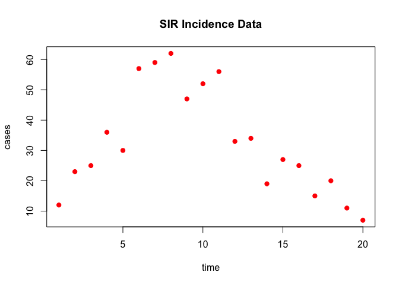

### Model Definition

``` r
sir <- odin({
  update(S) <- S - n_SI
  update(I) <- I + n_SI - n_IR
  update(R) <- R + n_IR
  update(incidence) <- incidence + n_SI

  initial(S) <- N - I0
  initial(I) <- I0
  initial(R) <- 0
  initial(incidence, zero_every = 1) <- 0

  p_SI <- 1 - exp(-beta * I / N * dt)
  p_IR <- 1 - exp(-gamma * dt)
  n_SI <- Binomial(S, p_SI)
  n_IR <- Binomial(I, p_IR)

  N <- parameter(1000)
  I0 <- parameter(10)
  beta <- parameter(0.2)
  gamma <- parameter(0.1)

  cases <- data()
  cases ~ Poisson(incidence)
})
```

    ✔ Wrote 'DESCRIPTION'

    ✔ Wrote 'NAMESPACE'

    ✔ Wrote 'R/dust.R'

    ✔ Wrote 'src/dust.cpp'

    ✔ Wrote 'src/Makevars'

    ℹ 27 functions decorated with [[cpp11::register]]

    ✔ generated file 'cpp11.R'

    ✔ generated file 'cpp11.cpp'

    ℹ Re-compiling odin.system83e0d37f

    ── R CMD INSTALL ───────────────────────────────────────────────────────────────
    * installing *source* package ‘odin.system83e0d37f’ ...
    ** this is package ‘odin.system83e0d37f’ version ‘0.0.1’
    ** using staged installation
    ** libs
    using C++ compiler: ‘Homebrew clang version 21.1.5’
    using SDK: ‘MacOSX15.5.sdk’
    clang++ -arch arm64 -std=gnu++17 -I"/Library/Frameworks/R.framework/Resources/include" -DNDEBUG  -I'/Library/Frameworks/R.framework/Versions/4.5-arm64/Resources/library/cpp11/include' -I'/Library/Frameworks/R.framework/Versions/4.5-arm64/Resources/library/dust2/include' -I'/Library/Frameworks/R.framework/Versions/4.5-arm64/Resources/library/monty/include' -I/opt/R/arm64/include   -DHAVE_INLINE   -fPIC  -falign-functions=64 -Wall -g -O2  -Wall -pedantic  -c cpp11.cpp -o cpp11.o
    clang++ -arch arm64 -std=gnu++17 -I"/Library/Frameworks/R.framework/Resources/include" -DNDEBUG  -I'/Library/Frameworks/R.framework/Versions/4.5-arm64/Resources/library/cpp11/include' -I'/Library/Frameworks/R.framework/Versions/4.5-arm64/Resources/library/dust2/include' -I'/Library/Frameworks/R.framework/Versions/4.5-arm64/Resources/library/monty/include' -I/opt/R/arm64/include   -DHAVE_INLINE   -fPIC  -falign-functions=64 -Wall -g -O2  -Wall -pedantic  -c dust.cpp -o dust.o
    In file included from dust.cpp:99:
    In file included from /Library/Frameworks/R.framework/Versions/4.5-arm64/Resources/library/dust2/include/dust2/r/discrete/system.hpp:5:
    /Library/Frameworks/R.framework/Versions/4.5-arm64/Resources/library/monty/include/monty/r/random.hpp:60:43: warning: implicit conversion from 'type' (aka 'unsigned long') to 'double' changes value from 18446744073709551615 to 18446744073709551616 [-Wimplicit-const-int-float-conversion]
       60 |       std::ceil(std::abs(::unif_rand()) * std::numeric_limits<size_t>::max());
          |                                         ~ ^~~~~~~~~~~~~~~~~~~~~~~~~~~~~~~~~~
    /Library/Frameworks/R.framework/Versions/4.5-arm64/Resources/library/monty/include/monty/r/random.hpp:60:43: warning: implicit conversion from 'type' (aka 'unsigned long') to 'double' changes value from 18446744073709551615 to 18446744073709551616 [-Wimplicit-const-int-float-conversion]
       60 |       std::ceil(std::abs(::unif_rand()) * std::numeric_limits<size_t>::max());
          |                                         ~ ^~~~~~~~~~~~~~~~~~~~~~~~~~~~~~~~~~
    /Library/Frameworks/R.framework/Versions/4.5-arm64/Resources/library/dust2/include/dust2/r/discrete/system.hpp:41:33: note: in instantiation of function template specialization 'monty::random::r::as_rng_seed<monty::random::xoshiro_state<unsigned long long, 4, monty::random::scrambler::plus>>' requested here
       41 |   auto seed = monty::random::r::as_rng_seed<rng_state_type>(r_seed);
          |                                 ^
    dust.cpp:105:20: note: in instantiation of function template specialization 'dust2::r::dust2_discrete_alloc<odin_system>' requested here
      105 |   return dust2::r::dust2_discrete_alloc<odin_system>(r_pars, r_time, r_time_control, r_n_particles, r_n_groups, r_seed, r_deterministic, r_n_threads);
          |                    ^
    2 warnings generated.
    clang++ -arch arm64 -std=gnu++17 -dynamiclib -Wl,-headerpad_max_install_names -undefined dynamic_lookup -L/Library/Frameworks/R.framework/Resources/lib -L/opt/R/arm64/lib -o odin.system83e0d37f.so cpp11.o dust.o -F/Library/Frameworks/R.framework/.. -framework R
    installing to /private/var/folders/yh/30rj513j6mn1n7x556c2v4w80000gn/T/RtmpKzTfyL/devtools_install_108015ffce01a/00LOCK-dust_1080148c3f718/00new/odin.system83e0d37f/libs
    ** checking absolute paths in shared objects and dynamic libraries
    * DONE (odin.system83e0d37f)

    ℹ Loading odin.system83e0d37f

### Deterministic Likelihood (Unfilter)

``` r
unfilter <- Likelihood(sir, data = incidence, time_start = 0,
                                  dt = 0.25)
dust_likelihood_run(unfilter, list(beta = 0.4, gamma = 0.2))
```

    [1] -371.9752

### MCMC Setup

``` r
packer <- Packer(c("beta", "gamma"))

likelihood <- as_model(unfilter, packer)

prior <- monty_dsl({
  beta ~ Exponential(mean = 0.5)
  gamma ~ Exponential(mean = 0.3)
})

posterior <- likelihood + prior
```

### Run MCMC (3 chains)

``` r
vcv <- matrix(c(0.01, 0.005, 0.005, 0.005), 2, 2)
sampler <- random_walk(vcv)

samples_det <- sample(posterior, sampler, 2000, n_chains = 3)
```

    ⡀⠀ Sampling [▁▁▁] ■                                |   0% ETA: 15s

    ✔ Sampled 6000 steps across 3 chains in 379ms

### Posterior Summary

``` r
samples_df <- posterior::as_draws_df(samples_det)
posterior::summarise_draws(samples_df)
```

    # A tibble: 2 × 10
      variable  mean median     sd    mad    q5   q95  rhat ess_bulk ess_tail
      <chr>    <dbl>  <dbl>  <dbl>  <dbl> <dbl> <dbl> <dbl>    <dbl>    <dbl>
    1 beta     0.997  1.00  0.0714 0.0323 0.951 1.06   1.04     59.5     78.9
    2 gamma    0.675  0.678 0.0583 0.0401 0.602 0.749  1.06     37.6     66.8

### Trace Plots

``` r
matplot(samples_det$density, type = "l", lty = 1,
        xlab = "Iteration", ylab = "Log-density",
        main = "Log-posterior trace")
```

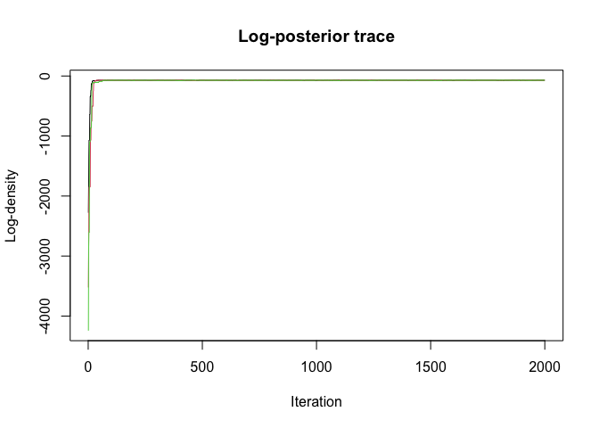

``` r
bayesplot::mcmc_trace(samples_df)
```

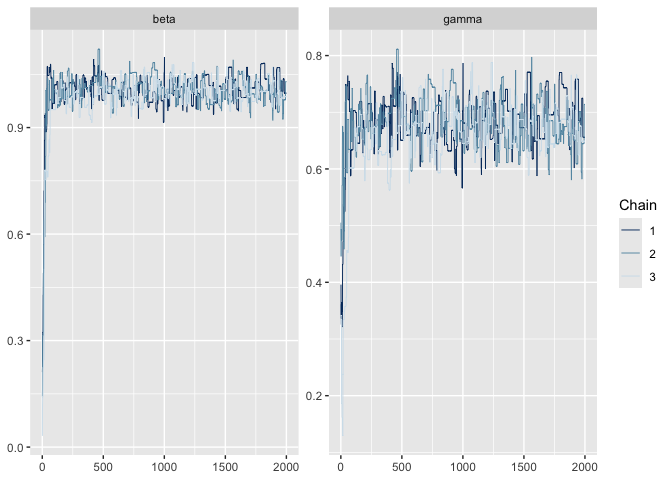

### Posterior Density

``` r
bayesplot::mcmc_scatter(samples_df)
```

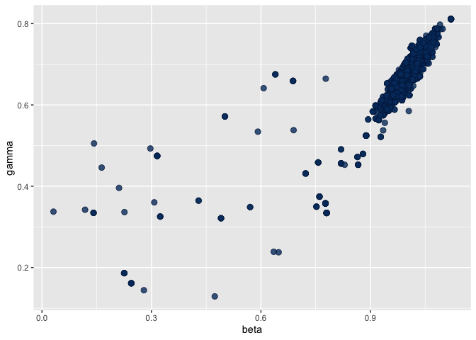

### Stochastic Comparison

``` r
filter <- Likelihood(sir, data = incidence, time_start = 0,
                              n_particles = 200, dt = 0.25)

likelihood_stoch <- as_model(filter, packer)
posterior_stoch <- likelihood_stoch + prior

samples_stoch <- sample(posterior_stoch, sampler, 2000, n_chains = 3)
```

    ⡀⠀ Sampling [▁▁▁] ■                                |   0% ETA: 32s

    ⠄⠀ Sampling [▄▁▁] ■■■■■■                           |  18% ETA: 12s

    ⢂⠀ Sampling [█▂▁] ■■■■■■■■■■■■■                    |  39% ETA:  9s

    ⡂⠀ Sampling [█▆▁] ■■■■■■■■■■■■■■■■■■■              |  60% ETA:  6s

    ⠅⠀ Sampling [██▄] ■■■■■■■■■■■■■■■■■■■■■■■■■        |  81% ETA:  3s

    ✔ Sampled 6000 steps across 3 chains in 14.3s

``` r
pars_det <- array(samples_det$pars, c(2, prod(dim(samples_det$pars)[-1])))
pars_stoch <- array(samples_stoch$pars, c(2, prod(dim(samples_stoch$pars)[-1])))

plot(pars_det[1, ], pars_det[2, ], xlab = "beta", ylab = "gamma",
     pch = 19, col = "red", cex = 0.3,
     main = "Stochastic vs Deterministic Posterior")
points(pars_stoch[1, ], pars_stoch[2, ], pch = 19, col = "blue", cex = 0.3)
legend("topright", c("Deterministic", "Stochastic"),
       col = c("red", "blue"), pch = 19)
```

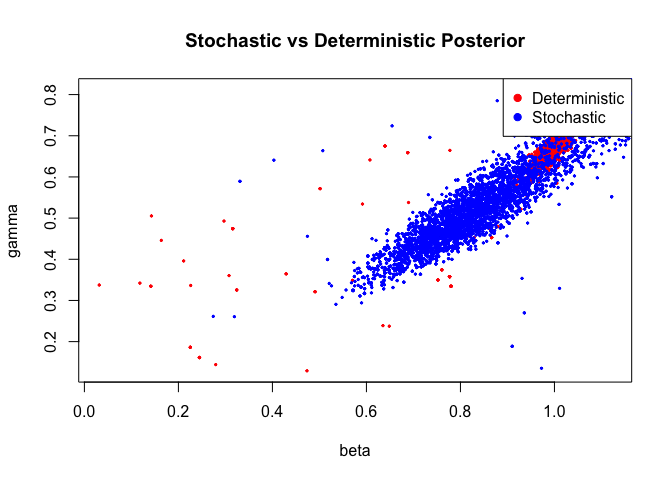

## Part 2: SIS Stochastic Fitting with Particle Filter

### Data

``` r
schools_data <- data.frame(
  time = 1:150,
  cases = c(2,3,2,2,4,7,2,2,0,3,1,5,4,5,4,5,14,6,12,6,
            6,9,4,7,11,19,18,25,15,16,27,15,19,27,35,23,20,32,23,32,
            30,21,58,31,40,46,38,32,42,46,7,10,19,18,18,20,10,7,11,13,
            36,25,33,24,28,30,38,31,48,40,61,32,30,44,52,39,45,47,40,44,
            43,42,44,34,52,45,40,58,55,41,52,40,62,49,36,40,48,58,41,42,
            37,41,59,42,50,52,35,52,44,38,53,65,48,47,57,53,43,52,32,49,
            19,18,17,17,15,18,12,18,12,8,53,57,42,47,42,41,49,51,45,44,
            49,47,53,33,36,37,44,40,70,57)
)

plot(schools_data, pch = 19, col = "red", main = "SIS School Closure Data")
```

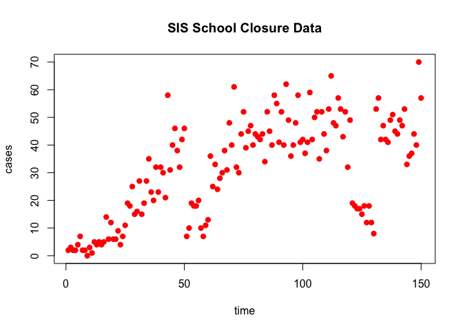

### Model Definition

``` r
sis <- odin({
  update(S) <- S - n_SI + n_IS
  update(I) <- I + n_SI - n_IS
  update(incidence) <- incidence + n_SI

  initial(S) <- N - I0
  initial(I) <- I0
  initial(incidence, zero_every = 1) <- 0

  schools <- interpolate(schools_time, schools_open, "constant")
  schools_time[] <- parameter()
  schools_open[] <- parameter()
  dim(schools_time, schools_open) <- parameter(rank = 1)

  beta <- ((1 - schools) * (1 - schools_modifier) + schools) * beta0

  p_SI <- 1 - exp(-beta * I / N * dt)
  p_IS <- 1 - exp(-gamma * dt)
  n_SI <- Binomial(S, p_SI)
  n_IS <- Binomial(I, p_IS)

  N <- parameter(1000)
  I0 <- parameter(10)
  beta0 <- parameter(0.2)
  gamma <- parameter(0.1)
  schools_modifier <- parameter(0.6)

  cases <- data()
  cases ~ Poisson(incidence)
})
```

    Warning in odin({: Found 2 compatibility issues
    Drop arrays from lhs of assignments from 'parameter()'
    ✖ schools_time[] <- parameter()
    ✔ schools_time <- parameter()
    ✖ schools_open[] <- parameter()
    ✔ schools_open <- parameter()

    ✔ Wrote 'DESCRIPTION'

    ✔ Wrote 'NAMESPACE'

    ✔ Wrote 'R/dust.R'

    ✔ Wrote 'src/dust.cpp'

    ✔ Wrote 'src/Makevars'

    ℹ 27 functions decorated with [[cpp11::register]]

    ✔ generated file 'cpp11.R'

    ✔ generated file 'cpp11.cpp'

    ℹ Re-compiling odin.systemdad44344

    ── R CMD INSTALL ───────────────────────────────────────────────────────────────
    * installing *source* package ‘odin.systemdad44344’ ...
    ** this is package ‘odin.systemdad44344’ version ‘0.0.1’
    ** using staged installation
    ** libs
    using C++ compiler: ‘Homebrew clang version 21.1.5’
    using SDK: ‘MacOSX15.5.sdk’
    clang++ -arch arm64 -std=gnu++17 -I"/Library/Frameworks/R.framework/Resources/include" -DNDEBUG  -I'/Library/Frameworks/R.framework/Versions/4.5-arm64/Resources/library/cpp11/include' -I'/Library/Frameworks/R.framework/Versions/4.5-arm64/Resources/library/dust2/include' -I'/Library/Frameworks/R.framework/Versions/4.5-arm64/Resources/library/monty/include' -I/opt/R/arm64/include   -DHAVE_INLINE   -fPIC  -falign-functions=64 -Wall -g -O2  -Wall -pedantic  -c cpp11.cpp -o cpp11.o
    clang++ -arch arm64 -std=gnu++17 -I"/Library/Frameworks/R.framework/Resources/include" -DNDEBUG  -I'/Library/Frameworks/R.framework/Versions/4.5-arm64/Resources/library/cpp11/include' -I'/Library/Frameworks/R.framework/Versions/4.5-arm64/Resources/library/dust2/include' -I'/Library/Frameworks/R.framework/Versions/4.5-arm64/Resources/library/monty/include' -I/opt/R/arm64/include   -DHAVE_INLINE   -fPIC  -falign-functions=64 -Wall -g -O2  -Wall -pedantic  -c dust.cpp -o dust.o
    In file included from dust.cpp:119:
    In file included from /Library/Frameworks/R.framework/Versions/4.5-arm64/Resources/library/dust2/include/dust2/r/discrete/system.hpp:5:
    /Library/Frameworks/R.framework/Versions/4.5-arm64/Resources/library/monty/include/monty/r/random.hpp:60:43: warning: implicit conversion from 'type' (aka 'unsigned long') to 'double' changes value from 18446744073709551615 to 18446744073709551616 [-Wimplicit-const-int-float-conversion]
       60 |       std::ceil(std::abs(::unif_rand()) * std::numeric_limits<size_t>::max());
          |                                         ~ ^~~~~~~~~~~~~~~~~~~~~~~~~~~~~~~~~~
    /Library/Frameworks/R.framework/Versions/4.5-arm64/Resources/library/monty/include/monty/r/random.hpp:60:43: warning: implicit conversion from 'type' (aka 'unsigned long') to 'double' changes value from 18446744073709551615 to 18446744073709551616 [-Wimplicit-const-int-float-conversion]
       60 |       std::ceil(std::abs(::unif_rand()) * std::numeric_limits<size_t>::max());
          |                                         ~ ^~~~~~~~~~~~~~~~~~~~~~~~~~~~~~~~~~
    /Library/Frameworks/R.framework/Versions/4.5-arm64/Resources/library/dust2/include/dust2/r/discrete/system.hpp:41:33: note: in instantiation of function template specialization 'monty::random::r::as_rng_seed<monty::random::xoshiro_state<unsigned long long, 4, monty::random::scrambler::plus>>' requested here
       41 |   auto seed = monty::random::r::as_rng_seed<rng_state_type>(r_seed);
          |                                 ^
    dust.cpp:125:20: note: in instantiation of function template specialization 'dust2::r::dust2_discrete_alloc<odin_system>' requested here
      125 |   return dust2::r::dust2_discrete_alloc<odin_system>(r_pars, r_time, r_time_control, r_n_particles, r_n_groups, r_seed, r_deterministic, r_n_threads);
          |                    ^
    2 warnings generated.
    clang++ -arch arm64 -std=gnu++17 -dynamiclib -Wl,-headerpad_max_install_names -undefined dynamic_lookup -L/Library/Frameworks/R.framework/Resources/lib -L/opt/R/arm64/lib -o odin.systemdad44344.so cpp11.o dust.o -F/Library/Frameworks/R.framework/.. -framework R
    installing to /private/var/folders/yh/30rj513j6mn1n7x556c2v4w80000gn/T/RtmpKzTfyL/devtools_install_10801328f4ad3/00LOCK-dust_108011628579a/00new/odin.systemdad44344/libs
    ** checking absolute paths in shared objects and dynamic libraries
    * DONE (odin.systemdad44344)

    ℹ Loading odin.systemdad44344

### School Schedule

``` r
schools_time <- c(0, 50, 60, 120, 130, 170, 180)
schools_open <- c(1,  0,  1,   0,   1,   0,   1)
```

### MCMC Setup

``` r
sis_packer <- Packer(c("beta0", "gamma", "schools_modifier"),
                           fixed = list(schools_time = schools_time,
                                        schools_open = schools_open))

sis_filter <- Likelihood(sis, time_start = 0, dt = 1,
                                  data = schools_data, n_particles = 200)

sis_prior <- monty_dsl({
  beta0 ~ Exponential(mean = 0.3)
  gamma ~ Exponential(mean = 0.1)
  schools_modifier ~ Uniform(0, 1)
})

sis_likelihood <- as_model(sis_filter, sis_packer)
sis_posterior <- sis_likelihood + sis_prior
```

### Run MCMC (4 chains)

``` r
sis_vcv <- diag(c(2e-4, 2e-4, 4e-4))
sis_sampler <- random_walk(sis_vcv)

sis_samples <- sample(sis_posterior, sis_sampler, 500,
                            initial = c(0.3, 0.1, 0.5),
                            n_chains = 4)
```

    ⡀⠀ Sampling [▁▁▁▁] ■                                |   0% ETA: 27s

    ⠄⠀ Sampling [▃▁▁▁] ■■■                              |   8% ETA: 12s

    ⢂⠀ Sampling [█▂▁▁] ■■■■■■■■■■                       |  31% ETA:  9s

    ⡂⠀ Sampling [██▂▁] ■■■■■■■■■■■■■■■■■                |  54% ETA:  6s

    ⠅⠀ Sampling [███▁] ■■■■■■■■■■■■■■■■■■■■■■■■         |  78% ETA:  3s

    ✔ Sampled 2000 steps across 4 chains in 12.9s

### Posterior Summary

``` r
sis_df <- posterior::as_draws_df(sis_samples)
posterior::summarise_draws(sis_df)
```

    # A tibble: 3 × 10
      variable       mean median     sd     mad     q5   q95  rhat ess_bulk ess_tail
      <chr>         <dbl>  <dbl>  <dbl>   <dbl>  <dbl> <dbl> <dbl>    <dbl>    <dbl>
    1 beta0         0.201 0.197  0.0152 0.00624 0.190  0.217  1.09     30.1     39.2
    2 gamma         0.101 0.0996 0.0138 0.00819 0.0876 0.122  1.09     33.1     20.6
    3 schools_modi… 0.642 0.646  0.0355 0.0246  0.582  0.685  1.08     45.7     61.6

### Trace Plots

``` r
bayesplot::mcmc_trace(sis_df)
```

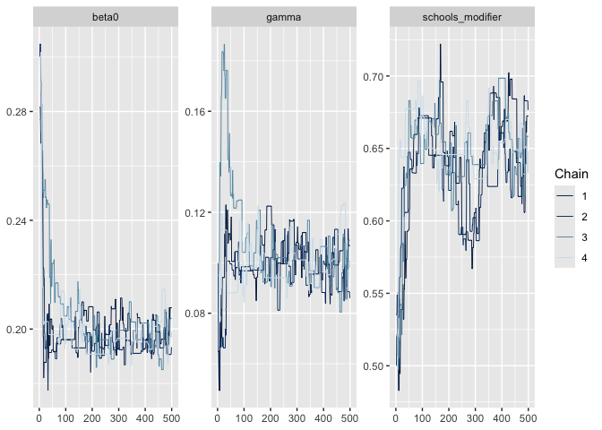

### Log-Density Trace

``` r
matplot(sis_samples$density, type = "l", lty = 1,
        xlab = "Iteration", ylab = "Log-density",
        main = "SIS Log-posterior trace")
```

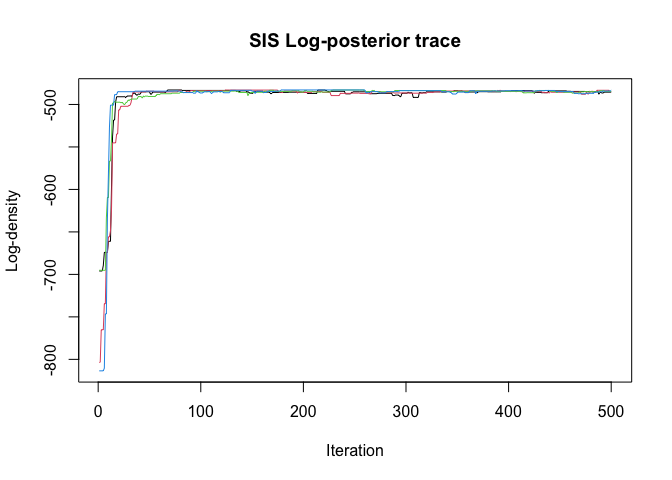

## Part 3: Counterfactual Projections

### Forward Projection

Simulate from the posterior forward to day 200:

``` r
sis_samples_thin <- monty_samples_thin(sis_samples,
                                        burnin = 100,
                                        thinning_factor = 4)
n_draws <- prod(dim(sis_samples_thin$pars)[-1])
pars_arr <- array(sis_samples_thin$pars, c(3, n_draws))

# Simulate each draw
projection_inc <- matrix(NA, nrow = 201, ncol = n_draws)
for (i in seq_len(n_draws)) {
  p <- sis_packer$unpack(pars_arr[, i])
  sys <- System(sis, p, dt = 1)
  dust_system_set_state_initial(sys)
  t_all <- seq(0, 200)
  y <- simulate(sys, t_all)
  y_unpacked <- dust_unpack_state(sys, y)
  projection_inc[, i] <- y_unpacked$incidence
}

matplot(0:200, projection_inc, type = "l", col = "#00000011", lty = 1,
        xlab = "Time", ylab = "Incidence",
        main = "Forward Projection")
points(schools_data, pch = 19, col = "red", cex = 0.5)
abline(v = 150, lty = 2)
```

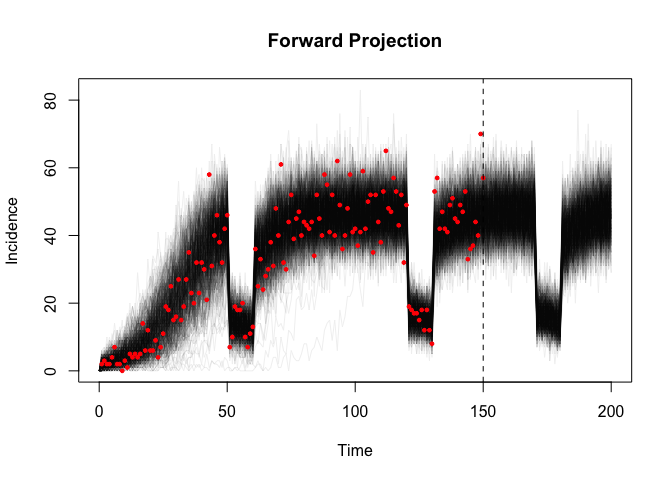

### Counterfactual: Only First School Closure

``` r
cf_inc <- matrix(NA, nrow = 201, ncol = n_draws)
for (i in seq_len(n_draws)) {
  p <- sis_packer$unpack(pars_arr[, i])
  p$schools_time <- c(0, 50, 60)
  p$schools_open <- c(1, 0, 1)
  sys <- System(sis, p, dt = 1)
  dust_system_set_state_initial(sys)
  y <- simulate(sys, seq(0, 200))
  y_unpacked <- dust_unpack_state(sys, y)
  cf_inc[, i] <- y_unpacked$incidence
}

matplot(0:200, projection_inc, type = "l", col = "#00000011", lty = 1,
        xlab = "Time", ylab = "Incidence",
        main = "Counterfactual: Only First Closure")
matlines(0:200, cf_inc, col = "#0000FF11", lty = 1)
points(schools_data, pch = 19, col = "red", cex = 0.5)
legend("topright", c("Fitted (3 closures)", "Only 1st closure"),
       col = c("black", "blue"), lty = 1)
```

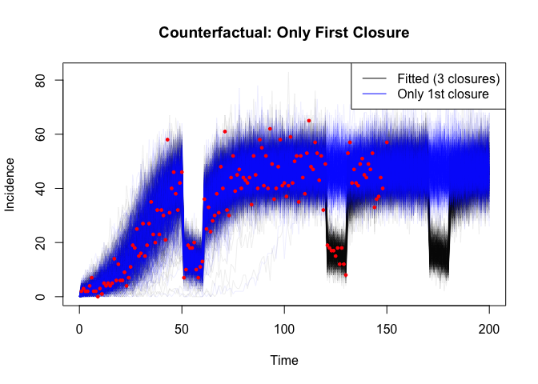

### Counterfactual: No School Closures

``` r
no_closure_inc <- matrix(NA, nrow = 201, ncol = n_draws)
for (i in seq_len(n_draws)) {
  p <- sis_packer$unpack(pars_arr[, i])
  p$schools_time <- 0
  p$schools_open <- 1
  sys <- System(sis, p, dt = 1)
  dust_system_set_state_initial(sys)
  y <- simulate(sys, seq(0, 200))
  y_unpacked <- dust_unpack_state(sys, y)
  no_closure_inc[, i] <- y_unpacked$incidence
}

matplot(0:200, projection_inc, type = "l", col = "#00000011", lty = 1,
        xlab = "Time", ylab = "Incidence",
        main = "Counterfactual: No Closures")
matlines(0:200, no_closure_inc, col = "#FFA50011", lty = 1)
points(schools_data, pch = 19, col = "red", cex = 0.5)
legend("topright", c("Fitted (3 closures)", "No closures"),
       col = c("black", "orange"), lty = 1)
```

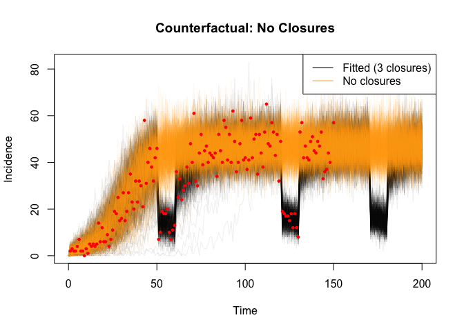

## Summary

| Step | R API |
|----|----|
| Define model | `odin({...})` |
| Deterministic likelihood | `Likelihood()` |
| Stochastic likelihood | `Likelihood()` |
| Bridge to MCMC | `as_model()` |
| Define prior | `monty_dsl({...})` |
| Combine | `posterior <- likelihood + prior` |
| Sample | `sample()` |
| Thin | `monty_samples_thin()` |
| Counterfactuals | `System()` + `simulate()` |
