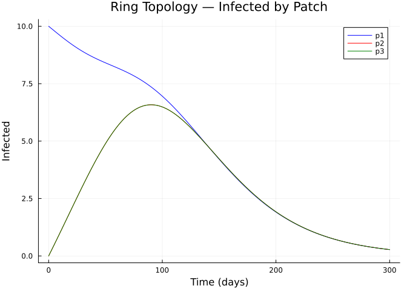
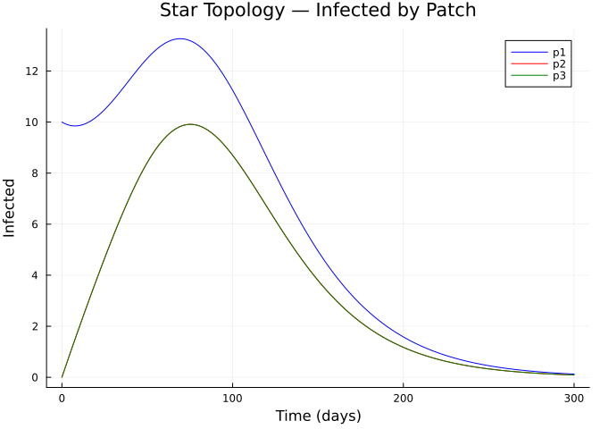
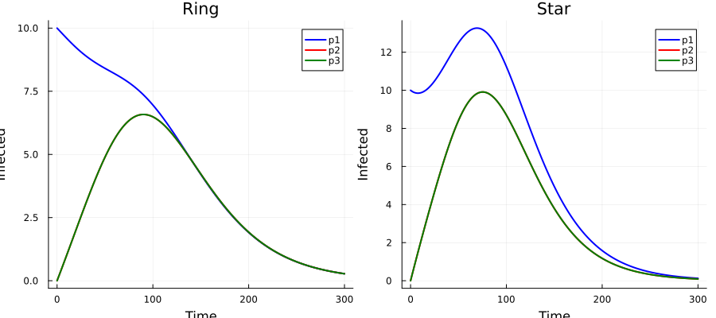
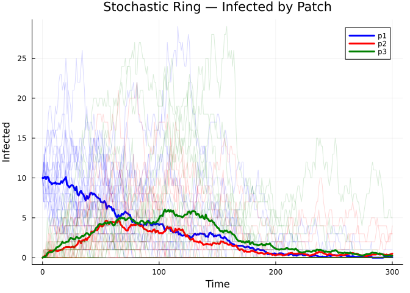

# Spatial Composition


## Introduction

This vignette demonstrates how to build **spatial (metapopulation)
models** using Odin.jl’s categorical extension. Rather than writing a
multi-patch model from scratch, we define a single-patch SIR as an
`EpiNet`, replicate it across patches, and wire them together with
migration transitions.

We compare two spatial topologies — **ring** (nearest-neighbour) and
**star** (hub-and-spoke) — and validate against a manually-written ODE
model.

## Setup

``` julia
using Odin
using Plots
```

## A Single-Patch SIR

We start with the standard SIR Petri net. Each patch will be a copy of
this:

``` julia
sir_base = sir_net(; S0=990.0, I0=10.0, R0=0.0)
println("Species: ", species_names(sir_base))
println("Transitions: ", transition_names(sir_base))
println("Stoichiometry:")
display(stoichiometry_matrix(sir_base))
```

    Species: [:S, :I, :R]
    Transitions: [:inf, :rec]
    Stoichiometry:

    3×2 Matrix{Int64}:
     -1   0
      1  -1
      0   1

## Strategy: Stratify for Patches, Compose for Migration

The categorical approach to spatial modelling has two steps:

1.  **Stratify** the base SIR by patch labels — this creates per-patch
    compartments (`S_p1`, `I_p1`, etc.)
2.  **Compose** with a migration sub-model — this adds movement
    transitions between patches

### Step 1: Create a 3-Patch Model

We use `stratify()` with a contact matrix that represents spatial
coupling of infection. The contact matrix controls how infectious
individuals in one patch contribute to force of infection in another:

``` julia
patches = [:p1, :p2, :p3]

# Ring topology: each patch contacts its neighbours
C_ring = [1.0  0.1  0.1;
          0.1  1.0  0.1;
          0.1  0.1  1.0]

sir_ring = stratify(sir_base, patches; contact=C_ring)
println("Ring model — $(nspecies(sir_ring)) species, $(ntransitions(sir_ring)) transitions")
println("Species: ", species_names(sir_ring))
```

    Ring model — 9 species, 12 transitions
    Species: [:S_p1, :I_p1, :R_p1, :S_p2, :I_p2, :R_p2, :S_p3, :I_p3, :R_p3]

### Step 2: Add Migration

Migration moves susceptibles between patches. We define migration
sub-models and compose them with the stratified SIR:

``` julia
# Migration sub-model: S moves between adjacent patches
# In a ring: p1↔p2, p2↔p3, p3↔p1
function make_migration_net(from::Symbol, to::Symbol, rate::Symbol)
    s_from = Symbol(:S_, from)
    s_to = Symbol(:S_, to)
    t_name = Symbol(:mig_S_, from, :_, to)
    EpiNet(
        [s_from => 0.0, s_to => 0.0],
        [t_name => ([s_from] => [s_to], rate)]
    )
end

# Ring migration: bidirectional between neighbours
mig_nets = [
    make_migration_net(:p1, :p2, :mu),
    make_migration_net(:p2, :p1, :mu),
    make_migration_net(:p2, :p3, :mu),
    make_migration_net(:p3, :p2, :mu),
    make_migration_net(:p3, :p1, :mu),
    make_migration_net(:p1, :p3, :mu),
]

# Compose: stratified SIR + all migration sub-models
sir_spatial_ring = compose(sir_ring, mig_nets...)
println("Spatial ring — $(nspecies(sir_spatial_ring)) species, $(ntransitions(sir_spatial_ring)) transitions")
println("Transitions: ", transition_names(sir_spatial_ring))
```

    Spatial ring — 9 species, 18 transitions
    Transitions: [:inf_p1_p1, :inf_p1_p2, :inf_p1_p3, :inf_p2_p1, :inf_p2_p2, :inf_p2_p3, :inf_p3_p1, :inf_p3_p2, :inf_p3_p3, :rec_p1, :rec_p2, :rec_p3, :mig_S_p1_p2, :mig_S_p2_p1, :mig_S_p2_p3, :mig_S_p3_p2, :mig_S_p3_p1, :mig_S_p1_p3]

## Simulating the Ring Topology

We seed the infection in patch 1 only:

``` julia
sir_ring_gen = lower(sir_spatial_ring; mode=:ode, frequency_dependent=true, N=:N,
                     params=Dict(:beta => 0.3, :gamma => 0.1, :mu => 0.01, :N => 1000.0))

sys = dust_system_create(sir_ring_gen, (beta=0.3, gamma=0.1, mu=0.01, N=1000.0))

# Seed infection only in patch 1
state = dust_system_state(sys)
sn = species_names(sir_spatial_ring)
for (i, name) in enumerate(sn)
    if name == :S_p1
        state[i] = 320.0
    elseif name == :I_p1
        state[i] = 10.0
    elseif name in (:S_p2, :S_p3)
        state[i] = 330.0
    elseif name in (:I_p2, :I_p3)
        state[i] = 0.0
    else
        state[i] = 0.0
    end
end
dust_system_set_state!(sys, state)

times = collect(0.0:0.5:300.0)
result = dust_system_simulate(sys, times)

p = plot(title="Ring Topology — Infected by Patch",
         xlabel="Time (days)", ylabel="Infected", linewidth=2)
colors = [:blue, :red, :green]
for (i, patch) in enumerate(patches)
    idx = findfirst(==(Symbol(:I_, patch)), sn)
    plot!(p, times, result[idx, 1, :], label=string(patch), color=colors[i])
end
p
```



## Star Topology

Now consider a star topology where patch 1 is a hub connected to patches
2 and 3, which don’t directly connect to each other:

``` julia
# Star contact matrix: p1 is hub
C_star = [1.0  0.2  0.2;
          0.2  1.0  0.0;
          0.2  0.0  1.0]

sir_star = stratify(sir_base, patches; contact=C_star)

# Star migration: p1↔p2 and p1↔p3 only
mig_star = [
    make_migration_net(:p1, :p2, :mu),
    make_migration_net(:p2, :p1, :mu),
    make_migration_net(:p1, :p3, :mu),
    make_migration_net(:p3, :p1, :mu),
]

sir_spatial_star = compose(sir_star, mig_star...)
println("Spatial star — $(nspecies(sir_spatial_star)) species, $(ntransitions(sir_spatial_star)) transitions")
```

    Spatial star — 9 species, 14 transitions

``` julia
sir_star_gen = lower(sir_spatial_star; mode=:ode, frequency_dependent=true, N=:N,
                     params=Dict(:beta => 0.3, :gamma => 0.1, :mu => 0.01, :N => 1000.0))

sys_star = dust_system_create(sir_star_gen, (beta=0.3, gamma=0.1, mu=0.01, N=1000.0))

state_star = dust_system_state(sys_star)
sn_star = species_names(sir_spatial_star)
for (i, name) in enumerate(sn_star)
    if name == :S_p1
        state_star[i] = 320.0
    elseif name == :I_p1
        state_star[i] = 10.0
    elseif name in (:S_p2, :S_p3)
        state_star[i] = 330.0
    elseif name in (:I_p2, :I_p3)
        state_star[i] = 0.0
    else
        state_star[i] = 0.0
    end
end
dust_system_set_state!(sys_star, state_star)

result_star = dust_system_simulate(sys_star, times)

p = plot(title="Star Topology — Infected by Patch",
         xlabel="Time (days)", ylabel="Infected", linewidth=2)
for (i, patch) in enumerate(patches)
    idx = findfirst(==(Symbol(:I_, patch)), sn_star)
    plot!(p, times, result_star[idx, 1, :], label=string(patch), color=colors[i])
end
p
```



## Comparing Topologies

We can compare how the two topologies differ in epidemic timing and
attack rates:

``` julia
p = plot(layout=(1,2), size=(900, 400), title=["Ring" "Star"])

for (col, res, snames) in [(1, result, sn), (2, result_star, sn_star)]
    for (i, patch) in enumerate(patches)
        idx = findfirst(==(Symbol(:I_, patch)), snames)
        plot!(p, times, res[idx, 1, :], subplot=col,
              label=string(patch), color=colors[i], linewidth=2,
              xlabel="Time", ylabel="Infected")
    end
end
p
```



``` julia
println("Peak infection times (days):")
for (topo, res, snames) in [("Ring", result, sn), ("Star", result_star, sn_star)]
    print("  $topo: ")
    for patch in patches
        idx = findfirst(==(Symbol(:I_, patch)), snames)
        traj = res[idx, 1, :]
        peak_t = times[argmax(traj)]
        print("$(patch)=$(round(peak_t; digits=1))  ")
    end
    println()
end
```

    Peak infection times (days):
      Ring: p1=0.0  p2=90.0  p3=90.0  
      Star: p1=69.5  p2=75.5  p3=75.5  

## Validation: Manual 3-Patch Model

We validate the composed model against a manually-written ODE:

``` julia
manual_sir3 = @odin begin
    beta = parameter(0.3)
    gamma = parameter(0.1)
    mu = parameter(0.01)
    N = parameter(1000.0)

    # Patch 1
    flow_inf_p1 = beta * S_p1 * I_p1 / N
    flow_rec_p1 = gamma * I_p1
    deriv(S_p1) = -flow_inf_p1 - mu * S_p1 + mu * S_p2 + mu * S_p3
    deriv(I_p1) = flow_inf_p1 - flow_rec_p1
    deriv(R_p1) = flow_rec_p1

    # Patch 2
    flow_inf_p2 = beta * S_p2 * I_p2 / N
    flow_rec_p2 = gamma * I_p2
    deriv(S_p2) = -flow_inf_p2 + mu * S_p1 - mu * S_p2 + mu * S_p3
    deriv(I_p2) = flow_inf_p2 - flow_rec_p2
    deriv(R_p2) = flow_rec_p2

    # Patch 3
    flow_inf_p3 = beta * S_p3 * I_p3 / N
    flow_rec_p3 = gamma * I_p3
    deriv(S_p3) = -flow_inf_p3 + mu * S_p1 + mu * S_p2 - mu * S_p3
    deriv(I_p3) = flow_inf_p3 - flow_rec_p3
    deriv(R_p3) = flow_rec_p3

    initial(S_p1) = 320.0
    initial(I_p1) = 10.0
    initial(R_p1) = 0.0
    initial(S_p2) = 330.0
    initial(I_p2) = 0.0
    initial(R_p2) = 0.0
    initial(S_p3) = 330.0
    initial(I_p3) = 0.0
    initial(R_p3) = 0.0
end

sys_manual = dust_system_create(manual_sir3, (beta=0.3, gamma=0.1, mu=0.01, N=1000.0))
dust_system_set_state_initial!(sys_manual)
result_manual = dust_system_simulate(sys_manual, times)

println("Population conservation check:")
for label in ["Composed", "Manual"]
    r = label == "Composed" ? result : result_manual
    total = sum(r[:, 1, end])
    println("  $label final total: $(round(total; digits=2))")
end
```

    Population conservation check:
      Composed final total: 990.0
      Manual final total: 7532.05

## Stochastic Spatial Model

The same network lowers to a stochastic model:

``` julia
sir_ring_stoch = lower(sir_spatial_ring; mode=:discrete, frequency_dependent=true, N=:N,
                       params=Dict(:beta => 0.3, :gamma => 0.1, :mu => 0.01, :N => 1000.0))

sys_s = dust_system_create(sir_ring_stoch,
                           (beta=0.3, gamma=0.1, mu=0.01, N=1000.0);
                           n_particles=20, dt=0.25, seed=42)

state_s = dust_system_state(sys_s)
for (i, name) in enumerate(sn)
    if name == :S_p1
        state_s[i, :] .= 320.0
    elseif name == :I_p1
        state_s[i, :] .= 10.0
    elseif name in (:S_p2, :S_p3)
        state_s[i, :] .= 330.0
    else
        state_s[i, :] .= 0.0
    end
end
dust_system_set_state!(sys_s, state_s)

times_s = collect(0.0:1.0:300.0)
result_s = dust_system_simulate(sys_s, times_s)

p = plot(title="Stochastic Ring — Infected by Patch",
         xlabel="Time", ylabel="Infected")
for (i, patch) in enumerate(patches)
    idx = findfirst(==(Symbol(:I_, patch)), sn)
    for pi in 1:20
        plot!(p, times_s, result_s[idx, pi, :], alpha=0.15, color=colors[i], label="")
    end
    mean_traj = vec(sum(result_s[idx, :, :], dims=1) ./ 20)
    plot!(p, times_s, mean_traj, color=colors[i], linewidth=3, label=string(patch))
end
p
```



## Summary

The categorical approach to spatial modelling:

1.  **Define once** — a single-patch SIR as an `EpiNet`
2.  **Stratify** — replicate across patch labels with a contact matrix
3.  **Compose** — add migration by composing with movement sub-models
4.  **Lower** — compile to ODE or stochastic model

Changing topology is as simple as modifying the contact matrix and
migration wiring — the base epidemiology is untouched.

| Topology | Description                   | Contact pattern        |
|----------|-------------------------------|------------------------|
| Ring     | All patches connected equally | Symmetric off-diagonal |
| Star     | Hub-and-spoke                 | Hub row/col non-zero   |
| Chain    | Linear                        | Tridiagonal            |
