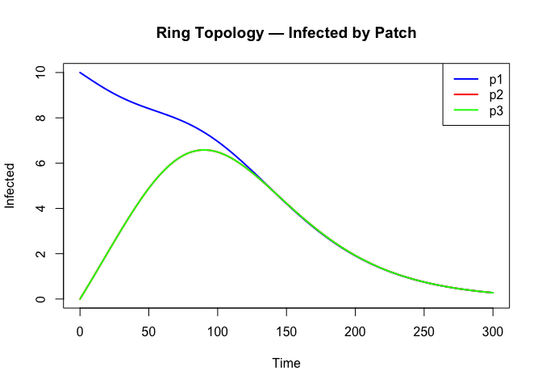
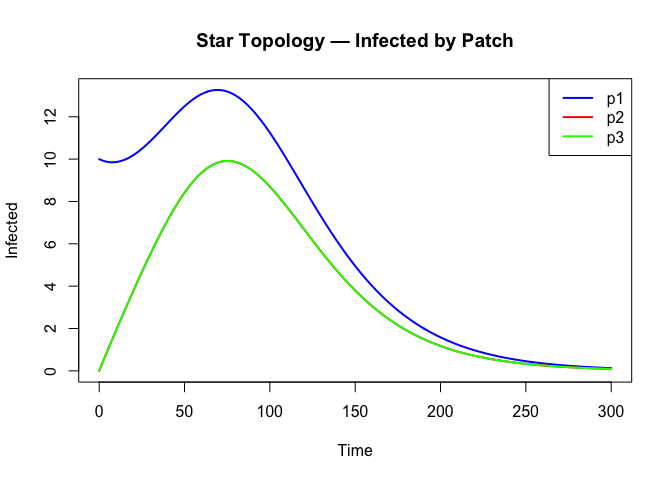
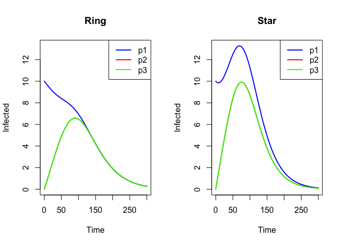

# Spatial Composition


## Introduction

This is the R companion to the Julia spatial composition vignette. While
R’s odin2 does not have a categorical composition layer, we demonstrate
equivalent 3-patch metapopulation models built manually using the odin
DSL with arrays.

## Setup

``` r
library(odin2)
library(dust2)
```

## 3-Patch SIR with Ring Migration

In Julia, this model was built by stratifying a base SIR and composing
with migration sub-models. In R, we write the full model with array
indexing:

``` r
sir_spatial <- odin({
  n_patch <- parameter(3)

  dim(S) <- n_patch
  dim(I) <- n_patch
  dim(R) <- n_patch
  dim(foi) <- n_patch
  dim(S0) <- n_patch
  dim(I0) <- n_patch
  dim(contact) <- c(n_patch, n_patch)
  dim(mig) <- c(n_patch, n_patch)
  dim(weighted_inf) <- c(n_patch, n_patch)
  dim(mig_out_S) <- n_patch
  dim(mig_in_S) <- n_patch
  dim(mig_flux_S) <- c(n_patch, n_patch)

  # Force of infection per patch
  weighted_inf[, ] <- contact[i, j] * I[j]
  foi[] <- beta * sum(weighted_inf[i, ]) / N

  # Migration fluxes for susceptibles
  mig_flux_S[, ] <- mig[i, j] * S[j]
  mig_out_S[] <- sum(mig[, i]) * S[i]
  mig_in_S[] <- sum(mig_flux_S[i, ])

  deriv(S[]) <- -foi[i] * S[i] - mig_out_S[i] + mig_in_S[i]
  deriv(I[]) <- foi[i] * S[i] - gamma * I[i]
  deriv(R[]) <- gamma * I[i]

  initial(S[]) <- S0[i]
  initial(I[]) <- I0[i]
  initial(R[]) <- 0

  S0[] <- parameter()
  I0[] <- parameter()
  contact[, ] <- parameter()
  mig[, ] <- parameter()
  beta <- parameter(0.3)
  gamma <- parameter(0.1)
  N <- parameter(1000)
})
```

    Warning in odin({: Found 4 compatibility issues
    Drop arrays from lhs of assignments from 'parameter()'
    ✖ S0[] <- parameter()
    ✔ S0 <- parameter()
    ✖ I0[] <- parameter()
    ✔ I0 <- parameter()
    ✖ contact[, ] <- parameter()
    ✔ contact <- parameter()
    ✖ mig[, ] <- parameter()
    ✔ mig <- parameter()

    ✔ Wrote 'DESCRIPTION'

    ✔ Wrote 'NAMESPACE'

    ✔ Wrote 'R/dust.R'

    ✔ Wrote 'src/dust.cpp'

    ✔ Wrote 'src/Makevars'

    ℹ 13 functions decorated with [[cpp11::register]]

    ✔ generated file 'cpp11.R'

    ✔ generated file 'cpp11.cpp'

    ℹ Re-compiling odin.system22d1bc02

    ── R CMD INSTALL ───────────────────────────────────────────────────────────────
    * installing *source* package ‘odin.system22d1bc02’ ...
    ** this is package ‘odin.system22d1bc02’ version ‘0.0.1’
    ** using staged installation
    ** libs
    using C++ compiler: ‘Homebrew clang version 21.1.5’
    using SDK: ‘MacOSX15.5.sdk’
    clang++ -arch arm64 -std=gnu++17 -I"/Library/Frameworks/R.framework/Resources/include" -DNDEBUG  -I'/Library/Frameworks/R.framework/Versions/4.5-arm64/Resources/library/cpp11/include' -I'/Library/Frameworks/R.framework/Versions/4.5-arm64/Resources/library/dust2/include' -I'/Library/Frameworks/R.framework/Versions/4.5-arm64/Resources/library/monty/include' -I/opt/R/arm64/include   -DHAVE_INLINE   -fPIC  -falign-functions=64 -Wall -g -O2  -Wall -pedantic  -c cpp11.cpp -o cpp11.o
    clang++ -arch arm64 -std=gnu++17 -I"/Library/Frameworks/R.framework/Resources/include" -DNDEBUG  -I'/Library/Frameworks/R.framework/Versions/4.5-arm64/Resources/library/cpp11/include' -I'/Library/Frameworks/R.framework/Versions/4.5-arm64/Resources/library/dust2/include' -I'/Library/Frameworks/R.framework/Versions/4.5-arm64/Resources/library/monty/include' -I/opt/R/arm64/include   -DHAVE_INLINE   -fPIC  -falign-functions=64 -Wall -g -O2  -Wall -pedantic  -c dust.cpp -o dust.o
    In file included from dust.cpp:161:
    In file included from /Library/Frameworks/R.framework/Versions/4.5-arm64/Resources/library/dust2/include/dust2/r/continuous/system.hpp:4:
    /Library/Frameworks/R.framework/Versions/4.5-arm64/Resources/library/monty/include/monty/r/random.hpp:60:43: warning: implicit conversion from 'type' (aka 'unsigned long') to 'double' changes value from 18446744073709551615 to 18446744073709551616 [-Wimplicit-const-int-float-conversion]
       60 |       std::ceil(std::abs(::unif_rand()) * std::numeric_limits<size_t>::max());
          |                                         ~ ^~~~~~~~~~~~~~~~~~~~~~~~~~~~~~~~~~
    /Library/Frameworks/R.framework/Versions/4.5-arm64/Resources/library/monty/include/monty/r/random.hpp:60:43: warning: implicit conversion from 'type' (aka 'unsigned long') to 'double' changes value from 18446744073709551615 to 18446744073709551616 [-Wimplicit-const-int-float-conversion]
       60 |       std::ceil(std::abs(::unif_rand()) * std::numeric_limits<size_t>::max());
          |                                         ~ ^~~~~~~~~~~~~~~~~~~~~~~~~~~~~~~~~~
    /Library/Frameworks/R.framework/Versions/4.5-arm64/Resources/library/dust2/include/dust2/r/continuous/system.hpp:34:33: note: in instantiation of function template specialization 'monty::random::r::as_rng_seed<monty::random::xoshiro_state<unsigned long long, 4, monty::random::scrambler::plus>>' requested here
       34 |   auto seed = monty::random::r::as_rng_seed<rng_state_type>(r_seed);
          |                                 ^
    dust.cpp:165:20: note: in instantiation of function template specialization 'dust2::r::dust2_continuous_alloc<odin_system>' requested here
      165 |   return dust2::r::dust2_continuous_alloc<odin_system>(r_pars, r_time, r_time_control, r_n_particles, r_n_groups, r_seed, r_deterministic, r_n_threads);
          |                    ^
    2 warnings generated.
    clang++ -arch arm64 -std=gnu++17 -dynamiclib -Wl,-headerpad_max_install_names -undefined dynamic_lookup -L/Library/Frameworks/R.framework/Resources/lib -L/opt/R/arm64/lib -o odin.system22d1bc02.so cpp11.o dust.o -F/Library/Frameworks/R.framework/.. -framework R
    installing to /private/var/folders/yh/30rj513j6mn1n7x556c2v4w80000gn/T/Rtmp9h5dyk/devtools_install_381b59bffb17/00LOCK-dust_381b7303784/00new/odin.system22d1bc02/libs
    ** checking absolute paths in shared objects and dynamic libraries
    * DONE (odin.system22d1bc02)

    ℹ Loading odin.system22d1bc02

### Ring topology

``` r
C_ring <- matrix(c(1.0, 0.1, 0.1,
                    0.1, 1.0, 0.1,
                    0.1, 0.1, 1.0), 3, 3, byrow = TRUE)

# Ring migration (symmetric): every patch connected to every other
M_ring <- matrix(c(0.0,  0.01, 0.01,
                    0.01, 0.0,  0.01,
                    0.01, 0.01, 0.0), 3, 3, byrow = TRUE)

pars_ring <- list(
  n_patch = 3,
  S0 = c(320, 330, 330),
  I0 = c(10, 0, 0),
  contact = C_ring,
  mig = M_ring,
  beta = 0.3, gamma = 0.1, N = 1000
)

sys <- System(sir_spatial, pars_ring, ode_control = dust_ode_control())
dust_system_set_state_initial(sys)
times <- seq(0, 300, by = 0.5)
result_ring <- simulate(sys, times)

cols <- c("blue", "red", "green")
patches <- c("p1", "p2", "p3")
# Infected are rows 4,5,6
plot(NULL, xlim = range(times), ylim = c(0, max(result_ring[4:6, ])),
     xlab = "Time", ylab = "Infected",
     main = "Ring Topology — Infected by Patch")
for (i in 1:3) {
  lines(times, result_ring[3 + i, ], col = cols[i], lwd = 2)
}
legend("topright", legend = patches, col = cols, lwd = 2)
```



### Star topology

``` r
C_star <- matrix(c(1.0, 0.2, 0.2,
                    0.2, 1.0, 0.0,
                    0.2, 0.0, 1.0), 3, 3, byrow = TRUE)

# Star migration: p1↔p2 and p1↔p3 only
M_star <- matrix(c(0.0,  0.01, 0.01,
                    0.01, 0.0,  0.0,
                    0.01, 0.0,  0.0), 3, 3, byrow = TRUE)

pars_star <- list(
  n_patch = 3,
  S0 = c(320, 330, 330),
  I0 = c(10, 0, 0),
  contact = C_star,
  mig = M_star,
  beta = 0.3, gamma = 0.1, N = 1000
)

sys2 <- System(sir_spatial, pars_star, ode_control = dust_ode_control())
dust_system_set_state_initial(sys2)
result_star <- simulate(sys2, times)

plot(NULL, xlim = range(times), ylim = c(0, max(result_star[4:6, ])),
     xlab = "Time", ylab = "Infected",
     main = "Star Topology — Infected by Patch")
for (i in 1:3) {
  lines(times, result_star[3 + i, ], col = cols[i], lwd = 2)
}
legend("topright", legend = patches, col = cols, lwd = 2)
```



## Comparing Topologies

``` r
par(mfrow = c(1, 2))

plot(NULL, xlim = range(times), ylim = c(0, max(result_ring[4:6, ], result_star[4:6, ])),
     xlab = "Time", ylab = "Infected", main = "Ring")
for (i in 1:3) lines(times, result_ring[3 + i, ], col = cols[i], lwd = 2)
legend("topright", legend = patches, col = cols, lwd = 2)

plot(NULL, xlim = range(times), ylim = c(0, max(result_ring[4:6, ], result_star[4:6, ])),
     xlab = "Time", ylab = "Infected", main = "Star")
for (i in 1:3) lines(times, result_star[3 + i, ], col = cols[i], lwd = 2)
legend("topright", legend = patches, col = cols, lwd = 2)
```



``` r
par(mfrow = c(1, 1))
```

## Summary

| Feature | Julia (Odin.jl) | R (odin2) |
|----|----|----|
| Base model | `SIR()` Petri net | Manual DSL |
| Spatial structure | `stratify(sir, patches; contact=C)` | Array indexing with contact matrix |
| Migration | `compose()` with migration sub-nets | Matrix multiplication in ODEs |
| Topology change | Swap contact matrix + migration nets | Swap parameter matrices |
