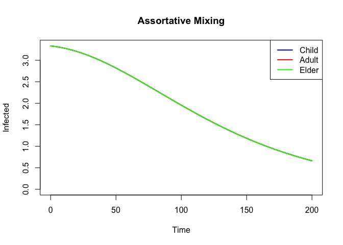
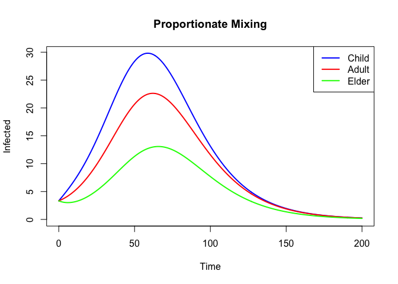
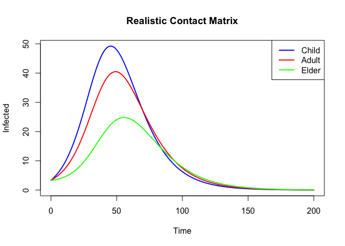
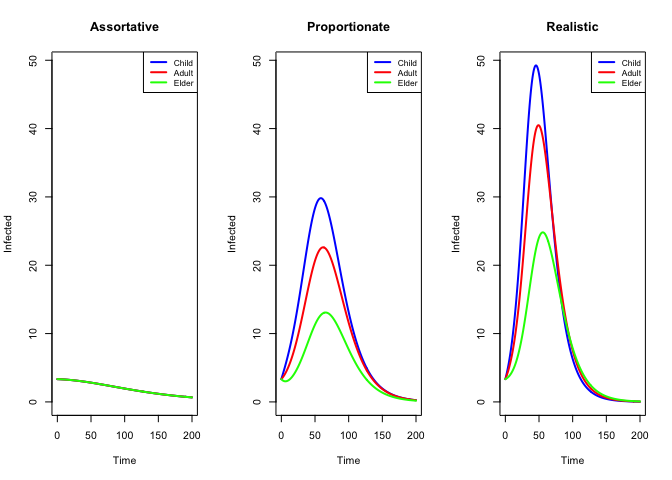
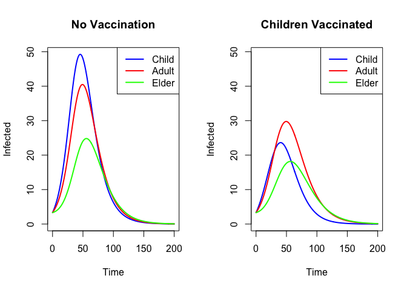

# Age Stratification


## Introduction

This is the R companion to the Julia age stratification vignette. We
build equivalent age-stratified SIR models manually using odin2 arrays,
comparing assortative, proportionate, and realistic contact patterns.

## Setup

``` r
library(odin2)
library(dust2)
```

## Age-Stratified SIR Model

``` r
sir_age <- odin({
  n_age <- parameter(3)
  dim(S) <- n_age
  dim(I) <- n_age
  dim(R) <- n_age
  dim(foi) <- n_age
  dim(S0) <- n_age
  dim(I0) <- n_age
  dim(contact) <- c(n_age, n_age)
  dim(weighted) <- c(n_age, n_age)

  weighted[, ] <- contact[i, j] * I[j]
  foi[] <- beta * sum(weighted[i, ]) / N

  deriv(S[]) <- -foi[i] * S[i]
  deriv(I[]) <- foi[i] * S[i] - gamma * I[i]
  deriv(R[]) <- gamma * I[i]

  initial(S[]) <- S0[i]
  initial(I[]) <- I0[i]
  initial(R[]) <- 0

  S0[] <- parameter()
  I0[] <- parameter()
  contact[, ] <- parameter()
  beta <- parameter()
  gamma <- parameter()
  N <- parameter()
})
```

    Warning in odin({: Found 3 compatibility issues
    Drop arrays from lhs of assignments from 'parameter()'
    ✖ S0[] <- parameter()
    ✔ S0 <- parameter()
    ✖ I0[] <- parameter()
    ✔ I0 <- parameter()
    ✖ contact[, ] <- parameter()
    ✔ contact <- parameter()

    ✔ Wrote 'DESCRIPTION'

    ✔ Wrote 'NAMESPACE'

    ✔ Wrote 'R/dust.R'

    ✔ Wrote 'src/dust.cpp'

    ✔ Wrote 'src/Makevars'

    ℹ 13 functions decorated with [[cpp11::register]]

    ✔ generated file 'cpp11.R'

    ✔ generated file 'cpp11.cpp'

    ℹ Re-compiling odin.system45107fbe

    ── R CMD INSTALL ───────────────────────────────────────────────────────────────
    * installing *source* package ‘odin.system45107fbe’ ...
    ** this is package ‘odin.system45107fbe’ version ‘0.0.1’
    ** using staged installation
    ** libs
    using C++ compiler: ‘Homebrew clang version 21.1.5’
    using SDK: ‘MacOSX15.5.sdk’
    clang++ -arch arm64 -std=gnu++17 -I"/Library/Frameworks/R.framework/Resources/include" -DNDEBUG  -I'/Library/Frameworks/R.framework/Versions/4.5-arm64/Resources/library/cpp11/include' -I'/Library/Frameworks/R.framework/Versions/4.5-arm64/Resources/library/dust2/include' -I'/Library/Frameworks/R.framework/Versions/4.5-arm64/Resources/library/monty/include' -I/opt/R/arm64/include   -DHAVE_INLINE   -fPIC  -falign-functions=64 -Wall -g -O2  -Wall -pedantic  -c cpp11.cpp -o cpp11.o
    clang++ -arch arm64 -std=gnu++17 -I"/Library/Frameworks/R.framework/Resources/include" -DNDEBUG  -I'/Library/Frameworks/R.framework/Versions/4.5-arm64/Resources/library/cpp11/include' -I'/Library/Frameworks/R.framework/Versions/4.5-arm64/Resources/library/dust2/include' -I'/Library/Frameworks/R.framework/Versions/4.5-arm64/Resources/library/monty/include' -I/opt/R/arm64/include   -DHAVE_INLINE   -fPIC  -falign-functions=64 -Wall -g -O2  -Wall -pedantic  -c dust.cpp -o dust.o
    In file included from dust.cpp:131:
    In file included from /Library/Frameworks/R.framework/Versions/4.5-arm64/Resources/library/dust2/include/dust2/r/continuous/system.hpp:4:
    /Library/Frameworks/R.framework/Versions/4.5-arm64/Resources/library/monty/include/monty/r/random.hpp:60:43: warning: implicit conversion from 'type' (aka 'unsigned long') to 'double' changes value from 18446744073709551615 to 18446744073709551616 [-Wimplicit-const-int-float-conversion]
       60 |       std::ceil(std::abs(::unif_rand()) * std::numeric_limits<size_t>::max());
          |                                         ~ ^~~~~~~~~~~~~~~~~~~~~~~~~~~~~~~~~~
    /Library/Frameworks/R.framework/Versions/4.5-arm64/Resources/library/monty/include/monty/r/random.hpp:60:43: warning: implicit conversion from 'type' (aka 'unsigned long') to 'double' changes value from 18446744073709551615 to 18446744073709551616 [-Wimplicit-const-int-float-conversion]
       60 |       std::ceil(std::abs(::unif_rand()) * std::numeric_limits<size_t>::max());
          |                                         ~ ^~~~~~~~~~~~~~~~~~~~~~~~~~~~~~~~~~
    /Library/Frameworks/R.framework/Versions/4.5-arm64/Resources/library/dust2/include/dust2/r/continuous/system.hpp:34:33: note: in instantiation of function template specialization 'monty::random::r::as_rng_seed<monty::random::xoshiro_state<unsigned long long, 4, monty::random::scrambler::plus>>' requested here
       34 |   auto seed = monty::random::r::as_rng_seed<rng_state_type>(r_seed);
          |                                 ^
    dust.cpp:135:20: note: in instantiation of function template specialization 'dust2::r::dust2_continuous_alloc<odin_system>' requested here
      135 |   return dust2::r::dust2_continuous_alloc<odin_system>(r_pars, r_time, r_time_control, r_n_particles, r_n_groups, r_seed, r_deterministic, r_n_threads);
          |                    ^
    2 warnings generated.
    clang++ -arch arm64 -std=gnu++17 -dynamiclib -Wl,-headerpad_max_install_names -undefined dynamic_lookup -L/Library/Frameworks/R.framework/Resources/lib -L/opt/R/arm64/lib -o odin.system45107fbe.so cpp11.o dust.o -F/Library/Frameworks/R.framework/.. -framework R
    installing to /private/var/folders/yh/30rj513j6mn1n7x556c2v4w80000gn/T/Rtmpa1BTVR/devtools_install_3ebe490f3bc1/00LOCK-dust_3ebe5ca17ecc/00new/odin.system45107fbe/libs
    ** checking absolute paths in shared objects and dynamic libraries
    * DONE (odin.system45107fbe)

    ℹ Loading odin.system45107fbe

## Assortative Mixing

``` r
C_assort <- diag(3)

pars <- list(
  n_age = 3,
  S0 = c(330, 330, 330),
  I0 = c(10/3, 10/3, 10/3),
  contact = C_assort,
  beta = 0.3, gamma = 0.1, N = 1000
)

sys <- System(sir_age, pars, ode_control = dust_ode_control())
dust_system_set_state_initial(sys)
times <- seq(0, 200, by = 0.5)
r_assort <- simulate(sys, times)

cols <- c("blue", "red", "green")
groups <- c("Child", "Adult", "Elder")
plot(NULL, xlim = range(times), ylim = c(0, max(r_assort[4:6, ])),
     xlab = "Time", ylab = "Infected",
     main = "Assortative Mixing")
for (i in 1:3) lines(times, r_assort[3 + i, ], col = cols[i], lwd = 2)
legend("topright", legend = groups, col = cols, lwd = 2)
```



## Proportionate Mixing

``` r
activity <- c(3, 2, 1)
C_prop <- outer(activity, activity)
C_prop <- C_prop / max(C_prop)

pars$contact <- C_prop
sys <- System(sir_age, pars, ode_control = dust_ode_control())
dust_system_set_state_initial(sys)
r_prop <- simulate(sys, times)

plot(NULL, xlim = range(times), ylim = c(0, max(r_prop[4:6, ])),
     xlab = "Time", ylab = "Infected",
     main = "Proportionate Mixing")
for (i in 1:3) lines(times, r_prop[3 + i, ], col = cols[i], lwd = 2)
legend("topright", legend = groups, col = cols, lwd = 2)
```



## Realistic Contact Matrix

``` r
C_real <- matrix(c(3.0, 1.0, 0.3,
                    1.0, 2.0, 0.5,
                    0.3, 0.5, 1.5), 3, 3, byrow = TRUE)

pars$contact <- C_real
pars$beta <- 0.15
sys <- System(sir_age, pars, ode_control = dust_ode_control())
dust_system_set_state_initial(sys)
r_real <- simulate(sys, times)

plot(NULL, xlim = range(times), ylim = c(0, max(r_real[4:6, ])),
     xlab = "Time", ylab = "Infected",
     main = "Realistic Contact Matrix")
for (i in 1:3) lines(times, r_real[3 + i, ], col = cols[i], lwd = 2)
legend("topright", legend = groups, col = cols, lwd = 2)
```



## Comparison

``` r
par(mfrow = c(1, 3))
for (label in c("Assortative", "Proportionate", "Realistic")) {
  r <- switch(label,
              Assortative = r_assort,
              Proportionate = r_prop,
              Realistic = r_real)
  plot(NULL, xlim = range(times), ylim = c(0, max(r_assort[4:6, ], r_prop[4:6, ], r_real[4:6, ])),
       xlab = "Time", ylab = "Infected", main = label)
  for (i in 1:3) lines(times, r[3 + i, ], col = cols[i], lwd = 2)
  legend("topright", legend = groups, col = cols, lwd = 2, cex = 0.8)
}
```



``` r
par(mfrow = c(1, 1))
```

## Targeted Vaccination (Children Only)

``` r
sir_age_vax <- odin({
  n_age <- parameter(3)
  dim(S) <- n_age
  dim(I) <- n_age
  dim(R) <- n_age
  dim(V) <- n_age
  dim(foi) <- n_age
  dim(S0) <- n_age
  dim(I0) <- n_age
  dim(vax_rate) <- n_age
  dim(contact) <- c(n_age, n_age)
  dim(weighted) <- c(n_age, n_age)

  weighted[, ] <- contact[i, j] * I[j]
  foi[] <- beta * sum(weighted[i, ]) / N

  deriv(S[]) <- -foi[i] * S[i] - vax_rate[i] * S[i]
  deriv(I[]) <- foi[i] * S[i] - gamma * I[i]
  deriv(R[]) <- gamma * I[i]
  deriv(V[]) <- vax_rate[i] * S[i]

  initial(S[]) <- S0[i]
  initial(I[]) <- I0[i]
  initial(R[]) <- 0
  initial(V[]) <- 0

  S0[] <- parameter()
  I0[] <- parameter()
  contact[, ] <- parameter()
  vax_rate[] <- parameter()
  beta <- parameter()
  gamma <- parameter()
  N <- parameter()
})
```

    Warning in odin({: Found 4 compatibility issues
    Drop arrays from lhs of assignments from 'parameter()'
    ✖ S0[] <- parameter()
    ✔ S0 <- parameter()
    ✖ I0[] <- parameter()
    ✔ I0 <- parameter()
    ✖ contact[, ] <- parameter()
    ✔ contact <- parameter()
    ✖ vax_rate[] <- parameter()
    ✔ vax_rate <- parameter()

    ✔ Wrote 'DESCRIPTION'

    ✔ Wrote 'NAMESPACE'

    ✔ Wrote 'R/dust.R'

    ✔ Wrote 'src/dust.cpp'

    ✔ Wrote 'src/Makevars'

    ℹ 13 functions decorated with [[cpp11::register]]

    ✔ generated file 'cpp11.R'

    ✔ generated file 'cpp11.cpp'

    ℹ Re-compiling odin.systemed2f5d72

    ── R CMD INSTALL ───────────────────────────────────────────────────────────────
    * installing *source* package ‘odin.systemed2f5d72’ ...
    ** this is package ‘odin.systemed2f5d72’ version ‘0.0.1’
    ** using staged installation
    ** libs
    using C++ compiler: ‘Homebrew clang version 21.1.5’
    using SDK: ‘MacOSX15.5.sdk’
    clang++ -arch arm64 -std=gnu++17 -I"/Library/Frameworks/R.framework/Resources/include" -DNDEBUG  -I'/Library/Frameworks/R.framework/Versions/4.5-arm64/Resources/library/cpp11/include' -I'/Library/Frameworks/R.framework/Versions/4.5-arm64/Resources/library/dust2/include' -I'/Library/Frameworks/R.framework/Versions/4.5-arm64/Resources/library/monty/include' -I/opt/R/arm64/include   -DHAVE_INLINE   -fPIC  -falign-functions=64 -Wall -g -O2  -Wall -pedantic  -c cpp11.cpp -o cpp11.o
    clang++ -arch arm64 -std=gnu++17 -I"/Library/Frameworks/R.framework/Resources/include" -DNDEBUG  -I'/Library/Frameworks/R.framework/Versions/4.5-arm64/Resources/library/cpp11/include' -I'/Library/Frameworks/R.framework/Versions/4.5-arm64/Resources/library/dust2/include' -I'/Library/Frameworks/R.framework/Versions/4.5-arm64/Resources/library/monty/include' -I/opt/R/arm64/include   -DHAVE_INLINE   -fPIC  -falign-functions=64 -Wall -g -O2  -Wall -pedantic  -c dust.cpp -o dust.o
    In file included from dust.cpp:147:
    In file included from /Library/Frameworks/R.framework/Versions/4.5-arm64/Resources/library/dust2/include/dust2/r/continuous/system.hpp:4:
    /Library/Frameworks/R.framework/Versions/4.5-arm64/Resources/library/monty/include/monty/r/random.hpp:60:43: warning: implicit conversion from 'type' (aka 'unsigned long') to 'double' changes value from 18446744073709551615 to 18446744073709551616 [-Wimplicit-const-int-float-conversion]
       60 |       std::ceil(std::abs(::unif_rand()) * std::numeric_limits<size_t>::max());
          |                                         ~ ^~~~~~~~~~~~~~~~~~~~~~~~~~~~~~~~~~
    /Library/Frameworks/R.framework/Versions/4.5-arm64/Resources/library/monty/include/monty/r/random.hpp:60:43: warning: implicit conversion from 'type' (aka 'unsigned long') to 'double' changes value from 18446744073709551615 to 18446744073709551616 [-Wimplicit-const-int-float-conversion]
       60 |       std::ceil(std::abs(::unif_rand()) * std::numeric_limits<size_t>::max());
          |                                         ~ ^~~~~~~~~~~~~~~~~~~~~~~~~~~~~~~~~~
    /Library/Frameworks/R.framework/Versions/4.5-arm64/Resources/library/dust2/include/dust2/r/continuous/system.hpp:34:33: note: in instantiation of function template specialization 'monty::random::r::as_rng_seed<monty::random::xoshiro_state<unsigned long long, 4, monty::random::scrambler::plus>>' requested here
       34 |   auto seed = monty::random::r::as_rng_seed<rng_state_type>(r_seed);
          |                                 ^
    dust.cpp:151:20: note: in instantiation of function template specialization 'dust2::r::dust2_continuous_alloc<odin_system>' requested here
      151 |   return dust2::r::dust2_continuous_alloc<odin_system>(r_pars, r_time, r_time_control, r_n_particles, r_n_groups, r_seed, r_deterministic, r_n_threads);
          |                    ^
    2 warnings generated.
    clang++ -arch arm64 -std=gnu++17 -dynamiclib -Wl,-headerpad_max_install_names -undefined dynamic_lookup -L/Library/Frameworks/R.framework/Resources/lib -L/opt/R/arm64/lib -o odin.systemed2f5d72.so cpp11.o dust.o -F/Library/Frameworks/R.framework/.. -framework R
    installing to /private/var/folders/yh/30rj513j6mn1n7x556c2v4w80000gn/T/Rtmpa1BTVR/devtools_install_3ebe5e78fcdd/00LOCK-dust_3ebe2f9ced1/00new/odin.systemed2f5d72/libs
    ** checking absolute paths in shared objects and dynamic libraries
    * DONE (odin.systemed2f5d72)

    ℹ Loading odin.systemed2f5d72

``` r
pars_vax <- list(
  n_age = 3,
  S0 = c(330, 330, 330),
  I0 = c(10/3, 10/3, 10/3),
  contact = C_real,
  vax_rate = c(0.01, 0, 0),
  beta = 0.15, gamma = 0.1, N = 1000
)

# No vaccination baseline
pars_nv <- pars_vax
pars_nv$vax_rate <- c(0, 0, 0)

sys_nv <- System(sir_age_vax, pars_nv, ode_control = dust_ode_control())
dust_system_set_state_initial(sys_nv)
r_nv <- simulate(sys_nv, times)

sys_v <- System(sir_age_vax, pars_vax, ode_control = dust_ode_control())
dust_system_set_state_initial(sys_v)
r_v <- simulate(sys_v, times)

par(mfrow = c(1, 2))
plot(NULL, xlim = range(times), ylim = c(0, max(r_nv[4:6, ])),
     xlab = "Time", ylab = "Infected", main = "No Vaccination")
for (i in 1:3) lines(times, r_nv[3 + i, ], col = cols[i], lwd = 2)
legend("topright", legend = groups, col = cols, lwd = 2)

plot(NULL, xlim = range(times), ylim = c(0, max(r_nv[4:6, ])),
     xlab = "Time", ylab = "Infected", main = "Children Vaccinated")
for (i in 1:3) lines(times, r_v[3 + i, ], col = cols[i], lwd = 2)
legend("topright", legend = groups, col = cols, lwd = 2)
```



``` r
par(mfrow = c(1, 1))
```

## Summary

| Feature | Julia (Odin.jl) | R (odin2) |
|----|----|----|
| Stratify model | `stratify(sir, groups; contact=C)` | Manual array indexing |
| Change mixing | Swap contact matrix | Swap parameter matrix |
| Add vaccination | `compose()` with vax sub-net | Add equations manually |
| Generated transitions | Automatic cross-group | Manual weighted sums |
