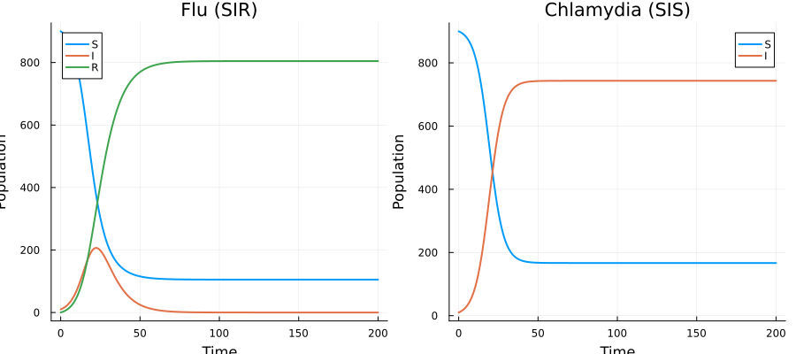
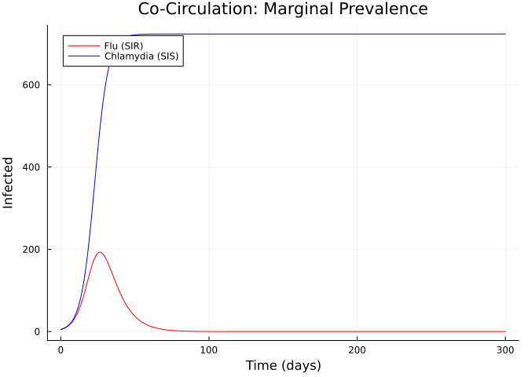
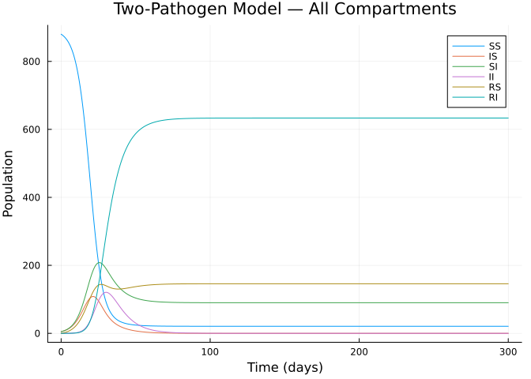
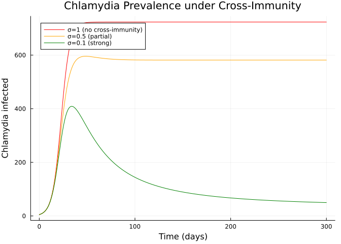
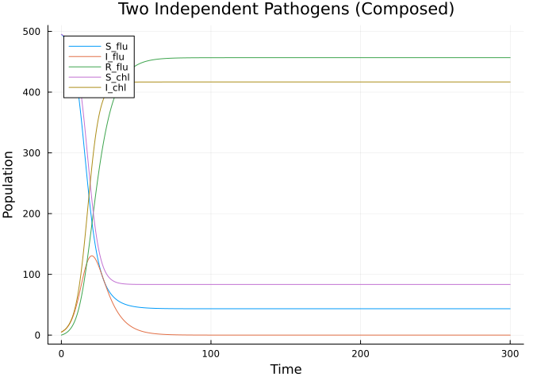
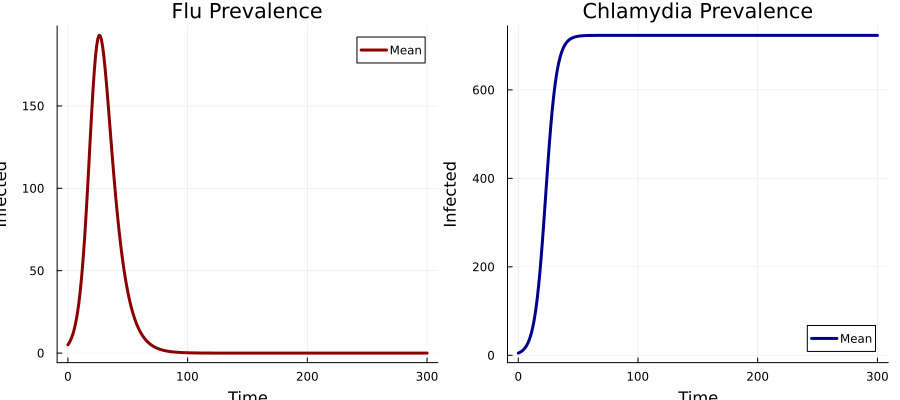

# Multi-Pathogen Composition


## Introduction

This vignette demonstrates how to compose **two different disease
models** sharing a single host population using Odin.jl’s categorical
extension. We model the co-circulation of:

- **Influenza** (SIR dynamics — epidemic with lasting immunity)
- **Chlamydia** (SIS dynamics — endemic, no lasting immunity)

The two pathogens share a susceptible pool: individuals susceptible to
one pathogen may also be susceptible to the other. We then explore a
cross-immunity coupling where recovery from one pathogen confers partial
protection against the other.

## Setup

``` julia
using Odin
using Plots
using Statistics
```

## Defining Individual Pathogen Models

### Influenza (SIR)

``` julia
flu = EpiNet(
    [:S_flu => 900.0, :I_flu => 10.0, :R_flu => 0.0],
    [:inf_flu => ([:S_flu, :I_flu] => [:I_flu, :I_flu], :beta_flu),
     :rec_flu => ([:I_flu] => [:R_flu], :gamma_flu)]
)
println("Flu: ", species_names(flu), " — ", transition_names(flu))
```

    Flu: [:S_flu, :I_flu, :R_flu] — [:inf_flu, :rec_flu]

### Chlamydia (SIS)

``` julia
chl = EpiNet(
    [:S_chl => 900.0, :I_chl => 10.0],
    [:inf_chl => ([:S_chl, :I_chl] => [:I_chl, :I_chl], :beta_chl),
     :rec_chl => ([:I_chl] => [:S_chl], :gamma_chl)]
)
println("Chlamydia: ", species_names(chl), " — ", transition_names(chl))
```

    Chlamydia: [:S_chl, :I_chl] — [:inf_chl, :rec_chl]

## Independent Circulation (No Coupling)

First, simulate each pathogen independently:

``` julia
# Flu alone
flu_gen = lower(flu; mode=:ode, frequency_dependent=true, N=:N,
                params=Dict(:beta_flu => 0.4, :gamma_flu => 0.15, :N => 1000.0))

sys_flu = dust_system_create(flu_gen, (beta_flu=0.4, gamma_flu=0.15, N=1000.0))
dust_system_set_state_initial!(sys_flu)
times = collect(0.0:0.5:200.0)
r_flu = dust_system_simulate(sys_flu, times)

# Chlamydia alone
chl_gen = lower(chl; mode=:ode, frequency_dependent=true, N=:N,
                params=Dict(:beta_chl => 0.3, :gamma_chl => 0.05, :N => 1000.0))

sys_chl = dust_system_create(chl_gen, (beta_chl=0.3, gamma_chl=0.05, N=1000.0))
dust_system_set_state_initial!(sys_chl)
r_chl = dust_system_simulate(sys_chl, times)

p = plot(layout=(1,2), size=(900, 400))
plot!(p, times, [r_flu[1,1,:] r_flu[2,1,:] r_flu[3,1,:]],
      subplot=1, label=["S" "I" "R"],
      title="Flu (SIR)", xlabel="Time", ylabel="Population", linewidth=2)
plot!(p, times, [r_chl[1,1,:] r_chl[2,1,:]],
      subplot=2, label=["S" "I"],
      title="Chlamydia (SIS)", xlabel="Time", ylabel="Population", linewidth=2)
p
```



## Coupled Two-Pathogen Model

To model co-circulation in a shared population, we need to track the
joint infection status. We build a full two-pathogen model manually with
`@odin`, since composition of pathogens sharing the same host requires
tracking individuals in all joint states (susceptible to both, infected
with flu only, infected with chlamydia only, co-infected, etc.).

### State Space

The joint states for two pathogens are:

| State | Flu status  | Chlamydia status |
|-------|-------------|------------------|
| `SS`  | Susceptible | Susceptible      |
| `IS`  | Infected    | Susceptible      |
| `SI`  | Susceptible | Infected         |
| `II`  | Infected    | Infected         |
| `RS`  | Recovered   | Susceptible      |
| `RI`  | Recovered   | Infected         |

(We track flu recovery but not chlamydia recovery since SIS returns to
susceptible.)

``` julia
two_pathogen = @odin begin
    beta_flu = parameter(0.4)
    gamma_flu = parameter(0.15)
    beta_chl = parameter(0.3)
    gamma_chl = parameter(0.05)
    N = parameter(1000.0)

    # Total infected with each pathogen (for force of infection)
    total_I_flu = IS + II
    total_I_chl = SI + II + RI

    # Forces of infection
    foi_flu = beta_flu * total_I_flu / N
    foi_chl = beta_chl * total_I_chl / N

    # SS: susceptible to both
    deriv(SS) = -foi_flu * SS - foi_chl * SS + gamma_chl * SI
    # IS: flu-infected, chl-susceptible
    deriv(IS) = foi_flu * SS - gamma_flu * IS - foi_chl * IS + gamma_chl * II
    # SI: flu-susceptible, chl-infected
    deriv(SI) = foi_chl * SS - foi_flu * SI - gamma_chl * SI
    # II: co-infected
    deriv(II) = foi_flu * SI + foi_chl * IS - gamma_flu * II - gamma_chl * II
    # RS: flu-recovered, chl-susceptible
    deriv(RS) = gamma_flu * IS - foi_chl * RS + gamma_chl * RI
    # RI: flu-recovered, chl-infected
    deriv(RI) = gamma_flu * II + foi_chl * RS - gamma_chl * RI

    initial(SS) = 880.0
    initial(IS) = 5.0
    initial(SI) = 5.0
    initial(II) = 0.0
    initial(RS) = 0.0
    initial(RI) = 0.0
end

pars = (beta_flu=0.4, gamma_flu=0.15, beta_chl=0.3, gamma_chl=0.05, N=1000.0)
sys = dust_system_create(two_pathogen, pars)
dust_system_set_state_initial!(sys)
times = collect(0.0:0.5:300.0)
result = dust_system_simulate(sys, times)

sn = [:SS, :IS, :SI, :II, :RS, :RI]
```

    6-element Vector{Symbol}:
     :SS
     :IS
     :SI
     :II
     :RS
     :RI

### Marginal Disease Prevalence

``` julia
# Marginal flu prevalence
flu_infected = result[2, 1, :] .+ result[4, 1, :]   # IS + II
chl_infected = result[3, 1, :] .+ result[4, 1, :] .+ result[6, 1, :]  # SI + II + RI

p = plot(title="Co-Circulation: Marginal Prevalence",
         xlabel="Time (days)", ylabel="Infected", linewidth=2)
plot!(p, times, flu_infected, label="Flu (SIR)", color=:red)
plot!(p, times, chl_infected, label="Chlamydia (SIS)", color=:blue)
p
```



### All Compartments

``` julia
p = plot(title="Two-Pathogen Model — All Compartments",
         xlabel="Time (days)", ylabel="Population", linewidth=2)
for (i, name) in enumerate(sn)
    plot!(p, times, result[i, 1, :], label=string(name))
end
p
```



### Population Conservation

``` julia
total = sum(result[:, 1, end])
println("Total population at t=300: $(round(total; digits=2)) (expected: 890.0)")
```

    Total population at t=300: 890.0 (expected: 890.0)

## Cross-Immunity Model

Now we add cross-immunity: recovery from flu gives partial protection
(reduced susceptibility) against chlamydia:

``` julia
two_pathogen_xi = @odin begin
    beta_flu = parameter(0.4)
    gamma_flu = parameter(0.15)
    beta_chl = parameter(0.3)
    gamma_chl = parameter(0.05)
    sigma = parameter(0.5)   # cross-immunity: 0=full, 1=none
    N = parameter(1000.0)

    total_I_flu = IS + II
    total_I_chl = SI + II + RI

    foi_flu = beta_flu * total_I_flu / N
    foi_chl = beta_chl * total_I_chl / N

    deriv(SS) = -foi_flu * SS - foi_chl * SS + gamma_chl * SI
    deriv(IS) = foi_flu * SS - gamma_flu * IS - foi_chl * IS + gamma_chl * II
    deriv(SI) = foi_chl * SS - foi_flu * SI - gamma_chl * SI
    deriv(II) = foi_flu * SI + foi_chl * IS - gamma_flu * II - gamma_chl * II
    # Cross-immunity: flu-recovered have reduced chlamydia susceptibility
    deriv(RS) = gamma_flu * IS - sigma * foi_chl * RS + gamma_chl * RI
    deriv(RI) = gamma_flu * II + sigma * foi_chl * RS - gamma_chl * RI

    initial(SS) = 880.0
    initial(IS) = 5.0
    initial(SI) = 5.0
    initial(II) = 0.0
    initial(RS) = 0.0
    initial(RI) = 0.0
end
```

    DustSystemGenerator{var"##OdinModel#310"}(var"##OdinModel#310"(6, [:SS, :IS, :SI, :II, :RS, :RI], [:beta_flu, :gamma_flu, :beta_chl, :gamma_chl, :sigma, :N], true, false, false, false, Dict{Symbol, Array}()))

### Comparing Cross-Immunity Levels

``` julia
times = collect(0.0:0.5:300.0)
sigma_values = [1.0, 0.5, 0.1]
labels = ["σ=1 (no cross-immunity)", "σ=0.5 (partial)", "σ=0.1 (strong)"]
colors_xi = [:red, :orange, :green]

p = plot(title="Chlamydia Prevalence under Cross-Immunity",
         xlabel="Time (days)", ylabel="Chlamydia infected", linewidth=2)

for (k, sigma) in enumerate(sigma_values)
    pars_xi = (beta_flu=0.4, gamma_flu=0.15, beta_chl=0.3,
               gamma_chl=0.05, sigma=sigma, N=1000.0)
    sys_xi = dust_system_create(two_pathogen_xi, pars_xi)
    dust_system_set_state_initial!(sys_xi)
    r_xi = dust_system_simulate(sys_xi, times)
    # Chlamydia infected: SI + II + RI
    chl = r_xi[3, 1, :] .+ r_xi[4, 1, :] .+ r_xi[6, 1, :]
    plot!(p, times, chl, label=labels[k], color=colors_xi[k])
end
p
```



Cross-immunity from flu recovery significantly reduces the endemic level
of chlamydia, demonstrating an indirect interaction between two
otherwise independent pathogens.

## Compositional Structure Diagram

The two-pathogen model can be understood as the composition of three
conceptual sub-models:

    ┌─────────────┐     ┌──────────────┐     ┌──────────────────┐
    │  Flu (SIR)  │     │ Chl (SIS)    │     │ Cross-immunity   │
    │  S→I→R      │ ──▶ │ S→I→S        │ ──▶ │ R_flu reduces    │
    │             │     │              │     │ Chl infection    │
    └─────────────┘     └──────────────┘     └──────────────────┘
             │                  │                      │
             └──── Shared population N ────────────────┘

While the full joint-state model requires manual construction (the
product state space is not simply the union of compartments), the
categorical `compose()` function handles the simpler case where
pathogens affect disjoint compartment sets:

``` julia
# Demonstrate: composing disjoint pathogen models
flu_disjoint = EpiNet(
    [:S_flu => 495.0, :I_flu => 5.0, :R_flu => 0.0],
    [:inf_flu => ([:S_flu, :I_flu] => [:I_flu, :I_flu], :beta_flu),
     :rec_flu => ([:I_flu] => [:R_flu], :gamma_flu)]
)

chl_disjoint = EpiNet(
    [:S_chl => 495.0, :I_chl => 5.0],
    [:inf_chl => ([:S_chl, :I_chl] => [:I_chl, :I_chl], :beta_chl),
     :rec_chl => ([:I_chl] => [:S_chl], :gamma_chl)]
)

# No shared species → acts as two independent epidemics
two_independent = compose(flu_disjoint, chl_disjoint)
println("Independent composition:")
println("  Species: ", species_names(two_independent))
println("  Transitions: ", transition_names(two_independent))

gen_ind = lower(two_independent; mode=:ode, frequency_dependent=true, N=:N,
                params=Dict(:beta_flu => 0.4, :gamma_flu => 0.15,
                            :beta_chl => 0.3, :gamma_chl => 0.05, :N => 500.0))
sys_ind = dust_system_create(gen_ind, (beta_flu=0.4, gamma_flu=0.15,
                                        beta_chl=0.3, gamma_chl=0.05, N=500.0))
dust_system_set_state_initial!(sys_ind)
r_ind = dust_system_simulate(sys_ind, times)

sn_ind = species_names(two_independent)
p = plot(title="Two Independent Pathogens (Composed)",
         xlabel="Time", ylabel="Population", linewidth=2)
for (i, name) in enumerate(sn_ind)
    plot!(p, times, r_ind[i, 1, :], label=string(name))
end
p
```

    Independent composition:
      Species: [:S_flu, :I_flu, :R_flu, :S_chl, :I_chl]
      Transitions: [:inf_flu, :rec_flu, :inf_chl, :rec_chl]



## Stochastic Co-Circulation

``` julia
sys_stoch = dust_system_create(two_pathogen, pars; n_particles=30, dt=0.25, seed=42)
dust_system_set_state_initial!(sys_stoch)
times_s = collect(0.0:1.0:300.0)
r_stoch = dust_system_simulate(sys_stoch, times_s)

p = plot(layout=(1,2), size=(900, 400),
         title=["Flu Prevalence" "Chlamydia Prevalence"])

for pi in 1:30
    flu_i = r_stoch[2, pi, :] .+ r_stoch[4, pi, :]
    chl_i = r_stoch[3, pi, :] .+ r_stoch[4, pi, :] .+ r_stoch[6, pi, :]
    plot!(p, times_s, flu_i, subplot=1, alpha=0.1, color=:red, label="")
    plot!(p, times_s, chl_i, subplot=2, alpha=0.1, color=:blue, label="")
end

# Mean trajectories
flu_mean = vec(mean(r_stoch[2, :, :] .+ r_stoch[4, :, :], dims=1))
chl_mean = vec(mean(r_stoch[3, :, :] .+ r_stoch[4, :, :] .+ r_stoch[6, :, :], dims=1))
plot!(p, times_s, flu_mean, subplot=1, color=:darkred, linewidth=3,
      label="Mean", xlabel="Time", ylabel="Infected")
plot!(p, times_s, chl_mean, subplot=2, color=:darkblue, linewidth=3,
      label="Mean", xlabel="Time", ylabel="Infected")
p
```



## Summary

| Approach | When to use | `compose()` applicable? |
|----|----|----|
| **Disjoint pathogens** | Different host species or compartments | ✅ Yes — no shared species |
| **Shared population** | Same host, independent dynamics | ⚠️ Requires joint state space |
| **Cross-immunity** | Recovery from one affects susceptibility to other | ⚠️ Requires explicit coupling |

The categorical `compose()` excels at combining disjoint sub-models. For
pathogens sharing a host population, the joint state space model must be
constructed manually, but the Petri net framework still helps reason
about the structure.
