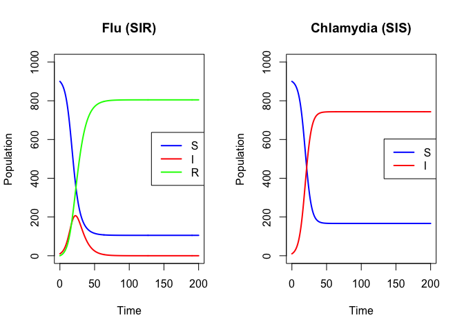
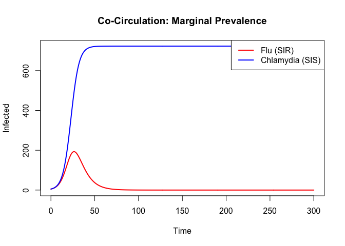
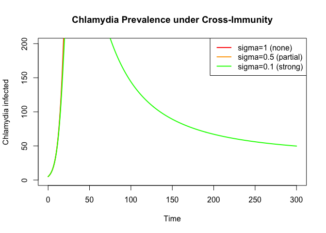

# Multi-Pathogen Composition


## Introduction

This is the R companion to the Julia multi-pathogen vignette. We build a
two-pathogen co-circulation model (influenza SIR + chlamydia SIS) using
odin2’s DSL, including cross-immunity effects.

## Setup

``` r
library(odin2)
library(dust2)
```

## Individual Pathogen Models

### Influenza (SIR)

``` r
flu <- odin({
  deriv(S) <- -beta * S * I / N
  deriv(I) <- beta * S * I / N - gamma * I
  deriv(R) <- gamma * I
  initial(S) <- 900
  initial(I) <- 10
  initial(R) <- 0
  beta <- parameter(0.4)
  gamma <- parameter(0.15)
  N <- parameter(1000)
})
```

    ✔ Wrote 'DESCRIPTION'

    ✔ Wrote 'NAMESPACE'

    ✔ Wrote 'R/dust.R'

    ✔ Wrote 'src/dust.cpp'

    ✔ Wrote 'src/Makevars'

    ℹ 13 functions decorated with [[cpp11::register]]

    ✔ generated file 'cpp11.R'

    ✔ generated file 'cpp11.cpp'

    ℹ Re-compiling odin.systemba9c81dc

    ── R CMD INSTALL ───────────────────────────────────────────────────────────────
    * installing *source* package ‘odin.systemba9c81dc’ ...
    ** this is package ‘odin.systemba9c81dc’ version ‘0.0.1’
    ** using staged installation
    ** libs
    using C++ compiler: ‘Homebrew clang version 21.1.5’
    using SDK: ‘MacOSX15.5.sdk’
    clang++ -arch arm64 -std=gnu++17 -I"/Library/Frameworks/R.framework/Resources/include" -DNDEBUG  -I'/Library/Frameworks/R.framework/Versions/4.5-arm64/Resources/library/cpp11/include' -I'/Library/Frameworks/R.framework/Versions/4.5-arm64/Resources/library/dust2/include' -I'/Library/Frameworks/R.framework/Versions/4.5-arm64/Resources/library/monty/include' -I/opt/R/arm64/include   -DHAVE_INLINE   -fPIC  -falign-functions=64 -Wall -g -O2  -Wall -pedantic  -c cpp11.cpp -o cpp11.o
    clang++ -arch arm64 -std=gnu++17 -I"/Library/Frameworks/R.framework/Resources/include" -DNDEBUG  -I'/Library/Frameworks/R.framework/Versions/4.5-arm64/Resources/library/cpp11/include' -I'/Library/Frameworks/R.framework/Versions/4.5-arm64/Resources/library/dust2/include' -I'/Library/Frameworks/R.framework/Versions/4.5-arm64/Resources/library/monty/include' -I/opt/R/arm64/include   -DHAVE_INLINE   -fPIC  -falign-functions=64 -Wall -g -O2  -Wall -pedantic  -c dust.cpp -o dust.o
    In file included from dust.cpp:69:
    In file included from /Library/Frameworks/R.framework/Versions/4.5-arm64/Resources/library/dust2/include/dust2/r/continuous/system.hpp:4:
    /Library/Frameworks/R.framework/Versions/4.5-arm64/Resources/library/monty/include/monty/r/random.hpp:60:43: warning: implicit conversion from 'type' (aka 'unsigned long') to 'double' changes value from 18446744073709551615 to 18446744073709551616 [-Wimplicit-const-int-float-conversion]
       60 |       std::ceil(std::abs(::unif_rand()) * std::numeric_limits<size_t>::max());
          |                                         ~ ^~~~~~~~~~~~~~~~~~~~~~~~~~~~~~~~~~
    /Library/Frameworks/R.framework/Versions/4.5-arm64/Resources/library/monty/include/monty/r/random.hpp:60:43: warning: implicit conversion from 'type' (aka 'unsigned long') to 'double' changes value from 18446744073709551615 to 18446744073709551616 [-Wimplicit-const-int-float-conversion]
       60 |       std::ceil(std::abs(::unif_rand()) * std::numeric_limits<size_t>::max());
          |                                         ~ ^~~~~~~~~~~~~~~~~~~~~~~~~~~~~~~~~~
    /Library/Frameworks/R.framework/Versions/4.5-arm64/Resources/library/dust2/include/dust2/r/continuous/system.hpp:34:33: note: in instantiation of function template specialization 'monty::random::r::as_rng_seed<monty::random::xoshiro_state<unsigned long long, 4, monty::random::scrambler::plus>>' requested here
       34 |   auto seed = monty::random::r::as_rng_seed<rng_state_type>(r_seed);
          |                                 ^
    dust.cpp:73:20: note: in instantiation of function template specialization 'dust2::r::dust2_continuous_alloc<odin_system>' requested here
       73 |   return dust2::r::dust2_continuous_alloc<odin_system>(r_pars, r_time, r_time_control, r_n_particles, r_n_groups, r_seed, r_deterministic, r_n_threads);
          |                    ^
    2 warnings generated.
    clang++ -arch arm64 -std=gnu++17 -dynamiclib -Wl,-headerpad_max_install_names -undefined dynamic_lookup -L/Library/Frameworks/R.framework/Resources/lib -L/opt/R/arm64/lib -o odin.systemba9c81dc.so cpp11.o dust.o -F/Library/Frameworks/R.framework/.. -framework R
    installing to /private/var/folders/yh/30rj513j6mn1n7x556c2v4w80000gn/T/RtmpuqGoMh/devtools_install_46cc1805e37c/00LOCK-dust_46cc4b12dd76/00new/odin.systemba9c81dc/libs
    ** checking absolute paths in shared objects and dynamic libraries
    * DONE (odin.systemba9c81dc)

    ℹ Loading odin.systemba9c81dc

``` r
sys <- System(flu, list(beta = 0.4, gamma = 0.15, N = 1000),
                          ode_control = dust_ode_control())
dust_system_set_state_initial(sys)
times <- seq(0, 200, by = 0.5)
r_flu <- simulate(sys, times)
```

### Chlamydia (SIS)

``` r
chl <- odin({
  deriv(S) <- -beta * S * I / N + gamma * I
  deriv(I) <- beta * S * I / N - gamma * I
  initial(S) <- 900
  initial(I) <- 10
  beta <- parameter(0.3)
  gamma <- parameter(0.05)
  N <- parameter(1000)
})
```

    ✔ Wrote 'DESCRIPTION'

    ✔ Wrote 'NAMESPACE'

    ✔ Wrote 'R/dust.R'

    ✔ Wrote 'src/dust.cpp'

    ✔ Wrote 'src/Makevars'

    ℹ 13 functions decorated with [[cpp11::register]]

    ✔ generated file 'cpp11.R'

    ✔ generated file 'cpp11.cpp'

    ℹ Re-compiling odin.systemb1293932

    ── R CMD INSTALL ───────────────────────────────────────────────────────────────
    * installing *source* package ‘odin.systemb1293932’ ...
    ** this is package ‘odin.systemb1293932’ version ‘0.0.1’
    ** using staged installation
    ** libs
    using C++ compiler: ‘Homebrew clang version 21.1.5’
    using SDK: ‘MacOSX15.5.sdk’
    clang++ -arch arm64 -std=gnu++17 -I"/Library/Frameworks/R.framework/Resources/include" -DNDEBUG  -I'/Library/Frameworks/R.framework/Versions/4.5-arm64/Resources/library/cpp11/include' -I'/Library/Frameworks/R.framework/Versions/4.5-arm64/Resources/library/dust2/include' -I'/Library/Frameworks/R.framework/Versions/4.5-arm64/Resources/library/monty/include' -I/opt/R/arm64/include   -DHAVE_INLINE   -fPIC  -falign-functions=64 -Wall -g -O2  -Wall -pedantic  -c cpp11.cpp -o cpp11.o
    clang++ -arch arm64 -std=gnu++17 -I"/Library/Frameworks/R.framework/Resources/include" -DNDEBUG  -I'/Library/Frameworks/R.framework/Versions/4.5-arm64/Resources/library/cpp11/include' -I'/Library/Frameworks/R.framework/Versions/4.5-arm64/Resources/library/dust2/include' -I'/Library/Frameworks/R.framework/Versions/4.5-arm64/Resources/library/monty/include' -I/opt/R/arm64/include   -DHAVE_INLINE   -fPIC  -falign-functions=64 -Wall -g -O2  -Wall -pedantic  -c dust.cpp -o dust.o
    In file included from dust.cpp:66:
    In file included from /Library/Frameworks/R.framework/Versions/4.5-arm64/Resources/library/dust2/include/dust2/r/continuous/system.hpp:4:
    /Library/Frameworks/R.framework/Versions/4.5-arm64/Resources/library/monty/include/monty/r/random.hpp:60:43: warning: implicit conversion from 'type' (aka 'unsigned long') to 'double' changes value from 18446744073709551615 to 18446744073709551616 [-Wimplicit-const-int-float-conversion]
       60 |       std::ceil(std::abs(::unif_rand()) * std::numeric_limits<size_t>::max());
          |                                         ~ ^~~~~~~~~~~~~~~~~~~~~~~~~~~~~~~~~~
    /Library/Frameworks/R.framework/Versions/4.5-arm64/Resources/library/monty/include/monty/r/random.hpp:60:43: warning: implicit conversion from 'type' (aka 'unsigned long') to 'double' changes value from 18446744073709551615 to 18446744073709551616 [-Wimplicit-const-int-float-conversion]
       60 |       std::ceil(std::abs(::unif_rand()) * std::numeric_limits<size_t>::max());
          |                                         ~ ^~~~~~~~~~~~~~~~~~~~~~~~~~~~~~~~~~
    /Library/Frameworks/R.framework/Versions/4.5-arm64/Resources/library/dust2/include/dust2/r/continuous/system.hpp:34:33: note: in instantiation of function template specialization 'monty::random::r::as_rng_seed<monty::random::xoshiro_state<unsigned long long, 4, monty::random::scrambler::plus>>' requested here
       34 |   auto seed = monty::random::r::as_rng_seed<rng_state_type>(r_seed);
          |                                 ^
    dust.cpp:70:20: note: in instantiation of function template specialization 'dust2::r::dust2_continuous_alloc<odin_system>' requested here
       70 |   return dust2::r::dust2_continuous_alloc<odin_system>(r_pars, r_time, r_time_control, r_n_particles, r_n_groups, r_seed, r_deterministic, r_n_threads);
          |                    ^
    2 warnings generated.
    clang++ -arch arm64 -std=gnu++17 -dynamiclib -Wl,-headerpad_max_install_names -undefined dynamic_lookup -L/Library/Frameworks/R.framework/Resources/lib -L/opt/R/arm64/lib -o odin.systemb1293932.so cpp11.o dust.o -F/Library/Frameworks/R.framework/.. -framework R
    installing to /private/var/folders/yh/30rj513j6mn1n7x556c2v4w80000gn/T/RtmpuqGoMh/devtools_install_46cc1d3977f5/00LOCK-dust_46ccfcff27f/00new/odin.systemb1293932/libs
    ** checking absolute paths in shared objects and dynamic libraries
    * DONE (odin.systemb1293932)

    ℹ Loading odin.systemb1293932

``` r
sys <- System(chl, list(beta = 0.3, gamma = 0.05, N = 1000),
                          ode_control = dust_ode_control())
dust_system_set_state_initial(sys)
r_chl <- simulate(sys, times)
```

``` r
par(mfrow = c(1, 2))
plot(times, r_flu[1, ], type = "l", col = "blue", lwd = 2,
     ylim = c(0, 1000), xlab = "Time", ylab = "Population",
     main = "Flu (SIR)")
lines(times, r_flu[2, ], col = "red", lwd = 2)
lines(times, r_flu[3, ], col = "green", lwd = 2)
legend("right", c("S", "I", "R"), col = c("blue", "red", "green"), lwd = 2)

plot(times, r_chl[1, ], type = "l", col = "blue", lwd = 2,
     ylim = c(0, 1000), xlab = "Time", ylab = "Population",
     main = "Chlamydia (SIS)")
lines(times, r_chl[2, ], col = "red", lwd = 2)
legend("right", c("S", "I"), col = c("blue", "red"), lwd = 2)
```



``` r
par(mfrow = c(1, 1))
```

## Two-Pathogen Co-Circulation

Joint state model tracking all combinations of flu × chlamydia infection
status:

``` r
two_pathogen <- odin({
  # SS: susceptible to both
  # IS: flu-infected, chl-susceptible
  # SI: flu-susceptible, chl-infected
  # II: co-infected
  # RS: flu-recovered, chl-susceptible
  # RI: flu-recovered, chl-infected

  total_I_flu <- IS + II
  total_I_chl <- SI + II + RI

  foi_flu <- beta_flu * total_I_flu / N
  foi_chl <- beta_chl * total_I_chl / N

  deriv(SS) <- -foi_flu * SS - foi_chl * SS + gamma_chl * SI
  deriv(IS) <- foi_flu * SS - gamma_flu * IS - foi_chl * IS + gamma_chl * II
  deriv(SI) <- foi_chl * SS - foi_flu * SI - gamma_chl * SI
  deriv(II) <- foi_flu * SI + foi_chl * IS - gamma_flu * II - gamma_chl * II
  deriv(RS) <- gamma_flu * IS - foi_chl * RS + gamma_chl * RI
  deriv(RI) <- gamma_flu * II + foi_chl * RS - gamma_chl * RI

  initial(SS) <- 880
  initial(IS) <- 5
  initial(SI) <- 5
  initial(II) <- 0
  initial(RS) <- 0
  initial(RI) <- 0

  beta_flu <- parameter(0.4)
  gamma_flu <- parameter(0.15)
  beta_chl <- parameter(0.3)
  gamma_chl <- parameter(0.05)
  N <- parameter(1000)
})
```

    ✔ Wrote 'DESCRIPTION'

    ✔ Wrote 'NAMESPACE'

    ✔ Wrote 'R/dust.R'

    ✔ Wrote 'src/dust.cpp'

    ✔ Wrote 'src/Makevars'

    ℹ 13 functions decorated with [[cpp11::register]]

    ✔ generated file 'cpp11.R'

    ✔ generated file 'cpp11.cpp'

    ℹ Re-compiling odin.system3270f061

    ── R CMD INSTALL ───────────────────────────────────────────────────────────────
    * installing *source* package ‘odin.system3270f061’ ...
    ** this is package ‘odin.system3270f061’ version ‘0.0.1’
    ** using staged installation
    ** libs
    using C++ compiler: ‘Homebrew clang version 21.1.5’
    using SDK: ‘MacOSX15.5.sdk’
    clang++ -arch arm64 -std=gnu++17 -I"/Library/Frameworks/R.framework/Resources/include" -DNDEBUG  -I'/Library/Frameworks/R.framework/Versions/4.5-arm64/Resources/library/cpp11/include' -I'/Library/Frameworks/R.framework/Versions/4.5-arm64/Resources/library/dust2/include' -I'/Library/Frameworks/R.framework/Versions/4.5-arm64/Resources/library/monty/include' -I/opt/R/arm64/include   -DHAVE_INLINE   -fPIC  -falign-functions=64 -Wall -g -O2  -Wall -pedantic  -c cpp11.cpp -o cpp11.o
    clang++ -arch arm64 -std=gnu++17 -I"/Library/Frameworks/R.framework/Resources/include" -DNDEBUG  -I'/Library/Frameworks/R.framework/Versions/4.5-arm64/Resources/library/cpp11/include' -I'/Library/Frameworks/R.framework/Versions/4.5-arm64/Resources/library/dust2/include' -I'/Library/Frameworks/R.framework/Versions/4.5-arm64/Resources/library/monty/include' -I/opt/R/arm64/include   -DHAVE_INLINE   -fPIC  -falign-functions=64 -Wall -g -O2  -Wall -pedantic  -c dust.cpp -o dust.o
    In file included from dust.cpp:94:
    In file included from /Library/Frameworks/R.framework/Versions/4.5-arm64/Resources/library/dust2/include/dust2/r/continuous/system.hpp:4:
    /Library/Frameworks/R.framework/Versions/4.5-arm64/Resources/library/monty/include/monty/r/random.hpp:60:43: warning: implicit conversion from 'type' (aka 'unsigned long') to 'double' changes value from 18446744073709551615 to 18446744073709551616 [-Wimplicit-const-int-float-conversion]
       60 |       std::ceil(std::abs(::unif_rand()) * std::numeric_limits<size_t>::max());
          |                                         ~ ^~~~~~~~~~~~~~~~~~~~~~~~~~~~~~~~~~
    /Library/Frameworks/R.framework/Versions/4.5-arm64/Resources/library/monty/include/monty/r/random.hpp:60:43: warning: implicit conversion from 'type' (aka 'unsigned long') to 'double' changes value from 18446744073709551615 to 18446744073709551616 [-Wimplicit-const-int-float-conversion]
       60 |       std::ceil(std::abs(::unif_rand()) * std::numeric_limits<size_t>::max());
          |                                         ~ ^~~~~~~~~~~~~~~~~~~~~~~~~~~~~~~~~~
    /Library/Frameworks/R.framework/Versions/4.5-arm64/Resources/library/dust2/include/dust2/r/continuous/system.hpp:34:33: note: in instantiation of function template specialization 'monty::random::r::as_rng_seed<monty::random::xoshiro_state<unsigned long long, 4, monty::random::scrambler::plus>>' requested here
       34 |   auto seed = monty::random::r::as_rng_seed<rng_state_type>(r_seed);
          |                                 ^
    dust.cpp:98:20: note: in instantiation of function template specialization 'dust2::r::dust2_continuous_alloc<odin_system>' requested here
       98 |   return dust2::r::dust2_continuous_alloc<odin_system>(r_pars, r_time, r_time_control, r_n_particles, r_n_groups, r_seed, r_deterministic, r_n_threads);
          |                    ^
    2 warnings generated.
    clang++ -arch arm64 -std=gnu++17 -dynamiclib -Wl,-headerpad_max_install_names -undefined dynamic_lookup -L/Library/Frameworks/R.framework/Resources/lib -L/opt/R/arm64/lib -o odin.system3270f061.so cpp11.o dust.o -F/Library/Frameworks/R.framework/.. -framework R
    installing to /private/var/folders/yh/30rj513j6mn1n7x556c2v4w80000gn/T/RtmpuqGoMh/devtools_install_46cc4d8bd06/00LOCK-dust_46cc66b923ba/00new/odin.system3270f061/libs
    ** checking absolute paths in shared objects and dynamic libraries
    * DONE (odin.system3270f061)

    ℹ Loading odin.system3270f061

``` r
pars <- list(beta_flu = 0.4, gamma_flu = 0.15,
             beta_chl = 0.3, gamma_chl = 0.05, N = 1000)
sys <- System(two_pathogen, pars, ode_control = dust_ode_control())
dust_system_set_state_initial(sys)
times <- seq(0, 300, by = 0.5)
result <- simulate(sys, times)
```

### Marginal Prevalence

``` r
flu_infected <- result[2, ] + result[4, ]
chl_infected <- result[3, ] + result[4, ] + result[6, ]

plot(times, flu_infected, type = "l", col = "red", lwd = 2,
     xlab = "Time", ylab = "Infected",
     main = "Co-Circulation: Marginal Prevalence",
     ylim = c(0, max(flu_infected, chl_infected)))
lines(times, chl_infected, col = "blue", lwd = 2)
legend("topright", c("Flu (SIR)", "Chlamydia (SIS)"),
       col = c("red", "blue"), lwd = 2)
```



## Cross-Immunity

``` r
two_pathogen_xi <- odin({
  total_I_flu <- IS + II
  total_I_chl <- SI + II + RI

  foi_flu <- beta_flu * total_I_flu / N
  foi_chl <- beta_chl * total_I_chl / N

  deriv(SS) <- -foi_flu * SS - foi_chl * SS + gamma_chl * SI
  deriv(IS) <- foi_flu * SS - gamma_flu * IS - foi_chl * IS + gamma_chl * II
  deriv(SI) <- foi_chl * SS - foi_flu * SI - gamma_chl * SI
  deriv(II) <- foi_flu * SI + foi_chl * IS - gamma_flu * II - gamma_chl * II
  deriv(RS) <- gamma_flu * IS - sigma * foi_chl * RS + gamma_chl * RI
  deriv(RI) <- gamma_flu * II + sigma * foi_chl * RS - gamma_chl * RI

  initial(SS) <- 880
  initial(IS) <- 5
  initial(SI) <- 5
  initial(II) <- 0
  initial(RS) <- 0
  initial(RI) <- 0

  beta_flu <- parameter(0.4)
  gamma_flu <- parameter(0.15)
  beta_chl <- parameter(0.3)
  gamma_chl <- parameter(0.05)
  sigma <- parameter(0.5)
  N <- parameter(1000)
})
```

    ✔ Wrote 'DESCRIPTION'

    ✔ Wrote 'NAMESPACE'

    ✔ Wrote 'R/dust.R'

    ✔ Wrote 'src/dust.cpp'

    ✔ Wrote 'src/Makevars'

    ℹ 13 functions decorated with [[cpp11::register]]

    ✔ generated file 'cpp11.R'

    ✔ generated file 'cpp11.cpp'

    ℹ Re-compiling odin.systemb51e2f70

    ── R CMD INSTALL ───────────────────────────────────────────────────────────────
    * installing *source* package ‘odin.systemb51e2f70’ ...
    ** this is package ‘odin.systemb51e2f70’ version ‘0.0.1’
    ** using staged installation
    ** libs
    using C++ compiler: ‘Homebrew clang version 21.1.5’
    using SDK: ‘MacOSX15.5.sdk’
    clang++ -arch arm64 -std=gnu++17 -I"/Library/Frameworks/R.framework/Resources/include" -DNDEBUG  -I'/Library/Frameworks/R.framework/Versions/4.5-arm64/Resources/library/cpp11/include' -I'/Library/Frameworks/R.framework/Versions/4.5-arm64/Resources/library/dust2/include' -I'/Library/Frameworks/R.framework/Versions/4.5-arm64/Resources/library/monty/include' -I/opt/R/arm64/include   -DHAVE_INLINE   -fPIC  -falign-functions=64 -Wall -g -O2  -Wall -pedantic  -c cpp11.cpp -o cpp11.o
    clang++ -arch arm64 -std=gnu++17 -I"/Library/Frameworks/R.framework/Resources/include" -DNDEBUG  -I'/Library/Frameworks/R.framework/Versions/4.5-arm64/Resources/library/cpp11/include' -I'/Library/Frameworks/R.framework/Versions/4.5-arm64/Resources/library/dust2/include' -I'/Library/Frameworks/R.framework/Versions/4.5-arm64/Resources/library/monty/include' -I/opt/R/arm64/include   -DHAVE_INLINE   -fPIC  -falign-functions=64 -Wall -g -O2  -Wall -pedantic  -c dust.cpp -o dust.o
    In file included from dust.cpp:98:
    In file included from /Library/Frameworks/R.framework/Versions/4.5-arm64/Resources/library/dust2/include/dust2/r/continuous/system.hpp:4:
    /Library/Frameworks/R.framework/Versions/4.5-arm64/Resources/library/monty/include/monty/r/random.hpp:60:43: warning: implicit conversion from 'type' (aka 'unsigned long') to 'double' changes value from 18446744073709551615 to 18446744073709551616 [-Wimplicit-const-int-float-conversion]
       60 |       std::ceil(std::abs(::unif_rand()) * std::numeric_limits<size_t>::max());
          |                                         ~ ^~~~~~~~~~~~~~~~~~~~~~~~~~~~~~~~~~
    /Library/Frameworks/R.framework/Versions/4.5-arm64/Resources/library/monty/include/monty/r/random.hpp:60:43: warning: implicit conversion from 'type' (aka 'unsigned long') to 'double' changes value from 18446744073709551615 to 18446744073709551616 [-Wimplicit-const-int-float-conversion]
       60 |       std::ceil(std::abs(::unif_rand()) * std::numeric_limits<size_t>::max());
          |                                         ~ ^~~~~~~~~~~~~~~~~~~~~~~~~~~~~~~~~~
    /Library/Frameworks/R.framework/Versions/4.5-arm64/Resources/library/dust2/include/dust2/r/continuous/system.hpp:34:33: note: in instantiation of function template specialization 'monty::random::r::as_rng_seed<monty::random::xoshiro_state<unsigned long long, 4, monty::random::scrambler::plus>>' requested here
       34 |   auto seed = monty::random::r::as_rng_seed<rng_state_type>(r_seed);
          |                                 ^
    dust.cpp:102:20: note: in instantiation of function template specialization 'dust2::r::dust2_continuous_alloc<odin_system>' requested here
      102 |   return dust2::r::dust2_continuous_alloc<odin_system>(r_pars, r_time, r_time_control, r_n_particles, r_n_groups, r_seed, r_deterministic, r_n_threads);
          |                    ^
    2 warnings generated.
    clang++ -arch arm64 -std=gnu++17 -dynamiclib -Wl,-headerpad_max_install_names -undefined dynamic_lookup -L/Library/Frameworks/R.framework/Resources/lib -L/opt/R/arm64/lib -o odin.systemb51e2f70.so cpp11.o dust.o -F/Library/Frameworks/R.framework/.. -framework R
    installing to /private/var/folders/yh/30rj513j6mn1n7x556c2v4w80000gn/T/RtmpuqGoMh/devtools_install_46cc44617829/00LOCK-dust_46cc7bde667/00new/odin.systemb51e2f70/libs
    ** checking absolute paths in shared objects and dynamic libraries
    * DONE (odin.systemb51e2f70)

    ℹ Loading odin.systemb51e2f70

``` r
sigmas <- c(1.0, 0.5, 0.1)
labels <- c("sigma=1 (none)", "sigma=0.5 (partial)", "sigma=0.1 (strong)")
cols <- c("red", "orange", "green")

plot(NULL, xlim = range(times), ylim = c(0, 200),
     xlab = "Time", ylab = "Chlamydia infected",
     main = "Chlamydia Prevalence under Cross-Immunity")

for (k in seq_along(sigmas)) {
  pars_xi <- list(beta_flu = 0.4, gamma_flu = 0.15,
                  beta_chl = 0.3, gamma_chl = 0.05,
                  sigma = sigmas[k], N = 1000)
  sys_xi <- System(two_pathogen_xi, pars_xi,
                               ode_control = dust_ode_control())
  dust_system_set_state_initial(sys_xi)
  r_xi <- simulate(sys_xi, times)
  chl_i <- r_xi[3, ] + r_xi[4, ] + r_xi[6, ]
  lines(times, chl_i, col = cols[k], lwd = 2)
}
legend("topright", labels, col = cols, lwd = 2)
```



## Summary

| Feature | Julia (Odin.jl) | R (odin2) |
|----|----|----|
| Independent pathogens | `compose(flu, chl)` | Separate models |
| Shared-population model | Manual `@odin` (joint states) | Manual DSL (joint states) |
| Cross-immunity | Parameter σ in joint model | Parameter σ in joint model |

For pathogens sharing a host population, both Julia and R require
explicit construction of the joint state space. The categorical
framework helps structure thinking even when `compose()` cannot directly
produce the joint model.
