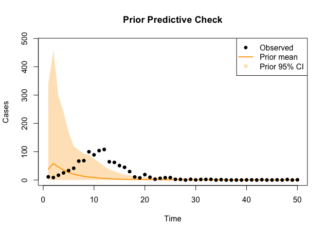
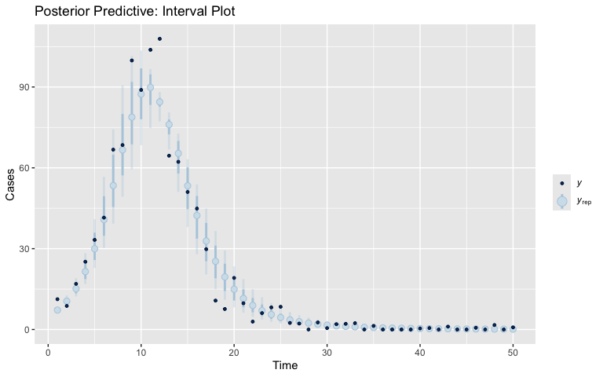
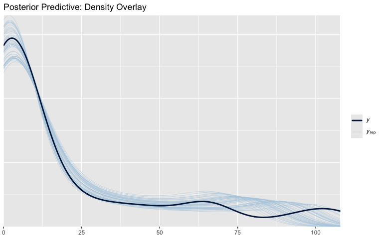
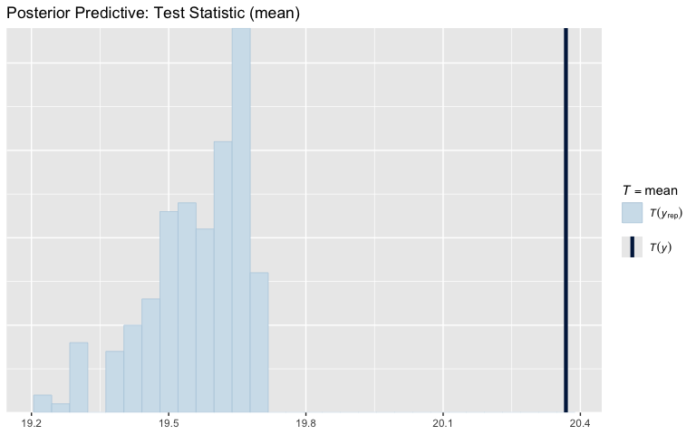
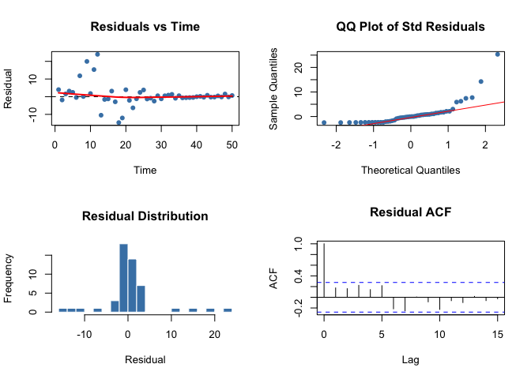
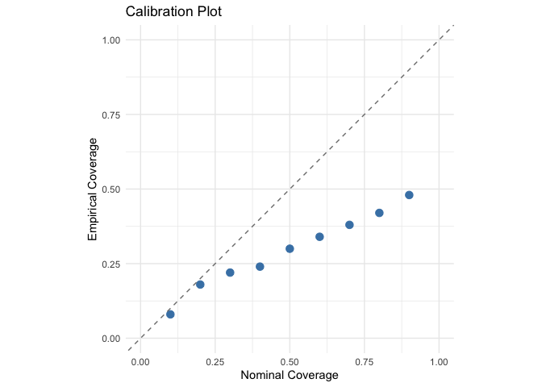

# Model Validation and Diagnostics (R)


## Overview

After fitting a model to data, we need to assess whether the fit is
adequate. This vignette demonstrates model validation in R using:

1.  **Prior predictive checks** — are the priors reasonable?
2.  **Posterior predictive checks** — does the fitted model reproduce
    the data?
3.  **Residual diagnostics** — are there systematic patterns in the
    errors?
4.  **Calibration assessment** — are the prediction intervals
    well-calibrated?

We use the `bayesplot` package for visualisation and base R for
diagnostics, applied to an SIR model fitted to synthetic data.

## Setup

``` r
library(deSolve)
library(bayesplot)
```

    This is bayesplot version 1.13.0

    - Online documentation and vignettes at mc-stan.org/bayesplot

    - bayesplot theme set to bayesplot::theme_default()

       * Does _not_ affect other ggplot2 plots

       * See ?bayesplot_theme_set for details on theme setting

``` r
library(ggplot2)
set.seed(42)
```

## Define the SIR model

``` r
sir_model <- function(t, state, pars) {
  with(as.list(c(state, pars)), {
    dS <- -beta * S * I / N
    dI <- beta * S * I / N - gamma * I
    dR <- gamma * I
    cases <- beta * S * I / N
    list(c(dS, dI, dR), cases = cases)
  })
}
```

## Generate synthetic data

We simulate from known “true” parameters and add Poisson-like noise:

``` r
N_pop <- 1000
I0 <- 10
true_pars <- c(beta = 0.5, gamma = 0.1, N = N_pop)
state0 <- c(S = N_pop - I0, I = I0, R = 0)
times <- 1:50

sim <- ode(y = state0, times = c(0, times), func = sir_model, parms = true_pars)
true_cases <- sim[-1, "cases"]

observed <- pmax(0, true_cases + rnorm(length(times)) * sqrt(abs(true_cases) + 1))

cat("Generated", length(observed), "data points\n")
```

    Generated 50 data points

``` r
cat("Peak cases at time", times[which.max(observed)], "\n")
```

    Peak cases at time 12 

## 1. Prior predictive check

Before fitting, check whether the priors produce reasonable
trajectories:

``` r
n_prior_draws <- 200
prior_pred <- matrix(NA, nrow = n_prior_draws, ncol = length(times))

for (d in seq_len(n_prior_draws)) {
  # Draw from priors: beta ~ Exp(1), gamma ~ Exp(1)
  beta_draw <- rexp(1, rate = 1)
  gamma_draw <- rexp(1, rate = 1)
  p <- c(beta = beta_draw, gamma = gamma_draw, N = N_pop)
  st <- c(S = N_pop - I0, I = I0, R = 0)
  
  sim_d <- tryCatch(
    ode(y = st, times = c(0, times), func = sir_model, parms = p),
    error = function(e) NULL
  )
  if (!is.null(sim_d)) {
    prior_pred[d, ] <- sim_d[-1, "cases"]
  }
}

# Remove failed draws
valid <- complete.cases(prior_pred)
prior_pred <- prior_pred[valid, , drop = FALSE]
cat("Valid prior draws:", sum(valid), "/", n_prior_draws, "\n")
```

    Valid prior draws: 200 / 200 

``` r
prior_mean <- colMeans(prior_pred)
prior_q025 <- apply(prior_pred, 2, quantile, 0.025)
prior_q975 <- apply(prior_pred, 2, quantile, 0.975)

cat("\nPrior predictive cases at t=25:\n")
```


    Prior predictive cases at t=25:

``` r
cat("  Mean:  ", round(prior_mean[25], 1), "\n")
```

      Mean:   0.8 

``` r
cat("  Median:", round(median(prior_pred[, 25]), 1), "\n")
```

      Median: 0 

``` r
cat("  95% CI: [", round(prior_q025[25], 1), ",",
    round(prior_q975[25], 1), "]\n")
```

      95% CI: [ 0 , 8.6 ]

``` r
plot(times, observed, pch = 16, col = "black",
     xlab = "Time", ylab = "Cases",
     main = "Prior Predictive Check",
     ylim = c(0, max(prior_q975, observed) * 1.05))
polygon(c(times, rev(times)),
        c(pmax(prior_q025, 0), rev(prior_q975)),
        col = adjustcolor("orange", alpha.f = 0.3), border = NA)
lines(times, prior_mean, col = "orange", lwd = 2)
points(times, observed, pch = 16, col = "black")
legend("topright", legend = c("Observed", "Prior mean", "Prior 95% CI"),
       col = c("black", "orange", adjustcolor("orange", 0.3)),
       pch = c(16, NA, 15), lwd = c(NA, 2, NA))
```



## 2. Fit the model (simulated posterior)

For this vignette, we simulate “posterior samples” by adding noise
around the true parameters (in practice, use MCMC via `monty`):

``` r
n_samples <- 200
n_chains <- 2
total_draws <- n_samples * n_chains

# Simulated posterior: uniform perturbation around truth
post_beta <- runif(total_draws, 0.45, 0.55)
post_gamma <- runif(total_draws, 0.08, 0.12)

cat("Posterior samples:", total_draws, "draws\n")
```

    Posterior samples: 400 draws

``` r
cat(sprintf("Beta range:  [%.3f, %.3f]\n", min(post_beta), max(post_beta)))
```

    Beta range:  [0.450, 0.550]

``` r
cat(sprintf("Gamma range: [%.3f, %.3f]\n", min(post_gamma), max(post_gamma)))
```

    Gamma range: [0.080, 0.120]

## 3. Posterior predictive check

Generate posterior predictive draws:

``` r
n_pp_draws <- min(200, total_draws)
pp_draws <- matrix(NA, nrow = n_pp_draws, ncol = length(times))

for (d in seq_len(n_pp_draws)) {
  p <- c(beta = post_beta[d], gamma = post_gamma[d], N = N_pop)
  st <- c(S = N_pop - I0, I = I0, R = 0)
  sim_d <- ode(y = st, times = c(0, times), func = sir_model, parms = p)
  pp_draws[d, ] <- sim_d[-1, "cases"]
}

# Coverage statistics
pp_mean <- colMeans(pp_draws)
pp_q025 <- apply(pp_draws, 2, quantile, 0.025)
pp_q05  <- apply(pp_draws, 2, quantile, 0.05)
pp_q25  <- apply(pp_draws, 2, quantile, 0.25)
pp_q75  <- apply(pp_draws, 2, quantile, 0.75)
pp_q95  <- apply(pp_draws, 2, quantile, 0.95)
pp_q975 <- apply(pp_draws, 2, quantile, 0.975)

coverage_50 <- mean(observed >= pp_q25 & observed <= pp_q75)
coverage_90 <- mean(observed >= pp_q05 & observed <= pp_q95)
coverage_95 <- mean(observed >= pp_q025 & observed <= pp_q975)

# Bayesian p-values
p_values <- sapply(seq_along(observed), function(i) {
  mean(pp_draws[, i] >= observed[i])
})

cat("Posterior Predictive Check Results:\n")
```

    Posterior Predictive Check Results:

``` r
cat(sprintf("  Coverage (50%% CI): %.1f%%\n", coverage_50 * 100))
```

      Coverage (50% CI): 30.0%

``` r
cat(sprintf("  Coverage (90%% CI): %.1f%%\n", coverage_90 * 100))
```

      Coverage (90% CI): 48.0%

``` r
cat(sprintf("  Coverage (95%% CI): %.1f%%\n", coverage_95 * 100))
```

      Coverage (95% CI): 52.0%

``` r
cat(sprintf("  Mean p-value:      %.3f\n", mean(p_values)))
```

      Mean p-value:      0.517

### PPC visualisation with bayesplot

``` r
ppc_intervals(y = observed, yrep = pp_draws, x = times) +
  labs(x = "Time", y = "Cases", title = "Posterior Predictive: Interval Plot")
```

    Warning: Using `size` aesthetic for lines was deprecated in ggplot2 3.4.0.
    ℹ Please use `linewidth` instead.
    ℹ The deprecated feature was likely used in the bayesplot package.
      Please report the issue at <https://github.com/stan-dev/bayesplot/issues/>.



``` r
ppc_dens_overlay(y = observed, yrep = pp_draws[1:50, ]) +
  labs(title = "Posterior Predictive: Density Overlay")
```



``` r
ppc_stat(y = observed, yrep = pp_draws, stat = "mean") +
  labs(title = "Posterior Predictive: Test Statistic (mean)")
```

    Note: in most cases the default test statistic 'mean' is too weak to detect anything of interest.

    `stat_bin()` using `bins = 30`. Pick better value `binwidth`.



## 4. Residual diagnostics

``` r
residuals <- observed - pp_mean
std_residuals <- residuals / apply(pp_draws, 2, sd)

rmse <- sqrt(mean(residuals^2))
mae  <- mean(abs(residuals))
bias <- mean(residuals)

# Autocorrelation
acf_vals <- acf(residuals, lag.max = 10, plot = FALSE)$acf[-1]

# Ljung-Box test
lb_test <- Box.test(residuals, lag = 10, type = "Ljung-Box")

cat("Residual Diagnostics:\n")
```

    Residual Diagnostics:

``` r
cat(sprintf("  RMSE:              %.2f\n", rmse))
```

      RMSE:              6.30

``` r
cat(sprintf("  MAE:               %.2f\n", mae))
```

      MAE:               3.39

``` r
cat(sprintf("  Bias:              %.3f\n", bias))
```

      Bias:              0.808

``` r
cat(sprintf("  Ljung-Box p-value: %.3f\n", lb_test$p.value))
```

      Ljung-Box p-value: 0.028

``` r
cat("\nAutocorrelation (lags 1-5):\n")
```


    Autocorrelation (lags 1-5):

``` r
for (lag in 1:5) {
  cat(sprintf("  Lag %d: %.3f\n", lag, acf_vals[lag]))
}
```

      Lag 1: 0.175
      Lag 2: 0.161
      Lag 3: 0.223
      Lag 4: 0.143
      Lag 5: 0.217

``` r
cat(sprintf("\nStandardized residuals:\n  Mean: %.3f\n  Std:  %.3f\n",
            mean(std_residuals, na.rm = TRUE), sd(std_residuals, na.rm = TRUE)))
```


    Standardized residuals:
      Mean: 0.925
      Std:  4.762

``` r
par(mfrow = c(2, 2))

# Residuals vs time
plot(times, residuals, pch = 16, col = "steelblue",
     xlab = "Time", ylab = "Residual", main = "Residuals vs Time")
abline(h = 0, lty = 2)
lines(lowess(times, residuals), col = "red", lwd = 2)

# QQ plot of standardised residuals
qqnorm(std_residuals, main = "QQ Plot of Std Residuals", pch = 16, col = "steelblue")
qqline(std_residuals, col = "red")

# Histogram of residuals
hist(residuals, breaks = 15, col = "steelblue", border = "white",
     main = "Residual Distribution", xlab = "Residual")

# ACF plot
acf(residuals, main = "Residual ACF", lag.max = 15)
```



``` r
par(mfrow = c(1, 1))
```

## 5. Calibration assessment

``` r
nominal_levels <- seq(0.1, 0.9, by = 0.1)
empirical_levels <- sapply(nominal_levels, function(level) {
  alpha <- (1 - level) / 2
  lower <- apply(pp_draws, 2, quantile, alpha)
  upper <- apply(pp_draws, 2, quantile, 1 - alpha)
  mean(observed >= lower & observed <= upper)
})

cal_error <- mean(abs(nominal_levels - empirical_levels))
is_well_calibrated <- cal_error < 0.1

cat("Calibration Check:\n")
```

    Calibration Check:

``` r
cat(sprintf("  Calibration error: %.3f\n", cal_error))
```

      Calibration error: 0.207

``` r
cat(sprintf("  Well-calibrated:   %s\n", is_well_calibrated))
```

      Well-calibrated:   FALSE

``` r
cat("\n  Nominal → Empirical:\n")
```


      Nominal → Empirical:

``` r
for (i in seq_along(nominal_levels)) {
  diff <- abs(nominal_levels[i] - empirical_levels[i])
  cat(sprintf("    %.1f → %.2f  (Δ = %.2f)\n",
              nominal_levels[i], empirical_levels[i], diff))
}
```

        0.1 → 0.08  (Δ = 0.02)
        0.2 → 0.18  (Δ = 0.02)
        0.3 → 0.22  (Δ = 0.08)
        0.4 → 0.24  (Δ = 0.16)
        0.5 → 0.30  (Δ = 0.20)
        0.6 → 0.34  (Δ = 0.26)
        0.7 → 0.38  (Δ = 0.32)
        0.8 → 0.42  (Δ = 0.38)
        0.9 → 0.48  (Δ = 0.42)

``` r
cal_df <- data.frame(nominal = nominal_levels, empirical = empirical_levels)
ggplot(cal_df, aes(x = nominal, y = empirical)) +
  geom_point(size = 3, colour = "steelblue") +
  geom_abline(slope = 1, intercept = 0, linetype = "dashed", colour = "grey50") +
  coord_equal(xlim = c(0, 1), ylim = c(0, 1)) +
  labs(x = "Nominal Coverage", y = "Empirical Coverage",
       title = "Calibration Plot") +
  theme_minimal()
```



## 6. Misspecified model demonstration

Now let’s see what happens when we use wrong parameters:

``` r
wrong_beta  <- runif(total_draws, 0.13, 0.17)
wrong_gamma <- runif(total_draws, 0.28, 0.35)

wrong_pp <- matrix(NA, nrow = n_pp_draws, ncol = length(times))
for (d in seq_len(n_pp_draws)) {
  p <- c(beta = wrong_beta[d], gamma = wrong_gamma[d], N = N_pop)
  st <- c(S = N_pop - I0, I = I0, R = 0)
  sim_d <- ode(y = st, times = c(0, times), func = sir_model, parms = p)
  wrong_pp[d, ] <- sim_d[-1, "cases"]
}
```

### Bad PPC results

``` r
wrong_mean <- colMeans(wrong_pp)
wrong_q025 <- apply(wrong_pp, 2, quantile, 0.025)
wrong_q25  <- apply(wrong_pp, 2, quantile, 0.25)
wrong_q75  <- apply(wrong_pp, 2, quantile, 0.75)
wrong_q95  <- apply(wrong_pp, 2, quantile, 0.95)
wrong_q975 <- apply(wrong_pp, 2, quantile, 0.975)

wrong_cov50 <- mean(observed >= wrong_q25 & observed <= wrong_q75)
wrong_cov90 <- mean(observed >= apply(wrong_pp, 2, quantile, 0.05) &
                     observed <= wrong_q95)
wrong_cov95 <- mean(observed >= wrong_q025 & observed <= wrong_q975)

cat("Misspecified Model — PPC:\n")
```

    Misspecified Model — PPC:

``` r
cat(sprintf("  Coverage (50%% CI): %.1f%% (expect ~50%%)\n", wrong_cov50 * 100))
```

      Coverage (50% CI): 0.0% (expect ~50%)

``` r
cat(sprintf("  Coverage (90%% CI): %.1f%% (expect ~90%%)\n", wrong_cov90 * 100))
```

      Coverage (90% CI): 0.0% (expect ~90%)

``` r
cat(sprintf("  Coverage (95%% CI): %.1f%% (expect ~95%%)\n", wrong_cov95 * 100))
```

      Coverage (95% CI): 0.0% (expect ~95%)

### Bad residual diagnostics

``` r
wrong_resid <- observed - wrong_mean
wrong_rmse <- sqrt(mean(wrong_resid^2))
wrong_bias <- mean(wrong_resid)
wrong_lb <- Box.test(wrong_resid, lag = 10, type = "Ljung-Box")

cat("Misspecified Model — Residuals:\n")
```

    Misspecified Model — Residuals:

``` r
cat(sprintf("  RMSE:  %.2f (compare correct: %.2f)\n", wrong_rmse, rmse))
```

      RMSE:  36.66 (compare correct: 6.30)

``` r
cat(sprintf("  Bias:  %.2f (compare correct: %.3f)\n", wrong_bias, bias))
```

      Bias:  20.20 (compare correct: 0.808)

``` r
cat(sprintf("  Ljung-Box p: %.3f\n", wrong_lb$p.value))
```

      Ljung-Box p: 0.000

### Bad calibration

``` r
wrong_emp <- sapply(nominal_levels, function(level) {
  alpha <- (1 - level) / 2
  lower <- apply(wrong_pp, 2, quantile, alpha)
  upper <- apply(wrong_pp, 2, quantile, 1 - alpha)
  mean(observed >= lower & observed <= upper)
})

wrong_cal_error <- mean(abs(nominal_levels - wrong_emp))
cat("Misspecified Model — Calibration:\n")
```

    Misspecified Model — Calibration:

``` r
cat(sprintf("  Calibration error: %.3f (compare correct: %.3f)\n",
            wrong_cal_error, cal_error))
```

      Calibration error: 0.500 (compare correct: 0.207)

``` r
cat(sprintf("  Well-calibrated:   %s\n", wrong_cal_error < 0.1))
```

      Well-calibrated:   FALSE

## 7. Prior vs posterior width comparison

A key sanity check: the posterior predictive should be narrower than the
prior predictive:

``` r
prior_width <- prior_q975 - prior_q025
post_width  <- pp_q975 - pp_q025

cat("95% CI width comparison at selected times:\n")
```

    95% CI width comparison at selected times:

``` r
for (t_idx in c(5, 15, 25, 35, 45)) {
  if (t_idx <= length(times)) {
    cat(sprintf("  t=%g: prior=%.1f, posterior=%.1f\n",
                times[t_idx], prior_width[t_idx], post_width[t_idx]))
  }
}
```

      t=5: prior=168.9, posterior=19.7
      t=15: prior=24.3, posterior=26.3
      t=25: prior=8.6, posterior=6.4
      t=35: prior=3.9, posterior=1.2
      t=45: prior=1.6, posterior=0.3

``` r
n_narrower <- sum(post_width < prior_width)
cat(sprintf("\nPosterior narrower at %d/%d time points\n", n_narrower, length(times)))
```


    Posterior narrower at 41/50 time points

## Summary

| Diagnostic        | Good Model | Bad Model  | R Tools               |
|-------------------|------------|------------|-----------------------|
| 95% Coverage      | ~95%       | Much lower | Manual quantiles      |
| RMSE              | Low        | High       | `sqrt(mean(resid^2))` |
| Bias              | ~0         | Large      | `mean(resid)`         |
| Autocorrelation   | Low        | High       | `acf()`, `Box.test()` |
| Calibration error | \<0.1      | \>0.1      | Manual quantiles      |
| PPC plots         | —          | —          | `bayesplot::ppc_*()`  |

The `bayesplot` package (Gabry, Simpson, Vehtari, Betancourt, Gelman,
2019) provides the most comprehensive R visualisation for posterior
predictive checks.
